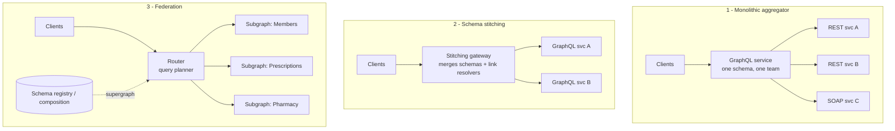
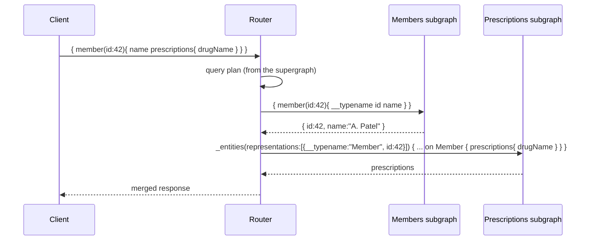

# Federation vs Schema Stitching

!!! abstract "TL;DR"
    - Three ways to build one graph over many services: a **monolithic aggregator** (one GraphQL service calling REST backends, like the OptumRx Consumer Service), **schema stitching** (a gateway merges remote GraphQL schemas plus hand-written links), and **federation** (each team owns a **subgraph**, and a **router** composes a **supergraph** and plans queries).
    - **Federation (Apollo Federation v2)**: entities with `@key` can be **extended across subgraphs**. The router resolves them via the `_entities` query. Composition is checked at build time.
    - Spring for GraphQL supports subgraphs via **`FederationSchemaFactory` + `@EntityMapping`**. DGS supports federation natively.
    - Choose by **team topology**: one team owning integration → aggregator; many domain teams owning parts of the graph → federation.
    - Federation's costs: a router to operate, query-planning overhead, distributed ownership governance, and N+1 across subgraphs (mitigated by batched `_entities` calls).

## Why it matters

"Why didn't you use federation?" is a natural senior follow-up to "I owned a GraphQL integration layer over 5 upstream systems". You need a reasoned answer either way.

## Core concepts

### Three architectures


*Notice where knowledge of relationships lives: in the aggregator's code (1), in gateway glue code (2), or declaratively inside each subgraph's schema (3).*

### Federation mechanics

Each subgraph declares the entities it owns or extends:

```graphql
# Members subgraph
type Member @key(fields: "id") {
  id: ID!
  name: String!
}

# Prescriptions subgraph: adds a field to Member without owning it
type Member @key(fields: "id") {
  id: ID!
  prescriptions: [Prescription!]!
}
type Prescription @key(fields: "id") {
  id: ID!
  drugName: String!
}
```


*Notice that the router passes entity "representations" (`__typename` + key fields) to the subgraph that extends the entity. Lists are batched into one `_entities` call per subgraph per step.*

Key Federation v2 directives: `@key` (entity identity), `@shareable` (field resolvable by multiple subgraphs), `@external` / `@requires` (needs fields from another subgraph), `@provides`, `@override` (migrate field ownership), `@inaccessible`, `@tag`.

### Comparison

| | Monolithic aggregator | Schema stitching | Federation |
|---|---|---|---|
| Ownership | One team | Gateway team + service teams | Each domain team owns its subgraph |
| Backends | Anything (REST, SOAP, DB) | GraphQL services | GraphQL subgraphs |
| Relationships | Code in resolvers | Glue code at the gateway | Declarative (`@key`) |
| Composition checks | Compile/test | Weak | Build-time composition + registry |
| Ops complexity | Low | Medium | Higher (router, registry, CI checks) |
| Best for | One integration team, heterogeneous legacy backends | Small number of GraphQL services, legacy setups | Many teams, large graph, independent deploys |

Router options: Apollo Router (Rust), Apollo Gateway (Node, legacy), Cosmo Router (WunderGraph), Hive Gateway, Netflix's own gateway.

## In practice: code & configuration

Spring for GraphQL subgraph:

```java
@Configuration
class FederationConfig {
    @Bean
    FederationSchemaFactory schemaFactory() { return new FederationSchemaFactory(); }

    @Bean
    GraphQlSourceBuilderCustomizer federation(FederationSchemaFactory factory) {
        return builder -> builder.schemaFactory(factory::createGraphQLSchema);
    }
}

@Controller
class MemberEntityController {
    @EntityMapping                           // resolves _entities for type Member
    Member member(@Argument String id) {     // key field from the representation
        return memberService.find(id);
    }

    @BatchMapping                            // batch prescriptions for many members
    Map<Member, List<Prescription>> prescriptions(List<Member> members) {
        return rxService.byMembers(members);
    }
}
```

Composing and checking in CI (Apollo Rover example):

```bash
rover subgraph check my-graph@prod --name prescriptions --schema ./schema.graphqls   # breaking-change check vs client ops
rover subgraph publish my-graph@prod --name prescriptions --schema ./schema.graphqls --routing-url https://rx.internal/graphql
```

## Real-world usage

- **Netflix** moved from a monolithic GraphQL API to **Studio Edge federation** with many DGS subgraphs owned by domain teams.
- **Expedia, Walmart and others** use federation so dozens of teams contribute to one graph without a central bottleneck team.
- **Aggregator stays valid:** when backends are REST/SOAP owned by other organisations (as with upstream healthcare systems), one integration team owning a single GraphQL service is simpler and often right.

## Trade-offs & production gotchas

!!! warning "Gotchas"
    - Federation with **few teams** adds more infrastructure than value.
    - **Entity fan-out:** deep cross-subgraph queries create many sequential router→subgraph hops. Watch query plans and latency.
    - Subgraphs must handle **`_entities` batches** efficiently (DataLoader), or you get N+1 at the subgraph level.
    - **Security:** subgraphs must only accept traffic from the router (network policy/mTLS) and still enforce authorisation.
    - Schema stitching is largely legacy. Most new multi-team graphs use federation.

## How this connects to my experience

- **Where I used it:** the OptumRx GraphQL Consumer Service (a single aggregator over 5 upstream systems, not federated, *[confirm]*).
- **Talking points:**
    - Why an aggregator fit: one owning team, heterogeneous non-GraphQL upstreams, consistent cross-cutting concerns (auth, caching, error mapping). *[confirm]*
    - When I'd move to federation: multiple domain teams wanting to own parts of the graph, independent release cadence, graph growing beyond one team's ownership.
    - Micro-frontends parallel: I split the front end by domain (micro-frontends). Federation is the API-side equivalent.
- **Likely follow-up chain:** "Did you use federation?" → "Why not?" → "When would you?" → "How does an entity resolve across subgraphs?"

## Interview questions

### Fundamentals

??? question "Q1. What is GraphQL federation?"
    **Answer:** An architecture where multiple services (subgraphs) each own part of a schema. A router composes them into a supergraph and plans queries across subgraphs. Entities marked with `@key` can be extended by multiple subgraphs.

??? question "Q2. What's the difference between schema stitching and federation?"
    **Answer:** Stitching merges remote schemas at the gateway with glue code to link types, so relationships live in the gateway. Federation makes relationships declarative inside each subgraph (`@key`, entity references), with composition validated by tooling. That supports independent team ownership.

### Intermediate

??? question "Q3. How does the router resolve a field that lives in another subgraph?"
    **Answer:** It fetches the entity's key fields from the owning subgraph, then calls `_entities(representations: [{__typename, key...}])` on the subgraph that contributes the field, and merges the results. It's batched per step.

??? question "Q4. How do you implement a subgraph in Spring?"
    **Answer:** Add federation-jvm, register `FederationSchemaFactory` via `GraphQlSourceBuilderCustomizer`, annotate entity resolvers with `@EntityMapping`, and use `@BatchMapping` for efficient batched fields.

### Senior

??? question "Q5. When would you choose a monolithic GraphQL aggregator over federation?"
    **Answer:** A single integration team, non-GraphQL upstreams owned by other orgs or legacy systems, a modest schema size, and a need for consistent cross-cutting logic. Federation pays off with many domain teams, a large graph and independent deploy cadence.

??? question "Q6. How would you migrate a monolithic GraphQL service to federation?"
    **Answer:** Make the existing service the first subgraph behind a router (no client change). Extract domains one at a time into new subgraphs, using `@override` to move field ownership gradually. Add a schema registry with CI checks against client operations. Monitor query plans and latency. Keep cross-cutting auth consistent.

??? question "Q7. Federation performance concerns?"
    **Answer:** Query-plan depth (sequential hops), `_entities` N+1 inside subgraphs, router overhead, and large payloads between router and subgraphs. Mitigate with entity batching, `@provides` to avoid extra hops, co-locating hot relationships, and caching at the subgraph level.

### Scenario-based

??? question "Q8. Two teams both want to define `Member.address`. How does federation handle it and what do you decide?"
    **Answer:** By default, a field must have a single owner, or be marked `@shareable` if both can resolve it consistently. Decide on ownership (the member domain owns the address), use `@shareable` only if both truly return identical data, and use `@override` to migrate ownership if needed. Governance and review settle conflicts before composition.

## Cheat sheet

| Concept | Remember |
|---|---|
| Aggregator | One service, any backends, one team |
| Stitching | Gateway merges + glue code (legacy) |
| Federation | Subgraphs + router + supergraph |
| Entity | `@key`, resolved via `_entities` |
| Spring | `FederationSchemaFactory` + `@EntityMapping` |
| Choose by | Team topology and graph size |

## Sources

1. [Apollo Federation documentation](https://www.apollographql.com/docs/graphos/schema-design/federated-schemas/federation) and the [Subgraph specification](https://www.apollographql.com/docs/graphos/reference/federation/subgraph-spec).
2. [Spring for GraphQL: Federation](https://docs.spring.io/spring-graphql/reference/federation.html).
3. [Netflix Tech Blog: How Netflix Scales its API with GraphQL Federation](https://netflixtechblog.com/how-netflix-scales-its-api-with-graphql-federation-part-1-ae3557c187e2).
4. [The Guild: Schema stitching vs federation](https://the-guild.dev/graphql/stitching/handbook/appendices/stitching-versus-federation).
