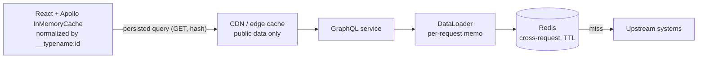
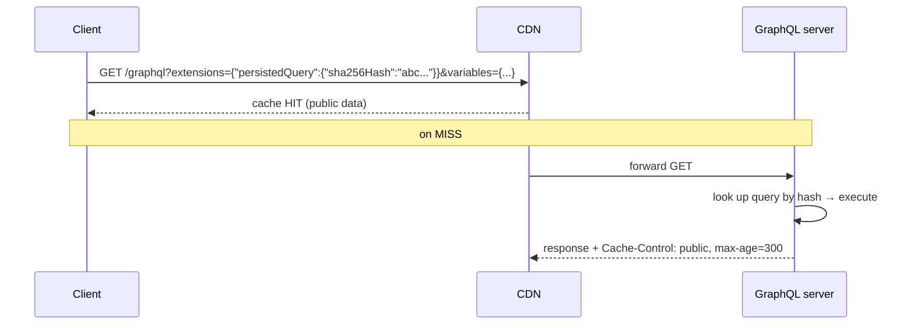

# Caching in GraphQL (Client, Server, Persisted Queries)

!!! abstract "TL;DR"
    - GraphQL loses easy HTTP caching (one URL, POST, varied queries), so you cache **at other layers**.
    - **Client:** normalized caches (Apollo Client `InMemoryCache`, Relay) keyed by `__typename:id`. Mutations returning updated objects refresh the UI automatically.
    - **Server per request:** DataLoader memoisation. **Server cross-request:** Redis/Caffeine caching of **upstream results** (reference data, slow lookups) at the resolver or client-adapter level.
    - **Response / CDN caching:** possible with **persisted queries** sent via **GET** (stable URLs) plus `Cache-Control` derived from field-level hints, mostly for public or non-user-specific data.
    - In healthcare, **never cache user-specific (PHI) data in shared caches without user-scoped keys, TTLs and encryption**. Prefer caching reference data.

## Why it matters

My resume says "Implemented Redis-based caching for frequently accessed queries and UI reference data" in the GraphQL service. Expect "what exactly did you cache, how did you invalidate it, and how did you avoid stale or wrong-user data?"

## Core concepts

### Cache layers


*Notice that each layer caches something different: entities in the browser, whole responses at the edge, de-duplicated loads per request, and upstream results across requests.*

### What to cache server-side

| Data | Cache? | TTL / invalidation |
|---|---|---|
| Reference data (drug catalogue, plan types, pharmacy directory, UI config/labels) | ✅ Yes | Long TTL (hours) + event/admin-triggered eviction |
| Expensive aggregate lookups (formulary checks) | ✅ Often | Short TTL (minutes), keyed by inputs |
| User-specific data (prescriptions, claims) | ⚠️ Carefully | Short TTL, user-scoped keys, encryption, or don't cache |
| Rapidly changing state (order status) | ❌ Usually not | Use events/subscriptions instead |

### Caching patterns

- **Cache-aside** (most common): check Redis → on miss call upstream → store with a TTL.
- **Refresh-ahead / stale-while-revalidate:** serve slightly stale data while refreshing in the background. Good for reference data.
- **Event-driven invalidation:** consume upstream change events (Kafka) to evict or update keys.
- **Stampede protection:** a lock (single-flight) or probabilistic early refresh so a hot key's expiry doesn't flood the upstream.

### Persisted queries and HTTP caching


*Notice that persisting queries turns a large POST body into a short, stable GET URL that CDNs and browsers can cache. It's also a security win, since only known operations are allowed.*

- **APQ (automatic persisted queries):** the client sends a hash, and if the server doesn't know it, the client resends the full query once to register.
- **Trusted documents / allow-listing:** queries are registered at build time, and the server rejects unknown ones (stronger security).

### Client-side normalized cache

Apollo Client stores each object once (`Prescription:rx-1`). When a mutation returns `{ id, status }` for `rx-1`, every component showing that prescription updates without refetching. Requirements: return `id` + `__typename` and the changed fields from mutations, and configure `keyFields` for types with non-`id` keys.

## In practice: code & configuration

Spring Cache with Redis for reference data at the upstream-client level:

```java
@Configuration
@EnableCaching
class CacheConfig {
    @Bean
    RedisCacheManagerBuilderCustomizer ttls() {
        return builder -> builder
            .withCacheConfiguration("drugCatalog",
                RedisCacheConfiguration.defaultCacheConfig().entryTtl(Duration.ofHours(6)))
            .withCacheConfiguration("pharmacyById",
                RedisCacheConfiguration.defaultCacheConfig().entryTtl(Duration.ofMinutes(30)));
    }
}

@Component
class PharmacyClient {
    @Cacheable(cacheNames = "pharmacyById", key = "#id", sync = true)   // sync = single-flight per instance
    public Pharmacy get(String id) { return restClient.get().uri("/pharmacies/{id}", id).retrieve().body(Pharmacy.class); }

    @CacheEvict(cacheNames = "pharmacyById", key = "#event.pharmacyId()")
    @KafkaListener(topics = "pharmacy-updated")
    public void onPharmacyUpdated(PharmacyUpdated event) { }             // event-driven invalidation
}
```

Batch-friendly caching (works with DataLoader):

```java
Map<String, Pharmacy> getByIds(Set<String> ids) {
    List<String> keys = ids.stream().map(id -> "pharmacy:" + id).toList();
    List<Pharmacy> cached = redis.opsForValue().multiGet(keys);           // one round-trip
    // collect misses → one bulk upstream call → pipeline SET with TTL → merge
}
```

Apollo Client APQ + GET:

```ts
import { createPersistedQueryLink } from "@apollo/client/link/persisted-queries";
import { sha256 } from "crypto-hash";
const link = createPersistedQueryLink({ sha256, useGETForHashedQueries: true }).concat(httpLink);
```

=== "❌ Common mistake"
    ```java
    @Cacheable(cacheNames = "memberDashboard", key = "#memberId")     // whole user response cached,
    MemberDashboard dashboard(String memberId) { ... }                // no auth scoping, long default TTL
    ```

=== "✅ Correct approach"
    ```java
    // Cache shared reference data and upstream lookups; compose user-specific responses per request.
    @Cacheable(cacheNames = "drugCatalog", key = "#ndc")
    Drug drug(String ndc) { ... }
    ```

## Real-world usage

- **Shopify / GitHub** rely on client-side normalized caches and persisted queries for performance.
- **Public catalogue graphs** (e-commerce product pages) use persisted GET queries + CDN caching with `Cache-Control` derived from schema-level cache hints.
- **Healthcare:** reference data (drug catalogue, plan rules, UI labels) is the safe, high-value caching target. User PHI is minimised in caches, with TTLs and encryption at rest (e.g. ElastiCache encryption + AUTH/TLS).

## Trade-offs & production gotchas

| Layer | Pro | Con |
|---|---|---|
| Client normalized cache | Instant UI, fewer requests | Cache-consistency logic on the client |
| DataLoader | Dedupe per request, no staleness | No cross-request benefit |
| Redis | Big latency and upstream-load win | Invalidation, stampedes, extra infra |
| CDN + persisted queries | Edge speed | Only for public/shared data; needs GET |

!!! warning "Gotchas"
    - Cache keys missing **auth scope** (user, tenant, role) leak data across users.
    - Caching **errors or nulls** from an upstream outage (negative caching) can pin bad data. Use short TTLs for negatives.
    - **Thundering herd** on hot key expiry. Use `sync = true`, locks, or jittered TTLs.
    - **Serialization:** JDK serialization in Redis is brittle across deploys. Use JSON with explicit types.

## How this connects to my experience

- **Where I used it:** OptumRx GraphQL Consumer Service: "Implemented Redis-based caching for frequently accessed queries and UI reference data."
- **Talking points:**
    - What was cached: reference data and frequently accessed upstream query results, with TTLs per data type. *[confirm specifics]*
    - Invalidation approach (TTL, events, admin evict). *[confirm]*
    - PHI considerations: user-scoped keys or none, encryption, TTL. *[confirm]*
    - Impact on latency and upstream load. *[confirm numbers]*
- **Likely follow-up chain:** "What did you cache?" → "How did you invalidate?" → "Stampede?" → "How did you make sure one user never saw another's data?" → "Why not CDN caching?"

## Interview questions

### Fundamentals

??? question "Q1. Why is HTTP caching harder for GraphQL than REST?"
    **Answer:** GraphQL usually uses one URL with POST bodies that vary per query, so HTTP caches (browser/CDN) can't key on them. Responses also mix data with different freshness and privacy. Persisted queries over GET restore cacheable URLs for suitable data.

??? question "Q2. What is a normalized client cache?"
    **Answer:** The client stores each entity once, keyed by type and ID, and assembles query results from those records. Updates to an entity (e.g. from a mutation response) automatically update every view that references it.

### Intermediate

??? question "Q3. What are persisted queries and their benefits?"
    **Answer:** Queries registered by hash. Clients send the hash (and variables) instead of the full text, which means smaller requests, cacheable GET URLs and (with allow-listing) only approved operations, a security benefit.

??? question "Q4. DataLoader cache vs Redis cache?"
    **Answer:** DataLoader dedupes and memoises within a single request (no staleness, no invalidation). Redis caches across requests and instances (big savings, but TTL and invalidation design and data-privacy concerns).

??? question "Q5. How do you invalidate cached reference data?"
    **Answer:** A TTL as the baseline. Event-driven eviction on change events (Kafka) for freshness. An admin or ops evict endpoint for emergencies. For versioned datasets, version the keys (`catalog:v42:*`) and switch versions atomically.

### Senior

??? question "Q6. How do you prevent a cache stampede on a hot key?"
    **Answer:** Single-flight (one loader per key: `@Cacheable(sync = true)` per instance, or a Redis lock across instances), jittered TTLs, probabilistic early refresh, or stale-while-revalidate with background refresh.

??? question "Q7. How would you cache user-specific data safely in a healthcare app?"
    **Answer:** Prefer not to. If needed: keys include the user/tenant ID and authorisation scope, short TTLs, encryption in transit and at rest, no PHI in logs or keys (hash IDs), and eviction on relevant events. Document it in the threat model and compliance review.

### Scenario-based

??? question "Q8. After a deploy, users see outdated plan details for hours. What happened and how do you fix it?"
    **Answer:** A long TTL with no invalidation on plan updates, or changed serialization causing stale reads, or keys not versioned with schema changes. Fix: event-driven eviction or versioned keys, shorter TTLs for that data, a cache-flush step in the deploy runbook for schema changes, and staleness monitoring.

## Cheat sheet

| Layer | Use for |
|---|---|
| Apollo/Relay cache | UI consistency, fewer requests |
| DataLoader | Per-request dedupe |
| Redis | Reference data, slow upstream lookups |
| Persisted queries + GET + CDN | Public/shared responses |
| Always | Auth-scoped keys, TTLs, stampede protection, no PHI leaks |

## Sources

1. [graphql.org: Caching](https://graphql.org/learn/caching/).
2. [Apollo Client: Caching overview](https://www.apollographql.com/docs/react/caching/overview) and [Automatic persisted queries](https://www.apollographql.com/docs/apollo-server/performance/apq).
3. [Spring Boot: Caching with Redis](https://docs.spring.io/spring-boot/reference/io/caching.html#io.caching.provider.redis).
4. [AWS: Caching best practices](https://aws.amazon.com/caching/best-practices/).
5. [GraphQL over HTTP specification](https://graphql.github.io/graphql-over-http/draft/): GET requests and caching.
