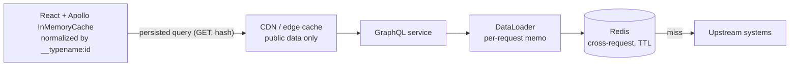
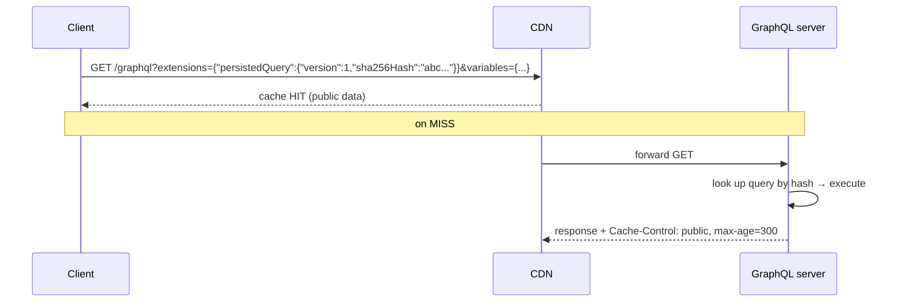

# Caching in GraphQL (Client, Server, Persisted Queries)

!!! abstract "Key takeaways"
    - GraphQL loses easy HTTP caching (one URL, POST, varied queries), so you cache **at other layers**.
    - **Client:** normalized caches (Apollo Client `InMemoryCache`, Relay) keyed by `__typename:id`. Mutations returning updated objects refresh the UI automatically.
    - **Server per request:** DataLoader memoisation. **Server cross-request:** Redis/Caffeine caching of **upstream results** (reference data, slow lookups) at the resolver or client-adapter level.
    - **Response / CDN caching:** possible with **persisted queries** sent via **GET** (stable URLs) plus `Cache-Control` derived from field-level hints (an Apollo Server feature, `@cacheControl`), mostly for public or non-user-specific data. Spring for GraphQL's HTTP transport is **POST-only**, so on a Spring stack this needs a gateway/router or a custom GET endpoint in front.
    - In healthcare, **never cache user-specific (PHI) data in shared caches without user-scoped keys, TTLs and encryption**. Prefer caching reference data.

## Why it matters

My resume says "Implemented Redis-based caching for frequently accessed queries and UI reference data" in the GraphQL service. Expect "what exactly did you cache, how did you invalidate it, and how did you avoid stale or wrong-user data?"

## Core concepts

### Cache layers


*Notice that each layer caches something different: entities in the browser, whole responses at the edge, de-duplicated loads per request, and upstream results across requests.*

### What to cache server-side

| Data | Cache? | TTL / invalidation |
|---|---|---|
| Reference data (drug catalogue, plan types, pharmacy directory, UI config/labels) | ✅ Yes | Long TTL (hours) + event/admin-triggered eviction |
| Expensive aggregate lookups (formulary checks) | ✅ Often | Short TTL (minutes), keyed by inputs |
| User-specific data (prescriptions, claims) | ⚠️ Carefully | Short TTL, user-scoped keys, encryption, or don't cache |
| Rapidly changing state (order status) | ❌ Usually not | Use events/subscriptions instead |

### Caching patterns

- **Cache-aside** (most common): check Redis → on miss call upstream → store with a TTL.
- **Refresh-ahead / stale-while-revalidate:** serve slightly stale data while refreshing in the background. Good for reference data.
- **Event-driven invalidation:** consume upstream change events (Kafka) to evict or update keys.
- **Stampede protection:** a lock (single-flight) or probabilistic early refresh so a hot key's expiry doesn't flood the upstream.

### Persisted queries and HTTP caching


*Notice that persisting queries turns a large POST body into a short, stable GET URL that CDNs and browsers can cache. It's also a security win, since only known operations are allowed.*

- **APQ (automatic persisted queries):** the client sends only a SHA-256 hash of the query. If the server doesn't know it, it answers with a `PersistedQueryNotFound` error (code `PERSISTED_QUERY_NOT_FOUND`), and the client resends the hash **plus** the full query once so the server can register it. APQ is a **performance** feature only: any client can still register any query, so it is not a security control.
- **Trusted documents / allow-listing (persisted documents):** queries are extracted at build time into a manifest, and the server rejects anything not in it. This is the variant that gives the security benefit.
- **`Cache-Control` from hints (Apollo Server):** each field/type can carry `@cacheControl(maxAge, scope)`. The response's `max-age` is the **lowest** `maxAge` of any field in it, and the response is `private` if **any** field is `PRIVATE`. Root fields and object-typed fields default to `maxAge: 0`, so one un-annotated field makes the whole response uncacheable. That is why response caching only suits queries that touch purely public data.
- **On a Spring stack:** GraphQL Java ships `ApolloPersistedQuerySupport` (a `PreparsedDocumentProvider`) with a `PersistedQueryCache`, so the server can resolve hashes. But Spring for GraphQL's HTTP handler accepts **only POST with a JSON body**, and it has no cache-hint mechanism. GET + CDN caching therefore needs an edge component (Apollo Router/gateway, API gateway) or a custom controller. Separately, a `PreparsedDocumentProvider` backed by Caffeine is worth having anyway: it caches the **parsed and validated document**, not the response.

### Client-side normalized cache

Apollo Client stores each object once (`Prescription:rx-1`). When a mutation returns `{ id, status }` for `rx-1`, every component showing that prescription updates without refetching. Requirements: return `id` + `__typename` and the changed fields from mutations, and configure `keyFields` (in `typePolicies`) for types with non-`id` keys. By default Apollo uses `__typename` plus `id` (or `_id`). Objects with no identifier are not normalized and are stored inside their parent.

The automatic update covers **changes to entities already in the cache**. It does not cover membership of lists: after a create or delete, a cached `prescriptions` list doesn't know it should gain or lose an item. For that you use an `update` function (`cache.modify` / `cache.writeQuery`), `cache.evict`, or `refetchQueries`. Fetch policies (`cache-first` is the default, `cache-and-network`, `network-only`) decide when the cache is trusted.

## In practice: code & configuration

Spring Cache with Redis for reference data at the upstream-client level:

```java
@Configuration
@EnableCaching
class CacheConfig {
    @Bean
    RedisCacheManagerBuilderCustomizer ttls() {
        // defaultCacheConfig() = no expiry, JDK serialization, null values cached. Override all three.
        RedisCacheConfiguration base = RedisCacheConfiguration.defaultCacheConfig()
            .serializeValuesWith(RedisSerializationContext.SerializationPair.fromSerializer(RedisSerializer.json()))
            .disableCachingNullValues();
        return builder -> builder
            .withCacheConfiguration("drugCatalog", base.entryTtl(Duration.ofHours(6)))
            .withCacheConfiguration("pharmacyById", base.entryTtl(Duration.ofMinutes(30)));
    }
}

@Component
class PharmacyClient {
    private final RestClient restClient;
    PharmacyClient(RestClient restClient) { this.restClient = restClient; }

    @Cacheable(cacheNames = "pharmacyById", key = "#id", sync = true)   // sync = single-flight per instance
    public Pharmacy get(String id) { return restClient.get().uri("/pharmacies/{id}", id).retrieve().body(Pharmacy.class); }

    @CacheEvict(cacheNames = "pharmacyById", key = "#event.pharmacyId()")
    @KafkaListener(topics = "pharmacy-updated")
    public void onPharmacyUpdated(PharmacyUpdated event) { }             // event-driven invalidation
}
```

Three things to know about this snippet. `RedisCacheConfiguration.defaultCacheConfig()` has **no TTL** (entries live forever) unless you set `entryTtl` or `spring.cache.redis.time-to-live`. `sync = true` only serialises loads **inside one JVM**, so with N pods you can still get N concurrent upstream calls. And `@Cacheable`/`@CacheEvict` work through a Spring proxy, so a call from another method of the **same class** (`this.get(id)`) bypasses the cache entirely.

Batch-friendly caching (works with DataLoader):

```java
// redis is a RedisTemplate<String, Pharmacy> with a JSON value serializer
Map<String, Pharmacy> getByIds(Set<String> ids) {
    List<String> idList = List.copyOf(ids);
    List<String> keys = idList.stream().map(id -> "pharmacy:" + id).toList();
    List<Pharmacy> cached = redis.opsForValue().multiGet(keys);           // one round-trip (MGET), null per miss, same order as keys

    Map<String, Pharmacy> result = new HashMap<>();
    Set<String> misses = new HashSet<>();
    for (int i = 0; i < idList.size(); i++) {
        Pharmacy p = cached.get(i);
        if (p != null) result.put(idList.get(i), p); else misses.add(idList.get(i));
    }
    if (!misses.isEmpty()) {
        Map<String, Pharmacy> loaded = upstream.getPharmacies(misses);    // one bulk upstream call
        loaded.forEach((id, p) -> redis.opsForValue().set("pharmacy:" + id, p, Duration.ofMinutes(30)));  // pipeline these if the batch is large
        result.putAll(loaded);
    }
    return result;
}
```

`@Cacheable` on a batch method is the wrong tool here: it would cache the whole `Set<String> → Map` call under one key, so two requests with overlapping but different ID sets never share entries. Per-entity keys with `MGET` do.

Resolving APQ hashes and caching parsed documents on the server (GraphQL Java, wired through Spring Boot's customizer):

```java
@Bean
GraphQlSourceBuilderCustomizer persistedQueries() {
    PreparsedDocumentProvider provider =
        new ApolloPersistedQuerySupport(new InMemoryPersistedQueryCache(Collections.emptyMap()));
    return builder -> builder.configureGraphQl(graphQl -> graphQl.preparsedDocumentProvider(provider));
}
```

`InMemoryPersistedQueryCache` is per instance. Behind a load balancer, back the `PersistedQueryCache` with Redis or pre-load a build-time manifest, otherwise every pod has to learn every hash separately.

Apollo Client APQ + GET:

```ts
// Apollo Client 3.x. In Apollo Client 4 the same options go to the class: new PersistedQueryLink({ sha256, useGETForHashedQueries: true })
import { createPersistedQueryLink } from "@apollo/client/link/persisted-queries";
import { sha256 } from "crypto-hash";
const link = createPersistedQueryLink({ sha256, useGETForHashedQueries: true }).concat(httpLink);
```

`useGETForHashedQueries` sends hashed **queries** as GET. Mutations always stay POST. The server (or the gateway in front of it) has to accept GET for this to work, which stock Spring for GraphQL does not.

=== "❌ Common mistake"
    ```java
    @Cacheable(cacheNames = "memberDashboard", key = "#memberId")     // whole user response (PHI) cached in shared Redis,
    MemberDashboard dashboard(String memberId) { ... }                // key ignores who is asking, and the default TTL is "never expire"
    ```

=== "✅ Correct approach"
    ```java
    // Cache shared reference data and upstream lookups; compose user-specific responses per request.
    @Cacheable(cacheNames = "drugCatalog", key = "#ndc")
    Drug drug(String ndc) { ... }
    ```

## Real-world usage

- **Meta** built Relay around a normalized store and persisted queries (the client sends an ID instead of the query text), and Apollo's APQ and persisted-query safelisting follow the same idea. Large public GraphQL APIs commonly pair a normalized client cache with persisted operations.
- **Public catalogue graphs** (e-commerce product pages) use persisted GET queries + CDN caching with `Cache-Control` derived from schema-level cache hints (Apollo Server `@cacheControl`, or an edge GraphQL cache).
- **Healthcare:** reference data (drug catalogue, plan rules, UI labels) is the safe, high-value caching target. User PHI is minimised in caches, with TTLs and encryption at rest (e.g. ElastiCache encryption + AUTH/TLS).

## Trade-offs & production gotchas

| Layer | Pro | Con | Use when |
|---|---|---|---|
| Client normalized cache | Instant UI, fewer requests | Cache-consistency logic on the client (list updates, eviction on logout) | Always, for any non-trivial React app |
| DataLoader | Dedupe per request, no staleness | No cross-request benefit | Always, for every relation that hits an upstream |
| Redis | Big latency and upstream-load win | Invalidation, stampedes, extra infra, a new failure mode | Shared reference data and slow, read-heavy upstream lookups |
| CDN + persisted queries | Edge speed | Only for public/shared data; needs GET, which Spring for GraphQL doesn't serve | Public, anonymous, read-mostly queries |

!!! warning "Gotchas"
    - Cache keys missing **auth scope** (user, tenant, role) leak data across users.
    - Caching **errors or nulls** from an upstream outage (negative caching) can pin bad data. Use short TTLs for negatives.
    - **Thundering herd** on hot key expiry. Use `sync = true`, locks, or jittered TTLs.
    - **Serialization:** JDK serialization (the `RedisCacheConfiguration` default) is brittle across deploys. Use JSON with explicit types, and version the key prefix when the cached shape changes so old and new pods don't read each other's entries during a rolling deploy.
    - **No default TTL:** Spring's Redis cache entries never expire unless you set `entryTtl` / `spring.cache.redis.time-to-live`.
    - **Self-invocation:** `@Cacheable` is proxy-based, so calling the method from inside the same class skips the cache.
    - **Redis down:** by default a Redis error propagates out of `@Cacheable` and fails the request. Add a `CacheErrorHandler` (log and treat as a miss), tight command timeouts and a circuit breaker so the cache is an optimisation, not a dependency.
    - **Client cache on logout:** call `client.clearStore()` (or `resetStore()`) so the next user on a shared device doesn't see the previous user's cached data.
    - **`sync = true`** is per JVM only, and can't be combined with `unless` or multiple cache names.

## How this connects to my experience

- **Where I used it:** GraphQL Consumer Service on OptumRx Meteor (Publicis Sapient): "Implemented Redis-based caching for frequently accessed queries and UI reference data."
- **Talking points:**
    - What was cached: reference data and frequently accessed upstream query results, with TTLs per data type. *[confirm specifics]*
    - Invalidation approach (TTL, events, admin evict). *[confirm]*
    - How it was wired: Spring Cache (`@Cacheable`) vs `RedisTemplate` directly, and whether the cache sat at the resolver or the upstream-client level. *[confirm]*
    - PHI considerations: user-scoped keys or none, encryption, TTL. *[confirm]*
    - Impact on latency and upstream load. *[confirm numbers]*
- **Likely follow-up chain:** "What did you cache?" → "How did you invalidate?" → "Stampede?" → "How did you make sure one user never saw another's data?" → "Why not CDN caching?"

## Interview questions

### Fundamentals

??? question "Q1. Why is HTTP caching harder for GraphQL than REST?"
    **Answer:** GraphQL usually uses one URL with POST bodies that vary per query, so HTTP caches (browser/CDN) can't key on them. Responses also mix data with different freshness and privacy. Persisted queries over GET restore cacheable URLs for suitable data. So in practice you cache at other layers: a normalized cache on the client, DataLoader per request, and Redis for upstream results on the server.

    **Interviewer listens for:** single endpoint + POST, per-field freshness and privacy differences, and that you know the alternatives rather than concluding "GraphQL can't be cached".

    **Common wrong answer:** "GraphQL can't use HTTP caching at all." It can, with GET and persisted queries, for public data.

??? question "Q2. What is a normalized client cache?"
    **Answer:** The client stores each entity once, keyed by type and ID, and assembles query results from those records. Updates to an entity (e.g. from a mutation response) automatically update every view that references it. In Apollo the key is `__typename` + `id` by default, customisable with `keyFields`. The limit: it updates existing entities, not list membership, so creates and deletes need an `update` function, `cache.evict` or a refetch.

    **Interviewer listens for:** entity identity (`__typename:id`), references between records, and the add/remove-from-list limitation.

    **Common wrong answer:** "It caches each query's response by query string." That is a document cache (urql's default), not a normalized one.

### Intermediate

??? question "Q3. What are persisted queries and their benefits?"
    **Answer:** Queries registered by hash. Clients send the hash (and variables) instead of the full text, which means smaller requests, cacheable GET URLs and (with allow-listing) only approved operations, a security benefit. Be precise about the two flavours. **APQ** registers queries at runtime (unknown hash → `PersistedQueryNotFound` → client retries with the full text), so it saves bytes and enables GET but allows any query. **Trusted documents** are registered at build time and everything else is rejected, which blocks arbitrary queries from attackers and makes depth/complexity abuse much harder.

    **Interviewer listens for:** the APQ vs allow-list distinction, the not-found/retry handshake, and that a shared (not per-pod) hash store is needed.

    **Common wrong answer:** "APQ is a security feature." It isn't. Only allow-listing is.

??? question "Q4. DataLoader cache vs Redis cache?"
    **Answer:** DataLoader dedupes and memoises within a single request (no staleness, no invalidation). Redis caches across requests and instances (big savings, but TTL and invalidation design and data-privacy concerns). They are complementary: the DataLoader batch function is the natural place to do one `MGET` against Redis and one bulk upstream call for the misses. A DataLoader must be created **per request**. Sharing one across requests turns it into an unbounded, never-invalidated, cross-user cache.

    **Interviewer listens for:** request scope vs shared scope, why DataLoader needs no invalidation, and how the two compose.

    **Common wrong answer:** "DataLoader is our cache, so we don't need Redis", or making the DataLoader a singleton.

??? question "Q5. How do you invalidate cached reference data?"
    **Answer:** A TTL as the baseline. Event-driven eviction on change events (Kafka) for freshness. An admin or ops evict endpoint for emergencies. For versioned datasets, version the keys (`catalog:v42:*`) and switch versions atomically. Event-driven eviction is at-least-once and can race with a concurrent read that re-populates the old value, so the TTL stays as the safety net. Evicting on an event is also safer than writing the new value from the event, because out-of-order events can't then pin an old version.

    **Interviewer listens for:** more than one mechanism, TTL as the backstop, and awareness of the read/evict race.

    **Common wrong answer:** "We just set a TTL" with no answer for how long stale data is acceptable, or `KEYS pattern*` + delete in production (it blocks Redis. Use `SCAN` or versioned prefixes).

### Senior

??? question "Q6. How do you prevent a cache stampede on a hot key?"
    **Answer:** Single-flight (one loader per key: `@Cacheable(sync = true)` per instance, or a Redis lock across instances), jittered TTLs, probabilistic early refresh, or stale-while-revalidate with background refresh. For a distributed lock, use `SET key value NX PX <ttl>` with a timeout, and have the losers wait briefly and re-read the cache (or serve stale) rather than all calling upstream. Jitter matters most after a deploy or a flush, when many keys were written at the same moment and would otherwise expire together.

    **Interviewer listens for:** single-flight per key, the per-JVM limit of `sync = true`, jitter, and serving stale as an option.

    **Common wrong answer:** "Increase the TTL." That only makes the stampede rarer, and staleness worse.

??? question "Q7. How would you cache user-specific data safely in a healthcare app?"
    **Answer:** Prefer not to. If needed: keys include the user/tenant ID and authorisation scope, short TTLs, encryption in transit and at rest, no PHI in logs or keys (hash IDs), and eviction on relevant events. Document it in the threat model and compliance review. Two more points a Lead should raise. Authorisation must still run on every request, **before** the cache read, so a cache hit can never bypass an access check. And user-specific responses must never reach a shared HTTP cache: send `Cache-Control: private, no-store` and keep them out of CDN-cached persisted queries. On the client, clear the Apollo cache on logout.

    **Interviewer listens for:** "prefer not to", user-scoped keys, authz before cache, encryption, short TTL, no PHI in keys or logs, logout handling.

    **Common wrong answer:** keying only by the resource ID (e.g. `memberId`) and assuming the caller is entitled to it.

??? question "Q8. How do per-field cache hints become a single response cache policy?"
    **Answer:** Each field can carry a hint, for example `@cacheControl(maxAge: 3600)` on plan reference data and `maxAge: 0, scope: PRIVATE` on member data (Apollo's convention; in Spring you implement the equivalent with an instrumentation). The response policy is the **most restrictive** of all fields in the selection: the **minimum** `maxAge`, and `PRIVATE` if any field is private. One member-specific field therefore makes the whole response uncacheable at a shared CDN. That is why reference data is often split into separate operations.

    **Interviewer listens for:** minimum maxAge rule, PRIVATE taints the response, split reference data into separate operations.

    **Common wrong answer:** "Use the longest maxAge so the response is cached more." That caches private or fast-changing fields too long.

### Scenario-based

??? question "Q9. After a deploy, users see outdated plan details for hours. What happened and how do you fix it?"
    **Answer:** A long TTL with no invalidation on plan updates, or changed serialization causing stale reads, or keys not versioned with schema changes. Fix: event-driven eviction or versioned keys, shorter TTLs for that data, a cache-flush step in the deploy runbook for schema changes, and staleness monitoring. I'd diagnose before fixing: check the key's remaining TTL (`TTL key`. `-1` means it never expires, which is Spring's default if no `entryTtl` was set), check whether the eviction listener is consuming (consumer lag, DLQ), and check whether the staleness is actually in the browser (Apollo `cache-first`) or at a CDN rather than in Redis.

    **Interviewer listens for:** a structured hunt across layers (browser, CDN, Redis, upstream), and a fix that addresses the cause instead of "flush Redis".

    **Common wrong answer:** "Flush the cache" as the whole answer. It fixes today and guarantees a repeat (and a stampede).

??? question "Q10. Your team wants CDN caching for the GraphQL API, which runs on Spring for GraphQL. Is it feasible, and what would you propose?"
    **Answer:** Only for a narrow slice. First I'd split the operations: anything user-specific (most of a member portal) is out, and public reference queries (drug catalogue, pharmacy directory, labels) are candidates. Then the mechanics: a CDN needs a stable GET URL, so the client uses persisted queries with GET for hashed queries. Spring for GraphQL's HTTP transport only accepts POST with a JSON body and has no cache-hint feature, so I'd either put a router/gateway in front that understands persisted queries and emits `Cache-Control`, or expose those few reference datasets through a small GET endpoint that sets `Cache-Control: public, max-age=...` itself. The cache key must include the variables and anything the response varies on (locale, tenant), and the response must not depend on the `Authorization` header. Often the honest conclusion is that Redis plus the Apollo client cache already gives most of the win, and the CDN isn't worth the added surface.

    **Interviewer listens for:** public vs private split first, GET + persisted queries, knowing the framework limit, `Vary`/cache-key design, and willingness to say "not worth it".

    **Common wrong answer:** "Put CloudFront in front of `/graphql`." POST isn't cached, and if it were forced, users would get each other's responses.

??? question "Q11. A mutation succeeds but the list on screen doesn't show the new item. Why, and how do you fix it?"
    **Answer:** The normalized cache wrote the new entity (`Prescription:rx-9`), but the cached `prescriptions` list field still holds its old array of references, because Apollo can't know which lists a new object belongs to. Options: an `update` function on the mutation that appends the reference with `cache.modify` or `cache.writeQuery`. `refetchQueries` for that list (simpler, one extra round-trip). Or `cache.evict` on the field plus `cache.gc()`. For paginated or filtered lists, where the right position is ambiguous, refetching is usually the correct choice. If instead an **update** to an existing item isn't showing, the cause is normally a missing `id`/`__typename` in the mutation's selection set or a wrong `keyFields`.

    **Interviewer listens for:** entity update vs list membership, the three fixes and their trade-offs, checking the selection set for `id`.

    **Common wrong answer:** switching everything to `network-only`, which throws away the cache instead of fixing the update.

??? question "Q12. Redis becomes slow or unavailable. What happens to your GraphQL service, and what should happen?"
    **Answer:** By default it gets worse than having no cache: every `@Cacheable` call waits for the Redis timeout and then throws, so requests fail or pile up. What should happen is degradation to the upstream. I'd set short Lettuce command and connect timeouts, register a `CacheErrorHandler` that logs and treats get/put errors as a miss, and wrap the cache in a circuit breaker so a dead Redis is skipped rather than waited on. The second-order risk is that all traffic now lands on the upstreams at once, so they need their own protection: bulkheads, rate limits, and for reference data a small in-process Caffeine tier (L1) that keeps serving. When Redis comes back cold, warm it gradually or rely on single-flight and jittered TTLs to avoid a stampede.

    **Interviewer listens for:** cache as an optimisation not a dependency, timeouts, error handler/circuit breaker, upstream protection, cold-start stampede.

    **Common wrong answer:** "Redis is highly available, so it won't go down."

## Cheat sheet

| Layer | Use for |
|---|---|
| Apollo/Relay cache | UI consistency, fewer requests |
| DataLoader | Per-request dedupe |
| Redis | Reference data, slow upstream lookups |
| Persisted queries + GET + CDN | Public/shared responses |
| APQ vs trusted documents | APQ = performance (runtime registration). Trusted documents = security (build-time allow-list) |
| Response `Cache-Control` (Apollo Server) | Lowest `maxAge` of all fields. `private` if any field is `PRIVATE`. Root/object fields default to 0 |
| Spring for GraphQL HTTP | POST + JSON only. No GET, no cache hints |
| Spring Redis cache defaults | No TTL, JDK serialization, nulls cached. `sync = true` is per JVM |
| `PreparsedDocumentProvider` | Caches parsed + validated documents (not responses). Also the hook for APQ |
| Always | Auth-scoped keys, TTLs, stampede protection, no PHI leaks |

## Sources

1. [graphql.org: Caching](https://graphql.org/learn/caching/): globally unique IDs and why GraphQL caching differs from REST.
2. [Apollo Client: Caching overview](https://www.apollographql.com/docs/react/caching/overview), [Persisted queries link](https://www.apollographql.com/docs/react/api/link/persisted-queries) and [Automatic persisted queries](https://www.apollographql.com/docs/apollo-server/performance/apq): normalized cache, APQ handshake, GET for hashed queries.
3. [Spring Boot: Caching with Redis](https://docs.spring.io/spring-boot/reference/io/caching.html#io.caching.provider.redis): `RedisCacheManagerBuilderCustomizer`, `spring.cache.redis.time-to-live`.
4. [AWS: Caching best practices](https://aws.amazon.com/caching/best-practices/): cache-aside, TTLs, thundering herd.
5. [GraphQL over HTTP specification](https://graphql.github.io/graphql-over-http/draft/): GET requests and caching.
6. [Apollo Server: Server-side caching](https://www.apollographql.com/docs/apollo-server/performance/caching): `@cacheControl`, how the response `Cache-Control` is computed, default `maxAge` of 0.
7. [Spring for GraphQL: Server transports](https://docs.spring.io/spring-graphql/reference/transports.html): HTTP requests must be POST with a JSON body.
8. [Spring for GraphQL: Request execution](https://docs.spring.io/spring-graphql/reference/request-execution.html): `PreparsedDocumentProvider` and `ApolloPersistedQuerySupport` configuration.
