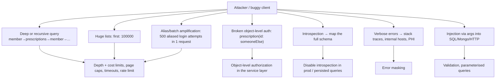
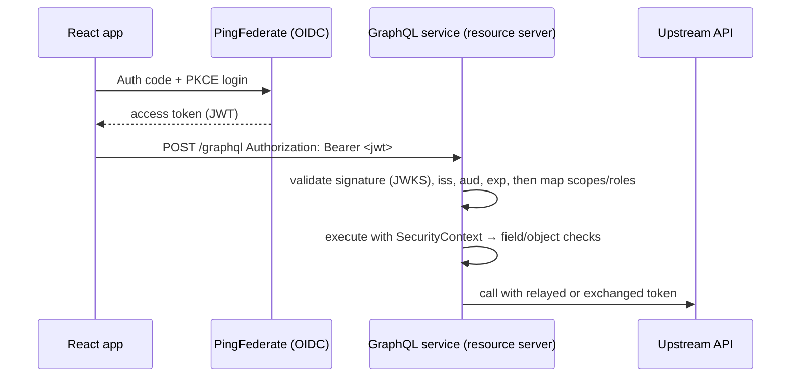

# GraphQL Security: Auth, Depth/Complexity Limits & Introspection

!!! abstract "TL;DR"
    - **Authentication** happens once per request (OAuth2/OIDC bearer token validated by the gateway or Spring Security resource server). **Authorization** must happen **per field/object**, because one endpoint serves everything.
    - Put authorization in the **domain/service layer** (or method security), not only in resolvers. Check **object-level access** (BOLA/IDOR: "can *this* member see prescription X?").
    - Bound query cost: **max depth, max complexity/cost, max page size, timeouts, rate limits per client**, and ideally **persisted/allow-listed queries**.
    - **Disable introspection and GraphiQL in production** for private APIs (or restrict them), and **sanitise errors** (no stack traces, internal names or PHI).
    - Watch batching abuse (aliases, arrays of operations) and injection through arguments passed to downstream queries.

## Why it matters

A GraphQL endpoint exposes your whole domain graph through one URL. My resume pairs the GraphQL service with "secure enterprise APIs using OAuth2, PingFederate and Active Directory", so expect detailed security questions, especially in healthcare (HIPAA).

## Core concepts

### Threat model


*Notice that most GraphQL-specific threats are resource exhaustion and authorization gaps. Classic web threats (injection, leaks) still apply through resolvers.*

### Authentication flow


*Notice that the token is validated once per request, but authorization decisions happen many times during execution, once per protected field or object.*

### Authorization levels

| Level | Example | Where |
|---|---|---|
| Operation | Only `ROLE_PHARMACIST` may call `approveRefill` | `@PreAuthorize` on the mutation |
| Field | `Member.ssnLast4` visible to support staff only | Field resolver / method security / schema directive |
| Object (BOLA) | A member may only read *their own* prescriptions | Service layer: `rx.memberId == currentUser.memberId` |
| Data filtering | Lists return only authorised rows | Query filters at the source |

!!! warning "BOLA is #1"
    OWASP API Security Top 10 lists **Broken Object Level Authorization** first. In GraphQL, `node(id:)` and `prescription(id:)` are classic leaks if the resolver fetches by ID without an ownership check.

### Query cost controls

| Control | What it stops |
|---|---|
| **Max depth** (e.g. 10–15) | Recursive and deep nesting |
| **Complexity/cost analysis** (field weights × list sizes) | Wide or expensive queries |
| **Pagination caps** (`first ≤ 100`) | Huge list fetches |
| **Max aliases / tokens / document size** | Alias amplification, parser DoS |
| **Execution timeout** | Long-running queries |
| **Rate limiting by client/user and by cost** | Abuse over time |
| **Persisted queries / allow-list** | Arbitrary queries entirely (best for first-party apps) |

### Introspection and errors

- Introspection is great in dev and terrible as an attack map in production for private APIs. Disable it (`spring.graphql.schema.introspection.enabled=false`) and GraphiQL. Remember that error suggestions ("Did you mean…?") can still leak field names.
- Mask unexpected exceptions into a generic message with a correlation ID. Log the detail server-side (without PHI).

## In practice: code & configuration

```yaml
spring:
  security:
    oauth2:
      resourceserver:
        jwt:
          issuer-uri: https://sso.example.com              # PingFederate issuer (JWKS discovered)
          audiences: graphql-consumer-service
  graphql:
    schema:
      introspection:
        enabled: false
    graphiql:
      enabled: false
```

```java
@Configuration
@EnableMethodSecurity
class SecurityConfig {
    @Bean
    SecurityFilterChain api(HttpSecurity http) throws Exception {
        return http
            .csrf(csrf -> csrf.disable())                          // stateless bearer tokens
            .authorizeHttpRequests(a -> a.requestMatchers("/graphql").authenticated())
            .oauth2ResourceServer(o -> o.jwt(Customizer.withDefaults()))
            .build();
    }
}

@Controller
class PrescriptionGraphController {
    @QueryMapping
    @PreAuthorize("isAuthenticated()")
    Prescription prescription(@Argument String id, @AuthenticationPrincipal Jwt jwt) {
        return rxService.getForMember(id, jwt.getClaimAsString("member_id"));  // ownership enforced in the service
    }

    @MutationMapping
    @PreAuthorize("hasAuthority('SCOPE_rx.approve')")
    ApproveRefillPayload approveRefill(@Argument ApproveRefillInput input) { ... }
}

@Service
class RxService {
    Prescription getForMember(String rxId, String memberId) {
        var rx = repo.findById(rxId).orElseThrow(NotFoundException::new);
        if (!rx.memberId().equals(memberId)) throw new NotFoundException();     // 404, not 403: don't confirm existence
        return rx;
    }
}
```

Depth and complexity limits (GraphQL Java instrumentation):

```java
@Bean
GraphQlSourceBuilderCustomizer limits() {
    return builder -> builder.instrumentation(List.of(
        new MaxQueryDepthInstrumentation(12),
        new MaxQueryComplexityInstrumentation(500)          // default field weight 1; customise via FieldComplexityCalculator
    ));
}
```

Pagination cap in the schema and the resolver:

```java
int first = Math.min(Optional.ofNullable(argFirst).orElse(20), 100);
```

=== "❌ Common mistake"
    ```java
    @QueryMapping
    Prescription prescription(@Argument String id) {
        return repo.findById(id).orElse(null);   // authenticated ≠ authorized → any member reads any Rx
    }
    ```

=== "✅ Correct approach"
    ```java
    @QueryMapping
    Prescription prescription(@Argument String id, @AuthenticationPrincipal Jwt jwt) {
        return rxService.getForMember(id, jwt.getClaimAsString("member_id"));
    }
    ```

## Real-world usage

- **GitHub** enforces a **node limit and a point-based rate limit** calculated from query cost, a public reference model for complexity-based limiting.
- **Shopify** uses calculated query cost with a leaky-bucket rate limiter per app.
- **Healthcare (HIPAA):** minimum-necessary access per field, audit logging of who accessed which PHI (operation name, member ID, user, timestamp), and no PHI in error messages or logs.

## Trade-offs & production gotchas

| Control | Trade-off |
|---|---|
| Persisted queries only | Strongest; requires a build pipeline, so third-party clients can't send ad-hoc queries |
| Complexity limits | Need calibrated weights; can block legitimate heavy queries |
| Disabling introspection | Tooling for consumers needs a published SDL elsewhere |
| Field-level checks in resolvers | Easy to forget; put rules in the service layer and test them |

!!! warning "Gotchas"
    - CSRF: if you accept **cookies** and **GET or form-encoded POST**, CSRF applies. Require `application/json` POST or a CSRF token, or use bearer tokens only.
    - Batched requests (an array of operations) bypass per-request rate limits. Limit the batch size or disable batching.
    - Authorization in the gateway only (coarse) misses object-level rules.
    - Error messages from upstreams passed through verbatim can leak internal hostnames or PHI.

## How this connects to my experience

- **Where I used it:** OptumRx: "Built secure enterprise APIs using OAuth2, PingFederate, and Active Directory integration"; GraphQL Consumer Service owner. Earlier: JWT/SSO and Spring Security at Johnson Controls.
- **Talking points:**
    - Token validation flow with PingFederate (OIDC), scopes/roles from AD groups. *[confirm mapping]*
    - Object-level checks: members only see their own data; staff roles see more. *[confirm]*
    - Query protections in place: depth/complexity, page caps, introspection off, error masking. *[confirm which]*
    - HIPAA-related: audit logging, PHI-free logs and errors. *[confirm]*
- **Likely follow-up chain:** "How did you authorize fields?" → "How did you prevent a member from querying another member's data?" → "How do you stop expensive queries?" → "Introspection in prod?"

## Interview questions

### Fundamentals

??? question "Q1. How do you authenticate GraphQL requests?"
    **Answer:** The same as REST: bearer tokens (OAuth2/OIDC JWT) validated by a resource server or gateway (signature via JWKS, issuer, audience, expiry), establishing a security context for the request. GraphQL itself doesn't define auth.

??? question "Q2. Why isn't endpoint-level authorization enough?"
    **Answer:** One endpoint exposes every type and field, so access rules must apply per operation, field and object during execution, typically in the service layer called by resolvers.

??? question "Q3. Should introspection be enabled in production?"
    **Answer:** For private APIs, no. Disable it (and GraphiQL) to avoid giving attackers a schema map, and share the SDL with consumers through a registry. Public APIs may keep it on with strong cost limits.

### Intermediate

??? question "Q4. What is query depth limiting vs complexity analysis?"
    **Answer:** Depth limiting rejects queries nested beyond N levels (it stops recursion). Complexity analysis assigns cost per field (multiplied by list sizes) and rejects queries over a budget (it stops wide or expensive queries). Use both, plus page caps and timeouts.

??? question "Q5. How do aliases enable abuse?"
    **Answer:** Aliases let one request call the same field many times (`a1: login(...) a2: login(...)`). That multiplies brute force or expensive work within one HTTP request and bypasses request-count rate limits. Limit aliases or fields per request, and rate-limit by cost and by sensitive operation.

??? question "Q6. What is BOLA/IDOR in GraphQL and how do you prevent it?"
    **Answer:** Accessing objects by ID without checking ownership (`prescription(id:)`, `node(id:)`). Prevent it by enforcing ownership/tenant checks in the service layer for every object fetch, returning not-found for unauthorised IDs, and testing with cross-user cases.

### Senior

??? question "Q7. How would you implement field-level authorization at scale?"
    **Answer:** Centralise policies (method security on services, or a schema directive like `@auth(requires: ...)` wired via a GraphQL Java instrumentation/visitor), so rules are declarative and reviewable. Combine them with object-level checks in services. Add tests per role, and audit logs for PHI fields.

??? question "Q8. Persisted queries as a security control: pros and cons?"
    **Answer:** Pros: only known operations execute (no arbitrary or abusive queries), easier cost review, and caching benefits. Cons: needs build-time extraction and registration, versioning across app releases, and doesn't suit public or third-party APIs.

### Scenario-based

??? question "Q9. Security testing found that a member could fetch another member's claims via node(id:). Fix and prevent."
    **Answer:** Immediate: add an ownership check in the node resolution path and the claims service, deploy, then review access logs for exploitation (HIPAA breach assessment). Prevent: centralise object-level authorization in services rather than resolvers, add automated cross-tenant tests, and do security review for new ID-based fields.

??? question "Q10. One client's queries are spiking upstream load. How do you contain it?"
    **Answer:** Identify the client and operation (operation name, client ID headers, cost metrics). Apply a cost-based rate limit per client, lower complexity budgets or page caps, and move the client to persisted queries. Fix their query (pagination, fewer fields) and add caching or batching for the hot path.

## Cheat sheet

| Area | Remember |
|---|---|
| AuthN | JWT via resource server (issuer, audience, JWKS) |
| AuthZ | Per operation, field and **object** (BOLA!) in the service layer |
| Cost | Depth + complexity + page caps + timeouts + rate limits |
| Best | Persisted / allow-listed queries for first-party apps |
| Prod | Introspection + GraphiQL off; masked errors; no PHI in logs |

## Sources

1. [OWASP GraphQL Cheat Sheet](https://cheatsheetseries.owasp.org/cheatsheets/GraphQL_Cheat_Sheet.html).
2. [OWASP API Security Top 10 (2023)](https://owasp.org/API-Security/editions/2023/en/0x11-t10/).
3. [Spring for GraphQL: Security](https://docs.spring.io/spring-graphql/reference/security.html).
4. [GitHub GraphQL API: Rate limits and node limits](https://docs.github.com/en/graphql/overview/rate-limits-and-node-limits-for-the-graphql-api).
5. [GraphQL Java: Instrumentation (MaxQueryDepth/Complexity)](https://www.graphql-java.com/documentation/instrumentation).
