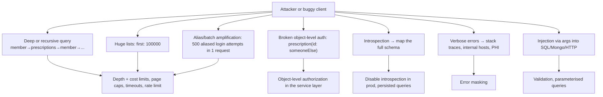

# GraphQL Security: Auth, Depth/Complexity Limits & Introspection

!!! abstract "Key takeaways"
    - **Authentication** happens once per request (OAuth2/OIDC bearer token validated by the gateway or Spring Security resource server). **Authorization** must happen **per field/object**, because one endpoint serves everything.
    - Put authorization in the **domain/service layer** (or method security), not only in resolvers. Check **object-level access** (BOLA/IDOR: "can *this* member see prescription X?").
    - Bound query cost: **max depth, max complexity/cost, max page size, timeouts, rate limits per client**, and ideally **persisted/allow-listed queries**.
    - **Disable introspection and GraphiQL in production** for private APIs (or restrict them), and **sanitise errors** (no stack traces, internal names or PHI).
    - Watch batching abuse (aliases, arrays of operations) and injection through arguments passed to downstream queries.

## Why it matters

A GraphQL endpoint exposes your whole domain graph through one URL. My resume pairs the GraphQL service with "secure enterprise APIs using OAuth2, PingFederate and Active Directory", so expect detailed security questions, especially in healthcare (HIPAA).

## Core concepts

### Threat model


*Notice that most GraphQL-specific threats are resource exhaustion and authorization gaps. Classic web threats (injection, leaks) still apply through resolvers.*

### Authentication flow


*Notice that the token is validated once per request, but authorization decisions happen many times during execution, once per protected field or object.*

### Authorization levels

| Level | Example | Where |
|---|---|---|
| Operation | Only `ROLE_PHARMACIST` may call `approveRefill` | `@PreAuthorize` on the mutation |
| Field | `Member.ssnLast4` visible to support staff only | Field resolver / method security / schema directive |
| Object (BOLA) | A member may only read *their own* prescriptions | Service layer: `rx.memberId == currentUser.memberId` |
| Data filtering | Lists return only authorised rows | Query filters at the source |

!!! warning "BOLA is #1"
    OWASP API Security Top 10 lists **Broken Object Level Authorization** first. In GraphQL, `node(id:)` and `prescription(id:)` are classic leaks if the resolver fetches by ID without an ownership check.

### Query cost controls

| Control | What it stops |
|---|---|
| **Max depth** (e.g. 10–15) | Recursive and deep nesting |
| **Complexity/cost analysis** (field weights × list sizes) | Wide or expensive queries |
| **Pagination caps** (`first ≤ 100`) | Huge list fetches |
| **Max aliases / tokens / document size** | Alias amplification, parser DoS |
| **Execution timeout** | Long-running queries |
| **Rate limiting by client/user and by cost** | Abuse over time |
| **Persisted queries / allow-list** | Arbitrary queries entirely (best for first-party apps) |

!!! note "What GraphQL Java gives you out of the box"
    - `MaxQueryDepthInstrumentation` and `MaxQueryComplexityInstrumentation` are **opt-in**; nothing limits depth or complexity until you register them.
    - The default complexity calculator scores **every field as 1 + the complexity of its children**. It does **not** know about list sizes, so `first: 100000` costs the same as `first: 1` unless you supply a `FieldComplexityCalculator` that multiplies by the page-size argument.
    - Aliased fields are counted individually by the complexity instrumentation, so a complexity budget also bounds alias amplification. There is no dedicated "max aliases" setting in GraphQL Java.
    - The parser has built-in token limits (`ParserOptions`, e.g. a max-token cap) that protect against giant documents. Still cap the HTTP request body size at the server or gateway.

### Introspection and errors

- Introspection is great in dev and terrible as an attack map in production for private APIs. Disable it (`spring.graphql.schema.introspection.enabled=false`) and GraphiQL. Remember that disabling introspection is **obscurity, not access control**: field names leak from client bundles, and some servers (graphql-js / Apollo Server) add "Did you mean…?" suggestions to validation errors that let an attacker enumerate the schema. GraphQL Java's validation messages don't add suggestions, but they do echo the type name. Authorization and cost limits are the real controls.
- Mask unexpected exceptions into a generic message with a correlation ID. Log the detail server-side (without PHI). Spring for GraphQL does this by default: an exception that no `DataFetcherExceptionResolver` handles becomes an `INTERNAL_ERROR` with an opaque message containing the `executionId`. Leaks usually come from custom resolvers that copy `ex.getMessage()` into the error.
- Spring Security exceptions thrown from data fetchers are translated for you: `AuthenticationException` → `UNAUTHORIZED`, `AccessDeniedException` → `FORBIDDEN` (in the `errors` array with `extensions.classification`). The HTTP status is still **200**; only a rejection in the security filter chain (missing or invalid token) produces a real HTTP 401.

## In practice: code & configuration

```yaml
spring:
  security:
    oauth2:
      resourceserver:
        jwt:
          issuer-uri: https://sso.example.com              # PingFederate issuer (JWKS discovered)
          audiences: graphql-consumer-service
  graphql:
    schema:
      introspection:
        enabled: false
    graphiql:
      enabled: false
```

```java
@Configuration
@EnableMethodSecurity
class SecurityConfig {
    @Bean
    SecurityFilterChain api(HttpSecurity http) throws Exception {
        return http
            .csrf(csrf -> csrf.disable())                          // stateless bearer tokens
            .authorizeHttpRequests(a -> a.requestMatchers("/graphql").authenticated())
            .oauth2ResourceServer(o -> o.jwt(Customizer.withDefaults()))
            .build();
    }
}

@Controller
class PrescriptionGraphController {
    private final RxService rxService;
    PrescriptionGraphController(RxService rxService) { this.rxService = rxService; }

    @QueryMapping
    @PreAuthorize("isAuthenticated()")
    Prescription prescription(@Argument String id, @AuthenticationPrincipal Jwt jwt) {
        return rxService.getForMember(id, jwt.getClaimAsString("member_id"));  // ownership enforced in the service
    }

    @MutationMapping
    @PreAuthorize("hasAuthority('SCOPE_rx.approve')")
    ApproveRefillPayload approveRefill(@Argument ApproveRefillInput input) {
        return rxService.approveRefill(input);
    }
}

@Service
class RxService {
    Prescription getForMember(String rxId, String memberId) {
        var rx = repo.findById(rxId).orElseThrow(NotFoundException::new);
        if (!rx.memberId().equals(memberId)) throw new NotFoundException();     // NOT_FOUND, not FORBIDDEN: don't confirm the ID exists
        return rx;
    }
}
```

Depth and complexity limits (GraphQL Java instrumentation):

```java
@Bean
GraphQlSourceBuilderCustomizer limits() {
    return builder -> builder.instrumentation(List.of(
        new MaxQueryDepthInstrumentation(12),
        new MaxQueryComplexityInstrumentation(500, (env, childComplexity) -> {
            // default would be 1 + childComplexity; here list fields multiply by the requested page size
            Integer first = env.getArgument("first");
            int multiplier = first != null ? Math.min(first, 100) : 1;
            return 1 + multiplier * childComplexity;
        })
    ));
}
```

Spring Boot also picks up any `Instrumentation` **bean** automatically, so declaring the two instrumentations as `@Bean`s works too. The lambda above is a `FieldComplexityCalculator`: `int calculate(FieldComplexityEnvironment environment, int childComplexity)`. Both instrumentations abort the request with an `AbortExecutionException` before any data fetcher runs.

Pagination cap in the resolver (the schema cannot express a maximum by itself, so enforce it in code or with a validation directive):

```java
int first = Math.min(Optional.ofNullable(argFirst).orElse(20), 100);
```

=== "❌ Common mistake"
    ```java
    @QueryMapping
    Prescription prescription(@Argument String id) {
        return repo.findById(id).orElse(null);   // authenticated ≠ authorized → any member reads any Rx
    }
    ```

=== "✅ Correct approach"
    ```java
    @QueryMapping
    Prescription prescription(@Argument String id, @AuthenticationPrincipal Jwt jwt) {
        return rxService.getForMember(id, jwt.getClaimAsString("member_id"));
    }
    ```

## Real-world usage

- **GitHub** enforces a **node limit (500,000 nodes per call) and a point-based primary rate limit (5,000 points per hour for a user)** calculated from query cost, a public reference model for complexity-based limiting. It also requires `first`/`last` on connections.
- **Shopify** uses calculated query cost with a leaky-bucket rate limiter per app.
- **Healthcare (HIPAA):** minimum-necessary access per field, audit logging of who accessed which PHI (operation name, member ID, user, timestamp), and no PHI in error messages or logs.

## Trade-offs & production gotchas

| Control | Pros | Cons | Use when |
|---|---|---|---|
| Persisted queries only (allow-list) | Strongest: only known operations execute; cost is reviewable up front | Requires a build pipeline and versioning across app releases; third-party clients can't send ad-hoc queries | First-party web and mobile clients |
| Complexity limits | Bounds wide and aliased queries; basis for cost-based rate limiting | Need calibrated weights; can block legitimate heavy queries | Any API that accepts ad-hoc queries |
| Depth limit | Trivial to add; stops recursive nesting | Blind to wide queries and big pages | Always, as a cheap first guard |
| Disabling introspection | Removes the free schema map | Obscurity only; tooling for consumers needs a published SDL elsewhere | Private APIs in production |
| Field-level checks in resolvers | Close to the schema; easy to read | Easy to forget; bypassed by other entry points | Only as a complement to service-layer rules that are tested |
| Auth at the gateway only | One place, fast rejection | Coarse; misses object-level rules; subgraphs trust the network | Authentication and coarse scopes, never object-level access |

!!! warning "Gotchas"
    - CSRF: if you accept **cookies** and **GET or form-encoded POST**, CSRF applies. Require `application/json` POST or a CSRF token, or use bearer tokens only.
    - Batched requests (an array of operations in one HTTP body) bypass per-request rate limits. Limit the batch size or disable batching. Spring for GraphQL's HTTP handler does not accept operation arrays out of the box *[confirm for your version]*, but Apollo Server and many gateways do. Alias batching works on every server.
    - Authorization in the gateway only (coarse) misses object-level rules.
    - Error messages from upstreams passed through verbatim can leak internal hostnames or PHI.
    - `@PreAuthorize("isAuthenticated()")` on a query proves nothing about ownership. It is operation-level only.
    - Method security on a `@SchemaMapping`/`@BatchMapping` runs **per call**. With `@BatchMapping` the check must cover every key in the batch, not just the first.
    - A JWT without an `aud` check means a token minted for another API in the same PingFederate tenant is accepted here. Always validate the audience.
    - Subscriptions over WebSocket: the browser can't set an `Authorization` header on the handshake, so the token arrives in the `connection_init` payload and must be validated there, and the connection must be closed when the token expires.

## How this connects to my experience

- **Where I used it:** Publicis Sapient, OptumRx Meteor: "Built secure enterprise APIs using OAuth2, PingFederate, and Active Directory integration", and I owned the GraphQL Consumer Service end-to-end. Whether that OAuth2/PingFederate work secured the GraphQL service specifically is my assumption. *[confirm]* Earlier, at Johnson Controls (Metasys): "owned JWT-based authentication and SSO implementation end-to-end" and "Implemented Spring Security authorization controls".
- **Talking points:**
    - Token validation flow with PingFederate (OIDC), scopes/roles from AD groups. *[confirm mapping]*
    - Object-level checks: members only see their own data; staff roles see more. *[confirm]*
    - Query protections in place: depth/complexity, page caps, introspection off, error masking. *[confirm which]*
    - HIPAA-related: audit logging, PHI-free logs and errors. *[confirm]*
- **Likely follow-up chain:** "How did you authorize fields?" → "How did you prevent a member from querying another member's data?" → "How do you stop expensive queries?" → "Introspection in prod?"

## Interview questions

### Fundamentals

??? question "Q1. How do you authenticate GraphQL requests?"
    **Answer:** The same as REST: bearer tokens (OAuth2/OIDC JWT) validated by a resource server or gateway (signature via JWKS, issuer, audience, expiry), establishing a security context for the request. GraphQL itself doesn't define auth. In Spring that is `oauth2ResourceServer().jwt()` on the `/graphql` path, with `issuer-uri` and `audiences` configured. Spring for GraphQL then propagates the `SecurityContext` to data fetchers, so `@AuthenticationPrincipal` and `@PreAuthorize` work inside controllers and services.

    **Interviewer listens for:** authentication is transport-level and happens once; you name the checks (signature, `iss`, `aud`, `exp`); you separate authentication from authorization.

    **Common wrong answer:** "Authenticate inside each resolver" or "use a `login` mutation and a session", with no mention of token validation or audience checks.

??? question "Q2. Why isn't endpoint-level authorization enough?"
    **Answer:** One endpoint exposes every type and field, so a URL rule like `/graphql → authenticated` can't tell a harmless query from one reading PHI. Access rules must apply per operation, field and object during execution, typically in the service layer called by resolvers. The same type is also reachable through many paths (`prescription(id:)`, `member.prescriptions`, `node(id:)`), so a rule attached to one resolver is bypassed by another path. Putting the rule in the service that loads the object covers all of them.

    **Interviewer listens for:** the "many paths to the same object" argument; rules in the domain layer; the difference between coarse (operation) and fine (object) checks.

    **Common wrong answer:** "The gateway checks the token, so the API is secure."

??? question "Q3. Should introspection be enabled in production?"
    **Answer:** For private APIs, no. Disable it (and GraphiQL) to avoid giving attackers a schema map, and share the SDL with consumers through a registry. Public APIs (GitHub, Shopify) keep it on with strong cost limits, because the schema is the documentation. Be clear that this is defence in depth, not a control: the schema can be reconstructed from client bundles and error messages, so authorization and cost limits must hold even when the attacker knows every field. In Spring it is `spring.graphql.schema.introspection.enabled=false`.

    **Interviewer listens for:** "it depends on public vs private"; obscurity is not security; a plan for how consumers get the schema.

    **Common wrong answer:** "Disabling introspection secures the API."

??? question "Q4. An unauthorised field is requested. What does the client get back: 401, 403 or 200?"
    **Answer:** It depends on where the failure happens. A missing or invalid token is rejected by the security filter chain before GraphQL runs, so the client gets a real **HTTP 401**. A denial inside execution (a `@PreAuthorize` failure on one field) is a field error: the HTTP status is **200**, that field is `null` (and the null propagates to the nearest nullable parent if the field is non-null), and `errors[]` carries an entry with the path and a classification. In Spring for GraphQL, `AccessDeniedException` becomes `FORBIDDEN` and `AuthenticationException` becomes `UNAUTHORIZED`. The rest of the response still returns, so partial data is normal. For object-level denials I return `NOT_FOUND` rather than `FORBIDDEN` so the response doesn't confirm that the ID exists.

    **Interviewer listens for:** transport errors vs field errors; partial responses; null propagation; not leaking existence.

    **Common wrong answer:** "GraphQL returns 403." or "GraphQL always returns 200" with no distinction for the filter-chain case.

### Intermediate

??? question "Q5. What is query depth limiting vs complexity analysis?"
    **Answer:** Depth limiting rejects queries nested beyond N levels (it stops recursion). Complexity analysis assigns cost per field (multiplied by list sizes) and rejects queries over a budget (it stops wide or expensive queries). Use both, plus page caps and timeouts. In GraphQL Java these are `MaxQueryDepthInstrumentation` and `MaxQueryComplexityInstrumentation`, both opt-in. The default calculator scores each field as 1 plus its children and ignores list arguments, so for a realistic cost you supply a `FieldComplexityCalculator` that multiplies child cost by `first`. Both run before execution, so a rejected query costs almost nothing. Static cost is an estimate, which is why GitHub and Shopify also require a page-size argument on connections.

    **Interviewer listens for:** depth alone misses wide queries; cost must account for list multipliers; analysis is static and pre-execution; limits are calibrated from real traffic.

    **Common wrong answer:** "Depth limit is enough" or treating the two as the same thing.

??? question "Q6. How do aliases enable abuse?"
    **Answer:** Aliases let one request call the same field many times (`a1: login(...) a2: login(...)`). That multiplies brute force or expensive work within one HTTP request and bypasses request-count rate limits. Limit aliases or fields per request, and rate-limit by cost and by sensitive operation. A complexity budget counts each aliased field, so it bounds this too. For sensitive mutations (login, OTP verification), enforce the attempt limit inside the business logic per account, so it holds however the calls are packaged. Array batching of operations is the same problem at the transport level.

    **Interviewer listens for:** rate limiting per HTTP request is the wrong unit for GraphQL; cost-based limits; per-account throttling in the domain.

    **Common wrong answer:** "The WAF or API gateway rate limit handles it."

??? question "Q7. What is BOLA/IDOR in GraphQL and how do you prevent it?"
    **Answer:** Accessing objects by ID without checking ownership (`prescription(id:)`, `node(id:)`). Prevent it by enforcing ownership/tenant checks in the service layer for every object fetch, returning not-found for unauthorised IDs, and testing with cross-user cases. The subject identity must come from the validated token, never from a query argument such as `memberId`. Watch the indirect paths too: nested fields, the Relay `node` field, and the federation `_entities` field all load objects by ID. Opaque or global IDs don't help, because they are encoding, not access control.

    **Interviewer listens for:** OWASP API1; identity from the token; the check lives where the object is loaded; negative tests with a second user.

    **Common wrong answer:** "We use UUIDs, so IDs can't be guessed."

??? question "Q8. How do you secure GraphQL subscriptions over WebSocket?"
    **Answer:** Browsers can't set an `Authorization` header on the WebSocket handshake, so with the `graphql-ws` protocol the client sends the token in the `connection_init` payload and the server validates it before acknowledging. Spring for GraphQL exposes this through `WebSocketGraphQlInterceptor.handleConnectionInitialization`, and newer versions ship an authentication interceptor that extracts a bearer token from the payload. *[confirm the class name for your version]* Three more points: authorize each `subscribe` operation and filter each event per subscriber (an event stream is an object-level access problem too); handle token expiry on long-lived connections by closing the socket or requiring re-authentication; and limit connections and subscriptions per client. Cookie-based handshakes need an `Origin` check to prevent cross-site WebSocket hijacking.

    **Interviewer listens for:** token in `connection_init`; expiry on long-lived connections; per-event authorization; origin checks.

    **Common wrong answer:** "Put the token in the URL query string" (it ends up in logs), or assuming the HTTP security config covers the socket for its whole lifetime.

### Senior

??? question "Q9. How would you implement field-level authorization at scale?"
    **Answer:** Centralise policies so rules are declarative and reviewable. Two options: method security (`@PreAuthorize`) on the service methods that data fetchers call, which is what the Spring for GraphQL docs recommend; or a schema directive such as `@auth(requires: ...)` implemented as a GraphQL Java `SchemaDirectiveWiring` (registered through a `RuntimeWiringConfigurer`) that wraps the field's `DataFetcher` with a check. The directive keeps the policy visible in the SDL and lets a schema-lint rule fail the build when a sensitive type has no directive. Neither replaces object-level checks in services, because a directive knows the role but not who owns the row. Add tests per role, and audit logs for PHI fields. Decide the denial behaviour up front: null plus a `FORBIDDEN` error for a field, and make sure sensitive fields are nullable so one denial doesn't null out the whole parent.

    **Interviewer listens for:** declarative and default-deny; role checks vs ownership checks are different problems; nullability design; how it is tested and audited.

    **Common wrong answer:** "An `if (user.hasRole(...))` in each resolver."

??? question "Q10. Persisted queries as a security control: pros and cons?"
    **Answer:** Pros: only known operations execute (no arbitrary or abusive queries), easier cost review, and caching benefits. Cons: needs build-time extraction and registration, versioning across app releases, and doesn't suit public or third-party APIs. Distinguish the two things that share the name: **Automatic Persisted Queries (APQ)** are a bandwidth optimisation in which any client can register any query by hash, so they add no security; a **safelist / trusted documents** registry that rejects unregistered hashes is the security control. Old app versions keep sending old hashes, so registered operations need a retention policy.

    **Interviewer listens for:** APQ vs allow-list; first-party vs third-party; the operational cost (CI extraction, registry, old mobile versions).

    **Common wrong answer:** "We turned on APQ, so only our queries can run."

??? question "Q11. In a federated graph, where does authentication and authorization live?"
    **Answer:** The router or gateway authenticates: it validates the JWT once and rejects bad requests early. It can also enforce coarse rules; Apollo Router supports `@authenticated`, `@requiresScopes` and `@policy` directives in the supergraph schema *[confirm licence tier]*. Subgraphs still own fine-grained and object-level authorization, because only the owning service knows who may see a row. The router forwards identity to subgraphs (the original token, or verified claims in headers). Subgraphs must then not be reachable except through the router (network policy, mTLS or a signed header), otherwise anyone can call a subgraph directly, spoof the identity headers and use `_entities` to load any object by key. Query-cost limits belong at the router, since it sees the whole operation.

    **Interviewer listens for:** authenticate at the edge, authorize at the owner; zero trust between router and subgraphs; `_entities` as an attack surface.

    **Common wrong answer:** "The gateway handles security, subgraphs just trust it."

### Scenario-based

??? question "Q12. Security testing found that a member could fetch another member's claims via node(id:). Fix and prevent."
    **Answer:** Immediate: add an ownership check in the node resolution path and the claims service, deploy, then review access logs for exploitation (HIPAA breach assessment, with compliance and security involved). Prevent: centralise object-level authorization in services rather than resolvers, add automated cross-tenant tests, and do security review for new ID-based fields. Then look for the same bug class elsewhere: every fetch-by-ID path, including nested fields and batch loaders. A structural fix is making the repository API require the caller's identity (`findByIdAndMemberId`), so an unscoped lookup is not possible by accident.

    **Interviewer listens for:** contain, assess impact, then fix the class of bug; the regulatory angle; tests that fail if it regresses.

    **Common wrong answer:** Patching only the `node` resolver and stopping there.

??? question "Q13. One client's queries are spiking upstream load. How do you contain it?"
    **Answer:** Identify the client and operation (operation name, client ID headers, cost metrics). Apply a cost-based rate limit per client, lower complexity budgets or page caps, and move the client to persisted queries. Fix their query (pagination, fewer fields) and add caching or batching for the hot path. Protect the upstreams independently with timeouts, bulkheads and circuit breakers, so one consumer can't exhaust the connection pools everyone shares. Afterwards, add per-client cost dashboards and alerts so the next spike is visible before it hurts.

    **Interviewer listens for:** attribution first (you can't limit what you can't identify); short-term containment vs long-term fix; protecting shared upstreams.

    **Common wrong answer:** "Scale out the GraphQL service" (which pushes more load onto the upstreams).

## Cheat sheet

| Area | Remember |
|---|---|
| AuthN | JWT via resource server (issuer, audience, JWKS) |
| AuthZ | Per operation, field and **object** (BOLA!) in the service layer |
| Cost | Depth + complexity + page caps + timeouts + rate limits |
| Best | Persisted / allow-listed queries for first-party apps |
| Prod | Introspection + GraphiQL off; masked errors; no PHI in logs |
| Spring props | `spring.graphql.schema.introspection.enabled=false`, `spring.graphql.graphiql.enabled=false`, `spring.security.oauth2.resourceserver.jwt.issuer-uri` / `.audiences` |
| GraphQL Java | `MaxQueryDepthInstrumentation(n)`, `MaxQueryComplexityInstrumentation(n, FieldComplexityCalculator)`; default cost = 1 + children |
| Errors | Auth failures in fields → HTTP 200 + `errors[]` with `UNAUTHORIZED` / `FORBIDDEN`; bad token at the filter → HTTP 401 |
| Aliases | Bypass request-count limits; bound with complexity and cost-based rate limits |

## Sources

1. [OWASP GraphQL Cheat Sheet](https://cheatsheetseries.owasp.org/cheatsheets/GraphQL_Cheat_Sheet.html): threat list, depth/cost limiting, batching and alias abuse, introspection and error hygiene.
2. [OWASP API Security Top 10 (2023)](https://owasp.org/API-Security/editions/2023/en/0x11-t10/): BOLA as API1:2023.
3. [Spring for GraphQL: Security](https://docs.spring.io/spring-graphql/reference/security.html): URL security vs method security on data-fetching methods, context propagation.
4. [Spring for GraphQL: Request Execution](https://docs.spring.io/spring-graphql/reference/request-execution.html): exception resolution, opaque `INTERNAL_ERROR` default, `ErrorType` values, schema directive wiring.
5. [GitHub GraphQL API: Rate limits and query limits](https://docs.github.com/en/graphql/overview/rate-limits-and-query-limits-for-the-graphql-api): node limit and point-based rate limit.
6. [GraphQL Java: Instrumentation](https://www.graphql-java.com/documentation/instrumentation): `MaxQueryDepthInstrumentation` and `MaxQueryComplexityInstrumentation`.
7. [Apollo Router: Authorization](https://www.apollographql.com/docs/graphos/routing/security/authorization): `@authenticated`, `@requiresScopes`, `@policy` in a federated graph.
