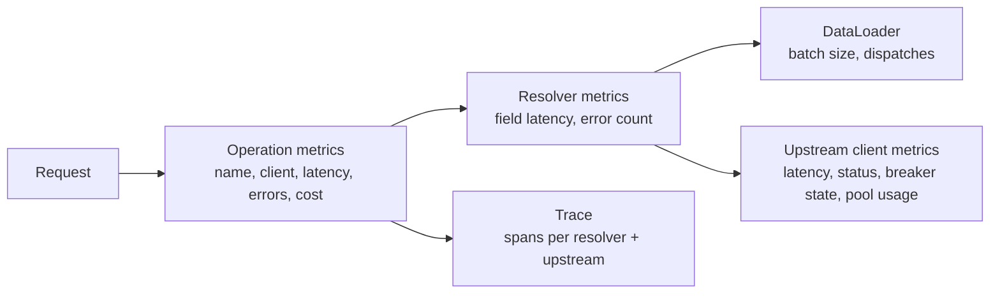

# Performance & Observability of GraphQL Services

!!! abstract "TL;DR"
    - HTTP-level metrics are nearly useless for GraphQL: one URL, mostly 200s. Observe by **operation name**, **resolver/field** and **upstream call**.
    - Require clients to send **named operations** (and client name/version headers). Reject or flag anonymous operations.
    - Key signals: operation latency p50/p95/p99, **error rate from `errors[]`**, resolver latency, **upstream calls per operation**, DataLoader batch sizes, query cost, and pool saturation.
    - **Distributed tracing** (OpenTelemetry via Micrometer observations in Spring for GraphQL) shows the critical path across resolvers and upstreams.
    - Main optimisations: DataLoader batching, parallel async resolvers, caching, parsed-document caching, persisted queries, selection-set-aware fetching, and right-sized HTTP pools and timeouts.

## Why it matters

Owning a service "end-to-end" means owning its SLOs. Interviewers ask "how did you know it was healthy?" and "how did you find slow queries?".

## Core concepts

### What to measure


*Notice that each layer answers a different question: which operation is slow, which field causes it, and which upstream is behind it.*

| Signal | Why | Source |
|---|---|---|
| `graphql.request` latency by operation | SLOs per screen/use case | Spring for GraphQL observations |
| GraphQL errors by classification and path | Real failure rate (HTTP is 200) | Instrumentation / response inspection |
| `graphql.datafetcher` latency by field | Find hot or slow resolvers | Spring observations (sample, or limit to non-trivial fetchers) |
| Upstream calls per operation | N+1 detection | HTTP client metrics tagged with operation |
| Query depth/cost distribution | Capacity planning, abuse | Instrumentation |
| Thread / connection pool saturation | Hidden bottleneck | Micrometer executor + HTTP client metrics |

### Tracing an operation

```mermaid
gantt
    dateFormat X
    axisFormat %L ms
    section MemberDashboard (420 ms)
    parse+validate        :0, 8
    Query.member          :8, 120
    Member.prescriptions  :120, 300
    Member.claimsSummary  :120, 260
    Prescription.pharmacy (batched) :300, 410
    serialize             :410, 420
```


*Notice that the trace shows the critical path (member → prescriptions → pharmacy) and that claims ran in parallel, so to speed up the screen you'd optimise prescriptions or pharmacy, not claims.*

### Common optimisations

| Problem | Fix |
|---|---|
| N+1 upstream calls | DataLoader / `@BatchMapping` + bulk APIs |
| Sequential independent calls | Async resolvers (futures/Mono) or virtual threads |
| Repeated reference lookups | Redis/Caffeine caching |
| Parse/validate cost on hot queries | Parsed document cache (`PreparsedDocumentProvider`), persisted queries |
| Fetching unrequested data | Selection-set-aware fetching, split expensive fields |
| Huge responses | Pagination caps, field cost limits |
| Slow tail latency | Timeouts, hedged reads, bulkheads |
| Thread starvation | Virtual threads or reactive; size pools per upstream |

### Load testing GraphQL

- Replay **real operation mixes** (from logs) rather than one synthetic query.
- Tools: k6 (`http.post` with GraphQL bodies), Gatling, JMeter. Assert on `errors[]`, not only HTTP status.
- Test upstream degradation (WireMock latency/faults) to validate timeouts and breakers.

## In practice: code & configuration

Spring Boot exposes GraphQL observations automatically with Actuator + Micrometer:

```yaml
management:
  endpoints.web.exposure.include: health,info,prometheus
  metrics:
    distribution:
      percentiles-histogram:
        graphql.request: true
        http.client.requests: true
  tracing:
    sampling.probability: 0.1          # 10% in prod; raise temporarily for investigations
  otlp:
    tracing:
      endpoint: http://otel-collector:4318/v1/traces
```

Require operation names and tag client identity:

```java
@Component
class OperationGuardInterceptor implements WebGraphQlInterceptor {
    @Override
    public Mono<WebGraphQlResponse> intercept(WebGraphQlRequest request, Chain chain) {
        if (request.getOperationName() == null || request.getOperationName().isBlank()) {
            return Mono.error(new BadRequestException("Named operations are required"));  // or just log/flag
        }
        String client = Optional.ofNullable(request.getHeaders().getFirst("apollographql-client-name")).orElse("unknown");
        request.configureExecutionInput((input, builder) ->
            builder.graphQLContext(Map.of("clientName", client)).build());
        return chain.next(request);
    }
}
```

Count GraphQL errors (they don't show up as HTTP 5xx):

```java
@Component
class GraphQlErrorMetricsInterceptor implements WebGraphQlInterceptor {
    private final MeterRegistry registry;
    GraphQlErrorMetricsInterceptor(MeterRegistry registry) { this.registry = registry; }

    @Override
    public Mono<WebGraphQlResponse> intercept(WebGraphQlRequest request, Chain chain) {
        return chain.next(request).doOnNext(response -> response.getErrors().forEach(e ->
            registry.counter("graphql.errors",
                "operation", Objects.toString(request.getOperationName(), "anonymous"),
                "classification", String.valueOf(e.getErrorType())).increment()));
    }
}
```

k6 load-test snippet:

```js
import http from "k6/http";
import { check } from "k6";
export const options = { vus: 50, duration: "5m", thresholds: { http_req_duration: ["p(95)<800"] } };
export default function () {
  const res = http.post(__ENV.URL, JSON.stringify({
    operationName: "MemberDashboard",
    query: open("./member-dashboard.graphql"),
    variables: { id: "42" },
  }), { headers: { "Content-Type": "application/json", Authorization: `Bearer ${__ENV.TOKEN}` } });
  check(res, { "no graphql errors": (r) => !r.json("errors") });
}
```

## Real-world usage

- **Apollo GraphOS, Hive and Cosmo** provide per-operation and per-field usage analytics, which are also used to safely remove deprecated fields.
- **Netflix** uses distributed tracing across DGS subgraphs to find slow entity resolutions.
- **SLO example:** "MemberDashboard p95 < 800 ms, error rate < 0.5%". Alert on burn rate, not single spikes.

## Trade-offs & production gotchas

!!! warning "Gotchas"
    - Per-field (DataFetcher) metrics on every trivial property create **cardinality and overhead** explosions. Instrument non-trivial fetchers only, or sample.
    - Tagging metrics with **raw query text or variables** blows cardinality and can leak PHI. Use operation names.
    - A 100% trace sampling rate in production is expensive. Use tail-based sampling for errors and slow traces.
    - Monitoring only HTTP 5xx misses most GraphQL failures.

## How this connects to my experience

- **Where I used it:** OptumRx GraphQL Consumer Service, owned end-to-end including production support; established engineering standards around testing, CI/CD and code quality.
- **Talking points:**
    - Dashboards and alerts used (Grafana/Splunk/Dynatrace/New Relic?) and key SLOs. *[confirm tooling]*
    - A performance investigation story: symptom → trace → root cause (N+1/slow upstream) → fix → result. *[confirm, a strong STAR story]*
    - Load testing before major releases. *[confirm]*
- **Likely follow-up chain:** "How did you monitor it?" → "How did you find a slow query?" → "What was your p95?" → "How did you load test?"

## Interview questions

### Fundamentals

??? question "Q1. Why are HTTP metrics insufficient for GraphQL?"
    **Answer:** All traffic hits one endpoint and errors usually return 200, so you can't tell which use case is slow or failing. You need operation-level and field-level metrics plus error counts from the `errors` array.

??? question "Q2. Why require named operations?"
    **Answer:** They let you group metrics, traces, logs and usage analytics by use case, support persisted queries and deprecation analysis, and make on-call debugging possible.

### Intermediate

??? question "Q3. How do you find which resolver makes an operation slow?"
    **Answer:** Distributed tracing with spans per resolver and upstream call (Spring for GraphQL observations + OpenTelemetry), or per-field timing instrumentation. Look at the critical path and the upstream spans under it.

??? question "Q4. How do you detect N+1 in production?"
    **Answer:** Count upstream calls per operation (HTTP client metrics tagged with the operation) and DataLoader batch sizes. Alert when calls per operation grow with list size.

??? question "Q5. What would you put on a GraphQL service dashboard?"
    **Answer:** Top operations by traffic and p95, error rate by operation and classification, upstream latency and error and breaker state, calls per operation, cache hit ratio, JVM/threads/pools, query cost distribution, and rate-limit rejections.

### Senior

??? question "Q6. How do you set and enforce SLOs for a GraphQL aggregation service?"
    **Answer:** Define SLOs per critical operation (latency and error), with error budgets, and alert on burn rates. Derive per-upstream timeout budgets from them. Agree upstream SLOs with owning teams. Review regressions in CI with performance tests on key operations.

??? question "Q7. How do you load-test a GraphQL API realistically?"
    **Answer:** Use the production operation mix with realistic variables (list sizes), the auth tokens of different roles, and upstream mocks with realistic latency and faults. Assert on GraphQL errors. Ramp to 2–3× peak and observe pools, upstream calls and p99.

### Scenario-based

??? question "Q8. p99 latency for MemberDashboard doubled after a release, while p50 is unchanged. Investigate."
    **Answer:** Compare traces of slow requests: is there a new resolver on the critical path, larger list sizes triggering more calls, a new upstream with tail latency, or pool contention (thread or connection waits) under bursts? Check GC pauses. Fix by batching, raising pool limits within upstream capacity, timeouts and hedging, or deferring the new field.

## Cheat sheet

| Concept | Remember |
|---|---|
| Group by | Operation name (+ client name/version) |
| Errors | Count `errors[]`, not HTTP 5xx |
| Find slowness | Traces: critical path through resolvers → upstream |
| N+1 metric | Upstream calls per operation |
| Avoid | High-cardinality tags (raw queries, variables, PHI) |
| Load test | Real operation mix + upstream faults |

## Sources

1. [Spring for GraphQL: Observability](https://docs.spring.io/spring-graphql/reference/observability.html).
2. [Spring Boot: Actuator metrics and tracing](https://docs.spring.io/spring-boot/reference/actuator/observability.html).
3. [GraphQL Java: Instrumentation](https://www.graphql-java.com/documentation/instrumentation).
4. [OpenTelemetry: Semantic conventions for GraphQL](https://opentelemetry.io/docs/specs/semconv/graphql/graphql-spans/).
5. [Grafana k6: GraphQL testing](https://grafana.com/docs/k6/latest/examples/http-authentication/).
