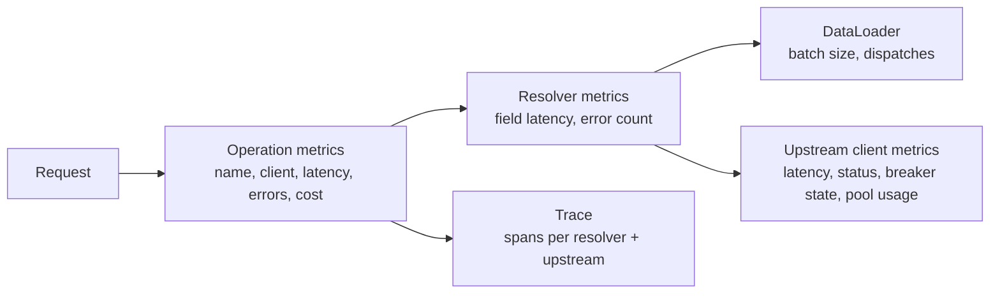

# Performance & Observability of GraphQL Services

!!! abstract "Key takeaways"
    - HTTP-level metrics are nearly useless for GraphQL: one URL, mostly 200s. Observe by **operation name**, **resolver/field** and **upstream call**.
    - Require clients to send **named operations** (and client name/version headers). Reject or flag anonymous operations.
    - Key signals: operation latency p50/p95/p99, **error rate from `errors[]`**, resolver latency, **upstream calls per operation**, DataLoader batch sizes, query cost, and pool saturation.
    - **Distributed tracing** (OpenTelemetry via Micrometer observations in Spring for GraphQL) shows the critical path across resolvers and upstreams. Note that Spring for GraphQL puts `graphql.operation.name` on **spans only** (high cardinality); the `graphql.request` *metric* is tagged just with operation type and outcome unless you add a custom convention.
    - Main optimisations: DataLoader batching, parallel async resolvers, caching, parsed-document caching, persisted queries, selection-set-aware fetching, and right-sized HTTP pools and timeouts.

## Why it matters

Owning a service "end-to-end" means owning its SLOs. Interviewers ask "how did you know it was healthy?" and "how did you find slow queries?".

## Core concepts

### What to measure


*Notice that each layer answers a different question: which operation is slow, which field causes it, and which upstream is behind it.*

{ loading=lazy }
*Notice that the failing MemberDashboard calls are invisible in the HTTP view: they all returned 200 with an `errors` array.*

| Signal | Why | Source |
|---|---|---|
| `graphql.request` latency by operation | SLOs per screen/use case | Spring for GraphQL observations. Out of the box the timer is tagged only with `graphql.operation.type` and `graphql.outcome`; the operation name is a high-cardinality key (traces only), so add it to metrics with a custom `ExecutionRequestObservationConvention` (see below) |
| GraphQL errors by classification and path | Real failure rate (HTTP is 200) | Instrumentation / response inspection |
| `graphql.datafetcher` latency by field | Find hot or slow resolvers | Spring observations, tagged with `graphql.field.name`. Trivial property fetchers are skipped automatically; only real data fetchers are observed |
| `graphql.dataloader` batch size and latency | Confirms batching actually happens | Spring observations (Spring for GraphQL 1.4+), tagged with `graphql.loader.name`; `graphql.loader.size` is on the span |
| Upstream calls per operation | N+1 detection | HTTP client metrics tagged with operation |
| Query depth/cost distribution | Capacity planning, abuse | Instrumentation |
| Thread / connection pool saturation | Hidden bottleneck | Micrometer executor + HTTP client metrics |

### Tracing an operation

```mermaid
gantt
    dateFormat x
    axisFormat %L ms
    section MemberDashboard (420 ms)
    parse+validate        :0, 8
    Query.member          :8, 120
    Member.prescriptions  :120, 300
    Member.claimsSummary  :120, 260
    Prescription.pharmacy (batched) :300, 410
    serialize             :410, 420
```


*Notice that the trace shows the critical path (member → prescriptions → pharmacy) and that claims ran in parallel, so to speed up the screen you'd optimise prescriptions or pharmacy, not claims.*

### Common optimisations

| Problem | Fix |
|---|---|
| N+1 upstream calls | DataLoader / `@BatchMapping` + bulk APIs |
| Sequential independent calls | Async resolvers (futures/Mono) or virtual threads |
| Repeated reference lookups | Redis/Caffeine caching |
| Parse/validate cost on hot queries | Parsed document cache (`PreparsedDocumentProvider`), persisted queries |
| Fetching unrequested data | Selection-set-aware fetching, split expensive fields |
| Huge responses | Pagination caps, field cost limits |
| Slow tail latency | Timeouts, hedged reads, bulkheads |
| Thread starvation | Virtual threads or reactive; size pools per upstream |

### Load testing GraphQL

- Replay **real operation mixes** (from logs) rather than one synthetic query.
- Tools: k6 (`http.post` with GraphQL bodies), Gatling, JMeter. Assert on `errors[]`, not only HTTP status.
- Test upstream degradation (WireMock latency/faults) to validate timeouts and breakers.

## In practice: code & configuration

Spring Boot exposes GraphQL observations automatically with Actuator + Micrometer. Three observations are produced: `graphql.request` (one per operation), `graphql.datafetcher` (one per non-trivial data fetcher) and `graphql.dataloader` (one per batch load). Each becomes a timer and, when a tracing bridge is on the classpath, a span.

```yaml
management:
  endpoints.web.exposure.include: health,info,prometheus
  metrics:
    distribution:
      percentiles-histogram:
        graphql.request: true
        http.client.requests: true
  tracing:
    sampling.probability: 0.1          # 0.1 (10%) is also the Boot default; raise temporarily for investigations
  otlp:
    tracing:
      endpoint: http://otel-collector:4318/v1/traces   # Spring Boot 3.x property name
```

!!! note "Spring Boot 4.x"
    In Spring Boot 4 the OTLP trace export properties moved under `management.opentelemetry.tracing.export.otlp.*` (so the endpoint is `management.opentelemetry.tracing.export.otlp.endpoint`), and the recommended dependency is `spring-boot-starter-opentelemetry`. On Boot 3.x you add `micrometer-tracing-bridge-otel` plus `opentelemetry-exporter-otlp` yourself. Check the property names against the Boot version you run before quoting them in an interview.

Put the operation name on the **metric**. By default it is only on the span, so a Grafana panel "p95 by operation" has nothing to group by:

=== "❌ Common mistake"
    ```java
    // Assuming graphql.request is already tagged by operation name, or tagging it with
    // whatever the client sent. Client-controlled tag values are an unbounded-cardinality risk.
    @Component
    class OperationNameConvention extends DefaultExecutionRequestObservationConvention {
        @Override
        public KeyValues getLowCardinalityKeyValues(ExecutionRequestObservationContext context) {
            return super.getLowCardinalityKeyValues(context)
                .and("operation", String.valueOf(context.getExecutionInput().getOperationName()))
                .and("query", context.getExecutionInput().getQuery());   // raw query text: cardinality bomb + PHI leak
        }
    }
    ```

=== "✅ Correct approach"
    ```java
    // Bounded tag values: only operations we know about (e.g. the persisted-query registry) get their own series.
    @Component
    class OperationNameConvention extends DefaultExecutionRequestObservationConvention {
        private final Set<String> knownOperations;
        OperationNameConvention(KnownOperations registry) { this.knownOperations = registry.names(); }

        @Override
        public KeyValues getLowCardinalityKeyValues(ExecutionRequestObservationContext context) {
            String name = context.getExecutionInput().getOperationName();
            String tag = (name != null && knownOperations.contains(name)) ? name : "other";
            return super.getLowCardinalityKeyValues(context).and("operation", tag);
        }
    }
    ```

Spring Boot picks up an `ExecutionRequestObservationConvention` bean automatically (same for `DataFetcherObservationConvention`). `KnownOperations` here is your own class, not a framework type.

Require operation names and tag client identity:

```java
@Component
class OperationGuardInterceptor implements WebGraphQlInterceptor {
    @Override
    public Mono<WebGraphQlResponse> intercept(WebGraphQlRequest request, Chain chain) {
        // Caveat: this checks the "operationName" field of the request body. The spec only requires it when the
        // document has several operations, so a client can send a named operation without it. Apollo Client and
        // Relay always send it. To be strict, parse the document instead; to be lenient, just log and count.
        if (request.getOperationName() == null || request.getOperationName().isBlank()) {
            return Mono.error(new ResponseStatusException(HttpStatus.BAD_REQUEST, "Named operations are required"));
        }
        String client = Optional.ofNullable(request.getHeaders().getFirst("apollographql-client-name")).orElse("unknown");
        request.configureExecutionInput((input, builder) ->
            builder.graphQLContext(Map.of("clientName", client)).build());
        return chain.next(request);
    }
}
```

Putting `clientName` in the `GraphQLContext` makes it available to data fetchers, instrumentation and an observation convention; it does not tag any metric on its own. Apollo clients send `apollographql-client-name` and `apollographql-client-version`; for other clients agree on equivalent headers.

Count GraphQL errors (they don't show up as HTTP 5xx):

```java
@Component
class GraphQlErrorMetricsInterceptor implements WebGraphQlInterceptor {
    private final MeterRegistry registry;
    GraphQlErrorMetricsInterceptor(MeterRegistry registry) { this.registry = registry; }

    @Override
    public Mono<WebGraphQlResponse> intercept(WebGraphQlRequest request, Chain chain) {
        return chain.next(request).doOnNext(response -> response.getErrors().forEach(e ->
            registry.counter("graphql.errors",
                "operation", Objects.toString(request.getOperationName(), "anonymous"),
                "classification", String.valueOf(e.getErrorType())).increment()));
    }
}
```

In production use the same bounded operation tag as above rather than the raw client-supplied name. This counter complements the built-in `graphql.outcome` tag, which only distinguishes `SUCCESS`, `REQUEST_ERROR` (parse/validation failures) and `INTERNAL_ERROR` at request level; partial responses with field errors need this kind of counting or the `graphql.datafetcher` timers with `graphql.outcome=ERROR`.

k6 load-test snippet:

```js
import http from "k6/http";
import { check } from "k6";
export const options = {
  vus: 50, duration: "5m",
  thresholds: { http_req_duration: ["p(95)<800"], checks: ["rate>0.995"] },   // fail the run on GraphQL errors too
};
const query = open("./member-dashboard.graphql");   // open() only works in the init context, not inside the VU function
export default function () {
  const res = http.post(__ENV.URL, JSON.stringify({
    operationName: "MemberDashboard",
    query,
    variables: { id: "42" },
  }), { headers: { "Content-Type": "application/json", Authorization: `Bearer ${__ENV.TOKEN}` } });
  check(res, { "status 200": (r) => r.status === 200, "no graphql errors": (r) => r.status === 200 && !r.json("errors") });
}
```

## Real-world usage

- **Apollo GraphOS, Hive and Cosmo** provide per-operation and per-field usage analytics, which are also used to safely remove deprecated fields.
- **Netflix** runs a federated graph on its open-source DGS framework (which now builds on Spring for GraphQL) and has written publicly about relying on distributed tracing to debug requests that fan out across many services. Treat the specifics as "per their engineering blog" rather than quoting numbers.
- **Healthcare relevance:** traces, logs and metric tags are outside the main data store, so member IDs, variables and raw query text must stay out of them (PHI). Use operation names and opaque correlation IDs.
- **SLO example:** "MemberDashboard p95 < 800 ms, error rate < 0.5%". Alert on burn rate, not single spikes.

## Trade-offs & production gotchas

| Option | Pros | Cons | Use when |
|---|---|---|---|
| Request-level metrics only (`graphql.request`) | Cheap, low cardinality | Can't see which field or upstream is slow | Always on; SLOs and alerting |
| Per-data-fetcher metrics (`graphql.datafetcher`) | Pinpoints slow fields | One series per field × outcome; overhead on large list fields | Always on for a moderate schema; trim with an `ObservationPredicate` if it gets heavy |
| Head-based trace sampling (e.g. 10%) | Simple, predictable cost | Misses most rare slow or failed requests | Default; fine for common-path analysis |
| Tail-based sampling (in the OTel Collector) | Keeps errors and slow traces | Collector must buffer whole traces; more infrastructure | p99 investigations, low-volume critical operations |
| Vendor field-usage analytics (GraphOS, Hive, Cosmo) | Field usage per client, safe deprecation | Extra dependency, schema/usage data leaves the service | Many clients, schema evolution matters |

{ loading=lazy }
*Notice when each decision is made: head sampling decides before anything has gone wrong, tail sampling decides after the trace has ended, so it can keep the interesting ones.*

!!! warning "Gotchas"
    - Spring for GraphQL already skips trivial property fetchers, but a list of 500 items with a real data fetcher per item still produces 500 observations and spans per request. That is **overhead and trace bloat**. Batch with `@BatchMapping` (one observation), or filter with an `ObservationPredicate`. Custom graphql-java `Instrumentation` that times *every* field has the same problem, worse.
    - `graphql.operation.name` is **not** a metric tag by default (it's a high-cardinality key, so it's on spans only). If your dashboard groups `graphql.request` by operation, someone added a convention; know which.
    - Tagging metrics with **raw query text or variables** blows cardinality and can leak PHI. Use operation names.
    - A 100% trace sampling rate in production is expensive. Use tail-based sampling for errors and slow traces.
    - Monitoring only HTTP 5xx misses most GraphQL failures.

## How this connects to my experience

- **Where I used it:** Publicis Sapient, project OptumRx Meteor: owned the GraphQL Consumer Service end-to-end as the integration layer between 5 upstream systems and multiple downstream consumers, with Redis-based caching for frequently accessed queries and UI reference data; led release management and production support; established engineering standards around testing, CI/CD and code quality. The specific observability stack and numbers below are not on the resume. *[confirm]*
- **Talking points:**
    - Dashboards and alerts used (Grafana/Splunk/Dynatrace/New Relic?) and key SLOs. *[confirm tooling]*
    - A performance investigation story: symptom → trace → root cause (N+1/slow upstream) → fix → result. *[confirm, a strong STAR story]*
    - Load testing before major releases. *[confirm]*
    - Effect of the Redis caching on latency or upstream call volume (hit ratio, before/after p95). *[confirm numbers]*
- **Likely follow-up chain:** "How did you monitor it?" → "How did you find a slow query?" → "What was your p95?" → "How did you load test?" Have one real number for each (or say honestly what you'd measure) *[confirm]*.

## Interview questions

### Fundamentals

??? question "Q1. Why are HTTP metrics insufficient for GraphQL?"
    **Answer:** All traffic hits one endpoint (`POST /graphql`) and execution errors usually return 200 with an `errors` array, often alongside partial `data`. So URL-and-status dashboards can't tell which use case is slow or failing, and a cheap query and an expensive one look identical. You need operation-level and field-level metrics plus error counts from the `errors` array. HTTP metrics still matter for transport problems (4xx on malformed requests, 401/403, 5xx when the server itself fails, saturation), so keep them, but they are not the service's health signal.

    **Interviewer listens for:** single endpoint, 200-with-errors and partial data, per-operation grouping, not throwing HTTP metrics away entirely.

    **Common wrong answer:** "GraphQL always returns 200." With the GraphQL-over-HTTP spec and `application/graphql-response+json`, request errors (parse/validation) can return 4xx; only field errors during execution stay 200.

??? question "Q2. Why require named operations?"
    **Answer:** They let you group metrics, traces, logs and usage analytics by use case, support persisted queries and deprecation analysis, and make on-call debugging possible. The name is client-supplied, though, so treat it as untrusted: two clients can reuse one name for different documents, and an attacker can send random names to blow up metric cardinality. For stable identity use a persisted-query ID or document hash plus client name/version, and only tag metrics with names from a known set.

    **Interviewer listens for:** grouping key for telemetry, link to persisted queries and deprecation, awareness that the name is untrusted and a cardinality risk.

    **Common wrong answer:** "The operation name is required by the spec." It isn't; anonymous operations are valid, and `operationName` in the request is only needed when the document contains several operations. Enforcing names is a team policy.

### Intermediate

??? question "Q3. How do you find which resolver makes an operation slow?"
    **Answer:** Distributed tracing with spans per resolver and upstream call (Spring for GraphQL observations + OpenTelemetry), or per-field timing instrumentation. Start from the `graphql.request` span for the slow operation, follow the critical path (the chain of spans that determines the end time, not the largest number of spans), and look at the upstream HTTP/DB spans under the slow data fetcher. Then confirm with metrics: the `graphql.datafetcher` timer by `graphql.field.name` tells you whether it is always slow or only at the tail. Gaps between spans with no child work usually mean waiting: thread-pool queueing, connection-pool acquisition or GC.

    **Interviewer listens for:** traces to localise, metrics to quantify; critical path vs parallel branches; unexplained gaps as queueing; sampling may have dropped the slow trace, so tail sampling or exemplars help.

    **Common wrong answer:** "Add logging with timestamps to each resolver." It works once but doesn't scale, and doesn't show upstream time or parallelism.

??? question "Q4. How do you detect N+1 in production?"
    **Answer:** Count upstream calls per operation and watch DataLoader batch sizes. In a trace N+1 is unmistakable: a long staircase of near-identical upstream spans under one list field. For metrics, compute the ratio of upstream request rate to operation rate (`http.client.requests` per `graphql.request`); a ratio that grows with list size, or jumps after a release, is N+1. The `graphql.dataloader` observation shows whether batching is really happening (many batches of size 1 means the loader is being dispatched too early or keys aren't being grouped). Catch it earlier in CI with a test that asserts the number of upstream calls for a list query against WireMock.

    **Interviewer listens for:** calls-per-operation ratio, span pattern, batch size, a pre-production guard.

    **Common wrong answer:** "Latency will tell you." N+1 against a fast upstream can hide inside acceptable latency until list sizes or load grow, while hammering the upstream.

??? question "Q5. What would you put on a GraphQL service dashboard?"
    **Answer:** Top operations by traffic and p95, error rate by operation and classification, upstream latency and error and breaker state, calls per operation, cache hit ratio, JVM/threads/pools, query cost distribution, and rate-limit rejections. Organise it top-down so on-call can localise in a minute: row 1 is the SLO view (rate, errors, duration per critical operation and burn rate), row 2 is per-upstream health, row 3 is saturation (thread and connection pools, pending acquisitions, GC, CPU), row 4 is GraphQL-specific (slowest fields, DataLoader batch sizes, cost and depth rejections, traffic by client version).

    **Interviewer listens for:** RED per operation, USE for resources, upstream breakdown, a layout that supports diagnosis rather than a list of charts.

    **Common wrong answer:** Listing only JVM and HTTP status panels.

??? question "Q6. How should you count errors when every GraphQL response is HTTP 200?"
    **Answer:** Count from the response body, not the status. Record per operation: total requests, requests with any `errors`, and requests with `data: null` (total failure). Tag errors by classification (`NOT_FOUND`, `FORBIDDEN`, `INTERNAL_ERROR`, upstream timeout) and by the path or data fetcher that failed. Client errors (validation, auth) and server errors go into separate SLIs, so a client sending bad queries does not burn your availability budget.

    **Interviewer listens for:** body-based error metrics, partial vs total failure, classification tags, separate client vs server SLIs.

    **Common wrong answer:** "Our 5xx rate is zero, so the service is healthy." GraphQL failures arrive with status 200.

### Senior

??? question "Q7. How do you set and enforce SLOs for a GraphQL aggregation service?"
    **Answer:** Define SLOs per critical operation (latency and error), with error budgets, and alert on burn rates (multi-window, e.g. a fast window that pages and a slow window that tickets). Decide what counts as a "bad" request: a 200 with `errors` on a required field is bad, a partial response where an optional widget degraded may be acceptable, so the SLI has to be computed from GraphQL outcomes, not HTTP status. Derive per-upstream timeout budgets from the operation target. An aggregation service cannot be more available than the upstreams on its critical path (five serial dependencies at 99.9% each give roughly 99.5%), so either agree upstream SLOs with the owning teams or design for degradation: nullable fields, caching, fallbacks. Enforce with performance tests on key operations in CI and by spending or freezing on the error budget.

    **Interviewer listens for:** per-operation SLI defined on GraphQL outcome, burn-rate alerting, dependency arithmetic, partial-response policy, timeout budgets.

    **Common wrong answer:** One global "p95 < X" for `/graphql`, which mixes cheap and expensive operations and hides the ones users care about.

??? question "Q8. How do you load-test a GraphQL API realistically?"
    **Answer:** Use the production operation mix with realistic variables (list sizes), the auth tokens of different roles, and upstream mocks with realistic latency and faults. Assert on GraphQL errors. Ramp past expected peak (a multiple agreed from capacity targets, 2–3× is a common rule of thumb) and observe pools, upstream calls and p99. Vary the variables so you don't just measure a warm cache, and run both cache-warm and cache-cold. Prefer an open (arrival-rate) workload model over a fixed number of looping virtual users, otherwise a slow server reduces the offered load and hides the problem (coordinated omission). Include a soak run to catch leaks, and a run with one upstream degraded to prove timeouts, breakers and bulkheads protect the other operations.

    **Interviewer listens for:** real mix and data shapes, error assertions, cache effects, open vs closed model, degraded-dependency test, what was observed besides latency.

    **Common wrong answer:** Hammering one small query with constant variables and reporting the average.

??? question "Q9. How do you know which clients use which operations and fields?"
    **Answer:** Require each client to send a name and version (for example `apollographql-client-name` / `-version` headers) and named operations. Record them as low-cardinality tags on metrics and as attributes on traces. With persisted queries or an operation registry you know every operation in advance. This lets you contact the owners of a slow or failing operation, judge the impact of a deprecation, and rate-limit or block one misbehaving client.

    **Interviewer listens for:** client identity headers, named operations, operation registry, use in deprecation and incident response.

    **Common wrong answer:** Tagging metrics with the full query text or user id, which explodes cardinality.

### Scenario-based

??? question "Q10. p99 latency for MemberDashboard doubled after a release, while p50 is unchanged. Investigate."
    **Answer:** Unchanged p50 with doubled p99 means the typical request is fine and a minority is hit, so look for what distinguishes the slow ones. First confirm it's the release (deploy marker, compare by version or canary) and whether it's all clients or one client version. Then compare traces of slow requests with normal ones: is there a new resolver on the critical path, larger list sizes triggering more calls, a new upstream with tail latency, cache misses falling through to a slow path, or pool contention (thread or connection waits) under bursts? Check GC pauses and CPU throttling. Adding one more upstream call also raises tail latency by itself, because the request is now as slow as the slowest of more calls. Mitigate first (roll back or feature-flag the new field), then fix by batching, sizing pools within upstream capacity, tighter timeouts, hedging idempotent reads, or making the new field nullable and deferred.

    **Interviewer listens for:** reasoning from the p50/p99 shape, diffing slow vs fast traces, fan-out tail amplification, queueing, mitigate-then-fix, verifying with the same metric afterwards.

    **Common wrong answer:** "Scale out the pods." More replicas don't fix a slow upstream tail or a per-request N+1.

??? question "Q11. Your Grafana panel for `graphql.request` can't be broken down by operation name. Why, and what do you do?"
    **Answer:** In Spring for GraphQL the request observation has low-cardinality keys `graphql.operation.type` and `graphql.outcome`; `graphql.operation.name` is a high-cardinality key, so it appears on spans but not on the timer. That's deliberate: the name is client-controlled and unbounded. To get per-operation metrics, register a custom `ExecutionRequestObservationConvention` (extend `DefaultExecutionRequestObservationConvention`) that adds the name as a low-cardinality key, mapped to a bounded set (known or persisted operations, everything else `other`). Alternatives are span-derived metrics in the collector or a `MeterFilter` to cap tag values.

    **Interviewer listens for:** low vs high cardinality in Micrometer Observation, why the default is safe, bounding the tag.

    **Common wrong answer:** "Spring tags it automatically", or adding the raw name (or query text) as a tag with no bound.

??? question "Q12. How does the trace context reach your data fetchers and upstream calls, and where does it get lost?"
    **Answer:** The incoming `traceparent` header is extracted by the HTTP server observation; the `graphql.request` observation becomes its child, each `graphql.datafetcher` observation is a child of that, and instrumented clients (`RestClient`/`WebClient` built from the auto-configured builder, Kafka templates with observation enabled) inject the header on outgoing calls. It breaks when work hops threads without context propagation: your own executors or `CompletableFuture.supplyAsync` without a context-propagating wrapper, DataLoader batch functions running later on another thread, clients created with `new` instead of the builder, and reactive chains without automatic context propagation. Symptoms are orphan upstream spans or logs without trace IDs. Fix with Micrometer context-propagation (`ContextSnapshot`, a `ContextPropagatingTaskDecorator` on executors) and by always using the instrumented builders.

    **Interviewer listens for:** parent/child span structure, W3C trace context, thread hops as the failure point, concrete fix.

    **Common wrong answer:** "OpenTelemetry handles it automatically everywhere."

## Cheat sheet

| Concept | Remember |
|---|---|
| Group by | Operation name (+ client name/version); bounded set of values |
| Spring observations | `graphql.request`, `graphql.datafetcher`, `graphql.dataloader` |
| Default request tags | `graphql.operation.type`, `graphql.outcome`; operation name is span-only |
| Sampling default | `management.tracing.sampling.probability` = 0.1 |
| Errors | Count `errors[]`, not HTTP 5xx |
| Find slowness | Traces: critical path through resolvers → upstream |
| N+1 metric | Upstream calls per operation |
| Avoid | High-cardinality tags (raw queries, variables, PHI) |
| Load test | Real operation mix + upstream faults |

## Sources

1. [Spring for GraphQL: Observability](https://docs.spring.io/spring-graphql/reference/observability.html): observation names, low/high cardinality keys, convention classes.
2. [Spring Boot: Observability](https://docs.spring.io/spring-boot/reference/actuator/observability.html) and [Tracing](https://docs.spring.io/spring-boot/reference/actuator/tracing.html): sampling default, OTLP export properties (current docs describe Boot 4.x names).
3. [GraphQL Java: Instrumentation](https://www.graphql-java.com/documentation/instrumentation): custom per-field instrumentation and its cost.
4. [OpenTelemetry: Semantic conventions for GraphQL](https://opentelemetry.io/docs/specs/semconv/graphql/graphql-spans/): span attribute names.
5. [Grafana k6: `open()`](https://grafana.com/docs/k6/latest/javascript-api/init-context/open/): init-context restriction used in the load-test snippet. GraphQL is tested in k6 as plain HTTP POSTs; there is no dedicated GraphQL page in the k6 docs.
