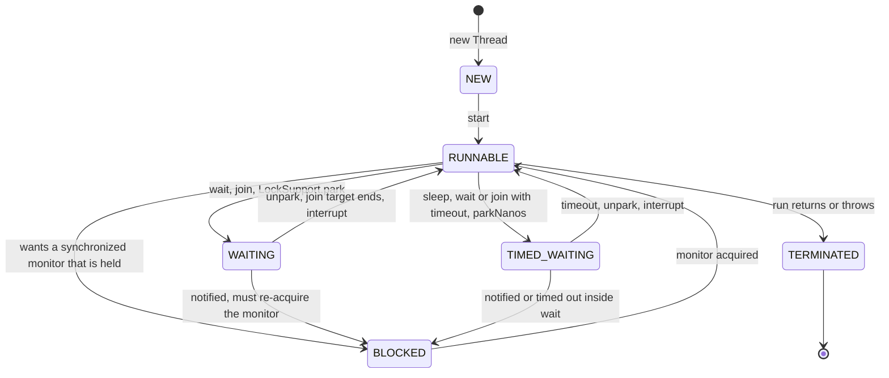
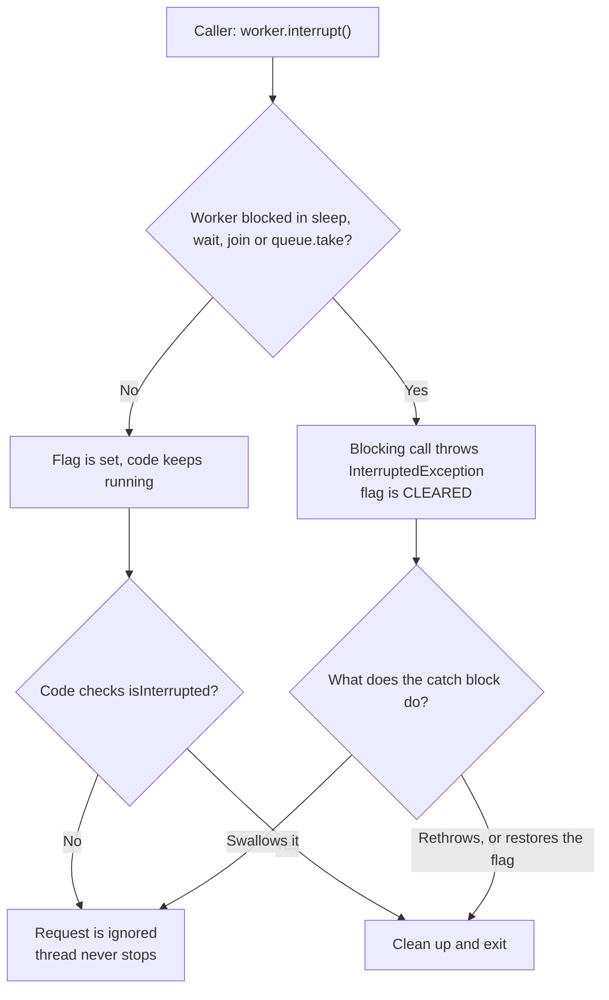
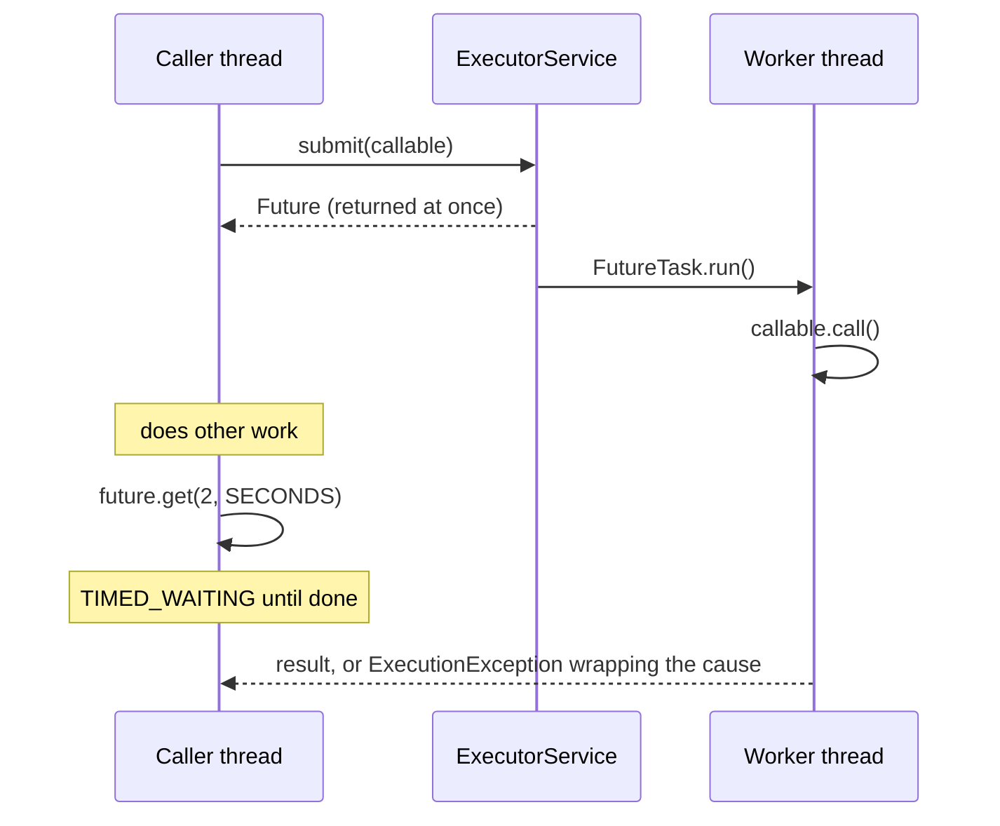

# Threads, Lifecycle, `Runnable`/`Callable`

!!! abstract "Key takeaways"
    - A **platform thread** is a thin wrapper over an OS thread: it costs a stack (about 1 MB reserved by default on 64-bit Linux) and a kernel context switch. Since Java 21 there are also **virtual threads**, which are cheap and scheduled by the JVM.
    - A thread has exactly six states (`Thread.State`): **NEW, RUNNABLE, BLOCKED, WAITING, TIMED_WAITING, TERMINATED**. `BLOCKED` means only "waiting for a `synchronized` monitor". A thread stuck in socket I/O shows as **RUNNABLE**.
    - `start()` creates a new thread and can be called **once**. `run()` is a plain method call on the current thread.
    - **`Runnable`** returns nothing and cannot throw checked exceptions. **`Callable<V>`** returns a value and can throw. A **`Future`** is the handle to the result. Both describe the *task*, not the thread.
    - You cannot kill a thread. **Interruption is a polite request**: the task must check the flag or handle `InterruptedException`, and must never swallow it.

## Why it matters

Every Java service is concurrent, even if you never write `new Thread`. Tomcat request threads, Kafka listener threads, scheduler threads, the common `ForkJoinPool` and GC threads all run your code or beside it.

Senior interviews start here because the rest of concurrency is built on it. If you can explain thread states precisely, you can read a thread dump. If you understand interruption, you can write a service that shuts down cleanly and honours timeouts. If you understand why `Callable` and `Future` exist, executors and `CompletableFuture` become obvious.

Before Java 5, the only tools were `Thread`, `Runnable`, `synchronized` and `wait/notify`. A task could not return a value or report an exception. Java 5 (`java.util.concurrent`) added `Callable`, `Future` and executors. Java 21 added virtual threads. The `Thread` API and its lifecycle stayed the same across all of them, which is why this page still applies.

## Core concepts

### Process vs thread

A **process** has its own address space. A **thread** is a path of execution inside a process. Threads in one JVM share the heap (objects, static fields) but each has its own:

- **Stack**: frames with local variables and partial results. Locals are never shared, so they are always thread-safe.
- **Program counter** and native stack.
- **Thread-local storage** (`ThreadLocal` values).

Shared heap is what makes threads useful (cheap communication) and dangerous (data races). Subtopic 2 covers how to share safely.

### Platform threads vs virtual threads

| | Platform thread | Virtual thread (Java 21, JEP 444) |
|---|---|---|
| Backed by | One OS thread, 1:1 | Mounted on a carrier platform thread only while running |
| Stack | Reserved up front, `-Xss` (default about 1 MB on 64-bit Linux) | Grows and shrinks on the heap |
| Scheduling | OS kernel, pre-emptive | JVM (a `ForkJoinPool` of carriers) |
| Blocking cost | Holds the OS thread | Unmounts and frees the carrier |
| Practical count | Thousands | Millions |
| Daemon / priority | Configurable | Always daemon, always `NORM_PRIORITY` |

Both are instances of `java.lang.Thread` and have the same lifecycle and interruption rules. Details are in subtopic 7.

### What `start()` really does

`new Thread(task)` only creates a Java object. Nothing runs and no OS thread exists yet. `start()` asks the JVM to create the native thread, allocate its stack and hand it to the scheduler. The new thread then calls `run()`, which calls your `Runnable`.

Two consequences interviewers test:

1. Calling `run()` directly executes the task **on the calling thread**. No concurrency happens.
2. Calling `start()` a second time throws `IllegalThreadStateException`, even after the thread has finished. A thread object is single-use.

`start()` also gives a memory-visibility guarantee: everything the parent did before `start()` is visible to the new thread. In the same way, everything a thread did is visible to whoever returns from `join()` on it. These are two of the happens-before rules (subtopic 2).

### The six states


*Notice that there is no "RUNNING" state and no "blocked on I/O" state. The JVM reports both as RUNNABLE, and a thread leaving `wait()` passes through BLOCKED because it must win the monitor back first.*

| State | Meaning | Typical thread-dump cause |
|---|---|---|
| `NEW` | Object created, `start()` not called | Rarely seen |
| `RUNNABLE` | Executing in the JVM, **or** ready and waiting for a CPU, **or** inside a blocking native call | Busy loop, `socketRead0` (Java 13+: `SocketDispatcher.read0`), `epollWait`, file I/O |
| `BLOCKED` | Waiting to enter (or re-enter) a `synchronized` block | Lock contention, deadlock on monitors |
| `WAITING` | Waiting with no timeout for another thread | Idle pool worker in `LinkedBlockingQueue.take()`, `Future.get()`, `ReentrantLock.lock()` |
| `TIMED_WAITING` | Same, with a timeout | `Thread.sleep`, `poll(timeout)`, `get(timeout)` |
| `TERMINATED` | `run()` completed, normally or with an exception | Not listed in a dump |

Three precise points that separate senior answers:

- **RUNNABLE is the JVM's view, not the OS view.** A thread blocked in a JDBC socket read is `RUNNABLE` in the dump but uses zero CPU. Many threads `RUNNABLE` in `socketRead0` means a slow downstream, not a CPU problem. The frame name depends on the JDK: `java.net.SocketInputStream.socketRead0` is what you see up to Java 12. From Java 13 (JEP 353 reimplemented the legacy socket API) the same blocked read shows `sun.nio.ch.NioSocketImpl.implRead` over `sun.nio.ch.SocketDispatcher.read0` (or `sun.nio.ch.Net.poll` when a read timeout is set). The state is still `RUNNABLE`.
- **`BLOCKED` is only for intrinsic locks.** A thread waiting for a `ReentrantLock` is parked through `LockSupport.park`, so it shows as `WAITING (parking)`.
- **`sleep()` does not release locks. `wait()` does.** `wait()` releases the monitor of the object it is called on and must be called while holding that monitor.

### Interruption: cooperative cancellation

Java has no safe way to stop a thread from outside. `Thread.stop()` was deprecated in Java 1.2 because it released every monitor the thread held at an arbitrary point, leaving shared objects half-updated. Since Java 20 it simply throws `UnsupportedOperationException`.

The replacement is a **flag plus a contract**:

- `t.interrupt()` sets the interrupt flag of `t`.
- If `t` is in `sleep`, `wait`, `join` or another interruptible blocking call, that call throws `InterruptedException` **and clears the flag**.
- Otherwise the flag just stays set until the code checks it.

| Method | Static? | Clears the flag? | Use |
|---|---|---|---|
| `t.interrupt()` | No | Sets it | Request cancellation |
| `t.isInterrupted()` | No | No | Check without side effects |
| `Thread.interrupted()` | Yes, current thread | **Yes** | Check and consume |


*Notice that both paths can end in "request is ignored". Interruption only works if the task cooperates, and a swallowed `InterruptedException` loses the request because the flag was already cleared.*

Blocking socket I/O through `java.io` streams is **not** interruptible on platform threads. That is why client timeouts (connect and read) matter more than interrupts for stuck HTTP or JDBC calls. `InterruptibleChannel` (NIO) and virtual threads do respond to interrupt.

### Daemon vs user threads

The JVM exits when the last **non-daemon** thread ends. Daemon threads are then abandoned: their `finally` blocks do not run and nothing is flushed. Use daemon threads only for work that is safe to drop (metrics, cache refresh). `setDaemon(true)` must be called before `start()`, and a new thread inherits daemon status from its creator.

### Uncaught exceptions

An exception that escapes `run()` kills only that thread. The JVM then calls, in order: the thread's own `UncaughtExceptionHandler`, its `ThreadGroup`, and the default handler set by `Thread.setDefaultUncaughtExceptionHandler`. With no handler, the stack trace goes to `System.err`, where a production log pipeline may never see it. The rest of the application keeps running, often in a broken state because a worker is silently gone.

### `Runnable` vs `Callable`

| | `Runnable` | `Callable<V>` |
|---|---|---|
| Since | Java 1.0 | Java 5 |
| Method | `void run()` | `V call() throws Exception` |
| Result | None | `V` |
| Checked exceptions | Not allowed | Allowed |
| Accepted by | `Thread`, `Executor.execute`, `ExecutorService.submit` | `ExecutorService.submit`, `invokeAll`, `invokeAny` |
| Failure reported | Thread's uncaught handler (with `execute`) | Stored in the `Future`, rethrown by `get()` as `ExecutionException` |

`Thread` has no constructor that takes a `Callable`. The bridge is **`FutureTask`**, which implements both `Runnable` and `Future`: its `run()` calls `call()`, stores the result or the exception, and wakes any thread blocked in `get()`. `ExecutorService.submit` wraps your task in a `FutureTask` for you.


*Notice that `submit` returns immediately and the exception travels inside the `Future`. If nobody ever calls `get()`, a failure in the task is never seen.*

The design idea behind all of this: **separate the task (what to do) from the execution policy (which thread, how many, in what order)**. `Runnable` and `Callable` are tasks. `Thread`, thread pools and virtual threads are execution policies. This is why "implement `Runnable`" is preferred over "extend `Thread`".

## In practice: code & configuration

### Creating threads in Java 21

```java
// Platform thread via the Java 21 builder: always name threads, it pays off in thread dumps
Thread worker = Thread.ofPlatform()
        .name("claims-export-", 0)                 // claims-export-0, claims-export-1, ...
        .daemon(false)
        .uncaughtExceptionHandler((t, ex) -> log.error("Thread {} died", t.getName(), ex))
        .start(exportTask);                        // exportTask is a Runnable

// Virtual thread: same Thread API, different cost model
Thread vt = Thread.ofVirtual().name("rx-lookup-", 0).start(lookupTask);

worker.join(Duration.ofSeconds(30));               // Java 19+: returns false if still running
```

In application code you rarely start threads yourself. You submit tasks to an `ExecutorService` (subtopic 4), which owns the threads.

### Handling interruption

=== "❌ Common mistake"
    ```java
    class OutboxPoller implements Runnable {
        @Override
        public void run() {
            while (true) {                                  // no exit condition
                try {
                    publishPending();
                    Thread.sleep(1_000);
                } catch (InterruptedException e) {
                    log.warn("interrupted", e);             // swallowed: the flag is already cleared,
                }                                           // so the loop goes round again
            }
        }
    }
    // shutdownNow() interrupts this worker, it logs and carries on.
    // The pod hangs until Kubernetes sends SIGKILL after the grace period.
    ```

=== "✅ Correct approach"
    ```java
    class OutboxPoller implements Runnable {
        @Override
        public void run() {
            try {
                while (!Thread.currentThread().isInterrupted()) {   // exit condition
                    publishPending();
                    Thread.sleep(Duration.ofSeconds(1));            // throws if interrupted
                }
            } catch (InterruptedException e) {
                Thread.currentThread().interrupt();                 // restore the flag for the owner
            } finally {
                releaseResources();                                 // always clean up
            }
        }
    }
    ```

The rule: if your method can declare `throws InterruptedException`, let it propagate. If it cannot (inside `Runnable.run()`), restore the flag with `Thread.currentThread().interrupt()` and stop the work.

### `Callable` and `Future`: fan-out with a deadline

A typical aggregation call: fetch from several upstream systems in parallel and give up on slow ones.

```java
@Service
class MemberSummaryService {

    private final ExecutorService pool;          // bounded, named pool injected as a bean
    private final RxClient rxClient;
    private final PharmacyClient pharmacyClient;
    // constructor injecting the three fields and the SLF4J `log` field omitted for brevity

    MemberSummary load(String memberId) throws InterruptedException {
        Callable<List<Prescription>> rxTask = () -> rxClient.prescriptions(memberId);   // may throw
        Callable<List<Pharmacy>> phTask     = () -> pharmacyClient.preferred(memberId);

        Future<List<Prescription>> rx = pool.submit(rxTask);   // returns at once
        Future<List<Pharmacy>> ph     = pool.submit(phTask);

        return new MemberSummary(
                await(rx, List.of()),             // required data could rethrow instead
                await(ph, List.of()));            // optional data degrades to empty
    }

    private <T> T await(Future<T> f, T fallback) throws InterruptedException {
        try {
            return f.get(800, TimeUnit.MILLISECONDS);          // never block without a timeout
        } catch (TimeoutException e) {
            f.cancel(true);                                    // interrupt the worker, free the thread
            return fallback;
        } catch (ExecutionException e) {
            log.warn("Upstream call failed", e.getCause());    // the real exception is the cause
            return fallback;
        }                                                      // InterruptedException propagates
    }
}
```

Key lines:

- `f.get(timeout)` moves the caller to `TIMED_WAITING`. Plain `get()` can block a request thread forever.
- `cancel(true)` interrupts the worker. It only helps if the task is interruptible. Otherwise the worker stays busy until its own client timeout fires.
- `ExecutionException.getCause()` holds the exception thrown by `call()`.
- The two timeouts are sequential here, so the worst case is 1.6 s. For one shared deadline use `invokeAll(tasks, timeout, unit)`, which cancels anything unfinished when it returns.

Java 19 added `Future.state()`, `resultNow()` and `exceptionNow()` for inspecting a completed future without `try/catch`. For chaining and combining results, use `CompletableFuture` (subtopic 5).

### Spring Boot settings worth knowing

```yaml
spring:
  threads:
    virtual:
      enabled: true        # Boot 3.2+ on Java 21: Tomcat requests, @Async and
                           # scheduling run on virtual threads
server:
  tomcat:
    threads:
      max: 200             # default size of the platform request-thread pool
```

## Real-world usage

- **Thread-per-request servers.** Tomcat gives each request a platform thread from a pool (200 by default). When a downstream slows down, those threads sit in socket reads, the pool empties, and the service stops answering even though CPU is idle. This thread-pool exhaustion is the standard mechanism behind cascading failures, and it is why Netflix built Hystrix with per-dependency thread pools (the bulkhead pattern). Timeouts, bulkheads and now virtual threads are the answers.
- **Kafka.** `KafkaConsumer` is not thread-safe. It must be used from one thread, and `wakeup()` is the one method that is safe to call from another thread to break a blocked `poll()`. Spring Kafka runs each listener container on its own thread. A listener that blocks for too long misses `max.poll.interval.ms` and triggers a rebalance.
- **Graceful shutdown on Kubernetes.** A pod gets SIGTERM, then SIGKILL after `terminationGracePeriodSeconds` (30 s by default). JVM shutdown hooks and `ExecutorService.shutdownNow()` rely on interruption. Tasks that ignore interrupts are killed mid-work.
- **Regulated domains (healthcare, banking).** Threads carry context: the security principal, MDC trace IDs, tenant or member IDs in `ThreadLocal`. Pooled threads are reused, so context that is not cleared can appear in the next request. In a system holding PHI or account data this is a data-leak incident, not a cosmetic bug. Named threads and trace IDs in logs are also what make an audit trail readable.
- **Virtual threads in production.** On Java 21, a virtual thread that blocked inside `synchronized` pinned its carrier thread, and heavy pinning could stall an application. JEP 491 in Java 24 removed this limitation, so it does not apply on Java 25 LTS.

## Trade-offs & production gotchas

| Option | Pros | Cons | Use when |
|---|---|---|---|
| `new Thread(...)` / `Thread.ofPlatform()` | Full control, simple | Unbounded creation, no reuse, manual lifecycle | One long-lived background loop, tests |
| `extends Thread` | None in practice | Uses up the single superclass, couples task to thread | Avoid |
| `Runnable` + executor | Reuse, bounded, policy is separate | No result, failures easy to lose | Fire-and-forget work |
| `Callable` + `Future` | Result, checked exceptions, cancel | `get()` blocks, no composition | Simple parallel fan-out with a deadline |
| `CompletableFuture` | Non-blocking composition | Harder stack traces, default pool surprises | Pipelines of async steps |
| Virtual thread per task | Cheap blocking, simple code | No gain for CPU-bound work, do not pool them | High-concurrency I/O on Java 21+ |

!!! warning "Gotchas"
    - **`submit()` hides exceptions.** A `Runnable` passed to `submit` that throws does not log anything. The exception sits in a `Future` nobody reads. Use `execute()` for fire-and-forget, or always consume the `Future`.
    - **A task that throws inside `scheduleAtFixedRate` cancels all later runs, silently.** Catch and log inside the task.
    - **`Thread.sleep` inside a `synchronized` block keeps the lock.** Other threads go `BLOCKED` for the whole sleep.
    - **`wait()` can wake up spuriously.** Always call it in a `while (!condition)` loop, never in an `if`.
    - **`ThreadLocal` on pooled threads** leaks memory and context. Always `remove()` in a `finally`.
    - **Thread priorities and `yield()` are hints.** On Linux, priorities are ignored by default. Never build correctness on them.
    - **Too many platform threads** fail with `OutOfMemoryError: unable to create native thread`. This is a native memory or OS limit, not a heap problem, and raising `-Xmx` makes it worse.
    - **`Thread.getId()` is deprecated since Java 19.** Use `threadId()`.

!!! tip "Reading a thread dump quickly"
    Group threads by state and top frame. Many `BLOCKED` on one monitor means lock contention. Many `RUNNABLE` in `socketRead0` (Java 13+: `SocketDispatcher.read0`) means a slow dependency. Many `WAITING` in `LinkedBlockingQueue.take` is an idle pool and is normal. Full method is in subtopic 10.

## How this connects to my experience

- **Where I used it:** the GraphQL Consumer Service on OptumRx Meteor ("integration layer between 5 upstream systems and multiple downstream consumers") and the Kafka workflows ("event-driven workflows with retry and DLQ handling").
- **Talking points:**
    - The GraphQL service is an aggregation layer, so resolvers call several upstreams for one query. Running those calls in parallel with per-call timeouts keeps latency near the slowest call instead of the sum. *[confirm whether this was done with an executor and `CompletableFuture`, with reactive `Mono`, or sequentially]*
    - Kafka listeners run on container threads. A slow upstream call inside the listener blocks that thread and risks a rebalance, which is one reason to move failures to retry topics and a DLQ instead of retrying in place. *[confirm the retry design: blocking back-off vs non-blocking retry topics]*
    - Leading production support for a 750K-user platform means reading thread dumps. Describe one case where thread states pointed to the cause, for example request threads stuck in a socket read to an upstream. *[confirm a real incident, or present it as how you would diagnose one]*
    - At CCKM, automated key rotation is scheduled background work. Scheduled tasks must catch their own exceptions and stop cleanly on shutdown. *[confirm how rotation jobs were scheduled]*
- **Honest bridge:** the resume does not mention low-level thread code, and that is normal. Say: "In Spring Boot services I do not create threads by hand. I configure pools and submit tasks. I know the model underneath because it decides how the service behaves under load and at shutdown."
- **Likely follow-up chain:** "Runnable vs Callable?" → "What happens to an exception thrown in a submitted task?" → "Your `future.get()` times out. Is the work still running?" (yes, unless `cancel(true)` is called and the task responds to interrupt) → "How does your service shut down on SIGTERM?" (stop accepting work, `shutdown()`, `awaitTermination`, then `shutdownNow()`) → "Would virtual threads change this design?" (same task code, no pool sizing, limit concurrency with a semaphore instead).

## Interview questions

### Fundamentals

??? question "Q1. What is the difference between calling `start()` and `run()`?"
    **Answer:** `start()` asks the JVM to create a new thread of execution, which then calls `run()`. Calling `run()` directly is an ordinary method call: the task runs on the current thread and nothing is concurrent. `start()` may be called only once per `Thread` object. A second call throws `IllegalThreadStateException`.

    **Interviewer listens for:** new call stack vs same call stack, single-use thread object.

    **Common wrong answer:** "`run()` also starts the thread but with lower priority."

??? question "Q2. What does this print?"
    ```java
    Thread t = new Thread(() -> System.out.println(Thread.currentThread().getName()), "worker");
    t.run();
    t.start();
    t.join();
    t.start();
    ```

    **Answer:** `main`, then `worker`, then `IllegalThreadStateException`. `t.run()` executes the lambda on the main thread. `t.start()` runs it on the thread named `worker`. The thread is now `TERMINATED`, and a terminated thread cannot be restarted.

    **Common wrong answer:** "`worker` twice", or "the second `start()` runs it again because the thread has finished".

    **Interviewer listens for:** run() executes on the caller's thread, a thread can be started only once.

??? question "Q3. Name the thread states. Which one covers a thread blocked reading from a socket?"
    **Answer:** `NEW`, `RUNNABLE`, `BLOCKED`, `WAITING`, `TIMED_WAITING`, `TERMINATED`. A thread in a blocking socket read is `RUNNABLE`, because the state reflects the JVM's view and the thread is inside a native call. `BLOCKED` means only "waiting for a `synchronized` monitor".

    **Interviewer listens for:** six states with exact names, no "RUNNING" state, the I/O point.

    **Common wrong answer:** "Blocked on I/O is the BLOCKED state."

??? question "Q4. `Runnable` vs `Callable`?"
    **Answer:** `Runnable.run()` returns `void` and cannot throw checked exceptions. `Callable<V>.call()` returns a value and declares `throws Exception`. A `Thread` accepts only a `Runnable`. A `Callable` is submitted to an `ExecutorService`, which wraps it in a `FutureTask` and returns a `Future` that gives the result or the exception.

    **Interviewer listens for:** `Future`, `ExecutionException`, and that both are tasks that are independent of the thread that runs them.

    **Common wrong answer:** "Callable runs on a separate thread and Runnable does not." Both are just tasks; the executor decides the thread.

??? question "Q5. Why is implementing `Runnable` preferred over extending `Thread`?"
    **Answer:** It separates the task from the execution mechanism. The same `Runnable` can run on a new thread, a pool, a scheduler or a virtual thread. Extending `Thread` uses the only superclass slot, ties the work to one thread object, and cannot be submitted to an executor in a meaningful way. It also follows "composition over inheritance": you are not creating a special kind of thread, you are describing work.

    **Interviewer listens for:** task vs execution mechanism, reuse with pools and virtual threads, single inheritance.

    **Common wrong answer:** "Extending Thread is faster."

??? question "Q6. What is a daemon thread?"
    **Answer:** A thread that does not keep the JVM alive. The JVM exits when the last non-daemon thread ends, and remaining daemon threads are abandoned without running their `finally` blocks. Daemon status must be set before `start()` and is inherited from the creating thread. Virtual threads are always daemon.

    **Common wrong answer:** "Daemon threads have lower priority" or "daemon threads are killed gracefully".

    **Interviewer listens for:** JVM does not wait for it, finally blocks may not run, unsuitable for work that must finish.

### Intermediate

??? question "Q7. `sleep()` vs `wait()` vs `yield()` vs `join()`?"
    **Answer:**

    - `Thread.sleep(t)`: the current thread pauses in `TIMED_WAITING`. It **keeps** every lock it holds.
    - `obj.wait()`: must be called holding `obj`'s monitor. It **releases that monitor** and waits for `notify`/`notifyAll`, then re-acquires the monitor before returning. It can wake spuriously, so it goes in a `while` loop.
    - `Thread.yield()`: a hint to the scheduler that the thread can give up the CPU. No guarantee, no state change, rarely useful.
    - `t.join()`: the current thread waits until `t` terminates. It also gives a happens-before edge, so the joiner sees everything `t` wrote.

    **Interviewer listens for:** lock behaviour of `sleep` vs `wait`, and the `while` loop.

    **Common wrong answer:** "sleep releases locks." Only wait releases the monitor it was called on.

??? question "Q8. How do you stop a thread?"
    **Answer:** You cannot force it. `Thread.stop()` was unsafe because it released monitors at an arbitrary point and left shared state inconsistent. It has been deprecated since Java 1.2 and throws `UnsupportedOperationException` since Java 20. The correct way is cooperative: call `interrupt()`, and write the task to check `isInterrupted()` in loops and to handle `InterruptedException` by cleaning up and exiting. With executors, use `future.cancel(true)` or `shutdownNow()`, which interrupt the workers.

    **Common wrong answer:** "Call `stop()`" or "set the thread to null".

    **Interviewer listens for:** cooperative interruption, checking the flag, interruptible blocking calls, executor shutdown.

??? question "Q9. What does this print?"
    ```java
    Thread.currentThread().interrupt();
    System.out.println(Thread.interrupted());
    System.out.println(Thread.interrupted());
    System.out.println(Thread.currentThread().isInterrupted());
    ```

    **Answer:** `true`, `false`, `false`. The static `Thread.interrupted()` returns the flag and **clears** it, so the second call sees `false`. `isInterrupted()` only reads the flag, which is already cleared.

    **Interviewer listens for:** the difference between the static clearing method and the instance read-only method.

    **Common wrong answer:** "true true true." Thread.interrupted() clears the flag.

??? question "Q10. What should you do when you catch `InterruptedException`?"
    **Answer:** Either propagate it (declare `throws InterruptedException`) or, when the signature does not allow that, restore the flag with `Thread.currentThread().interrupt()` and stop the current work. The flag is cleared when the exception is thrown, so swallowing it erases the cancellation request, and code higher in the stack (the pool worker, the shutdown logic) never learns about it.

    **Common wrong answer:** "Log it and continue" or "wrap it in a `RuntimeException`" without restoring the flag.

    **Interviewer listens for:** propagate or restore the flag, stop the work.

??? question "Q11. A task submitted with `executor.submit(runnable)` throws a `RuntimeException`. What happens? What if `execute()` was used?"
    **Answer:** With `submit`, the task is wrapped in a `FutureTask` that catches the exception and stores it. Nothing is logged. It surfaces only when someone calls `future.get()`, as an `ExecutionException` with the original as the cause. With `execute`, the exception escapes the worker's `run`, reaches the uncaught exception handler (stack trace on `System.err` by default), and the pool replaces the dead worker thread.

    **Interviewer listens for:** silent failure with `submit`, `ExecutionException.getCause()`.

    **Common wrong answer:** "The exception is printed to the console." With submit it is stored in the Future and lost if no one calls get.

### Senior

??? question "Q12. A thread is waiting for a `ReentrantLock` held by another thread. What state does the thread dump show? Why does it matter?"
    **Answer:** `WAITING (parking)`, or `TIMED_WAITING` for `tryLock` with a timeout. `java.util.concurrent` locks are built on `LockSupport.park`, not on monitors. `BLOCKED` appears only for `synchronized`. It matters during diagnosis: searching a dump only for `BLOCKED` threads misses contention and deadlocks on `ReentrantLock`. You look for parked threads whose stack shows `AbstractQueuedSynchronizer`. `jstack` and `jcmd Thread.print` do detect deadlocks on these ownable synchronizers.

    **Interviewer listens for:** park vs monitor, practical thread-dump reading.

    **Common wrong answer:** "BLOCKED." That state is only for synchronized monitors.

??? question "Q13. Why not create a new platform thread for every request?"
    **Answer:** Each platform thread reserves a stack (about 1 MB by default), takes a kernel thread, and costs time to create and destroy. Under a traffic spike, thread count is unbounded: memory runs out (`unable to create native thread`) and the CPU spends its time context switching. A pool bounds the resource and reuses threads, and a bounded queue plus a rejection policy gives back-pressure. Virtual threads change the calculation: they are cheap enough to create one per task and should not be pooled. Concurrency towards a dependency is then limited with a semaphore, not with pool size.

    **Interviewer listens for:** cost model, bounding and back-pressure, the virtual-thread update.

    **Common wrong answer:** "Threads are cheap in Java." Platform threads are OS threads with large reserved stacks.

??? question "Q14. What visibility guarantees do `start()` and `join()` give?"
    **Answer:** The Java Memory Model defines happens-before edges for both. A call to `start()` happens-before every action in the started thread, so the new thread sees all writes the parent made before starting it. Every action in a thread happens-before another thread's successful return from `join()` on it, so the joiner sees all of its writes without `volatile` or locks. Submitting a task to an executor and reading its result through `Future.get()` give equivalent guarantees.

    **Interviewer listens for:** the phrase happens-before, and that without one of these edges visibility is not guaranteed.

    **Common wrong answer:** "Threads always see each other's writes eventually." Without happens-before edges there is no guarantee.

??? question "Q15. `future.get(1, SECONDS)` throws `TimeoutException`. Is the task stopped?"
    **Answer:** No. The timeout only stops the caller from waiting. The task continues and still occupies a pool thread. You must call `future.cancel(true)`, which interrupts the worker, and even that works only if the task responds to interruption. A blocking `java.io` socket read on a platform thread does not, so the real protection is connect and read timeouts on the client itself. Without both, timed-out work piles up and exhausts the pool.

    **Common wrong answer:** "The timeout kills the task."

    **Interviewer listens for:** the timeout only stops waiting, cancel(true) interrupts, the task must respond to interruption.

### Scenario-based

??? question "Q16. After a deploy, pods take 30 seconds to terminate and are then killed. Where do you look?"
    **Answer:** 30 seconds is the default Kubernetes grace period, so something is not finishing after SIGTERM. Take a thread dump during shutdown and look for non-daemon threads that are still alive. Usual causes: a hand-made thread or executor that is never shut down, a loop that swallows `InterruptedException` (see the code tab above), or a blocking call with no timeout. Fixes: make executors Spring beans so they are closed on context shutdown, enable `server.shutdown=graceful` with a bounded `spring.lifecycle.timeout-per-shutdown-phase`, make tasks interruptible, and keep the app's shutdown budget below the pod grace period.

    **Interviewer listens for:** non-daemon threads keep the JVM alive, interruption as the shutdown mechanism, taking evidence before guessing.

    **Common wrong answer:** "Kubernetes is slow to kill pods." The app is not shutting down its non-daemon threads or executors.

??? question "Q17. The service stops responding but CPU is near zero. The thread dump shows 200 `http-nio` threads `RUNNABLE` in `SocketInputStream.socketRead0`. Diagnose."
    **Answer:** All Tomcat request threads are blocked on a read from a downstream dependency (database or HTTP). They show as `RUNNABLE` because they are in native I/O, which also explains the idle CPU. New requests queue and time out. The frames below `socketRead0` name the dependency. (That frame name is from Java 8 to 12. On Java 13+ the same situation shows `NioSocketImpl.implRead` and `SocketDispatcher.read0`, and the diagnosis is identical.) Immediate action: relieve the dependency or restart to recover. Permanent fix: read and connect timeouts on that client, a bulkhead or circuit breaker so one slow dependency cannot take every request thread, and possibly virtual threads so blocked calls do not hold OS threads (timeouts are still needed).

    **Common wrong answer:** "RUNNABLE means they are burning CPU, so add more CPU or more threads."

    **Interviewer listens for:** RUNNABLE in native socket reads, missing read timeouts, pool exhaustion.

??? question "Q18. A nightly reconciliation job scheduled with `scheduleAtFixedRate` ran for weeks and then stopped. No errors in the logs. Why?"
    **Answer:** If a run of a periodic task throws, `ScheduledExecutorService` suppresses all later runs. The exception is stored in the `ScheduledFuture`, which nobody reads, so nothing is logged. Fix: wrap the task body in `try/catch (Throwable)` that logs and raises a metric, alert on "last successful run" age, and consider Spring's `@Scheduled`, whose default error handler logs the exception and keeps the schedule.

    **Interviewer listens for:** knows this specific behaviour, adds observability and not only a catch block.

    **Common wrong answer:** "The scheduler thread died." The executor suppressed later runs after one exception.

## Cheat sheet

| Concept | Remember |
|---|---|
| Thread | Own stack and PC, shared heap. Platform = OS thread, virtual = JVM-scheduled |
| `start()` vs `run()` | `start()` = new thread, once only. `run()` = normal call |
| States | NEW, RUNNABLE, BLOCKED, WAITING, TIMED_WAITING, TERMINATED |
| RUNNABLE | Includes "ready" and "blocked in native I/O" |
| BLOCKED | Only `synchronized` monitor entry. `ReentrantLock` waiters are WAITING |
| `sleep` vs `wait` | `sleep` keeps locks. `wait` releases the monitor and needs a `while` loop |
| Interrupt | A request, not a kill. `interrupted()` clears, `isInterrupted()` does not |
| `InterruptedException` | Propagate, or restore the flag. Never swallow |
| Daemon | Does not keep the JVM alive, `finally` may not run, set before `start()` |
| `Runnable` | `void run()`, no checked exceptions |
| `Callable<V>` | `V call() throws Exception`, result through `Future` |
| `Future.get()` | Blocks. Use a timeout. Failure arrives as `ExecutionException` |
| `submit` vs `execute` | `submit` stores exceptions in the `Future`. `execute` sends them to the uncaught handler |
| `Thread.stop()` | Throws `UnsupportedOperationException` since Java 20 |
| Naming | Always name threads and pools. Thread dumps depend on it |

## Sources

1. [Java 21 API: `java.lang.Thread`](https://docs.oracle.com/en/java/javase/21/docs/api/java.base/java/lang/Thread.html): `start`, `join`, interruption methods, daemon threads, builders, platform vs virtual threads.
2. [Java 21 API: `Thread.State`](https://docs.oracle.com/en/java/javase/21/docs/api/java.base/java/lang/Thread.State.html): exact definition of the six states.
3. [Java 21 API: `Callable`](https://docs.oracle.com/en/java/javase/21/docs/api/java.base/java/util/concurrent/Callable.html) and [`Future`](https://docs.oracle.com/en/java/javase/21/docs/api/java.base/java/util/concurrent/Future.html): contracts, `get`, `cancel`, `resultNow`, `state`.
4. [Java Language Specification, Chapter 17: Threads and Locks](https://docs.oracle.com/javase/specs/jls/se21/html/jls-17.html): wait sets, interruption, happens-before for `start` and `join`.
5. [Java Thread Primitive Deprecation](https://docs.oracle.com/en/java/javase/21/docs/api/java.base/java/lang/doc-files/threadPrimitiveDeprecation.html): why `Thread.stop` is unsafe and what to use instead.
6. [JEP 444: Virtual Threads](https://openjdk.org/jeps/444) and [JEP 491: Synchronize Virtual Threads without Pinning](https://openjdk.org/jeps/491): cost model of virtual threads, pinning on Java 21 and its removal in Java 24.
7. [Java 21 API: `ScheduledExecutorService`](https://docs.oracle.com/en/java/javase/21/docs/api/java.base/java/util/concurrent/ScheduledExecutorService.html): a periodic task that throws suppresses later executions.
8. Brian Goetz et al., *Java Concurrency in Practice* (Addison-Wesley), chapters 5 to 7: task vs execution policy, cancellation and shutdown.
