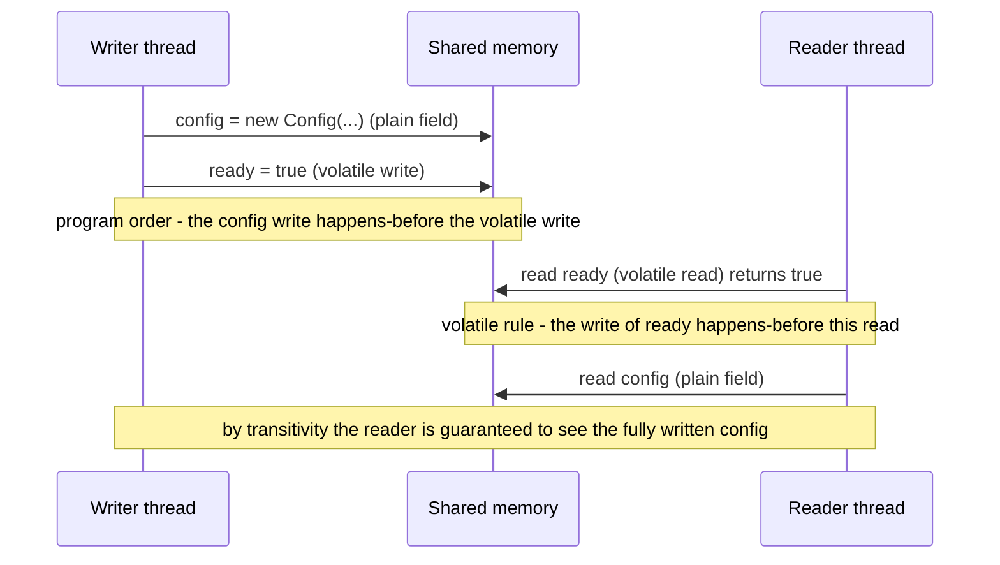
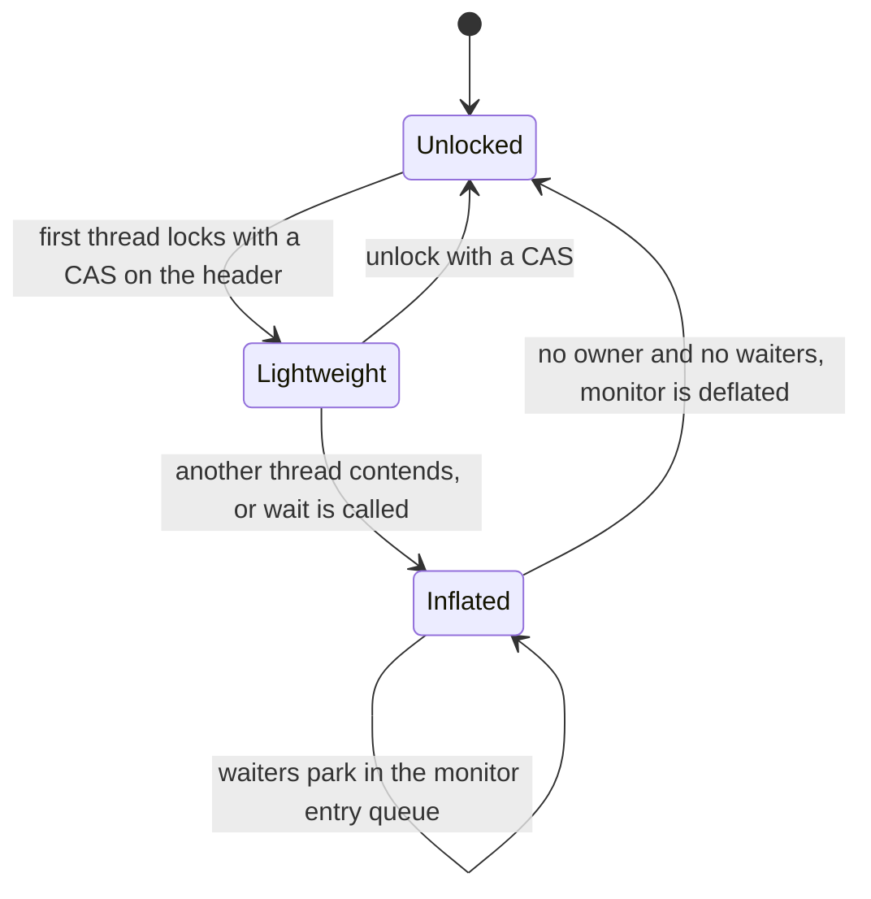
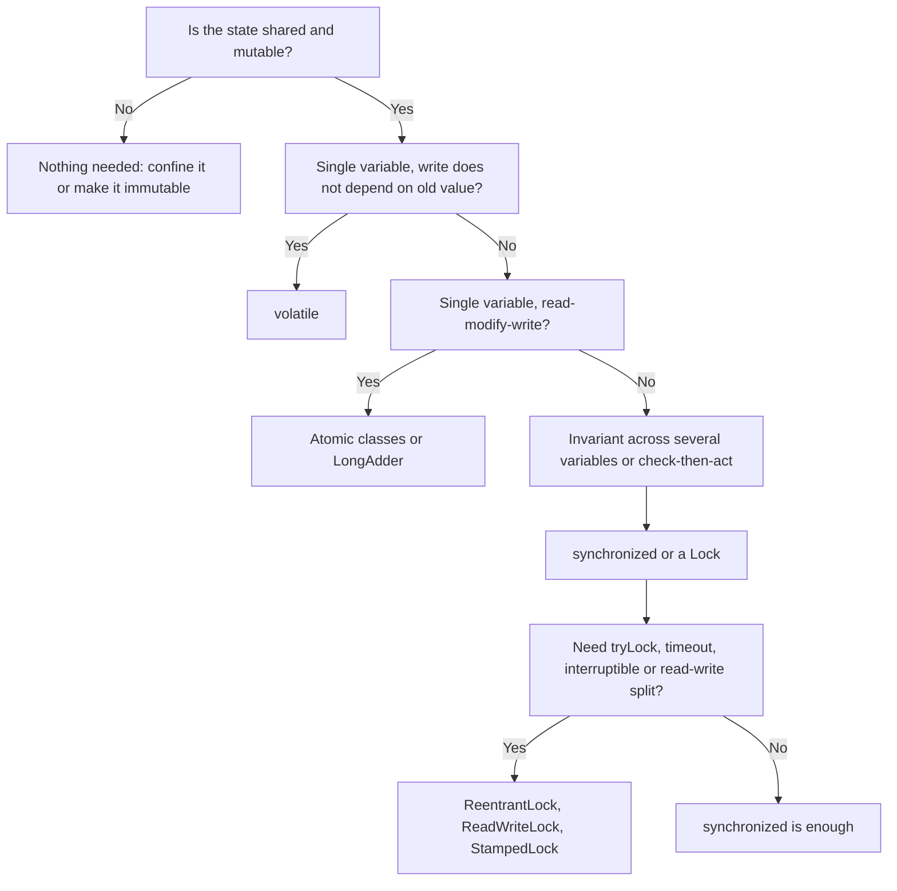

# Synchronization, `volatile`, Java Memory Model, happens-before

!!! abstract "TL;DR"
    - Shared mutable state has three separate problems: **atomicity** (compound actions interleave), **visibility** (a write may never be seen by another thread) and **ordering** (the compiler and CPU may reorder). Fix all three, not just the first.
    - The **Java Memory Model (JMM, JLS §17.4)** does not talk about caches or CPUs. It defines **happens-before**: if action A happens-before B, B is guaranteed to see A's effects. No happens-before edge between a write and a read of the same variable = a **data race** = the read may see a stale value forever.
    - **`synchronized`** gives mutual exclusion **and** visibility: unlocking a monitor happens-before every later lock of the *same* monitor. It is reentrant and, on modern JVMs, cheap when uncontended.
    - **`volatile`** gives visibility and ordering for a single read or write, and **no atomicity**. `volatile int count; count++` is still broken. Use it for flags, safe publication of immutable snapshots, and double-checked locking.
    - **`final` fields** of a properly constructed object are visible to all threads without any synchronization. Immutable objects + safe publication is the cheapest thread safety there is.

## Why it matters

Almost every Spring bean you write is a singleton shared by hundreds of request threads (or Kafka listener threads). Any field on that bean that is written after startup is shared mutable state. The bugs this causes are the worst kind: they pass unit tests, pass on your laptop, and show up in production under load as a wrong number, a duplicated action or a thread that never stops.

Interviewers use this topic to separate people who have memorised "`volatile` is for visibility" from people who can reason about *why* a piece of code is or is not safe. At Senior/Lead level you are expected to do that reasoning in a code review, in the language of happens-before, and to pick the simplest correct tool.

Before Java 5 the memory model was under-specified and partly broken (`final` fields could appear to change, `volatile` did not prevent reordering). **JSR-133** rewrote it for Java 5, and that model is what Java 21/25 still use. Java 9 added `VarHandle` (JEP 193) with finer-grained access modes on top of it.

## Core concepts

### The three problems

| Problem | What goes wrong | Example |
|---|---|---|
| **Atomicity** | A compound action (read-modify-write, check-then-act) is interleaved with another thread | `count++` loses updates; `if (!map.containsKey(k)) map.put(k, v)` puts twice |
| **Visibility** | A write by thread A is never observed by thread B | A `boolean running` flag set to `false`, but the worker loops forever |
| **Ordering** | The JIT or CPU reorders independent writes; another thread sees them in an "impossible" order | A reference is published before the object's fields are written |

Why do visibility and ordering problems exist at all? Because the JVM is allowed to optimise a thread's code as if it were the only thread, unless you tell it otherwise:

- The **JIT compiler** can keep a field in a CPU register, hoist a read out of a loop, or eliminate a "redundant" read.
- The **CPU** has store buffers and executes out of order.
- The JMM permits all of this so that single-threaded code runs fast. Synchronization actions are your way of saying "other threads care about this".

!!! tip "Say it this way in the interview"
    "CPU caches" is the popular explanation, but hardware caches are kept coherent by the CPU. The more accurate story is **compiler optimisations (register allocation, hoisting) and store buffers**. The classic stop-flag hang is the JIT rewriting `while (!stop)` into `if (!stop) while (true)`.

### The Java Memory Model and happens-before

The JMM answers one question: *given a read of a variable, which writes is that read allowed to see?*

- Within one thread, the program behaves **as-if** statements ran in program order.
- Across threads, a read is only guaranteed to see a write if the write **happens-before** the read.
- A **data race** is two accesses to the same variable from different threads, at least one a write, **not** ordered by happens-before. With a data race, the reader may see the old value, the new value, and may keep seeing the old value indefinitely.

Happens-before is a guarantee about **visibility**, not about wall-clock time. "A happens-before B" does not force A to physically run first if nobody can tell the difference. And the reverse: A running earlier in real time does **not** create a happens-before edge.

The rules that create happens-before edges (JLS §17.4.5 and the `java.util.concurrent` package docs):

| Rule | Edge |
|---|---|
| **Program order** | Each action in a thread happens-before every later action in that same thread |
| **Monitor lock** | An unlock of monitor M happens-before every later lock of M |
| **Volatile** | A write to volatile field V happens-before every later read of V |
| **Thread start** | `t.start()` happens-before every action in `t` |
| **Thread join** | Every action in `t` happens-before another thread returning from `t.join()` |
| **Interruption** | A call to `t.interrupt()` happens-before the interrupt being detected |
| **Final fields / default init** | The write of default values happens-before the first action of any thread. Final fields are frozen at the end of the constructor |
| **Transitivity** | If A happens-before B and B happens-before C, then A happens-before C |
| **`java.util.concurrent`** | Putting an item into a concurrent collection happens-before its removal by another thread. Submitting a task to an `Executor` happens-before the task runs. Actions in a task happen-before `Future.get()` returns. Releasing a `Lock`, `Semaphore` or `CountDownLatch` happens-before a later successful acquire |

**Transitivity is the powerful part.** A volatile write makes visible not only the volatile field but *everything the writing thread did before it*.


*Notice that the plain `config` field is safely visible only because the reader reads the volatile `ready` first. Swap the two writes, or skip the volatile read, and the chain is broken.*

### `synchronized`: intrinsic locks (monitors)

Every Java object can act as a lock (a **monitor**).

- `synchronized void m()` locks `this`. `static synchronized` locks the `Class` object. `synchronized (lock) { }` locks the given object.
- It gives **mutual exclusion** (only one thread inside any block guarded by that monitor) and **visibility** (the unlock/lock happens-before edge).
- It is **reentrant**: a thread that holds the monitor can acquire it again (the JVM keeps an owner and a count). Without this, a synchronized method calling another synchronized method on the same object would deadlock on itself.
- The lock is released automatically on normal exit **and** on exception. That is its main ergonomic advantage over `ReentrantLock`.
- It cannot be interrupted, timed out or tried. A thread waiting for a monitor is in the `BLOCKED` state. For those features see [Locks](03-locks-reentrantlock-readwritelock-stampedlock-deadlock-livel.md).

**Both sides must use the same lock.** A lock protects data only if *every* access (reads too) to that data takes the *same* monitor. A synchronized setter with an unsynchronized getter is a data race.

#### How HotSpot implements it

The lock state lives in the object header's **mark word**.


*Notice that the uncontended path never touches the operating system. Only real contention (or `Object.wait()`) inflates the lock to a full `ObjectMonitor` where threads park.*

- **Uncontended:** a single compare-and-swap (CAS) on the object header. Tens of nanoseconds.
- **Contended:** the lock is **inflated** to an `ObjectMonitor` with an entry queue and a wait set. Threads spin briefly, then park (an OS-level block and a context switch).
- **Biased locking** was an older optimisation that let one thread re-acquire a lock with no CAS at all. It was disabled by default and deprecated in **JDK 15 (JEP 374)** and removed in JDK 18, because its maintenance cost outweighed the gain on modern hardware and modern (mostly unsynchronized) collections.
- The JIT also performs **lock elision** (escape analysis proves the object never leaves the thread, so the lock is removed) and **lock coarsening** (merging adjacent blocks on the same lock).
- **Virtual threads:** in JDK 21, a virtual thread that blocked inside `synchronized` **pinned** its carrier platform thread. **JDK 24 (JEP 491)** removed that limitation, so in Java 25 LTS `synchronized` no longer pins. Details on the [virtual threads page](07-virtual-threads-and-structured-concurrency.md).

`wait()`, `notify()` and `notifyAll()` belong to the same monitor: they must be called while holding it, `wait()` releases it, and you must always re-check the condition in a `while` loop because of spurious wakeups. In new code prefer `java.util.concurrent` utilities (`CountDownLatch`, `BlockingQueue`, `CompletableFuture`).

### `volatile`

A volatile field has two guarantees:

1. **Visibility:** a read always sees the most recent write by any thread (the volatile happens-before rule).
2. **Ordering:** volatile accesses are synchronization actions with a total order. In practice the JIT and CPU may not move a thread's earlier writes to after its volatile write, or its later reads to before its volatile read. On x86 the JIT emits a StoreLoad barrier after a volatile write (typically a `lock`-prefixed instruction) which drains the store buffer.

What it does **not** give: atomicity of compound actions. `count++` is three steps (read, add, write). Two threads can both read 5 and both write 6.

Use `volatile` when **all** of these hold:

- Writes do not depend on the current value (or only one thread ever writes).
- The field is not part of an invariant with other fields.
- You do not need to block.

Typical correct uses: a stop/ready flag, a reference to an **immutable snapshot** that is replaced wholesale, the instance field in double-checked locking.

Other facts interviewers probe:

- **`long` and `double`:** the JLS allows a non-volatile 64-bit write to be treated as two 32-bit writes, so a reader could see a torn value. Declaring them `volatile` makes reads and writes atomic. (64-bit HotSpot writes them atomically in practice, but the spec does not promise it.) Reference writes are always atomic.
- **Arrays:** `volatile int[] arr` makes the *reference* volatile, not the elements. Use `AtomicIntegerArray` or a `VarHandle` for element-level semantics.
- **Cost:** a volatile read is nearly as cheap as a normal read on x86. A volatile write is more expensive (the barrier) and blocks some JIT optimisations, but it is far cheaper than a contended lock.

### `final` fields and safe publication

The JMM gives `final` fields a special guarantee (JLS §17.5): once the constructor finishes, any thread that obtains a reference to the object sees the correct values of its final fields, **and of everything reachable through them as of the end of the constructor**, even if the reference was passed through a data race.

The one condition: **`this` must not escape during construction** (do not register `this` as a listener, start a thread, or store it in a static field inside the constructor).

**Safe publication** means making an object reference visible to other threads together with a happens-before edge. The standard ways:

- Initialise it in a **static initialiser** (class initialisation is locked by the JVM).
- Store it in a **`volatile`** field or an `AtomicReference`.
- Store it in a **`final`** field of a properly constructed object.
- Store it in a field guarded by a **lock**, or put it into a **concurrent collection**.

An object with non-final fields published through a plain field can be seen **partially constructed** by another thread. This is the heart of the double-checked locking bug below.

### Choosing the tool


*Notice that the first question is whether you can avoid sharing at all. Locks are the last resort, not the first.*

## In practice: code & configuration

### 1. Counter: `volatile` is not atomic

=== "❌ Common mistake"
    ```java
    @Component
    public class ClaimStats {
        private volatile long processed;          // visible, but ++ is NOT atomic

        public void record() {
            processed++;                          // read, add, write: two threads can lose an update
        }

        public long processed() { return processed; }
    }
    ```

=== "✅ Correct approach"
    ```java
    @Component
    public class ClaimStats {
        // LongAdder: striped cells, best for write-heavy counters (metrics)
        private final LongAdder processed = new LongAdder();

        public void record() { processed.increment(); }

        public long processed() { return processed.sum(); }   // sum is not a point-in-time snapshot
    }
    ```
    Use `AtomicLong` when you need an exact value for decisions (`compareAndSet`, sequence numbers). See [Concurrent collections & atomics](06-concurrent-collections-and-atomics.md).

### 2. Lazy singleton: double-checked locking

=== "❌ Common mistake"
    ```java
    public class KeyProviderHolder {
        private static KeyProvider instance;                 // not volatile

        public static KeyProvider get() {
            if (instance == null) {                          // racy read, no happens-before
                synchronized (KeyProviderHolder.class) {
                    if (instance == null) {
                        // allocate -> publish reference -> run constructor may be reordered:
                        // another thread can see a non-null but half-built object
                        instance = new KeyProvider();
                    }
                }
            }
            return instance;
        }
    }
    ```

=== "✅ Correct approach"
    ```java
    public class KeyProviderHolder {
        private static volatile KeyProvider instance;        // volatile = safe publication

        public static KeyProvider get() {
            KeyProvider local = instance;                    // one volatile read on the fast path
            if (local == null) {
                synchronized (KeyProviderHolder.class) {
                    local = instance;                        // re-check under the lock
                    if (local == null) {
                        instance = local = new KeyProvider();
                    }
                }
            }
            return local;
        }
    }
    ```

=== "✅ Simpler: holder idiom"
    ```java
    public class KeyProviderHolder {
        private KeyProviderHolder() {}

        private static class Holder {                        // loaded only on first get()
            static final KeyProvider INSTANCE = new KeyProvider();
        }

        // JVM class initialisation is lazy AND thread-safe, no locking code needed
        public static KeyProvider get() { return Holder.INSTANCE; }
    }
    ```
    In a Spring application, the honest answer is "let the container manage a singleton bean". Know these idioms for the interview and for library code.

### 3. Copy-on-write snapshot: the best use of `volatile` in a service

A reference-data cache that is read on every request and refreshed occasionally.

```java
@Component
public class DrugReferenceCache {

    // Immutable snapshot behind a volatile reference: readers never lock, never see a half-updated map
    private volatile Map<String, DrugInfo> snapshot = Map.of();

    private final DrugReferenceClient client;

    public DrugReferenceCache(DrugReferenceClient client) { this.client = client; }

    public Optional<DrugInfo> find(String ndc) {
        return Optional.ofNullable(snapshot.get(ndc));       // one volatile read, then pure immutable data
    }

    @Scheduled(fixedDelayString = "${reference.refresh:PT5M}")
    public void refresh() {
        Map<String, DrugInfo> fresh = client.fetchAll();     // build completely OFF to the side
        snapshot = Map.copyOf(fresh);                        // single volatile write = atomic swap
    }
}
```

Why this is correct: the write does not depend on the old value, the map is immutable (`Map.copyOf`), and the volatile write happens-before every later read. Readers that are mid-request keep using the old snapshot, which is consistent.

### 4. Compound invariant: needs a lock

```java
public final class RateWindow {
    private final Object lock = new Object();    // private lock: outside code cannot lock on it
    private long windowStart;                    // guarded by lock
    private int count;                           // guarded by lock

    public boolean tryAcquire(long now, int limit, long windowMillis) {
        synchronized (lock) {                    // two fields change together: volatile cannot do this
            if (now - windowStart >= windowMillis) {
                windowStart = now;
                count = 0;
            }
            if (count >= limit) return false;
            count++;
            return true;
        }
    }
}
```

Keep the critical section small and **never do I/O (HTTP, DB, Kafka send) while holding a lock**.

## Real-world usage

- **Spring Framework itself** uses these idioms everywhere: `DefaultSingletonBeanRegistry` guards singleton creation with locking plus concurrent maps, and many framework classes hold lazily computed state in `volatile` fields.
- **`ConcurrentHashMap`** (Java 8+) uses volatile reads and CAS for the common path and `synchronized` on the bin's head node for writes. A core JDK class chose `synchronized` over `ReentrantLock`, which tells you uncontended intrinsic locks are cheap.
- **LMAX Disruptor** made **false sharing** famous: two hot volatile fields on the same 64-byte cache line make cores fight over that line. The fix is padding, which the JDK does internally with `@Contended` (used in `LongAdder`'s cells and `ForkJoinPool`).
- **The double-checked locking story:** the broken idiom was widely recommended in the late 1990s. The "Double-Checked Locking is Broken" declaration (Bill Pugh and others) documented why, and JSR-133 fixed it for `volatile` fields in Java 5.
- **Virtual-thread pinning:** early adopters of JDK 21 virtual threads, Netflix among them, reported hangs where virtual threads blocked inside `synchronized` pinned every carrier thread. This drove JEP 491 in JDK 24.
- **Healthcare and banking relevance:** race conditions are correctness bugs, not only performance bugs. A lost update on a balance, a duplicate claim submission from a check-then-act race, or one member's data placed in a shared mutable field and returned to another member (a PHI/PII leak) are the realistic failure modes. Remember also that JVM locks protect **one JVM only**. With several pods, cross-instance correctness needs database constraints, optimistic locking (versions), idempotency keys or a distributed lock.

## Trade-offs & production gotchas

| Option | Pros | Cons | Use when |
|---|---|---|---|
| **Immutability / confinement** | No locks, no races, easy to reason about | Allocation on every change | Default choice: DTOs, records, config snapshots, request-scoped data |
| **`volatile`** | Lock-free reads, never blocks, simple | No atomicity, single variable only | Flags, publishing an immutable snapshot, DCL |
| **Atomics / `LongAdder`** | Lock-free compound updates on one variable | Cannot cover multi-variable invariants; CAS retries under heavy contention | Counters, sequence numbers, CAS state machines |
| **`synchronized`** | Simple, auto-release, JIT-optimised, good diagnostics in thread dumps | No timeout, no tryLock, not interruptible, one condition queue | Short critical sections guarding multi-field invariants |
| **`ReentrantLock` and friends** | tryLock, timeout, interruptible, fairness, multiple conditions, read/write split | Must unlock in `finally`; more code | You need a feature `synchronized` lacks |

!!! warning "Gotchas"
    - **Locking on the wrong object.** `synchronized (new Object())`, locking on a field that is reassigned, or on a boxed `Integer`/interned `String` (shared with unrelated code) gives no protection or surprise contention. Use a `private final Object lock`.
    - **Instance lock vs class lock.** A `synchronized` instance method does not exclude a `static synchronized` method. They use different monitors.
    - **Synchronized writer, plain reader.** Reads need the lock (or `volatile`) too.
    - **Thread-safe pieces, unsafe whole.** `ConcurrentHashMap` is thread-safe, but `if (!map.containsKey(k)) map.put(k, v)` is not atomic. Use `computeIfAbsent` or `putIfAbsent`.
    - **`volatile` on a mutable object** (for example a `volatile HashMap`) only protects the reference. Mutating the map in place is still a race.
    - **Letting `this` escape** from a constructor voids the `final` field guarantee.
    - **"It works on my machine."** x86 has a strong memory model (TSO) that hides many reordering bugs. The same code can fail on **ARM (AWS Graviton, Apple Silicon)**, which is weaker. Migrating to ARM can expose latent races that never showed up on x86.
    - **`Thread.sleep()` or `System.out.println()` "fixing" a race.** They change timing or happen to take a lock internally. The race is still there.
    - **Holding a lock across I/O.** One slow upstream call turns into every request thread `BLOCKED` on the same monitor.

## How this connects to my experience

The resume does not list low-level concurrency work directly, so the honest position is: *"I build Spring Boot services where the framework manages threads, and my job as lead is to keep shared state safe and catch these bugs in review."* Then give concrete examples.

- **Where I used it:**
    - **OptumRx GraphQL Consumer Service** (integration layer over 5 upstream systems, 750K+ users): every resolver, client and service is a singleton bean hit by many request threads. The rule enforced in code review: beans are stateless, per-request data lives in method parameters or the GraphQL context, never in fields. *[confirm you can cite a review where you caught a shared mutable field]*
    - **Redis-based caching for UI reference data:** if there was also a local in-memory layer in front of Redis, the volatile immutable-snapshot pattern (example 3) is the natural design. *[confirm whether a local cache layer existed]*
    - **Kafka workflows with retry and DLQ:** listener containers with `concurrency > 1` call the same listener bean from several threads, so handler state must be thread-safe, and JVM locks do not help across pods. Idempotency did the real work. *[confirm listener concurrency and the idempotency mechanism]*
    - **CipherTrust Cloud Key Management (Coriolis):** automated key rotation is a classic "publish a new immutable version atomically" problem, the same shape as a volatile reference swap. *[confirm how the in-memory key/cache state was refreshed during rotation]*
- **Talking points:**
    - "My first choice is to remove shared mutable state: stateless beans, immutable records, request-scoped context. Synchronization is what is left over."
    - "For read-mostly reference data I publish an immutable snapshot through a volatile field, so reads are lock-free and always consistent."
    - "In a clustered service, `synchronized` only protects one pod. For business invariants I rely on the data store: unique keys, optimistic versions, idempotency keys."
    - "As a lead I set standards: no lock held across I/O, `private final` lock objects, document `@GuardedBy`, prefer `java.util.concurrent` over hand-rolled `wait/notify`."
- **Likely follow-up chain:** "Are Spring beans thread-safe?" (No. Singleton scope means one instance, not thread safety. Stateless beans are safe by construction.) → "You have a field that must change at runtime, how?" (Volatile reference to an immutable object, or an atomic.) → "Why is volatile enough there but not for a counter?" (Write does not depend on the old value vs read-modify-write.) → "And with 6 pods?" (JVM locks are per process, move the invariant to the database or a distributed lock with fencing.)

## Interview questions

### Fundamentals

??? question "Q1. What is the difference between `synchronized` and `volatile`?"
    **Answer:** `synchronized` gives mutual exclusion plus visibility. Only one thread runs the guarded block, so compound actions are atomic, and the unlock happens-before the next lock so changes are visible. `volatile` gives visibility and ordering for a single read or write of one field, with no mutual exclusion and no blocking. So `volatile` is right for a flag or a reference swap, and wrong for `count++` or any invariant over several fields.

    **Interviewer listens for:** the three words atomicity, visibility, ordering. That `volatile` never blocks. A concrete example of each.

    **Common wrong answer:** "`volatile` is a lighter `synchronized`." It solves a smaller problem. It is not a cheaper version of the same thing.

??? question "Q2. Predict the output. Two threads each call `inc()` 100,000 times on `volatile int count; void inc() { count++; }`. What is `count` after both are joined?"
    **Answer:** Some value **between 2 and 200,000, usually less than 200,000**, and different on each run. `count++` is read, add, write. Two threads can read the same value and both write value+1, losing an update. `volatile` only guarantees each individual read and write is visible. Fix with `AtomicInteger.incrementAndGet()`, `LongAdder`, or `synchronized`.

    **Interviewer listens for:** naming the read-modify-write race, not "caching".

    **Common wrong answer:** "200,000, because volatile makes it thread-safe."

??? question "Q3. What is a data race, and how is it different from a race condition?"
    **Answer:** A **data race** is a JMM term: two threads access the same variable, at least one writes, and the accesses are not ordered by happens-before. A **race condition** is a correctness bug where the result depends on timing or interleaving. You can have one without the other. Check-then-act on a `ConcurrentHashMap` has no data race (every access is properly synchronized) but is a race condition. A racy lazily-cached hash code (like `String.hashCode()`) is a data race that is harmless by design.

    **Interviewer listens for:** that thread-safe building blocks do not make a compound action safe.

    **Common wrong answer:** "They are the same thing." A program can be free of data races and still have race conditions (check-then-act on a ConcurrentHashMap).

??? question "Q4. What does it mean that `synchronized` is reentrant, and why does it matter?"
    **Answer:** A thread that already owns a monitor can lock it again without blocking. The JVM tracks the owner and a hold count, and releases the monitor when the count returns to zero. Without it, a synchronized method calling another synchronized method on the same object (or a subclass calling `super.method()`) would deadlock on itself.

    **Interviewer listens for:** owner + hold count, nested calls and overriding methods would self-deadlock otherwise.

    **Common wrong answer:** "Reentrant means another thread can enter." It means the same thread can re-enter.

??? question "Q5. What is the difference between a `synchronized` instance method and a `static synchronized` method?"
    **Answer:** The instance method locks `this`. The static method locks the `Class` object. They are different monitors, so one thread can be in each at the same time. If both touch the same static state, that state is not protected.

    **Common wrong answer:** "`synchronized` locks the method." Locks are always on an object, never on code.

    **Interviewer listens for:** this vs Class monitor, both can run at once, protecting static state.

### Intermediate

??? question "Q6. Explain happens-before and list the main rules."
    **Answer:** Happens-before is the JMM's visibility guarantee: if A happens-before B, then B sees the effects of A. It is not about wall-clock time. Main rules: program order within a thread, monitor unlock before a later lock of the same monitor, volatile write before a later read of the same field, `Thread.start()` before the thread's actions, a thread's actions before `join()` returns, final field freeze at the end of the constructor, and transitivity. `java.util.concurrent` adds more, such as task submission before task execution and a put into a concurrent collection before the take.

    **Interviewer listens for:** transitivity and an example of using it (a volatile write publishing earlier plain writes).

    **Common wrong answer:** "A happens-before B means A executes first." The JVM can reorder as long as the visible result is consistent, and executing first in time creates no guarantee.

??? question "Q7. Predict the behaviour. `boolean stop` is a plain field. Thread A runs `while (!stop) { i++; }`. The main thread sleeps 1 second and sets `stop = true`. What happens?"
    **Answer:** It may **never terminate**. There is no happens-before edge between the write and the reads, so the JIT is allowed to hoist the read out of the loop and compile it as `if (!stop) while (true) i++;`. It often works in the interpreter and hangs once the loop is JIT-compiled (commonly with the server compiler). Making `stop` volatile fixes it. Adding a `println` in the loop often "fixes" it by accident because `println` takes a lock internally and the call stops the JIT from hoisting the read, which is not a real fix.

    **Interviewer listens for:** the JIT hoisting explanation, and that the result is "allowed to hang", not "will hang".

    **Common wrong answer:** "It stops after a short delay because the CPU cache flushes eventually." The JIT can hoist the read so it never stops.

??? question "Q8. Why is double-checked locking broken without `volatile`?"
    **Answer:** `instance = new Foo()` is roughly: allocate memory, run the constructor, assign the reference. Without a happens-before edge, the assignment can become visible before the constructor's writes. A second thread does the first unsynchronized null check, sees non-null, and uses a partially constructed object. Marking the field `volatile` makes the write a safe publication: everything the constructor did happens-before the volatile write, which happens-before the other thread's read. The static holder idiom or an enum singleton avoids the problem entirely.

    **Interviewer listens for:** "partially constructed object" and "safe publication", plus the local-variable trick to read the volatile once.

    **Common wrong answer:** "Two instances get created." The inner check under the lock prevents that. The bug is visibility of a half-built object.

??? question "Q9. What guarantees do `final` fields give in concurrent code?"
    **Answer:** If the object is properly constructed (`this` does not escape the constructor), any thread that gets a reference sees the final fields correctly initialised, plus the state reachable through them as of the end of the constructor, even when the reference itself was published through a data race. That is why immutable objects (records, `String`, `Map.of`) can be shared freely. Non-final fields get no such guarantee.

    **Interviewer listens for:** the `this`-escape condition, and that immutability is a concurrency tool.

    **Common wrong answer:** "final only means the reference cannot change." It also gives safe publication of initialised state.

??? question "Q10. Is a read or write of a `long` atomic?"
    **Answer:** Not guaranteed. The JLS allows a non-volatile `long` or `double` write to be split into two 32-bit writes, so a reader could see half of one value and half of another. Declaring it `volatile` (or guarding it with a lock, or using `AtomicLong`) guarantees atomic reads and writes. On 64-bit HotSpot it is atomic in practice, but you should code to the spec. Reference reads and writes are always atomic.

    **Interviewer listens for:** non-volatile long/double may tear, volatile makes single reads and writes atomic, not compound ops.

    **Common wrong answer:** "Yes, all primitive writes are atomic."

### Senior

??? question "Q11. How is `synchronized` implemented in HotSpot, and is it slow?"
    **Answer:** The lock state is stored in the object header's mark word. An uncontended lock is taken with a CAS on the header (lightweight locking), with no OS involvement. Under contention, or when `wait()` is called, the lock inflates to an `ObjectMonitor` with an entry queue and a wait set. Threads spin briefly and then park. The JIT can remove locks through escape analysis (lock elision) and merge adjacent ones (coarsening). Biased locking was deprecated and disabled by default in JDK 15 (JEP 374) and removed in JDK 18. So uncontended `synchronized` is cheap. The cost that matters is **contention**: parked threads, context switches, and a serial section that limits scalability (Amdahl's law).

    **Interviewer listens for:** mark word, CAS, inflation, biased locking removal, "contention is the cost, not the keyword".

    **Common wrong answer:** "`synchronized` is slow, always use `ReentrantLock`." That advice dates from Java 5.

??? question "Q12. When would you choose `synchronized` over `ReentrantLock`, and has that changed with virtual threads?"
    **Answer:** Default to `synchronized` for short critical sections: less code, automatic release, well optimised. Choose `ReentrantLock` when you need `tryLock`, timeouts, interruptible acquisition, fairness or several `Condition`s. In JDK 21, virtual threads were **pinned** to their carrier while blocking inside `synchronized`, so the advice then was to use `ReentrantLock` around blocking I/O. JEP 491 in JDK 24 fixed this, so on Java 25 LTS that reason is gone. On Java 21 it still applies, and `-Djdk.tracePinnedThreads=full` (a JDK 21 to 23 option, removed in JDK 24) or the JFR `jdk.VirtualThreadPinned` event finds the problem spots.

    **Interviewer listens for:** version awareness (21 vs 24/25) and choosing by feature need, not folklore.

    **Common wrong answer:** "ReentrantLock is always faster than synchronized." Modern JVMs optimise synchronized well; choose by features.

??? question "Q13. What is false sharing and how does it relate to `volatile`?"
    **Answer:** CPUs cache memory in lines (typically 64 bytes). If two threads write to different variables that sit on the same line, each write invalidates the other core's copy, so the line bounces between cores even though there is no logical sharing. Hot `volatile` or atomic fields written by different threads are the usual victims. The fix is to separate them with padding. The JDK does this with `@jdk.internal.vm.annotation.Contended` in `LongAdder` cells and `ForkJoinPool` queues. Application code needs `-XX:-RestrictContended` (and, since JDK 9, `--add-exports java.base/jdk.internal.vm.annotation=ALL-UNNAMED` to compile against the internal annotation) to use it, so in practice prefer `LongAdder` or restructure the data. Measure with JMH before optimising.

    **Interviewer listens for:** that this is a performance problem, not a correctness problem, and that you would measure first.

    **Common wrong answer:** "volatile fixes false sharing." volatile writes make it worse; padding or @Contended separates the fields.

??? question "Q14. Why does racy code often work on x86 and fail on ARM (for example after moving to AWS Graviton)?"
    **Answer:** x86 has a strong memory model (total store order): the only reordering is that a store can be delayed in the store buffer past a later load of a different address. ARM and other weakly ordered architectures can reorder stores with stores and loads with loads. Code with a data race, such as unsafe publication through a plain field, can accidentally work on x86 because the hardware never produces the bad order, and then break on ARM. The JMM is the contract, not the hardware. Code that is correct under the JMM is correct on both. Note that JIT-level reordering and hoisting can break racy code on x86 too.

    **Interviewer listens for:** "program to the JMM, not to the CPU".

    **Common wrong answer:** "Graviton has a JVM bug." The code relied on undefined behaviour that x86 happened to hide.

### Scenario-based

??? question "Q15. Under load, a few users occasionally get another user's data in the response. The service is a Spring Boot app. Where do you look?"
    **Answer:** This is the signature of **per-request state stored in a shared object**. Look for: a singleton bean (`@Service`, `@Component`, a resolver, a filter, a mapper) with a mutable instance field set during the request, a static field or shared non-thread-safe helper (`SimpleDateFormat`, a reused builder or buffer), a `ThreadLocal` that is not cleared on pooled threads, or a cache key that omits the user or tenant. Fix by making beans stateless (pass data as parameters or request-scoped context), using immutable objects, clearing `ThreadLocal`s in `finally`, and adding a concurrent test that runs two users in parallel. In healthcare this is a PHI disclosure, so it is also an incident-response matter, not only a bug fix.

    **Interviewer listens for:** going straight to shared mutable state in singletons, and treating the fix as "remove the state", not "add `synchronized`".

    **Common wrong answer:** "Make the method synchronized." It serialises all requests through one lock and hides the design flaw.

??? question "Q16. A code review shows `private volatile Map<String, Rule> rules = new HashMap<>();` with a scheduled job calling `rules.clear(); rules.putAll(fresh);`. What do you say?"
    **Answer:** `volatile` only protects the **reference**, and the reference never changes here. The `HashMap` is mutated in place while request threads read it. That is a data race on a non-thread-safe structure (readers can see an empty or half-filled map, and concurrent structural changes can corrupt it). Fix: build a new map off to the side and swap the reference in one volatile write: `rules = Map.copyOf(fresh);`. Readers then see either the old complete snapshot or the new one. If entries change individually and often, use `ConcurrentHashMap` instead.

    **Interviewer listens for:** immutable snapshot + atomic swap, and noticing readers would see an empty map between `clear()` and `putAll()`.

    **Common wrong answer:** "volatile makes the map thread-safe."

??? question "Q17. You guard 'check balance, then debit' with `synchronized` and it passes all tests. In production with 4 pods, accounts still go negative. Why, and what is the fix?"
    **Answer:** A JVM monitor provides mutual exclusion **inside one process**. Two pods each take their own lock and both pass the check. The invariant must be enforced where the shared state lives: a conditional atomic update in the database (`UPDATE ... SET balance = balance - :amt WHERE id = :id AND balance >= :amt`), optimistic locking with a version column and retry, a database constraint, or `SELECT ... FOR UPDATE` inside a transaction. A distributed lock (Redis, ZooKeeper) is a last resort and needs fencing tokens to be safe. Add an idempotency key so retries do not debit twice.

    **Interviewer listens for:** recognising the limit of in-process locking, and preferring data-store guarantees over a distributed lock.

    **Common wrong answer:** "Use a static lock so all pods share it." Static fields are still per JVM.

??? question "Q18. A thread dump shows 180 threads `BLOCKED (on object monitor)` waiting for the same lock, and one thread `RUNNABLE` holding it inside a socket read. What happened and how do you fix it?"
    **Answer:** A critical section contains blocking I/O. One thread holds the monitor while waiting on a slow upstream, and every other request queues behind it, so throughput collapses to one request at a time and the pool fills. Immediate mitigation: a timeout on the upstream call. Real fix: move the I/O out of the lock (compute outside, lock only to update in-memory state), or replace the lock with a per-key mechanism such as `ConcurrentHashMap.computeIfAbsent` with a memoised `CompletableFuture`, so only callers for the same key wait. Reading thread dumps is covered on the [diagnosing production issues](10-diagnosing-production-issues-thread-dumps-heap-dumps-memory.md) page.

    **Interviewer listens for:** reading the dump correctly (BLOCKED = waiting for a monitor, owner shown by "locked <address>"), and "never hold a lock across I/O".

    **Common wrong answer:** "Increase the thread pool size." More threads just queue behind the same lock.

## Cheat sheet

| Concept | Remember |
|---|---|
| Three problems | Atomicity, visibility, ordering |
| JMM | JLS §17.4, rewritten by JSR-133 in Java 5. Defines which writes a read may see |
| Happens-before | Visibility guarantee, not wall-clock order. Transitive |
| Data race | Conflicting accesses with no happens-before edge. Reader may see stale values forever |
| `synchronized` | Mutual exclusion + visibility. Reentrant. Auto-release. Same monitor for all accesses |
| Instance vs static | `this` vs the `Class` object: different locks |
| `volatile` | Visibility + ordering, **no atomicity**. `count++` still broken |
| Good `volatile` uses | Stop flag, immutable snapshot swap, DCL instance field |
| `long`/`double` | Non-volatile writes may tear per the spec. `volatile` makes them atomic |
| `volatile` array or map | Only the reference is volatile, not the contents |
| `final` fields | Safe without synchronization if `this` does not escape the constructor |
| Safe publication | Static initialiser, `volatile`, `final`, lock, or concurrent collection |
| DCL | Needs `volatile`. Prefer the holder idiom, an enum, or a Spring bean |
| HotSpot locking | Header CAS when uncontended, inflates to `ObjectMonitor` on contention |
| Biased locking | Disabled and deprecated in JDK 15 (JEP 374), removed in JDK 18 |
| Virtual threads | `synchronized` pins in JDK 21. Fixed in JDK 24 (JEP 491), so fine on 25 LTS |
| Cluster | JVM locks are per process. Use DB constraints, versions, idempotency keys |
| Rule of thumb | Don't share, else immutable, else `volatile`/atomic, else lock |

## Sources

1. [Java Language Specification, Chapter 17: Threads and Locks (Java SE 21)](https://docs.oracle.com/javase/specs/jls/se21/html/jls-17.html): the memory model, happens-before rules (§17.4.5), final field semantics (§17.5), non-atomic `long`/`double` (§17.7).
2. [`java.util.concurrent` package summary: Memory Consistency Properties](https://docs.oracle.com/en/java/javase/21/docs/api/java.base/java/util/concurrent/package-summary.html): the extra happens-before guarantees of executors, concurrent collections and synchronizers.
3. [JSR-133 (Java Memory Model) FAQ, Jeremy Manson and Brian Goetz](https://www.cs.umd.edu/~pugh/java/memoryModel/jsr-133-faq.html): what changed in Java 5, volatile and final semantics.
4. [The "Double-Checked Locking is Broken" Declaration](https://www.cs.umd.edu/~pugh/java/memoryModel/DoubleCheckedLocking.html): why DCL fails without `volatile`, and the fixes.
5. [JEP 374: Deprecate and Disable Biased Locking](https://openjdk.org/jeps/374): removal of biased locking from JDK 15 on.
6. [JEP 491: Synchronize Virtual Threads without Pinning](https://openjdk.org/jeps/491): `synchronized` and virtual threads in JDK 24+.
7. [JEP 193: Variable Handles](https://openjdk.org/jeps/193) and Doug Lea's [Using JDK 9 Memory Order Modes](https://gee.cs.oswego.edu/dl/html/j9mm.html): plain, opaque, acquire/release and volatile access modes.
8. *Java Concurrency in Practice* (Goetz et al.), chapters 2, 3 and 16, and Aleksey Shipilëv's [Java Memory Model Pragmatics](https://shipilev.net/blog/2014/jmm-pragmatics/): safe publication, visibility and the hardware view.
