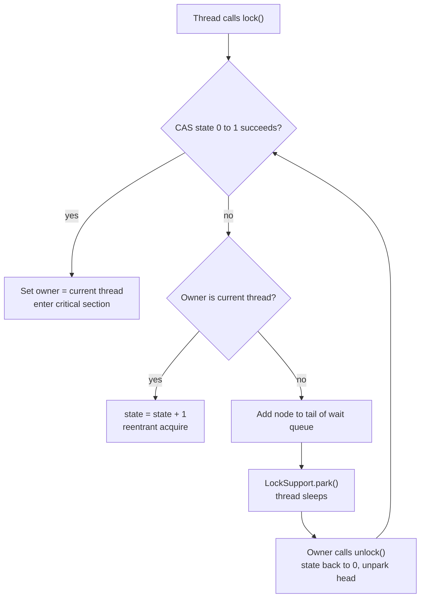
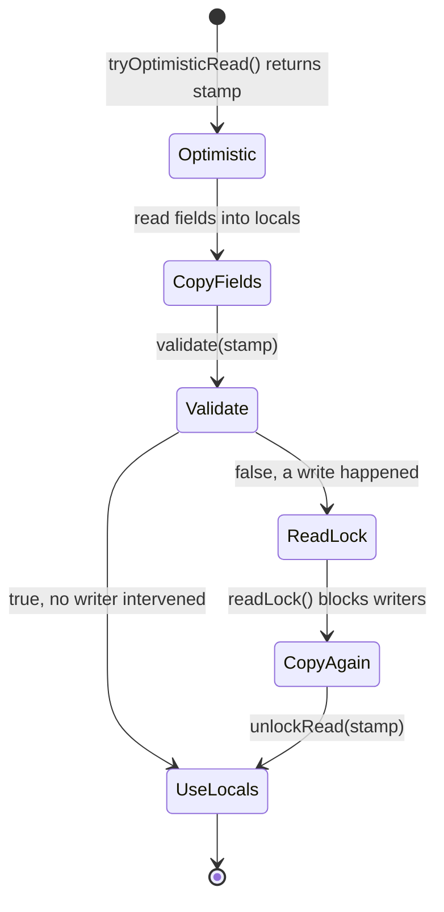
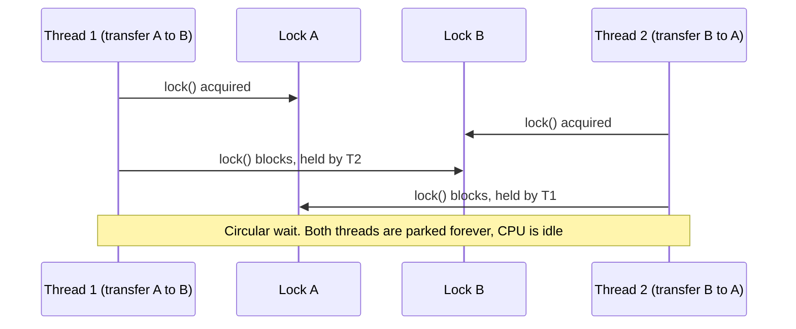

# Locks: ReentrantLock, ReadWriteLock, StampedLock; Deadlock, Livelock, Starvation

!!! abstract "Key takeaways"
    - **`ReentrantLock`** does what `synchronized` does, plus four things `synchronized` cannot: **`tryLock` with timeout**, **interruptible waiting**, **optional fairness** and **multiple `Condition`s**. The price: you must `unlock()` in `finally` yourself.
    - **`ReentrantReadWriteLock`** allows many readers *or* one writer. It only pays off when reads are **frequent and long**. You can **downgrade** (write → read) but never **upgrade** (read → write hangs forever).
    - **`StampedLock`** adds an **optimistic read** that takes no lock at all: read, then `validate(stamp)`. It is **not reentrant**, has no `Condition`, and has no owner.
    - **Deadlock** needs four conditions at once (mutual exclusion, hold-and-wait, no pre-emption, circular wait). The practical fixes are a **global lock order** or **`tryLock` with timeout and back-off**.
    - **Livelock** = threads are busy but make no progress (they keep politely retrying). **Starvation** = one thread never gets its turn (unfair lock, long holders, low priority).

## Why it matters

`synchronized` (page 2) is simple, but it is all-or-nothing: a thread that wants the monitor waits forever, cannot be interrupted, cannot time out and cannot ask "is it free?". In a service that calls databases and other services, "wait forever" is exactly how one slow dependency turns into a full outage.

`java.util.concurrent.locks` (Java 5, by Doug Lea) gives you locks as ordinary objects with richer behaviour. Interviewers at senior level use this topic for two things:

1. To check you know **which tool to pick** and can justify it (most of the time the honest answer is "`synchronized` or a concurrent collection is enough").
2. To check you can **reason about failure**: explain a deadlock from a thread dump, and design code that cannot deadlock.

## Core concepts

### The foundation: AbstractQueuedSynchronizer (AQS)

`ReentrantLock`, `ReentrantReadWriteLock`, `Semaphore` and `CountDownLatch` are all built on one class: `AbstractQueuedSynchronizer`. (`StampedLock` has its own implementation with similar ideas.) AQS has three parts:

- **`state`**: a single `volatile int`. For `ReentrantLock` it is the **hold count** (0 = free). For `ReentrantReadWriteLock` the upper 16 bits count read holds and the lower 16 bits count write holds, which is why each is capped at **65,535**.
- **Owner thread**: which thread holds the lock exclusively (this is what makes reentrancy and deadlock detection possible).
- **A FIFO wait queue** (a CLH-queue variant) of threads that failed to acquire.

Acquire works like this: try to **CAS** `state` from 0 to 1. If that works, you own the lock and never touched the OS. If it fails, enqueue a node and call `LockSupport.park()` so the thread sleeps. On `unlock()`, the owner sets `state` back and `unpark()`s the first queued thread.


*Notice that an uncontended lock is just one CAS, with no queue and no kernel call. Also notice that a woken thread goes back to the CAS and can lose to a newly arriving thread: that is "barging", and it is why the default lock is unfair.*

### ReentrantLock

**Reentrant** means the owner can acquire again without blocking; each `lock()` needs a matching `unlock()`. What it adds over `synchronized`:

| Capability | `synchronized` | `ReentrantLock` |
|---|---|---|
| Release | Automatic at block exit | Manual, `unlock()` in `finally` |
| Try without waiting | No | `tryLock()` |
| Timed wait | No | `tryLock(timeout, unit)` |
| Interruptible wait | No | `lockInterruptibly()` |
| Fairness | No (always unfair) | `new ReentrantLock(true)` |
| Wait sets | One (`wait`/`notify`) | Many (`newCondition()`) |
| Introspection | Very little | `isLocked()`, `getQueueLength()`, `isHeldByCurrentThread()` |

**Fair vs unfair.** The default is **unfair**: a thread arriving at the right moment can take the lock ahead of queued threads. That sounds bad but gives much higher throughput, because handing the lock to a thread that is already running avoids waking a parked thread (a context switch) while the lock sits idle. A **fair** lock gives strict FIFO and prevents starvation, at a large throughput cost. Use fair mode only when you have measured starvation.

**Conditions.** A `Condition` is the `wait`/`notify` of explicit locks: `await()` releases the lock and sleeps; `signal()` wakes one waiter. Because one lock can have several conditions (for example `notFull` and `notEmpty`), you can wake exactly the right group of threads. `ArrayBlockingQueue` is built this way.

### ReentrantReadWriteLock

One lock, two views: a **shared read lock** and an **exclusive write lock**.

- Many threads may hold the read lock at once, if no one holds the write lock.
- The write lock needs everyone else out: no readers, no other writer.
- **Downgrading is allowed:** hold write, acquire read, release write. You keep a consistent view while letting other readers in.
- **Upgrading is not possible:** a thread holding the read lock that asks for the write lock waits for all readers to leave, including itself. It blocks forever.
- Only the write lock supports `Condition`. `readLock().newCondition()` throws `UnsupportedOperationException`.

The read lock is not free. Each acquire and release does a CAS on the shared `state` word, so many cores doing short reads all fight over the same cache line. For a short critical section (a map lookup), a read-write lock is often **slower** than a plain lock. It wins when reads are long (as a rough guide, well beyond the cost of the lock bookkeeping itself: think microseconds of work or I/O-free scans of large structures, not a single lookup) and writes are rare. Measure rather than trust a threshold.

**Writer starvation.** With a constant stream of readers the read count might never reach zero. The JDK reduces this: in the default unfair mode, a new reader blocks if the thread at the head of the queue is a waiting writer. This is a heuristic, not a guarantee; the Javadoc says a continuously contended unfair lock may postpone readers or writers indefinitely.

### StampedLock

Added in Java 8 for read-mostly data. It has three modes, and every acquire returns a `long` **stamp** that you pass back to release:

1. **Write** (`writeLock()`): exclusive.
2. **Pessimistic read** (`readLock()`): shared, like a read-write lock.
3. **Optimistic read** (`tryOptimisticRead()`): takes **no lock**. It returns a stamp (the current version). You copy the fields into local variables, then call `validate(stamp)`. If a writer got in, validation fails and you retry under a real read lock.


*Notice that on the happy path the reader writes nothing to shared memory, so readers scale across cores and never block a writer. The cost is that the copied values may be inconsistent until `validate` returns true, so you must not act on them before that.*

Important limits:

- **Not reentrant.** A thread that holds the write lock and calls `writeLock()` again deadlocks with itself.
- **No owner.** Any thread can release with a valid stamp, and deadlock-detection tools cannot see who holds it.
- **No `Condition`** support.
- A stamp of **0** means "failed" (from the `try...` methods).
- `tryConvertToWriteLock(stamp)` gives a safe form of upgrade: it succeeds only if no one else is in the way.

### Deadlock, livelock, starvation

These are the three **liveness** failures: the program is not wrong, it just stops making progress.

**Deadlock**: each thread in a cycle holds a lock the next one needs. All four **Coffman conditions** must hold at the same time:

| Condition | Meaning | How to break it |
|---|---|---|
| Mutual exclusion | The resource cannot be shared | Use immutable data, atomics, lock-free structures |
| Hold and wait | Hold one lock while waiting for another | Take all locks at once, or hold only one at a time |
| No pre-emption | A lock cannot be taken away | `tryLock` with timeout: give up and release |
| Circular wait | A waits for B, B waits for A | **Global lock ordering** |


*Notice that each thread's code is correct on its own. The bug exists only in the interleaving, and only because the two threads take the same locks in opposite order.*

**Livelock**: threads are not blocked; they are running, reacting to each other, and still getting nowhere. The classic case is two threads that both `tryLock`, both fail, both release and both retry at exactly the same moment, forever. CPU is busy; throughput is zero. The fix is **randomised back-off (jitter)** so that they stop moving in step. The same idea shows up in distributed systems: retry storms, and a poison message that is re-queued and re-consumed forever.

**Starvation**: one thread is ready to run but never gets the resource because others keep winning. Causes: an unfair lock under heavy contention, a thread that holds a lock for a very long time, readers starving a writer, or tasks stuck behind others in a thread pool.

| | Thread state | CPU | Visible in thread dump as |
|---|---|---|---|
| Deadlock | `BLOCKED` / `WAITING` | Idle | "Found one Java-level deadlock" |
| Livelock | `RUNNABLE` | High | Same threads in the same retry loop, dump after dump |
| Starvation | `BLOCKED` / `WAITING` (victim only) | Normal | One thread waiting for the same lock in every dump while others progress |

## In practice: code & configuration

### The lock idiom

=== "❌ Common mistake"
    ```java
    private final ReentrantLock lock = new ReentrantLock();

    public void update(Claim claim) {
        try {
            lock.lock();               // if lock() throws, finally unlocks a lock we don't hold
            repository.save(claim);    // slow I/O inside the critical section
        } finally {
            lock.unlock();             // IllegalMonitorStateException hides the real error
        }
    }

    public void risky(Claim claim) {
        lock.lock();
        validate(claim);               // throws -> unlock() is never reached
        lock.unlock();                 // lock leaked: every later caller blocks forever
    }
    ```

=== "✅ Correct approach"
    ```java
    private final ReentrantLock lock = new ReentrantLock();   // final: never reassign a lock

    public void update(Claim claim) throws InterruptedException {
        // Bounded wait: a stuck holder becomes a fast failure, not a hung thread pool
        if (!lock.tryLock(200, TimeUnit.MILLISECONDS)) {
            throw new LockTimeoutException("claim cache busy");   // your own unchecked exception, not a JDK class
        }
        try {                          // try starts immediately AFTER a successful acquire
            cache.put(claim.id(), claim);   // keep the critical section short, memory only
        } finally {
            lock.unlock();             // always runs, and we are sure we own the lock
        }
    }
    ```

### Deadlock-free transfer: lock ordering, with a timed fallback

```java
public final class Account {
    private final long id;                         // unique, immutable: used as the ordering key
    private final ReentrantLock lock = new ReentrantLock();
    private BigDecimal balance;
    // ...
}

public void transfer(Account from, Account to, BigDecimal amount) {
    if (from.id() == to.id()) return;              // transfer to self: nothing to do (and the ordering below assumes two distinct accounts)

    // Global order: always lock the smaller id first, whatever the direction of the transfer.
    // transfer(A,B) and transfer(B,A) now take the locks in the SAME order: no cycle possible.
    Account first  = from.id() < to.id() ? from : to;
    Account second = first == from ? to : from;

    first.lock().lock();
    try {
        second.lock().lock();
        try {
            from.debit(amount);
            to.credit(amount);
        } finally {
            second.lock().unlock();                // release in reverse order
        }
    } finally {
        first.lock().unlock();
    }
}
```

When you cannot define an order (locks come from different modules), use `tryLock` and back off:

```java
public boolean transferWithTimeout(Account a, Account b, BigDecimal amt) throws InterruptedException {
    long deadline = System.nanoTime() + TimeUnit.SECONDS.toNanos(2);
    while (System.nanoTime() < deadline) {
        if (a.lock().tryLock(50, TimeUnit.MILLISECONDS)) {
            try {
                if (b.lock().tryLock(50, TimeUnit.MILLISECONDS)) {
                    try { a.debit(amt); b.credit(amt); return true; }
                    finally { b.lock().unlock(); }
                }
            } finally {
                a.lock().unlock();                 // gave up b: release a too (breaks hold-and-wait)
            }
        }
        // Random back-off. Without jitter two threads retry in step: that is a livelock.
        Thread.sleep(ThreadLocalRandom.current().nextLong(1, 20));
    }
    return false;                                   // caller decides: retry later or fail the request
}
```

### Condition: a bounded buffer

```java
private final ReentrantLock lock = new ReentrantLock();
private final Condition notFull  = lock.newCondition();   // producers wait here
private final Condition notEmpty = lock.newCondition();   // consumers wait here
private final Deque<Event> items = new ArrayDeque<>();

public void put(Event e) throws InterruptedException {
    lock.lockInterruptibly();                  // shutdown can interrupt a blocked producer
    try {
        while (items.size() == CAPACITY) {     // while, not if: spurious wakeups and barging
            notFull.await();                   // atomically releases the lock and sleeps
        }
        items.addLast(e);
        notEmpty.signal();                     // wake one consumer only, not producers
    } finally {
        lock.unlock();
    }
}
```

### ReadWriteLock with downgrade

```java
private final ReentrantReadWriteLock rw = new ReentrantReadWriteLock();
private Map<String, Rule> rules = Map.of();
private volatile boolean stale = true;

public Rule lookup(String code) {
    rw.readLock().lock();
    if (stale) {
        rw.readLock().unlock();                // MUST release read first: no upgrade allowed
        rw.writeLock().lock();
        try {
            if (stale) {                       // re-check: another thread may have reloaded
                rules = loader.loadAll();
                stale = false;
            }
            rw.readLock().lock();              // downgrade: take read while still holding write
        } finally {
            rw.writeLock().unlock();           // now holding read only, other readers can enter
        }
    }
    try {
        return rules.get(code);
    } finally {
        rw.readLock().unlock();
    }
}
```

### StampedLock optimistic read

```java
private final StampedLock sl = new StampedLock();
private double bid, ask;                           // two fields that must be read together

public void update(double newBid, double newAsk) {
    long stamp = sl.writeLock();
    try { bid = newBid; ask = newAsk; }
    finally { sl.unlockWrite(stamp); }
}

public double spread() {
    long stamp = sl.tryOptimisticRead();           // no lock taken, just a version number
    double b = bid, a = ask;                       // copy to locals; may be a torn pair
    if (!sl.validate(stamp)) {                     // did a writer run since the stamp?
        stamp = sl.readLock();                     // fall back to a real read lock
        try { b = bid; a = ask; }
        finally { sl.unlockRead(stamp); }
    }
    return a - b;                                  // use locals only AFTER validation
}
```

### Detecting deadlocks

```bash
jcmd <pid> Thread.print        # or: jstack <pid>
# ...
# Found one Java-level deadlock:
# "payment-2": waiting for ownable synchronizer 0x...(a ReentrantLock$NonfairSync),
#   which is held by "payment-1"
# "payment-1": waiting for ownable synchronizer 0x..., which is held by "payment-2"
```

```java
// Programmatic check, e.g. from a scheduled health task
ThreadMXBean mx = ManagementFactory.getThreadMXBean();
long[] ids = mx.findDeadlockedThreads();   // monitors AND ownable synchronizers (ReentrantLock)
if (ids != null) {
    log.error("Deadlock: {}", Arrays.toString(mx.getThreadInfo(ids, true, true)));
}
```

`findMonitorDeadlockedThreads()` sees only `synchronized` monitors. Use `findDeadlockedThreads()`. Reading dumps is covered in depth on page 10.

## Real-world usage

- **Inside the JDK.** `ArrayBlockingQueue` is one `ReentrantLock` with two `Condition`s. `LinkedBlockingQueue` uses **two** locks (`putLock`, `takeLock`) so producers and consumers do not block each other. `ConcurrentHashMap` in Java 7 used a `ReentrantLock` per segment; Java 8+ moved to CAS plus `synchronized` on the bin head, which shows that intrinsic locks are fast enough when contention is spread out.
- **Virtual threads and pinning (Java 21).** In Java 21, a virtual thread that blocks inside a `synchronized` block **pins** its carrier platform thread. Netflix described an incident where services on Java 21 with virtual threads stopped responding: all carrier threads were pinned by virtual threads waiting inside `synchronized` code for a lock that another virtual thread, with no carrier to run on, was due to receive. For this reason libraries such as the PostgreSQL JDBC driver, and parts of the JDK's own `java.io`, replaced `synchronized` with `ReentrantLock`. **JEP 491 (Java 24, so included in Java 25 LTS)** removes this pinning, so on Java 25 this is no longer a reason to prefer `ReentrantLock`. See page 7.
- **Banking.** The account-transfer deadlock is the textbook example because it is real: two opposite transfers arriving together. The same rule (consistent order) applies to database row locks: update rows in a fixed key order or the database will pick a deadlock victim and roll it back.
- **Healthcare and other multi-instance services.** A JVM lock protects one process only. With several pods behind a load balancer, a per-member or per-claim `ReentrantLock` gives no protection across pods. Cross-instance exclusion needs a database constraint, optimistic versioning or a distributed lock (Redis, ZooKeeper), with a lease timeout because the holder may die.

## Trade-offs & production gotchas

| Option | Pros | Cons | Use when |
|---|---|---|---|
| `synchronized` | Simplest, cannot leak, JVM-optimised | No timeout, no interrupt, one wait set; pins virtual threads on Java 21-23 | Default for short, simple critical sections |
| `ReentrantLock` | `tryLock`, timeout, interruptible, fairness, many `Condition`s | Manual unlock; more code | You need any of those features, or you run virtual threads on Java 21-23 and the guarded section blocks |
| `ReentrantReadWriteLock` | Concurrent readers; downgrade; reentrant | Read lock still does CAS on shared state; no upgrade; possible writer delay | Reads are long and far more frequent than writes |
| `StampedLock` | Optimistic reads with no contention; best read scaling | Not reentrant; no `Condition`; no owner; easy to misuse | Small, hot, read-mostly state, wrapped inside one class |
| No lock (immutable snapshot in a `volatile` / `AtomicReference`, concurrent collections) | No deadlock possible, readers never wait | Copy cost on write | Read-mostly config and reference data: usually the best answer |

!!! warning "Gotchas"
    - **`tryLock()` without arguments ignores fairness.** Even on a fair lock it barges in if the lock is free. Use `tryLock(0, TimeUnit.SECONDS)` to respect the queue.
    - **`Condition` has `await()`/`signal()`, not `wait()`/`notify()`.** `condition.wait()` compiles (every object has it) and throws `IllegalMonitorStateException` at runtime.
    - **Always `await()` in a `while` loop.** Spurious wakeups are allowed, and another thread may take the item between the signal and your wake-up.
    - **Read → write upgrade on `ReentrantReadWriteLock` hangs silently.** No exception, no deadlock report in older tools; the thread just waits for itself.
    - **`StampedLock` is not reentrant.** Calling a method that takes the write lock from another method that already holds it self-deadlocks. Never expose a `StampedLock` across class boundaries.
    - **Never call unknown code while holding a lock** (listeners, callbacks, remote calls, `CompletableFuture` continuations). You do not know which locks it takes; this is the most common source of real deadlocks.
    - **Per-key lock maps leak.** `ConcurrentHashMap<String, ReentrantLock>` with `computeIfAbsent` grows forever unless you remove entries safely. Prefer a fixed array of striped locks (`locks[Math.floorMod(key.hashCode(), N)]`; plain `hash % N` can be negative).
    - **Locks are per JVM.** They do not coordinate pods.
    - **Deadlock detection has blind spots.** The JVM tracks *exclusive* owners. A deadlock that involves read locks or a `StampedLock` may not be reported by `jstack`.

!!! tip "Decision rule for interviews"
    Start with "can I avoid shared mutable state?" → then concurrent collections and atomics (page 6) → then `synchronized` → then `ReentrantLock` when you need a feature → `ReadWriteLock`/`StampedLock` only with a measurement that justifies them.

## How this connects to my experience

Explicit `java.util.concurrent.locks` usage is not named on the resume, so position this as **applied knowledge in the services I owned**, not as a headline achievement.

- **Where I used it:**
    - **OptumRx GraphQL Consumer Service** (integration layer for 5 upstream systems, Redis caching for frequent queries and UI reference data). Bridge: a cache miss under load makes many threads rebuild the same entry (cache stampede). A per-key lock, or a single in-flight `CompletableFuture` per key, lets one thread load and the others wait. *[confirm whether stampede protection was implemented and how]*
    - **CipherTrust Cloud Key Management** (automated key rotation workflows). Bridge: two rotations of the same key must never run at once. Inside one instance that is a per-key lock; across instances it needs a database-level or distributed guard. *[confirm how concurrent rotation of the same key was prevented]*
    - **Kafka workflows with retry and DLQ.** Bridge: an endless retry of a poison message is a livelock at system level; the DLQ and bounded retries with back-off are the fix, the same idea as `tryLock` with jitter.
- **Talking points:**
    - "The service runs as multiple pods on Kubernetes, so JVM locks only protect in-process state such as local caches. For anything shared across pods I rely on the data store: Redis, MongoDB atomic updates or versioning." *[confirm which mechanism was actually used]*
    - "My default is to avoid locks: immutable snapshots swapped through a `volatile` reference for reference data, and concurrent collections. I reach for `ReentrantLock` when I need a timeout, because an unbounded wait behind a slow upstream can exhaust the request thread pool."
    - "In code reviews I look for three things around locks: `unlock` in `finally`, no I/O or callbacks inside the critical section, and a consistent order when two locks are taken."
    - If a production deadlock or thread-pool hang was diagnosed with thread dumps, tell that story here. *[confirm: any real incident]*
- **Likely follow-up chain:** "`synchronized` vs `ReentrantLock`?" → "When is a `ReadWriteLock` slower than a plain lock?" → "How does `StampedLock` optimistic read work?" → "Your service has 6 pods; does this lock still protect you?" → "How would you build a distributed lock on Redis, and what can go wrong?" Answer the last with: `SET key value NX PX ttl`, a unique value per owner, release only if the value still matches, and a **fencing token** or version check at the resource because a paused holder can outlive its lease.

## Interview questions

### Fundamentals

??? question "Q1. What does `ReentrantLock` give you that `synchronized` does not?"
    **Answer:** Four things:

    1. `tryLock()` and `tryLock(timeout)`: attempt without waiting forever.
    2. `lockInterruptibly()`: a waiting thread can be cancelled.
    3. Optional fairness (FIFO).
    4. Several `Condition` objects per lock.

    It also has inspection methods such as `getQueueLength()`. The costs are manual `unlock()` in `finally` and more code. Mutual exclusion and memory-visibility guarantees are the same for both.

    **Interviewer listens for:** The features by name, the `finally` rule, and "I still default to `synchronized` unless I need one of these".

    **Common wrong answer:** "`ReentrantLock` is faster." That was true in Java 5. Since Java 6 the difference is small and depends on the workload.

??? question "Q2. What does 'reentrant' mean, and why is it needed?"
    **Answer:** A thread that already owns the lock can acquire it again without blocking. The lock keeps an owner and a hold count; each `lock()` adds one, each `unlock()` subtracts one, and the lock is free at zero. Without it, a locked method calling another locked method on the same object (or an overridden method calling `super`) would deadlock with itself. `synchronized`, `ReentrantLock` and `ReentrantReadWriteLock` are reentrant. `StampedLock` is not.

    **Interviewer listens for:** Owner + hold count, the matching number of unlocks, the `StampedLock` exception.

    **Common wrong answer:** "Reentrant means the lock can be acquired by any thread at any time."

??? question "Q3. What are the four conditions for deadlock, and which one do you usually break?"
    **Answer:** Mutual exclusion, hold-and-wait, no pre-emption, circular wait. All four must hold. In practice you break **circular wait** with a global lock order (for example by account id), or **no pre-emption / hold-and-wait** with `tryLock(timeout)`: if you cannot get the second lock, release the first, back off and retry.

    **Interviewer listens for:** Linking each fix to the condition it removes, rather than reciting the list.

    **Common wrong answer:** "Use tryLock everywhere to avoid deadlock." It can turn a deadlock into a livelock.

??? question "Q4. Deadlock vs livelock vs starvation?"
    **Answer:** **Deadlock:** threads are blocked in a cycle, waiting for each other forever; CPU is idle. **Livelock:** threads are running and keep reacting to each other (retry, release, retry) without progress; CPU is busy. **Starvation:** the system as a whole makes progress but one thread never gets the lock or CPU. Fixes: lock ordering or timeouts; randomised back-off; fairness or shorter critical sections.

    **Common wrong answer:** "Livelock is a deadlock with high CPU." The key difference is that livelocked threads are not blocked, so deadlock detectors find nothing.

    **Interviewer listens for:** blocked cycle vs busy but no progress vs never scheduled; CPU pattern of each.

??? question "Q5. Why must `unlock()` be in a `finally` block, and why is `lock()` placed before `try`?"
    **Answer:** If the critical section throws and `unlock()` is skipped, the lock stays held forever (the owning thread may even die) and every later caller blocks. `lock()` goes before `try` because if acquiring fails with an exception, `finally` would call `unlock()` on a lock the thread does not hold; that throws `IllegalMonitorStateException` and hides the original error.

    **Interviewer listens for:** skipped unlock leaves the lock held forever; lock before try so a failed lock is never unlocked.

    **Common wrong answer:** "Put lock() inside try for safety." If lock() fails, finally calls unlock() on a lock you do not hold.

### Intermediate

??? question "Q6. What does this code print?"
    ```java
    ReentrantLock lock = new ReentrantLock();
    lock.lock();
    lock.lock();
    System.out.println(lock.getHoldCount());
    lock.unlock();
    System.out.println(lock.isLocked());
    Thread t = new Thread(() -> System.out.println(lock.tryLock()));
    t.start(); t.join();
    lock.unlock();
    lock.unlock();
    ```
    **Answer:** `2`, `true`, `false`, then the last line throws `IllegalMonitorStateException`. Two `lock()` calls give a hold count of 2. One `unlock()` leaves it at 1, so the lock is still held. The other thread's `tryLock()` returns `false` immediately. The second `unlock()` frees the lock, and the third finds that the current thread is not the owner.

    **Interviewer listens for:** Hold-count reasoning, and knowing that `tryLock()` does not block.

    **Common wrong answer:** Forgetting that one unlock() leaves the hold count at 1, so the lock is still held.

??? question "Q7. Fair vs unfair lock: what is the real trade-off? Why is unfair the default?"
    **Answer:** A fair lock grants in arrival order, so no thread starves, and wait times have low variance. An unfair lock lets a thread that arrives just as the lock is released take it at once ("barging"). That is faster because the queued thread needs time to wake up (a context switch), and during that time the lock would sit idle. Throughput for unfair locks can be many times higher under contention. So the default optimises throughput and accepts a small starvation risk. Note that fairness is about lock grants, not thread scheduling, and `tryLock()` with no arguments barges even on a fair lock.

    **Interviewer listens for:** The *reason* barging is faster, and the `tryLock()` caveat.

    **Common wrong answer:** "Fair locks are always better because they are fair." They cost a lot of throughput.

??? question "Q8. A thread holds the read lock of a `ReentrantReadWriteLock` and calls `writeLock().lock()`. What happens?"
    **Answer:** It blocks forever. The write lock needs zero readers, and this thread is one of the readers. `ReentrantReadWriteLock` does not support upgrading, partly because two readers both trying to upgrade would deadlock each other anyway. The correct pattern: release the read lock, take the write lock, **re-check the condition** (state may have changed in the gap), do the write, optionally downgrade by taking the read lock before releasing the write lock. With `StampedLock`, `tryConvertToWriteLock(stamp)` gives a non-blocking upgrade attempt.

    **Common wrong answer:** "It throws an exception" or "it upgrades automatically".

    **Interviewer listens for:** no upgrade support, self-deadlock, release read then acquire write and re-check.

??? question "Q9. Why use `Condition` instead of `wait`/`notify`? Why is `await()` called in a loop?"
    **Answer:** One intrinsic monitor has one wait set, so producers and consumers wait together and you must `notifyAll()` to be safe, waking threads that cannot proceed. A `ReentrantLock` can have several `Condition`s (`notFull`, `notEmpty`), so `signal()` wakes exactly the right kind of waiter. `await()` also has timed, deadline and uninterruptible variants. The loop is needed because (1) spurious wakeups are permitted, and (2) between the signal and re-acquiring the lock another thread may have changed the state again.

    **Interviewer listens for:** multiple wait sets, targeted signals, spurious wake-ups and re-checking the condition.

    **Common wrong answer:** "await is called in a loop for performance."

??? question "Q10. When is a `ReadWriteLock` slower than a plain `ReentrantLock`?"
    **Answer:** When the critical section is short. Acquiring and releasing the read lock each CAS the same shared state word and update per-thread hold counts, so on many cores the readers contend on that cache line even though they do not exclude each other. If the protected work is a few nanoseconds (a `HashMap.get`), the bookkeeping costs more than it saves. It also loses when writes are frequent, because each writer must wait for all readers to drain. It wins only with long reads and rare writes. For read-mostly data a `ConcurrentHashMap` or an immutable snapshot behind a `volatile` reference is usually better than either lock.

    **Interviewer listens for:** Cache-line contention on the read path, and "measure before choosing".

    **Common wrong answer:** "ReadWriteLock is always faster for read-heavy code."

### Senior

??? question "Q11. Explain how `StampedLock` optimistic reading works and what can go wrong."
    **Answer:** `tryOptimisticRead()` returns the lock's current version stamp without acquiring anything (0 if a writer holds it). The reader copies the needed fields into locals and calls `validate(stamp)`, which returns true only if no write lock was acquired since the stamp was issued. If false, fall back to `readLock()` and re-read. Benefits: the reader does no shared write, so it scales linearly and never delays a writer.

    Risks:

    1. Between read and validate the copied values may be mutually inconsistent, so do not use them (no array indexing, no loops driven by them, no dereferencing that could throw) before validating.
    2. Read only into locals; reading fields again after validation is unprotected.
    3. Not reentrant: nested acquisition self-deadlocks.
    4. No `Condition` and no owner, so tools cannot report who holds it.
    5. Only worth it for a few fields and short reads; keep it private to one class.

    **Interviewer listens for:** Copy → validate → fall back; the inconsistent-read danger; non-reentrancy.

    **Common wrong answer:** "validate() makes the read atomic." You must re-read under a real lock if validation fails.

??? question "Q12. How is `ReentrantLock` implemented? Walk me through `lock()` and `unlock()`."
    **Answer:** It delegates to an inner `Sync` class extending `AbstractQueuedSynchronizer`. AQS holds a `volatile int state` (hold count), the exclusive owner thread and a FIFO queue of waiting nodes. `lock()` in unfair mode: try CAS `state` 0→1; on success set owner and return. If the caller is already the owner, increment `state`. Otherwise create a node, CAS it onto the queue tail, re-try once more when at the head, then `LockSupport.park()`. `unlock()`: decrement `state`; at zero clear the owner and `unpark()` the successor of the head. The woken thread retries the CAS and may lose to a barging thread, in which case it parks again. The fair version first checks `hasQueuedPredecessors()` and does not barge. `Semaphore`, `CountDownLatch` and `ReentrantReadWriteLock` reuse the same framework with different meanings for `state`.

    **Interviewer listens for:** state + owner + queue, CAS fast path, park/unpark, and where fairness differs.

    **Common wrong answer:** "It uses synchronized internally." It is built on AQS with CAS and park/unpark.

??? question "Q13. Should you replace `synchronized` with `ReentrantLock` when adopting virtual threads?"
    **Answer:** It depends on the Java version. On **Java 21-23**, a virtual thread that blocks inside a `synchronized` block or method pins its carrier thread, so the carrier cannot run other virtual threads; with enough pinned threads the application stalls. On those versions, replace `synchronized` with `ReentrantLock` where the guarded section blocks (I/O, waiting for another lock); short in-memory sections are fine. Find them with `-Djdk.tracePinnedThreads=full` or the `jdk.VirtualThreadPinned` JFR event. **JEP 491 in Java 24** changed the JVM so that virtual threads unmount while blocked on or inside `synchronized`, so on **Java 25 LTS** this reason is gone and you choose by features again. Pinning still happens in native frames.

    **Interviewer listens for:** The version boundary (JEP 491), "only where it blocks", and a way to detect pinning.

    **Common wrong answer:** "`synchronized` doesn't work with virtual threads." It always worked correctly; the problem was scalability.

??? question "Q14. How do you detect and diagnose a deadlock in production?"
    **Answer:** Symptoms: requests hang, thread pool saturates, CPU is low. Take a thread dump with `jcmd <pid> Thread.print` or `jstack` (or the Actuator `/threaddump` endpoint). The JVM runs cycle detection and prints "Found one Java-level deadlock" with each thread, the lock it waits for and who holds it; the stack traces show the two code paths with opposite lock order. Programmatically, `ThreadMXBean.findDeadlockedThreads()` covers both monitors and ownable synchronizers and can feed an alert. Limits: it only sees exclusive owners, so cycles through read locks, `StampedLock`, semaphores or a thread waiting on a `Future` that needs its own pool are not reported. For those, take several dumps a few seconds apart and look for threads that never move. Recovery is a restart; the fix is lock ordering, a timeout or removing the nested lock.

    **Interviewer listens for:** The tool, what the output looks like, the blind spots, multiple dumps.

    **Common wrong answer:** "Restart the pod and it is fixed." Without a thread dump first, you lose the evidence.

??? question "Q15. Your service runs on 8 pods. Does a `ReentrantLock` around 'check balance then debit' make it safe?"
    **Answer:** No. The lock lives in one JVM's heap, so it serialises threads in that pod only; two pods can run the section at the same time. Options, from best to worst for most cases:

    1. Make the operation atomic in the data store (a conditional update such as `UPDATE ... WHERE balance >= :amt`, or MongoDB `findAndModify` with a filter).
    2. Optimistic concurrency with a version field and retry.
    3. A unique constraint or idempotency key.
    4. A distributed lock (Redis `SET NX PX`, ZooKeeper, a database advisory lock).

    A distributed lock needs a TTL, because the holder may crash, and then a fencing token or version check at the resource, because a holder paused by GC can continue after its lease expired.

    **Interviewer listens for:** Immediate "no", preferring data-store atomicity over a distributed lock, and awareness of lease expiry.

    **Common wrong answer:** "Yes, if the lock is static." Each pod has its own JVM.

### Scenario-based

??? question "Q16. A payments service freezes about once a week. CPU is near zero and health checks time out. How do you investigate?"
    **Answer:** Low CPU with no progress suggests blocked threads: a deadlock or an exhausted pool waiting on something:

    1. Capture 3 thread dumps about 10 seconds apart *before* restarting.
    2. Check for "Found one Java-level deadlock".
    3. If absent, group threads by stack: are all request threads waiting on the same lock, the same connection pool or the same `Future.get()`? Find the holder and see what *it* waits for.
    4. Typical findings: two code paths taking two locks in opposite order; a lock held across a remote call that hung without a timeout; a task that submits to its own bounded pool and waits for the result.
    5. Fix by ordering or removing the nested lock, moving I/O out of the critical section, adding `tryLock` and client timeouts.
    6. Add an alert on `findDeadlockedThreads()` and pool-queue metrics so the next one is caught in minutes.

    **Interviewer listens for:** Evidence before restart, a structured read of the dump, and a prevention step.

    **Common wrong answer:** "Add more CPU." CPU is idle; threads are blocked.

??? question "Q17. You added `tryLock` with retry to fix a deadlock. Now, under load, CPU hits 100% and throughput collapses. Why?"
    **Answer:** Livelock. Both threads take their first lock, fail on the second, release and retry at the same pace, so they collide again and again. Nothing is blocked, so no deadlock is reported, but the work never completes. Fixes: add **randomised back-off** (jitter) between attempts, ideally growing exponentially with a cap; bound the number of retries and fail the request; and better still remove the need for retry by imposing a lock order so only one thread can ever hold the first lock while wanting the second.

    **Interviewer listens for:** Naming it as livelock, jitter, and preferring ordering over retry.

    **Common wrong answer:** "Remove the tryLock and go back to lock()." That restores the deadlock; fix the lock ordering instead.

??? question "Q18. A config cache is read on every request and refreshed every 5 minutes. A colleague proposes a `ReentrantReadWriteLock`. What do you recommend?"
    **Answer:** No lock at all on the read path. Build a new immutable map on refresh and publish it by assigning a `volatile` field (or `AtomicReference.set`). Readers do one volatile read and always see a complete, consistent snapshot; the writer never blocks them. A read-write lock would add a contended CAS to every request for a read that takes nanoseconds, and it risks writer delay under constant traffic. Use a read-write lock only if readers must see several separate mutable structures together and copying is too expensive. If the refresh itself is expensive, guard only the refresh with a `tryLock()` so one thread reloads and the others keep using the old snapshot.

    **Interviewer listens for:** Copy-on-write snapshot, reasoning about read cost, and not reaching for the fancier tool.

    **Common wrong answer:** "A ReadWriteLock is ideal for read-mostly data." A volatile immutable snapshot is faster and simpler.

## Cheat sheet

| Concept | Remember |
|---|---|
| Lock idiom | `lock.lock(); try { ... } finally { lock.unlock(); }` |
| `ReentrantLock` extras | `tryLock`, timed, interruptible, fair, many `Condition`s |
| Fair lock | FIFO, no starvation, much lower throughput; `tryLock()` still barges |
| `Condition` | `await()` in a `while` loop; `signal()`; never `wait()`/`notify()` |
| AQS | `volatile int state` + owner + FIFO queue; CAS fast path, `park` slow path |
| `ReentrantReadWriteLock` | Many readers or one writer; downgrade yes, upgrade never; max 65,535 holds |
| RW lock pays off | Long reads, rare writes; otherwise slower than a plain lock |
| `StampedLock` | Optimistic read: stamp → copy → `validate`; not reentrant, no `Condition` |
| Deadlock | 4 Coffman conditions; fix with lock ordering or `tryLock` + timeout |
| Livelock | Busy but no progress; fix with random back-off |
| Starvation | One thread never wins; fix with fairness or shorter hold times |
| Detection | `jcmd <pid> Thread.print`, `ThreadMXBean.findDeadlockedThreads()` |
| Virtual threads | `synchronized` pins on Java 21-23; fixed by JEP 491 in Java 24+ |
| Multiple pods | JVM locks do not cross processes; use data-store atomicity or a distributed lock |

## Sources

1. [ReentrantLock (Java SE 21 API)](https://docs.oracle.com/en/java/javase/21/docs/api/java.base/java/util/concurrent/locks/ReentrantLock.html): fairness semantics, `tryLock()` barging, recommended `lock`/`try`/`finally` idiom.
2. [ReentrantReadWriteLock (Java SE 21 API)](https://docs.oracle.com/en/java/javase/21/docs/api/java.base/java/util/concurrent/locks/ReentrantReadWriteLock.html): downgrading, no upgrading, acquisition order, 65,535 hold limit, `Condition` support on the write lock only.
3. [StampedLock (Java SE 21 API)](https://docs.oracle.com/en/java/javase/21/docs/api/java.base/java/util/concurrent/locks/StampedLock.html): three modes, optimistic read pattern, non-reentrancy, lock conversion.
4. [AbstractQueuedSynchronizer (Java SE 21 API)](https://docs.oracle.com/en/java/javase/21/docs/api/java.base/java/util/concurrent/locks/AbstractQueuedSynchronizer.html): state, FIFO wait queue, barging and fairness.
5. [ThreadMXBean (Java SE 21 API)](https://docs.oracle.com/en/java/javase/21/docs/api/java.management/java/lang/management/ThreadMXBean.html): `findDeadlockedThreads` vs `findMonitorDeadlockedThreads`, ownable synchronizers.
6. [JEP 491: Synchronize Virtual Threads without Pinning](https://openjdk.org/jeps/491): pinning in Java 21 and its removal in Java 24.
7. [Netflix Tech Blog: Java 21 Virtual Threads - Dude, Where's My Lock?](https://netflixtechblog.com/java-21-virtual-threads-dude-wheres-my-lock-3052540e231d): production stall caused by pinned carrier threads.
8. *Java Concurrency in Practice* (Goetz et al.), chapters 10, 13 and 14: lock ordering, liveness hazards, explicit locks, building synchronizers.
