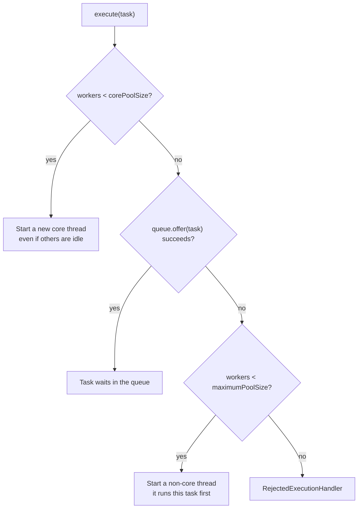
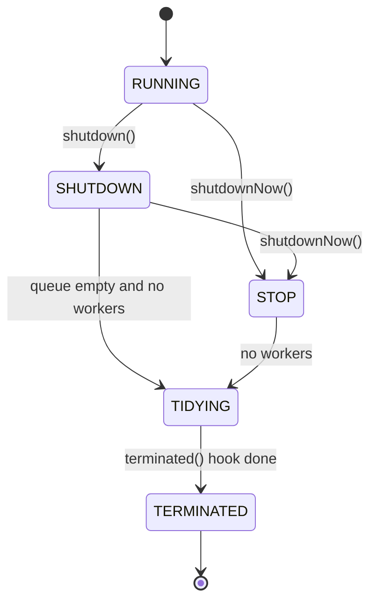
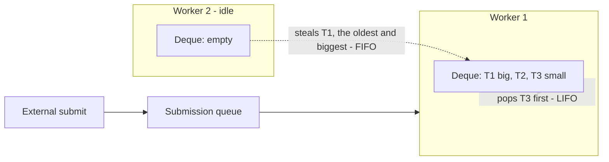

# Executors & Thread Pools (Sizing, Rejection Policies, ForkJoinPool)

!!! abstract "TL;DR"
    - A `ThreadPoolExecutor` fills in this order: **core threads → queue → extra threads up to max → rejection**. With an unbounded queue, `maximumPoolSize` and the rejection policy are never used.
    - The `Executors` factory methods hide dangerous defaults: `newFixedThreadPool` has an **unbounded queue** (memory risk), `newCachedThreadPool` has **unbounded threads**. In production, build the pool yourself with a **bounded queue**, **named threads** and an explicit **rejection policy**.
    - Sizing: CPU-bound work needs about **N cores** threads. Blocking I/O work needs roughly **N cores × (1 + wait time / compute time)**, capped by what the downstream system can take. Measure, don't guess.
    - The four built-in rejection policies are `AbortPolicy` (default, throws), `CallerRunsPolicy` (back-pressure), `DiscardPolicy` and `DiscardOldestPolicy` (silent data loss).
    - `ForkJoinPool` uses **one deque per worker plus work stealing**, built for recursive CPU-bound tasks. The **common pool** is shared by parallel streams and `CompletableFuture.supplyAsync`, so never block in it.

## Why it matters

Creating a thread per task is expensive (a platform thread reserves stack memory, about 1 MB by default on 64-bit Linux, and needs a system call) and has no upper limit. Under a traffic spike, thread-per-task code creates thousands of threads and the JVM dies with `OutOfMemoryError: unable to create native thread`.

Java 5 introduced the Executor framework to separate **what to run** (the task) from **how to run it** (the threading policy). A thread pool gives you three things: thread reuse, a limit on concurrency, and a place to put work that cannot run yet.

Every one of those three is a design decision. A pool that is too small wastes capacity. A pool that is too large, or a queue with no limit, turns a slow dependency into an outage. Interviewers for senior roles use this topic to check whether you understand **back-pressure, isolation and failure behaviour**, not just the API.

Related pages: thread basics and `Callable`/`Future` are on page 1, `CompletableFuture` on page 5, virtual threads on page 7.

## Core concepts

### The interface hierarchy

| Type | What it adds |
|---|---|
| `Executor` | `execute(Runnable)`: run this sometime, somewhere |
| `ExecutorService` | `submit` (returns `Future`), `invokeAll`, `invokeAny`, lifecycle (`shutdown`, `awaitTermination`). `AutoCloseable` since Java 19 |
| `ScheduledExecutorService` | `schedule`, `scheduleAtFixedRate`, `scheduleWithFixedDelay` |
| `ThreadPoolExecutor` | The standard configurable pool |
| `ForkJoinPool` | Work-stealing pool for divide-and-conquer tasks |

### ThreadPoolExecutor: the seven parameters

```java
new ThreadPoolExecutor(
    corePoolSize,      // threads kept alive even when idle
    maximumPoolSize,   // hard upper limit on threads
    keepAliveTime, unit, // idle time before a non-core thread dies
    workQueue,         // where tasks wait
    threadFactory,     // names threads, sets daemon flag and exception handler
    rejectedExecutionHandler); // what to do when the pool is saturated
```

### How a task is admitted

This is the single most asked internals question. The order surprises people: the pool **prefers queueing over creating threads beyond core**.


*Notice that extra threads are created only when the queue is full. With an unbounded queue, `offer` never fails, so the pool never grows past core and the rejection handler is never called.*

Three details worth knowing:

- **Core threads are created lazily**, one per submitted task, until `corePoolSize` is reached, even if existing threads are idle. Call `prestartAllCoreThreads()` to warm the pool.
- A task that triggers a new non-core thread **jumps the queue**: it runs before tasks that were queued earlier. A pool does not guarantee strict FIFO.
- Core threads never time out unless you call `allowCoreThreadTimeOut(true)`.

Internally, the pool keeps one `AtomicInteger` called `ctl` that packs the **run state** (top 3 bits) and the **worker count** (lower 29 bits), so both can be changed in one CAS. Each `Worker` wraps a thread and loops on `getTask()`, which calls `queue.take()` when the worker should stay, or `queue.poll(keepAlive)` when it is allowed to time out (worker count is above core, or `allowCoreThreadTimeOut` is set). A `poll` that times out is how a thread retires. "Core" is only a count: no specific thread is marked as a core thread.

### Queue choice decides pool behaviour

| Queue | Behaviour | Used by |
|---|---|---|
| `LinkedBlockingQueue` (no capacity) | Unbounded. Pool stays at core size. Max and rejection are dead settings | `newFixedThreadPool`, `newSingleThreadExecutor` |
| `ArrayBlockingQueue(n)` / `LinkedBlockingQueue(n)` | Bounded. Enables growth to max and rejection | Recommended for production |
| `SynchronousQueue` | Zero capacity, a direct hand-off. Every task needs a free thread or a new one | `newCachedThreadPool` |
| `DelayedWorkQueue` | Unbounded heap ordered by time | `ScheduledThreadPoolExecutor` |
| `PriorityBlockingQueue` | Unbounded, ordered by priority | Custom pools (only works directly with `execute` and `Comparable` tasks: `submit` wraps tasks in `FutureTask`, which is not `Comparable`, so the queue throws `ClassCastException` unless you supply a comparator or override `newTaskFor`) |

### The Executors factory methods and their traps

| Factory | Real configuration | Trap |
|---|---|---|
| `newFixedThreadPool(n)` | core = max = n, unbounded `LinkedBlockingQueue` | Queue grows without limit, then `OutOfMemoryError` |
| `newSingleThreadExecutor()` | Same with n = 1, wrapped so it cannot be reconfigured | Same unbounded queue |
| `newCachedThreadPool()` | core = 0, max = `Integer.MAX_VALUE`, `SynchronousQueue`, 60 s keep-alive | Unbounded threads under a burst |
| `newScheduledThreadPool(n)` | core = n, unbounded delay queue | Max size has no effect |
| `newWorkStealingPool()` | `ForkJoinPool`, parallelism = available processors, async (FIFO) mode | Daemon threads, not for blocking work |
| `newVirtualThreadPerTaskExecutor()` (Java 21) | New virtual thread per task, no pooling | No concurrency limit at all |

### Rejection policies

A task is rejected when the pool is **saturated** (queue full and threads at max) or **shut down**.

| Policy | What happens | Use when |
|---|---|---|
| `AbortPolicy` (default) | Throws `RejectedExecutionException` to the submitter | You want to fail fast and return 503/429 |
| `CallerRunsPolicy` | The submitting thread runs the task itself | You want natural back-pressure and the caller is allowed to slow down |
| `DiscardPolicy` | Drops the task silently | Truly optional work (and then count it yourself) |
| `DiscardOldestPolicy` | Drops the head of the queue, retries the new task | Only the newest value matters (for example, UI refresh) |

You can also write your own handler, for example one that increments a metric and then throws, or one that blocks with a timeout on `queue.offer`.

### Pool lifecycle


*Notice that `shutdown()` still drains the queue, while `shutdownNow()` interrupts workers and returns the tasks that never started. Neither one waits. Only `awaitTermination` (or `close()` on Java 19+) blocks.*

`shutdownNow()` only **interrupts**. A task that ignores interruption keeps running, so tasks must be written to respond to it.

### Sizing a pool

Start from what the tasks spend their time on.

**CPU-bound** (hashing, JSON transformation, compression): more threads than cores only adds context switching. Use `N_cpu` (some teams use `N_cpu + 1` to cover an occasional page fault).

**I/O-bound** (HTTP calls, JDBC, Redis): threads spend most of their time waiting, so you need more of them. The formula from *Java Concurrency in Practice*:

```text
threads = N_cpu × U_cpu × (1 + W / C)

N_cpu = available cores
U_cpu = target CPU utilisation (0 to 1)
W / C = wait time / compute time per task
```

Example: 4 cores, target 80% CPU, each task waits 90 ms on a downstream call and computes for 10 ms. `4 × 0.8 × (1 + 90/10) = 32` threads.

A second view uses throughput (Little's law): threads needed is about `arrival rate × average task time`. At 200 requests per second and 100 ms per task, about 20 tasks are in flight at once, so the pool needs a bit more than 20 threads for headroom.

Then apply the real limits:

- **The downstream limit wins.** 32 threads calling a database with a 10-connection pool just moves the queue to the connection pool.
- **Containers.** `Runtime.availableProcessors()` is container-aware and is derived from the CPU limit. A pod with a 500m or 1-CPU limit reports 1 processor, which shrinks every default that depends on it (common pool, GC threads). If needed, override with `-XX:ActiveProcessorCount`.
- **Queue size is a latency budget.** Queue capacity divided by throughput is the longest a task can wait. A queue of 1,000 on a pool that completes 100 tasks per second means up to 10 seconds of waiting, which is usually longer than the caller's timeout. Keep queues short and reject early.
- **Separate pools per workload type** (the bulkhead pattern). Never mix slow blocking tasks with fast CPU tasks in one pool.

### ForkJoinPool and work stealing

`ThreadPoolExecutor` has one shared queue, which every worker contends on. That is fine for coarse tasks, but poor for millions of tiny recursive tasks. `ForkJoinPool` (Java 7) solves this:

- Each worker has its **own deque** of tasks.
- A worker **pushes and pops its own tasks at one end (LIFO)**. The newest task is the smallest and its data is still hot in the CPU cache.
- An idle worker **steals from the other end of another worker's deque (FIFO)**. The oldest task is the biggest chunk of work, so one steal keeps the thief busy for longer, and owner and thief rarely touch the same end.
- Tasks submitted from outside the pool go to shared submission queues.


*Notice that the owner and the thief work at opposite ends of the deque, so contention is rare and stolen tasks are the large ones.*

Key facts:

- Tasks extend `RecursiveTask<V>` (returns a value) or `RecursiveAction` (no value). Inside `compute()` you `fork()` one half, compute the other half directly, then `join()`.
- `join()` inside a pool worker does not simply block the thread. The worker tries to run other pending tasks while it waits, which is why a small pool can run a deep task tree.
- The **common pool** (`ForkJoinPool.commonPool()`) is a JVM-wide static pool. Its default parallelism is **available processors minus 1** (at least 1) because the submitting thread also helps. It is tunable with `-Djava.util.concurrent.ForkJoinPool.common.parallelism`. It is used by parallel streams, `CompletableFuture.xxxAsync` without an executor, and `Arrays.parallelSort`. One exception, documented in the `CompletableFuture` Javadoc for Java 21: if the common pool's parallelism is below 2 (a container with 1 or 2 CPUs), `CompletableFuture` does not use the common pool and instead starts **a new thread for each async task**.
- For unavoidable blocking inside a `ForkJoinPool`, wrap it in `ForkJoinPool.ManagedBlocker` so the pool can add a compensating thread.
- **Async mode** (`asyncMode = true`) makes workers process their own tasks in FIFO order, which suits event-style tasks that are never joined. The virtual thread scheduler is a dedicated `ForkJoinPool` in this mode.

### Where virtual threads fit (Java 21+)

Virtual threads are cheap, so you **do not pool them**. `Executors.newVirtualThreadPerTaskExecutor()` creates one per task. That removes the thread-count limit, which means the pool no longer protects your downstream systems. You must limit concurrency explicitly, normally with a `Semaphore`. Platform thread pools remain the right tool for CPU-bound work. Details are on page 7.

## In practice: code & configuration

=== "❌ Common mistake"
    ```java
    @Service
    class EnrichmentService {

        // Unbounded LinkedBlockingQueue: if the downstream slows down, tasks pile up
        // until the heap is full. Threads are named pool-1-thread-N (useless in a thread dump).
        private final ExecutorService pool = Executors.newFixedThreadPool(10);

        List<Result> enrich(List<Item> items) {
            List<Future<Result>> futures = items.stream()
                .map(i -> pool.submit(() -> client.call(i)))   // no timeout on the task
                .toList();
            return futures.stream().map(f -> {
                try {
                    return f.get();                            // blocks forever if the call hangs
                } catch (Exception e) {
                    throw new RuntimeException(e);             // hides InterruptedException, interrupt flag not restored
                }
            }).toList();
        }
        // The pool is never shut down: non-daemon threads keep the JVM from exiting cleanly, and on a forced stop in-flight work is lost.
    }
    ```

=== "✅ Correct approach"
    ```java
    @Configuration
    class ExecutorConfig {

        @Bean(destroyMethod = "close")                         // Java 19+: shutdown + await termination
        ExecutorService enrichmentExecutor(MeterRegistry registry) {
            AtomicInteger seq = new AtomicInteger();
            ThreadFactory factory = r -> {
                Thread t = new Thread(r, "enrich-" + seq.incrementAndGet()); // visible in dumps and logs
                t.setUncaughtExceptionHandler((th, ex) ->
                    LoggerFactory.getLogger("enrich").error("Uncaught in {}", th.getName(), ex));
                return t;
            };

            ThreadPoolExecutor pool = new ThreadPoolExecutor(
                16, 16,                                        // core == max: predictable size
                60, TimeUnit.SECONDS,
                new ArrayBlockingQueue<>(100),                 // bounded: a short latency budget
                factory,
                new ThreadPoolExecutor.AbortPolicy());         // fail fast, the caller maps it to 503
            pool.allowCoreThreadTimeOut(true);                 // release threads when idle

            // Publishes executor.active, executor.queued, executor.pool.size, executor.completed
            return ExecutorServiceMetrics.monitor(registry, pool, "enrichment");
        }
    }

    @Service
    class EnrichmentService {
        private final ExecutorService pool;
        private final DownstreamClient client;

        EnrichmentService(ExecutorService enrichmentExecutor, DownstreamClient client) {
            this.pool = enrichmentExecutor;
            this.client = client;
        }

        List<Result> enrich(List<Item> items) throws InterruptedException {
            List<Callable<Result>> calls = items.stream()
                .map(i -> (Callable<Result>) () -> client.call(i))
                .toList();

            // invokeAll with a deadline: tasks not finished in time are cancelled (interrupted)
            List<Future<Result>> futures = pool.invokeAll(calls, 2, TimeUnit.SECONDS);

            List<Result> results = new ArrayList<>();
            for (Future<Result> f : futures) {
                if (f.state() == Future.State.SUCCESS) {       // Java 19+: no try/catch needed
                    results.add(f.resultNow());
                } else {
                    results.add(Result.unavailable());         // partial result instead of total failure
                }
            }
            return results;
        }
    }
    ```

### Spring Boot: `@Async` and the auto-configured executor

Spring Boot auto-configures a `ThreadPoolTaskExecutor` bean named `applicationTaskExecutor`. Its defaults are 8 core threads, and an **unbounded queue**, so set limits explicitly:

```yaml
spring:
  task:
    execution:
      thread-name-prefix: app-async-
      pool:
        core-size: 8
        max-size: 16
        queue-capacity: 100        # default is unbounded, so max-size would never be reached
        keep-alive: 30s
      shutdown:
        await-termination: true    # finish in-flight tasks on shutdown
        await-termination-period: 20s
  # threads:
  #   virtual:
  #     enabled: true              # Boot 3.2+ on Java 21: the executor uses virtual threads instead
```

For a dedicated pool, declare your own bean and reference it by name:

```java
@Bean
ThreadPoolTaskExecutor notificationExecutor() {
    ThreadPoolTaskExecutor ex = new ThreadPoolTaskExecutor();
    ex.setCorePoolSize(4);
    ex.setMaxPoolSize(8);
    ex.setQueueCapacity(50);
    ex.setThreadNamePrefix("notify-");
    ex.setRejectedExecutionHandler(new ThreadPoolExecutor.CallerRunsPolicy());
    ex.setTaskDecorator(runnable -> {                          // copy MDC (trace IDs) to the pool thread
        Map<String, String> ctx = MDC.getCopyOfContextMap();
        return () -> {
            try {
                if (ctx != null) MDC.setContextMap(ctx);
                runnable.run();
            } finally {
                MDC.clear();                                   // pool threads are reused: always clean up
            }
        };
    });
    ex.setWaitForTasksToCompleteOnShutdown(true);
    ex.setAwaitTerminationSeconds(20);
    return ex;
}

@Async("notificationExecutor")
public CompletableFuture<Void> sendNotification(Event e) { /* ... */ }
```

### A ForkJoin task

```java
class SumTask extends RecursiveTask<Long> {
    private static final int THRESHOLD = 10_000;               // below this, splitting costs more than it saves
    private final long[] data; private final int from, to;

    SumTask(long[] data, int from, int to) { this.data = data; this.from = from; this.to = to; }

    @Override
    protected Long compute() {
        if (to - from <= THRESHOLD) {
            long sum = 0;
            for (int i = from; i < to; i++) sum += data[i];
            return sum;
        }
        int mid = (from + to) >>> 1;
        SumTask left = new SumTask(data, from, mid);
        SumTask right = new SumTask(data, mid, to);
        left.fork();                                           // push left to my deque (can be stolen)
        long r = right.compute();                              // do the right half in this thread
        return left.join() + r;                                // join AFTER computing, never fork+join back to back
    }
}

// A dedicated pool keeps heavy work off the common pool
try (ForkJoinPool pool = new ForkJoinPool(4)) {
    long total = pool.invoke(new SumTask(data, 0, data.length));
}
```

### Graceful shutdown without `close()`

```java
pool.shutdown();                                               // stop accepting, drain the queue
try {
    if (!pool.awaitTermination(20, TimeUnit.SECONDS)) {
        List<Runnable> dropped = pool.shutdownNow();           // interrupt workers, get unstarted tasks
        log.warn("Dropped {} tasks", dropped.size());
    }
} catch (InterruptedException e) {
    pool.shutdownNow();
    Thread.currentThread().interrupt();                        // restore the interrupt flag
}
```

On Kubernetes, the total wait must fit inside `terminationGracePeriodSeconds` (30 s by default), otherwise the pod is killed with `SIGKILL` mid-task.

## Real-world usage

- **Web servers.** Embedded Tomcat in Spring Boot handles requests on a worker pool with a default maximum of 200 threads. When all 200 are blocked on a slow dependency, new requests wait in the accept queue and the whole service looks down, even endpoints that do not use that dependency. This is the classic argument for bulkheads.
- **Netflix Hystrix** made thread-pool isolation popular: each dependency gets its own small pool, so one slow dependency can only exhaust its own threads. Hystrix is now in maintenance mode, and **Resilience4j** offers the same idea as `ThreadPoolBulkhead` and a lighter semaphore bulkhead.
- **Common pool starvation** is a frequent production finding: a blocking HTTP or JDBC call inside `parallelStream()` or `CompletableFuture.supplyAsync()` occupies the few common pool workers, and every other parallel stream in the JVM slows down.
- **Kafka consumers.** Spring Kafka's listener container runs one consumer thread per `concurrency` unit. Teams that hand records to a separate pool to "go faster" lose per-partition ordering and can commit offsets for records that have not finished processing.
- **Healthcare and banking.** Silent loss is not acceptable for a claim, a prescription event or a payment. That rules out `DiscardPolicy` and unbounded in-memory queues (lost on restart) for anything that matters. The usual design is fail fast with `AbortPolicy`, return an error or a retryable status, and keep durable work in a broker (Kafka, SQS) rather than in an executor queue.

## Trade-offs & production gotchas

| Option | Pros | Cons | Use when |
|---|---|---|---|
| Fixed pool + bounded queue + `AbortPolicy` | Predictable memory and latency, clear overload signal | Callers must handle rejection | Default for request-path work |
| Fixed pool + bounded queue + `CallerRunsPolicy` | Automatic back-pressure, no lost tasks | Slows the caller thread, which may be a request or consumer thread | Batch and pipeline stages |
| Fixed pool + unbounded queue | Never rejects | Hidden latency, then `OutOfMemoryError` | Almost never in services |
| Cached pool | Absorbs short bursts, no queueing delay | Unbounded threads | Many short tasks with a known upper bound |
| `ForkJoinPool` | Very low overhead for recursive CPU work | Poor fit for blocking, daemon threads | Divide-and-conquer, parallel streams |
| Virtual thread per task | Huge number of blocking tasks, simple code | No built-in concurrency limit, no gain for CPU work | High-concurrency blocking I/O on Java 21+ |

!!! warning "Gotcha: `submit()` hides exceptions"
    `execute()` lets an exception reach the thread's `UncaughtExceptionHandler` (the worker dies and the pool replaces it). `submit()` wraps the task in a `FutureTask`, which **catches the exception and stores it in the `Future`**. If nobody calls `get()`, the failure is invisible. Always check the future, or use `execute()` for fire-and-forget work.

!!! warning "Gotcha: thread starvation deadlock"
    If a task submits a subtask to the **same bounded pool** and blocks on its result, all workers can end up waiting on subtasks that sit in the queue with no thread to run them. No lock is involved, so a deadlock detector reports nothing. Use separate pools for parent and child work, or compose with `CompletableFuture` without blocking.

!!! warning "More gotchas"
    - **`ThreadLocal` leaks.** Pool threads live for the life of the application, so a `ThreadLocal` (MDC, security context, tenant ID) that is not cleared leaks into the next task. Clean up in `finally`.
    - **A periodic task that throws is cancelled.** With `scheduleAtFixedRate` or `scheduleWithFixedDelay`, one uncaught exception suppresses all later runs, silently. Wrap the body in `try/catch`.
    - **`CallerRunsPolicy` on a Kafka listener thread** can run a slow task on the poll thread and exceed `max.poll.interval.ms`, which triggers a rebalance.
    - **`CallerRunsPolicy` after shutdown** discards the task instead of running it.
    - **A pool per request** (creating an executor inside a method) leaks threads. Pools are long-lived, shared objects.
    - **Java 21 pinning.** A virtual thread that blocks inside `synchronized` pins its carrier thread. JDK 24 (JEP 491) removes this limitation, so it does not apply on Java 25.

!!! tip "What to monitor"
    Active threads, pool size, queue depth, rejected count, and task wait time versus run time. A queue depth that grows steadily is the earliest sign of trouble. `ThreadPoolExecutor` does not count rejections for you, so add a counter in a custom handler.

## How this connects to my experience

- **Where I used it:**
    - **OptumRx Meteor, GraphQL Consumer Service** ("integration layer between 5 upstream systems"). An aggregation layer fans out to several upstream systems per query, which is exactly where pool sizing, per-upstream isolation and timeouts matter. *[confirm: whether the fan-out used `CompletableFuture` with a custom executor, WebClient/reactive, or the default executor]*
    - **Kafka event-driven workflows with retry and DLQ.** Listener container concurrency is a thread pool decision: threads per partition, ordering, and what happens when processing is slower than the poll interval. *[confirm: listener `concurrency` value and partition count]*
    - **Deployment on Kubernetes (EKS is listed under Deloitte ConvergeHealth; Kubernetes is in my skills).** CPU limits change `availableProcessors()` and therefore the common pool size and any pool sized from core count. *[confirm: which projects ran Java services on Kubernetes, and the pod CPU requests/limits used]*
    - **CCKM at Coriolis** ("automated key rotation workflows"). Scheduled, long-running rotation jobs are a natural fit for a `ScheduledExecutorService` or Spring `@Scheduled`. *[confirm: how rotation jobs were actually scheduled]*
- **Talking points:**
    - "With five upstream systems I would not let one slow system consume all request threads. Each upstream gets a bounded pool or a bulkhead plus a timeout, and the GraphQL response returns partial data with errors for the failed field." *[confirm that this isolation existed, or present it as the design you would choose]*
    - "I size I/O pools from the wait-to-compute ratio and the downstream's limits, then check with a load test and executor metrics, not from a rule of thumb."
    - "I avoid the `Executors` factory defaults in services because of unbounded queues, and I name threads so thread dumps are readable."
    - "For Kafka I keep processing on the listener thread and scale with partitions and `concurrency`, so ordering and offset commits stay correct."
    - *[confirm: the last three talking points describe personal practice that the resume does not state. Keep only the ones you can back with a concrete example, or say "the approach I follow is..."]*
- **Likely follow-up chain:** "How did you call the 5 upstreams in parallel?" → "Which executor did those calls run on, and how was it sized?" → "What happens when one upstream becomes slow?" → "What happens when the pool is full?" → "How would this change with virtual threads?" Answer the chain in that order: dedicated bounded pool, sizing formula plus downstream limits, timeouts and bulkhead, explicit rejection policy mapped to a degraded response, and finally virtual threads with a semaphore for the concurrency limit.

## Interview questions

### Fundamentals

??? question "Q1. Why use a thread pool instead of creating a new thread per task?"
    **Answer:** Platform threads are expensive to create (native stack memory, a system call) and unlimited creation can exhaust memory or overload the CPU with context switches. A pool reuses threads, puts an upper limit on concurrency, and gives a queue and a policy for work that cannot run immediately. It also separates task submission from execution policy, so you can change the threading model without touching business code.

    **Interviewer listens for:** resource limiting and back-pressure, not only "thread creation is slow".

    **Common wrong answer:** "Pools make code faster." A pool mainly makes behaviour under load bounded and predictable.

??? question "Q2. What is the difference between `execute()` and `submit()`?"
    **Answer:** `execute(Runnable)` comes from `Executor`, returns nothing, and an uncaught exception goes to the thread's `UncaughtExceptionHandler` and terminates that worker (the pool replaces it). `submit()` comes from `ExecutorService`, accepts `Runnable` or `Callable`, and returns a `Future`. Any exception is captured and thrown as `ExecutionException` only when `get()` is called.

    **Interviewer listens for:** the swallowed-exception consequence of `submit()`.

    **Common wrong answer:** "`submit` is for `Callable`, `execute` is for `Runnable`." `submit` accepts both.

??? question "Q3. Explain `corePoolSize`, `maximumPoolSize` and the queue. In what order are they used?"
    **Answer:** Below core size, each new task starts a new thread, even if others are idle. At core size, tasks go to the queue. Only when the queue refuses the task does the pool create threads up to the maximum. If it is at maximum and the queue is full, the rejection handler runs. Threads above core die after `keepAliveTime` of idleness.

    **Interviewer listens for:** queue before max, and the consequence that an unbounded queue makes max meaningless.

    **Common wrong answer:** "The pool grows to max first and then queues." It is the opposite.

??? question "Q4. Name the built-in rejection policies. Which is the default?"
    **Answer:** `AbortPolicy` (default) throws `RejectedExecutionException`. `CallerRunsPolicy` runs the task on the submitting thread. `DiscardPolicy` drops the task silently. `DiscardOldestPolicy` drops the oldest queued task and retries the submit. Rejection happens when the pool is saturated or already shut down.

    **Interviewer listens for:** knowing that two of the four lose work silently, and when `CallerRunsPolicy` is a good or bad idea.

??? question "Q5. `shutdown()` vs `shutdownNow()` vs `close()`?"
    **Answer:** `shutdown()` stops accepting new tasks but runs everything already submitted, and returns immediately. `shutdownNow()` also interrupts running workers and returns the list of tasks that never started. It is best effort, because a task that ignores interrupts keeps running. Neither waits, so follow with `awaitTermination`. Since Java 19, `ExecutorService` is `AutoCloseable`: `close()` calls `shutdown()` and waits for termination, which makes try-with-resources possible.

    **Common wrong answer:** "`shutdownNow()` kills the threads." Java cannot kill a thread, it can only request interruption.

### Intermediate

??? question "Q6. Predict the behaviour: core = 2, max = 4, `ArrayBlockingQueue(10)`. You submit 15 long-running tasks quickly. What happens to each?"
    **Answer:** Tasks 1 and 2 start two core threads. Tasks 3 to 12 fill the queue (10 slots). Tasks 13 and 14 find the queue full, so two extra threads are created and run those tasks immediately, before the queued ones. Task 15 is rejected: with the default `AbortPolicy` the submitter gets `RejectedExecutionException`. Capacity is max + queue = 14.

    **Interviewer listens for:** the pool has only 2 threads while the queue is filling, and tasks 13 and 14 run before tasks 3 to 12.

    **Common wrong answer:** "Four threads run tasks 1 to 4 and the rest queue."

??? question "Q7. Why do many coding standards forbid `Executors.newFixedThreadPool` and `newCachedThreadPool`?"
    **Answer:** `newFixedThreadPool` uses an unbounded `LinkedBlockingQueue`. If producers are faster than consumers, the queue grows until the heap is exhausted, and before that, tasks wait so long that the callers have already timed out. `newCachedThreadPool` has a maximum of `Integer.MAX_VALUE` threads with a hand-off queue, so a burst creates a thread per task. Both hide overload instead of signalling it. Building `ThreadPoolExecutor` directly forces you to choose the queue bound, the thread names and the rejection policy.

    **Interviewer listens for:** the idea that a bounded queue plus rejection is a feature (back-pressure), not a problem.

??? question "Q8. How do you size a thread pool?"
    **Answer:** First classify the work. CPU-bound: about the number of available cores. I/O-bound: `N_cpu × target utilisation × (1 + wait/compute)`. Then cap it by downstream limits (connection pool size, rate limits, partner SLAs) and check `availableProcessors()` inside the container, because CPU limits reduce it. Size the queue as a latency budget: capacity divided by throughput should be less than the caller's timeout. Finally verify with a load test and watch active threads, queue depth, rejections and latency.

    **Interviewer listens for:** a formula as a starting point, downstream limits, container awareness, and measurement.

    **Common wrong answer:** "Twice the number of cores" with no reasoning.

??? question "Q9. What happens when a task throws an exception inside a pool?"
    **Answer:** With `execute()`, the exception leaves the worker's run loop, the worker thread dies, the `UncaughtExceptionHandler` is called, and the pool creates a replacement thread when needed. With `submit()`, `FutureTask` catches it, the worker survives, and the exception appears only on `Future.get()`. With a scheduled periodic task, the exception is stored in the future and **all later executions are cancelled**. You can also override `afterExecute(Runnable, Throwable)` to log failures centrally.

??? question "Q10. How does `ForkJoinPool` differ from `ThreadPoolExecutor`?"
    **Answer:** `ThreadPoolExecutor` has one shared blocking queue and independent tasks. `ForkJoinPool` gives every worker its own deque: the owner pushes and pops at one end (LIFO, good cache locality), idle workers steal from the opposite end (FIFO, largest tasks). A worker that calls `join()` helps run other tasks instead of blocking. This makes it efficient for huge numbers of small, recursive, CPU-bound tasks. Its threads are daemon threads and its size is set as a parallelism level rather than core/max/queue.

    **Interviewer listens for:** per-worker deques, LIFO for the owner and FIFO for thieves, and the reason for each.

??? question "Q11. What is the common pool, and why is blocking in it dangerous?"
    **Answer:** `ForkJoinPool.commonPool()` is one static pool per JVM, with default parallelism of available processors minus one. Parallel streams, `CompletableFuture.supplyAsync`/`thenApplyAsync` without an executor, and `Arrays.parallelSort` all use it. It is sized for CPU work, so a few blocking calls can occupy all workers and stall every unrelated parallel operation in the application. In a container with a 1 or 2 CPU limit it has a single worker (and on Java 21, `CompletableFuture` then falls back to a new thread per async task instead of the common pool). For blocking work, pass a dedicated executor to `CompletableFuture`, or run the parallel stream from inside a custom `ForkJoinPool` (a known trick, but it relies on implementation behaviour rather than a documented guarantee).

    **Common wrong answer:** "Each parallel stream gets its own pool."

### Senior

??? question "Q12. Explain thread starvation deadlock in a pool and how to prevent it."
    **Answer:** It happens when tasks in a bounded pool wait for other tasks that are queued in the same pool. Example: a pool of 10 threads, 10 parent tasks each submit a child task and call `get()`. All 10 threads block, the children sit in the queue, and nothing can progress. A thread dump shows all workers in `WAITING` on `FutureTask.get`, but no lock cycle. Prevention: do not block on tasks submitted to the same pool, use separate pools for different stages, compose asynchronously with `CompletableFuture`, or use `ForkJoinPool`, where `join()` helps instead of blocking. Always use timeouts so that it degrades rather than hangs.

    **Interviewer listens for:** recognising it from a thread dump and knowing it is not a lock deadlock.

??? question "Q13. How does `ThreadPoolExecutor` track its state internally, and how does a worker thread end?"
    **Answer:** A single `AtomicInteger` named `ctl` holds the run state in the top 3 bits (`RUNNING`, `SHUTDOWN`, `STOP`, `TIDYING`, `TERMINATED`) and the worker count in the lower 29 bits, so both are updated atomically with one CAS. Workers are kept in a `HashSet` guarded by a `mainLock`. Each `Worker` loops on `getTask()`: it calls `take()` if it should stay, or `poll(keepAliveTime)` if it is allowed to time out (worker count above core, or `allowCoreThreadTimeOut`). When `poll` returns null, `getTask()` returns null and the worker exits. `Worker` itself extends `AbstractQueuedSynchronizer` as a simple non-reentrant lock, so the pool can tell an idle worker from one running a task and interrupt only idle ones during `shutdown()`.

    **Interviewer listens for:** `ctl`, the `take` vs `poll` distinction, and that "core" is a count, not a property of specific threads.

??? question "Q14. With virtual threads in Java 21+, do we still need thread pools?"
    **Answer:** For blocking I/O work, pooling threads is no longer needed: virtual threads are cheap, so you create one per task. But the pool was also acting as a **concurrency limiter**, and that need remains. With virtual threads you limit access to a scarce resource with a `Semaphore` or a connection pool. For CPU-bound work, virtual threads give no benefit, because they still run on a small set of carrier threads (a `ForkJoinPool` with parallelism equal to available processors), so a bounded platform pool or `ForkJoinPool` is still correct. On Java 21, also watch for pinning inside `synchronized` blocks, which JDK 24 removed.

    **Interviewer listens for:** "pooling" and "limiting" being two separate concerns.

    **Common wrong answer:** "Use a fixed pool of virtual threads." Pooling virtual threads defeats their purpose.

??? question "Q15. What does `CallerRunsPolicy` really do to a system, and when is it harmful?"
    **Answer:** It makes the submitting thread execute the task, so that thread cannot submit more work until it finishes. That slows the producer down to the pool's speed, which is simple back-pressure with no lost tasks. It is harmful when the caller thread must not be blocked: a Netty or WebFlux event-loop thread (stalls all connections on that loop), a Kafka listener thread (risk of exceeding `max.poll.interval.ms` and a rebalance), or a Tomcat request thread when the point of the pool was to isolate slow work from request threads. It also runs the task with the caller's thread context and discards the task if the pool is shut down.

### Scenario-based

??? question "Q16. A service gets slower over a few hours and then dies with `OutOfMemoryError`. The heap dump shows millions of objects held by a `LinkedBlockingQueue` inside a `ThreadPoolExecutor`. Diagnose and fix."
    **Answer:** The pool has an unbounded queue (`newFixedThreadPool` or Spring's default queue capacity) and tasks arrive faster than they complete, usually because a downstream call became slow or has no timeout. The queue absorbed the overload until memory ran out. Fix in layers: add timeouts on the downstream call so threads are released, bound the queue, choose a rejection policy (fail fast with a 503 or apply back-pressure), expose queue depth and rejection metrics with alerts, and re-check pool size against the downstream's capacity. If the work must not be lost, move it to a durable queue (Kafka, SQS) instead of JVM memory.

    **Interviewer listens for:** root cause is the missing bound and missing timeout, not "increase the heap" or "add more threads".

    **Common wrong answer:** "Increase the pool size." More threads push more load onto a downstream that is already slow.

??? question "Q17. Your API aggregates data from five upstream services. One upstream becomes slow and the whole API stops responding, including endpoints that never call that upstream. Why, and how do you redesign it?"
    **Answer:** All endpoints share the same request threads (or one shared async pool). Requests that touch the slow upstream hold threads for a long time, and soon every thread is waiting on it. Redesign with **bulkheads**: a separate bounded pool (or semaphore limit) per upstream, strict connect and read timeouts, a circuit breaker to stop calling a failing upstream, and a fallback such as partial data or a cached value. In GraphQL this maps well, because a failed field can return null with an entry in `errors` while the rest of the response succeeds. Add per-pool metrics so you can see which upstream is saturated.

    **Interviewer listens for:** isolation, timeouts and degraded responses together, and the trade-off that more pools mean more threads and more tuning.

??? question "Q18. A nightly `@Scheduled` reconciliation job ran fine for weeks, then silently stopped. The application is healthy and there are no errors in the logs. What do you check?"
    **Answer:** Three likely causes. (1) The job runs on a raw `ScheduledExecutorService` and threw an exception once: periodic tasks are cancelled after the first uncaught exception and the exception stays in a `ScheduledFuture` nobody reads. Spring's own scheduler logs such errors and keeps going, so check which one is in use. (2) Spring's default scheduler has **one thread**. If another scheduled task is hanging (for example, a call with no timeout), every other scheduled job is blocked behind it. A thread dump shows the `scheduling-1` thread stuck. (3) With several replicas, a distributed lock (for example ShedLock) may be held and never released. Fixes: wrap job bodies in `try/catch` with logging and metrics, set `spring.task.scheduling.pool.size` above 1, add timeouts, and alert on "job has not completed in N hours".

## Cheat sheet

| Concept | Remember |
|---|---|
| Admission order | Core → queue → max → reject |
| Unbounded queue | Max size and rejection policy never used |
| `newFixedThreadPool` | Unbounded `LinkedBlockingQueue` |
| `newCachedThreadPool` | 0 to `Integer.MAX_VALUE` threads, `SynchronousQueue`, 60 s keep-alive |
| Default rejection | `AbortPolicy` → `RejectedExecutionException` |
| Back-pressure | `CallerRunsPolicy` (not on event-loop or Kafka poll threads) |
| CPU-bound size | About `N_cpu` |
| I/O-bound size | `N_cpu × U × (1 + W/C)`, capped by the downstream |
| Queue size | A latency budget: capacity / throughput |
| `execute` vs `submit` | `submit` stores the exception in the `Future` |
| Periodic task throws | All later runs are cancelled |
| Shutdown | `shutdown()` + `awaitTermination`, or `close()` (Java 19+) |
| ForkJoinPool | Per-worker deque, owner LIFO, thief FIFO |
| Common pool | Parallelism = processors − 1, shared JVM-wide, never block in it |
| Containers | CPU limit drives `availableProcessors()` |
| Virtual threads | Do not pool, limit with a `Semaphore` |
| Spring Boot default | `applicationTaskExecutor`: 8 core threads, unbounded queue |
| Always | Name threads, bound queues, export metrics, clear `ThreadLocal`s |

## Sources

1. [ThreadPoolExecutor (Java SE 21 API)](https://docs.oracle.com/en/java/javase/21/docs/api/java.base/java/util/concurrent/ThreadPoolExecutor.html): admission order, queueing strategies, rejection policies, keep-alive and hooks.
2. [Executors (Java SE 21 API)](https://docs.oracle.com/en/java/javase/21/docs/api/java.base/java/util/concurrent/Executors.html): what each factory method really creates.
3. [ForkJoinPool (Java SE 21 API)](https://docs.oracle.com/en/java/javase/21/docs/api/java.base/java/util/concurrent/ForkJoinPool.html): common pool, parallelism properties, async mode and `ManagedBlocker`.
4. [Doug Lea, "A Java Fork/Join Framework"](https://gee.cs.oswego.edu/dl/papers/fj.pdf): the work-stealing design and why owners use LIFO while thieves use FIFO.
5. [JEP 444: Virtual Threads](https://openjdk.org/jeps/444) and [JEP 491: Synchronize Virtual Threads without Pinning](https://openjdk.org/jeps/491): do not pool virtual threads, the scheduler, pinning.
6. [Spring Boot: Task Execution and Scheduling](https://docs.spring.io/spring-boot/reference/features/task-execution-and-scheduling.html): `applicationTaskExecutor` defaults, `spring.task.execution.*`, virtual thread support.
7. [Netflix Hystrix wiki: How it Works (Isolation)](https://github.com/Netflix/Hystrix/wiki/How-it-Works#isolation): thread-pool bulkheads per dependency.
8. Brian Goetz et al., *Java Concurrency in Practice* (Addison-Wesley), chapter 8 "Applying Thread Pools": the sizing formula and thread starvation deadlock.
