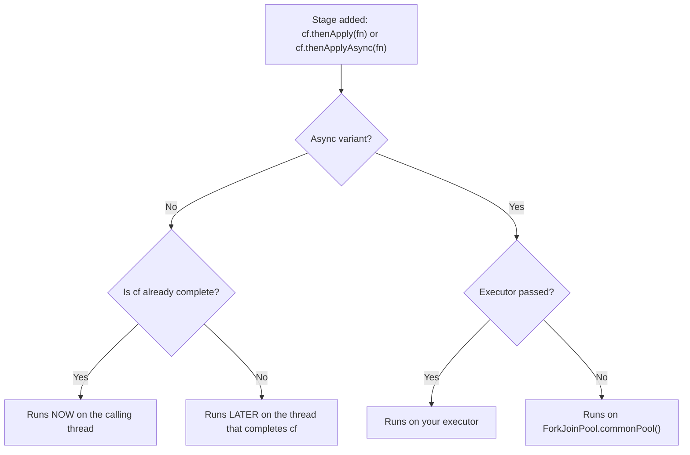
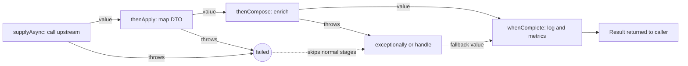
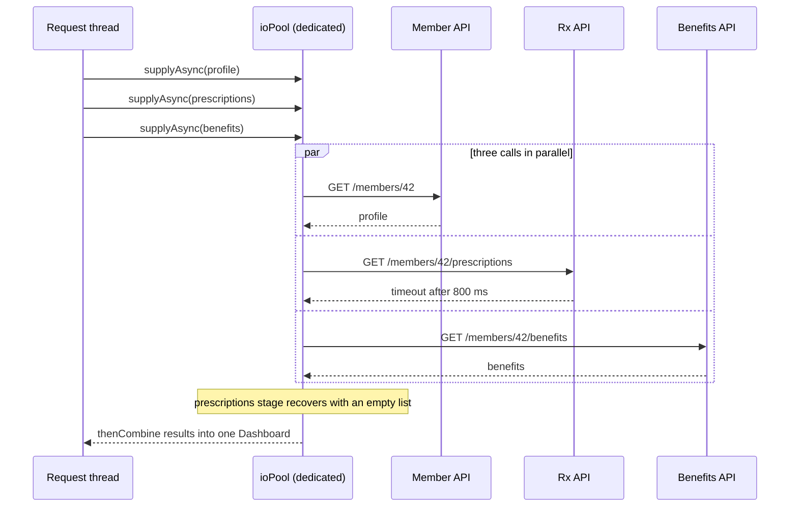

# CompletableFuture & Async Composition

!!! abstract "Key takeaways"
    - A `CompletableFuture` (CF) is a **result holder plus a list of callbacks**. You don't block for the value, you attach the next stage (`thenApply`, `thenCompose`, `thenCombine`) and the stage runs when the value arrives.
    - **`thenApply` = map, `thenCompose` = flatMap, `thenCombine` = zip** of two independent futures, `allOf` / `anyOf` = wait for many / first of many.
    - **Which thread runs a stage?** Non-`Async` methods run on whichever thread completes the previous stage, *or on the caller's thread if it is already complete*. `*Async` methods run on the default executor (`ForkJoinPool.commonPool()`) or the executor you pass.
    - **Never run blocking I/O on the common pool.** It has roughly `cores - 1` threads and is shared with parallel streams across the whole JVM. Pass a dedicated, bounded executor (or a virtual-thread executor on Java 21+).
    - Errors travel down the chain wrapped in **`CompletionException`**. Handle them with `exceptionally` / `handle` / `whenComplete`, always set a timeout (`orTimeout`, `completeOnTimeout`, Java 9+), and remember that **`cancel()` does not interrupt the running task**.

## Why it matters

A lead-level backend service spends most of its time waiting on other systems: databases, REST upstreams, Kafka, caches. If a request needs three upstream calls of 200 ms each, doing them one after another costs 600 ms. Doing them in parallel costs about 200 ms. `CompletableFuture` is the standard JDK tool for that.

{ loading=lazy }
*Notice that the parallel version is as slow as its slowest call, not as slow as the sum.*

What came before:

- **`Future` (Java 5).** You submit a task and get a handle, but the only way to use the result is `get()`, which blocks. You cannot say "when this finishes, do that", you cannot combine two futures, and you cannot complete one by hand.
- **Callbacks / `ListenableFuture` (Guava, old Spring).** Non-blocking, but nesting callbacks quickly becomes unreadable and error handling gets scattered.
- **`CompletableFuture` (Java 8).** Implements both `Future` and `CompletionStage`. It gives you around 50 methods to chain, combine and recover, without blocking a thread while you wait.

Interviewers like this topic because it tests three things at once: API fluency, understanding of thread pools (see [Executors & thread pools](04-executors-and-thread-pools.md)), and production judgement (timeouts, error handling, context propagation). On Java 21+ you are also expected to compare it with virtual threads and structured concurrency (subtopic 7).

## Core concepts

### What a CompletableFuture really is

Internally a CF has two fields:

- **`result`**: empty at first, then set exactly once to a value or to an exception. It is set with a CAS (compare-and-swap), so only the first completion wins.
- **`stack`**: a lock-free linked stack of dependent actions ("completions") waiting for that result.

When you call `cf.thenApply(fn)`:

1. A **new** CF is created for the output of `fn`.
2. If `cf` is **not complete**, a completion object holding `fn` is pushed onto `cf`'s stack. The calling thread returns immediately.
3. If `cf` is **already complete**, `fn` runs right now on the calling thread.

When some thread later completes `cf`, that thread pops the stack and runs every dependent action (or hands it to an executor, for the `*Async` variants). That is the whole model: *completion triggers the dependents*.

{ loading=lazy }
*Watch which thread runs each stage: the ioPool thread runs f1 and f2, but f3 runs on the request thread because the future was already complete.*

This also explains the name. A CF is **completable**: any code can call `complete(value)` or `completeExceptionally(ex)`. That is how you wrap a callback-based API (a Kafka send callback, a Netty listener) as a future.

### The method families

| You have | You want | Method | Functional analogy |
|---|---|---|---|
| `CF<T>` and `T -> U` | `CF<U>` | `thenApply` | `map` |
| `CF<T>` and `T -> CF<U>` | `CF<U>` | `thenCompose` | `flatMap` |
| `CF<T>` and `CF<U>`, independent | `CF<V>` | `thenCombine` | `zip` |
| `CF<T>` and a consumer | `CF<Void>` | `thenAccept` / `thenRun` | `forEach` |
| many CFs | one CF when all finish | `allOf` (returns `CF<Void>`) | |
| many CFs | one CF when the first finishes | `anyOf` (returns `CF<Object>`) | |
| a failed CF | a recovered value | `exceptionally`, `handle` | `catch` |
| any CF | a side effect, result unchanged | `whenComplete` | `finally` |

Every method comes in three forms:

- `thenApply(fn)`: no thread hop is requested.
- `thenApplyAsync(fn)`: run `fn` on the default executor.
- `thenApplyAsync(fn, executor)`: run `fn` on your executor.

### Which thread runs my stage?

This is the question most candidates get wrong.


*Notice that the non-async path has two outcomes and you cannot tell which one you get, because it depends on a race between the caller and the task. If the stage is expensive or blocking, use the `Async` variant with an explicit executor.*

Facts worth memorising:

- The **default executor** is `ForkJoinPool.commonPool()`. Its parallelism defaults to `availableProcessors() - 1`. If the common pool's parallelism is less than 2 (a 1 or 2 CPU container), the JDK instead creates **a new thread per async task**.
- The common pool is **shared by the whole JVM**: every parallel stream and every CF that does not name an executor.
- Its threads are **daemon** threads, so a `main` method can exit before an async task finishes.
- A stage "completed by another thread" can be a thread you did not expect: an HTTP client's selector thread, a Kafka producer network thread, or the JDK's timeout scheduler thread when `orTimeout` fires. A slow callback on one of those threads stalls that library.

### `thenApply` vs `thenCompose`

```java
CompletableFuture<Member> member = memberClient.findAsync(id);

// thenApply with a function that itself returns a future gives a nested type
CompletableFuture<CompletableFuture<Plan>> nested = member.thenApply(m -> planClient.findAsync(m.planId()));

// thenCompose flattens it: "when member is ready, start the next async call"
CompletableFuture<Plan> plan = member.thenCompose(m -> planClient.findAsync(m.planId()));
```

Use `thenCompose` for **dependent** calls (the second needs the first's result). Use `thenCombine` or `allOf` for **independent** calls, so they run in parallel.

### How errors propagate

Think of two rails, like `try`/`catch`:

- If a stage throws, its CF completes **exceptionally**.
- Every following `thenApply` / `thenCompose` / `thenAccept` is **skipped** and simply forwards the failure.
- The first `exceptionally` or `handle` moves the pipeline back to the normal rail.


*Notice that a failure anywhere skips all the normal stages and lands on the first recovery stage, exactly like a `catch` block, and that `whenComplete` sees both outcomes without changing them.*

The three handlers:

| Method | Sees | Can change the result? | Like |
|---|---|---|---|
| `exceptionally(ex -> fallback)` | only failures | Yes, replaces the failure with a value | `catch` |
| `handle((value, ex) -> newValue)` | both | Yes, always maps to a new value | `try/catch` returning a value |
| `whenComplete((value, ex) -> {...})` | both | No, the original outcome passes through | `finally` |

**Wrapping rule.** When a stage's function throws (including a `supplyAsync` supplier), or a failure is forwarded through an intermediate stage, the handler receives a **`CompletionException`** whose `getCause()` is the real exception. So `ex instanceof TimeoutException` inside `exceptionally` is often false. The one case where you get the raw exception is a handler attached *directly* to a future that was failed with `completeExceptionally(ex)` (which is also what `orTimeout` does internally). Because the answer depends on where in the chain the handler sits, always unwrap first:

```java
static Throwable unwrap(Throwable ex) {
    return (ex instanceof CompletionException || ex instanceof ExecutionException) && ex.getCause() != null
            ? ex.getCause() : ex;
}
```

Getting the value out:

| Method | Blocks? | On failure throws |
|---|---|---|
| `get()` | Yes | checked `ExecutionException` (plus `InterruptedException`) |
| `get(timeout, unit)` | Yes, bounded | also `TimeoutException` |
| `join()` | Yes | unchecked `CompletionException` |
| `getNow(default)` | No | `CompletionException` if failed |
| `resultNow()` (Java 19+) | No | `IllegalStateException` if not completed successfully |

### Timeouts and cancellation

Java 9 added the methods that make CF production-ready:

- `orTimeout(1, SECONDS)`: fail with `TimeoutException` if not complete in time.
- `completeOnTimeout(fallback, 1, SECONDS)`: complete with a default value instead.
- `CompletableFuture.delayedExecutor(...)`: an executor that starts tasks after a delay (useful for retries with backoff).
- `failedFuture(ex)`, `completeAsync(supplier)`, `copy()`, `minimalCompletionStage()`.

Java 12 added `exceptionallyCompose` (recover with another async call, for example a fallback upstream) and `exceptionallyAsync`.

Two things about cancellation surprise people:

1. **`cancel(true)` does not interrupt anything.** The Javadoc says the `mayInterruptIfRunning` parameter has no effect, because a CF has no link to the thread running its task. `cancel` just completes the future with a `CancellationException`.
2. **`orTimeout` does not stop the work either.** The future fails, your caller moves on, but the upstream HTTP call keeps running and keeps holding a pool thread and a connection. The real protection is a timeout on the I/O itself (HTTP client connect/read timeouts).

Also, cancellation flows **downstream only**. Cancelling a dependent stage does not cancel the stage it came from.

### Fan-out and fan-in


*Notice that total latency is the slowest call (capped by its timeout), not the sum, and that one failing optional upstream is turned into a fallback instead of failing the whole response.*

`allOf` details interviewers probe:

- It returns `CompletableFuture<Void>`. You collect the values yourself by calling `join()` on each input future *after* `allOf` completes (those joins do not block).
- It completes only when **all** inputs are complete. It does **not** fail fast: if one input fails after 10 ms and another takes 5 s, `allOf` completes (exceptionally) after 5 s.
- `anyOf` completes with the first input to finish, **success or failure**, and does not cancel the losers.

## In practice: code & configuration

A dashboard endpoint that aggregates three upstream systems.

=== "❌ Common mistake"
    ```java
    @Service
    class DashboardService {

        Dashboard load(String memberId) {
            // 1. No executor: blocking HTTP calls run on ForkJoinPool.commonPool(),
            //    shared by the whole JVM and sized to cores - 1.
            var profile = CompletableFuture.supplyAsync(() -> memberClient.getProfile(memberId));

            // 2. join() straight after starting: this is sequential code with extra steps.
            Profile p = profile.join();

            var rx = CompletableFuture.supplyAsync(() -> rxClient.getPrescriptions(memberId));
            List<Prescription> prescriptions = rx.join();        // 3. no timeout: can hang forever

            // 4. Fire-and-forget with no error handling: an exception here is never seen.
            CompletableFuture.runAsync(() -> auditClient.record(memberId));

            return new Dashboard(p, prescriptions, benefitsClient.get(memberId));
        }
    }
    ```

=== "✅ Correct approach"
    ```java
    @Service
    class DashboardService {

        private final Executor ioPool;                            // dedicated, bounded, named threads

        DashboardService(@Qualifier("upstreamExecutor") Executor ioPool) { this.ioPool = ioPool; }

        CompletableFuture<Dashboard> load(String memberId) {
            // Start ALL independent calls first, so they overlap.
            CompletableFuture<Profile> profile = CompletableFuture
                    .supplyAsync(() -> memberClient.getProfile(memberId), ioPool)
                    .orTimeout(800, MILLISECONDS);                // required data: fail the request

            CompletableFuture<List<Prescription>> rx = CompletableFuture
                    .supplyAsync(() -> rxClient.getPrescriptions(memberId), ioPool)
                    .orTimeout(800, MILLISECONDS)
                    .exceptionally(ex -> {                        // optional data: degrade
                        log.warn("rx unavailable for {}", memberId, unwrap(ex));
                        return List.of();
                    });

            CompletableFuture<Benefits> benefits = CompletableFuture
                    .supplyAsync(() -> benefitsClient.get(memberId), ioPool)
                    .completeOnTimeout(Benefits.UNKNOWN, 800, MILLISECONDS);

            return profile
                    .thenCombine(rx, PartialDashboard::new)       // zip two independent results
                    .thenCombine(benefits, PartialDashboard::with)
                    .whenComplete((d, ex) ->                      // observe both outcomes, change nothing
                            metrics.record("dashboard.load", ex == null));
        }
    }
    ```

The executor, with context propagation:

```java
@Configuration
class AsyncConfig {

    @Bean("upstreamExecutor")
    ThreadPoolTaskExecutor upstreamExecutor() {
        var ex = new ThreadPoolTaskExecutor();
        ex.setCorePoolSize(20);
        ex.setMaxPoolSize(20);                                   // I/O bound: sized by load test, not by cores
        ex.setQueueCapacity(100);                                // bounded queue gives back-pressure
        ex.setThreadNamePrefix("upstream-");                     // readable thread dumps
        ex.setRejectedExecutionHandler(new ThreadPoolExecutor.CallerRunsPolicy());
        ex.setTaskDecorator(task -> {                            // copy MDC (trace id) to the worker thread
            Map<String, String> mdc = MDC.getCopyOfContextMap();
            return () -> {
                if (mdc != null) MDC.setContextMap(mdc);
                try { task.run(); } finally { MDC.clear(); }
            };
        });
        return ex;
    }
}
```

On Java 21+ the same blocking calls fit well on virtual threads, where each task gets its own cheap thread and pool sizing stops being the problem:

```java
@Bean("upstreamExecutor")
Executor upstreamExecutor() {
    return Executors.newVirtualThreadPerTaskExecutor();          // no queue, no pool size to tune
}
// You lose the natural limit a bounded pool gave you, so protect upstreams
// with a Semaphore, bulkhead or connection-pool limit instead.
```

Collecting a list of futures (the `allOf` idiom):

```java
static <T> CompletableFuture<List<T>> allAsList(List<CompletableFuture<T>> futures) {
    return CompletableFuture
            .allOf(futures.toArray(CompletableFuture[]::new))
            .thenApply(done -> futures.stream()
                    .map(CompletableFuture::join)                // safe: everything is already complete
                    .toList());
}
```

Bridging a callback API by completing the future manually:

```java
CompletableFuture<Receipt> send(Payment payment) {
    var cf = new CompletableFuture<Receipt>();
    gateway.submit(payment, new GatewayCallback() {
        public void onSuccess(Receipt r) { cf.complete(r); }
        public void onError(Exception e)  { cf.completeExceptionally(e); }
    });
    return cf.orTimeout(5, SECONDS);                             // a callback that never fires must not leak
}
```

Spring's `@Async` returning a CF:

```java
@Async("upstreamExecutor")                                       // name the executor explicitly
public CompletableFuture<Profile> getProfile(String id) {
    return CompletableFuture.completedFuture(memberClient.getProfile(id));
}
// Works only through the Spring proxy: calling this method from the same class runs it synchronously.
```

## Real-world usage

- **JDK `HttpClient` (Java 11+).** `sendAsync` returns a `CompletableFuture<HttpResponse<T>>`. This is truly non-blocking I/O, so no thread is parked while waiting.
- **AWS SDK for Java 2.x.** Async clients (`DynamoDbAsyncClient`, `S3AsyncClient`, `SqsAsyncClient`) return `CompletableFuture`. The SDK documentation explains that futures are completed on an SDK-managed executor and that blocking in your callbacks affects the client, which is the "who runs my stage" rule in practice.
- **Spring Kafka 3.x.** `KafkaTemplate.send()` returns `CompletableFuture<SendResult<K, V>>` (it returned `ListenableFuture` in 2.x). Attach `whenComplete` to log failed sends or route them to a DLQ. A callback there runs on the producer's network thread, so keep it short.
- **GraphQL Java / Spring for GraphQL / DGS.** A data fetcher may return a `CompletableFuture`, so sibling fields resolve in parallel. `DataLoader.load()` returns a CF that is completed when the batch is dispatched.
- **Spring MVC.** A controller may return `CompletableFuture<T>`. The servlet thread is released and the response is written when the future completes.

A failure pattern that shows up repeatedly in production reviews: all blocking calls go to the common pool, one upstream slows down, the handful of common-pool threads are all stuck in socket reads, and then every unrelated feature that uses `supplyAsync` or a parallel stream stalls too. A thread dump shows `ForkJoinPool.commonPool-worker-*` threads all blocked in I/O (see subtopic 10, Diagnosing production issues).

**Healthcare and banking relevance.** Aggregation layers in front of several systems of record are common in both domains, and so are strict latency budgets. Two extra concerns apply:

- **Context propagation is a compliance concern, not only a convenience.** The security context, tenant/member id and trace id live in `ThreadLocal`s. If they are not carried to the worker thread, audit logs lose who did what, or worse, a pooled thread keeps a previous user's context.
- **Partial failure must be an explicit business decision.** Returning a dashboard without a marketing banner is fine. Returning a payment confirmation without the fraud check result is not. Decide per field whether a failed stage degrades or fails the request.

## Trade-offs & production gotchas

| Option | Pros | Cons | Use when |
|---|---|---|---|
| Blocking code on platform threads | Simplest code and stack traces | One OS thread per waiting call, sequential latency | Low concurrency, single dependency |
| `CompletableFuture` + dedicated pool | Parallel fan-out, composable, plain JDK | Thread hops, wrapped exceptions, manual context propagation, no automatic cancellation | Fan-out/fan-in on Java 8-17, or APIs that already return CF |
| Virtual threads + blocking code (Java 21+) | Reads like sequential code, cheap threads, normal stack traces | Needs Java 21, no built-in limit on concurrency, pinning to watch for (`synchronized` pinned the carrier thread in Java 21-23; fixed in Java 24 by JEP 491) | New I/O-bound services on Java 21+ |
| Structured concurrency (`StructuredTaskScope`) | Sibling tasks are cancelled together, errors propagate as one unit | Still a **preview** API in Java 25 (JEP 505) | Experiments now, production once final |
| Reactive (Reactor / WebFlux) | Back-pressure, streams of many values, rich operators | Steep learning curve, whole stack must be non-blocking | Streaming, very high connection counts |

!!! warning "Gotchas"
    - **Blocking on the common pool.** Never call `supplyAsync(blockingCall)` without an executor in a server.
    - **`join()` inside a stage running on the same bounded pool.** If every worker is waiting on a task that is still in the queue of the same pool, nothing can run. This is thread-pool starvation, a form of deadlock.
    - **Swallowed exceptions.** A CF that nobody joins and that has no `exceptionally` / `whenComplete` fails silently. There is no uncaught exception handler call.
    - **`exceptionally` hides bugs.** Returning a default for *every* exception turns a `NullPointerException` into "empty result". Recover only from what you expect and rethrow the rest.
    - **`ThreadLocal` context is lost** across thread hops: MDC, `SecurityContextHolder`, `RequestContextHolder`, and `@Transactional` (the transaction is bound to the original thread, so async stages run outside it).
    - **`@Async` self-invocation** bypasses the proxy and runs synchronously. `@Async` on a `private` method does nothing.
    - **Timeouts do not stop work.** `orTimeout` and `cancel` only complete the future. Set I/O-level timeouts too.
    - **Callbacks on the timeout thread.** When `orTimeout` fires, non-async dependents run on the JDK's internal scheduler thread. Keep them trivial or use an `Async` variant.

!!! tip "Rule of thumb"
    Start all independent futures first, compose second, block at most once at the edge (or not at all, by returning the future to the framework).

## How this connects to my experience

- **Where I used it:** the **GraphQL Consumer Service at OptumRx**, "the integration layer between 5 upstream systems and multiple downstream consumers". GraphQL Java resolves fields through `CompletableFuture`, and DataLoader batching returns CFs, so this API is under the hood of that service whether or not it was written by hand. *[confirm: did resolvers return `CompletableFuture`/`Mono`, or were they synchronous?]*
- **Talking points:**
    - "One GraphQL query could need data from several of the 5 upstreams. Independent fields were resolved in parallel, so latency was close to the slowest upstream, not the sum." *[confirm, and add p95 before/after if measured]*
    - "We used a dedicated executor for upstream calls instead of the common pool, with per-upstream timeouts and fallbacks for optional data." *[confirm executor setup and timeout values]*
    - **Kafka with retry and DLQ** (resume bullet): in Spring Kafka 3.x `KafkaTemplate.send()` returns a `CompletableFuture`, so publish failures are handled in `whenComplete`. *[confirm Spring Kafka version and how send failures were handled]*
    - **OAuth2 / PingFederate** (resume bullet): the security context and trace id have to be propagated to async threads so downstream calls carry the right token and audit logs stay correct. *[confirm the mechanism: `DelegatingSecurityContextExecutor`, a `TaskDecorator`, or Micrometer context propagation]*
    - At Deloitte, the AWS SDK v2 async clients return `CompletableFuture`. *[confirm whether async clients were used]*
- **Likely follow-up chain:** "How did you call 5 upstreams efficiently?" → "Which thread pool ran those calls and how did you size it?" → "What happens when one upstream is slow?" → "How does the user's token reach the worker thread?" → "Would you still use CompletableFuture on Java 21?"
    Answer shape: parallel fan-out with CF; dedicated bounded pool sized from load tests; timeout plus fallback per upstream and a circuit breaker; executor decorator for context; on Java 21 prefer virtual threads with plain blocking code and keep CF where libraries already return it.

## Interview questions

### Fundamentals

??? question "Q1. What is the difference between `Future` and `CompletableFuture`?"
    **Answer:** `Future` is a read-only handle: you can only block with `get()`, poll `isDone()`, or cancel. `CompletableFuture` implements `Future` and `CompletionStage`, so you can:

    1. Attach callbacks that run when the result arrives.
    2. Chain and combine futures (`thenCompose`, `thenCombine`, `allOf`).
    3. Handle errors inside the pipeline.
    4. Complete it manually with `complete` / `completeExceptionally`, which lets you wrap callback APIs.

    **Interviewer listens for:** "non-blocking composition" and "manually completable", not just "it's async".

    **Common wrong answer:** "`Future` is synchronous and `CompletableFuture` is asynchronous." Both represent async results. The difference is how you consume and compose them.

??? question "Q2. `thenApply` vs `thenCompose` vs `thenCombine`?"
    **Answer:** `thenApply` transforms the value with a plain function (`map`). `thenCompose` is for a function that returns another future, and flattens the result (`flatMap`), so use it for dependent async calls. `thenCombine` takes a second, independent future and merges both results when both are done (`zip`), so use it for parallel calls.

    **Interviewer listens for:** dependent vs independent. Using `thenCompose` for two independent calls makes them sequential.

    **Common wrong answer:** "`thenCompose` is the async version of `thenApply`." The async version is `thenApplyAsync`.

??? question "Q3. `supplyAsync` vs `runAsync`? Which thread pool do they use?"
    **Answer:** `supplyAsync` takes a `Supplier<T>` and returns `CompletableFuture<T>`. `runAsync` takes a `Runnable` and returns `CompletableFuture<Void>`. Without an executor argument both use `ForkJoinPool.commonPool()`, whose parallelism defaults to `availableProcessors - 1`. If that parallelism is below 2, the JDK creates a new thread per task instead. Both have an overload that takes your own `Executor`.

    **Interviewer listens for:** knowing the default and immediately saying it is wrong for blocking I/O.

    **Common wrong answer:** "They create a new thread per call." Without an executor they use the common pool.

??? question "Q4. `get()` vs `join()`?"
    **Answer:** Both block until completion. `get()` throws checked exceptions: `ExecutionException` (wrapping the cause) and `InterruptedException`, and has a timed overload. `join()` throws the unchecked `CompletionException`, which makes it usable inside lambdas and streams. Neither should be called on a request path without a bound on the wait.

    **Interviewer listens for:** checked vs unchecked exceptions, timed get, join in pipelines.

    **Common wrong answer:** "join is faster than get."

??? question "Q5. What do `exceptionally`, `handle` and `whenComplete` do?"
    **Answer:** `exceptionally` runs only on failure and replaces it with a fallback value (`catch`). `handle` runs on both outcomes with `(value, ex)` and returns a new value. `whenComplete` also sees both but cannot change the outcome, it is for side effects such as logging and metrics (`finally`). If the `whenComplete` action itself throws while the stage had succeeded, the returned future fails with that exception.

    **Common wrong answer:** "`whenComplete` handles the exception." It observes it. The failure still propagates.

    **Interviewer listens for:** fallback only on failure vs both outcomes with a new value vs side effect without changing the result.

### Intermediate

??? question "Q6. Predict the output."
    ```java
    var cf = CompletableFuture
            .supplyAsync(() -> { if (true) throw new IllegalStateException("boom"); return "ok"; })
            .thenApply(String::toUpperCase)
            .exceptionally(ex -> ex.getClass().getSimpleName() + " / " + ex.getCause().getClass().getSimpleName());
    System.out.println(cf.join());
    ```

    **Answer:** `CompletionException / IllegalStateException`. The supplier's exception is wrapped in a `CompletionException` when it is passed to dependent stages. `thenApply` is skipped. `exceptionally` recovers, so `join()` returns a normal string and throws nothing.

    **Interviewer listens for:** knowing about the wrapper and that you unwrap with `getCause()` before checking exception types.

    **Common wrong answer:** "`IllegalStateException`", or "`join()` throws".

??? question "Q7. Which thread prints the message?"
    ```java
    CompletableFuture.supplyAsync(() -> "data", ioPool)
            .thenApply(s -> { System.out.println(Thread.currentThread().getName()); return s; });
    ```

    **Answer:** It is not deterministic. If the supplier has already finished when `thenApply` is called, the function runs on the **calling thread** (for example `main` or the request thread). Otherwise it runs on the **`ioPool` thread** that completes the first stage. To control it, use `thenApplyAsync(fn, executor)`.

    **Interviewer listens for:** "depends on whether it is already complete". This separates people who have debugged CF from people who have only read about it.

    **Common wrong answer:** "Always the `ioPool` thread" or "always the common pool".

??? question "Q8. How do you wait for a list of futures and get a list of results?"
    **Answer:** `allOf` returns `CompletableFuture<Void>`, so: `CompletableFuture.allOf(array).thenApply(v -> futures.stream().map(CompletableFuture::join).toList())`. The `join` calls do not block because everything is complete at that point. Note that `allOf` waits for every input even if one fails early. If you need fail-fast, attach a `whenComplete` to each input that calls `completeExceptionally` on the aggregate future.

    **Common wrong answer:** `futures.stream().map(CompletableFuture::join)` directly inside the same stream that creates the futures. Streams are lazy, so each future is created and joined one at a time, which makes it sequential.

    **Interviewer listens for:** allOf returns Void, join after allOf does not block, failure handling.

??? question "Q9. Does `cancel(true)` stop the running task?"
    **Answer:** No. For `CompletableFuture` the `mayInterruptIfRunning` argument has no effect. `cancel` only completes the future with a `CancellationException`. The task keeps running on its thread until it finishes. Dependents see a `CompletionException` caused by the `CancellationException`. The same applies to `orTimeout`. To really stop work you need a timeout at the I/O layer, a cooperative flag, or structured concurrency with virtual threads, where cancelling a scope interrupts its subtasks.

    **Interviewer listens for:** the contrast with `FutureTask.cancel(true)`, which does interrupt.

    **Common wrong answer:** "cancel(true) interrupts the thread like FutureTask." For CompletableFuture it does not.

### Senior

??? question "Q10. Why is using the common pool for blocking calls dangerous, and what do you use instead?"
    **Answer:** The common pool is small (`cores - 1`) and JVM-wide. It is designed for short CPU-bound tasks. Blocking calls park its few threads, so one slow upstream starves every parallel stream and every default-executor CF in the application, including library code. Use a dedicated executor per kind of dependency (the bulkhead pattern): bounded pool, bounded queue, a rejection policy, named threads. Size it for I/O using roughly `threads = target throughput × latency`, then validate by load test. On Java 21+, a virtual-thread-per-task executor removes the sizing problem, but you then limit concurrency with a semaphore or the connection pool.

    **Interviewer listens for:** shared pool, bulkhead, bounded queue, and the container point: with 1-2 CPUs the common pool is even smaller.

    **Common wrong answer:** "The common pool grows when threads block." It does not grow for blocking calls (except ManagedBlocker).

??? question "Q11. How do you propagate MDC, the security context and trace ids across async stages?"
    **Answer:** They are stored in `ThreadLocal`s, which do not follow a task to another thread. Options:

    1. A `TaskDecorator` on `ThreadPoolTaskExecutor` that captures context at submit time, restores it on the worker and clears it in `finally`.
    2. Spring Security's `DelegatingSecurityContextExecutor` / `DelegatingSecurityContextAsyncTaskExecutor`.
    3. Micrometer's context-propagation library, which Spring Boot 3 uses to carry observation and trace context.

    Always clear the context afterwards, because pool threads are reused and a leftover context is a data leak. Decoration only works on executors you control, which is another reason not to use the common pool. The long-term answer is scoped values with structured concurrency.

    **Interviewer listens for:** capture at submit, restore on run, **clear after**.

    **Common wrong answer:** "InheritableThreadLocal solves it." Pool threads are reused, so values leak or go stale.

??? question "Q12. CompletableFuture vs virtual threads: which would you choose on Java 21+?"
    **Answer:** CF was partly a way to avoid blocking scarce platform threads. Virtual threads (JEP 444, final in Java 21) make blocking cheap, so for request-style I/O code I would write plain sequential blocking code on virtual threads: it is easier to read, debug and profile, and exceptions and stack traces are normal. I would still use CF when a library already returns it (AWS SDK async, `HttpClient.sendAsync`, GraphQL Java, Spring Kafka), for simple fan-out, and for bridging callbacks. The two combine well: `supplyAsync(task, virtualThreadExecutor)`. Structured concurrency gives the cancel-siblings behaviour CF lacks, but it is still a preview API in Java 25, so I would not base production code on it yet.

    **Interviewer listens for:** a balanced answer, not "CF is dead". Knowing structured concurrency's preview status is a plus.

    **Common wrong answer:** "Virtual threads make CompletableFuture obsolete everywhere." CF is still useful for composing and combining results.

??? question "Q13. Explain internally what happens when a stage completes."
    **Answer:** A CF holds a `result` field and a lock-free stack of dependent completions. Completing sets `result` with a CAS, so only the first of several competing completions wins and the others return `false`. The completing thread then pops each dependent and runs it, or submits it to an executor for async variants. Each dependent completes its own CF, which triggers its dependents in turn. If a stage is added after completion, it runs immediately on the adding thread. There are no locks, which is why CF scales well, and why the executing thread is decided by timing.

    **Interviewer listens for:** CAS, a stack of dependents, "the completing thread runs the callbacks".

    **Common wrong answer:** "Each stage runs on a new thread." Non-async stages often run on the completing thread.

??? question "Q14. A CF pipeline deadlocks under load but works in tests. What is a likely cause?"
    **Answer:** Thread-pool starvation. A task running on a bounded pool submits child tasks to the **same** pool and then blocks on them with `join()`. Under load every worker is a parent waiting for a child that is stuck in the queue. Nothing can make progress. Fixes: do not block inside a stage, compose with `thenCompose` / `thenCombine` instead; or run child tasks on a different pool; or use virtual threads. A thread dump shows all pool threads `WAITING` in `CompletableFuture.join` with a non-empty queue.

    **Common wrong answer:** "Increase the pool size." That only moves the load level at which it fails.

    **Interviewer listens for:** pool starvation from join inside the same pool, separate pools or non-blocking composition.

### Scenario-based

??? question "Q15. An endpoint calls 5 upstream services. p99 latency is too high. Design the fix."
    **Answer:**

    1. Find which calls are independent and start them all before composing, with a dedicated executor. Dependent calls chain with `thenCompose`.
    2. Give each call a timeout from the latency budget, both `orTimeout` and client-level timeouts.
    3. Classify each upstream as required or optional: optional ones get `exceptionally` / `completeOnTimeout` fallbacks, required ones fail the request quickly.
    4. Add a circuit breaker and bulkhead per upstream (Resilience4j) so a sick dependency cannot use every thread.
    5. Cache reference data in Redis.
    6. Propagate trace context and record per-upstream latency so you can prove the improvement.
    7. Return the `CompletableFuture` to Spring MVC or GraphQL instead of blocking.

    **Interviewer listens for:** latency = slowest call not the sum, partial failure policy, isolation, and measurement.

    **Common wrong answer:** "Call the five services sequentially but faster." Independent calls should run in parallel with a deadline.

??? question "Q16. After a release, the whole service slows down whenever one upstream is slow, even endpoints that do not call it. Diagnose."
    **Answer:** Take thread dumps. If `ForkJoinPool.commonPool-worker-*` threads are all in socket reads, someone used `supplyAsync` without an executor (or a parallel stream) for blocking calls, and the common pool is exhausted. Unrelated endpoints that rely on the common pool now queue behind it. Fix: move blocking work to a dedicated bounded executor per upstream, add timeouts, and add a circuit breaker. Add a pool-saturation metric (active threads, queue depth) and an alert.

    **Interviewer listens for:** a diagnostic method (thread dump, pool metrics) before a fix.

    **Common wrong answer:** "The slow upstream also slows other endpoints' upstreams." The shared common pool is blocked.

??? question "Q17. Audit logs sometimes show the wrong user id for async operations. What is going on?"
    **Answer:** A `ThreadLocal` context leak. Either the context was set on a pooled worker thread and never cleared, so the next task on that thread inherits the previous user, or the context was not propagated and the code fell back to a stale value. Fix with a decorator that sets the captured context before the task and **clears it in `finally`**, use `DelegatingSecurityContextExecutor`, and prefer passing the user id explicitly as a parameter for anything audit-critical. In healthcare and banking this is a reportable security defect, so add a test that runs two users through the same single-thread pool.

    **Interviewer listens for:** recognising it as a security issue, and "clear in finally".

    **Common wrong answer:** "The JWT was decoded wrongly." Thread-local context leaked across pooled threads.

??? question "Q18. You fire `runAsync(() -> publishEvent())` and events are occasionally missing with nothing in the logs. Why?"
    **Answer:** Three likely reasons:

    1. The task threw, and since nobody joins the future or attaches `exceptionally` / `whenComplete`, the exception was stored in the future and discarded.
    2. Common-pool threads are daemon threads, so on shutdown the JVM does not wait for them.
    3. The bounded executor rejected the task.

    Fix: always end fire-and-forget chains with a `whenComplete` that logs and counts failures, use a managed executor that Spring drains on shutdown, and for events that must not be lost use a durable mechanism (transactional outbox to Kafka) instead of an in-memory future.

    **Interviewer listens for:** fire-and-forget loses exceptions, common pool saturation, shutdown before completion.

    **Common wrong answer:** "Async tasks never fail silently."

## Cheat sheet

| Concept | Remember |
|---|---|
| Model | Result set once by CAS + stack of dependent stages |
| `thenApply` / `thenCompose` / `thenCombine` | map / flatMap (dependent) / zip (independent) |
| Default executor | `ForkJoinPool.commonPool()`, `cores - 1`, shared, daemon. Thread-per-task if parallelism is below 2 |
| Non-async stage thread | Completing thread, or caller if already complete |
| Blocking I/O | Always pass a dedicated executor (or virtual threads on 21+) |
| Errors | Dependents see `CompletionException`, unwrap with `getCause()` |
| `exceptionally` / `handle` / `whenComplete` | catch / catch-and-map / finally |
| `get` vs `join` | checked `ExecutionException` vs unchecked `CompletionException` |
| Timeouts (Java 9+) | `orTimeout`, `completeOnTimeout`. They do not stop the work |
| `cancel(true)` | No interrupt. Completes with `CancellationException` |
| `allOf` / `anyOf` | `CF<Void>`, waits for all, no fail-fast / `CF<Object>`, first to finish, losers keep running |
| Context | `ThreadLocal` is lost on hops. Decorate the executor and clear in `finally` |
| `@Async` | Proxy only: no self-invocation, no private methods. Name the executor |
| Starvation | Never `join()` on children submitted to the same bounded pool |
| Java 21+ | Prefer virtual threads for blocking code. Structured concurrency is preview in 25 |

## Sources

1. [CompletableFuture (Java SE 21 API)](https://docs.oracle.com/en/java/javase/21/docs/api/java.base/java/util/concurrent/CompletableFuture.html): default executor rule, which thread runs non-async stages, `cancel` semantics, `orTimeout` / `completeOnTimeout`, `allOf` / `anyOf`.
2. [CompletionStage (Java SE 21 API)](https://docs.oracle.com/en/java/javase/21/docs/api/java.base/java/util/concurrent/CompletionStage.html): stage composition rules and how exceptions propagate as `CompletionException`.
3. [ForkJoinPool (Java SE 21 API)](https://docs.oracle.com/en/java/javase/21/docs/api/java.base/java/util/concurrent/ForkJoinPool.html): common pool parallelism and its configuration properties.
4. [JEP 444: Virtual Threads](https://openjdk.org/jeps/444) and [JEP 505: Structured Concurrency (Fifth Preview)](https://openjdk.org/jeps/505): the Java 21+ alternative and its preview status in Java 25.
5. [Spring Framework: Task Execution and Scheduling](https://docs.spring.io/spring-framework/reference/integration/scheduling.html): `@Async`, `CompletableFuture` return types, `TaskDecorator`.
6. [Spring Boot: Task Execution and Scheduling](https://docs.spring.io/spring-boot/reference/features/task-execution-and-scheduling.html): auto-configured executor and virtual-thread support.
7. [AWS SDK for Java 2.x: Asynchronous programming](https://docs.aws.amazon.com/sdk-for-java/latest/developer-guide/asynchronous.html): async clients returning `CompletableFuture` and the completion executor.
8. *Modern Java in Action* (Urma, Fusco, Mycroft), chapters 15-16: composable asynchronous programming with `CompletableFuture`.
