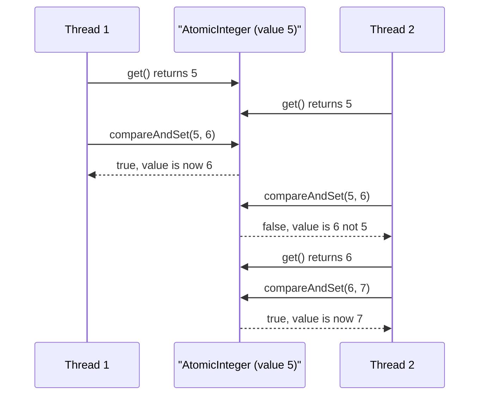
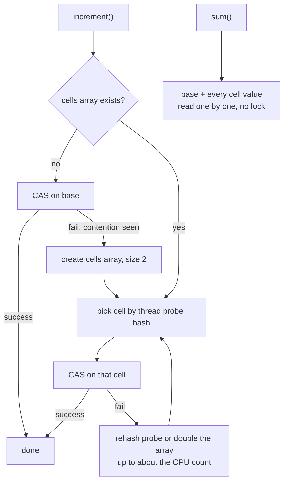
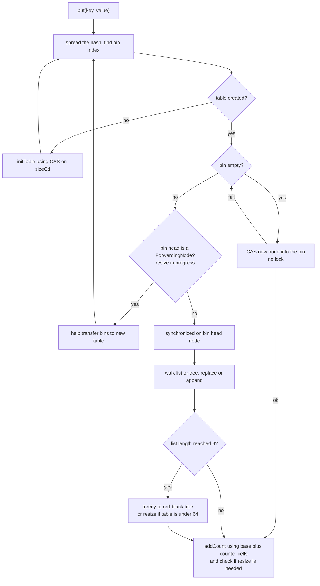

# Concurrent Collections & Atomics (CAS, LongAdder)

!!! abstract "Key takeaways"
    - **CAS (compare-and-set)** is one CPU instruction: "write the new value only if the current value is still what I read". Atomics and most concurrent collections are built from a **read, compute, CAS, retry** loop instead of a lock.
    - **`ConcurrentHashMap` (Java 8+)** uses CAS to fill an empty bucket and `synchronized` on the **first node of one bucket** for everything else. Reads never lock. No `null` keys or values. Iterators are **weakly consistent** and never throw `ConcurrentModificationException`.
    - **Each method is atomic, a sequence of methods is not.** `if (!map.containsKey(k)) map.put(k, v)` is a race. Use `putIfAbsent`, `computeIfAbsent`, `compute`, `merge`.
    - **`LongAdder`** beats `AtomicLong` for hot counters by spreading writes over a small array of cells that threads hash onto, but `sum()` is not an atomic snapshot. Use `AtomicLong` when you need to read and act on an exact value (sequences, CAS on the value).
    - Pick by workload: `CopyOnWriteArrayList` for read-mostly small lists, a **bounded** `BlockingQueue` for hand-off with backpressure, `ConcurrentSkipListMap` when you need sorted order.

## Why it matters

Every Spring Boot service has shared mutable state somewhere: an in-memory cache, a metrics counter, a registry of handlers, a rate limiter, a work queue. Spring beans are singletons, so any field on a bean is touched by every request thread at once.

Before Java 5 the tools were `Hashtable`, `Vector` and `Collections.synchronizedMap`. All of them guard the whole structure with one lock, so 200 request threads queue up behind a single monitor. They also do not help with compound actions: check-then-put is still a race even though each call is synchronized.

`java.util.concurrent` (Doug Lea, JSR 166) fixed both problems: fine-grained or lock-free internals for throughput, and atomic compound methods for correctness. Interviewers use this topic to find out whether you understand *why* these classes are safe, not just that they exist. Expect "how does `ConcurrentHashMap` work internally?" in almost every senior Java loop.

## Core concepts

### CAS: the building block

A compare-and-set takes three things: a memory location, the value you **expect**, and the **new** value. The CPU writes the new value only if the location still holds the expected one, and tells you whether it succeeded. On x86 this is `lock cmpxchg`; on ARM it is a load-linked / store-conditional pair or a dedicated CAS instruction. The JIT compiles `AtomicInteger.compareAndSet` straight to that instruction (it is an intrinsic), so there is no lock object, no thread parking and no context switch.

The usage pattern is always an optimistic loop:

```java
int current, next;
do {
    current = counter.get();          // 1. read
    next = current + 1;               // 2. compute from what was read
} while (!counter.compareAndSet(current, next));   // 3. publish only if nobody changed it, else retry
```


*Notice that Thread 2 is never blocked. It loses the race, finds out immediately, and retries with fresh data, so no update is lost and no thread is parked.*

This is called **lock-free**: at least one thread always makes progress. Compare that with a lock, where a thread that is descheduled while holding it stalls everyone else.

**Costs of CAS:**

- **Retry storms under heavy contention.** With many threads hammering one variable, most CAS attempts fail and are repeated. Each attempt also drags the cache line holding the value between CPU cores. This is the problem `LongAdder` solves.
- **One variable only.** CAS cannot atomically update two fields. Put both in an immutable object and CAS an `AtomicReference` to it, or use a lock.
- **The ABA problem** (see below).

### The atomic family

| Class | Use |
|---|---|
| `AtomicInteger`, `AtomicLong`, `AtomicBoolean` | Counters, sequence numbers, one-time flags |
| `AtomicReference<V>` | Swap an immutable snapshot (config, routing table) atomically |
| `AtomicIntegerArray`, `AtomicLongArray`, `AtomicReferenceArray` | Per-element atomic access |
| `AtomicStampedReference`, `AtomicMarkableReference` | Reference plus a version or a flag, to defeat ABA |
| `LongAdder`, `DoubleAdder`, `LongAccumulator` | High-contention counters and running max/min |
| `VarHandle` (Java 9, JEP 193) | CAS on a plain field without a wrapper object. The supported replacement for `sun.misc.Unsafe`; newer JDK code (for example `AtomicReference`, `AtomicBoolean`, `FutureTask`) uses it, while some hot classes such as `ConcurrentHashMap` still use the internal `Unsafe` directly |

Useful methods: `incrementAndGet`, `getAndAdd`, `updateAndGet(fn)`, `accumulateAndGet(x, fn)`, `compareAndSet`. The function passed to `updateAndGet` **may run more than once** (once per retry), so it must have no side effects.

`compareAndSet` on `AtomicReference` compares with `==` (identity), not `equals`. That matters with boxed values: `new AtomicReference<>(1000)` then `compareAndSet(1000, 1001)` can fail because the two `Integer` objects for 1000 are different instances.

### The ABA problem

A thread reads `A`, another thread changes the value to `B` and back to `A`, and the first thread's CAS succeeds even though the world changed. For a counter this is harmless. For pointer-based structures (a lock-free stack where a node was popped and re-pushed) it can corrupt the structure.

In Java it is rarer than in C++ because the garbage collector will not reuse a node's memory while anyone still holds a reference to it. It still appears if you recycle node objects or if the "same value" hides a different state. The fix is a version: `AtomicStampedReference` compares the reference **and** an integer stamp together.

### LongAdder: remove the contention instead of winning it

`AtomicLong` has one memory location that every thread fights over. `LongAdder` (Java 8, built on `Striped64`) keeps a `base` value plus an array of `Cell`s:


*Notice that with no contention it behaves like a plain CAS on `base`, and it only pays for cells once threads actually collide. Also notice that `sum()` just walks the cells, so it is not a snapshot.*

{ loading=lazy }
*Notice that `LongAdder` does not win the race faster. It removes the race by giving each thread its own cell.*

Key details:

- The cell array is created **lazily** and grows by doubling, up to the next power of two at or above the number of CPUs. More cells than cores would not help.
- Each `Cell` is annotated `@Contended`, which pads it so two cells never share a cache line. This prevents **false sharing**, where two cores writing to different variables on the same 64-byte line keep invalidating each other's cache.
- `sum()` adds `base` and all cells without locking. Updates that happen during the walk may or may not be included. It is accurate when things are quiet and "close enough" under load.
- The price is memory (a padded cell is far bigger than 8 bytes) and no `compareAndSet`.

`LongAccumulator` generalises this to any associative, commutative function, for example a running maximum: `new LongAccumulator(Long::max, Long.MIN_VALUE)`.

### ConcurrentHashMap internals

**Java 7** split the map into 16 `Segment`s, each a small hash table with its own `ReentrantLock` ("lock striping"). `concurrencyLevel` set the number of segments.

**Java 8 and later** removed segments. The map is one `Node[]` table, and the lock granularity is a single bucket (bin):


*Notice that the common case, an empty bin, takes no lock at all, and a collision locks only one bin, so writers to different bins never wait for each other.*

{ loading=lazy }
*The four cases a `put` can meet, one bin each. Only the collision case takes a lock, and only on that bin.*

What to be able to explain:

- **Reads are lock-free.** `get` reads the bin through a volatile-style read and walks nodes whose `val` and `next` fields are `volatile`. A reader never blocks, even during a resize.
- **Writes** use CAS for an empty bin and `synchronized` on the bin's head node otherwise. The JDK chose `synchronized` over `ReentrantLock` here to avoid allocating a lock object per bin.
- **Treeification.** A bin becomes a red-black tree when it reaches 8 nodes and the table has at least 64 slots (otherwise the table is resized instead). Strictly, `TREEIFY_THRESHOLD = 8` is checked while adding to a bin that already holds 8 nodes, so the conversion happens on the 9th insert; "8" is the number interviewers expect. It goes back to a list when a resize splits it into a bin of 6 or fewer nodes (plain removals only untreeify once the tree is very small). This caps the worst case at O(log n) even with bad or hostile hash codes.
- **Cooperative resize.** At 0.75 load the table doubles. Bins are moved one at a time and replaced with a `ForwardingNode`. A writer that hits a forwarding node **helps** move bins instead of waiting. Readers follow the forwarding node into the new table.
- **Counting.** The element count is kept in `baseCount` plus `CounterCell`s, the same design as `LongAdder`. So `size()` is a moving estimate under concurrent updates. `mappingCount()` returns a `long` and is the preferred method.
- **No nulls.** `get` returning `null` must mean "absent". In a concurrent map you cannot follow up with `containsKey` to tell "absent" from "mapped to null", because the map can change between the two calls.
- **Weakly consistent iterators.** They reflect the state at some point at or after creation, never throw `ConcurrentModificationException`, and may or may not show later changes.
- **`concurrencyLevel`** survives in the constructor only as a sizing hint. Defaults are capacity 16 and load factor 0.75.

**Atomic compound methods** are the real API of the map:

| Method | Meaning |
|---|---|
| `putIfAbsent(k, v)` | Insert if missing. `v` is always constructed |
| `computeIfAbsent(k, fn)` | Insert if missing, `fn` runs **at most once** per key and only when needed |
| `computeIfPresent`, `compute` | Atomic read-modify-write of one entry. Returning `null` removes it |
| `merge(k, v, fn)` | Insert `v` or combine with the existing value. Ideal for counting |
| `replace(k, old, new)`, `remove(k, v)` | CAS-style conditional update or delete |

These run the function **while holding the bin lock**. The Javadoc says the function should be short and simple and must not update other mappings of the same map.

### The rest of the toolbox

| Collection | Internals | Use when |
|---|---|---|
| `CopyOnWriteArrayList` / `CopyOnWriteArraySet` | Every write copies the whole array under a lock. Readers and iterators use an immutable snapshot | Read-mostly, small: listeners, handler chains, allow-lists |
| `ConcurrentLinkedQueue` / `Deque` | Lock-free linked nodes with CAS (Michael-Scott algorithm). Unbounded, non-blocking | Producers and consumers that never need to wait |
| `ArrayBlockingQueue` | Fixed array, **one** lock for put and take, optional fairness | Bounded hand-off, predictable memory |
| `LinkedBlockingQueue` | Linked nodes, **two** locks (put and take run in parallel). Capacity defaults to `Integer.MAX_VALUE` | Higher throughput hand-off. Always pass a capacity |
| `SynchronousQueue` | Zero capacity, each put waits for a take | Direct hand-off (`Executors.newCachedThreadPool`) |
| `PriorityBlockingQueue`, `DelayQueue` | Heap under one lock, unbounded | Priority work, scheduled or expiring items |
| `ConcurrentSkipListMap` / `Set` | Lock-free skip list, O(log n), sorted | Concurrent `TreeMap` replacement: range queries, `ceilingKey`, time-ordered indexes |
| `Collections.synchronizedMap/List` | Wrapper with one mutex | Low contention, or you must wrap a specific implementation such as `LinkedHashMap` |

Blocking queues are the bridge to [executors and thread pools](04-executors-and-thread-pools.md): the pool's work queue type decides whether it grows threads, buffers or rejects.

## In practice: code & configuration

### Check-then-act on a concurrent map

=== "❌ Common mistake"
    ```java
    @Service
    class FormularyCache {
        private final Map<String, Formulary> cache = new ConcurrentHashMap<>();
        private final Map<String, Integer> hits = new ConcurrentHashMap<>();

        Formulary get(String planId) {
            // RACE 1: two threads both see "absent" and both call the slow upstream.
            if (!cache.containsKey(planId)) {
                cache.put(planId, upstream.loadFormulary(planId));
            }
            // RACE 2: read-modify-write in two calls. Concurrent increments are lost.
            Integer n = hits.get(planId);
            hits.put(planId, n == null ? 1 : n + 1);
            return cache.get(planId);
        }
    }
    ```

=== "✅ Correct approach"
    ```java
    @Service
    class FormularyCache {
        private final ConcurrentMap<String, Formulary> cache = new ConcurrentHashMap<>();
        private final ConcurrentMap<String, LongAdder> hits = new ConcurrentHashMap<>();

        Formulary get(String planId) {
            // One LongAdder per key: the increment itself is contention-free.
            // Note: computeIfAbsent may still lock the bin when the key exists (Java 9+ only skips
            // the lock if the key is the first node of its bin). On a very hot path do get() first
            // and fall back to computeIfAbsent on a miss.
            hits.computeIfAbsent(planId, k -> new LongAdder()).increment();

            // Atomic per key: the loader runs at most once, other callers for the same key wait.
            return cache.computeIfAbsent(planId, upstream::loadFormulary);
        }
    }
    ```

The correct version still has a design smell worth naming in an interview: `upstream::loadFormulary` is a network call running **inside the bin lock**. Other keys that hash to the same bin are blocked for its duration, and if the loader ever touches the same map you get an `IllegalStateException: Recursive update` (Java 9+) or, on Java 8, a possible hang. Two production-grade alternatives:

```java
// Option A: cache the future, not the value. The lock is held only to create the future.
private final ConcurrentMap<String, CompletableFuture<Formulary>> inFlight = new ConcurrentHashMap<>();

CompletableFuture<Formulary> getAsync(String planId) {
    CompletableFuture<Formulary> future = inFlight.computeIfAbsent(planId, id ->
        CompletableFuture.supplyAsync(() -> upstream.loadFormulary(id), ioExecutor));
    // Do not cache failures. Attach the cleanup OUTSIDE computeIfAbsent: if the future had already
    // failed, the callback would run inline in the mapping function and remove() on the same map
    // would be a recursive update. remove(key, value) only removes this exact failed future.
    future.whenComplete((v, ex) -> { if (ex != null) inFlight.remove(planId, future); });
    return future;
}

// Option B: use Caffeine. It gives size bounds, TTL, stats and async loading out of the box.
private final LoadingCache<String, Formulary> cache = Caffeine.newBuilder()
    .maximumSize(10_000)
    .expireAfterWrite(Duration.ofMinutes(10))
    .build(upstream::loadFormulary);
```

A raw `ConcurrentHashMap` used as a cache has **no eviction**. With unbounded keys (member IDs, tokens) it is a memory leak waiting for a heap dump. See the diagnosing production issues page (subtopic 10).

### Atomic swap of an immutable snapshot

```java
@Component
class RoutingTable {
    // Readers get a consistent, immutable view with one volatile read. No locks on the hot path.
    private final AtomicReference<Map<String, Endpoint>> routes = new AtomicReference<>(Map.of());

    Endpoint lookup(String service) {
        return routes.get().get(service);
    }

    void register(String service, Endpoint endpoint) {
        routes.updateAndGet(current -> {          // may run several times, so keep it pure
            var copy = new HashMap<>(current);
            copy.put(service, endpoint);
            return Map.copyOf(copy);               // publish a new immutable map
        });
    }
}
```

### Counters: AtomicLong vs LongAdder

```java
// Exact value needed and used in a decision: AtomicLong.
private final AtomicLong sequence = new AtomicLong();
long nextId() { return sequence.incrementAndGet(); }

// Written by every request thread, read by a metrics scraper every few seconds: LongAdder.
private final LongAdder requests = new LongAdder();
void onRequest() { requests.increment(); }
long scrape()    { return requests.sum(); }        // close enough, not a snapshot

// Running maximum without a lock.
private final LongAccumulator maxLatencyMs = new LongAccumulator(Long::max, 0);
void record(long ms) { maxLatencyMs.accumulate(ms); }
```

### Bounded queue for backpressure

```java
// Bounded on purpose: when the consumer falls behind, producers slow down or get told "no".
private final BlockingQueue<AuditEvent> queue = new ArrayBlockingQueue<>(10_000);

boolean publish(AuditEvent event) throws InterruptedException {
    // offer with a timeout: wait briefly, then report failure instead of blocking forever
    // or growing the heap without limit.
    return queue.offer(event, 50, TimeUnit.MILLISECONDS);
}
```

## Real-world usage

- **Spring itself.** The singleton bean registry (`DefaultSingletonBeanRegistry`) and the default `ConcurrentMapCacheManager` behind `@Cacheable` are backed by `ConcurrentHashMap`. That default cache has no TTL and no size limit, which is why real services switch to Caffeine or Redis.
- **Metrics libraries.** Micrometer's cumulative counters use `DoubleAdder`/`LongAdder`, because a counter is the textbook case: written on every request, read rarely. Netflix Hystrix used a `LongAdder`-based rolling number for its circuit-breaker statistics for the same reason.
- **Caffeine** (the cache used by Spring Boot when present) is built on a `ConcurrentHashMap` plus striped ring buffers that record reads without contending, an idea close to `LongAdder`'s striping.
- **LMAX Disruptor** made false sharing famous: it pads its sequence counters so they sit on their own cache lines. `@Contended` (JEP 142) is the JDK's built-in version of the same trick.
- **Known failure modes:**
    - A plain `HashMap` shared between threads. On Java 7 and earlier, a concurrent resize could link a bucket into a cycle, and `get` then spun forever at 100% CPU. Java 8 changed the resize so that specific loop is gone, but you still get lost updates and corrupted state.
    - `computeIfAbsent` with a mapping function that modifies the same map hung on Java 8 (JDK-8062841). Java 9 detects many cases and throws `IllegalStateException`.
    - `Executors.newFixedThreadPool` uses an unbounded `LinkedBlockingQueue`. A slow downstream turns it into an out-of-memory error instead of backpressure.
- **Healthcare and banking relevance.** These classes give you safety **inside one JVM only**. An account balance, a claim status or an idempotency key in a service running several pods needs a database transaction, an optimistic version column, or Redis/`SETNX`. Interestingly the idea is the same: an optimistic `UPDATE ... WHERE version = ?` is CAS at the database level. In-memory counters used for audit or billing are also lost on restart, so they belong in a durable store.

## Trade-offs & production gotchas

| Option | Pros | Cons | Use when |
|---|---|---|---|
| `synchronized` / lock around a `HashMap` | Simple, any compound action is safe | One lock, readers block each other | Low contention or multi-key invariants |
| `ConcurrentHashMap` | Lock-free reads, per-bin writes, atomic compound methods | No nulls, `size()` is an estimate, no eviction, no multi-key atomicity | Default shared map |
| `Collections.synchronizedMap` | Wraps any map (e.g. access-ordered `LinkedHashMap`) | One mutex, must lock manually to iterate | You need a specific map type and contention is low |
| `CopyOnWriteArrayList` | Lock-free reads, safe iteration | O(n) copy on every write | Small, read-mostly |
| `ConcurrentSkipListMap` | Sorted and concurrent | O(log n), more memory than a hash map | Range queries, ordered keys |
| `AtomicLong` | Exact, has CAS, 8 bytes of state | Degrades under heavy write contention | Sequences, values you compare and act on |
| `LongAdder` | Scales with writers | `sum()` not atomic, more memory, no CAS | Metrics and statistics |
| `ArrayBlockingQueue` | Bounded, pre-allocated, optional fairness | One lock for both ends | Backpressure with predictable memory |
| `LinkedBlockingQueue` | Separate put and take locks | Node allocation, unbounded by default | High-throughput hand-off, with an explicit capacity |

!!! warning "Gotcha: thread-safe class, thread-unsafe usage"
    `map.get()` followed by `map.put()` is two atomic operations with a gap between them. The same applies to `if (queue.size() < max) queue.add(x)` and `if (!list.contains(x)) list.add(x)`. Use the single atomic method (`merge`, `computeIfAbsent`, `offer`, `addIfAbsent`).

!!! warning "Gotcha: mutable values inside the map"
    `ConcurrentHashMap<String, List<String>>` with `map.get(k).add(x)` is not thread-safe. The map protects the mapping, not the `ArrayList` inside it. Do the mutation inside `compute`, or store an immutable or concurrent value.

!!! warning "Gotcha: slow or blocking work inside compute functions"
    The function runs while the bin is locked. A network call there blocks unrelated keys in the same bin. On Java 21, a virtual thread that blocks inside `synchronized` also **pins its carrier thread**. JDK 24 (JEP 491) removed that pinning, but the bin lock is still held. See the virtual threads page (subtopic 7).

!!! warning "Gotcha: size(), isEmpty() and sum() are not snapshots"
    `ConcurrentHashMap.size()`, `ConcurrentLinkedQueue.size()` (which is also O(n)) and `LongAdder.sum()` are estimates while writers are active. Never use them in a correctness decision such as "reject if size is at the limit".

!!! warning "Gotcha: unbounded by default"
    `LinkedBlockingQueue()`, `ConcurrentLinkedQueue`, `PriorityBlockingQueue` and a `ConcurrentHashMap` cache have no upper bound. Under a slow consumer they grow until the heap is gone. Bound them deliberately.

!!! tip "Atomicity is not visibility, and neither is ordering across variables"
    Atomics give you both atomicity and visibility for **one** variable (their value is volatile). Two atomics updated one after the other are not updated together. For the memory-model rules behind this see [synchronization, volatile and happens-before](02-synchronization-volatile-java-memory-model-happens-before.md), and for multi-variable invariants see [locks](03-locks-reentrantlock-readwritelock-stampedlock-deadlock-livel.md).

## How this connects to my experience

- **Where I used it:** the resume does not name these classes, so position this as the JVM-level foundation under the work it does name. The closest bullets are "Implemented Redis-based caching for frequently accessed queries and UI reference data" and "Owned the GraphQL Consumer Service end-to-end" at OptumRx, and the Kafka "retry and DLQ handling" workflows.
- **Talking points:**
    - **Local cache in front of Redis.** Reference data that rarely changes is a good fit for an in-process `ConcurrentHashMap` or Caffeine layer before the Redis call, loaded with `computeIfAbsent` so concurrent requests trigger one load. *[confirm whether a local L1 cache existed or whether it was Redis only]*
    - **Per-request vs shared state in GraphQL.** DataLoader caches are per request so they need no cross-thread protection, while any registry or cache on a singleton bean is shared and does. Being clear about which is which is the senior answer.
    - **Kafka consumers.** `KafkaConsumer` is not thread-safe. If records were handed to a worker pool, offsets or in-flight work would be tracked in a concurrent structure and the hand-off queue would be bounded for backpressure. *[confirm whether processing was single-threaded per partition or used a worker pool]*
    - **Metrics.** Request and error counters exposed through Micrometer and Actuator are `LongAdder`-style counters under the hood. *[confirm that Micrometer/Actuator metrics were used on the service]*
    - **Key rotation at CCKM.** A "currently active key version" that readers consult on every request and a rotation job replaces is the `AtomicReference` snapshot-swap pattern. *[confirm how the active key reference was held in memory, if at all]*
    - **Honest boundary.** With multiple pods on Kubernetes, in-JVM structures only coordinate threads in one pod. Cross-pod coordination went through Redis, MongoDB and Kafka. *[confirm the OptumRx services ran as multiple pods on Kubernetes and which store handled which cross-pod concern]*
- **Likely follow-up chain:** "How did you cache reference data?" → "What if 50 requests miss the cache at the same moment?" (stampede: `computeIfAbsent` or cache the future locally, and for Redis a short lock or accepting duplicate loads) → "How does `ConcurrentHashMap` make that safe?" (CAS on an empty bin, `synchronized` on the bin head, lock-free reads) → "Is that enough with 6 pods?" (no, it is per JVM, so Redis is the shared layer and the local map is only an optimisation with a TTL).

## Interview questions

### Fundamentals

??? question "Q1. What is CAS and why is it faster than a lock?"
    **Answer:** Compare-and-set is an atomic CPU instruction that updates a memory location only if it still holds an expected value, and reports success or failure. Code reads the value, computes a new one and CASes it in, retrying on failure. There is no lock to acquire, so a thread is never parked and never descheduled while "holding" something others need. Under low to moderate contention this avoids the cost of blocking and context switches.

    **Interviewer listens for:** optimistic retry loop, hardware instruction (`cmpxchg`), lock-free progress, and the honest caveat that under very high contention retries make it slower.

    **Common wrong answer:** "CAS is always faster than locking." With many writers on one variable it wastes CPU on failed attempts.

??? question "Q2. Is `count++` on a `volatile int` thread-safe? What about `AtomicInteger`?"
    **Answer:** No. `count++` is read, add, write. `volatile` makes each read and write visible to other threads but does not make the three steps atomic, so two threads can read the same value and one increment is lost. `AtomicInteger.incrementAndGet()` does the three steps as a CAS loop, so no update is lost.

    **Interviewer listens for:** the difference between visibility and atomicity.

    **Common wrong answer:** "volatile makes ++ atomic."

??? question "Q3. `Hashtable` vs `Collections.synchronizedMap` vs `ConcurrentHashMap`?"
    **Answer:** The first two guard every method with one lock on the whole map, so all readers and writers are serialised, and iteration needs manual external locking or it throws `ConcurrentModificationException`. `ConcurrentHashMap` has lock-free reads, locks only one bin for a write, offers atomic compound methods, and its iterators are weakly consistent. None of the three allow you to safely do check-then-act with separate calls (with the first two you can wrap the calls in `synchronized (map)`; with `ConcurrentHashMap` you use its atomic compound methods, because external locking on it does not exclude other writers).

    **Common wrong answer:** "`ConcurrentHashMap` locks segments." That was Java 7. Since Java 8 it is CAS plus `synchronized` per bin.

    **Interviewer listens for:** one global lock vs per-bin locking and lock-free reads, iteration behaviour.

??? question "Q4. Why does `ConcurrentHashMap` reject null keys and values?"
    **Answer:** Because of ambiguity. If `get(k)` returns `null`, it must mean "no mapping". In a `HashMap` you can call `containsKey` to distinguish a null value from an absent key, but in a concurrent map another thread can change the mapping between the two calls, so the check is meaningless. Banning null removes the ambiguity. `compute`-style methods also use a `null` return to mean "remove the entry".

    **Interviewer listens for:** ambiguity of null in a concurrent map, no safe containsKey follow-up.

    **Common wrong answer:** "It is a historical accident from Hashtable."

??? question "Q5. What does this print?"
    ```java
    var map = new ConcurrentHashMap<String, Integer>(Map.of("a", 1, "b", 2));
    for (String k : map.keySet()) {
        map.put("c", 3);
        map.remove("b");
    }
    System.out.println(map);
    ```
    **Answer:** It always ends with `{a=1, c=3}` and never throws. The iterator is weakly consistent, so modifying the map during iteration is legal. Whether the loop body ran one, two or three times is not specified, because the iterator may or may not see `c` being added or `b` being removed. With a `HashMap` the same code throws `ConcurrentModificationException`.

    **Interviewer listens for:** "weakly consistent", no exception, and not claiming a fixed number of iterations.

    **Common wrong answer:** "It throws ConcurrentModificationException." CHM iterators are weakly consistent and never throw it.

### Intermediate

??? question "Q6. Walk me through `put` in `ConcurrentHashMap` on Java 8+."
    **Answer:** Spread the hash and find the bin. If the table is not created yet, initialise it with a CAS on `sizeCtl` so only one thread does it. If the bin is empty, CAS the new node in with no lock. If the bin head is a forwarding node, a resize is running, so help move bins and retry. Otherwise `synchronized` on the bin's head node, walk the list or tree, then replace or append. If the list reaches 8 nodes, convert it to a red-black tree (or resize if the table has fewer than 64 slots). Finally update the count through `baseCount` and counter cells, and trigger a resize if the threshold is passed.

    **Interviewer listens for:** CAS for empty bin, lock on the head node only, treeification thresholds, cooperative resize, striped counting.

    **Common wrong answer:** "put locks the whole segment like Java 7." Java 8+ uses CAS for empty bins and locks a single bin otherwise.

??? question "Q7. `putIfAbsent` vs `computeIfAbsent`?"
    **Answer:** `putIfAbsent(k, v)` takes a ready value, so the value is constructed on every call even when the key exists, and it returns the **previous** value (`null` if it inserted). `computeIfAbsent(k, fn)` only calls `fn` when the key is missing, guarantees at most one call per key, and returns the **current** value. For expensive values use `computeIfAbsent`. The cost is that `fn` runs under the bin lock, so it must be short and must not touch the same map.

    **Common wrong answer:** treating the return value of `putIfAbsent` as the value now in the map. It is `null` on a successful insert.

    **Interviewer listens for:** eager value vs lazy compute, return values, function runs at most once.

??? question "Q8. When would you choose `LongAdder` over `AtomicLong`, and when not?"
    **Answer:** `LongAdder` when many threads write and reads are rare and can be approximate: request counters, metrics, statistics. It spreads updates over padded cells that threads hash onto (striping), so threads do not contend on one cache line. `AtomicLong` when you need the exact current value as part of a decision: ID generation, `compareAndSet`, a limit check with `incrementAndGet`. `LongAdder.sum()` is not an atomic snapshot and `sumThenReset()` can lose concurrent updates.

    **Interviewer listens for:** striping, false sharing and `@Contended`, the read-side weakness, memory cost.

    **Common wrong answer:** "LongAdder is always better." Its sum() is not an atomic snapshot and it uses more memory.

??? question "Q9. How does `CopyOnWriteArrayList` work and when is it a bad idea?"
    **Answer:** Every mutation takes a lock, copies the entire backing array, applies the change and publishes the new array through a volatile field. Readers and iterators use whichever array they saw, without locking, so iteration is a consistent snapshot and never throws. It is a bad idea for large lists or frequent writes: each `add` is O(n) and creates garbage. Adding n elements one by one is O(n²), so bulk-load with `addAll` or the constructor. Its iterators also do not support `remove`.

    **Interviewer listens for:** copy on every write, snapshot iteration, good for rarely changed listener lists.

    **Common wrong answer:** "It is a general-purpose thread-safe list." Writes copy the whole array.

??? question "Q10. `ArrayBlockingQueue` vs `LinkedBlockingQueue`?"
    **Answer:** `ArrayBlockingQueue` is a fixed-size array with a single lock for both ends, optional fairness, no allocation per element. `LinkedBlockingQueue` uses separate put and take locks, so a producer and a consumer can work at the same time, but it allocates a node per element and its default capacity is `Integer.MAX_VALUE`, which means effectively unbounded. In a service I choose a bounded queue either way, because the bound is what gives backpressure.

    **Interviewer listens for:** single lock + array vs two locks + nodes, bounded vs optionally unbounded.

    **Common wrong answer:** "LinkedBlockingQueue is always bounded." The default capacity is Integer.MAX_VALUE.

### Senior

??? question "Q11. What is the ABA problem and does it matter in Java?"
    **Answer:** A thread reads A, others change the value to B and back to A, and the first thread's CAS succeeds although the state changed in between. For numeric counters it is harmless. It matters for linked lock-free structures where "same reference" does not mean "same structure". Java's GC removes the classic cause, because a node cannot be freed and reallocated at the same address while a thread still references it. It can still occur when nodes are pooled and reused or when identity hides state. The fix is `AtomicStampedReference`, which CASes the reference together with a version stamp, or simply never reusing nodes.

    **Interviewer listens for:** a precise definition, why GC helps, and a concrete fix.

    **Common wrong answer:** "Java's GC makes ABA impossible." It prevents memory reuse ABA, not logical ABA on values.

??? question "Q12. What is false sharing and how does the JDK deal with it?"
    **Answer:** CPUs cache memory in lines of about 64 bytes. If two threads on different cores write to two different variables that sit on the same line, each write invalidates the other core's copy, so they slow each other down although they share no data. `LongAdder` cells and `ConcurrentHashMap` counter cells are annotated with `@Contended`, which makes the JVM pad them so each sits alone on its line. In application code the annotation is in an internal package and needs `-XX:-RestrictContended`, so in practice I reach for `LongAdder` rather than hand-padding.

    **Interviewer listens for:** cache lines, @Contended and padding in LongAdder cells and Thread fields.

    **Common wrong answer:** "volatile prevents false sharing."

??? question "Q13. Why is `ConcurrentHashMap.size()` only an estimate, and how would you enforce a maximum size?"
    **Answer:** The count is stored as a base plus striped counter cells so that writers do not contend on one counter. `size()` sums them without locking, so concurrent inserts and removes may be half-counted. It is exact only when no writer is active. To enforce a bound I would not write `if (map.size() < max) map.put(...)`, which is both check-then-act and based on an estimate. I would use a cache built for it (Caffeine `maximumSize`), or guard admission with a `Semaphore` or an `AtomicInteger` that is incremented with CAS before the insert and decremented on removal.

    **Common wrong answer:** "`size()` locks the map so it is accurate." That was closer to the Java 7 fallback behaviour, not the current design.

    **Interviewer listens for:** striped counters summed without locking, enforce bounds with a semaphore or Caffeine.

??? question "Q14. What can go wrong with `computeIfAbsent`?"
    **Answer:** Four things:

    1. The function runs under the bin lock, so a slow loader blocks every other key in that bin.
    2. If the function modifies the same map, for example a recursive memoised function, Java 8 could hang and Java 9+ throws `IllegalStateException: Recursive update`.
    3. If the function returns `null` nothing is stored, so "not found" results are recomputed every time unless you store a sentinel or an `Optional`.
    4. If the function throws, nothing is stored and every waiting caller retries, which can hammer a failing upstream.

    For expensive loads I cache a `CompletableFuture` or use Caffeine's loading cache.

    **Interviewer listens for:** lock scope, the recursive-update bug, negative caching, failure behaviour.

    **Common wrong answer:** "computeIfAbsent is always safe to use for caching." Slow loaders block other keys and recursion throws.

??? question "Q15. How do concurrent collections interact with virtual threads?"
    **Answer:** They work unchanged, and the lock-free ones are a natural fit. Two points matter. First, on Java 21 a virtual thread that blocks while inside a `synchronized` block pins its carrier thread. `ConcurrentHashMap` bins are guarded by `synchronized`, so a blocking call inside `compute` or `computeIfAbsent` pins a carrier and can starve the scheduler. JDK 24 (JEP 491) removed that pinning, so Java 25 LTS no longer has the issue, although the bin is still locked. Second, with thousands of virtual threads, unbounded queues and maps grow faster, so bounding and semaphores for concurrency limits become more important than pool size.

    **Interviewer listens for:** lock-free structures fit well, pinning with synchronized on Java 21, fixed in Java 24.

    **Common wrong answer:** "Concurrent collections must be replaced for virtual threads."

### Scenario-based

??? question "Q16. A cache built on `ConcurrentHashMap.computeIfAbsent` makes p99 latency spike whenever one upstream is slow, even for keys that are already cached elsewhere in the map. Why, and how do you fix it?"
    **Answer:** The loader runs while holding the lock of the bin the key hashes to. Any other write (and any other `computeIfAbsent`, even for an existing key if it has to lock) on a key in the same bin waits for the slow call. With a small table many keys share bins. Plain `get` calls are not blocked, which is why only part of the traffic suffers. Fixes: store `CompletableFuture<V>` so the lock is held only to register the future, and the load happens outside it, remove failed futures so errors are not cached, add a timeout on the upstream call, and preferably move to Caffeine `AsyncLoadingCache`, which also gives eviction and TTL.

    **Interviewer listens for:** "the function runs under the bin lock", reads unaffected, future-based fix, timeout.

    **Common wrong answer:** "ConcurrentHashMap is lock-free, so this cannot be the cause."

??? question "Q17. An in-memory rate limiter does `if (counter.get() < limit) counter.incrementAndGet()` and lets through more requests than the limit under load. Fix it. Then make it work across 8 pods."
    **Answer:** That is check-then-act: many threads pass the check before any of them increments. Single JVM fix: increment first and test the result, `if (counter.incrementAndGet() > limit) { counter.decrementAndGet(); reject; }`, or a CAS loop that only increments while below the limit, or a `Semaphore.tryAcquire()` for concurrent-request limits. `LongAdder` is wrong here because it has no atomic read-and-decide. Across pods no JVM structure helps. Use Redis with an atomic operation (`INCR` with expiry, or a Lua script for a token bucket), or enforce the limit at the API gateway. Per-pod limits of `limit / 8` are a cheap approximation if exactness is not required.

    **Common wrong answer:** wrapping the two calls in `synchronized` and calling it done, without noticing the multi-pod problem.

    **Interviewer listens for:** check-then-act race, increment then test, distributed limiter for many pods.

??? question "Q18. A service keeps a `Map<String, List<Event>>` of pending events per member in a `ConcurrentHashMap`. Occasionally events go missing and once you saw an `ArrayIndexOutOfBoundsException` from `ArrayList.add`. What is happening?"
    **Answer:** The map is thread-safe, the `ArrayList` values are not. Code like `map.computeIfAbsent(id, k -> new ArrayList<>()).add(event)` makes the lookup atomic, but `add` then runs outside the bin lock, and two threads adding to the same list corrupt it: lost elements, or an index past the array during a resize. Fix by mutating inside the atomic method, `map.compute(id, (k, list) -> { if (list == null) list = new ArrayList<>(); list.add(event); return list; })`, and make sure readers also do not iterate the list unguarded, so better still store an immutable list and replace it, or use a concurrent value such as `ConcurrentLinkedQueue`.

    **Interviewer listens for:** the map protects mappings and not values, and the reader side of the problem.

    **Common wrong answer:** "The map is concurrent, so the lists are safe too." Thread safety does not extend to the values.

## Cheat sheet

| Concept | Remember |
|---|---|
| CAS | Read, compute, compare-and-set, retry. One variable only |
| Lock-free | Some thread always progresses, nobody is parked |
| `updateAndGet(fn)` | `fn` may run many times, keep it pure |
| ABA | Value went A, B, A. Fix with `AtomicStampedReference` |
| `ConcurrentHashMap` put | CAS into empty bin, else `synchronized` on bin head |
| CHM reads | Never lock, even during resize |
| CHM tree bins | List to tree at 8 nodes (table at least 64), back at 6 |
| CHM nulls | Not allowed, `null` from `get` means absent |
| CHM iterators | Weakly consistent, no `ConcurrentModificationException` |
| CHM `size()` | Estimate under writes, prefer `mappingCount()` |
| Compound actions | `putIfAbsent`, `computeIfAbsent`, `compute`, `merge` |
| Compute functions | Short, no blocking I/O, never touch the same map |
| Java 7 vs 8 CHM | Segments with `ReentrantLock` vs per-bin CAS and `synchronized` |
| `LongAdder` | Base plus padded cells. Fast writes, `sum()` not atomic |
| `AtomicLong` | Exact value, has CAS. Use for IDs and limits |
| False sharing | Different variables, same cache line. `@Contended` pads |
| `CopyOnWriteArrayList` | Read-mostly and small. O(n) per write |
| `ConcurrentSkipListMap` | Sorted concurrent map, O(log n) |
| `LinkedBlockingQueue` | Two locks, unbounded by default, always set capacity |
| `ArrayBlockingQueue` | One lock, bounded, optional fairness |
| Scope | One JVM only. Across pods use DB, Redis or Kafka |

## Sources

1. [ConcurrentHashMap (Java SE 21 API)](https://docs.oracle.com/en/java/javase/21/docs/api/java.base/java/util/concurrent/ConcurrentHashMap.html): null policy, weakly consistent iterators, `size`/`mappingCount`, rules for `compute` functions, defaults.
2. [java.util.concurrent package summary (Java SE 21)](https://docs.oracle.com/en/java/javase/21/docs/api/java.base/java/util/concurrent/package-summary.html): the concurrent collection families, weakly consistent iteration and memory-consistency guarantees.
3. [java.util.concurrent.atomic package summary (Java SE 21)](https://docs.oracle.com/en/java/javase/21/docs/api/java.base/java/util/concurrent/atomic/package-summary.html) and [LongAdder](https://docs.oracle.com/en/java/javase/21/docs/api/java.base/java/util/concurrent/atomic/LongAdder.html): CAS semantics, when `LongAdder` is preferable, `sum()` not being a snapshot.
4. [JEP 193: Variable Handles](https://openjdk.org/jeps/193): `VarHandle` as the supported replacement for `Unsafe` CAS.
5. [JEP 142: Reduce Cache Contention on Specified Fields](https://openjdk.org/jeps/142): `@Contended` and false sharing.
6. [JEP 491: Synchronize Virtual Threads without Pinning](https://openjdk.org/jeps/491): pinning inside `synchronized` on Java 21 and its removal in JDK 24.
7. [JDK-8062841: ConcurrentHashMap.computeIfAbsent stuck in an endless loop](https://bugs.openjdk.org/browse/JDK-8062841): the recursive-update hang and the Java 9 fix.
8. *Java Concurrency in Practice* (Goetz et al.), chapters 5 and 15: concurrent collections, compound actions, atomic variables and non-blocking algorithms.
