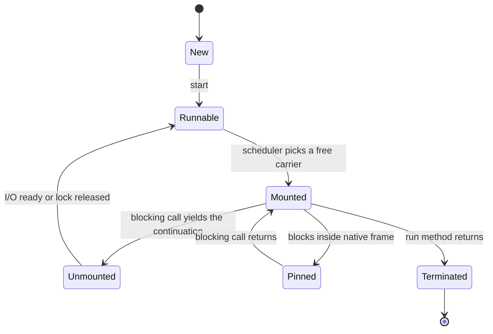
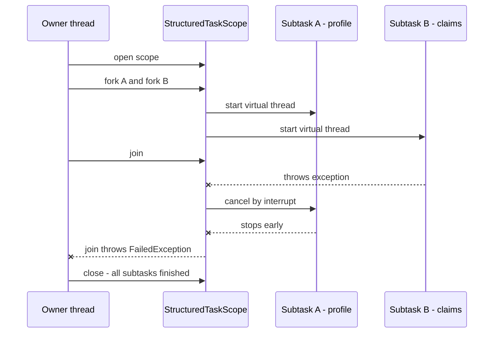

# Virtual Threads (Project Loom) & Structured Concurrency

!!! abstract "TL;DR"
    - A **virtual thread** is a `java.lang.Thread` scheduled by the **JVM**, not the OS. Its stack lives on the **heap**. When it blocks, it **unmounts** from its **carrier** (platform) thread, so the carrier can run another virtual thread. Final in **Java 21** (JEP 444).
    - They make **blocking I/O cheap**, not code faster. The win is **throughput** for I/O-bound work written in plain thread-per-request style. They give **no benefit for CPU-bound work**.
    - **Never pool** virtual threads. Create one per task (`Executors.newVirtualThreadPerTaskExecutor()`). Limit scarce resources with a **`Semaphore`**, not with pool size.
    - **Pinning** = a virtual thread blocks while stuck to its carrier. In Java 21-23 this happened inside `synchronized`. **Java 24 (JEP 491) fixed that**. Native/JNI frames still pin.
    - **Structured concurrency** (`StructuredTaskScope`, still a **preview API** in Java 25) treats forked subtasks as one unit: they finish, fail or get cancelled **together**. **Scoped values** (final in Java 25) replace `ThreadLocal` for passing context.

## Why it matters

A classic Java server uses **one OS thread per request**. The code is simple and debuggable, but an OS thread is expensive: it reserves stack memory (about 1 MB by default on most 64-bit platforms), and the OS has to schedule it. A few thousand threads is the practical ceiling. If each request spends 200 ms waiting on a database or an HTTP call, the threads are mostly **idle but occupied**, and the thread pool becomes the bottleneck long before CPU does.

The industry's first answer was **async/reactive** code (`CompletableFuture`, WebFlux, see [page 5](05-completablefuture-and-async-composition.md)). It scales, but it costs readability: broken stack traces, hard debugging, "coloured" functions, and context that no longer follows the thread.

Project Loom's answer: keep the simple blocking style, and make threads cheap enough that you can have **one per task, in the millions**.

For a Lead interview this topic is asked constantly since Java 21, usually as: "What are virtual threads? Would you turn them on in your service? What can go wrong?" The senior signal is knowing the **limits** (pinning, pools, downstream capacity, `ThreadLocal`), not just the definition.

## Core concepts

### Platform threads vs virtual threads

| | Platform thread | Virtual thread |
|---|---|---|
| Backed by | One OS thread (1:1) | Many share a few carriers (M:N) |
| Scheduled by | OS kernel | JVM (`ForkJoinPool` in FIFO mode) |
| Stack | Reserved native memory, fixed max | Heap objects (stack chunks), grows and shrinks |
| Creation cost | High, so we pool them | Very low, so we **don't** pool |
| Blocking | Blocks the OS thread | Unmounts, carrier is released |
| Daemon / priority | Configurable | Always daemon, priority fixed at `NORM_PRIORITY` |
| Good for | CPU-bound work, long-running system threads | Many short, blocking I/O tasks |

Both are instances of `java.lang.Thread`. Existing code that takes a `Thread`, an `Executor`, `ThreadLocal` or a lock keeps working.

### Mounting, unmounting and continuations

Internally a virtual thread is a **continuation** (a piece of code that can be suspended and resumed) plus a **scheduler**.

1. The scheduler **mounts** the virtual thread on a carrier thread. Its stack frames run on the carrier's stack.
2. The code reaches a blocking call that the JDK has been taught about (socket read, `Thread.sleep`, `BlockingQueue.take`, `ReentrantLock.lock`, `Future.get` ...).
3. Instead of blocking the OS thread, the JDK **yields the continuation**: the frames are copied to the heap as stack chunks, and the carrier is free.
4. For sockets, the JDK registers the channel with a non-blocking poller (epoll / kqueue). When data is ready, the virtual thread is **submitted back** to the scheduler.
5. Any free carrier picks it up, copies the frames back, and continues. The virtual thread may **resume on a different carrier**.


*Notice that a normal blocking call goes to Unmounted (the carrier is released), but a pinned block stays on the carrier, so that OS thread is stuck for the whole wait.*

### The scheduler

- The default scheduler is a dedicated **`ForkJoinPool` in FIFO mode** (it is not the common pool).
- **Parallelism = number of available processors** by default (`-Djdk.virtualThreadScheduler.parallelism`). The pool may temporarily add carriers to compensate for some blocked ones, up to `jdk.virtualThreadScheduler.maxPoolSize` (default 256).
- Scheduling is **not time-sliced** in current JDKs. A virtual thread gives up its carrier only when it blocks or finishes. A virtual thread in a long CPU loop holds its carrier and starves others. This is the main reason CPU-bound work belongs on platform threads.

### Pinning

A virtual thread is **pinned** when it cannot unmount. If it then blocks, the carrier blocks too.

| Cause | Java 21-23 | Java 24+ (JEP 491) |
|---|---|---|
| Blocking inside a `synchronized` block or method | **Pins** | Fixed, unmounts normally |
| `Object.wait()` | Pins | Fixed |
| Native frame on the stack (Java calls native code, which calls back into Java that blocks) | Pins | Still pins |
| Blocking during class initialisation or class loading | Pins | Still pins in some cases |

Pinning does not make code incorrect. It reduces scalability, and with only a few carriers (one per core) a handful of pinned threads can **stop the whole application**: every carrier is stuck, and the thread that would release the lock cannot get a carrier to run on.

Also note: **file I/O** on most platforms is still really blocking. The JDK compensates by temporarily adding a carrier, so it is not a correctness issue, but it does not scale like socket I/O.

How to find pinning:

- JFR event **`jdk.VirtualThreadPinned`** (enabled by default, 20 ms threshold).
- Java 21-23 only: `-Djdk.tracePinnedThreads=full` prints a stack trace when a thread blocks while pinned. This flag was **removed in Java 24** (setting it has no effect), and the JFR event was extended to report the pinning reason and the carrier.
- Thread dumps that include virtual threads: `jcmd <pid> Thread.dump_to_file -format=json file.json` (see the "Diagnosing production issues" page).

### Why you must not pool virtual threads

A pool exists to share an **expensive** resource. Virtual threads are cheap, so pooling them adds nothing and removes the point (one thread per task). But many teams used the pool size as a hidden **concurrency limit**: "200 Tomcat threads" also meant "at most 200 concurrent DB calls". With virtual threads that limit disappears. You must now state limits **explicitly**, with a `Semaphore`, a connection pool size, a bulkhead or a rate limiter.

### Structured concurrency

With `ExecutorService` and `CompletableFuture`, a task you start has **no relationship** to the code that started it. If the parent fails or is cancelled, children keep running (thread leaks). If one child fails, the siblings are not cancelled (wasted work). Thread dumps show flat, unrelated threads.

**Structured concurrency** applies the rule of structured programming to threads: *a subtask must finish inside the block that started it.* The API is `StructuredTaskScope`:

- `fork()` starts each subtask in a **new virtual thread**.
- `join()` waits for all of them, following a policy (a **`Joiner`**).
- If one fails, the scope **cancels** the others (by interrupting them).
- If the **owner** thread is interrupted, the cancel flows down to all subtasks.
- The scope is used in `try`-with-resources, so on exit nothing is left running.


*Notice that the failure of B cancels A automatically, and the owner cannot leave the block until both subtasks have ended. No thread outlives the scope.*

!!! warning "Version status"
    `StructuredTaskScope` is **still a preview API**: JEP 453 (Java 21) through JEP 505 (Java 25, fifth preview). The API **changed in Java 25**: you now call the static factory `StructuredTaskScope.open(...)` with a `Joiner`, instead of `new StructuredTaskScope.ShutdownOnFailure()`. You need `--enable-preview`. Say this in the interview: know it, but be careful about using preview APIs in production.

    It keeps moving after 25, so always say which JDK your example targets:

    - **Java 26 (JEP 525, sixth preview):** `Joiner.anySuccessfulResultOrThrow()` is renamed to `anySuccessfulOrThrow()`, `allSuccessfulOrThrow()` returns a `List` of results instead of a stream of subtasks, `Joiner.onTimeout()` is added, and the configuration parameter of `open(...)` becomes a `UnaryOperator`.
    - **Java 27 (JEP 533, seventh preview):** still preview, with further changes to `Joiner` and to the exception that `join()` throws. Check the JEP before quoting exact names for 27.

    The code on this page is the **Java 25** shape, because 25 is the current LTS.

### Scoped values

`ThreadLocal` works with virtual threads, but it has problems at scale: it is mutable, it lives as long as the thread unless you `remove()` it, and with `InheritableThreadLocal` every child thread **copies** the map. A million threads means a million copies.

A **`ScopedValue`** (final in **Java 25**, JEP 506) is an immutable value bound for the duration of a method call: `ScopedValue.where(USER, user).run(() -> handle())`. It is automatically unbound when the call returns, and it is **inherited by subtasks forked in a `StructuredTaskScope`** at no copy cost.

## In practice: code & configuration

### Creating virtual threads

```java
// One-off
Thread t = Thread.ofVirtual().name("claims-", 0).start(() -> process(claim));

// The normal way: an executor that creates a NEW virtual thread per task (no pooling)
try (ExecutorService executor = Executors.newVirtualThreadPerTaskExecutor()) {
    List<Future<Claim>> futures = ids.stream()
        .map(id -> executor.submit(() -> claimClient.fetch(id)))   // plain blocking call
        .toList();
    for (Future<Claim> f : futures) results.add(f.get());          // get() unmounts, it does not block a carrier
}   // close() waits for all tasks: ExecutorService is AutoCloseable since Java 19
```

### Spring Boot

```yaml
# application.yml (Spring Boot 3.2+, Java 21+)
spring:
  threads:
    virtual:
      enabled: true      # Tomcat/Jetty request handling, @Async, task executor, Kafka/Rabbit listeners use virtual threads
  main:
    keep-alive: true     # virtual threads are daemon threads, so keep the JVM alive if nothing else does
```

With this property, each HTTP request runs on its own virtual thread. Your controllers, `RestClient` and JDBC calls stay blocking and simple. `server.tomcat.threads.max` no longer limits concurrency, so the **connection pool** (HikariCP) and downstream services become the real limits.

### Limiting concurrency: the common mistake

=== "❌ Common mistake"
    ```java
    // "Pool" of virtual threads used as a concurrency limit.
    // Pooling cheap threads is pointless, and long-lived pooled threads keep ThreadLocals alive.
    ExecutorService pool = Executors.newFixedThreadPool(50, Thread.ofVirtual().factory());

    // Java 21-23: blocking I/O inside synchronized PINS the carrier.
    // With 8 cores, 8 concurrent callers can freeze every virtual thread in the JVM.
    public synchronized Eligibility check(String memberId) {
        return eligibilityClient.get(memberId);      // network call while holding the monitor
    }
    ```

=== "✅ Correct approach"
    ```java
    @Service
    class EligibilityService {
        private final ExecutorService executor = Executors.newVirtualThreadPerTaskExecutor();
        private final Semaphore upstreamPermits = new Semaphore(50);   // explicit limit for the scarce resource
        private final ReentrantLock lock = new ReentrantLock();        // unmounts on every JDK version

        Eligibility check(String memberId) throws InterruptedException {
            upstreamPermits.acquire();                // waiting here parks the virtual thread, carrier is free
            try {
                return eligibilityClient.get(memberId);
            } finally {
                upstreamPermits.release();            // always release in finally
            }
        }

        void refreshCache() {
            lock.lock();                              // j.u.c locks never pin
            try { cache.reload(); } finally { lock.unlock(); }
        }
    }
    ```

On Java 24+ the `synchronized` version no longer pins, so you do not need to rewrite every `synchronized` block. The semaphore point stays true on every version.

### Structured concurrency

=== "Java 25 (JEP 505, preview)"
    ```java
    MemberDashboard load(String memberId) throws InterruptedException {
        // Default policy: wait for all, and if any subtask fails, cancel the rest and throw
        try (var scope = StructuredTaskScope.open()) {
            Subtask<Profile> profile = scope.fork(() -> profileClient.get(memberId));
            Subtask<List<Claim>> claims = scope.fork(() -> claimsClient.recent(memberId));
            Subtask<Benefits> benefits = scope.fork(() -> benefitsClient.get(memberId));

            scope.join();                                 // throws FailedException if any subtask failed
            return new MemberDashboard(profile.get(), claims.get(), benefits.get());
        }                                                 // close() guarantees no subtask is still running
    }

    // First success wins, others are cancelled, whole scope has a deadline
    String fastestQuote() throws InterruptedException {
        try (var scope = StructuredTaskScope.open(
                Joiner.<String>anySuccessfulResultOrThrow(),   // renamed anySuccessfulOrThrow() in Java 26
                cfg -> cfg.withTimeout(Duration.ofSeconds(2)))) {
            scope.fork(() -> primary.quote());
            scope.fork(() -> secondary.quote());
            return scope.join();                          // result of the first successful subtask
        }
    }
    ```

=== "Java 21 (JEP 453, preview)"
    ```java
    try (var scope = new StructuredTaskScope.ShutdownOnFailure()) {
        Subtask<Profile> profile = scope.fork(() -> profileClient.get(memberId));
        Subtask<List<Claim>> claims = scope.fork(() -> claimsClient.recent(memberId));
        scope.join().throwIfFailed();                     // older API: constructor + throwIfFailed
        return new MemberDashboard(profile.get(), claims.get());
    }
    ```

### Scoped values instead of ThreadLocal

```java
static final ScopedValue<RequestContext> CTX = ScopedValue.newInstance();

void handle(Request req) {
    ScopedValue.where(CTX, RequestContext.from(req))      // bound only for this call
               .run(() -> service.process());             // unbound automatically, even on exception
}

void audit() {
    RequestContext ctx = CTX.get();                       // readable anywhere down the call chain,
}                                                         // and in subtasks forked by StructuredTaskScope
```

## Real-world usage

- **Netflix** adopted virtual threads on Java 21 and published a well-known incident ("Dude, where's my lock?"): Tomcat instances stopped serving traffic while the JVM stayed up. Virtual threads were **pinned inside `synchronized`** code in a tracing library while waiting for a `ReentrantLock`. All carriers were occupied by pinned threads, and the thread that should get the lock had no carrier to run on. This incident is the best real example for interviews, and it is the motivation for JEP 491.
- **Frameworks**: Spring Boot 3.2+ (one property), Quarkus (`@RunOnVirtualThread`), Helidon 4 (its web server is written for virtual threads), Tomcat and Jetty all support them.
- **Drivers and libraries** were the slow part of adoption. Many JDBC drivers and connection pools used `synchronized` around I/O and had to move to `ReentrantLock`. On Java 21, check library versions before turning virtual threads on. On Java 24+ this problem mostly goes away.
- **Healthcare / banking relevance**: integration and aggregation services (call several upstream systems, combine, return) are the ideal case, because almost all time is spent waiting on I/O. The risk in these domains is on the other side: removing the thread-pool limit can **overload a fragile upstream** (a mainframe gateway, a core-banking API) or exhaust the database connection pool. Explicit bulkheads matter more, not less.

## Trade-offs & production gotchas

| Option | Pros | Cons | Use when |
|---|---|---|---|
| Platform thread pool | Mature, bounded by design, good for CPU work | Threads expensive, pool is the bottleneck for I/O | CPU-bound work, small concurrency |
| Reactive (WebFlux, `CompletableFuture`) | Scales well, backpressure operators, streaming | Hard to read and debug, broken stack traces, everything must be non-blocking | Streaming, backpressure needs, existing reactive codebase |
| Virtual threads | Simple blocking code, scales for I/O, normal stack traces and debugger | No built-in backpressure, pinning (older JDKs), `ThreadLocal` cost, no CPU gain | I/O-bound request/response services |
| Virtual threads + structured concurrency | Clear lifetime, automatic cancellation, readable fan-out | Preview API, changes between releases | Fan-out to several services, once you accept preview features |

!!! warning "Gotchas"
    - **No speed-up for CPU work.** Carriers = cores. A million virtual threads doing hashing is still limited by cores, and they do not get time-sliced.
    - **The limit moves downstream.** 10,000 concurrent requests against a HikariCP pool of 10 means 9,990 threads waiting for a connection, and then timing out. Size limits on purpose.
    - **`ThreadLocal` caches** (per-thread buffers, `SimpleDateFormat`, object pools) assume few, reused threads. With one thread per task they are created and thrown away every time, or they use a lot of heap.
    - **Java 21-23 pinning** in `synchronized` can freeze the application. Prefer Java 24+/25 LTS for virtual threads, or audit libraries.
    - **Virtual threads are daemon threads.** A `main` that only starts virtual threads exits immediately.
    - **Thread dumps**: virtual threads are not listed in classic `jstack` output the way platform threads are. Use `jcmd Thread.dump_to_file`.
    - **Memory**: stacks live on the heap. A million parked threads with deep stacks is real heap and real GC work.
    - **`Thread.getId()`-based or thread-name-based logic and pool metrics** (active threads, queue size) lose their meaning. Monitor semaphores, connection pools and latency instead.

## How this connects to my experience

- **Where I used it:** not listed on the resume directly, so position it honestly. The closest fit is the **GraphQL Consumer Service at OptumRx** ("integration layer between 5 upstream systems and multiple downstream consumers"). That is an I/O-bound fan-out service, which is exactly the workload virtual threads and structured concurrency target.
- **Talking points:**
    - "Our GraphQL service spends most of its time waiting on 5 upstream systems. Today that concurrency is handled with async composition / a bounded executor *[confirm what the service actually uses: CompletableFuture, WebClient, or blocking calls on a pool]*."
    - "With virtual threads I would keep the resolver code blocking and simple, and use `StructuredTaskScope` so that if one upstream fails or the client disconnects, the sibling calls are cancelled instead of wasting upstream capacity."
    - "Before enabling it I would check the JDK version *[confirm the Java version in production]*, because on 21-23 `synchronized` in drivers or libraries can pin. I would also add explicit per-upstream semaphores, because the Tomcat pool would no longer protect the upstreams or Redis/MongoDB connection pools."
    - Kafka consumers ("Kafka-based event-driven workflows with retry and DLQ"): a listener that makes blocking calls per record can process records on virtual threads, but ordering and offset commits still need care. Good as a "where I would *not* blindly apply it" point.
    - If I evaluated or enabled virtual threads in any service, mention the measured result. *[confirm, otherwise say "I have evaluated it, not run it in production"]*
- **Likely follow-up chain:** "What is a virtual thread?" → "What happens when it blocks?" (unmount, continuation on heap, carrier freed) → "What is pinning and is it still a problem?" (`synchronized` fixed in 24, native still pins) → "Would you enable it in your GraphQL service?" (yes for I/O fan-out, with explicit limits and a load test) → "How do you protect the upstreams now?" (semaphore/bulkhead, connection pool sizes, timeouts).

## Interview questions

### Fundamentals

??? question "Q1. What is a virtual thread, and how is it different from a platform thread?"
    **Answer:** A virtual thread is a `java.lang.Thread` that is scheduled by the JVM instead of the OS. Many virtual threads run on a small set of platform threads called carriers (M:N). Its stack is stored on the heap and grows as needed, so creating one is cheap and you can have millions. A platform thread wraps one OS thread, reserves a large native stack, and is scheduled by the kernel. When a virtual thread blocks on I/O or a lock, it unmounts and its carrier runs another virtual thread.

    **Interviewer listens for:** JVM-scheduled, M:N, heap stack, unmount on blocking, same `Thread` API, final in Java 21.

    **Common wrong answer:** "It's a green thread / a coroutine that needs special async code." It runs ordinary blocking code, and unlike old green threads it uses all cores.

??? question "Q2. Do virtual threads make my code run faster?"
    **Answer:** No. A single request takes the same time. They improve **throughput** (how many concurrent blocking tasks the server can hold) because waiting no longer occupies an OS thread. For CPU-bound work there is no gain: you are still limited by the number of cores.

    **Interviewer listens for:** throughput vs latency, I/O-bound vs CPU-bound.

    **Common wrong answer:** "Yes, virtual threads are faster threads."

??? question "Q3. How do you create virtual threads?"
    **Answer:** `Thread.ofVirtual().start(runnable)`, `Thread.startVirtualThread(runnable)`, or, most commonly, `Executors.newVirtualThreadPerTaskExecutor()`, which creates a new virtual thread for each submitted task. In Spring Boot 3.2+ set `spring.threads.virtual.enabled=true`.

    **Interviewer listens for:** per-task executor, no pooling, the Spring property.

    **Common wrong answer:** "new Thread() with a virtual flag in the constructor." There is no constructor; use the builders or the executor.

??? question "Q4. What is a carrier thread?"
    **Answer:** The platform thread on which a virtual thread is currently mounted. Carriers belong to the virtual thread scheduler, a dedicated `ForkJoinPool` in FIFO mode with parallelism equal to the number of available processors by default. A virtual thread can run on different carriers over its lifetime, and the carrier's identity is hidden: `Thread.currentThread()` returns the virtual thread.

    **Common wrong answer:** "It uses the common ForkJoinPool." It is a separate pool.

    **Interviewer listens for:** platform thread from the scheduler's ForkJoinPool, mount/unmount, parallelism equals cores.

??? question "Q5. What does this program print?"
    ```java
    public static void main(String[] args) {
        Thread.ofVirtual().start(() -> {
            try { Thread.sleep(100); } catch (InterruptedException e) { }
            System.out.println("done");
        });
    }
    ```
    **Answer:** Most likely **nothing**. Virtual threads are always daemon threads, so the JVM exits when `main` returns, before the sleep ends. Fix: `join()` the thread, or use `try (var ex = Executors.newVirtualThreadPerTaskExecutor())`, whose `close()` waits for tasks.

    **Interviewer listens for:** daemon behaviour, and that executor `close()` waits.

    **Common wrong answer:** "done, after 100 ms." Virtual threads are daemon threads, so main exits first.

### Intermediate

??? question "Q6. What exactly happens when a virtual thread calls a blocking socket read?"
    **Answer:** The JDK's socket code sees it is on a virtual thread. It registers the socket with a non-blocking poller (epoll/kqueue) and **parks** the virtual thread: the continuation yields, its stack frames are copied to the heap, and the carrier returns to the scheduler to run another virtual thread. When the socket is readable, the poller unparks the virtual thread, which is submitted to the scheduler and resumes on any free carrier with its frames restored. To the application code it looks like a normal blocking call.

    **Interviewer listens for:** continuation, yield, stack to heap, poller, may resume on another carrier.

    **Common wrong answer:** "The carrier thread blocks in the read." The virtual thread parks and the carrier is freed.

??? question "Q7. What is pinning? Is it still a problem?"
    **Answer:** Pinning is when a virtual thread cannot unmount, so a blocking operation blocks the carrier too. In Java 21-23 the two causes were (1) being inside a `synchronized` block or method and (2) having a native frame on the stack. **JEP 491 in Java 24** changed monitors so that `synchronized` and `Object.wait()` no longer pin. Native/JNI frames, and some class-loading or class-initialisation cases, still pin. So on Java 21 you replace `synchronized` around I/O with `ReentrantLock` and check your libraries. On Java 24/25 that is mostly unnecessary.

    **Interviewer listens for:** the version boundary, and that pinning is a scalability issue that can become a full stall.

    **Common wrong answer:** "`synchronized` doesn't work with virtual threads." It always worked correctly. It only hurt scalability.

??? question "Q8. Why should you not pool virtual threads? How do you limit concurrency then?"
    **Answer:** Pools exist to reuse expensive resources. Virtual threads are cheap and meant to be short-lived, one per task. Pooling them brings back the bottleneck and keeps `ThreadLocal` data alive. To limit access to a scarce resource, use a `Semaphore` (or a bulkhead/rate limiter, or the connection pool's own size). A virtual thread waiting on a semaphore is parked and costs almost nothing.

    **Interviewer listens for:** the idea that the pool was a hidden limit, and that limits now have to be explicit.

    **Common wrong answer:** "Use a fixed pool of virtual threads to limit concurrency." Use a Semaphore or a bounded resource pool.

??? question "Q9. Do ThreadLocals work with virtual threads? Any concerns?"
    **Answer:** Yes, they work. Each virtual thread has its own values. The concerns are:

    1. Code that uses `ThreadLocal` as a **cache of expensive objects** assumes threads are reused, so with one thread per task the cache never hits.
    2. With millions of threads, per-thread data adds up on the heap.
    3. `InheritableThreadLocal` copies data to each child.

    For request context, prefer `ScopedValue` (final in Java 25), which is immutable, bounded to a call, and cheap to inherit.

    **Common wrong answer:** "ThreadLocal is not supported on virtual threads."

    **Interviewer listens for:** one value per virtual thread, ThreadLocal caches stop working, memory with millions of threads, ScopedValue.

??? question "Q10. What is structured concurrency and what problem does it solve?"
    **Answer:** It ties the lifetime of subtasks to a code block. With `StructuredTaskScope` you fork subtasks (each on a virtual thread), then `join()`. The scope guarantees that when the block exits, all subtasks are done. If one fails, the others are cancelled. If the parent is interrupted or times out, the children are cancelled. It fixes thread leaks, wasted work after a failure, and lost parent-child relationships in thread dumps. It is still a preview API in Java 25 (and in 26 and 27), and the API changed in 25 to `StructuredTaskScope.open()` with `Joiner` policies.

    **Interviewer listens for:** lifetime, error propagation, cancellation propagation, observability, preview status.

    **Common wrong answer:** "It is just a nicer CompletableFuture API." Its guarantee is that no subtask outlives the scope.

### Senior

??? question "Q11. Virtual threads vs reactive (WebFlux). When would you still choose reactive?"
    **Answer:** Both solve the same problem: do not hold an OS thread while waiting. Virtual threads keep imperative code, real stack traces, normal debugging and try/catch. Reactive gives an operator model with **backpressure**, streaming and composition, at the cost of complexity. I would choose virtual threads for request/response services that call databases and other services. I would keep reactive where there is real streaming (SSE, large result streams), where backpressure across a pipeline is required, or where the codebase and team are already reactive and stable. Rewriting working reactive code just to use virtual threads is rarely worth it.

    **Interviewer listens for:** a balanced answer, backpressure, migration cost.

    **Common wrong answer:** "Virtual threads make reactive obsolete."

??? question "Q12. How does the scheduler treat a virtual thread that never blocks?"
    **Answer:** It keeps its carrier until it finishes. The scheduler does not time-slice virtual threads in current JDKs, so there is no forced preemption at the virtual thread level. If as many CPU-heavy virtual threads as there are carriers run long loops, other virtual threads wait. That is why CPU-bound work should go to a bounded platform thread pool sized to the cores (see [page 4](04-executors-and-thread-pools.md)).

    **Interviewer listens for:** no time slicing, carriers = cores, mixed workloads need separation.

    **Common wrong answer:** "The JVM time-slices virtual threads like OS threads."

??? question "Q13. What changes in capacity planning and monitoring when you enable virtual threads?"
    **Answer:** The request thread pool stops being the limit, so load goes straight to whatever is next: the DB connection pool, HTTP client pools, upstream services, heap. I would:

    1. Set explicit limits per dependency with semaphores or bulkheads.
    2. Keep timeouts on every call.
    3. Add load shedding or rate limiting at the edge, since there is no queue-full rejection any more.
    4. Replace "active threads / queue size" dashboards with connection-pool wait time, semaphore queue length, latency percentiles and the JFR `jdk.VirtualThreadPinned` event.
    5. Watch heap and GC, because parked stacks are heap objects.

    **Interviewer listens for:** "the bottleneck moves", explicit backpressure, new metrics.

    **Common wrong answer:** "Virtual threads remove all capacity limits." They move the limit to connection pools and downstream services.

??? question "Q14. How does cancellation work in a StructuredTaskScope, and what must your subtasks do?"
    **Answer:** When the joiner decides the scope is finished (a failure, a first success, or a timeout), the scope **interrupts** the threads of the unfinished subtasks. Cancellation in Java is cooperative, so a subtask must respond to interruption: blocking JDK calls throw `InterruptedException` or close the channel, and long loops should check `Thread.interrupted()`. `close()` still waits for subtasks to end, so a subtask that swallows the interrupt delays the owner. This is why swallowing `InterruptedException` is a real bug with structured concurrency.

    **Interviewer listens for:** interrupt-based, cooperative, `close()` waits.

    **Common wrong answer:** "The scope kills the subtasks." It interrupts them; they must respond to interruption.

### Scenario-based

??? question "Q15. After moving to Java 21 with virtual threads, the service stops responding under load. CPU is near zero and the JVM is alive. How do you investigate?"
    **Answer:** Low CPU with no progress suggests all carriers are blocked, which points to pinning. Steps: take a thread dump with `jcmd <pid> Thread.dump_to_file -format=json` and look at the carrier threads (`ForkJoinPool-1-worker-*`) and what the virtual threads are waiting on. Check JFR for `jdk.VirtualThreadPinned`, or on 21-23 run with `-Djdk.tracePinnedThreads=full` in a test environment. A typical finding is a library holding a `synchronized` monitor while blocking on I/O or on another lock. This is the Netflix case: pinned threads held every carrier, and the thread that could make progress had no carrier. Fixes: upgrade the library, replace `synchronized` with `ReentrantLock`, or move to Java 24+ where JEP 491 removes this cause. As a short-term measure you can raise `jdk.virtualThreadScheduler.parallelism`, or turn virtual threads off.

    **Interviewer listens for:** a method (dump, JFR), the carrier-exhaustion reasoning, version-aware fix.

    **Common wrong answer:** "Virtual threads are broken; turn them off." Find the pinning source (synchronized + blocking on Java 21, native calls).

??? question "Q16. You enable virtual threads and the database starts throwing connection timeout errors. Why, and what do you do?"
    **Answer:** Before, 200 Tomcat threads capped the concurrent DB work at 200. Now every request gets a thread, so thousands of threads compete for, say, 20 Hikari connections and many wait longer than `connectionTimeout`. The DB capacity did not change. Do not simply raise the pool to thousands: the database has its own limits. Instead, put a limit in front (semaphore or bulkhead around DB-heavy paths, or a concurrency limit at the edge), shed or queue excess load deliberately, and reduce how long each request holds a connection (no remote calls inside a transaction).

    **Interviewer listens for:** the pool was implicit backpressure, the fix is explicit backpressure rather than a bigger pool.

    **Common wrong answer:** "Increase the Hikari pool to 2,000." The database cannot handle that many connections; limit concurrency instead.

??? question "Q17. An endpoint calls three services and combines the results. Compare CompletableFuture with StructuredTaskScope for this."
    **Answer:** With `CompletableFuture.supplyAsync(...)` three times plus `allOf`, if one call fails the other two keep running, a cancelled request does not cancel them, and timeouts have to be attached to each future. The code is a chain of callbacks. With `StructuredTaskScope`, I fork three blocking calls, call `join()`, and read the results. A failure cancels the siblings, a scope timeout cancels all, and the scope guarantees nothing leaks. The thread dump shows the subtasks under their parent. The trade-off: it is a preview API, so for production today I might use the virtual-thread-per-task executor with `invokeAll` and timeouts, and adopt `StructuredTaskScope` once it is final.

    **Interviewer listens for:** failure and cancellation behaviour, honesty about preview status.

    **Common wrong answer:** "They are equivalent." Only the scope cancels siblings and guarantees cleanup.

??? question "Q18. Would you run Kafka consumers or a CPU-heavy batch job on virtual threads?"
    **Answer:** CPU-heavy batch: no. Use a platform thread pool sized to the cores, because virtual threads add nothing and are not time-sliced. Kafka consumers: it depends. The poll loop itself is one thread per consumer and does not need to be virtual. If each record triggers blocking I/O, processing records on virtual threads can raise throughput, but then I must protect per-partition ordering, commit offsets only after the work is done, and limit concurrency so that downstream systems and the DLQ/retry path are not flooded.

    **Interviewer listens for:** workload-based decision, awareness of ordering and offset semantics.

    **Common wrong answer:** "Use virtual threads for everything now." CPU-bound work gains nothing from them.

## Cheat sheet

| Concept | Remember |
|---|---|
| Virtual thread | JVM-scheduled `Thread`, heap stack, final in Java 21 (JEP 444) |
| Carrier | Platform thread from a dedicated FIFO `ForkJoinPool`, parallelism = cores |
| Blocking | Unmount, continuation saved on heap, carrier freed |
| Pinning | `synchronized` (fixed in Java 24, JEP 491), native frames (still) |
| Detect pinning | JFR `jdk.VirtualThreadPinned`; `-Djdk.tracePinnedThreads` only on 21-23 |
| Create | `Executors.newVirtualThreadPerTaskExecutor()`, `Thread.ofVirtual()` |
| Spring Boot | `spring.threads.virtual.enabled=true` (3.2+) |
| Never | Pool them, or use them for CPU-bound work |
| Limit concurrency | `Semaphore` / bulkhead, not pool size |
| Daemon | Always. `main` can exit before they finish |
| Structured concurrency | `StructuredTaskScope.open()`, `fork`, `join`. Preview in Java 25 (JEP 505), still preview in 26 (JEP 525) and 27 (JEP 533) |
| Scoped values | Immutable, call-bounded context. Final in Java 25 (JEP 506) |
| Thread dump | `jcmd <pid> Thread.dump_to_file -format=json` |

## Sources

1. [JEP 444: Virtual Threads](https://openjdk.org/jeps/444): design, scheduler, pinning, guidance on pooling and thread-locals.
2. [JEP 491: Synchronize Virtual Threads without Pinning](https://openjdk.org/jeps/491): the Java 24 change and which pinning cases remain.
3. [JEP 505: Structured Concurrency (Fifth Preview)](https://openjdk.org/jeps/505): the Java 25 `StructuredTaskScope.open()` and `Joiner` API.
4. [JEP 506: Scoped Values](https://openjdk.org/jeps/506): scoped values final in Java 25.
8. [JEP 525: Structured Concurrency (Sixth Preview)](https://openjdk.org/jeps/525): the Java 26 renames (`anySuccessfulOrThrow`, `onTimeout`, `List` result).
9. [JEP 533: Structured Concurrency (Seventh Preview)](https://openjdk.org/jeps/533): the Java 27 preview, still not final.
5. [Oracle Java 21 Core Libraries: Virtual Threads](https://docs.oracle.com/en/java/javase/21/core/virtual-threads.html): adoption guide (semaphores, no pooling, thread dumps).
6. [Spring Boot reference: Task Execution and Scheduling](https://docs.spring.io/spring-boot/reference/features/task-execution-and-scheduling.html): what `spring.threads.virtual.enabled` switches on.
7. [Netflix Tech Blog: Java 21 Virtual Threads - Dude, Where's My Lock?](https://netflixtechblog.com/java-21-virtual-threads-dude-wheres-my-lock-3052540e231d): the pinning incident.
