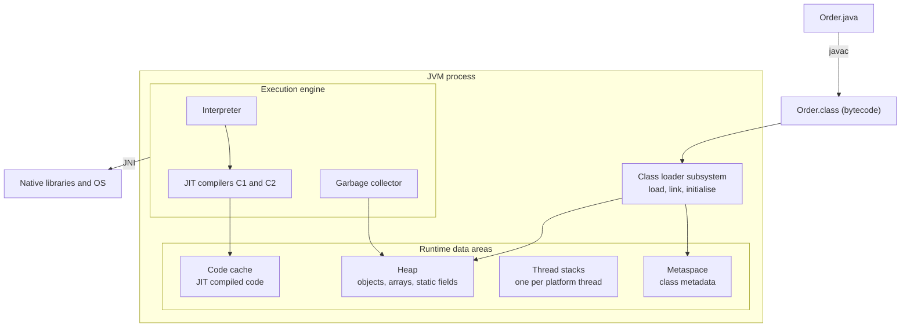
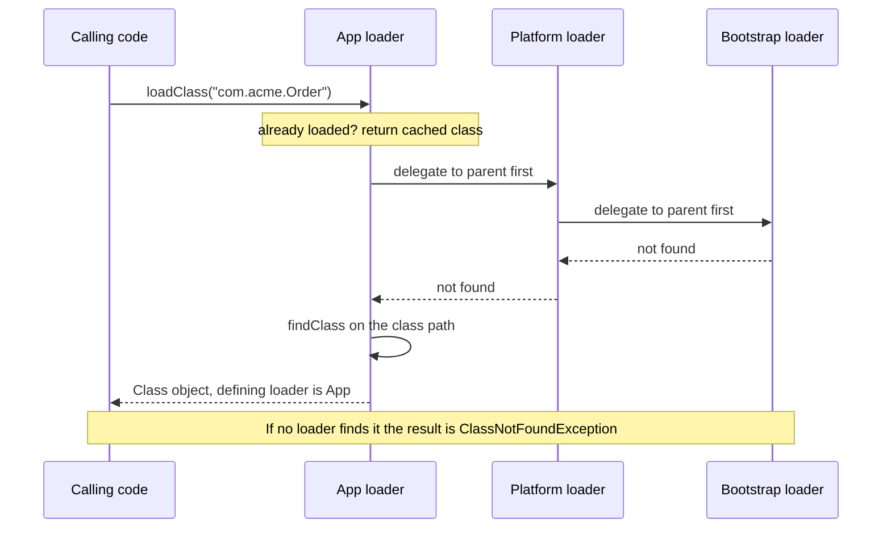
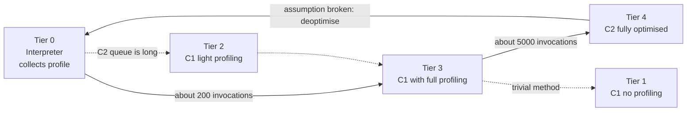
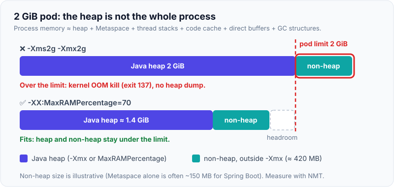

# JVM Architecture: Class Loading, JIT, Memory Areas

!!! abstract "Key takeaways"
    - The JVM has three big parts: the **class loader subsystem** (load → link → initialise), the **runtime data areas** (heap, Metaspace, stacks, code cache) and the **execution engine** (interpreter + JIT + GC).
    - Class loading is **lazy** and uses **parent-first delegation**: Application → Platform → Bootstrap. A class's identity is **fully qualified name + defining class loader**.
    - HotSpot uses **tiered compilation**: interpreter (tier 0) → C1 with profiling (tier 3) → C2 (tier 4). Optimisations are **speculative**, so the JVM can **deoptimise** back to the interpreter.
    - **Heap is only part of the process memory.** Metaspace, code cache, thread stacks, direct buffers and GC structures are native memory. In a container, `-Xmx` equal to the memory limit gets the pod **OOMKilled**.
    - Each `OutOfMemoryError` message names the area that ran out (`Java heap space`, `Metaspace`, `Direct buffer memory`, `unable to create native thread`). Read the message before you tune anything.

## Why it matters

Java source compiles to **bytecode**, not machine code. The JVM is the program that makes that bytecode run fast, safely and on any OS. Every production question about a Java service ends up here:

- "Why is the first request after a deploy slow?" → class loading and JIT warm-up.
- "Why did Kubernetes kill the pod when the heap was only 60% full?" → non-heap memory areas.
- "Why do we get `ClassCastException: X cannot be cast to X`?" → two class loaders.
- "Why does `NoSuchMethodError` appear only in production?" → class path order and delegation.

For a Senior/Lead role, interviewers do not want the textbook diagram recited. They want to see that you can connect the diagram to startup time, memory sizing and incidents.

## Core concepts

### The three subsystems


*Notice that only the heap is managed by the garbage collector in the usual sense. Metaspace, stacks and the code cache are native memory that sit outside `-Xmx`.*

### Class loading: load, link, initialise

A class goes through three phases (JVMS chapter 5):

1. **Loading.** A class loader finds the bytes (from a JAR, the module image, the network, or generated at runtime) and creates the internal class representation plus a `java.lang.Class` object.
2. **Linking**, in three steps:
    - **Verification:** the bytecode verifier checks that the code is type-safe (no stack overflow in the operand stack, no illegal casts, no jumps into the middle of an instruction). This is what makes untrusted bytecode safe to run.
    - **Preparation:** static fields get memory and their **default values** (`0`, `null`, `false`). No user code runs yet.
    - **Resolution:** symbolic references in the constant pool (`"com/acme/Order"`) become direct references. HotSpot does this **lazily**, at first use.
3. **Initialisation.** The JVM runs the class initialiser `<clinit>`: static field initialisers and `static {}` blocks, in **textual order**.

Initialisation is triggered only by **active use** (JLS 12.4.1):

- creating an instance (`new`)
- calling a static method
- reading or writing a static field that is **not a compile-time constant**
- reflection such as `Class.forName("X")`
- initialisation of a subclass (the superclass is initialised first)
- being the main class

Two details that interviewers like:

- A `static final` primitive or `String` with a constant value is **inlined by `javac`** into the caller. Reading it does not initialise the class.
- Initialisation is **thread-safe**. The JVM takes a per-class initialisation lock, so `<clinit>` runs exactly once. This is why the *initialisation-on-demand holder* idiom gives a lazy singleton with no explicit locking in your code. It is also why two classes that initialise each other from two threads can **deadlock** with no `synchronized` in sight (see [Locks and deadlock](03-locks-reentrantlock-readwritelock-stampedlock-deadlock-livel.md)).

### The class loader hierarchy and delegation

Since Java 9 (modules) the three built-in loaders are:

| Loader | Loads | Notes |
|---|---|---|
| **Bootstrap** | `java.base` and other core modules | Written in native code. `String.class.getClassLoader()` returns `null`. |
| **Platform** | Other Java SE and JDK modules (`java.sql`, `java.net.http`, `java.compiler` ...). Note that `java.xml`, `java.logging` and `java.desktop` are defined by Bootstrap. | Replaced the **Extension** loader of Java 8. |
| **Application** (system) | Your class path and module path | `ClassLoader.getSystemClassLoader()` |

Frameworks add their own loaders below these: Spring Boot's loader for nested JARs inside the fat JAR, Tomcat's per-web-app loader, OSGi bundles, plugin systems.


*Notice that the request goes all the way up before anyone tries to load. This is why you cannot replace `java.lang.String` with your own version: Bootstrap always answers first.*

Why delegation exists:

- **Security:** core classes cannot be spoofed.
- **Uniqueness:** a class is loaded once and shared, instead of once per loader.
- **Visibility:** children can see parent classes, parents cannot see child classes.

**Class identity = name + defining loader.** The same `Order.class` bytes loaded by two loaders are two unrelated types. Casting between them fails with the famous `ClassCastException: com.acme.Order cannot be cast to com.acme.Order`.

**Breaking delegation.** Servlet containers load web-app classes **child-first** so each application can ship its own library versions. JDBC and other SPI code in the bootstrap or platform loader needs to find implementations in your application, so it uses the **thread context class loader** (`Thread.currentThread().getContextClassLoader()`), which is how `ServiceLoader` works.

**`ClassNotFoundException` vs `NoClassDefFoundError`:**

- `ClassNotFoundException` is a checked exception: you asked for a class by name (`Class.forName`, `loadClass`) and no loader found it.
- `NoClassDefFoundError` is an error: the class existed at compile time, but at run time the JVM could not load or link it. Either the JAR is missing, or the class's static initialiser failed earlier (the first failure is `ExceptionInInitializerError`, every later use is `NoClassDefFoundError: Could not initialize class X`).

### Runtime data areas

| Area | Per thread? | Holds | Limit flag | Failure |
|---|---|---|---|---|
| **Heap** | Shared | Objects, arrays, `Class` mirrors with static fields, the string pool | `-Xmx`, `-XX:MaxRAMPercentage` | `OutOfMemoryError: Java heap space` |
| **Metaspace** | Shared | Class metadata: method bytecode, constant pools, vtables | `-XX:MaxMetaspaceSize` (unlimited by default) | `OutOfMemoryError: Metaspace` |
| **Code cache** | Shared | JIT-compiled machine code | `-XX:ReservedCodeCacheSize` (240 MB with tiered compilation) | Compiler switches off, "CodeCache is full" warning, service slows down |
| **JVM stack** | Per platform thread | Frames: local variables, operand stack, return address | `-Xss` (1 MB default on Linux x64) | `StackOverflowError`, or `OutOfMemoryError: unable to create native thread` |
| **PC register** | Per thread | Address of the current bytecode instruction | n/a | n/a |
| **Native method stack** | Per thread | Frames for JNI code (HotSpot uses the same stack) | `-Xss` | `StackOverflowError` |
| **Direct memory** | Shared | `ByteBuffer.allocateDirect`, Netty buffers | `-XX:MaxDirectMemorySize` (defaults to the max heap size) | `OutOfMemoryError: Direct buffer memory` |

Points worth knowing in detail:

- **Heap layout** depends on the collector. Generational collectors split it into a **young generation** (Eden + two survivor spaces) and an **old generation**. G1 and ZGC split it into regions. Details are on the [Garbage collection](09-garbage-collection.md) page.
- **TLABs** (thread-local allocation buffers): each thread owns a small slice of Eden, so `new` is usually a pointer bump with no lock.
- **Metaspace replaced PermGen in Java 8** (JEP 122). PermGen was a fixed-size part of the heap and caused `OutOfMemoryError: PermGen space`. Metaspace is native memory that grows on demand. Metadata is freed only when its **class loader** becomes unreachable. Static fields and interned strings moved to the heap in Java 7.
- **Compressed oops:** on a 64-bit JVM with a heap below about 32 GB, object references are stored in 32 bits and scaled by the 8-byte object alignment. Crossing 32 GB switches to 64-bit references, so a 33 GB heap can hold *fewer* objects than a 31 GB heap.
- **Object header:** 12 bytes with compressed class pointers (8-byte mark word + 4-byte class pointer). **Compact object headers** (JEP 519, a product feature in Java 25, enabled with `-XX:+UseCompactObjectHeaders`) reduce it to 8 bytes.
- **Virtual threads** do not have a fixed 1 MB stack. Their frames are stored as heap objects (stack chunks) while they are unmounted. See [Virtual threads](07-virtual-threads-and-structured-concurrency.md).

Where things live for one line of code:

```java
class OrderService {
    private static final Map<String, Order> CACHE = new HashMap<>(); // reference: in the Class mirror (heap); the map: heap

    BigDecimal total(String id) {          // bytecode of total(): Metaspace; compiled version: code cache
        Order o = CACHE.get(id);           // 'o' and 'id' references: this thread's stack frame; objects: heap
        int qty = o.quantity();            // primitive local: stack frame only
        return o.price().multiply(BigDecimal.valueOf(qty));
    }
}
```

{ loading=lazy }
*Notice that only the heap box is limited by `-Xmx`. The other three areas are native memory.*

### Execution engine: interpreter and JIT

The JVM starts by **interpreting** bytecode. Interpreting is slow, but starts instantly and collects **profiles**: how often a method runs, which branches are taken, which concrete types arrive at each call site. Code that proves to be **hot** is compiled to machine code. This is **just-in-time (JIT)** compilation.

Why not compile everything up front? Because at run time the JVM knows things a static compiler cannot: which classes are actually loaded, which branch is never taken, which interface has exactly one implementation today. It optimises for the real workload.

HotSpot has two compilers and uses them together (**tiered compilation**, default since Java 8):


*Notice that the arrow from tier 4 goes back to the interpreter. C2 code is built on assumptions, and when one breaks the JVM throws the code away and starts profiling again. The dotted paths are the less common ones: 0 → 2 → 3 → 4 when the C2 queue is long, and 3 → 1 when profiling shows the method is trivial (for example a getter).*

- **C1** (client compiler) compiles quickly with light optimisation. It gives a fast first speed-up.
- **C2** (server compiler) compiles slowly with aggressive optimisation. It gives peak throughput.
- The thresholds (`Tier3InvocationThreshold=200`, `Tier4InvocationThreshold=5000`) are defaults that the JVM adjusts based on compiler queue length. Loops also count through **back-edge counters**.
- **On-stack replacement (OSR):** a method stuck in a long loop is swapped to compiled code *while it is running*, without waiting for the next call.

The main optimisations:

| Optimisation | What it does |
|---|---|
| **Inlining** | Copies the callee body into the caller. The most important one, because it enables all the others. Small methods (up to 35 bytes of bytecode, `MaxInlineSize`) are always candidates; hot ones up to 325 bytes (`FreqInlineSize`). |
| **Devirtualisation** | Turns a virtual call into a direct call when class hierarchy analysis or the profile shows one receiver type (**monomorphic**), or two (**bimorphic**). Three or more is **megamorphic** and stays a vtable/itable call. |
| **Escape analysis** | If an object never leaves the method, C2 can replace it with its fields in registers (**scalar replacement**) and remove locks on it (**lock elision**). |
| **Loop optimisations** | Unrolling, range-check elimination, vectorisation (SIMD). |
| **Dead code and null-check elimination** | Removes branches the profile says never happen, guarded by a trap. |

**Deoptimisation.** If a speculation fails (a second implementation of an interface is loaded, a "never taken" branch is taken), the compiled code hits an **uncommon trap**. The JVM rebuilds interpreter frames from the compiled frame and continues in the interpreter. The result is always correct, only slower for a moment.

**Beyond JIT: fixing startup.**

- **CDS / AppCDS** (class data sharing): a memory-mapped archive of already parsed and verified classes. A default JDK archive ships since Java 12. Spring Boot 3.3+ can build an application archive.
- **AOT cache (Project Leyden):** Java 24 (JEP 483) stores classes in a loaded *and linked* state from a training run. Java 25 adds simpler flags (JEP 514) and stores method profiles so the JIT starts warm (JEP 515).
- **GraalVM Native Image:** compiles everything ahead of time under a closed-world assumption. Millisecond startup and low memory, but reflection needs configuration and there is no JIT at run time, so peak throughput is usually lower than C2 unless you use profile-guided optimisation.
- **CRaC / AWS Lambda SnapStart:** snapshot a warmed-up JVM and restore from it.

## In practice: code & configuration

### Sizing the JVM in a container

=== "❌ Common mistake"
    ```dockerfile
    # Pod memory limit: 2Gi
    ENTRYPOINT ["java", "-Xms2g", "-Xmx2g", "-jar", "app.jar"]
    # Heap alone = the whole limit. Metaspace (~150 MB for a Spring Boot app),
    # code cache, 200 thread stacks, Netty direct buffers and GC structures
    # push RSS above 2Gi. The kernel kills the process: exit code 137, no heap dump,
    # no OutOfMemoryError in the logs.
    ```

=== "✅ Correct approach"
    ```dockerfile
    # Pod memory limit: 2Gi. Leave about 25-30% for non-heap memory.
    ENTRYPOINT ["java", \
      "-XX:MaxRAMPercentage=70", \
      "-XX:MaxMetaspaceSize=256m", \
      "-XX:MaxDirectMemorySize=128m", \
      "-XX:ReservedCodeCacheSize=128m", \
      "-XX:+HeapDumpOnOutOfMemoryError", "-XX:HeapDumpPath=/dumps", \
      "-XX:+ExitOnOutOfMemoryError", \
      "-XX:NativeMemoryTracking=summary", \
      "-jar", "app.jar"]
    # MaxRAMPercentage: heap scales with the container limit (the default is only 25%)
    # MaxMetaspaceSize: a class loader leak fails fast with a clear error
    # ExitOnOutOfMemoryError: let Kubernetes restart a broken JVM instead of limping on
    # NativeMemoryTracking: lets you run jcmd VM.native_memory (small overhead)
    # The three caps are ceilings, not expected usage. If they were all reached at once,
    # heap (~1.43 GB) + 512 MB would leave almost nothing for thread stacks and GC
    # structures, so check real usage with NMT and lower the heap percentage if needed.
    ```

The JVM has been container-aware since Java 10 (backported to 8u191): it reads the cgroup memory and CPU limits instead of the host values. Without any flag the maximum heap is **25% of the container limit**, which wastes memory. Remember that the CPU limit also decides the number of JIT compiler threads, GC threads and the size of `ForkJoinPool.commonPool()`.

{ loading=lazy }
*The heap setting has to leave room for everything that is not heap, or the kernel kills the pod with no Java error.*

Verifying where memory goes:

```bash
jcmd <pid> VM.native_memory summary   # heap, Class (Metaspace), Thread, Code, GC, Internal
jcmd <pid> VM.metaspace               # per class loader usage
jcmd <pid> Compiler.codecache         # code cache usage and whether compilation is enabled
jcmd <pid> VM.classloader_stats       # how many classes each loader holds
java -Xlog:class+load:file=classes.log -jar app.jar   # which JAR each class came from
```

### Reading memory pools from inside the application

```java
@Component
class JvmMemoryReporter {

    private static final Logger log = LoggerFactory.getLogger(JvmMemoryReporter.class);

    @Scheduled(fixedRate = 60_000)
    void report() {
        // One MXBean per pool: "G1 Eden Space", "G1 Old Gen", "Metaspace",
        // "Compressed Class Space", "CodeHeap 'non-profiled nmethods'" ...
        for (MemoryPoolMXBean pool : ManagementFactory.getMemoryPoolMXBeans()) {
            MemoryUsage u = pool.getUsage();
            long max = u.getMax();                       // -1 means "no limit" (default for Metaspace)
            log.info("{} [{}] used={}MB max={}",
                    pool.getName(), pool.getType(),      // HEAP or NON_HEAP
                    u.getUsed() >> 20,
                    max < 0 ? "unbounded" : (max >> 20) + "MB");
        }
    }
}
```

In a Spring Boot service you get the same data from Micrometer for free: `jvm.memory.used{area="nonheap",id="Metaspace"}`, `jvm.classes.loaded`, `jvm.threads.live`. Alert on the **trend** of Metaspace and loaded class count, not only on heap.

### Class initialisation: the holder idiom

=== "❌ Common mistake"
    ```java
    class KeyStoreClient {
        private static KeyStoreClient instance;

        static KeyStoreClient get() {
            if (instance == null) {                 // two threads can both see null
                instance = new KeyStoreClient();    // and create two expensive clients
            }
            return instance;
        }
    }
    ```

=== "✅ Correct approach"
    ```java
    class KeyStoreClient {
        private KeyStoreClient() { /* expensive: opens an HSM session */ }

        private static class Holder {               // not initialised until first active use
            static final KeyStoreClient INSTANCE = new KeyStoreClient();
        }

        static KeyStoreClient get() {
            return Holder.INSTANCE;                 // JVM class-init lock guarantees exactly-once
        }
    }
    ```

The JVM guarantees that `Holder.<clinit>` runs once, under a lock, and that its result is safely published. No `volatile`, no `synchronized`. (In a Spring application a singleton bean is the normal answer; the idiom still matters for library code and as an interview question.)

### A class loader leak

```java
// Plugin or hot-reload code: each reload creates a new loader
URLClassLoader loader = new URLClassLoader(pluginJars, getClass().getClassLoader());
Class<?> type = loader.loadClass("com.acme.plugin.RuleEngine");
Object engine = type.getDeclaredConstructor().newInstance();

// LEAK: a long-lived structure owned by the parent keeps one object of a plugin class.
// object -> its Class -> its ClassLoader -> every class and static field that loader defined.
GLOBAL_REGISTRY.put("rules", engine);
```

One forgotten reference pins the whole loader, so Metaspace grows on every reload. Typical culprits: `ThreadLocal` values on pooled threads, JDBC drivers registered in `DriverManager`, shutdown hooks, static caches keyed by `Class`. The fix is to remove those references on unload and then `close()` the loader.

## Real-world usage

- **Spring Boot fat JARs.** `java -jar app.jar` starts Spring Boot's launcher, which creates a class loader that reads nested JARs under `BOOT-INF/lib`. Spring Boot's documentation recommends extracting the JAR and using **CDS** to cut startup time, and Spring Boot 4 / Spring Framework 7 work with the Java 25 **AOT cache**.
- **Kubernetes OOMKilled (exit 137).** The most common JVM incident in containers is not a Java `OutOfMemoryError`. It is the kernel killing the process because heap + Metaspace + stacks + direct buffers exceeded the pod limit. The JVM gets no chance to write a heap dump.
- **Warm-up after deploys.** Latency-sensitive services at large companies send synthetic traffic before a new instance joins the load balancer, because the first few thousand requests run interpreted or C1-compiled. Readiness probes that pass too early cause p99 spikes on every rollout.
- **AWS Lambda.** Short-lived functions rarely reach C2. AWS documents stopping tiered compilation at C1 (`-XX:TieredStopAtLevel=1`) to reduce cold starts, and offers **SnapStart**, which restores a snapshot of an initialised JVM.
- **Log4Shell (CVE-2021-44228).** The exploit worked through a JNDI lookup that could make the JVM **load a class from an attacker's server**. Newer JDKs (from 8u191) had already disabled remote codebase loading by default, which blunted the simplest form of the attack. It is the best-known example of why class loading is a security boundary.
- **Healthcare and banking.** Regulated workloads care about predictable latency (warm-up, deoptimisation storms at market open or at enrolment peaks) and about auditability of what code runs. Java agents (APM tools) instrument classes at load time. Since Java 21 (JEP 451) the JVM prints a warning when an agent is attached dynamically to a running JVM, as a step towards disallowing it by default.

## Trade-offs & production gotchas

| Option | Pros | Cons | Use when |
|---|---|---|---|
| **Tiered JIT (default)** | Good startup and best peak throughput | Warm-up period, code cache and compiler CPU use | Long-running services |
| **C1 only** (`-XX:TieredStopAtLevel=1`) | Faster startup, less memory and CPU for compilation | Lower peak throughput | Short-lived jobs, Lambda functions, CLIs |
| **CDS / AOT cache** | Faster startup, same JIT peak, no code restrictions | Needs a training run in the build; archive must match JDK and class path | Containers that scale out often |
| **GraalVM Native Image** | Millisecond startup, low memory footprint | Closed world: reflection, proxies and resources need hints; long builds; different GC options | Serverless, scale-to-zero, CLIs |
| **CRaC / SnapStart** | Fast start with a fully warm JIT | Must handle open sockets, secrets and randomness in the snapshot | Lambda, platforms that support checkpointing |
| **`-Xmx` fixed** | Explicit and predictable | Must be changed whenever the pod size changes | VMs, bare metal |
| **`MaxRAMPercentage`** | Follows the container limit | Still needs headroom for non-heap | Kubernetes, ECS |

!!! warning "Gotcha: heap is not the process"
    Total memory ≈ heap + Metaspace + code cache + (threads × stack size) + direct buffers + GC structures + native libraries. Size the heap at roughly 60–75% of the container limit and check with Native Memory Tracking.

!!! warning "Gotcha: Metaspace is unbounded by default"
    A class loader leak or runaway class generation (dynamic proxies, Groovy scripts, a new CGLIB class per request) grows native memory until the host or container kills the process. Set `-XX:MaxMetaspaceSize` so that it fails with a clear `OutOfMemoryError: Metaspace`.

!!! warning "Gotcha: a full code cache does not crash, it slows down"
    When the code cache fills, the JVM prints `CodeCache is full. Compiler has been disabled` and new hot code stays interpreted. The service keeps running at a fraction of its speed. Monitor it.

!!! warning "Gotcha: benchmarks without warm-up measure the interpreter"
    A `System.nanoTime()` loop in `main` measures interpretation, OSR compilation and dead-code elimination, not your code. Use **JMH**.

!!! warning "Gotcha: the 32 GB heap cliff"
    Above about 32 GB the JVM loses compressed oops and every reference doubles to 8 bytes. Either stay at 31 GB or jump well past it.

!!! warning "Gotcha: `Could not initialize class X`"
    This is the *second* failure. Search the logs for the first `ExceptionInInitializerError` to find the real cause.

## How this connects to my experience

- **Where I used it:** *OptumRx Meteor (Publicis Sapient)*: "Designed and developed microservices using Java, Spring Boot, Kafka, MongoDB, Redis, and GraphQL" and "Established engineering standards around testing, CI/CD, code quality, and deployment practices". Those services run as JVMs in containers *[confirm: Kubernetes/container deployment for Meteor]*, so heap sizing, Metaspace and warm-up are part of owning the GraphQL Consumer Service end-to-end. *Deloitte ConvergeHealth*: "Built cloud-native microservices on AWS using Lambda, EC2, ECS, EKS", where Java cold start is a direct JVM-architecture topic.
- **Talking points:**
    - "For the GraphQL Consumer Service I set the heap as a percentage of the pod limit and left headroom for Metaspace, thread stacks and direct buffers used by the HTTP and Redis clients." *[confirm: actual flags and pod limits]*
    - "After each rollout the first requests were slower because of class loading and JIT warm-up. We handled it with readiness probe timing / a warm-up call before taking traffic." *[confirm: whether a warm-up step existed and the measured p99 difference]*
    - "On Lambda and ECS at Deloitte, cold start was dominated by class loading and Spring context start, so I looked at memory size, tiered compilation level and SnapStart." *[confirm: Java was the Lambda runtime and which options were actually applied]*
    - "As tech lead I included JVM flags and container memory settings in our deployment standards, so every service ships with heap-dump-on-OOM and consistent sizing." *[confirm]*
    - Honest bridge if pushed on internals: "I have not tuned C2 flags in production. I know how tiered compilation and deoptimisation work, and my practical experience is on the sizing and diagnosis side."
- **Likely follow-up chain:**
    1. *"Your pod has a 2 GB limit. How do you size the JVM?"* → `MaxRAMPercentage` around 70, cap Metaspace and direct memory, verify with NMT.
    2. *"The pod is OOMKilled but there is no heap dump. Why?"* → the kernel killed it; it is native memory, not heap. Compare RSS with NMT categories; check thread count, direct buffers, Metaspace.
    3. *"Metaspace keeps growing. What now?"* → `jcmd VM.classloader_stats`, look for many loaders or generated classes; heap dump and find the GC root that pins the loader. Continue on the [Diagnosing production issues](10-diagnosing-production-issues-thread-dumps-heap-dumps-memory.md) page.
    4. *"How would you reduce startup time for autoscaling?"* → CDS or AOT cache first (no code change), then lazy init review, then native image or CRaC if the numbers justify the cost.

## Interview questions

### Fundamentals

??? question "Q1. What are the main components of the JVM?"
    **Answer:** Three subsystems. The **class loader subsystem** finds, verifies and initialises classes. The **runtime data areas** hold the program's state: the heap (objects), Metaspace (class metadata), one stack per thread (frames with locals and operand stack), a PC register per thread, and the code cache (compiled code). The **execution engine** runs the bytecode: an interpreter, the JIT compilers (C1, C2) and the garbage collector. JNI connects it to native libraries.

    **Interviewer listens for:** a clear separation of shared areas (heap, Metaspace, code cache) and per-thread areas (stack, PC), and that the JIT and GC are part of the engine.

    **Common wrong answer:** "The JVM interprets bytecode line by line", with no mention of JIT. Or mixing up JDK, JRE and JVM.

??? question "Q2. Explain the phases of class loading."
    **Answer:** **Loading** (find the bytes, create the `Class` object), **linking** (verify the bytecode, prepare static fields with default values, resolve symbolic references, usually lazily), and **initialisation** (run static initialisers and static blocks in textual order, once, under a per-class lock). Loading is lazy: a class is loaded when first referenced and initialised on first active use.

    **Interviewer listens for:** the difference between *preparation* (default values) and *initialisation* (your values), and that initialisation is thread-safe.

    **Common wrong answer:** "All classes on the class path are loaded at startup."

??? question "Q3. What is the parent delegation model and why does it exist?"
    **Answer:** When a loader is asked for a class it first asks its parent, and only tries itself if the parent cannot find it. The chain is Application → Platform → Bootstrap. It guarantees that core classes always come from the JDK (nobody can replace `java.lang.String`), that a class is defined once and shared, and that visibility flows one way: children see parents' classes.

    **Interviewer listens for:** Platform loader replacing the Extension loader in Java 9; that the bootstrap loader is represented as `null`; knowing where delegation is deliberately broken (Tomcat web apps, thread context class loader for SPI).

    **Common wrong answer:** "The child tries first and falls back to the parent." That is child-first, the exception used by servlet containers.

??? question "Q4. What is stored on the heap and what is stored on the stack?"
    **Answer:** The **heap** stores all objects and arrays, including `Class` mirror objects that hold static fields, and the string pool. Each **thread stack** stores frames: one per method call, containing local variables (primitives and *references*), the operand stack and the return address. So for `Order o = new Order()`, the `Order` object is on the heap and the reference `o` is in the frame. The JIT may remove a heap allocation entirely through scalar replacement when the object does not escape.

    **Interviewer listens for:** "references on the stack, objects on the heap", static fields on the heap since Java 7, and class *metadata* in Metaspace.

    **Common wrong answer:** "Static variables are stored in Metaspace / PermGen" or "objects created inside a method are on the stack".

??? question "Q5. What is the difference between PermGen and Metaspace?"
    **Answer:** PermGen (up to Java 7) was a fixed-size region managed with the heap that held class metadata, and earlier also interned strings and statics. It had to be sized with `-XX:MaxPermSize` and often failed with `OutOfMemoryError: PermGen space`. Java 8 (JEP 122) removed it. Class metadata now lives in **Metaspace**, which is native memory, grows automatically and is unlimited unless you set `-XX:MaxMetaspaceSize`. Metadata is released when its class loader is collected.

    **Interviewer listens for:** native memory, unbounded default, class loader lifetime, and why you still set a cap in containers.

    **Common wrong answer:** "Metaspace is part of the heap" or "Metaspace can never run out".

### Intermediate

??? question "Q6. Predict the output."
    ```java
    class Config {
        static final int MAX = 10;
        static final Integer BOXED = 20;
        static { System.out.println("Config initialised"); }
    }

    public class Main {
        public static void main(String[] args) {
            System.out.println(Config.MAX);
            System.out.println(Config.BOXED);
        }
    }
    ```

    **Answer:**
    ```
    10
    Config initialised
    20
    ```
    `MAX` is a compile-time constant, so `javac` copies the value `10` into `Main`. `Config` is not even loaded for that line. `BOXED` is not a constant expression (it needs `Integer.valueOf` at run time), so reading it is an active use and triggers initialisation.

    **Interviewer listens for:** the term *compile-time constant* and the side effect: if you change `MAX` and recompile only `Config`, `Main` still prints the old value.

    **Common wrong answer:** "Config initialised" printed first.

??? question "Q7. Predict the output."
    ```java
    class Counter {
        private static final Counter INSTANCE = new Counter();
        private static int count = 5;

        private Counter() { count++; }

        static int count() { return count; }
    }
    // System.out.println(Counter.count());
    ```

    **Answer:** `5`. Preparation sets `count` to `0`. Initialisation runs in textual order: first `INSTANCE = new Counter()`, whose constructor makes `count` `1`. Then the initialiser `count = 5` overwrites it. Swap the two lines and the answer is `6`.

    **Interviewer listens for:** preparation vs initialisation and textual order.

    **Common wrong answer:** `6`.

??? question "Q8. `ClassNotFoundException` vs `NoClassDefFoundError`?"
    **Answer:** `ClassNotFoundException` is a checked exception thrown when code asks for a class **by name** at run time (`Class.forName`, `ClassLoader.loadClass`) and it is not found. `NoClassDefFoundError` is an error thrown when the JVM needs a class that the code was **compiled against** and cannot load or link it: a JAR missing at run time, a dependency with the wrong scope, or a static initialiser that failed earlier. In the last case the message is `Could not initialize class X` and the root cause is an earlier `ExceptionInInitializerError`.

    **Interviewer listens for:** the static-initialiser case and how to debug it (find the first error; use `-Xlog:class+load` or `mvn dependency:tree` for version conflicts).

    **Common wrong answer:** "They are the same thing, one is checked and one is unchecked."

??? question "Q9. How does JIT compilation work in HotSpot?"
    **Answer:** Code starts in the interpreter, which counts invocations and loop back-edges and records type and branch profiles. With **tiered compilation**, a method that becomes warm is compiled by **C1** with profiling (tier 3), and when it is hot enough **C2** recompiles it using the profile (tier 4) with inlining, devirtualisation, escape analysis and loop optimisations. Compiled code goes into the code cache. Long loops are switched over mid-execution by **OSR**. Because C2 speculates, a broken assumption causes **deoptimisation** back to the interpreter.

    **Interviewer listens for:** *why* JIT can beat static compilation (runtime profile), the C1/C2 split, and deoptimisation.

    **Common wrong answer:** "The JIT compiles the whole program at startup" or "a method is compiled after 10,000 calls" (the old non-tiered C2 threshold).

??? question "Q10. Which `OutOfMemoryError` types have you seen and what does each mean?"
    **Answer:**

    - `Java heap space`: the heap is full after GC. A leak or an undersized heap.
    - `GC overhead limit exceeded`: almost all time is spent in GC with almost nothing reclaimed (parallel collector).
    - `Metaspace` / `Compressed class space`: too many classes or a class loader leak.
    - `Direct buffer memory`: off-heap NIO buffers reached `MaxDirectMemorySize`.
    - `unable to create native thread`: the OS refused a new thread (process/thread limits or no native memory for the stack).
    - `StackOverflowError` is different: one thread's stack is exhausted, usually by deep recursion.
    - And the non-Java one: the container OOM kill, with no Java error at all.

    **Interviewer listens for:** mapping each message to a memory area and a first diagnostic step.

    **Common wrong answer:** "Increase `-Xmx`" for all of them. A bigger heap makes native-memory problems *worse* in a fixed-size container.

### Senior

??? question "Q11. Can the same class be loaded twice in one JVM? What are the consequences?"
    **Answer:** Yes. A run-time class is identified by its name **and its defining class loader**. Two loaders that each define `com.acme.Order` create two distinct types with separate static fields. Passing an instance from one side to the other fails with `ClassCastException: Order cannot be cast to Order`, or `LinkageError` for loader constraint violations. This appears with web-app loaders, plugin systems, OSGi, Spring Boot DevTools' restart loader, and when a library is present both in a shared container directory and in the application. The fix is to make one loader own the shared API type (put it in the common parent) and let children only implement it.

    **Interviewer listens for:** name + loader identity, separate statics (so "singletons" are per loader), and a real example.

    **Common wrong answer:** "No, a class is loaded only once per JVM."

??? question "Q12. What is deoptimisation, and what do monomorphic, bimorphic and megamorphic call sites mean?"
    **Answer:** At a virtual call site the JIT records the receiver types seen. One type (**monomorphic**): it inlines the target behind a cheap type check. Two (**bimorphic**): it inlines both behind a two-way check. More (**megamorphic**): it falls back to a vtable or interface-table dispatch and cannot inline, which blocks follow-on optimisations. The inlined code is a bet. If a new type appears, the guard fails, an **uncommon trap** fires, the compiled frame is converted to interpreter frames, and the method is later recompiled with the new profile. Class loading can also invalidate code that relied on "this class has no subclasses".

    **Interviewer listens for:** speculation plus a safety net; practical effect such as a latency blip when a rarely used code path or a new implementation first runs in production.

    **Common wrong answer:** "Once code is compiled it stays compiled", or treating deoptimisation as a JVM bug.

??? question "Q13. What contributes to the memory of a Java process beyond `-Xmx`?"
    **Answer:** Metaspace and compressed class space; the code cache; thread stacks (thread count × `-Xss`, reserved virtually and committed as used); direct and mapped byte buffers; GC data structures (card tables, remembered sets, marking bitmaps, which for G1 can be several percent of the heap); the symbol and string tables; JIT compiler arenas; and memory allocated by native libraries through `malloc`, which the JVM does not track. **Native Memory Tracking** (`-XX:NativeMemoryTracking=summary`, `jcmd VM.native_memory`) breaks down the JVM's own categories. If RSS is much larger than the NMT total, suspect native libraries or allocator fragmentation.

    **Interviewer listens for:** a concrete list, NMT, and a sizing rule for containers.

    **Common wrong answer:** "RSS should equal the heap size."

??? question "Q14. How can you reduce JVM startup and warm-up time? Compare the options."
    **Answer:** In order of effort:

    1. **CDS / AppCDS:** archive parsed classes; no code changes; Spring Boot supports it directly.
    2. **AOT cache (JEP 483, Java 24; improved in Java 25):** a training run records loaded and linked classes, and from Java 25 also method profiles, so the JIT starts warm. Still a normal JVM with full dynamic behaviour.
    3. **Application-level:** lazy bean initialisation where safe, fewer auto-configurations, warm-up requests before readiness.
    4. **CRaC / Lambda SnapStart:** restore a checkpoint of a warm JVM. Needs care with connections, secrets and random seeds captured in the snapshot.
    5. **GraalVM Native Image:** fastest start and lowest footprint, but closed world, longer builds, reflection hints and a different performance profile.

    Pick by measuring. For a long-running service behind a load balancer, CDS plus warm-up traffic is usually enough. For scale-to-zero, native image or snapshotting pays off.

    **Interviewer listens for:** knowing the difference between *startup* (class loading, framework init) and *warm-up* (JIT), and the trade-offs rather than "just use GraalVM".

    **Common wrong answer:** "Increase the heap" or "add more CPU" as the only ideas.

??? question "Q15. How does a class loader leak happen and how do you find it?"
    **Answer:** A class can be unloaded only when its **class loader** is unreachable. Every object references its class, and every class references its loader, so a single live object of a class defined by that loader pins the loader and all its classes and statics. Leaks come from references held by something longer-lived: `ThreadLocal` values on pooled threads, threads started by the application, JDBC drivers in `DriverManager`, JMX beans, shutdown hooks, caches keyed by `Class`. Symptoms: Metaspace and loaded-class count grow after each redeploy or reload and never drop. Diagnosis: `jcmd VM.classloader_stats` to see duplicate loaders, then a heap dump and "path to GC roots" for the stale loader instance.

    **Interviewer listens for:** the reference chain object → class → loader, and a method to find the GC root.

    **Common wrong answer:** "Classes are never unloaded" or "call `System.gc()`".

### Scenario-based

??? question "Q16. A Spring Boot pod with a 1 GB limit and `-Xmx1g` is restarted by Kubernetes with exit code 137. There is no `OutOfMemoryError` in the logs. What happened and how do you fix it?"
    **Answer:** Exit 137 is SIGKILL from the kernel's OOM killer: the **process** exceeded the cgroup limit. The JVM did not run out of heap, so there is no Java error and no heap dump. With the heap allowed to use the full 1 GB, there is no room for Metaspace, code cache, thread stacks and direct buffers.

    Steps: confirm with `kubectl describe pod` (`OOMKilled`). Enable NMT and compare `jcmd VM.native_memory summary` with the container's RSS. Fix by sizing the heap to about 60–70% (`-XX:MaxRAMPercentage`), capping Metaspace and direct memory, checking thread count, or raising the limit if the service really needs it. Add `-XX:+HeapDumpOnOutOfMemoryError` so that a genuine heap problem leaves evidence.

    **Interviewer listens for:** telling a kernel OOM kill from a Java OOM, a method rather than a guess, and headroom reasoning.

    **Common wrong answer:** "There is a memory leak, increase the heap."

??? question "Q17. After every deployment, p99 latency is five times higher for the first few minutes, then recovers. Why, and what would you do?"
    **Answer:** New instances start cold: classes are loaded and verified on first use, connection pools and caches are empty, and hot paths run in the interpreter or C1 until C2 compiles them. Options: delay readiness until a **warm-up** routine has exercised the main endpoints; shift traffic gradually (slow start on the load balancer, canary rollout); use CDS or the Java 25 AOT cache to remove class loading cost and start with profiles; make sure the pod has enough CPU during startup, because JIT compiler threads compete with request threads and a tight CPU limit throttles both.

    **Interviewer listens for:** separating class loading, JIT and cold caches; a rollout-level fix as well as a JVM-level one; awareness of CPU throttling.

    **Common wrong answer:** "It's garbage collection" without evidence.

??? question "Q18. Metaspace usage of a long-running service grows steadily until `OutOfMemoryError: Metaspace`. No redeploys happen. What could cause it?"
    **Answer:** Classes are being **generated at run time** and not unloaded. Common causes: creating a new proxy or enhanced class per request instead of reusing one (CGLIB, Byte Buddy, a new `ObjectMapper` or `JAXBContext` per call that generates accessors), compiling scripts or expressions per request (Groovy, some rule engines), or creating new class loaders repeatedly. Confirm with the loaded-class count metric (it grows without bound), `jcmd VM.classloader_stats` and `-Xlog:class+load` to see the names of the classes being created. Fix by caching the generated artefact (make the mapper or context a singleton) and set `MaxMetaspaceSize` as a safety net.

    **Interviewer listens for:** dynamic class generation as a cause, not only redeploy leaks, and the caching fix.

    **Common wrong answer:** "Raise `MaxMetaspaceSize`" as the whole answer.

## Cheat sheet

| Concept | Remember |
|---|---|
| Class loading phases | Load → Link (verify, prepare, resolve) → Initialise |
| Loaders | Bootstrap → Platform (was Extension before Java 9) → Application |
| Delegation | Parent first. Tomcat web apps are child-first. SPI uses the thread context loader |
| Class identity | Fully qualified name + defining loader |
| Initialisation | Lazy, on first active use, once, under a class-init lock, in textual order |
| Compile-time constant | `static final` primitive/String constant is inlined; no initialisation |
| `ClassNotFoundException` | Asked by name, not found |
| `NoClassDefFoundError` | Present at compile time, cannot be linked at run time, or `<clinit>` failed |
| Heap | Objects, arrays, statics, string pool. `-Xmx`, `-XX:MaxRAMPercentage` (default 25%) |
| Metaspace | Class metadata, native, unbounded by default. Replaced PermGen in Java 8 |
| Stack | One per platform thread, `-Xss`, 1 MB default on Linux x64 |
| Code cache | JIT output, 240 MB default. Full = compiler disabled |
| Direct memory | `MaxDirectMemorySize`, defaults to max heap |
| Tiers | 0 interpreter, 1–3 C1, 4 C2. About 200 calls → C1, about 5,000 → C2 |
| Key optimisations | Inlining, devirtualisation, escape analysis, OSR |
| Deoptimisation | Speculation failed → back to interpreter → recompile |
| Compressed oops | 32-bit references up to about 32 GB heap |
| Startup tools | CDS, AOT cache (Java 24/25), CRaC, GraalVM Native Image |
| Diagnosis | `jcmd VM.native_memory`, `VM.metaspace`, `VM.classloader_stats`, `Compiler.codecache` |
| Exit code 137 | Kernel OOM kill: process memory above the container limit, not a Java OOM |

## Sources

1. [JVM Specification (Java SE 21), Chapter 5: Loading, Linking, and Initializing](https://docs.oracle.com/javase/specs/jvms/se21/html/jvms-5.html): class loading phases, delegation, class identity, linkage errors.
2. [JVM Specification (Java SE 21), Chapter 2.5: Run-Time Data Areas](https://docs.oracle.com/javase/specs/jvms/se21/html/jvms-2.html#jvms-2.5): heap, method area, stacks, PC register and the errors each can raise.
3. [Java Language Specification (Java SE 21), 12.4: Initialization of Classes and Interfaces](https://docs.oracle.com/javase/specs/jls/se21/html/jls-12.html#jls-12.4): when initialisation happens, constant variables, the initialisation lock.
4. [The `java` command (JDK 21)](https://docs.oracle.com/en/java/javase/21/docs/specs/man/java.html): `-Xss`, `MaxRAMPercentage`, `MaxMetaspaceSize`, `ReservedCodeCacheSize`, `TieredStopAtLevel`, CDS options.
5. [JEP 122: Remove the Permanent Generation](https://openjdk.org/jeps/122): PermGen to Metaspace.
6. [JEP 483: Ahead-of-Time Class Loading & Linking](https://openjdk.org/jeps/483): the AOT cache in Java 24, with follow-ups [JEP 514](https://openjdk.org/jeps/514) and [JEP 515](https://openjdk.org/jeps/515) in Java 25.
7. [JEP 519: Compact Object Headers](https://openjdk.org/jeps/519): 8-byte object headers as a product feature in Java 25.
8. [Native Memory Tracking (JDK 21 HotSpot guide)](https://docs.oracle.com/en/java/javase/21/vm/native-memory-tracking.html): how to break down non-heap memory with `jcmd`.
9. [Spring Boot reference: Class Data Sharing](https://docs.spring.io/spring-boot/reference/packaging/class-data-sharing.html): CDS and AOT cache with Spring Boot executables.
