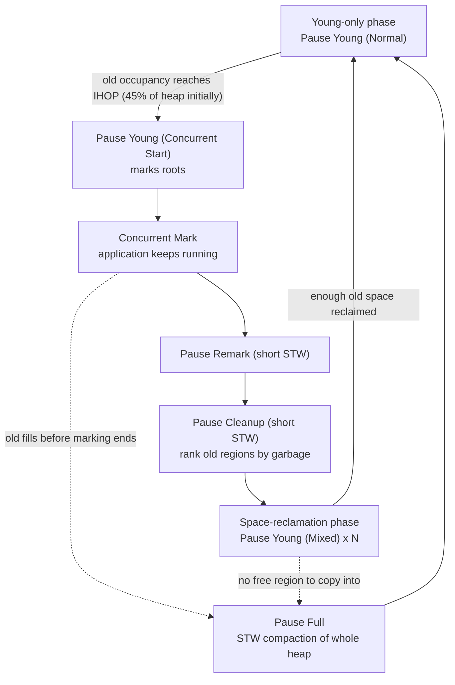
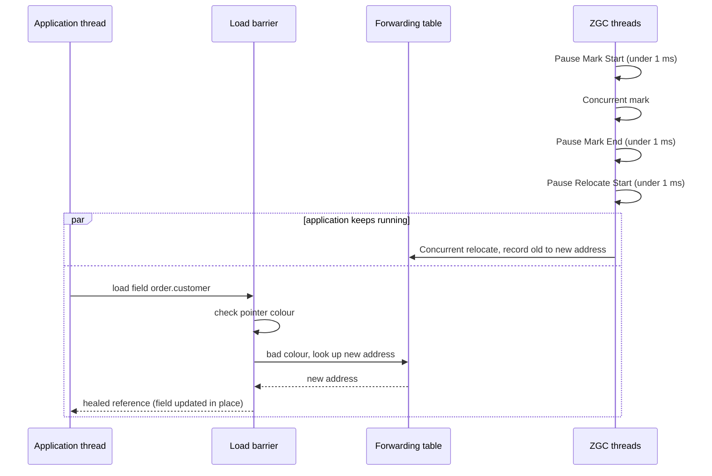
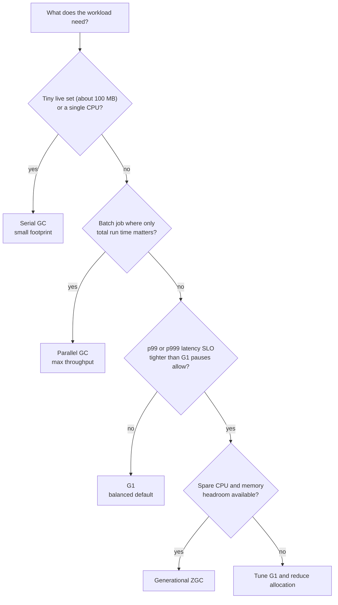

# Garbage Collection (G1, ZGC, Tuning, GC Logs)

!!! abstract "TL;DR"
    - GC finds objects **reachable from GC roots** (thread stacks, statics, JNI handles) and reclaims everything else. Cost is driven by **live data and allocation rate**, not by the amount of garbage.
    - **G1** (default since Java 9) splits the heap into equal **regions**, collects young regions in short stop-the-world (STW) pauses, marks the old generation **concurrently**, then cleans the most garbage-filled old regions in **mixed** collections. You tune it with one goal: `-XX:MaxGCPauseMillis` (default 200 ms).
    - **ZGC** does marking **and** relocation concurrently using **coloured pointers and load barriers**. Pauses are sub-millisecond and do not grow with heap size. It is **generational** since Java 21 (JEP 439), generational by default in Java 23, and generational-only from Java 24.
    - Every collector trades between **throughput, pause time and memory footprint**. You can optimise two; you pay with the third.
    - Tuning order: **measure first** (`-Xlog:gc*`), size the heap correctly (in containers use `-XX:MaxRAMPercentage`), set a pause goal, and only then touch anything else. Most "GC problems" are allocation or memory-leak problems in the application.

## Why it matters

Manual memory management gives two classic bugs: use-after-free and leaks. GC removes the first completely and makes the second much rarer. The price is that the JVM must sometimes stop your application threads, and those pauses appear directly in your p99 latency.

For a senior or lead engineer this topic shows up in three ways:

- **Latency SLOs.** A 300 ms GC pause on a service with a 500 ms timeout causes retries, which cause more load, which causes more GC.
- **Kubernetes sizing.** Heap size, container memory limit and CPU limit interact with GC. Wrong settings give `OOMKilled` pods or a silently selected Serial collector.
- **Incident diagnosis.** "CPU is high and the service is slow" is very often a GC death spiral caused by a leak. Reading a GC log quickly is a core production skill (see page 10 for heap dumps and leak hunting).

Interviewers use GC to check whether you understand the runtime you have been shipping on for nine years, or only the framework on top of it.

## Core concepts

### Reachability, not reference counting

HotSpot uses **tracing** collection. It starts from **GC roots** (local variables on thread stacks, static fields, JNI references, class loaders, monitors in use) and follows references. Anything it reaches is live. Anything it does not reach is garbage, including cycles (`A → B → A`), which reference counting cannot free.

An important consequence: **a tracing collector's work is proportional to the live set**. A young collection of a 2 GB Eden that contains 20 MB of live objects only copies 20 MB.

### The generational hypothesis

Most objects die young (request DTOs, strings, lambdas, iterators). A few live for a long time (caches, connection pools, Spring singletons). So the heap is split:

- **Young generation**: **Eden** (new allocations) plus **Survivor** spaces. Collected often and cheaply by copying the few survivors out.
- **Old generation**: objects that survived enough young collections (their **age** reached the tenuring threshold, at most 15) are **promoted** here. Collected rarely.

Allocation itself is very fast. Each thread owns a **TLAB** (thread-local allocation buffer) inside Eden and allocates by bumping a pointer, with no lock.

To collect young without scanning old, the JVM must know which old objects point into young. A **write barrier** (a few instructions the JIT adds to every reference store) records these in a **card table** / **remembered set**.

### Stop-the-world, safepoints and concurrency

- **Stop-the-world (STW)**: all application ("mutator") threads are paused.
- **Safepoint**: a point where a thread's state is known to the JVM. A pause can start only when every thread has reached one. The wait is **time-to-safepoint** and it is part of the pause your users feel.
- **Parallel**: several GC threads work during a pause.
- **Concurrent**: GC threads work while the application runs. This needs barriers so that GC and application agree on the object graph.

### The collectors in HotSpot

| Collector | Flag | Young | Old | Pause behaviour |
|---|---|---|---|---|
| Serial | `-XX:+UseSerialGC` | STW, 1 thread | STW, 1 thread | Grows with heap; fine for tiny heaps |
| Parallel | `-XX:+UseParallelGC` | STW, many threads | STW, many threads | Best throughput, long old pauses |
| **G1** | `-XX:+UseG1GC` (default) | STW, parallel | Concurrent mark + STW mixed evacuation | Targets a pause goal (200 ms default) |
| **ZGC** | `-XX:+UseZGC` | Concurrent | Concurrent | Sub-millisecond, independent of heap size |
| Shenandoah | `-XX:+UseShenandoahGC` | Concurrent | Concurrent | Low pause; generational mode is a product feature in Java 25 (JEP 521) |

CMS was removed in Java 14 (JEP 363). If someone mentions tuning CMS, they are talking about Java 8.

### G1: regions and a pause-time goal

G1 ("Garbage First") divides the heap into about 2,048 equal **regions** of 1 to 32 MB (a power of two, chosen from the heap size or set with `-XX:G1HeapRegionSize`; since JDK 18 the flag accepts up to 512 MB, but ergonomics still stop at 32 MB). Each region plays a role at any moment: Eden, Survivor, Old, **Humongous** or free. Generations are logical sets of regions, not fixed address ranges, so G1 can resize the young generation after every collection.

The G1 cycle:


*Notice that the Full GC is not a normal step of the cycle. It is the fallback when concurrent work loses the race against allocation, and avoiding it is the main aim of G1 tuning.*

Key ideas:

- **Evacuation.** Every G1 young or mixed pause copies live objects out of a chosen **collection set** of regions into free regions. Copying compacts as it goes, so G1 does not fragment the way CMS did.
- **Pause prediction.** G1 keeps statistics on how long each region costs to evacuate. It then picks as many regions as fit in `MaxGCPauseMillis`. The goal is **soft**: G1 tries, it does not promise.
- **Garbage first.** After marking, G1 knows the live ratio of each old region. Mixed collections take the regions with the most garbage first, because they give the most space for the least copying.
- **SATB marking.** Concurrent marking uses *snapshot-at-the-beginning*: a pre-write barrier records overwritten references, so everything live at the start of marking is treated as live. Objects that die during marking become "floating garbage" and are collected in the next cycle.
- **Remembered sets.** Each region tracks which other regions point into it, so a region can be evacuated without scanning the whole heap. This costs extra native memory, often several percent of the heap.
- **Humongous objects.** An object of **half a region or more** is allocated directly in contiguous old regions. These are expensive: they waste the tail of the last region, can trigger marking early, and need contiguous free space.
- **IHOP.** Marking starts when old-generation occupancy crosses the *Initiating Heap Occupancy Percent*, expressed as a percentage of the **whole heap**. It starts at 45% and is then adjusted automatically (adaptive IHOP).

### ZGC: move objects while the application runs

G1 still stops the world to **copy** objects, and that copy time grows with the live data in the collection set. ZGC removes this by relocating objects concurrently. Two mechanisms make it safe:

- **Coloured pointers.** ZGC stores a few metadata bits inside each 64-bit reference. The bits say whether the reference is known to be good for the current GC phase (marked, remapped).
- **Load barrier.** Every time the application loads a reference from the heap, a small JIT-inserted check tests the colour. If the colour is bad, a slow path fixes it: it marks the object, or finds its new address through a **forwarding table**, and then **heals** the field so the next load is fast.


*Notice that the three pauses only handle roots and phase changes. All work that grows with heap size (marking and relocating) happens while the application thread keeps running, and the application helps by fixing stale references itself.*

Facts worth knowing about ZGC:

- Pause times are **sub-millisecond** and do not increase with heap, live-set or root-set size. Heaps from a few hundred MB up to 16 TB are supported.
- **Generational ZGC** (JEP 439, Java 21 with `-XX:+ZGenerational`) added young and old generations so that short-lived objects are reclaimed cheaply. It became the default mode in Java 23 (JEP 474), and the non-generational mode was removed in Java 24 (JEP 490). On Java 25 `-XX:+UseZGC` simply means generational ZGC.
- ZGC is designed to need almost no tuning. The main inputs are `-Xmx` and optionally `-XX:SoftMaxHeapSize`.
- The cost: barriers on every reference load, concurrent GC threads that compete for CPU, and **no compressed oops** (references are always 64 bits), so the same application needs more heap than on G1.
- The failure mode is not a long pause but an **allocation stall**: a thread that wants memory must wait until GC frees some. Look for `Allocation Stall` in the log.

### Choosing a collector


*Notice that ZGC is chosen by a latency requirement plus available headroom, not by heap size alone. Without spare CPU and memory, concurrent collectors fall behind and stall.*

## In practice: code & configuration

### Container settings for a Spring Boot service

=== "❌ Common mistake"
    ```dockerfile
    # Pod limit: memory 2Gi, cpu 1
    ENTRYPOINT ["java", "-Xmx2g", "-jar", "app.jar"]
    # 1. Heap = whole container limit. Metaspace, thread stacks, direct buffers,
    #    code cache and GC structures live OUTSIDE the heap -> pod is OOMKilled (exit 137).
    # 2. With fewer than 2 CPUs the JVM is not "server class" and quietly picks SerialGC.
    # 3. No GC log, no heap dump: nothing to analyse after the incident.
    # 4. -Xms left small: heap grows step by step with extra GCs during startup.
    ```

=== "✅ Correct approach"
    ```dockerfile
    # Pod: requests/limits memory 2Gi, cpu 2
    ENV JAVA_TOOL_OPTIONS="\
      -XX:+UseG1GC \
      -XX:MaxRAMPercentage=70 -XX:InitialRAMPercentage=70 \
      -XX:MaxGCPauseMillis=150 \
      -XX:+HeapDumpOnOutOfMemoryError -XX:HeapDumpPath=/dumps \
      -XX:+ExitOnOutOfMemoryError \
      -Xlog:gc*,safepoint:file=/logs/gc.log:time,uptime,level,tags:filecount=5,filesize=20m"
    ENTRYPOINT ["java", "-jar", "app.jar"]
    # UseG1GC explicit: never depends on CPU-count ergonomics.
    # MaxRAMPercentage: heap follows the container limit, ~30% left for non-heap memory.
    # Initial = Max: no resize pauses, predictable footprint.
    # Xlog with rotation: about 120 MB of GC history at most (active file + 5 rotated x 20 MB), almost no overhead.
    ```

Check what the JVM actually selected:

```bash
java -XX:+PrintFlagsFinal -version | grep -E "Use(G1|Z|Serial|Parallel)GC|MaxHeapSize"
jcmd <pid> VM.flags          # flags of a running JVM
jcmd <pid> GC.heap_info      # current heap layout
```

Switching to ZGC is one flag:

```bash
# Java 21:        -XX:+UseZGC -XX:+ZGenerational
# Java 23 and later: -XX:+UseZGC
java -XX:+UseZGC -Xmx8g -XX:SoftMaxHeapSize=6g -Xlog:gc*:file=/logs/gc.log -jar app.jar
# SoftMaxHeapSize: ZGC tries to stay under 6g but may use up to 8g instead of stalling.
```

### Reading a G1 log

```text
[12.431s][info][gc] GC(41) Pause Young (Normal) (G1 Evacuation Pause) 1380M->412M(2048M) 14.211ms
[13.902s][info][gc] GC(42) Pause Young (Concurrent Start) (G1 Humongous Allocation) 1105M->420M(2048M) 9.870ms
[13.902s][info][gc] GC(43) Concurrent Mark Cycle
[14.377s][info][gc] GC(43) Pause Remark 455M->455M(2048M) 3.102ms
[14.391s][info][gc] GC(43) Pause Cleanup 458M->458M(2048M) 0.214ms
[14.392s][info][gc] GC(43) Concurrent Mark Cycle 489.611ms
[15.120s][info][gc] GC(44) Pause Young (Prepare Mixed) (G1 Evacuation Pause) 1290M->431M(2048M) 12.004ms
[15.988s][info][gc] GC(45) Pause Young (Mixed) (G1 Evacuation Pause) 1301M->377M(2048M) 21.530ms
[61.004s][info][gc] GC(97) Pause Full (G1 Compaction Pause) 2040M->1998M(2048M) 2710.332ms
```

How to read each line: `GC(n)` is the collection id, then the **pause type**, then the **cause** in brackets, then `used before -> used after (committed heap)`, then the **duration**.

- GC(41): normal young pause. 968 MB freed in 14 ms. Healthy.
- GC(42): marking started early because of a **humongous allocation**. A warning sign if it repeats.
- GC(43): the concurrent cycle took 490 ms, but the application was paused only for Remark (3 ms) and Cleanup (0.2 ms).
- GC(45): a mixed pause, cleaning young plus some old regions.
- GC(97): a **Full GC** paused for 2.7 seconds and freed only 42 MB of 2 GB. The live set no longer fits: a leak or an undersized heap. No flag fixes this.

The number to watch is **heap used after GC over time**. Flat means healthy. A steady climb across mixed collections means a leak.

### Exposing GC metrics from the application

Spring Boot with Micrometer already publishes `jvm.gc.pause`, `jvm.gc.memory.allocated`, `jvm.gc.memory.promoted` and `jvm.gc.live.data.size`. To react to individual collections, use the JMX notification API:

```java
@Component
class GcPauseLogger {

    private static final Logger log = LoggerFactory.getLogger(GcPauseLogger.class);
    private static final Duration SLOW = Duration.ofMillis(200);

    @PostConstruct
    void register() {
        for (GarbageCollectorMXBean gc : ManagementFactory.getGarbageCollectorMXBeans()) {
            if (gc instanceof NotificationEmitter emitter) {             // HotSpot beans emit notifications
                emitter.addNotificationListener(this::onGc, null, null);
            }
        }
    }

    private void onGc(Notification n, Object handback) {
        if (!GarbageCollectionNotificationInfo.GARBAGE_COLLECTION_NOTIFICATION.equals(n.getType())) return;
        var info = GarbageCollectionNotificationInfo.from((CompositeData) n.getUserData());
        Duration d = Duration.ofMillis(info.getGcInfo().getDuration());
        // For concurrent collectors a "cycle" bean reports the whole concurrent cycle, not a pause:
        // alert on beans whose name contains "Pauses", or on the Micrometer jvm.gc.pause timer.
        if (d.compareTo(SLOW) > 0) {
            log.warn("Slow GC: name={} action={} cause={} duration={}ms",
                     info.getGcName(), info.getGcAction(), info.getGcCause(), d.toMillis());
        }
    }
}
```

Alert on **p99 of `jvm.gc.pause`**, on **time spent in GC as a share of wall-clock time**, and on **live data size after GC as a percentage of max heap**.

## Real-world usage

- **Netflix** described its move to Generational ZGC on JDK 21 in its engineering blog. It reports that removing GC pauses reduced timeouts and retries between services, and that the non-generational ZGC had been too CPU-hungry for most of its services, which is why the generational version mattered.
- **LinkedIn** published a well-known study of tuning collectors for a low-latency feed service. Its lesson still holds: understand the allocation and promotion behaviour of your workload before changing flags.
- **Kafka, Cassandra and Elasticsearch** are JVM systems whose operational guides all discuss GC. A long pause on a Kafka *consumer* is a correctness issue, not only a latency issue: if the thread cannot call `poll()` within `max.poll.interval.ms`, or heartbeats stop for longer than `session.timeout.ms`, the group rebalances.
- **Banking and trading** systems with strict tail-latency targets are the typical ZGC or Shenandoah users. Batch settlement and reporting jobs often still prefer Parallel GC for throughput.
- **Healthcare APIs** (like a member-facing pharmacy application) rarely need sub-millisecond pauses, but they aggregate several upstreams. A GC pause in the aggregation layer adds to every upstream's latency budget, and big response payloads create humongous allocations. G1 with a correct heap is normally enough.
- **Known failure pattern:** a leak slowly fills the old generation, GC runs more and more often, CPU goes to 100%, health checks time out, Kubernetes restarts the pod, and the cycle repeats every few hours. The fix is in the code, not in GC flags.

## Trade-offs & production gotchas

| Option | Pros | Cons | Use when |
|---|---|---|---|
| Serial | Smallest footprint, no GC thread overhead | Single-threaded STW pauses | Small live sets (about 100 MB per the tuning guide), 1 CPU, short-lived CLI tools |
| Parallel | Highest throughput, simple | Old collection pauses can last seconds | Batch, ETL, offline jobs |
| G1 | Balanced, predictable pauses, self-tuning, compressed oops | Pauses grow with live data copied; remembered-set memory; Full GC fallback | Default for services with heaps of roughly 2 to 32 GB and p99 targets in tens of ms |
| Generational ZGC | Sub-ms pauses at any heap size, almost no tuning | More CPU and memory, no compressed oops, slightly lower throughput, allocation stalls if under-provisioned | Tight tail-latency SLOs, very large heaps |
| Generational Shenandoah | Low pauses, supports compressed oops | Less widely deployed; generational mode is new as a product feature | Low-latency needs on smaller heaps, Red Hat based stacks |

!!! warning "Gotcha: containers"
    - Default max heap is **25% of container memory**. A 4 Gi pod gets a 1 GB heap unless you set `-XX:MaxRAMPercentage` or `-Xmx`.
    - With **fewer than 2 CPUs or less than about 1.8 GB of memory** the JVM is not "server class" and selects **Serial GC**. Always set the collector explicitly.
    - GC thread counts come from the container CPU limit. A low limit with CPU throttling makes pauses longer because GC threads are throttled in the middle of a pause.
    - `OOMKilled` (exit 137) is the kernel killing the container for total memory. It is not `java.lang.OutOfMemoryError`, and no heap dump is written.

!!! warning "Gotcha: tuning"
    - **Do not set `-Xmn` or `-XX:NewRatio` with G1.** A fixed young size disables G1's ability to resize young to meet the pause goal.
    - A very low `MaxGCPauseMillis` (for example 10) makes G1 shrink the young generation, collect more often, promote more, and lose throughput. It can make latency worse.
    - `System.gc()` triggers a **Full GC** in G1 by default. Use `-XX:+ExplicitGCInvokesConcurrent`, and find who calls it (often a library or direct-buffer cleanup).
    - A long "GC pause" may be a long **time-to-safepoint**, swapping, or slow log disk I/O. Log `safepoint` and compare.
    - Flags copied from a Java 8 blog (`-XX:+PrintGCDetails`, `-XX:+UseConcMarkSweepGC`, `-XX:PermSize`) are ignored, deprecated or stop the JVM from starting on Java 21. Unified logging (`-Xlog`) replaced the old print flags in Java 9.
    - **Finalizers** and heavy `ThreadLocal` or `SoftReference` use add GC work. Soft references are cleared only under memory pressure, so a soft-reference cache keeps the heap looking full.

!!! tip "A tuning method that works"
    1. Define the goal (for example p99 pause under 100 ms, GC time under 5%).
    2. Turn on GC logs and collect a real load sample.
    3. Check live set after GC. Heap should be about 2.5 to 3 times the live set for G1 (a rule of thumb, validate with your own logs).
    4. Fix the heap size and pause goal. Re-measure.
    5. Reduce allocation in the application (the cheapest GC is the one that never runs).
    6. Only then try collector-specific flags, one at a time.

## How this connects to my experience

The resume does not mention GC tuning directly, so position this as **operational ownership of JVM services**, not as specialist GC work.

- **Where it applies:** the Java / Spring Boot microservices at Publicis Sapient (OptumRx Meteor), especially the **GraphQL Consumer Service** that I owned end-to-end, on a platform serving 750K+ users *[confirm: that these services run on Kubernetes, and on which cloud]*. Also the microservices on AWS ECS/EKS at Deloitte *[confirm: that these were JVM / Spring Boot services]*.
- **Talking points:**
    - An aggregation layer over 5 upstream systems builds large response graphs per request. That means a high allocation rate and, for big payloads, possible humongous allocations. *[confirm: whether GC or memory was ever tuned or investigated for this service, which collector and Java version it runs, and the pod memory/CPU limits]*
    - Redis caching moved reference data **off the heap**. This keeps the old generation small and avoids the long-lived on-heap cache that makes G1 mixed collections expensive. This is a true and useful design link even if GC was not the original motivation.
    - Kafka consumers with retry and DLQ: a long pause can exceed `max.poll.interval.ms` and trigger a rebalance, so GC behaviour is part of consumer reliability. *[confirm: any rebalance or lag incident that was traced to pauses]*
    - As lead I set engineering standards for deployment. JVM flags in the base image (explicit collector, `MaxRAMPercentage`, GC logging, heap dump on OOM) belong there. *[confirm: whether these standards included JVM options]*
- **Likely follow-up chain:** "Which GC does your service use?" → "Why G1 and not ZGC?" → "How would you know GC is a problem?" → "A pod is OOMKilled, what do you check?" Answer honestly: G1 by default on Java 17/21 *[confirm version]*; pauses were within the SLO so there was no reason to pay ZGC's CPU and memory cost; I would look at `jvm.gc.pause` p99, GC time share and heap-after-GC trend; for `OOMKilled` I compare heap max with the container limit and check non-heap memory.

If asked "have you tuned GC in production?" and the true answer is no, say: "We ran G1 with defaults plus correct container sizing and it met our SLOs. I have not needed deep tuning, but here is how I would approach it" and then give the method above. That is a stronger answer than invented war stories.

## Interview questions

### Fundamentals

??? question "Q1. How does the JVM decide an object is garbage?"
    **Answer:** By reachability. The collector starts from GC roots (references on thread stacks, static fields, JNI handles, active monitors, class loaders) and traces all references. Objects not reached are garbage. Because it traces from roots, cyclic references are collected with no special handling.

    **Interviewer listens for:** "GC roots", "reachability", cycles are not a problem.

    **Common wrong answer:** "When its reference count drops to zero" or "when I set the variable to null". Setting null only removes one path.

??? question "Q2. Why is the heap split into young and old generations?"
    **Answer:** Because most objects die young. Collecting only the young generation is cheap, since cost depends on survivors and there are few. Survivors are copied between survivor spaces and promoted to old after reaching the tenuring threshold. Old is collected less often with a more expensive algorithm. A write barrier and card table / remembered set track old-to-young references so young can be collected without scanning old.

    **Interviewer listens for:** weak generational hypothesis, copy cost proportional to live objects, remembered sets.

??? question "Q3. What is a stop-the-world pause, and what is a safepoint?"
    **Answer:** In an STW pause all application threads are suspended so GC can work on a stable heap. Threads can only stop at safepoints, which are places where the JVM knows exactly where all references are (method returns, loop back-edges, calls). The pause the user feels is time-to-safepoint plus the GC work. Concurrent collectors do most work outside pauses but still need short ones.

    **Common wrong answer:** "ZGC has no pauses." It has three very short pauses per cycle.

??? question "Q4. Which collector is the default, and which others exist in Java 21/25?"
    **Answer:** G1 has been the default since Java 9 (on server-class machines). Others: Serial, Parallel, ZGC, Shenandoah, and Epsilon (a no-op collector for testing). CMS was removed in Java 14. ZGC became generational in 21, generational by default in 23 and generational-only in 24. Java 25 made generational Shenandoah a product feature.

    **Interviewer listens for:** current knowledge, not Java 8 answers (PermGen, CMS).

??? question "Q5. What is the difference between a minor/young GC, a mixed GC and a Full GC in G1?"
    **Answer:** A young GC evacuates Eden and Survivor regions. A mixed GC, which happens after a concurrent marking cycle, evacuates young regions plus a selected set of old regions with the most garbage. A Full GC is an STW compaction of the whole heap, used as a fallback when G1 cannot free memory fast enough. In a healthy G1 application Full GCs should not appear.

### Intermediate

??? question "Q6. How does G1 try to meet `MaxGCPauseMillis`?"
    **Answer:** G1 measures how long past evacuations took per region (copy cost, remembered-set scan cost). Before each pause it predicts how many regions it can evacuate inside the goal and sizes the collection set, and so the young generation, to fit. It is a soft goal. If the live data in young alone takes longer than the goal, G1 will miss it. Lowering the goal means smaller young, more frequent pauses and less throughput.

    **Interviewer listens for:** soft goal, collection set, adaptive young sizing, the throughput trade.

??? question "Q7. What is a humongous object in G1 and why does it matter?"
    **Answer:** An object whose size is at least half a region. It is allocated directly in contiguous old regions, wastes the unused tail of its last region, can start a concurrent cycle early, and under fragmentation can cause a Full GC because no contiguous run of free regions exists. Typical sources are large `byte[]` buffers, big JSON or GraphQL responses built in memory, and large arrays behind collections. Fixes: stream instead of buffering, chunk the data, or raise `-XX:G1HeapRegionSize` so the objects are no longer humongous.

    **Interviewer listens for:** the 50% rule, a code-level fix before a flag-level fix.

??? question "Q8. How does ZGC relocate objects while the application is running?"
    **Answer:** With coloured pointers and load barriers. Metadata bits in each reference tell whether it is valid for the current phase. The JIT inserts a check on every reference load from the heap. If the colour is bad, the slow path looks up the object's new location in a forwarding table (or relocates it itself), returns the new reference, and heals the field. So the application never sees a stale address, and relocation needs no long pause.

    **Common wrong answer:** "ZGC just uses more threads" or "ZGC does not compact". It compacts concurrently.

??? question "Q9. Read this line: `GC(97) Pause Full (G1 Compaction Pause) 2040M->1998M(2048M) 2710.332ms`. What does it tell you?"
    **Answer:** A Full GC stopped the application for 2.7 seconds. Heap went from 2040 MB to 1998 MB with a 2048 MB committed heap, so even a full compaction freed only about 2%. The live set is about as large as the heap. Either there is a memory leak or the heap is too small for the workload. More Full GCs will follow at once, and an `OutOfMemoryError` (possibly "GC overhead limit exceeded" on Parallel GC, "Java heap space" on G1) is near. Next step: take a heap dump and look at the dominators, and check whether heap-after-GC has been growing for hours.

    **Interviewer listens for:** reading before → after (committed), concluding "live set problem", not suggesting a pause-time flag.

??? question "Q10. How should you size the heap for a JVM in a Kubernetes pod?"
    **Answer:** The JVM is container-aware and by default uses 25% of the container memory limit as max heap, which usually wastes memory. Set `-XX:MaxRAMPercentage` to around 60 to 75% so the rest covers Metaspace, thread stacks, code cache, direct buffers and GC structures. Set initial equal to max for stable behaviour. Set memory request equal to limit. Give at least 2 CPUs and set the collector explicitly, because under 2 CPUs the JVM picks Serial GC. With ZGC leave more headroom, since it has no compressed oops and needs free space to relocate into.

    **Common wrong answer:** "`-Xmx` equal to the pod limit."

### Senior

??? question "Q11. G1 or ZGC for a new service? How do you decide?"
    **Answer:** Start from the SLO. If p99 targets are in the tens of milliseconds or more and the heap is moderate, G1 gives better throughput and a smaller footprint (compressed oops, less CPU for concurrent work). If the service has a tight tail-latency target, a large heap, or sits in a deep call chain where pauses cause timeouts and retries, generational ZGC is the better choice, provided there is CPU and memory headroom. Then prove it: run both under a production-like load and compare p99/p999 latency, CPU and memory. On Java 21+ I only consider the generational mode.

    **Interviewer listens for:** throughput / latency / footprint triangle, decision by measurement, awareness of ZGC's costs.

??? question "Q12. What causes a G1 Full GC, and how do you remove it?"
    **Answer:** Causes: (1) **concurrent marking finishes too late** so old fills up, fixed by more heap, a lower `InitiatingHeapOccupancyPercent`, or more `ConcGCThreads`; (2) **evacuation failure** ("to-space exhausted"), meaning no free regions to copy into, fixed by more heap or a higher `G1ReservePercent`; (3) **humongous allocation** with no contiguous space, fixed by removing or shrinking those objects or a bigger region size; (4) explicit `System.gc()`, or **Metaspace** exhaustion (crossing the Metaspace threshold normally only starts a concurrent cycle; a Full GC follows only if metadata allocation still fails); (5) a **leak**, where nothing helps except fixing the code. The log cause in brackets tells you which one it is.

    **Interviewer listens for:** a list of distinct causes tied to log evidence, not "increase the heap".

??? question "Q13. What are GC barriers and what do they cost?"
    **Answer:** Barriers are small code sequences the JIT emits around reference reads or writes. G1 uses **write barriers**: a pre-write SATB barrier to keep concurrent marking correct, and a post-write barrier to keep remembered sets current. ZGC uses **load barriers** on reference reads (and store barriers in generational mode to track old-to-young pointers). They cost a few percent of throughput and larger compiled code. This is the reason Parallel GC, with only a simple card-marking barrier, still has the best raw throughput.

    **Interviewer listens for:** barriers are how concurrent collectors stay correct; lower pauses are paid for with throughput.

??? question "Q14. Application p99 latency spikes but the GC log shows only 10 ms pauses. Could GC still be responsible?"
    **Answer:** Yes, in several ways. Time-to-safepoint may be long, which is visible with `-Xlog:safepoint` as a large "reaching safepoint" time. Concurrent GC threads may be taking CPU from request threads, more so under a CPU limit with throttling. With ZGC, threads may be in allocation stalls. The machine may be swapping, or a blocking GC log write may be slow. G1 pauses may also be frequent enough that many requests hit one. If none apply, look elsewhere: lock contention, a slow upstream, connection pool exhaustion (see pages 3, 4 and 10).

    **Interviewer listens for:** safepoint time vs GC time, CPU competition, allocation stalls, and the readiness to rule GC out.

??? question "Q15. How do you lower GC pressure from the application side?"
    **Answer:** Reduce the allocation rate and the live set. Stream large payloads instead of building them in memory. Avoid needless boxing and intermediate collections in hot paths. Size collections up front. Keep big caches off-heap or in Redis, or bound them (Caffeine with a maximum size). Avoid unbounded queues in executors. Remove `ThreadLocal` values on pooled threads. Do not pool cheap small objects, because long-lived pooled objects move work from the cheap young generation into the expensive old one. Verify with an allocation profile from Java Flight Recorder.

    **Common wrong answer:** "Pool every object to avoid allocation." With TLAB allocation and generational GC, short-lived objects are nearly free.

### Scenario-based

??? question "Q16. A Spring Boot pod restarts every few hours with exit code 137. There is no `OutOfMemoryError` in the logs. What is happening?"
    **Answer:** Exit 137 is SIGKILL from the kernel OOM killer: total process memory (RSS) went over the container limit. The Java heap may be fine. Check the heap max against the limit. If `-Xmx` is close to the limit there is no space for non-heap memory. Use `-XX:NativeMemoryTracking=summary` and `jcmd <pid> VM.native_memory` to see Metaspace, thread stacks, code cache, GC and direct buffers. Common causes: heap set too large, too many threads, Netty or NIO direct buffers, a Metaspace leak from class loaders. Fix by lowering `MaxRAMPercentage`, limiting `MaxDirectMemorySize` and `MaxMetaspaceSize`, or raising the limit.

    **Interviewer listens for:** kernel OOM vs Java OOM, non-heap memory, Native Memory Tracking.

??? question "Q17. After a release, GC CPU doubled and young collections run every 200 ms, but heap after GC is flat. What changed and what do you do?"
    **Answer:** Flat heap after GC means no leak. Frequent young GCs mean the **allocation rate** went up. Something in the release allocates much more per request: a new mapping layer, logging that builds large strings, loading full lists instead of pages, or a serialisation change. Record a JFR allocation profile in production or a load test, find the top allocating stack traces, and fix the code. Giving G1 a bigger heap (so young can be larger) is a valid stop-gap, since it makes collections less frequent at about the same pause cost.

    **Interviewer listens for:** separating allocation rate from live-set growth, using a profiler, code fix first.

??? question "Q18. A Kafka consumer group rebalances at random under load. How could GC be involved and how do you confirm it?"
    **Answer:** If a consumer JVM pauses longer than `session.timeout.ms`, heartbeats stop and the broker removes it from the group. If processing plus pauses exceeds `max.poll.interval.ms`, the consumer leaves the group. Both cause a rebalance, duplicate processing and lag. To confirm, match rebalance timestamps in consumer logs with pauses in the GC log (including safepoint time). If they match, fix the GC cause (heap size, humongous batches, a leak) and lower `max.poll.records` so each batch allocates less. If they do not match, the cause is slow processing or network, not GC.

    **Interviewer listens for:** linking JVM pauses to distributed-system timeouts, proof by correlation.

## Cheat sheet

| Concept | Remember |
|---|---|
| Liveness | Reachable from GC roots; cycles are fine |
| GC cost | Proportional to live objects and allocation rate |
| G1 | Regions, evacuation pauses, concurrent mark, mixed GCs, pause goal 200 ms default |
| G1 IHOP | Marking starts at 45% old occupancy initially, then adaptive |
| Humongous | Object of at least half a region; goes straight to old |
| G1 Full GC | Fallback: marking too slow, to-space exhausted, humongous, leak |
| ZGC | Coloured pointers + load barriers; sub-ms pauses; concurrent relocation |
| ZGC versions | Generational in 21 (opt-in), default in 23, only mode in 24+ |
| ZGC failure mode | Allocation stall, not a long pause |
| Container heap | Default 25% of limit; set `MaxRAMPercentage` to 60-75% |
| Serial trap | Under 2 CPUs or under about 1.8 GB of memory the JVM picks Serial GC |
| Logging | `-Xlog:gc*,safepoint:file=...:time,uptime,level,tags:filecount=5,filesize=20m` |
| Log line | `type (cause) before->after(committed) duration` |
| Health signal | Heap after GC flat = fine; rising = leak |
| Never with G1 | `-Xmn`, `NewRatio`, very low pause goals |
| Exit 137 | Kernel OOM kill of the container, not a Java OOM |

## Sources

1. [HotSpot Virtual Machine Garbage Collection Tuning Guide (Java 21)](https://docs.oracle.com/en/java/javase/21/gctuning/): collector selection, ergonomics and server-class rules, G1 internals and defaults (pause goal, IHOP, humongous objects), ZGC options.
2. [JEP 439: Generational ZGC](https://openjdk.org/jeps/439): design of generational ZGC, load and store barriers, coloured pointers.
3. [JEP 474: ZGC: Generational Mode by Default](https://openjdk.org/jeps/474) and [JEP 490: ZGC: Remove the Non-Generational Mode](https://openjdk.org/jeps/490): version timeline for ZGC modes.
4. [JEP 248: Make G1 the Default Garbage Collector](https://openjdk.org/jeps/248) and [JEP 363: Remove the CMS Garbage Collector](https://openjdk.org/jeps/363): default collector history.
5. [JEP 521: Generational Shenandoah](https://openjdk.org/jeps/521): generational Shenandoah as a product feature in Java 25.
6. [JEP 158: Unified JVM Logging](https://openjdk.org/jeps/158) and [JEP 271: Unified GC Logging](https://openjdk.org/jeps/271): the `-Xlog` syntax that replaced the old `PrintGC` flags.
7. [Netflix Tech Blog: Bending pause times to your will with Generational ZGC](https://netflixtechblog.com/bending-pause-times-to-your-will-with-generational-zgc-256629c9386b): production experience moving from G1 to generational ZGC.
8. [OpenJDK Wiki: ZGC](https://wiki.openjdk.org/display/zgc/Main): supported heap sizes, pause-time goals, tuning options such as `SoftMaxHeapSize`.
