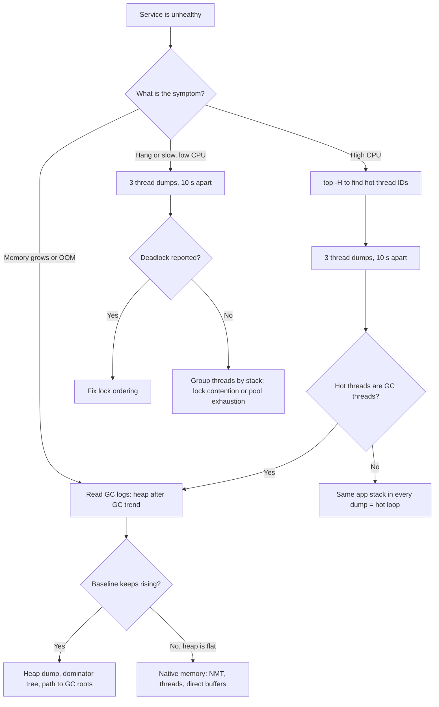
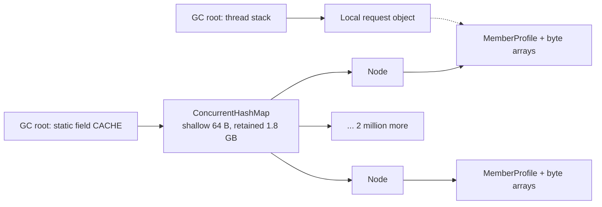

# Diagnosing Production Issues: Thread Dumps, Heap Dumps, Memory Leaks

!!! abstract "TL;DR"
    - **Start from the symptom, not the tool.** High CPU and hangs → **thread dumps** (take 3, about 10 seconds apart). Growing memory or `OutOfMemoryError` → **GC logs first, then a heap dump**. Container killed with exit code 137 → **native memory**, not the heap.
    - A **thread dump** is a snapshot of every thread's stack, state and locks. One dump shows where threads are; several dumps show which threads are **not moving**.
    - A **heap dump** is a snapshot of every object and reference. You analyse it by **retained size** and the **path to GC roots**: a leak is an object that is still *reachable* but no longer *needed*.
    - A Java "memory leak" is almost always a **long-lived holder** (static map, cache without a bound, `ThreadLocal` on a pooled thread, listener list, class loader) that keeps growing.
    - Prepare **before** the incident: `-XX:+HeapDumpOnOutOfMemoryError`, GC logging, JFR, and a writable dump path. You cannot add evidence after the pod has restarted.

## Why it matters

At senior and lead level you are expected to own services in production. Writing correct concurrent code (pages 1 to 7) and knowing how the JVM manages memory (pages 8 and 9) is half of the job. The other half is working backwards from a symptom ("p99 latency went from 200 ms to 8 s", "the pod restarts every six hours") to a root cause, quickly and without making things worse.

Interviewers use this topic to separate people who have read about the JVM from people who have been on call. The questions are open ended: "CPU is at 100%, what do you do?" A strong answer is a **method**: what evidence to collect, in what order, what each piece tells you, and how you confirm the fix.

The JVM is very well instrumented. It can tell you what every thread is doing, what every byte of heap is holding, and why the GC is running. The skill is knowing which question to ask.

## Core concepts

### Symptom first: which tool answers which question

| Symptom | First evidence | What you are looking for |
|---|---|---|
| CPU at 100% | `top -H` + thread dumps | Hot threads in `RUNNABLE` with the same stack across dumps, or GC threads burning CPU |
| Requests hang, CPU low | Thread dumps | Many threads `BLOCKED` on one lock, or `WAITING` on a pool, socket or connection |
| Nothing responds at all | Thread dump | "Found one Java-level deadlock" |
| Heap grows, frequent full GC | GC logs, then heap dump | Rising "heap after GC" baseline, then the biggest retained object |
| `OutOfMemoryError` | The error message, then heap dump | Which memory area ran out (heap, metaspace, direct, threads) |
| Pod `OOMKilled` (exit 137), no Java error | Native Memory Tracking, container limits | Total process memory (RSS) above the container limit |
| Slow, no obvious cause | JFR recording | Lock contention, allocation rate, I/O, safepoints |


*Notice that high CPU can lead to the memory branch: a JVM that is nearly out of heap spends its CPU in garbage collection, so the "CPU problem" is really a memory problem.*

### Thread dumps

A thread dump lists every thread in the JVM with its name, state, stack trace and the locks it holds or waits for. Taking one is cheap: the JVM stops all threads at a safepoint for a few milliseconds, walks the stacks, and resumes.

How to take one:

```bash
jcmd <pid> Thread.print -l        # preferred; -l adds java.util.concurrent lock info
jstack -l <pid>                   # older tool, same output
kill -3 <pid>                     # SIGQUIT: dump goes to the JVM's stdout (container logs)
curl -H 'Accept: text/plain' localhost:8080/actuator/threaddump   # Spring Boot Actuator, if exposed (JSON without the Accept header)
```

One entry looks like this:

```text
"http-nio-8080-exec-17" #58 daemon prio=5 os_prio=0 cpu=1432.11ms elapsed=912.40s
     tid=0x00007f3c2c0a1000 nid=0x1a3f waiting for monitor entry [0x00007f3bd4ffe000]
   java.lang.Thread.State: BLOCKED (on object monitor)
        at com.acme.pricing.PriceCache.refresh(PriceCache.java:41)
        - waiting to lock <0x00000007156a2e10> (a com.acme.pricing.PriceCache)
        at com.acme.pricing.PriceService.price(PriceService.java:27)
        ...
```

How to read it:

- **Name** (`http-nio-8080-exec-17`): tells you the pool. This is why you always name your thread pools (see page 4).
- **`nid=0x1a3f`**: the operating system thread ID in hex. `top -H -p <pid>` shows thread IDs in decimal. Convert (`printf '%x\n' 6719`) to map a hot OS thread to a Java stack.
- **`cpu=` and `elapsed=`** (JDK 11 and later): CPU time used versus wall-clock age. Compare `cpu=` between two dumps to see which threads are really working.
- **State**: `RUNNABLE`, `BLOCKED`, `WAITING`, `TIMED_WAITING` (lifecycle is covered on page 1).
- **Lock lines**: `- locked <addr>` means this thread owns the monitor; `- waiting to lock <addr>` means it wants it. Search for the same address to find the owner.

What the states really mean in a dump:

| State in dump | Typical stack | Meaning |
|---|---|---|
| `RUNNABLE` | Application code | Running, or ready to run |
| `RUNNABLE` | `SocketDispatcher.read0`, `EPoll.wait` (`epollWait` on Java 8) | **Blocked in native I/O.** The JVM cannot see this, so it reports `RUNNABLE`. Not using CPU. |
| `BLOCKED (on object monitor)` | `waiting to lock <...>` | Waiting to enter a `synchronized` block |
| `WAITING (parking)` | `LockSupport.park`, `ReentrantLock`, `CompletableFuture.get` | Waiting for a `java.util.concurrent` lock or a future |
| `WAITING (parking)` | `ThreadPoolExecutor.getTask` | **Idle pool thread.** Healthy, ignore it. |
| `TIMED_WAITING` | `Thread.sleep`, `poll(timeout)` | Waiting with a timeout |

Patterns to recognise:

1. **Deadlock.** The dump ends with `Found one Java-level deadlock` and names the threads and locks. The JVM detects cycles on both monitors and "ownable synchronizers" such as `ReentrantLock`. It does not detect a thread waiting on a `Semaphore`, a latch, or a future that will never complete.
2. **Lock contention.** Dozens of threads `waiting to lock <0x...>` on the same address. Find the one thread that has `- locked <0x...>` and look at what it is doing while holding the lock (often slow I/O).
3. **Pool exhaustion.** Every thread of a pool is busy in the same downstream call (a JDBC driver read, an HTTP client read). New requests queue. The fix is usually a timeout plus a bulkhead, not a bigger pool.
4. **Connection pool starvation.** Threads parked in `HikariPool.getConnection`. Someone is holding connections too long or leaking them.
5. **Hot loop.** One thread is `RUNNABLE` in the same application frame in every dump, and its `cpu=` value grows by about the wall-clock gap.

!!! tip "Why three dumps"
    One dump is a photograph. A thread in `socketRead` in one dump may be perfectly healthy. The same thread in the same frame in three dumps taken 10 seconds apart is stuck. Always compare.

**Virtual threads (Java 21+).** `jcmd Thread.print` and `jstack` show platform threads only, so you see the carrier threads but not the thousands of virtual threads. Use `jcmd <pid> Thread.dump_to_file -format=json <file>`, which includes virtual threads and groups them by their owner. On Java 21 to 23 a virtual thread that blocks inside `synchronized` pins its carrier; look for the JFR event `jdk.VirtualThreadPinned`. JEP 491 in Java 24 removed that pinning case (see page 7).

### Heap dumps

A heap dump (HPROF file) is a copy of every object on the heap: its class, its fields, and its references to other objects. Unlike a thread dump, it is **expensive**: the JVM stops the world while it writes, and the file is about as large as the used heap.

```bash
jcmd <pid> GC.heap_dump /dumps/app.hprof     # live objects only by default (runs a full GC first)
jcmd <pid> GC.heap_dump -all /dumps/app.hprof  # also include unreachable objects
jmap -dump:live,format=b,file=/dumps/app.hprof <pid>   # older equivalent
jcmd <pid> GC.class_histogram                # cheap first look: instances and bytes per class
```

A class histogram is the quick, small alternative. Take two a few minutes apart and compare: a class whose instance count only ever goes up is your suspect.

The concepts you need to analyse a dump (Eclipse MAT, VisualVM, JDK Mission Control or IntelliJ can open one):

- **GC roots.** The starting points of reachability: local variables on thread stacks, static fields, JNI references, live threads, and classes loaded by the system class loader. An object is alive if any chain of references leads to it from a root (page 9 covers how the collectors use this).
- **Shallow size.** The memory of the object itself (header plus fields).
- **Retained size.** The memory that would be freed if this object were collected: itself plus everything reachable *only* through it. This is the number that matters.
- **Dominator tree.** Object A dominates B if every path from the roots to B passes through A. Sorting the dominator tree by retained size shows the few objects that "own" most of the heap.
- **Path to GC roots.** For a suspect object, the chain of references that keeps it alive. This is the answer to "who is holding it?".


*Notice that the map itself is tiny (shallow size) but dominates 1.8 GB (retained size). The request object also points at one value, but removing the request frees nothing, because the static map still holds it.*

### What a "memory leak" means in Java

The garbage collector frees everything that is **unreachable**. So a Java leak is never "forgot to free". It is: an object is still reachable from a GC root, but the program will never use it again. The collector cannot know that.

The usual holders:

| Leak source | Why it leaks | Fix |
|---|---|---|
| Static or singleton collection used as a cache | No size bound, no expiry | Bounded cache (Caffeine) with max size and TTL |
| `ThreadLocal` on a pooled thread | Pool threads never die, so the value lives forever | `try { set } finally { remove() }` |
| Listeners, callbacks, subscriptions | Registered, never unregistered | Unregister on close; weak listeners |
| Map key with broken `equals`/`hashCode`, or a mutable key | Every `put` adds a new entry, `get` never finds it | Immutable keys (records) |
| Unclosed resources | Streams, clients, cursors hold buffers and native handles | try-with-resources |
| Class loader leak | One reference to one object of an old class loader pins every class it loaded | Clean up threads, `ThreadLocal`s, JDBC drivers on undeploy |
| Unbounded queue in an executor | Producers are faster than consumers (page 4) | Bounded queue plus rejection policy |
| Inner class or lambda capturing `this` | A long-lived task keeps the whole outer object alive | Static nested class, capture only what is needed |

### Leak versus "just needs more heap"

GC logs answer this (`-Xlog:gc*`, see page 9). Look at **heap used after each full or mixed collection**:

- **Flat baseline, tall sawtooth:** healthy. High allocation rate, but everything is collected.
- **Baseline that rises after every collection and never comes down:** a leak.
- **Baseline is flat but close to the maximum:** under-sized heap, or a legitimate large data set.

### Not all memory is heap

A JVM process uses more than `-Xmx`: metaspace, thread stacks (about 1 MB per platform thread by default on 64-bit Linux), the JIT code cache, GC structures, and direct `ByteBuffer`s (used heavily by Netty and other NIO libraries). In a container, the kernel kills the process when total memory (RSS) passes the limit. That is **`OOMKilled`, exit code 137**: there is no `OutOfMemoryError`, no stack trace and no heap dump, because the JVM never got a chance.

**Native Memory Tracking (NMT)** shows where the non-heap memory went:

```bash
# start the JVM with: -XX:NativeMemoryTracking=summary   (small overhead)
jcmd <pid> VM.native_memory baseline
# ... wait while memory grows ...
jcmd <pid> VM.native_memory summary.diff
```

The `OutOfMemoryError` message tells you which area failed:

| Message | Area | Usual cause |
|---|---|---|
| `Java heap space` | Heap | Leak, or heap too small for the load |
| `GC overhead limit exceeded` | Heap | Almost all time spent in GC, almost nothing reclaimed (Parallel GC) |
| `Metaspace` | Class metadata | Class loader leak, runaway dynamic class or proxy generation |
| `Direct buffer memory` (newer JDKs: `Cannot reserve N bytes of direct buffer memory`) | Off-heap NIO buffers | Buffers not released, `MaxDirectMemorySize` too low |
| `unable to create native thread` | OS | Thread leak, or OS process/thread limit reached |

### JFR: the always-on flight recorder

Java Flight Recorder is built into the JDK and designed to run in production with low overhead. It records events for GC, allocation, lock contention (`jdk.JavaMonitorEnter`), thread parks, socket and file I/O, and exceptions. For leaks, the **`jdk.OldObjectSample`** event samples long-lived objects and can record their path to GC roots (enable it with `path-to-gc-roots=true` on `JFR.start` or `JFR.dump`; it is off by default because it is costly), which often finds a leak without a full heap dump.

```bash
jcmd <pid> JFR.start name=incident duration=120s filename=/dumps/incident.jfr
jcmd <pid> JFR.dump name=incident filename=/dumps/now.jfr
```

## In practice: code & configuration

### JVM flags to set before you need them

```bash
# A bash array lets every flag carry a comment (a comment after a trailing "\" would break the command).
JVM_OPTS=(
  -XX:MaxRAMPercentage=75.0                   # heap as a share of the container limit (default is 25%)
  -XX:+HeapDumpOnOutOfMemoryError             # write a dump at the first heap/metaspace OOM
  -XX:HeapDumpPath=/dumps                     # must be a mounted volume, not the container filesystem
  -XX:+ExitOnOutOfMemoryError                 # then exit, so the orchestrator restarts a clean JVM
  '-Xlog:gc*:file=/dumps/gc.log:time,uptime,level,tags:filecount=5,filesize=20m'   # quoted: * is a shell glob
  -XX:NativeMemoryTracking=summary            # lets you answer "where did non-heap memory go?"
  -XX:StartFlightRecording=maxage=1h,maxsize=250m,disk=true,dumponexit=true,filename=/dumps/exit.jfr
)
java "${JVM_OPTS[@]}" -jar app.jar
```

`ExitOnOutOfMemoryError` matters because after an OOM the JVM may be half alive: one thread died, others hold inconsistent state. A clean restart is safer than limping on.

### Getting dumps out of Kubernetes

```bash
kubectl exec rx-service-7d9f -- jcmd 1 Thread.print -l > td-1.txt   # PID is usually 1 in a container
sleep 10
kubectl exec rx-service-7d9f -- jcmd 1 Thread.print -l > td-2.txt
kubectl exec rx-service-7d9f -- jcmd 1 GC.heap_dump /dumps/rx.hprof
kubectl cp rx-service-7d9f:/dumps/rx.hprof ./rx.hprof   # needs tar in the image
```

If the image is a JRE-only or distroless image there is no `jcmd`. Options: ship a JDK-based image, attach an ephemeral debug container (`kubectl debug`), or use the Actuator endpoints.

### A classic leak and its fix

=== "❌ Common mistake"
    ```java
    @Service
    public class MemberProfileService {

        // Static map used as a cache: no size limit, no expiry. It is a GC root.
        private static final Map<ProfileKey, MemberProfile> CACHE = new ConcurrentHashMap<>();

        // Request context kept in a ThreadLocal on Tomcat's pooled threads.
        private static final ThreadLocal<RequestContext> CTX = new ThreadLocal<>();

        private final ProfileClient upstream;            // MemberProfile fetch(ProfileKey key)
        MemberProfileService(ProfileClient upstream) { this.upstream = upstream; }

        public MemberProfile load(String memberId, Instant asOf) {
            CTX.set(RequestContext.current());           // never removed: lives as long as the pool thread
            // asOf is "now" on every call, so every key is new and nothing is ever reused
            return CACHE.computeIfAbsent(new ProfileKey(memberId, asOf), upstream::fetch);
        }
    }

    class ProfileKey {                                   // no equals/hashCode: identity comparison,
        final String memberId; final Instant asOf;       // so even identical keys never match
        ProfileKey(String m, Instant a) { memberId = m; asOf = a; }
    }
    ```

=== "✅ Correct approach"
    ```java
    @Service
    public class MemberProfileService {

        // Bounded in size AND time. Eviction is the difference between a cache and a leak.
        private final Cache<ProfileKey, MemberProfile> cache = Caffeine.newBuilder()
                .maximumSize(50_000)
                .expireAfterWrite(Duration.ofMinutes(10))
                .recordStats()                           // export hit rate and evictions to Micrometer
                .build();

        private static final ThreadLocal<RequestContext> CTX = new ThreadLocal<>();

        private final ProfileClient upstream;            // MemberProfile fetch(ProfileKey key)
        MemberProfileService(ProfileClient upstream) { this.upstream = upstream; }

        public MemberProfile load(String memberId, LocalDate asOfDate) {
            CTX.set(RequestContext.current());
            try {
                return cache.get(new ProfileKey(memberId, asOfDate), upstream::fetch);
            } finally {
                CTX.remove();                            // always clean up on pooled threads
            }
        }
    }

    // A record gives correct, immutable equals/hashCode. A coarse key (date, not instant) allows reuse.
    record ProfileKey(String memberId, LocalDate asOfDate) {}
    ```

In a heap dump the broken version is easy to spot: the dominator tree shows one `ConcurrentHashMap` retaining most of the heap, and its path to GC roots ends at `MemberProfileService.CACHE` (a static field).

### Detecting deadlocks from inside the application

```java
@Component
class DeadlockWatchdog {
    private static final Logger log = LoggerFactory.getLogger(DeadlockWatchdog.class);
    private final ThreadMXBean threads = ManagementFactory.getThreadMXBean();

    @Scheduled(fixedDelay = 30_000)
    void check() {
        long[] ids = threads.findDeadlockedThreads();    // covers monitors and ownable synchronizers
        if (ids == null) return;                         // null means no deadlock
        for (ThreadInfo info : threads.getThreadInfo(ids, true, true)) {
            log.error("Deadlocked thread: {}", info);    // includes stack, held and awaited locks
        }
        // Alert here. A deadlock never heals itself, the only cure is a restart.
    }
}
```

### Spring Boot Actuator

```yaml
management:
  endpoints:
    web:
      exposure:
        include: health, metrics, prometheus, threaddump   # heapdump only on a protected management port
  server:
    port: 9090          # separate port, not routed through the public ingress
```

Exposing an endpoint over HTTP is not always enough. From Spring Boot 3.5 the `heapdump` endpoint's access defaults to `none`, so it must also be enabled with `management.endpoint.heapdump.access=unrestricted`. `/actuator/threaddump` returns JSON unless you send `Accept: text/plain`.

Micrometer already exports the numbers you should alert on: `jvm.memory.used`, `jvm.gc.live.data.size` (old generation size after a collection, the "after-GC baseline"), `jvm.gc.pause`, `jvm.threads.live`, `jvm.threads.states`, `jvm.buffer.memory.used`, plus executor and HikariCP pool metrics.

## Real-world usage

- **Netflix** published "Java 21 Virtual Threads - Dude, Where's My Lock?". Services on Java 21 with virtual threads stopped serving traffic while the JVM stayed up. `jstack` showed little, because virtual threads are not in it. With `jcmd Thread.dump_to_file` and a heap dump they found virtual threads pinned to all carrier threads inside `synchronized` blocks, waiting for a lock whose next owner could not get a carrier. It is a good example of combining a thread dump and a heap dump, and of why the tooling changed with Loom.
- **Continuous profiling.** Many large engineering teams run JFR or async-profiler all the time and keep flame graphs, so that evidence already exists when an incident starts. Brendan Gregg invented flame graphs in 2011 and his later performance work at Netflix made this approach popular.
- **Healthcare and banking.** A heap dump contains everything that was in memory: member names, prescriptions, account numbers, access tokens, encryption keys. Under HIPAA or PCI DSS rules it must be treated as production data: encrypted storage, restricted access, short retention, never attached to a ticket or copied to a laptop. An exposed `/actuator/heapdump` endpoint is a well-known way that credentials leak from Spring Boot applications.
- **Kubernetes.** The most common "leak" report in containerised Java is not a heap leak. It is a container limit that leaves too little room for non-heap memory, so the pod is `OOMKilled` under load.

## Trade-offs & production gotchas

| Tool | Cost to the running service | Tells you | Use when |
|---|---|---|---|
| Thread dump (`jcmd Thread.print`) | Milliseconds of pause | What every thread is doing right now | Hangs, high CPU, slowness. Safe to take any time. |
| Class histogram | A full GC | Instance count and bytes per class | First cheap look at a suspected leak |
| Heap dump | Stop-the-world for seconds to minutes; disk about the size of the heap | Every object and who holds it | Confirmed leak or after an OOM. Take the node out of rotation first. |
| GC logs | Negligible | Allocation rate, pause times, heap-after-GC trend | Always on |
| JFR | Low, designed for production | Locks, allocation, I/O, old object samples over time | Always on; first choice for "slow but why" |
| Native Memory Tracking | Small overhead | Non-heap usage by category | RSS grows but heap is flat; `OOMKilled` |
| async-profiler | Low (sampling) | CPU, allocation and lock flame graphs | CPU hot spots, allocation pressure |
| APM / metrics | Low | Trends and alerts, not root cause | Detecting that there is a problem |

!!! warning "Gotchas"
    - **A heap dump can kill the pod.** The JVM is paused while writing, so liveness probes fail and Kubernetes restarts the container, deleting the half-written file. Remove the instance from the load balancer, relax the probe, and write to a mounted volume.
    - **`OOMKilled` produces no heap dump.** `HeapDumpOnOutOfMemoryError` only fires for a Java `OutOfMemoryError`. A kernel kill is invisible to the JVM.
    - **`RUNNABLE` does not mean "using CPU".** A thread blocked in a native socket read is reported as `RUNNABLE`.
    - **The thread that throws the OOM is often innocent.** It was simply the one that asked for memory when none was left. Look at retained sizes, not the stack trace.
    - **A live-only dump hides garbage.** `GC.heap_dump` runs a full GC first. Good for leaks; use `-all` if you are investigating allocation churn.
    - **Restarting first destroys the evidence.** Capture thread dumps (and a heap dump from one instance) before you restart the rest.
    - **`jstack` misses virtual threads.** Use `Thread.dump_to_file`.
    - **Heap dumps are sensitive data.** PHI, PII and secrets are in plain text inside them.

## How this connects to my experience

- **Where I used it:** OptumRx Meteor at Publicis Sapient. I owned the GraphQL Consumer Service end to end and led "release management and production support" for a platform serving 750K+ users. The service called 5 upstream systems, used Redis caching, and ran Kafka consumers with retry and DLQ. Those are exactly the places where thread pool exhaustion and memory growth appear.
- **Talking points:**
    - As owner of an integration layer, the most likely failure is a slow upstream holding all request threads. A thread dump shows every worker thread parked in the same HTTP client read. The fix is timeouts, bulkheads and circuit breakers per upstream, not a larger pool. *[confirm: a real incident where an upstream slowdown caused thread or connection pool exhaustion, and what the dump showed]*
    - I moved hot reference data to Redis ("Redis-based caching for frequently accessed queries and UI reference data"). A good framing: an external, bounded cache with TTL keeps large data off the JVM heap and avoids the "static map as a cache" leak. *[confirm: whether any in-process cache existed and how it was bounded]*
    - Kafka consumers: a consumer that accumulates records in memory faster than it processes them looks like a leak. Bounded `max.poll.records` and back-pressure keep the heap flat. *[confirm: any consumer memory or lag incident]*
    - As tech lead I set engineering standards. I can say I made dump-on-OOM flags, GC logging, named thread pools and Actuator/Micrometer JVM metrics part of the service baseline. *[confirm: which of these flags and dashboards were actually in the Meteor deployment]*
    - Healthcare angle: heap dumps contain PHI, so access and retention must follow the same controls as production data. *[confirm: the actual process for handling dumps at Optum]*
- **Honest bridge if no single dramatic incident:** "I have not had to debug a multi-day leak, but I have a clear method and I have used thread dumps and metrics during production support." *[confirm]* Then walk through the method on this page.
- **Likely follow-up chain:**
    1. *"Your GraphQL service became slow. How did you find out why?"* → Metrics first (latency per upstream, pool usage), then three thread dumps, group threads by stack, found them waiting on one upstream. *[confirm: only tell this as a real story if it happened; otherwise present it as "how I would approach it"]*
    2. *"How did you stop it happening again?"* → Per-upstream timeouts and bulkheads, circuit breaker, alert on pool saturation, DataLoader batching to cut the number of calls. *[confirm: which of these were actually implemented in the GraphQL Consumer Service]*
    3. *"How would you prove it was not a memory problem?"* → GC logs show a flat heap-after-GC baseline and short pauses; CPU was low; so the time was spent waiting, not collecting.
    4. *"What if memory had been growing?"* → Class histogram diff, then a heap dump from one instance taken out of rotation, dominator tree, path to GC roots.

## Interview questions

### Fundamentals

??? question "Q1. What is a thread dump and how do you take one?"
    **Answer:** A thread dump is a snapshot of all threads in the JVM: name, state, stack trace, and the locks each thread holds or waits for. Take it with `jcmd <pid> Thread.print -l`, `jstack -l <pid>`, `kill -3 <pid>` (output goes to the JVM's standard output), or the Spring Boot Actuator `/threaddump` endpoint. It is cheap, a brief safepoint pause, so it is safe in production. Take several a few seconds apart to see which threads are stuck rather than just passing through.

    **Interviewer listens for:** At least two ways to take it; "more than one dump"; that it is low risk.

    **Common wrong answer:** "I would attach a debugger" or "I would add logs and redeploy". Both are too slow or too risky for a live incident.

??? question "Q2. What is the difference between a thread dump and a heap dump?"
    **Answer:** A thread dump shows **what the code is doing**: stacks and locks. It is small, text, and nearly free. A heap dump shows **what the memory is holding**: every object and reference. It is binary, about as large as the used heap, and pauses the application while it is written. Use thread dumps for hangs, deadlocks, slowness and high CPU. Use heap dumps for memory leaks and `OutOfMemoryError`.

    **Interviewer listens for:** Symptom-to-tool mapping and awareness of the cost of a heap dump.

??? question "Q3. How can Java have a memory leak when it has garbage collection?"
    **Answer:** The GC frees objects that are unreachable from GC roots. A leak in Java is an object that is still reachable but will never be used again, so the GC must keep it. Typical causes: an unbounded static map or cache, `ThreadLocal` values on pooled threads that are never removed, listeners that are never unregistered, keys with broken `equals`/`hashCode`, and class loader leaks.

    **Interviewer listens for:** "Reachable but not needed", and two or three concrete causes.

    **Common wrong answer:** "Java cannot leak memory", or "call `System.gc()`". A forced GC cannot free reachable objects.

??? question "Q4. What does this thread state tell you? A Tomcat thread is `RUNNABLE` with `SocketDispatcher.read0` at the top of its stack in three dumps taken 10 seconds apart."
    **Answer:** It is **not** using CPU. It is blocked in a native socket read, waiting for bytes from a remote system. The JVM reports threads in native code as `RUNNABLE` because it cannot see inside the operating system call. Being in the same frame across three dumps means the remote side has not answered for at least 20 seconds, so there is a missing or too generous read timeout. Check the frames below to see which client and which upstream.

    **Interviewer listens for:** `RUNNABLE` is not the same as "on CPU"; the timeout conclusion.

    **Common wrong answer:** "It is runnable, so this thread is the cause of the high CPU."

### Intermediate

??? question "Q5. CPU is at 100% on one instance. Walk me through finding the cause."
    **Answer:**

    1. `top -H -p <pid>` to list threads by CPU and note the hot thread IDs.
    2. Take three thread dumps about 10 seconds apart.
    3. Convert the thread IDs to hex and match them to `nid=0x...` in the dump (or compare the `cpu=` values between dumps).
    4. If the hot threads are **GC threads**, it is a memory problem: check GC logs and heap usage.
    5. If they are application threads, the stack that repeats is the hot code: an infinite loop, a retry loop without back-off, a catastrophic regular expression, or heavy serialisation.
    6. For a fuller picture, record a short JFR or an async-profiler flame graph.

    **Interviewer listens for:** Mapping OS thread to Java thread; ruling GC in or out; multiple dumps.

    **Common wrong answer:** "Take a heap dump." A heap dump does not show what is using CPU and it makes the instance worse.

??? question "Q6. How do you tell a memory leak from a heap that is simply too small?"
    **Answer:** Look at the GC log and plot heap used **after** each full or mixed collection. In a healthy application this baseline is flat: usage climbs and falls back to the same level. With a leak the baseline climbs after every collection and time-to-OOM depends on uptime or traffic volume. If the baseline is flat but near the maximum, the live data set genuinely needs that memory, so raise the heap or reduce what you keep. Raising the heap for a real leak only delays the crash.

    **Interviewer listens for:** "Heap after GC" as the signal, not raw heap usage.

    **Common wrong answer:** "Heap usage is at 90%, so it is a leak." A heap near full just before a collection is normal.

??? question "Q7. How does a `ThreadLocal` cause a memory leak in a web application?"
    **Answer:** Each thread has a `ThreadLocalMap` that holds its values. The entry's key (the `ThreadLocal` object) is a weak reference, but the **value is a strong reference**. In a thread pool, threads live for the life of the application, so a value that is set and never removed stays reachable through the thread, which is a GC root. Across 200 Tomcat threads, a large per-request object becomes 200 large objects that never go away. It also causes correctness bugs: the next request on that thread sees the previous request's data. The fix is `remove()` in a `finally` block. With virtual threads, scoped values are the better tool: `ScopedValue` is a preview API in Java 21 to 24 and final in Java 25 (JEP 506) (see page 7).

    **Interviewer listens for:** Pooled threads, strong value reference, `finally { remove() }`, and the data-bleed risk.

??? question "Q8. A dump shows 180 threads `BLOCKED` with `waiting to lock <0x000000071a2b3c40>`. What do you do next?"
    **Answer:** Search the dump for `- locked <0x000000071a2b3c40>`. At most one thread owns that monitor (occasionally a dump shows no owner, because the lock was being handed over at that instant; the next dump will show one). Read its stack: what is it doing while holding the lock? Usually it is doing something slow inside a `synchronized` block, such as a remote call, a database query, or logging to a slow appender. Check the next dump: if the owner changes each time, it is contention on a hot lock; if it is the same thread in the same place, that thread is stuck. Fixes: shrink the critical section, move I/O outside the lock, or replace the lock with a concurrent data structure (pages 3 and 6).

    **Interviewer listens for:** Finding the owner by address and examining what it does under the lock.

### Senior

??? question "Q9. A pod is restarted with `OOMKilled` (exit code 137), but there is no `OutOfMemoryError` in the logs and no heap dump. Explain."
    **Answer:** The Linux kernel killed the process because the container's total memory passed its limit. The JVM did not run out of heap, so it never threw an error and never wrote a dump. Total memory is heap plus metaspace, thread stacks, code cache, GC structures, direct buffers and native allocations. Common causes: `-Xmx` or `MaxRAMPercentage` set too close to the limit; many threads; Netty or NIO direct buffers; a native library leak. Diagnose with NMT (`VM.native_memory baseline`, then `summary.diff`), compare the container's RSS with what NMT accounts for, and check thread count and direct buffer metrics. Fix by leaving headroom (a common starting point is heap at about 70 to 75% of the limit), capping direct memory, and fixing whatever is growing.

    **Interviewer listens for:** Heap is not the whole process; kernel kill versus Java error; NMT.

    **Common wrong answer:** "Increase `-Xmx`." That shrinks the non-heap headroom and makes the kills more frequent.

??? question "Q10. How do you take a heap dump of a 16 GB heap in production safely?"
    **Answer:** Treat it as a planned operation on **one** instance:

    - Take the instance out of the load balancer so no user waits during the pause.
    - Make sure the liveness probe will not kill it mid-dump (the pause can be tens of seconds or more).
    - Write to a volume with enough free space, at least the size of the used heap.
    - Prefer a live-only dump (`jcmd GC.heap_dump`), which is smaller.
    - Consider cheaper evidence first: two class histograms, or JFR `OldObjectSample` with paths to GC roots.
    - Copy the file to a secure, access-controlled location. It contains customer data and secrets.
    - Analyse on a machine with enough memory; Eclipse MAT can build its indexes in headless mode on a server.

    **Interviewer listens for:** Pause awareness, probes, disk space, data sensitivity, cheaper alternatives.

??? question "Q11. The dominator tree shows one object retaining 70% of the heap. What are your next steps, and what if nothing dominates?"
    **Answer:** With a clear dominator: open its **path to GC roots, excluding weak and soft references**, to see who holds it (a static field, a thread, a class loader). Then look inside it: what are the entries, how many, what keys? That tells you which code path adds entries and why they are never removed. Confirm with the code, fix, and verify in a soak test that the after-GC baseline is now flat.

    With no single dominator, the leak is spread out: for example the same object type held by thousands of different threads, sessions or `ThreadLocal`s. Use the class histogram sorted by retained size, group by class loader or by referrer, and compare two dumps taken at different times to see which class grows.

    **Interviewer listens for:** Path to roots excluding weak references; comparing two dumps; verifying the fix.

??? question "Q12. How does diagnosing change with virtual threads?"
    **Answer:** Three things. First, traditional thread dumps do not list virtual threads; use `jcmd Thread.dump_to_file -format=json`, which also shows the structure when structured concurrency is used. Second, there may be hundreds of thousands of threads, so you group by stack instead of reading one by one. Third, a new failure mode: **pinning**. On Java 21 to 23 a virtual thread that blocks while inside a `synchronized` block holds its carrier thread. If all carriers are pinned, the application stops making progress although CPU is idle and classic dumps look quiet. JFR's `jdk.VirtualThreadPinned` event exposes it. Java 24 (JEP 491) removed pinning for `synchronized`; native frames still pin. Also, virtual thread stacks live on the heap, so a huge number of blocked virtual threads appears as heap usage.

    **Interviewer listens for:** `Thread.dump_to_file`, pinning and its version history, stacks on the heap.

### Scenario-based

??? question "Q13. A service runs fine for about six hours after each deploy, then latency climbs and it dies with `OutOfMemoryError: Java heap space`. How do you investigate?"
    **Answer:**

    1. **Stabilise:** it is predictable, so schedule rolling restarts as a short-term mitigation while investigating.
    2. **Confirm the shape:** GC logs or Micrometer's `jvm.gc.live.data.size` metric (heap used after a collection) should show a rising baseline. The climbing latency is GC working harder as free space shrinks.
    3. **Correlate:** does growth follow time or traffic? Did it start with a specific release? Diff that release.
    4. **Cheap evidence:** class histograms at hour 1 and hour 4; note which classes grow.
    5. **Heap dump:** from one instance at hour 4 or 5 (out of rotation), or use the automatic dump from `HeapDumpOnOutOfMemoryError`.
    6. **Analyse:** dominator tree, largest retained object, path to GC roots, inspect the contents.
    7. **Fix and verify:** bound the cache, remove the `ThreadLocal`, close the resource. Run a soak test and confirm a flat baseline.
    8. **Prevent:** alert on the after-GC heap trend, add the pattern to code review.

    **Interviewer listens for:** Mitigation and investigation in parallel; correlation with a release; verification.

    **Common wrong answer:** "Double the heap." It now dies after twelve hours and with longer GC pauses.

??? question "Q14. All instances stop responding at the same time. CPU is near zero, memory is normal. What is your hypothesis and how do you prove it?"
    **Answer:** Low CPU with no progress means threads are **waiting**. All instances at once points to a **shared dependency**: database, cache, an upstream API, or an identity provider. Take thread dumps on two instances. I expect to see all request threads in the same place: a socket read to one host, or parked in the connection pool's `getConnection`. That confirms pool exhaustion caused by a slow dependency with missing or long timeouts. Immediate action: fail fast on that dependency (circuit breaker, feature flag, shorter timeout) and restart if the pool will not recover. Long term: timeouts on every remote call, a bulkhead per dependency so one slow upstream cannot take all threads, and alerts on pool saturation. If instead the dump shows a deadlock, it is a code bug and every instance reached the same lock ordering.

    **Interviewer listens for:** Reasoning from "low CPU" to "waiting"; shared dependency; bulkheads and timeouts.

??? question "Q15. Gotcha: your team added `-XX:+HeapDumpOnOutOfMemoryError`, the service crashed overnight, and there is no dump file. Give four possible reasons."
    **Answer:**

    1. It was a container `OOMKilled`, not a Java `OutOfMemoryError`, so the flag never fired.
    2. The dump path was on the container's own filesystem and was deleted when the pod restarted.
    3. Not enough disk space, or the path was not writable by the JVM user.
    4. The liveness probe failed during the dump pause and Kubernetes killed the container before the file was complete.

    Other possibilities: the error type does not trigger the dump (for example `unable to create native thread`), or a file with that name already existed and the JVM will not overwrite it.

    **Interviewer listens for:** The kernel-kill distinction first, then the operational reasons.

## Cheat sheet

| Concept | Remember |
|---|---|
| Thread dump | `jcmd <pid> Thread.print -l`; cheap; take 3, 10 s apart |
| Hot thread | `top -H` thread ID → hex → `nid=` in the dump |
| `RUNNABLE` in socket read | Blocked in native I/O, not on CPU |
| `BLOCKED` | Waiting for a `synchronized` monitor; find `- locked <same address>` |
| `WAITING (parking)` | `java.util.concurrent` lock, future, or an idle pool thread |
| Deadlock | "Found one Java-level deadlock"; `ThreadMXBean.findDeadlockedThreads()` |
| Virtual threads | `jcmd Thread.dump_to_file -format=json`; pinning on `synchronized` fixed in Java 24 |
| Heap dump | `jcmd <pid> GC.heap_dump file`; stop-the-world; file about the size of the heap |
| Cheap leak check | `jcmd GC.class_histogram` twice, compare |
| Leak definition | Reachable from a GC root but never used again |
| Leak signal | Heap **after GC** baseline keeps rising |
| Analysis | Dominator tree by retained size → path to GC roots |
| Top leak causes | Unbounded static cache, `ThreadLocal` on pool threads, listeners, bad map keys, class loaders |
| `OOMKilled` / 137 | Kernel kill, no Java error, no dump; check non-heap with NMT |
| NMT | `-XX:NativeMemoryTracking=summary`, `VM.native_memory summary.diff` |
| JFR | Always-on; `jdk.OldObjectSample`, `jdk.JavaMonitorEnter`, `jdk.VirtualThreadPinned` |
| Must-have flags | `HeapDumpOnOutOfMemoryError`, `HeapDumpPath`, `ExitOnOutOfMemoryError`, `-Xlog:gc*` |
| Security | Heap dumps hold PHI, PII and secrets; never expose `/actuator/heapdump` publicly |

## Sources

1. [Java SE 21 Troubleshooting Guide (Oracle)](https://docs.oracle.com/en/java/javase/21/troubleshoot/): memory leak diagnosis, `OutOfMemoryError` messages, diagnostic tools, hung processes and deadlock detection.
2. [The `jcmd` command, JDK 21 (Oracle)](https://docs.oracle.com/en/java/javase/21/docs/specs/man/jcmd.html): `Thread.print`, `Thread.dump_to_file`, `GC.heap_dump`, `GC.class_histogram`, `VM.native_memory`, `JFR.start`.
3. [Native Memory Tracking, JDK 21 (Oracle)](https://docs.oracle.com/en/java/javase/21/vm/native-memory-tracking.html): enabling NMT, baseline and diff.
4. [JEP 444: Virtual Threads](https://openjdk.org/jeps/444): observing virtual threads, the new thread dump format, pinning.
5. [JEP 491: Synchronize Virtual Threads without Pinning](https://openjdk.org/jeps/491): removal of `synchronized` pinning in JDK 24.
6. [Eclipse Memory Analyzer (MAT)](https://eclipse.dev/mat/): dominator tree, retained size, leak suspects report.
7. [Java 21 Virtual Threads - Dude, Where's My Lock? (Netflix Technology Blog)](https://netflixtechblog.com/java-21-virtual-threads-dude-wheres-my-lock-3052540e231d): a real incident diagnosed with thread dumps and a heap dump.
8. [Spring Boot Actuator endpoints (Spring Boot reference)](https://docs.spring.io/spring-boot/reference/actuator/endpoints.html): `threaddump` and `heapdump` endpoints and their exposure rules.
