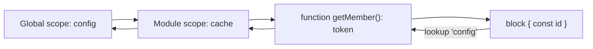
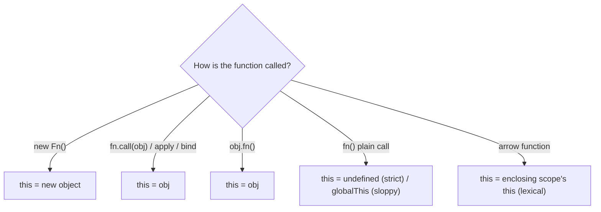

# Scope, Hoisting, Closures, `this`, Prototypes & Inheritance

!!! abstract "Key takeaways"
    - **Scope is lexical:** a variable is resolved by where code is written, walking outward through enclosing scopes. `let`/`const`/`class` are **block-scoped**; `var` is **function-scoped**.
    - **Hoisting:** declarations are registered before code runs. `var` is initialised to `undefined`; function declarations are fully hoisted; `let`/`const`/`class` are hoisted but stay in the **temporal dead zone (TDZ)** until their line runs (access throws `ReferenceError`).
    - **Closure:** a function keeps access to the variables of the scope where it was created, even after that scope returned. Basis of private state, callbacks, React hooks and module patterns; also of the classic `var` in a loop bug.
    - **`this` is decided at call time** by four rules, in priority order: `new` binding → explicit (`call`/`apply`/`bind`) → implicit (`obj.method()`) → default (`undefined` in strict mode, global object otherwise). **Arrow functions** have no own `this`: they use the enclosing scope's.
    - **Prototypes:** objects delegate missing property lookups to their `[[Prototype]]` (the prototype chain). `class` is syntax over constructor functions and prototypes, with `extends`/`super`, private `#fields` and static blocks.

## Why it matters

These are the foundations behind most JavaScript "gotcha" questions and many real bugs: callbacks that lose `this`, loops that capture the wrong value, variables used before initialisation, accidental globals, and memory leaks through closures. Senior interviews use them to check you understand the language rather than framework habits.


*Notice lookup always walks outward from where the code is written (lexical), never from where it's called. That's what makes closures predictable.*

## Core concepts

### Scope

| Declaration | Scope | Hoisted | Initialised before line? | Redeclare | Reassign |
|---|---|---|---|---|---|
| `var` | Function (or global) | Yes | `undefined` | Yes | Yes |
| `let` | Block | Yes (TDZ) | No → ReferenceError | No | Yes |
| `const` | Block | Yes (TDZ) | No → ReferenceError | No | No (binding only) |
| `function f(){}` | Function/block | Yes | Fully (callable) | — | — |
| `class C {}` | Block | Yes (TDZ) | No | No | — |

- Top-level `var` in scripts creates properties on `globalThis`; in ES modules, top-level scope is module scope (no globals).
- Assigning to an undeclared variable creates a global in sloppy mode, throws in strict mode. Modules and classes are always strict.

### Hoisting and the TDZ

```js
console.log(a);   // undefined (var hoisted and initialised)
console.log(b);   // ReferenceError: Cannot access 'b' before initialization (TDZ)
var a = 1;
let b = 2;

greet();          // works: function declaration hoisted with its body
function greet() {}

hello();          // TypeError: hello is not a function (var hoisted as undefined)
var hello = () => {};
```

### Closures

```js
function makeCounter() {
  let count = 0;                     // private state
  return { inc: () => ++count, get: () => count };
}
const c = makeCounter(); c.inc(); c.get();   // 1
```

- A closure captures **variables (bindings)**, not values: later changes are visible.
- Classic bug: `for (var i = 0; i < 3; i++) setTimeout(() => console.log(i))` logs `3 3 3` (one shared `i`). With `let`, each iteration gets a new binding → `0 1 2`.
- Memory: a long-lived closure (event listener, cache) keeps its captured scope alive; remove listeners and avoid capturing large objects unnecessarily.
- React hooks rely on closures over each render; stale closures happen when a callback captured an old render.

{ loading=lazy }
*Watch where each callback's line points. With `var` all three share one `i`, which is already 3 when they run; with `let` each iteration gets its own `i`.*

### `this`


*Notice `this` depends on the call site, not on where the function was defined, except for arrow functions, which ignore all these rules.*

- **Lost `this`:** `const f = obj.method; f()` → default binding. Same when passing `obj.method` as a callback.
- **Fixes:** arrow functions in class fields (`handle = () => {...}`), `.bind(this)`, or calling via the object.
- `bind` returns a new function with fixed `this` (and optionally partial arguments); `new` overrides a bound `this`.
- Arrow functions can't be used with `new` and have no `arguments`, `super` or `prototype`.

### Prototypes and the prototype chain

```js
const animal = { speak() { return `${this.name} makes a sound`; } };
const dog = Object.create(animal);      // dog.[[Prototype]] = animal
dog.name = "Rex";
dog.speak();                            // found on animal via the chain, this = dog
```

- Property read: own properties → `[[Prototype]]` → ... → `Object.prototype` → `null`.
- Property write creates/updates an own property (shadowing), unless a setter exists up the chain.
- `Object.getPrototypeOf(o)`, `Object.setPrototypeOf` (slow, avoid), `__proto__` (legacy accessor).
- Constructor functions: `function Member(n) { this.name = n }`; methods on `Member.prototype`; `new` creates an object whose prototype is `Member.prototype`.
- `instanceof` checks whether `C.prototype` is on the object's chain.

{ loading=lazy }
*Notice the method is found on `animal` but still runs with `this = dog`. A missing property walks the whole chain and ends as `undefined`, not an error.*

### Classes

```js
class Member {
  #ssn;                                    // truly private (not on prototype, not accessible outside)
  static count = 0;
  constructor(name, ssn) { this.name = name; this.#ssn = ssn; Member.count++; }
  get maskedSsn() { return "***-**-" + this.#ssn.slice(-4); }
  toJSON() { return { name: this.name }; } // never serialise the SSN
}
class Caregiver extends Member {
  constructor(name, ssn, members) { super(name, ssn); this.members = members; } // super before this
}
```

- `class` bodies are strict; class declarations are in the TDZ; methods are non-enumerable on the prototype.
- `extends` sets up two chains: instances (`Caregiver.prototype → Member.prototype`) and statics (`Caregiver → Member`).
- Private `#fields` (ES2022) are enforced by the language, unlike TypeScript `private`, which is compile-time only.
- Prefer composition over deep inheritance chains.

## In practice: code & configuration

### `this` lost in a callback

=== "❌ Common mistake"
    ```js
    class SessionTimer {
      constructor() { this.remaining = 900; }
      tick() { this.remaining--; }                 // `this` depends on the call
      start() { setInterval(this.tick, 1000); }    // passed as a plain function: this is undefined
    }
    ```

=== "✅ Correct approach"
    ```js
    class SessionTimer {
      remaining = 900;
      tick = () => { this.remaining--; };          // arrow field: lexical this, bound per instance
      start() { this.id = setInterval(this.tick, 1000); }
      stop() { clearInterval(this.id); }           // also avoids leaking the closure
    }
    ```

### Closures in loops

=== "❌ Common mistake"
    ```js
    for (var i = 0; i < buttons.length; i++) {
      buttons[i].addEventListener("click", () => select(i));  // every handler uses the final i
    }
    ```

=== "✅ Correct approach"
    ```js
    for (let i = 0; i < buttons.length; i++) {                 // new binding per iteration
      buttons[i].addEventListener("click", () => select(i));
    }
    // or: buttons.forEach((btn, i) => btn.addEventListener("click", () => select(i)));
    ```

## Real-world usage

- Module bundlers and ES modules replaced the old IIFE + closure "module pattern" for encapsulation, but closures remain everywhere: event handlers, middleware, memoisation, React hooks.
- Frameworks moved away from `this`-heavy code (React class components → hooks) partly because of binding bugs.
- **Healthcare UIs:** private `#fields` and `toJSON` help avoid accidentally logging or serialising sensitive data; closures holding PHI in long-lived listeners or caches should be cleared on logout.

## Trade-offs & production gotchas

| Approach | Pros | Cons | Use when |
|---|---|---|---|
| `const` by default | Prevents reassignment bugs | Objects still mutable | Always, unless reassigning |
| `let` | Block scoping, loop safety | — | Reassigned variables |
| `var` | — | Function scope, hoisting surprises | Never in new code |
| Arrow functions | Lexical `this`, concise | No `new`, no own `arguments` | Callbacks, class fields |
| `#private` fields | Real privacy | Not visible to proxies/tests easily | Sensitive internal state |
| Inheritance | Reuse via chain | Fragile base class, tight coupling | Shallow, true is-a relations |

!!! warning "Gotcha: arrow function as an object method"
    `const o = { n: 1, get: () => this.n }` uses the outer `this`, not `o`. Use method syntax for object methods.

!!! warning "Gotcha: `const` isn't immutable"
    `const arr = []; arr.push(1)` works. `const` prevents rebinding, not mutation. Use `Object.freeze` or immutable patterns.

!!! question "Interview angle"
    Expect output prediction: hoisting and TDZ, `var` vs `let` in loops with timers, `this` in callbacks/arrow functions/`bind`, and prototype lookup. Explain the rule, then the output.

## How this connects to my experience

Not ★; JavaScript and TypeScript are listed as core languages, and the React application and micro-frontends at OptumRx are built on them.

- **Where I used it:** OptumRx React/TypeScript application; earlier JavaScript work across projects. *[confirm: TypeScript adoption level and strictness]*
- **Talking points:**
    - "Our lint rules banned `var` and enforced `prefer-const`; arrow class fields or hooks removed `this` binding bugs." *[confirm]*
    - "On logout we cleared caches and listeners so closures didn't keep member data alive." *[confirm]*
- **Likely follow-up chain:** "What's hoisting?" → "TDZ?" → "Predict this loop's output" → "What decides `this`?" → "How do classes relate to prototypes?"

## Interview questions

### Fundamentals

??? question "Q1. var vs let vs const?"
    **Answer:** `var` is function-scoped, hoisted and initialised to undefined, redeclarable. `let`/`const` are block-scoped, hoisted into the TDZ, not redeclarable; `const` can't be reassigned (but its object can be mutated).

    **Interviewer listens for:** function vs block scope, TDZ, redeclaration, const binding vs mutable object.

    **Common wrong answer:** "const makes the object immutable." It only stops reassigning the variable.

??? question "Q2. What is hoisting?"
    **Answer:** Declarations are registered at the start of their scope before execution: `var` as undefined, function declarations fully, `let`/`const`/`class` uninitialised (TDZ).

    **Interviewer listens for:** different hoisting for var, function declarations and let/const/class.

    **Common wrong answer:** "let and const are not hoisted." They are hoisted but uninitialised (TDZ).

??? question "Q3. What is a closure?"
    **Answer:** A function together with references to the variables of the scope where it was defined, kept alive after that scope finishes.

    **Interviewer listens for:** function + captured scope, survives after outer function returns, practical uses (privacy, factories).

    **Common wrong answer:** "A closure is a function inside a function." Nesting alone is not the point; keeping the scope alive is.

??? question "Q4. How is `this` determined?"
    **Answer:** By the call site: `new` > explicit (call/apply/bind) > implicit (`obj.fn()`) > default (undefined in strict mode). Arrow functions use the enclosing `this`.

    **Interviewer listens for:** call-site rules in priority order, arrows inherit lexical this.

    **Common wrong answer:** "this is the object where the function was defined." For normal functions it depends on how it is called.

### Intermediate

??? question "Q5. What's the TDZ?"
    **Answer:** The period from entering a scope until a `let`/`const`/`class` declaration runs; accessing the binding then throws ReferenceError.

    **Interviewer listens for:** scope entry until declaration, ReferenceError, applies to let/const/class.

    **Common wrong answer:** "Accessing let before declaration returns undefined." That is var behaviour.

??? question "Q6. Predict: `for (var i=0;i<3;i++) setTimeout(()=>console.log(i))`"
    **Answer:** `3 3 3`: one function-scoped `i` shared by all callbacks, which run after the loop. With `let`: `0 1 2`.

    **Interviewer listens for:** one shared var binding vs per-iteration let binding, callbacks run after the loop.

    **Common wrong answer:** "0 1 2 because setTimeout has 0 delay." Callbacks run after the loop finishes.

??? question "Q7. call vs apply vs bind?"
    **Answer:** call invokes with `this` and listed args; apply with an args array; bind returns a new function with fixed `this` (and partial args).

    **Interviewer listens for:** invoke vs return new function, args list vs array, partial application.

    **Common wrong answer:** "bind calls the function immediately."

??? question "Q8. What is the prototype chain?"
    **Answer:** The linked list of `[[Prototype]]` objects used to look up properties not found on an object, ending at `Object.prototype` then null.

    **Interviewer listens for:** [[Prototype]] lookup, ends at Object.prototype then null, shared methods.

    **Common wrong answer:** Confusing `__proto__` (instance link) with `prototype` (property on constructor functions).

### Senior

??? question "Q9. How do ES classes map to prototypes?"
    **Answer:** A class creates a constructor function; methods go on `C.prototype`; `extends` links `Child.prototype` to `Parent.prototype` and `Child` to `Parent` for statics; `super` calls parent constructor/methods. Private `#fields` are per-instance and language-enforced.

    **Interviewer listens for:** constructor function, methods on prototype, extends links both chains, #private.

    **Common wrong answer:** "JS classes work like Java classes." They are syntax over prototypes.

??? question "Q10. Can closures cause memory leaks?"
    **Answer:** Yes, when long-lived references (listeners, timers, caches, globals) hold closures that capture large or sensitive data. Remove listeners, clear timers, avoid capturing more than needed.

    **Interviewer listens for:** long-lived holders keep closures alive, listeners/timers/caches, cleanup.

    **Common wrong answer:** "Closures always leak memory." They only leak when something long-lived keeps them reachable.

??? question "Q11. TypeScript `private` vs JavaScript `#private`?"
    **Answer:** TS `private` is erased at compile time (accessible at runtime); `#private` is enforced by the JS engine.

    **Interviewer listens for:** compile-time only vs runtime-enforced.

    **Common wrong answer:** "TypeScript private is enforced at runtime."

### Scenario-based

??? question "Q12. A method passed to setInterval throws 'Cannot read properties of undefined'. Why?"
    **Answer:** It's called as a plain function, so `this` is undefined. Use an arrow function, bind it, or wrap the call.

    **Interviewer listens for:** detached method loses this, arrow/bind/wrapper fixes.

    **Common wrong answer:** "setInterval runs in another thread, so this is lost." It is about how the function is called.

??? question "Q13. Predict: `const o = { n: 1, f() { return () => this.n } }; o.f()()`"
    **Answer:** `1`. The arrow inherits `this` from `f`, which was called as `o.f()`.

    **Interviewer listens for:** arrow takes this from f's call, which was o.f().

    **Common wrong answer:** "undefined, because arrow functions have no this." They have no own this; they inherit it.

## Cheat sheet

| Concept | Remember |
|---|---|
| Scope | Lexical; block for let/const/class, function for var |
| Hoisting | var → undefined; function decl → full; let/const/class → TDZ |
| Closure | Captures bindings (not values); private state; loop `let` fix |
| `this` priority | new > call/apply/bind > obj.method() > default |
| Arrow | Lexical this; no new/arguments/super/prototype |
| Lost this | Passing `obj.method` as callback |
| Prototype | Lookup walks `[[Prototype]]` to null |
| Class | Sugar over prototypes; `#private`; `super` before `this` |
| Strict | Modules and classes are strict |

## Sources

1. [MDN: Scope](https://developer.mozilla.org/en-US/docs/Glossary/Scope) and [let (TDZ)](https://developer.mozilla.org/en-US/docs/Web/JavaScript/Reference/Statements/let#temporal_dead_zone_tdz).
2. [MDN: Hoisting](https://developer.mozilla.org/en-US/docs/Glossary/Hoisting).
3. [MDN: Closures](https://developer.mozilla.org/en-US/docs/Web/JavaScript/Closures).
4. [MDN: this](https://developer.mozilla.org/en-US/docs/Web/JavaScript/Reference/Operators/this).
5. [MDN: Inheritance and the prototype chain](https://developer.mozilla.org/en-US/docs/Web/JavaScript/Inheritance_and_the_prototype_chain).
6. [MDN: Classes](https://developer.mozilla.org/en-US/docs/Web/JavaScript/Reference/Classes) and [Private properties](https://developer.mozilla.org/en-US/docs/Web/JavaScript/Reference/Classes/Private_properties).
7. Kyle Simpson, *You Don't Know JS Yet: Scope & Closures* (2nd ed.).
