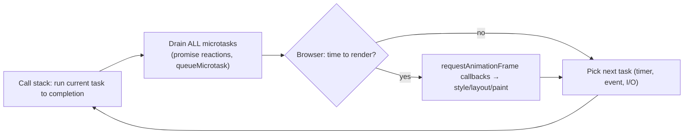
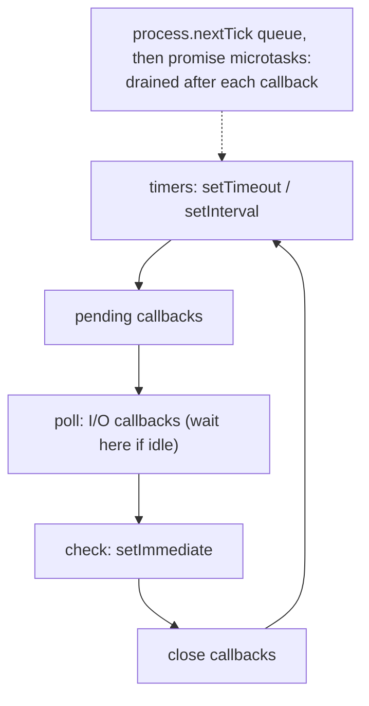

# Event Loop, Microtasks vs Macrotasks

!!! abstract "Key takeaways"
    - JavaScript runs on **one thread per agent** with a **call stack**. Long synchronous work blocks everything (input, rendering). Async APIs (timers, network, I/O) are provided by the host (browser or Node) and report back by queuing callbacks.
    - **Event loop:** take one **task (macrotask)** from a task queue, run it to completion, then **drain the entire microtask queue**, then (in browsers) maybe **render**, repeat.
    - **Tasks:** `setTimeout`, `setInterval`, I/O callbacks, UI events, `MessageChannel`, `setImmediate` (Node). **Microtasks:** promise reactions (`.then`, `await` continuations), `queueMicrotask`, `MutationObserver`; Node's `process.nextTick` runs even before promise microtasks.
    - Microtasks can starve the loop: if they keep scheduling microtasks, tasks and rendering never run. `setTimeout(fn, 0)` is "at least 0 ms, after the current task and its microtasks", clamped to ≥ 4 ms after nested timers.
    - `await x` splits a function: code before runs synchronously; the rest is a microtask after `x` settles. `requestAnimationFrame` runs before the next paint; heavy work goes to Web Workers or is chunked.

## Why it matters

The event loop explains UI freezes, why `setTimeout(0)` doesn't run "immediately", the order of logs in async code, and why a CPU-heavy loop in Node stalls every request. Output-prediction questions on promise/timer ordering are among the most common JavaScript interview questions.


*Notice microtasks run to exhaustion between tasks and before rendering. That's why a promise callback always beats a `setTimeout(0)`, and why an endless microtask chain freezes the page.*

## Core concepts

### The pieces

- **Call stack:** frames of currently executing functions; one at a time (run-to-completion).
- **Heap:** objects.
- **Host APIs:** timers, fetch, DOM events, file system; they run outside JS and queue callbacks.
- **Task queues:** one or more FIFO queues of tasks; the browser may prioritise between them (e.g. input over timers).
- **Microtask queue:** processed after each task and after each callback when the stack empties.

### Order within one turn

1. Run synchronous code of the current task.
2. When the stack is empty, run **all** microtasks (including ones they schedule).
3. Browser may render (rAF → style → layout → paint) roughly every frame (~16.7 ms at 60 Hz).
4. Next task.

### Classic output question

```js
console.log("1");
setTimeout(() => console.log("2"), 0);
Promise.resolve().then(() => console.log("3"));
queueMicrotask(() => console.log("4"));
(async () => {
  console.log("5");
  await null;
  console.log("6");
})();
console.log("7");
// Output: 1 5 7 3 4 6 2
```

Why: synchronous `1`, `5` (async function body runs synchronously until the first `await`), `7`; then microtasks in queue order `3`, `4`, `6`; then the timer task `2`.

### async/await mechanics

- `async` functions always return a promise.
- `await v` wraps `v` in a resolved promise (if not already) and schedules the rest of the function as a microtask once it settles.
- Awaiting a native promise takes one microtask tick for the continuation (modern engines optimise this).
- `return await` vs `return`: same value, but `return await` inside `try` lets the `catch` handle the rejection.

### Node.js event loop phases


*Notice Node has phases, and between every callback it drains `process.nextTick` first, then promise microtasks. `setImmediate` runs in the check phase right after I/O.*

- `process.nextTick` callbacks run before promise microtasks; recursive nextTick starves I/O.
- `setImmediate` vs `setTimeout(0)`: order is non-deterministic in the main module, but inside an I/O callback `setImmediate` always runs first.
- libuv's thread pool (default 4 threads) handles fs, DNS lookup, crypto, zlib; network I/O is non-blocking in the kernel.
- CPU-bound work blocks all requests: use worker threads or a separate service.

### Rendering and responsiveness

- Long tasks (> 50 ms) hurt **INP**. Break work into chunks (`scheduler.yield()` where supported, `setTimeout`, `requestIdleCallback`) or move it to a **Web Worker**.
- `requestAnimationFrame` for visual updates synced to frames.
- `MessageChannel` posts a task without the 4 ms timer clamp (used by React's scheduler).

## In practice: code & configuration

### Chunking a long task

=== "❌ Common mistake"
    ```js
    function processClaims(claims) {
      for (const c of claims) heavyNormalise(c);   // 200k items: blocks input and paint for seconds
      render(claims);
    }
    ```

=== "✅ Correct approach"
    ```js
    async function processClaims(claims, chunk = 500) {
      for (let i = 0; i < claims.length; i += chunk) {
        claims.slice(i, i + chunk).forEach(heavyNormalise);
        await yieldToMain();                         // let input and rendering run
      }
      render(claims);
    }
    function yieldToMain() {
      if (globalThis.scheduler?.yield) return scheduler.yield();
      return new Promise(r => setTimeout(r, 0));
    }
    // Truly CPU-heavy: move to a Web Worker (or worker_threads in Node).
    ```

### Microtask starvation

```js
function spin() { Promise.resolve().then(spin); }   // never yields: timers, events, rendering starve
```

### Node: ordering with nextTick and setImmediate

```js
const fs = require("node:fs");
fs.readFile(__filename, () => {
  setTimeout(() => console.log("timeout"), 0);
  setImmediate(() => console.log("immediate"));
  process.nextTick(() => console.log("nextTick"));
  Promise.resolve().then(() => console.log("promise"));
});
// nextTick, promise, immediate, timeout
```

## Real-world usage

- React's scheduler uses `MessageChannel` tasks to yield between units of work so input stays responsive; concurrent rendering is cooperative scheduling on top of the event loop.
- Node servers (BFFs, GraphQL gateways) stay fast only if handlers are non-blocking; a synchronous JSON.parse of a huge payload or a crypto loop stalls every request.
- **Healthcare UIs:** large claims or prescription datasets parsed on the main thread cause frozen screens on low-end devices; workers or server-side processing fix it.

## Trade-offs & production gotchas

| Technique | Use for | Watch out |
|---|---|---|
| Promise/microtask | Continuations, ordering after current code | Starvation if recursive |
| `setTimeout(0)` | Yield to other tasks/rendering | ≥ 4 ms clamp when nested, not precise |
| `requestAnimationFrame` | Visual updates per frame | Paused in background tabs |
| `requestIdleCallback` | Low-priority work | May not run under load; not in Safari historically |
| `scheduler.yield()` | Yielding with priority continuation | Check support |
| Web Worker | CPU-heavy work | Messaging cost, no DOM |

!!! warning "Gotcha: async functions run synchronously at first"
    Code before the first `await` runs immediately in the caller's task; an expensive synchronous prefix still blocks.

!!! warning "Gotcha: unhandled rejections"
    A rejected promise with no handler triggers `unhandledrejection` (browser) or crashes Node (default since v15). Always handle or propagate.

!!! question "Interview angle"
    Output-ordering puzzles with sync code, timers, promises, async/await and `queueMicrotask` (and nextTick/setImmediate for Node). State the rules, then trace the queues.

## How this connects to my experience

Not ★. Relevant to the OptumRx React application (responsiveness with large data) and any Node tooling/BFF work.

- **Where I used it:** React UI performance on long lists; async data flows with React Query and GraphQL. *[confirm any Node.js services (BFF, build tooling) and any main-thread performance issue you fixed]*
- **Talking points:**
    - "When a screen froze while processing large responses, I moved the work off the main thread or chunked it so input stayed responsive." *[confirm]*
    - "In Java terms, the event loop is like a single-threaded executor: never block it; push CPU work elsewhere." (bridge from the Java concurrency topic)
- **Likely follow-up chain:** "Explain the event loop" → "Microtask vs macrotask?" → "Predict this output" → "Why does the UI freeze?" → "How does Node differ?"

## Interview questions

### Fundamentals

??? question "Q1. Is JavaScript single-threaded?"
    **Answer:** Each agent runs JS on one thread with one call stack; the host provides concurrency (timers, I/O, workers) and queues callbacks back.

    **Interviewer listens for:** one call stack per agent, host provides concurrency, workers for parallel JS.

    **Common wrong answer:** "JavaScript is multi-threaded because of async." Async waits are handled by the host, not by more JS threads.

??? question "Q2. What is the event loop?"
    **Answer:** The mechanism that repeatedly takes a task from a queue, runs it to completion, drains the microtask queue, optionally renders, and repeats.

    **Interviewer listens for:** task → drain microtasks → render → repeat, run to completion.

    **Common wrong answer:** "The event loop runs callbacks in parallel."

??? question "Q3. Microtask vs macrotask examples?"
    **Answer:** Microtasks: promise reactions, await continuations, queueMicrotask, MutationObserver (Node: process.nextTick first). Tasks: setTimeout/setInterval, events, I/O, MessageChannel, setImmediate.

    **Interviewer listens for:** promise/await/queueMicrotask vs timers/events/I/O, nextTick in Node.

    **Common wrong answer:** Classing setTimeout callbacks as microtasks.

### Intermediate

??? question "Q4. Why does a resolved promise's then run before setTimeout(0)?"
    **Answer:** After the current task, all microtasks drain before the next task; the timer callback is a task.

    **Interviewer listens for:** microtask queue drains fully before the next task.

    **Common wrong answer:** "Promises are faster than timers." It is about queue priority, not speed.

??? question "Q5. Predict: `setTimeout(()=>log(1)); Promise.resolve().then(()=>log(2)); log(3)`"
    **Answer:** 3, 2, 1.

    **Interviewer listens for:** sync first, then microtasks, then tasks.

    **Common wrong answer:** "1, 2, 3 because that is the order they were written."

??? question "Q6. What does await do to execution?"
    **Answer:** Runs the function synchronously until await, then returns a pending promise; the rest resumes as a microtask after the awaited value settles.

    **Interviewer listens for:** sync until first await, returns a promise, continuation as microtask.

    **Common wrong answer:** "await blocks the thread until the promise resolves." It suspends only the async function.

??? question "Q7. Why is setTimeout(fn, 0) not immediate?"
    **Answer:** It queues a task after the current task and all microtasks, possibly after rendering, with a minimum delay (≥ 4 ms when nested 5+ levels).

    **Interviewer listens for:** task after microtasks and rendering, nested clamp to 4 ms.

    **Common wrong answer:** "0 ms means immediate."

### Senior

??? question "Q8. How does Node's event loop differ from the browser's?"
    **Answer:** libuv phases (timers, pending, poll, check, close), process.nextTick before promise microtasks after each callback, setImmediate in check phase, thread pool for fs/crypto/dns; no rendering step.

    **Interviewer listens for:** libuv phases, nextTick priority, setImmediate in check phase, thread pool, no rendering.

    **Common wrong answer:** "Node and browsers have the same event loop."

??? question "Q9. What is microtask starvation?"
    **Answer:** Microtasks that keep queuing microtasks prevent tasks and rendering from running, freezing the page or server.

    **Interviewer listens for:** recursive microtasks block tasks and rendering.

    **Common wrong answer:** "Promises can never block the page." An endless chain of microtasks freezes it.

??? question "Q10. How do you keep the UI responsive with heavy computation?"
    **Answer:** Chunk work and yield (scheduler.yield/setTimeout), move CPU work to Web Workers, avoid long tasks over 50 ms, measure with INP and Performance panel.

    **Interviewer listens for:** chunking and yielding, Web Workers, long-task budget, INP measurement.

    **Common wrong answer:** "Make the function async." An async function still runs its CPU work on the main thread.

??? question "Q11. Predict the output, then explain each step."
    **Answer:** `A G C D F B E` (verified in Node 22).

    ```js
    console.log('A');
    setTimeout(() => console.log('B'), 0);
    queueMicrotask(() => console.log('C'));
    Promise.resolve().then(() => { console.log('D'); setTimeout(() => console.log('E'), 0); })
      .then(() => console.log('F'));
    console.log('G');
    ```

    1. Synchronous code runs first: `A`, `G`. One timer task (B) and two microtasks (C, D) are queued.
    2. Microtasks drain in FIFO order: `C`, then `D`. D queues a second timer (E) and resolves the promise, which queues `F` as a **new microtask**.
    3. The queue is not empty yet, so `F` runs before any task.
    4. Tasks run in order: `B` (queued first), then `E`.

    **Interviewer listens for:** sync first, microtasks drain completely including ones added during draining, timers in queue order.

    **Common wrong answer:** `A G B C D E F` (timers before promises) or `A G C D B F E` (forgetting that F joins the microtask queue before any task runs).

### Scenario-based

??? question "Q12. A Node API's p99 spikes when one endpoint generates a PDF. Why?"
    **Answer:** CPU-bound work blocks the single event-loop thread, stalling all requests. Move it to worker_threads, a queue + worker service, or a separate process.

    **Interviewer listens for:** CPU-bound work blocks all requests, worker_threads or a separate worker service.

    **Common wrong answer:** "Add more async/await to the PDF code."

??? question "Q13. Predict: `async function a(){ log(1); await b(); log(2) } async function b(){ log(3) } a(); log(4)`"
    **Answer:** 1, 3, 4, 2.

    **Interviewer listens for:** b runs synchronously until its end, await defers the rest of a.

    **Common wrong answer:** "1, 2, 3, 4" or "1, 3, 2, 4". `log(2)` waits for the microtask after `log(4)`.

## Cheat sheet

| Concept | Remember |
|---|---|
| Loop | Task → drain microtasks → (render) → next task |
| Microtasks | then/await, queueMicrotask, MutationObserver |
| Tasks | timers, events, I/O, MessageChannel, setImmediate |
| Node extra | process.nextTick before promises; phases; setImmediate in check |
| await | Sync until await; continuation = microtask |
| setTimeout(0) | After current task + microtasks; ≥ 4 ms nested clamp |
| rAF | Before paint |
| Long task | > 50 ms hurts INP → chunk/yield/worker |
| Unhandled rejection | Crashes Node (v15+) |

## Sources

1. [MDN: JavaScript execution model (event loop)](https://developer.mozilla.org/en-US/docs/Web/JavaScript/Event_loop).
2. [MDN: Using microtasks (queueMicrotask guide)](https://developer.mozilla.org/en-US/docs/Web/API/HTML_DOM_API/Microtask_guide).
3. [HTML Living Standard: Event loops](https://html.spec.whatwg.org/multipage/webappapis.html#event-loops).
4. [Node.js: The Node.js Event Loop](https://nodejs.org/en/learn/asynchronous-work/event-loop-timers-and-nexttick).
5. [Jake Archibald: Tasks, microtasks, queues and schedules](https://jakearchibald.com/2015/tasks-microtasks-queues-and-schedules/).
6. [web.dev: Optimize long tasks](https://web.dev/articles/optimize-long-tasks): yielding, scheduler.yield.
