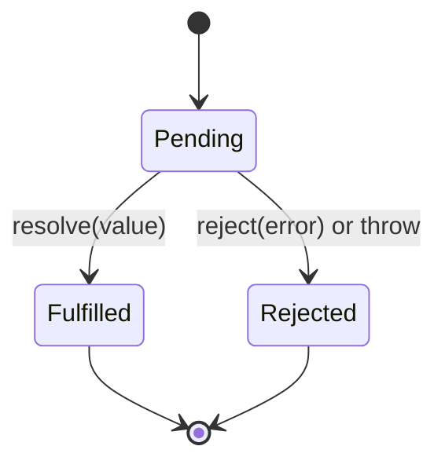
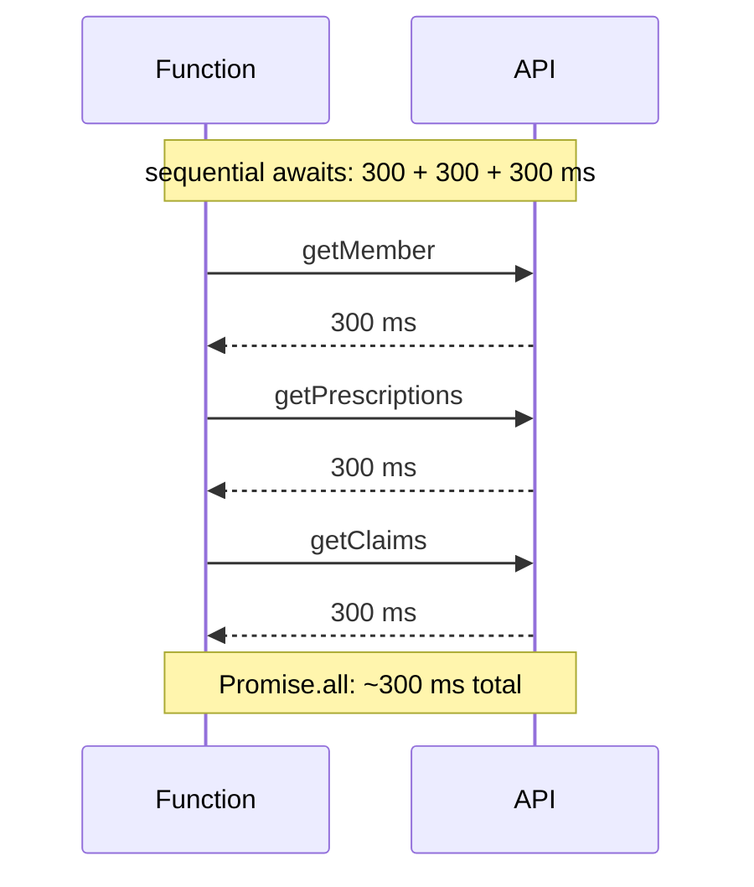

# Promises, async/await & Error Handling

!!! abstract "TL;DR"
    - A **Promise** is a placeholder for a future value: **pending → fulfilled or rejected** (settled once, immutable). `.then` returns a **new promise**, so chains pass values (or thrown errors) along.
    - **Combinators:** `Promise.all` (all succeed, fails fast), `allSettled` (wait for all, never rejects), `race` (first to settle), `any` (first to fulfil, `AggregateError` if all reject). Plus `Promise.withResolvers()` (ES2024) and `Promise.try()` (ES2025).
    - **async/await** is syntax over promises: `await` pauses the function (not the thread); use `try/catch/finally`. Run independent work **in parallel** (`Promise.all`), not with sequential `await`s in a loop.
    - **Errors:** a thrown error inside `then`/async becomes a rejection; always end chains with handling. Unhandled rejections crash Node (default since v15) and fire `unhandledrejection` in browsers. `forEach` doesn't wait for async callbacks.
    - **Cancellation:** promises can't be cancelled; use **`AbortController`/`AbortSignal`** (fetch, timeouts via `AbortSignal.timeout()`, `AbortSignal.any()`). Limit concurrency (p-limit pattern) and retry with backoff for idempotent calls.

## Why it matters

Almost every frontend and Node feature is asynchronous: fetching, auth token refresh, file uploads, websockets. Most async bugs are ordering (waterfalls, races), lost errors (no catch, `forEach(async)`), or missing cancellation (stale responses overwriting new ones). Interviewers also ask you to implement `Promise.all` or a retry helper.


*Notice there's no way back and no "cancelled" state: once settled, a promise never changes. Cancellation is a separate signal (AbortController) that makes the underlying work stop and the promise reject.*

## Core concepts

### Creating and chaining

```js
const p = new Promise((resolve, reject) => {     // executor runs synchronously
  setTimeout(() => resolve(42), 100);
});
p.then(v => v + 1)              // returns a new promise with 43
 .then(v => { throw new Error("boom"); })
 .catch(e => "recovered")       // catch handles any earlier rejection; returns a fulfilled promise
 .finally(() => cleanup());     // runs either way; passes through the value/error
```

- Returning a promise (thenable) from `then` adopts its state (flattening).
- Callbacks always run asynchronously (microtasks), even for already-resolved promises.
- `Promise.resolve(x)` / `Promise.reject(e)` create settled promises.

### Combinators

| Method | Resolves when | Rejects when | Use for |
|---|---|---|---|
| `Promise.all([...])` | All fulfil (array of values, input order) | First rejection (others keep running) | Independent calls that are all required |
| `Promise.allSettled` | All settle (`{status, value/reason}`) | Never | Partial results, dashboards |
| `Promise.race` | First settles | First settles with rejection | Timeouts (prefer AbortSignal) |
| `Promise.any` | First fulfils | All reject (`AggregateError`) | Redundant sources, fastest mirror |

### async/await

```js
async function loadDashboard(memberId) {
  const [member, rx, claims] = await Promise.all([      // parallel
    getMember(memberId), getPrescriptions(memberId), getClaims(memberId),
  ]);
  return { member, rx, claims };
}
```

- `await` only pauses this function; other tasks keep running.
- Top-level `await` works in ES modules.
- Sequential awaits in a loop serialise work; use `Promise.all` with `map`, or `for await...of` for async iterables when order matters.


*Notice independent requests awaited one after another add up their latency. Start them together and await all.*

### Error handling

- In async functions, `try/catch` catches awaited rejections; errors in non-awaited promises escape it.
- `return await` inside `try` to catch the rejection there; plain `return promise` skips the local catch.
- `array.forEach(async x => ...)` doesn't wait and loses errors; use `for...of` with await or `Promise.all(array.map(...))`.
- Global safety nets: `window.addEventListener("unhandledrejection", ...)`, `process.on("unhandledRejection", ...)` (log and exit in Node).
- `Promise.all` rejection doesn't cancel other calls: pass an `AbortSignal` to stop them.
- Error types: `AggregateError` (any), `DOMException` with name `AbortError`/`TimeoutError`.
- `Error.cause` (ES2022) to chain errors: `throw new Error("Load failed", { cause: e })`.

### Cancellation and timeouts

```js
const controller = new AbortController();
const signal = AbortSignal.any([controller.signal, AbortSignal.timeout(5000)]);  // user cancel OR 5 s
const res = await fetch(url, { signal });
// controller.abort() → fetch rejects with AbortError
```

React: abort in effect cleanup (or let React Query pass `signal` to your query function).

### Concurrency limits and retries

- Firing 1,000 requests at once overwhelms servers and browsers (≈6 connections per host on HTTP/1.1). Limit with a pool (p-limit) or batch.
- Retry only idempotent operations, exponential backoff with jitter, cap attempts, respect `Retry-After`, and stop on abort.

## In practice: code & configuration

=== "❌ Common mistake"
    ```js
    async function refreshAll(memberIds) {
      memberIds.forEach(async id => {           // not awaited; errors become unhandled rejections
        await refresh(id);
      });
      const m = await getMember();               // sequential
      const r = await getRx();                   // independent of m, but waits for it
      fetchClaims().then(render);                // floating promise, no catch
    }
    ```

=== "✅ Correct approach"
    ```js
    async function refreshAll(memberIds, { signal } = {}) {
      const limit = pLimit(5);                                    // at most 5 in flight
      const results = await Promise.allSettled(
        memberIds.map(id => limit(() => refresh(id, { signal })))
      );
      const failed = results.filter(r => r.status === "rejected");
      if (failed.length) log.warn("refresh failures", { count: failed.length });   // no PHI

      const [member, rx] = await Promise.all([getMember({ signal }), getRx({ signal })]); // parallel
      return { member, rx };
    }
    ```

### Retry with backoff and abort

```js
async function withRetry(fn, { retries = 3, base = 200, signal } = {}) {
  for (let attempt = 0; ; attempt++) {
    try {
      return await fn({ signal });
    } catch (e) {
      if (signal?.aborted || attempt >= retries || !isTransient(e)) throw e;
      const delay = base * 2 ** attempt * (0.5 + Math.random());      // exponential + jitter
      await new Promise((r, rej) => {
        const t = setTimeout(r, delay);
        signal?.addEventListener("abort", () => { clearTimeout(t); rej(signal.reason); }, { once: true });
      });
    }
  }
}
```

### Implementing Promise.all (common interview task)

```js
function promiseAll(items) {
  return new Promise((resolve, reject) => {
    const results = [];
    let remaining = items.length;
    if (remaining === 0) return resolve(results);
    items.forEach((item, i) => {
      Promise.resolve(item).then(v => {
        results[i] = v;                         // keep input order
        if (--remaining === 0) resolve(results);
      }, reject);                               // first rejection wins
    });
  });
}
```

## Real-world usage

- Data libraries (React Query, SWR, Apollo) wrap promises with caching, deduplication, retries, cancellation (passing `signal`) and error states.
- `AbortSignal.timeout()` and `AbortSignal.any()` are supported in modern browsers and Node, replacing `Promise.race` timeout hacks.
- **Healthcare:** parallel loading of member, prescriptions and claims with `allSettled` lets a dashboard show partial data when one backend fails; idempotent retries only, and no PHI in logged error messages.

## Trade-offs & production gotchas

| Pattern | Use when | Watch out |
|---|---|---|
| Sequential await | Each step needs the previous result | Waterfalls otherwise |
| `Promise.all` | All required, independent | Fails fast; others keep running |
| `Promise.allSettled` | Partial results acceptable | Must inspect statuses |
| `Promise.any` | Any one source suffices | AggregateError handling |
| Concurrency pool | Many requests | Choose limit per backend |
| AbortController | Cancellation, timeouts | Pass signal everywhere down the chain |

!!! warning "Gotcha: floating promises"
    Calling an async function without `await`/`.catch` hides errors and ordering. Lint with `@typescript-eslint/no-floating-promises`.

!!! warning "Gotcha: async in array callbacks"
    `forEach`, `filter`, `reduce` don't await async callbacks. Use `for...of` or `Promise.all(map)`.

!!! warning "Gotcha: try/catch around a non-awaited promise"
    `try { doAsync() } catch {}` catches nothing from the async part.

!!! question "Interview angle"
    "all vs allSettled vs race vs any", "make these calls parallel", "implement Promise.all / retry / timeout", "how do you cancel a fetch?", "what happens to an unhandled rejection?".

## How this connects to my experience

Not ★. Daily in the OptumRx React app (data fetching, token refresh) and conceptually mirrors `CompletableFuture` in the Java services (see Java concurrency topic: `allOf`, timeouts, cancellation).

- **Where I used it:** React Query/GraphQL clients in the OptumRx app; any Node scripts or BFF. *[confirm specifics]*
- **Talking points:**
    - "Independent requests ran in parallel; dashboards used allSettled-style partial results matching GraphQL partial data." *[confirm]*
    - "Requests were cancelled via AbortSignal when the user navigated away, so stale responses never overwrote new ones." *[confirm React Query signal usage]*
    - "It's the same model as CompletableFuture: allOf = Promise.all, orTimeout = AbortSignal.timeout, and in both cases cancelling the wrapper doesn't stop work unless the signal reaches the I/O."
- **Likely follow-up chain:** "Promise.all vs allSettled?" → "How do you cancel?" → "Write a retry helper" → "How do you limit concurrency?" → "Unhandled rejections in Node?"

## Interview questions

### Fundamentals

??? question "Q1. What are the states of a promise?"
    **Answer:** Pending, then settled as fulfilled (value) or rejected (reason), permanently.

??? question "Q2. Promise.all vs allSettled?"
    **Answer:** all resolves with all values or rejects on the first failure; allSettled waits for every promise and reports each outcome, never rejecting.

??? question "Q3. What does async/await compile down to conceptually?"
    **Answer:** A function returning a promise, with each await splitting the function into continuations scheduled as microtasks when awaited promises settle.

### Intermediate

??? question "Q4. race vs any?"
    **Answer:** race settles with the first settled (fulfil or reject); any fulfils with the first fulfilment and rejects only if all reject (AggregateError).

??? question "Q5. Why doesn't forEach work with async callbacks?"
    **Answer:** forEach ignores returned promises, so it doesn't wait and rejections become unhandled. Use for...of with await or Promise.all(map).

??? question "Q6. How do you run three independent requests efficiently?"
    **Answer:** Start all, then `await Promise.all([...])` (or allSettled for partial results).

??? question "Q7. How do you cancel a fetch?"
    **Answer:** Pass an AbortSignal from an AbortController (or AbortSignal.timeout) and call abort(); fetch rejects with AbortError.

### Senior

??? question "Q8. Does a rejected Promise.all cancel the other promises?"
    **Answer:** No. Promises aren't cancellable; others continue. Share an AbortSignal and abort on first failure if needed.

??? question "Q9. What happens to unhandled rejections?"
    **Answer:** Browser fires unhandledrejection and logs; Node (v15+) crashes the process by default. Handle at boundaries and add global logging.

??? question "Q10. return vs return await inside try?"
    **Answer:** return await lets the local catch/finally handle the rejection; plain return passes the promise out, bypassing the catch.

### Scenario-based

??? question "Q11. Upload 500 files without overwhelming the server."
    **Answer:** Concurrency pool (e.g. 4–6 at a time), retries with backoff for transient failures, progress tracking, allSettled to report failures, abort on cancel.

??? question "Q12. Implement a timeout for any promise-returning call."
    **Answer:** Prefer passing `AbortSignal.timeout(ms)` to APIs that accept signals; otherwise race with a timer that rejects, and clear the timer when done.

## Cheat sheet

| Concept | Remember |
|---|---|
| States | pending → fulfilled / rejected, once |
| then | Returns new promise; callbacks are microtasks |
| all / allSettled / race / any | All or fail fast / all outcomes / first settle / first success |
| New APIs | `Promise.withResolvers` (ES2024), `Promise.try` (ES2025) |
| Parallel | Start all, `await Promise.all` |
| Errors | try/catch with await; `return await` in try; `Error.cause` |
| forEach | Doesn't await |
| Cancel | AbortController, `AbortSignal.timeout`, `AbortSignal.any` |
| Unhandled | Node crashes (v15+); browser event |
| Concurrency | Pool/p-limit; ~6 conns per host on HTTP/1.1 |

## Sources

1. [MDN: Using promises](https://developer.mozilla.org/en-US/docs/Web/JavaScript/Guide/Using_promises).
2. [MDN: Promise (all, allSettled, race, any, withResolvers, try)](https://developer.mozilla.org/en-US/docs/Web/JavaScript/Reference/Global_Objects/Promise).
3. [MDN: async function](https://developer.mozilla.org/en-US/docs/Web/JavaScript/Reference/Statements/async_function).
4. [MDN: AbortController](https://developer.mozilla.org/en-US/docs/Web/API/AbortController) and [AbortSignal.timeout / any](https://developer.mozilla.org/en-US/docs/Web/API/AbortSignal).
5. [Node.js: unhandled rejections (`--unhandled-rejections`)](https://nodejs.org/api/cli.html#--unhandled-rejectionsmode).
6. [typescript-eslint: no-floating-promises](https://typescript-eslint.io/rules/no-floating-promises/).
