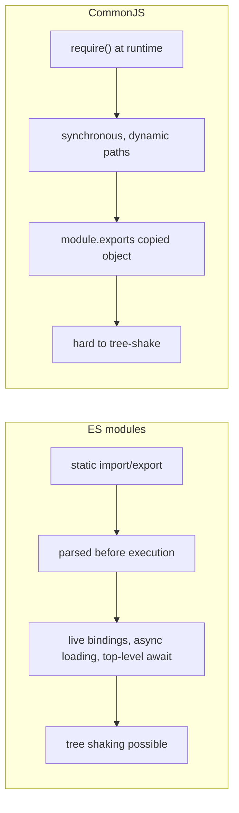
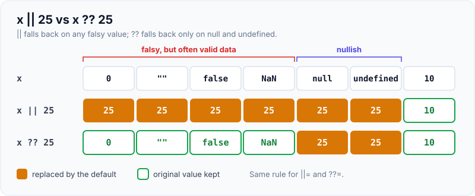
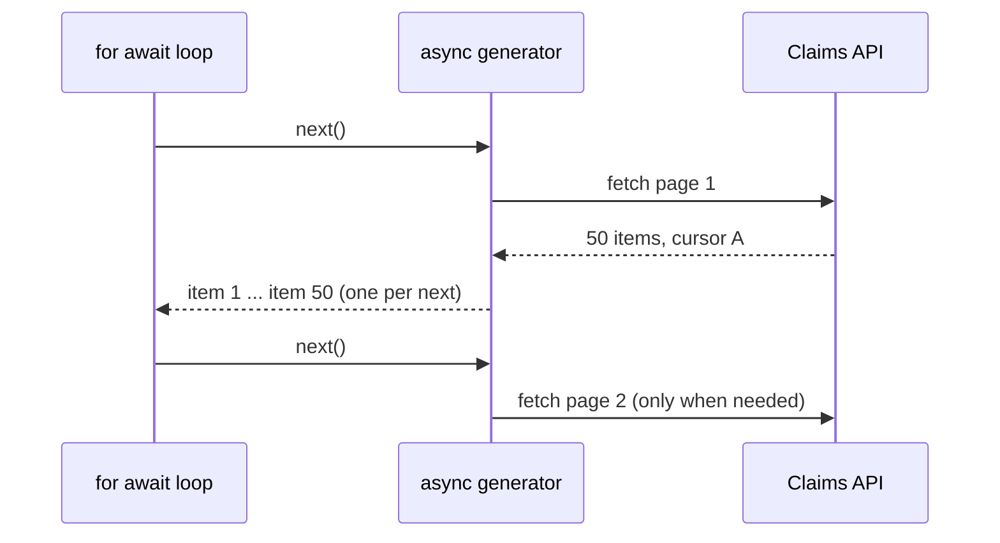

# ES6+ Features (Destructuring, Modules, Spread, Optional Chaining, Iterators/Generators)

!!! abstract "Key takeaways"
    - **Destructuring** pulls values out of objects/arrays with defaults and renames; **spread** (`...`) copies/merges (shallow); **rest** collects the remaining items/props.
    - **ES modules** (`import`/`export`) are static, strict, live-binding, and tree-shakable; **CommonJS** (`require`) is dynamic, synchronous and copies values. Node supports both; modern code is ESM (TypeScript 6.0 defaults `module` to `esnext`).
    - **Optional chaining** `a?.b?.()` stops at `null`/`undefined`; **nullish coalescing** `??` defaults only on `null`/`undefined` (unlike `||`, which also replaces `0`, `""`, `false`). `??=`, `||=`, `&&=` logical assignment.
    - **Iterators** (objects with `next()`) power `for...of`, spread and destructuring; **generators** (`function*`, `yield`) create them lazily; async generators with `for await...of` for streams and pagination.
    - Recent additions to know: `Map`/`Set` (+ ES2025 Set methods), `Object.groupBy` (ES2024), non-mutating array methods `toSorted`/`toReversed`/`with` (ES2023), `at()`, `structuredClone`, **iterator helpers** (ES2025: `.map/.filter/.take` on iterators), `Promise.try`, `RegExp.escape` (ES2025), Temporal (date/time) reaching stage 4.

## Why it matters

Modern codebases (React, Node, TypeScript) use these features everywhere, and interviews check you know the semantics, not just the syntax: shallow copies, `??` vs `||`, ESM vs CommonJS interop, why tree shaking needs ESM, and how generators enable lazy sequences. They also signal how current your JavaScript is.


*Notice ESM's import graph is known before code runs. That's what lets bundlers drop unused exports and browsers load modules in parallel.*

## Core concepts

### Destructuring, spread and rest

```js
const { id, name: fullName = "Unknown", address: { zip } = {} } = member;   // rename, default, nested
const [first, , third = 0, ...others] = values;                             // skip, default, rest

const updated = { ...member, name: "Ana" };          // shallow copy + override
const merged = [...a, ...b];
function log(level, ...messages) {}                  // rest parameters (real array, unlike arguments)
```

- Spread copies **one level**: nested objects are shared references.
- Object spread copies own enumerable properties (not prototype, not getters as getters).
- Defaults apply only when the value is `undefined`, not `null`.

### Modules

| | ESM | CommonJS |
|---|---|---|
| Syntax | `import`/`export` | `require`/`module.exports` |
| Resolution | Static, before execution | Dynamic, at runtime |
| Loading | Async-capable; top-level await | Synchronous |
| Bindings | Live (exporter's updates visible) | Copy of `exports` value at require time |
| Strict mode | Always | Optional |
| Tree shaking | Yes | Limited |
| Node | `.mjs` or `"type": "module"` | `.cjs` or default |

- Dynamic `import()` returns a promise (code splitting, conditional loading); works in both.
- Node 22+ can `require()` synchronous ESM graphs (no top-level await), easing interop.
- Import attributes: `import data from "./x.json" with { type: "json" }` (ES2025; TypeScript 6 removed the old `assert` syntax).
- Default vs named exports: named exports are better for refactoring, auto-imports and tree shaking.

{ loading=lazy }
*Watch the importer's box after `inc()` runs. In ESM it is a view of the exporter's variable; in CommonJS it is a value copied once, which never changes.*

### Optional chaining and nullish coalescing

```js
const zip = member?.address?.zip;          // undefined if any link is null/undefined
member.onUpdate?.(changes);                // call only if defined
const pageSize = settings.pageSize ?? 20;  // 0 stays 0
const label = input || "N/A";              // "" and 0 become "N/A" (often a bug)
config.retries ??= 3;                      // assign only if null/undefined
```

{ loading=lazy }
*Notice the four left columns: valid values like `0` and `""` survive `??` but are lost with `||`.*

### Iterators and generators

- An **iterable** has `[Symbol.iterator]()` returning an **iterator** with `next()` → `{ value, done }`. Arrays, strings, Maps, Sets, arguments, NodeLists are iterable; plain objects are not (use `Object.entries`).
- **Generators** produce iterators lazily and can pause/resume:

```js
function* ids(start = 1) { let i = start; while (true) yield i++; }   // infinite, lazy
const firstThree = ids().take(3).toArray();                          // ES2025 iterator helpers → [1, 2, 3]
```

- **Async generators** + `for await...of` model paginated APIs and streams:

```js
async function* allClaims(memberId, signal) {
  let cursor = null;
  do {
    const page = await fetchClaims(memberId, cursor, { signal });
    yield* page.items;
    cursor = page.nextCursor;
  } while (cursor);
}
for await (const claim of allClaims(id, signal)) process(claim);
```


*Notice pages are fetched lazily, only when the consumer asks for more. The caller can break early and no further pages are requested.*

### Collections and other modern features

| Feature | Version | Note |
|---|---|---|
| `Map` / `Set` / `WeakMap` / `WeakSet` | ES2015 | Any keys; insertion order; Weak* hold keys weakly |
| Template literals, tagged templates | ES2015 | Tagged: `sql\`...\`` for safe interpolation |
| Classes, arrow functions, `let`/`const`, default params | ES2015 | |
| `Object.entries/values`, `padStart` | ES2017 | |
| Optional catch binding, `flat`/`flatMap` | ES2019 | |
| `?.`, `??`, `BigInt`, `Promise.allSettled`, `globalThis` | ES2020 | |
| `??=`/`||=`/`&&=`, `replaceAll`, `Promise.any` | ES2021 | |
| Class fields, `#private`, top-level await, `at()`, `Object.hasOwn`, `Error.cause` | ES2022 | |
| `toSorted`, `toReversed`, `toSpliced`, `with`, `findLast` | ES2023 | Non-mutating array methods |
| `Object.groupBy`, `Map.groupBy`, `Promise.withResolvers`, `Array.fromAsync`* | ES2024 | *ES2024/2025 by engine |
| Iterator helpers, Set methods (`union`, `intersection`...), `Promise.try`, `RegExp.escape`, JSON modules, `Float16Array` | ES2025 | |
| Temporal | Stage 4 (2026) | Replaces `Date` for real date/time work; TypeScript 6.0 ships its types |
| `structuredClone` | Web/Node API | Deep clone (see copying page) |

## In practice: code & configuration

=== "❌ Common mistake"
    ```js
    const pageSize = query.pageSize || 25;                 // pageSize=0 from the UI becomes 25
    const city = member.address.city;                       // TypeError if address is missing
    const sorted = claims.sort((a, b) => a.date - b.date);  // mutates the prop/state array in place
    const copy = { ...member }; copy.address.zip = "00000"; // shallow: original member mutated too
    module.exports = { formatDate };                        // CJS in a frontend lib: no tree shaking
    ```

=== "✅ Correct approach"
    ```js
    const pageSize = query.pageSize ?? 25;
    const city = member.address?.city ?? "Unknown";
    const sorted = claims.toSorted((a, b) => a.date - b.date);         // ES2023, returns a new array
    const copy = { ...member, address: { ...member.address, zip: "00000" } };  // copy the nested level
    export function formatDate(d) { /* ... */ }                         // named ESM export
    const byStatus = Object.groupBy(claims, c => c.status);             // ES2024
    ```

## Real-world usage

- Bundlers (Vite/Rollup, esbuild, webpack) rely on ESM for tree shaking; libraries publish ESM (often dual ESM/CJS).
- Node has moved towards ESM; `require(esm)` support and TypeScript 6.0's ESM defaults reduce interop pain.
- React and Redux code leans on spread/destructuring for immutable updates; Immer simplifies deep updates.
- **Healthcare:** optional chaining avoids crashes on partially available data (GraphQL partial results); `??` preserves legitimate zero values (copay $0); avoid mutating shared data structures that hold member data.

## Trade-offs & production gotchas

| Feature | Gotcha |
|---|---|
| Spread copy | Shallow: nested objects shared |
| Default values | Apply only for `undefined`, not `null` |
| `||` default | Replaces `0`, `""`, `false` |
| `?.` overuse | Hides data bugs; validate at boundaries instead |
| CJS ↔ ESM | Default export interop, `__dirname` missing in ESM (`import.meta.dirname`) |
| Generators | Infinite ones need `take`/break |
| `sort()` | Mutates and sorts as strings by default (`[10, 9, 1].sort()` → `[1, 10, 9]`) |

!!! question "Interview angle"
    "?? vs ||", "spread is shallow, prove it", "ESM vs CommonJS and why tree shaking needs ESM", "what is a generator, give a use case", "what's new in recent ECMAScript versions?".

## How this connects to my experience

Not ★. Everyday in the OptumRx React/TypeScript codebase and micro-frontends.

- **Where I used it:** OptumRx React app (ESM modules, dynamic `import()` for micro-frontends/route splitting, immutable updates with spread in Redux reducers). *[confirm: Redux Toolkit (Immer) vs hand-written reducers; bundler]*
- **Talking points:**
    - "Redux Toolkit's Immer let us write 'mutating' reducers that produce immutable updates, avoiding nested spread bugs." *[confirm]*
    - "Micro-frontends were loaded with dynamic import, which is ESM's built-in code splitting." *[confirm mechanism]*
- **Likely follow-up chain:** "?? vs ||?" → "Is spread a deep copy?" → "ESM vs CJS?" → "Generator use case?" → "Newest JS feature you use?"

## Interview questions

### Fundamentals

??? question "Q1. ?? vs ||?"
    **Answer:** `??` returns the right side only for null/undefined; `||` for any falsy value (0, "", false, NaN, null, undefined).

    **Interviewer listens for:** nullish vs falsy, 0 and "" as valid values.

    **Common wrong answer:** "They are the same, ?? is just newer." `0 || 10` is 10; `0 ?? 10` is 0.

??? question "Q2. Is spread a deep copy?"
    **Answer:** No, one level only; nested objects/arrays are shared references.

    **Interviewer listens for:** one level only, shared nested references.

    **Common wrong answer:** "Spread clones the whole object."

??? question "Q3. Rest vs spread?"
    **Answer:** Same `...` syntax: rest collects remaining items into an array/object (parameters, destructuring); spread expands an iterable/object into elements/properties.

    **Interviewer listens for:** same syntax, collect vs expand, position decides.

    **Common wrong answer:** Mixing them up in function signatures vs calls.

### Intermediate

??? question "Q4. ESM vs CommonJS?"
    **Answer:** ESM: static, async-capable, live bindings, strict, tree-shakable, top-level await. CJS: dynamic synchronous require, copied exports, Node legacy default.

    **Interviewer listens for:** static vs dynamic, live bindings vs copies, tree shaking, top-level await, interop.

    **Common wrong answer:** "The only difference is import vs require syntax."

??? question "Q5. Why does tree shaking need ESM?"
    **Answer:** Static import/export lets bundlers know at build time which exports are used; dynamic require can't be analysed reliably.

    **Interviewer listens for:** static analysis of imports and exports at build time.

    **Common wrong answer:** "Tree shaking works with any module format." CommonJS exports can be built dynamically, so bundlers cannot be sure.

??? question "Q6. What is an iterator/iterable?"
    **Answer:** An iterable has `[Symbol.iterator]()` returning an iterator whose `next()` yields `{value, done}`; used by for...of, spread and destructuring.

    **Interviewer listens for:** Symbol.iterator protocol, next() returning {value, done}, consumers.

    **Common wrong answer:** "Any object with a length is iterable." Plain objects are not iterable.

??? question "Q7. What are generators for?"
    **Answer:** Lazy sequences, infinite streams, custom iteration, pausing computation, and (async generators) paginated or streaming data with for await...of.

    **Interviewer listens for:** laziness, infinite sequences, async generators with for await.

    **Common wrong answer:** "Generators are just old async/await." They are a general pausable-function feature.

??? question "Q8. Predict the output of this destructuring and Map code."
    **Answer:** ```js
    const user = { name: 'Asha', address: { city: 'Pune' } };
    const { address: { city }, role = 'member', ...rest } = user;
    console.log(city, role, JSON.stringify(rest)); // Pune member {"name":"Asha"}

    const m = new Map([[{ id: 1 }, 'a']]);
    console.log(m.get({ id: 1 }));                  // undefined

    console.log(Object.groupBy([1, 2, 3, 4], n => n % 2 ? 'odd' : 'even'));
    // { odd: [1, 3], even: [2, 4] }
    ```

    Nested destructuring pulls `city` out; `address` itself is **not** bound as a variable. `role` gets its default because it is `undefined`. The rest object holds only the keys not already taken (`name`). `Map` compares object keys by **reference**, so a new `{id: 1}` is a different key. Use a primitive key such as the id. `Object.groupBy` (ES2024) groups into a null-prototype object.

    **Interviewer listens for:** nested patterns don't bind the parent, defaults on undefined, rest excludes taken keys, Map key identity.

    **Common wrong answer:** Expecting `address` to be defined, or expecting `m.get({id:1})` to return `'a'`.

### Senior

??? question "Q9. What are live bindings?"
    **Answer:** ESM imports are references to the exporter's binding; if the exporting module reassigns the variable, importers see the new value. CJS gives a snapshot of `module.exports`.

    **Interviewer listens for:** reference to the exporter's binding, CJS snapshot.

    **Common wrong answer:** "Imports are copies of the exported values."

??? question "Q10. Name recent ECMAScript additions you'd use."
    **Answer:** `toSorted`/`with` (ES2023), `Object.groupBy`, `Promise.withResolvers` (ES2024), iterator helpers, Set methods, `Promise.try`, `RegExp.escape` (ES2025), Temporal for dates.

    **Interviewer listens for:** a few concrete, dated features and why you would use them.

    **Common wrong answer:** Listing only ES2015 features like arrow functions and classes.

??? question "Q11. How do dynamic import and code splitting relate?"
    **Answer:** `import()` loads a module on demand returning a promise; bundlers create a separate chunk for it, used by React.lazy and router lazy routes.

    **Interviewer listens for:** import() returns a promise, separate chunk, React.lazy.

    **Common wrong answer:** "Dynamic import loads the module synchronously."

### Scenario-based

??? question "Q12. Predict: `const {a = 1} = {a: null}`"
    **Answer:** `a` is null: defaults apply only for undefined.

    **Interviewer listens for:** defaults apply only for undefined, not null.

    **Common wrong answer:** "a is 1."

??? question "Q13. Predict: `[10, 9, 1].sort()`"
    **Answer:** `[1, 10, 9]`: default sort compares strings. Use a comparator `(a, b) => a - b` (and `toSorted` to avoid mutation).

    **Interviewer listens for:** string comparison by default, numeric comparator, toSorted avoids mutation.

    **Common wrong answer:** "[1, 9, 10]." The default sort compares strings.

## Cheat sheet

| Concept | Remember |
|---|---|
| Destructuring | Defaults only on undefined; rename `a: b`; nested defaults `= {}` |
| Spread | Shallow copy/merge |
| `??` / `?.` | Null/undefined only; short-circuit chain |
| ESM | Static, live bindings, tree-shakable, top-level await |
| CJS | Dynamic require, copied exports |
| `import()` | Promise; code splitting |
| Iterables | `[Symbol.iterator]`; objects aren't (use entries) |
| Generators | `function*`, `yield`, lazy; async: `for await` |
| ES2023 | `toSorted`, `toReversed`, `with`, `findLast` |
| ES2024 | `Object.groupBy`, `Promise.withResolvers` |
| ES2025 | Iterator helpers, Set methods, `Promise.try`, `RegExp.escape`, JSON modules |

## Sources

1. [MDN: Destructuring assignment](https://developer.mozilla.org/en-US/docs/Web/JavaScript/Reference/Operators/Destructuring_assignment) and [Spread syntax](https://developer.mozilla.org/en-US/docs/Web/JavaScript/Reference/Operators/Spread_syntax).
2. [MDN: JavaScript modules](https://developer.mozilla.org/en-US/docs/Web/JavaScript/Guide/Modules).
3. [Node.js: Modules: ECMAScript modules](https://nodejs.org/api/esm.html) and [require(esm)](https://nodejs.org/api/modules.html#loading-ecmascript-modules-using-require).
4. [MDN: Optional chaining](https://developer.mozilla.org/en-US/docs/Web/JavaScript/Reference/Operators/Optional_chaining) and [Nullish coalescing](https://developer.mozilla.org/en-US/docs/Web/JavaScript/Reference/Operators/Nullish_coalescing).
5. [MDN: Iterators and generators](https://developer.mozilla.org/en-US/docs/Web/JavaScript/Guide/Iterators_and_generators) and [Iterator helpers](https://developer.mozilla.org/en-US/docs/Web/JavaScript/Reference/Global_Objects/Iterator).
6. [TC39 finished proposals](https://github.com/tc39/proposals/blob/main/finished-proposals.md): versions of each feature.
7. [Announcing TypeScript 6.0](https://devblogs.microsoft.com/typescript/announcing-typescript-6-0/): ESM defaults, Temporal types, import attributes.
