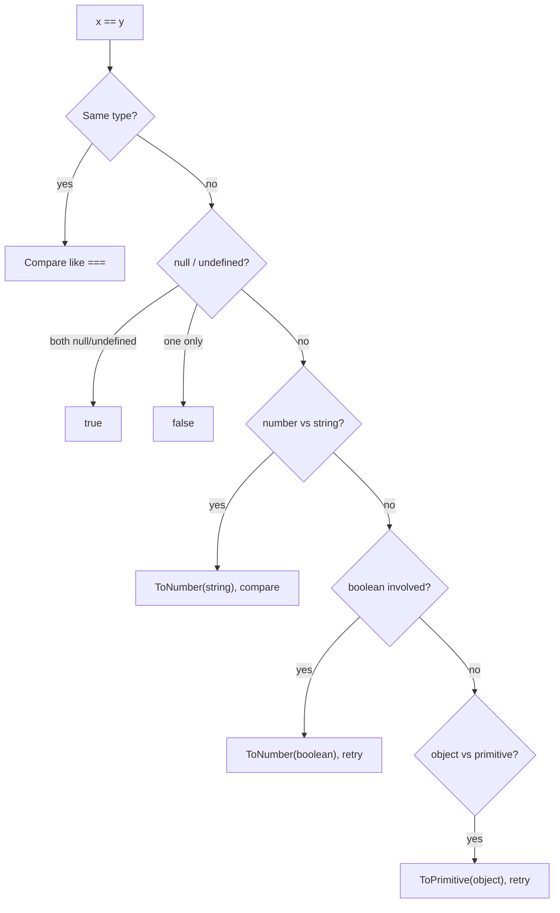
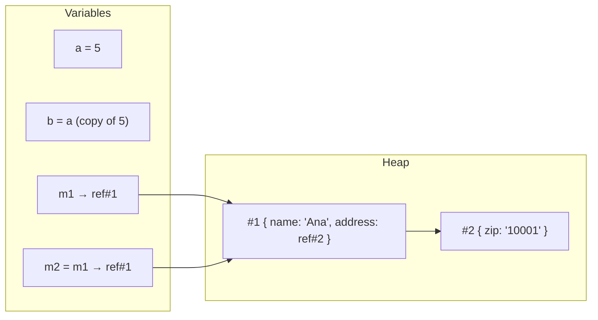

# Equality, Type Coercion, Immutability, Shallow vs Deep Copy

!!! abstract "Key takeaways"
    - **`===`** (strict): no coercion; `NaN !== NaN`, `+0 === -0`. **`==`** (loose): coerces types first (`"1" == 1`, `null == undefined`, but `null != 0`). **`Object.is`**: like `===` but `Object.is(NaN, NaN)` is true and `+0`/`-0` differ (what React uses for state).
    - **Coercion:** objects become primitives via `Symbol.toPrimitive` / `valueOf` / `toString`; `+` concatenates if either side is a string, other arithmetic converts to numbers. Eight falsy values: `false, 0, -0, 0n, "", null, undefined, NaN`. Everything else is truthy (including `[]`, `{}`, `"0"`).
    - **Primitives are immutable values; objects are references.** Comparing objects compares identity, not contents. Assigning or passing an object copies the reference.
    - **Immutability:** `const` only stops rebinding; `Object.freeze` is shallow; immutable updates create new objects (spread, `toSorted`, Immer). React and Redux depend on reference changes.
    - **Copying:** spread / `Object.assign` / `Array.from` / `slice` are **shallow**. **`structuredClone`** deep-clones (Dates, Maps, Sets, cycles; not functions, DOM nodes or class prototypes). `JSON.parse(JSON.stringify(x))` loses Dates, `undefined`, Maps, and breaks on cycles.

## Why it matters

Coercion bugs and accidental shared references are some of the most common production bugs in JavaScript: `"10" + 1 === "101"`, a form value `"0"` treated as truthy, a copied object whose nested address still points to the original, React state that doesn't update because it was mutated. Output-prediction questions in interviews rely heavily on these rules.


*Notice how many conversions `==` can chain together. That's why most style guides require `===`, with `x == null` as the one common exception (checks null and undefined).*

## Core concepts

### Equality algorithms

| Comparison | `===` | `==` | `Object.is` |
|---|---|---|---|
| `1` vs `"1"` | false | true | false |
| `null` vs `undefined` | false | true | false |
| `null` vs `0` | false | false | false |
| `NaN` vs `NaN` | false | false | **true** |
| `+0` vs `-0` | true | true | **false** |
| `{}` vs `{}` | false (different references) | false | false |
| `[1]` vs `"1"` | false | true (`[1]` → `"1"`) | false |

- `SameValueZero` (used by `includes`, `Map`, `Set`): like `Object.is` but `+0` equals `-0`. So `[NaN].includes(NaN)` is true but `[NaN].indexOf(NaN)` is -1.

### Coercion rules

- **ToPrimitive(obj, hint):** calls `obj[Symbol.toPrimitive](hint)` if defined; otherwise `valueOf()` then `toString()` (hint "number"/"default") or the reverse (hint "string"). Dates prefer string.
- **ToNumber:** `"" → 0`, `" 12 " → 12`, `"12px" → NaN`, `null → 0`, `undefined → NaN`, `true → 1`, `[] → 0`, `[5] → 5`, `{} → NaN`.
- **ToString:** `[1,2] → "1,2"`, `{} → "[object Object]"`, `null → "null"`.
- **`+` operator:** if either operand (after ToPrimitive) is a string → concatenation; otherwise numeric addition. `-`, `*`, `/` always numeric.
- **Relational (`<`, `>`):** strings compare lexicographically (`"10" < "9"` is true); mixed → numbers.

### Truthiness

Falsy: `false`, `0`, `-0`, `0n`, `""`, `null`, `undefined`, `NaN` (and the legacy `document.all`). Everything else is truthy: `"0"`, `"false"`, `[]`, `{}`, `new Boolean(false)`.

### typeof quirks

`typeof null === "object"` (historic bug), `typeof [] === "object"` (use `Array.isArray`), `typeof NaN === "number"`, `typeof function(){} === "function"`, `typeof undeclaredVar === "undefined"` (no error).

### Values vs references


*Notice m1 and m2 point to the same object. Changing m2.name changes what m1 sees. Primitives like a and b are independent copies.*

- JavaScript passes everything by value; for objects the value is a reference (same as Java).
- Strings are immutable primitives; "changing" a string creates a new one.

### Immutability

- `const` → binding can't change; object contents can.
- `Object.freeze(obj)` → shallow; nested objects still mutable; silently ignored writes in sloppy mode, TypeError in strict mode. `Object.seal` prevents adding/removing properties.
- Immutable update patterns: spread (`{...o, x}`), array `map/filter/concat/toSorted/with`, nested updates level by level, or Immer (`produce`).
- TypeScript `readonly` / `Readonly<T>` / `as const` give compile-time immutability (no runtime enforcement).
- Why it matters: React (`Object.is` on state), Redux reducers, memoisation (reference equality checks), safe sharing of data between modules.

### Copying

| Method | Depth | Handles | Loses / fails |
|---|---|---|---|
| `{...o}`, `Object.assign` | Shallow | Own enumerable props | Nested shared, getters invoked, prototype lost |
| `[...a]`, `a.slice()`, `Array.from` | Shallow | Arrays/iterables | Nested shared |
| `JSON.parse(JSON.stringify(x))` | Deep | Plain data | Dates → strings, `undefined`/functions dropped, Map/Set → `{}`, `NaN` → null, cycles throw, BigInt throws |
| `structuredClone(x)` | Deep | Date, RegExp, Map, Set, ArrayBuffer, typed arrays, Error, cycles | Functions, DOM nodes, class prototypes/methods, symbols as keys → throws/lost |
| Library (lodash `cloneDeep`) | Deep | More types | Bundle size |

## In practice: code & configuration

=== "❌ Common mistake"
    ```js
    if (form.copay == 0) waiveFee();         // "" == 0 is true → empty field waives the fee
    const total = price + tax;               // "10" + 2 → "102" when price came from an input
    if (selectedIds.length) { /* ... */ }    // fine, but `if (count)` treats 0 as "no value"

    const draft = { ...member };
    draft.address.zip = "00000";             // mutates the original member's address too

    const snapshot = JSON.parse(JSON.stringify(claim));   // claim.serviceDate becomes a string
    ```

=== "✅ Correct approach"
    ```js
    const copay = Number(form.copay);
    if (form.copay !== "" && copay === 0) waiveFee();   // explicit parsing and checks
    const total = Number(price) + Number(tax);

    const draft = { ...member, address: { ...member.address, zip: "00000" } };  // copy each level touched
    // or with Immer: const draft = produce(member, d => { d.address.zip = "00000"; });

    const snapshot = structuredClone(claim);             // Dates, Maps preserved; cycles OK
    ```

### Value equality when you need it

```js
// Shallow equality (what React-Redux's shallowEqual and memo do)
function shallowEqual(a, b) {
  if (Object.is(a, b)) return true;
  if (typeof a !== "object" || typeof b !== "object" || !a || !b) return false;
  const ka = Object.keys(a), kb = Object.keys(b);
  return ka.length === kb.length && ka.every(k => Object.hasOwn(b, k) && Object.is(a[k], b[k]));
}
// Deep equality: use a well-tested library (or compare normalised data) rather than JSON.stringify,
// which depends on key order.
```

## Real-world usage

- ESLint `eqeqeq` (allowing `== null`) is standard in most style guides; TypeScript catches many coercion mistakes at compile time.
- Redux Toolkit uses Immer for immutable updates and freezes state in development to catch mutations.
- React compares state and props with `Object.is` / shallow equality; mutating objects leads to missed renders.
- **Healthcare/banking:** money and quantities must be parsed explicitly (never rely on `+` coercion); use integer cents or decimal libraries, not floats, for currency (`0.1 + 0.2 !== 0.3`).

## Trade-offs & production gotchas

| Topic | Gotcha |
|---|---|
| `==` | Coercion surprises; use `===` (except `x == null`) |
| `NaN` | Not equal to itself; use `Number.isNaN` (not global `isNaN`, which coerces) |
| Floats | `0.1 + 0.2 === 0.30000000000000004`; currency in integer cents/decimal lib |
| `Object.freeze` | Shallow; nested data still mutable |
| `JSON` clone | Loses Dates/undefined/Map/Set; throws on cycles/BigInt |
| `structuredClone` | No functions/class methods; prototype not preserved |
| Sorting | Default sort is string-based |

!!! question "Interview angle"
    Output prediction: `[] + []`, `[] + {}`, `"5" - 2`, `"5" + 2`, `null == 0`, `NaN === NaN`, `typeof null`; then "how do you deep copy?", "why does React need immutability?".

## How this connects to my experience

Not ★. Applies to React state management (Redux, immutable updates) in the OptumRx app and to Java analogies (`==` vs `equals`, reference semantics).

- **Where I used it:** Redux reducers and React state updates in the OptumRx app; parsing form values for healthcare forms. *[confirm: Redux Toolkit/Immer usage, any coercion bug you fixed]*
- **Talking points:**
    - "Same idea as Java: `===` on objects is reference equality, like `==` on Java objects; value equality needs explicit comparison." (bridge from Core Java equals/hashCode)
    - "We used Redux Toolkit (Immer) so reducers couldn't accidentally mutate shared state." *[confirm]*
    - "Monetary values were handled as numbers parsed explicitly or in cents, never via string coercion." *[confirm]*
- **Likely follow-up chain:** "== vs ===?" → "Predict these outputs" → "Shallow vs deep copy?" → "structuredClone vs JSON?" → "Why immutability in React/Redux?"

## Interview questions

### Fundamentals

??? question "Q1. == vs ===?"
    **Answer:** `===` compares type and value without coercion; `==` converts operands to a common type first. Prefer `===`.

    **Interviewer listens for:** coercion rules of ==, prefer ===, `x == null` idiom.

    **Common wrong answer:** "== compares values and === compares references." Both compare object references; == also coerces primitives.

??? question "Q2. What are the falsy values?"
    **Answer:** false, 0, -0, 0n, "", null, undefined, NaN. Everything else is truthy, including "0", [] and {}.

    **Interviewer listens for:** the eight falsy values, "0", [] and {} are truthy.

    **Common wrong answer:** "Empty arrays are falsy."

??? question "Q3. Shallow vs deep copy?"
    **Answer:** Shallow copies the top level only, sharing nested references; deep copies recursively so nothing is shared.

    **Interviewer listens for:** top level vs recursive, shared nested references.

    **Common wrong answer:** "Object.assign makes a deep copy."

### Intermediate

??? question "Q4. Predict: `[] + []`, `[] + {}`, `"5" - 2`, `"5" + 2`."
    **Answer:** `""`, `"[object Object]"`, `3`, `"52"`.

    **Interviewer listens for:** ToPrimitive on objects, + prefers string concatenation, - forces numbers.

    **Common wrong answer:** Guessing `[] + {}` is `0` or an error.

??? question "Q5. Why is `NaN === NaN` false and how do you test for NaN?"
    **Answer:** IEEE 754 defines NaN as unequal to everything, itself included. Use `Number.isNaN(x)` or `Object.is(x, NaN)`.

    **Interviewer listens for:** IEEE 754, Number.isNaN vs global isNaN.

    **Common wrong answer:** Using global `isNaN("abc")`, which coerces and returns true for strings.

??? question "Q6. Object.is vs ===?"
    **Answer:** Same except `Object.is(NaN, NaN)` is true and `Object.is(+0, -0)` is false. React uses Object.is for state comparisons.

    **Interviewer listens for:** NaN and ±0 differences, React uses Object.is.

    **Common wrong answer:** "Object.is is a deep equality check."

??? question "Q7. structuredClone vs JSON round-trip?"
    **Answer:** structuredClone preserves Dates, Maps, Sets, typed arrays, cycles; JSON loses types and fails on cycles/BigInt. Neither clones functions or class behaviour.

    **Interviewer listens for:** types preserved, cycles, no functions or prototypes; JSON loses types.

    **Common wrong answer:** "JSON.parse(JSON.stringify(x)) is a safe deep clone." It drops undefined, turns Dates into strings and fails on cycles.

??? question "Q8. How do you compare two objects for equality in JavaScript?"
    **Answer:** `===` and `Object.is` compare **references** for objects, so two objects with the same content are not equal. Options for value equality:

    - Compare the fields that define identity (`a.id === b.id`), which is usually what the domain needs.
    - A **deep-equal** utility (`node:util.isDeepStrictEqual`, Lodash `isEqual`, Vitest/Jest `toEqual`) for tests and change detection.
    - `JSON.stringify(a) === JSON.stringify(b)` only for simple data with the same key order. It breaks with different key order, `undefined`, Dates and Maps.

    In React, prefer **immutable updates** so a reference check is enough to detect change.

    **Interviewer listens for:** reference vs value equality, domain identity, deep-equal tools, JSON.stringify pitfalls, immutability in React.

    **Common wrong answer:** "Use == instead of ===." Loose equality still compares object references.

### Senior

??? question "Q9. How does an object convert to a primitive?"
    **Answer:** `Symbol.toPrimitive(hint)` if present; else `valueOf` then `toString` for number/default hints (reverse for string hint).

    **Interviewer listens for:** Symbol.toPrimitive, hint order of valueOf and toString.

    **Common wrong answer:** "Objects always convert with toString."

??? question "Q10. Is Object.freeze enough for immutability?"
    **Answer:** No, it's shallow and runtime-only. Deep freeze recursively, or use immutable update patterns/Immer plus TypeScript readonly types.

    **Interviewer listens for:** shallow and runtime-only, deep freeze, readonly types, immutable updates.

    **Common wrong answer:** "Object.freeze makes nested objects immutable too."

??? question "Q11. Why do React and Redux require immutable updates?"
    **Answer:** They detect changes by reference (Object.is / shallow equality); mutating in place keeps the same reference, so updates and memoisation miss changes.

    **Interviewer listens for:** reference comparison for change detection, mutation keeps the same reference.

    **Common wrong answer:** "Immutability is just a style preference in React." Mutating state means React may not re-render.

### Scenario-based

??? question "Q12. A copay field of 0 is treated as 'not provided'. Why?"
    **Answer:** A truthiness check (`if (copay)`) or `||` default treats 0 as falsy. Check `copay == null` / use `??`.

    **Interviewer listens for:** truthiness treats 0 as missing, == null or ??.

    **Common wrong answer:** "Convert it to a string first."

??? question "Q13. Editing a draft member also changes the original in the list."
    **Answer:** The draft is a shallow copy; nested address is shared. Copy nested levels (spread per level, Immer, or structuredClone).

    **Interviewer listens for:** shallow copy shares nested objects, per-level spread, Immer, structuredClone.

    **Common wrong answer:** "Spread the member object" again at the top level only.

## Cheat sheet

| Concept | Remember |
|---|---|
| `===` | No coercion; NaN ≠ NaN; +0 === -0 |
| `==` | Coerces; only use `x == null` |
| `Object.is` | NaN is NaN; +0 ≠ -0; React state |
| SameValueZero | includes, Map, Set |
| Falsy | false 0 -0 0n "" null undefined NaN |
| `+` | String if either side string |
| ToNumber | "" → 0, null → 0, undefined → NaN, [] → 0 |
| typeof null | "object" |
| Copy shallow | spread, assign, slice, Array.from |
| Copy deep | structuredClone (no functions/prototypes) |
| Immutable | const ≠ immutable; freeze shallow; Immer |
| Money | Integer cents/decimal library |

## Sources

1. [MDN: Equality comparisons and sameness](https://developer.mozilla.org/en-US/docs/Web/JavaScript/Equality_comparisons_and_sameness).
2. [MDN: Type coercion](https://developer.mozilla.org/en-US/docs/Web/JavaScript/Data_structures#type_coercion) and [Symbol.toPrimitive](https://developer.mozilla.org/en-US/docs/Web/JavaScript/Reference/Global_Objects/Symbol/toPrimitive).
3. [MDN: Falsy](https://developer.mozilla.org/en-US/docs/Glossary/Falsy).
4. [MDN: structuredClone](https://developer.mozilla.org/en-US/docs/Web/API/Window/structuredClone) and [The structured clone algorithm](https://developer.mozilla.org/en-US/docs/Web/API/Web_Workers_API/Structured_clone_algorithm).
5. [MDN: Object.freeze](https://developer.mozilla.org/en-US/docs/Web/JavaScript/Reference/Global_Objects/Object/freeze).
6. [ECMAScript spec: IsLooselyEqual](https://tc39.es/ecma262/#sec-islooselyequal).
7. [Redux: Immutable update patterns](https://redux.js.org/usage/structuring-reducers/immutable-update-patterns).
