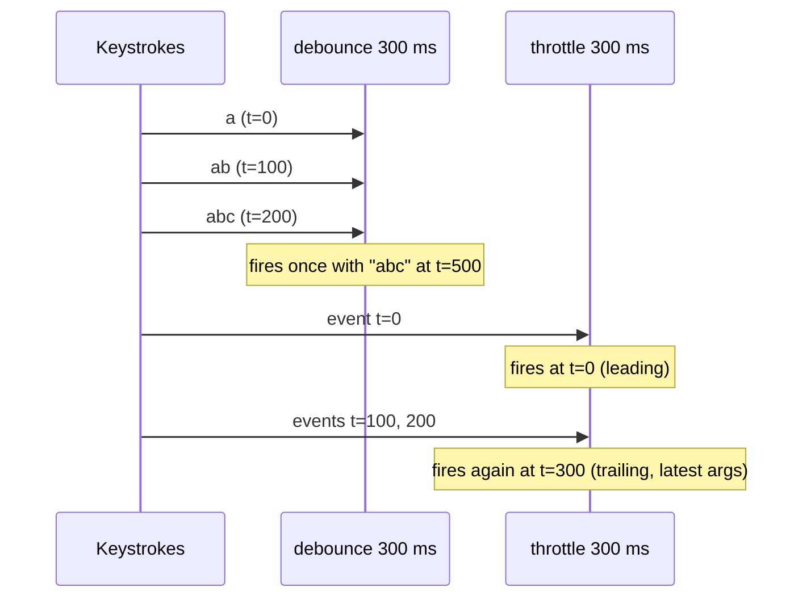
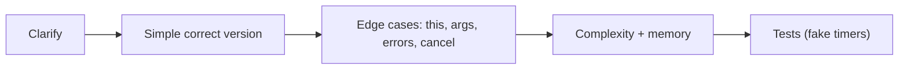

# Debounce, Throttle, Memoization & Common JS Coding Questions

!!! abstract "Key takeaways"
    - **Debounce:** run once after calls **stop** for `wait` ms (search-as-you-type, resize end, autosave). Optional `leading` edge, `cancel`/`flush`.
    - **Throttle:** run **at most once per** `wait` ms during continuous calls (scroll, mousemove, analytics). Leading and/or trailing calls.
    - **Memoize:** cache results by arguments for pure functions; choose a key strategy and bound the cache (LRU) to avoid leaks; handle promises (cache the in-flight promise, evict on rejection).
    - Classic live-coding set: curry, compose/pipe, deep clone, flatten, `Promise.all`/`allSettled`, retry with backoff, concurrency limiter, event emitter, LRU cache, deep equal, `once`, `bind` polyfill, array `map/reduce` polyfills.
    - Interviewers grade **clarifying questions, edge cases (this, arguments, timers, errors), complexity, and tests**, not just a working happy path.

## Why it matters

Senior frontend and full-stack interviews often include a 30–45 minute live-coding round with small utilities. They test closures, `this`, timers, promises and data structures together. In real apps these utilities protect backends (debounced search), keep scrolling smooth (throttled handlers) and avoid repeated expensive work (memoisation).


*Notice the difference: debounce waits for a pause and fires once; throttle fires at a steady maximum rate while events keep coming.*

## Core concepts

### Debounce

```ts
export function debounce<A extends unknown[]>(
  fn: (...args: A) => void,
  wait: number,
  { leading = false } = {},
) {
  let timer: ReturnType<typeof setTimeout> | undefined;
  let lastArgs: A | undefined;
  let lastThis: unknown;

  function debounced(this: unknown, ...args: A) {
    lastArgs = args; lastThis = this;                 // keep latest args and this
    const callNow = leading && timer === undefined;
    clearTimeout(timer);
    timer = setTimeout(() => {
      timer = undefined;
      if (!leading && lastArgs) fn.apply(lastThis, lastArgs);   // trailing call
      lastArgs = undefined;
    }, wait);
    if (callNow) { fn.apply(this, args); lastArgs = undefined; }
  }
  debounced.cancel = () => { clearTimeout(timer); timer = undefined; lastArgs = undefined; };
  return debounced;
}
```

Edge cases: preserve `this` and arguments, cancel on unmount (React), leading vs trailing, `maxWait` (lodash) to guarantee eventual execution during continuous input.

### Throttle

```ts
export function throttle<A extends unknown[]>(fn: (...args: A) => void, wait: number) {
  let last = 0;
  let timer: ReturnType<typeof setTimeout> | undefined;
  let pendingArgs: A | undefined;

  return function throttled(this: unknown, ...args: A) {
    const now = Date.now();
    const remaining = wait - (now - last);
    if (remaining <= 0) {                       // leading / on-schedule call
      clearTimeout(timer); timer = undefined;
      last = now;
      fn.apply(this, args);
    } else {
      pendingArgs = args;                        // remember latest for trailing call
      if (!timer) {
        timer = setTimeout(() => {
          last = Date.now(); timer = undefined;
          if (pendingArgs) fn.apply(this, pendingArgs);
          pendingArgs = undefined;
        }, remaining);
      }
    }
  };
}
```

For visual updates, `requestAnimationFrame`-based throttling (once per frame) is often better than a fixed interval.

### Memoize

```ts
export function memoize<A extends unknown[], R>(fn: (...args: A) => R, { max = 100, key = (...a: A) => JSON.stringify(a) } = {}) {
  const cache = new Map<string, R>();            // Map keeps insertion order → simple LRU
  return (...args: A): R => {
    const k = key(...args);
    if (cache.has(k)) {
      const v = cache.get(k)!;
      cache.delete(k); cache.set(k, v);          // mark as recently used
      return v;
    }
    const v = fn(...args);
    cache.set(k, v);
    if (cache.size > max) cache.delete(cache.keys().next().value!);   // evict least recent
    if (v instanceof Promise) v.catch(() => cache.delete(k));         // don't cache failures
    return v;
  };
}
```

- Only for **pure** functions (same input → same output, no side effects).
- Key strategy: primitives directly; objects by identity (`WeakMap`) or serialisation (cost, key-order issues).
- Unbounded caches are memory leaks.
- React's `useMemo` caches only the last result per component; React Compiler memoises automatically.

### Other frequent questions (with key points)

| Task | Key points |
|---|---|
| `curry(fn)` | Collect args until `fn.length`, then call; support multiple args per call |
| `compose`/`pipe` | `reduceRight` / `reduce` over functions |
| `deepClone` | Recursion with `WeakMap` for cycles; handle Date, Map, Set, arrays; mention `structuredClone` |
| `flatten(arr, depth)` | Recursion or stack; compare with `arr.flat(depth)` |
| `Promise.all` / `allSettled` | Preserve order, count remaining, empty input, non-promise values |
| `retry(fn, n)` | Backoff + jitter, only transient errors, abort support |
| Concurrency limit | Queue + active count, start next on settle |
| `EventEmitter` | `on/off/once/emit`, copy listener array before emitting, error isolation |
| LRU cache | `Map` insertion order or doubly linked list + hash map, O(1) get/put |
| `deepEqual` | Types, arrays, objects, NaN, Dates, cycles |
| `once(fn)` | Closure flag, cache result |
| `Function.prototype.bind` | `this`, partial args, `new` behaviour |
| `Array.prototype.reduce` | Initial value missing, sparse arrays, TypeError on empty without init |

### Interview approach

1. Clarify: inputs, edge cases, leading/trailing, environment (browser/Node), TypeScript?
2. Write the simplest correct version; talk through closures and timers.
3. Handle `this`, arguments, errors, cancellation, cleanup.
4. Complexity (time/space), memory (unbounded caches, timers).
5. Test: show a few cases (fake timers for debounce/throttle).


*Notice the order: correctness first, then robustness, then analysis. Interviewers reward visible reasoning more than a memorised solution.*

## In practice: code & configuration

### Using debounce in React correctly

=== "❌ Common mistake"
    ```tsx
    function Search() {
      const [q, setQ] = useState("");
      const search = debounce((v: string) => api.search(v), 300);   // new debounced fn every render: never debounces
      return <input value={q} onChange={e => { setQ(e.target.value); search(e.target.value); }} />;
    }
    ```

=== "✅ Correct approach"
    ```tsx
    function Search() {
      const [q, setQ] = useState("");
      const search = useMemo(() => debounce((v: string) => api.search(v), 300), []);  // stable instance
      useEffect(() => () => search.cancel(), [search]);                              // cancel on unmount
      return <input value={q} onChange={e => { setQ(e.target.value); search(e.target.value); }} />;
    }
    // Or debounce the value (useDebouncedValue hook) and let React Query fetch by the debounced key.
    ```

### Testing with fake timers (Vitest)

```ts
test("debounce calls once with the latest args", () => {
  vi.useFakeTimers();
  const fn = vi.fn();
  const d = debounce(fn, 300);
  d("a"); d("ab"); d("abc");
  vi.advanceTimersByTime(299);
  expect(fn).not.toHaveBeenCalled();
  vi.advanceTimersByTime(1);
  expect(fn).toHaveBeenCalledOnce();
  expect(fn).toHaveBeenCalledWith("abc");
  vi.useRealTimers();
});
```

### LRU cache (O(1)) with Map

```ts
class LRUCache<K, V> {
  private map = new Map<K, V>();
  constructor(private capacity: number) {}
  get(key: K): V | undefined {
    if (!this.map.has(key)) return undefined;
    const v = this.map.get(key)!;
    this.map.delete(key); this.map.set(key, v);     // move to most recent
    return v;
  }
  put(key: K, value: V) {
    this.map.delete(key);
    this.map.set(key, value);
    if (this.map.size > this.capacity) this.map.delete(this.map.keys().next().value!);
  }
}
```

## Real-world usage

- Search inputs debounce requests (often 200–400 ms) to protect APIs; type-ahead also cancels stale requests (AbortController).
- Scroll/resize handlers throttle or use `requestAnimationFrame`; `IntersectionObserver`/`ResizeObserver` often remove the need entirely.
- Memoisation layers: React's `useMemo`/Compiler, selectors (Reselect), HTTP caches, React Query.
- **Healthcare:** debounced pharmacy/drug search protects upstream systems; throttled analytics avoid flooding; never memoise or cache PHI without bounds and logout clearing.

## Trade-offs & production gotchas

| Utility | Gotcha |
|---|---|
| Debounce | New instance per render; missing cancel on unmount; long waits feel laggy |
| Throttle | Losing the final event without a trailing call |
| Memoize | Unbounded growth, impure functions, object keys by identity vs content |
| Deep clone | Cycles, special types; prefer structuredClone |
| Event emitter | Listener leaks; exceptions in one listener stopping others |

!!! question "Interview angle"
    "Implement debounce/throttle", "difference and use cases", "implement memoize with a bounded cache", "implement Promise.all/LRU/EventEmitter". Talk through edge cases and tests while coding.

## How this connects to my experience

Not ★. Practical in the OptumRx React app (search, scroll, caching) and mirrors backend concepts you used: Redis caching (memoisation across requests), rate limiting (throttle), batching.

- **Where I used it:** search and filter inputs, scroll-heavy lists, client caching via React Query. *[confirm concrete examples (pharmacy or drug search debounce?)]*
- **Talking points:**
    - "Debounced search plus request cancellation kept upstream load down and avoided stale results." *[confirm]*
    - "Memoisation is caching: bound it, key it correctly, never cache sensitive data without eviction, same principles as our Redis layer."
- **Likely follow-up chain:** "Debounce vs throttle?" → "Implement debounce" → "How do you use it in React?" → "Implement memoize with LRU" → "How do you test timer code?"

## Interview questions

### Fundamentals

??? question "Q1. Debounce vs throttle?"
    **Answer:** Debounce runs once after events stop for a period; throttle runs at most once per period while events continue.

    **Interviewer listens for:** after quiet period vs at most once per period.

    **Common wrong answer:** Using them interchangeably, or describing debounce as "runs every N ms".

??? question "Q2. Use cases?"
    **Answer:** Debounce: search-as-you-type, autosave, resize end, validation. Throttle: scroll, mousemove, drag, rate-limited analytics.

    **Interviewer listens for:** match the event pattern: "after they stop" vs "steady rate while active".

    **Common wrong answer:** Throttling a search box, which still sends requests mid-word.

??? question "Q3. What is memoisation?"
    **Answer:** Caching a pure function's results by its arguments to avoid recomputation.

    **Interviewer listens for:** pure functions, argument-keyed cache, memory trade-off.

    **Common wrong answer:** Memoising impure functions whose results depend on time or external state.

### Intermediate

??? question "Q4. Implement debounce. What edge cases matter?"
    **Answer:** Closure over a timer; clear and reset on each call; preserve `this` and latest arguments; leading/trailing options; cancel/flush; cleanup on unmount.

    **Interviewer listens for:** timer closure, reset, this and latest args, leading/trailing, cancel/flush, cleanup.

    **Common wrong answer:** Losing `this` by using an arrow inside a non-method context, or forgetting cancel on unmount.

??? question "Q5. Why does creating a debounced function inside a React component break it?"
    **Answer:** A new debounced function (with its own timer) is created each render, so calls never share a timer. Memoise it (useMemo/useRef) or debounce the value.

    **Interviewer listens for:** new function and timer per render, stable reference via useMemo/useRef.

    **Common wrong answer:** "Debounce does not work in React."

??? question "Q6. How do you key a memoised function with object arguments?"
    **Answer:** By identity using a WeakMap (no leaks, but equal-content objects miss), or by a stable serialisation (costly, key-order sensitive). Choose based on how inputs are created.

    **Interviewer listens for:** identity with WeakMap vs serialisation; leak and cost trade-offs.

    **Common wrong answer:** Using `JSON.stringify(args)` as a key without thinking about key order, cost or unbounded growth.

??? question "Q7. Implement an LRU cache."
    **Answer:** Map (insertion order) with delete-and-reinsert on access, evict the first key when over capacity; or hash map + doubly linked list; O(1) get/put.

    **Interviewer listens for:** Map insertion order or hash map + doubly linked list, O(1) get/put.

    **Common wrong answer:** Using an array and `indexOf`, which makes get/put O(n).

### Senior

??? question "Q8. How do you memoise async functions safely?"
    **Answer:** Cache the in-flight promise (dedupes concurrent calls), evict on rejection, set TTL/size bounds, and consider abort signals.

    **Interviewer listens for:** cache the promise, evict on rejection, TTL/size bounds.

    **Common wrong answer:** Caching the resolved value only, so concurrent callers all fire requests.

??? question "Q9. Implement a concurrency limiter."
    **Answer:** Queue of tasks, active counter; run while active < limit; on each settle decrement and start next; return promises resolving to each task's result.

    **Interviewer listens for:** queue + active counter, start next on settle, per-task results.

    **Common wrong answer:** Splitting tasks into fixed batches of N, which waits for the slowest in each batch.

??? question "Q10. How do you test debounce/throttle?"
    **Answer:** Fake timers; advance time precisely; assert call counts and arguments at boundaries; test cancel.

    **Interviewer listens for:** fake timers, precise time advance, boundary assertions, cancel.

    **Common wrong answer:** Using real timers with sleeps, which makes tests slow and flaky.

??? question "Q11. Implement `retry(fn, { retries, baseMs })` with exponential backoff and jitter."
    **Answer:** ```ts
    async function retry<T>(fn: (signal: AbortSignal) => Promise<T>,
                            { retries = 3, baseMs = 200, signal }: { retries?: number; baseMs?: number; signal?: AbortSignal } = {}): Promise<T> {
      for (let attempt = 0; ; attempt++) {
        try {
          return await fn(signal ?? new AbortController().signal);
        } catch (err) {
          if (attempt >= retries || signal?.aborted || !isRetryable(err)) throw err;
          const cap = baseMs * 2 ** attempt;                 // 200, 400, 800 ...
          const delay = Math.random() * cap;                 // full jitter
          await new Promise(r => setTimeout(r, delay));
        }
      }
    }
    const isRetryable = (e: any) => e?.name === 'TypeError' || [429, 502, 503, 504].includes(e?.status);
    ```

    Key points: `return await` inside `try` so failures reach the `catch`; retry only **transient** errors (network failures, 429, 503), never 400 or 401; **full jitter** spreads clients out; respect an `AbortSignal`; and only retry operations that are idempotent (or carry an idempotency key).

    **Interviewer listens for:** return await in try, retryable error filter, exponential cap + jitter, abort support, idempotency caveat.

    **Common wrong answer:** Retrying every error immediately in a loop, including validation errors and non-idempotent POSTs.

### Scenario-based

??? question "Q12. A search box sends a request on every keystroke and results flicker."
    **Answer:** Debounce input (or the value), cancel stale requests with AbortController, and key the query by the debounced term (React Query).

    **Interviewer listens for:** debounce, abort stale requests, query keyed by debounced term.

    **Common wrong answer:** Debouncing only, which still lets an older slow response overwrite newer results.

??? question "Q13. A memoised selector grows memory over a long session."
    **Answer:** Unbounded cache keyed by changing inputs. Bound with LRU/TTL, key by stable ids, clear on logout.

    **Interviewer listens for:** unbounded cache, LRU/TTL bounds, stable keys, clear on logout.

    **Common wrong answer:** "Memoisation never leaks memory."

## Cheat sheet

| Concept | Remember |
|---|---|
| Debounce | After quiet period; trailing default; leading option; cancel |
| Throttle | Max once per interval; leading + trailing; rAF for visuals |
| Memoize | Pure fns; key strategy; bound with LRU/TTL; promise eviction on reject |
| React | Stable instance (useMemo/useRef), cancel on unmount |
| LRU | Map delete+set on access; evict first key |
| Tests | Fake timers, boundary checks |
| Approach | Clarify → simple → edge cases → complexity → tests |

## Sources

1. [Lodash: debounce](https://lodash.com/docs/#debounce) and [throttle](https://lodash.com/docs/#throttle): options (leading, trailing, maxWait).
2. [MDN: setTimeout](https://developer.mozilla.org/en-US/docs/Web/API/Window/setTimeout) and [requestAnimationFrame](https://developer.mozilla.org/en-US/docs/Web/API/Window/requestAnimationFrame).
3. [MDN: Map (insertion order)](https://developer.mozilla.org/en-US/docs/Web/JavaScript/Reference/Global_Objects/Map) and [WeakMap](https://developer.mozilla.org/en-US/docs/Web/JavaScript/Reference/Global_Objects/WeakMap).
4. [Vitest: Fake timers](https://vitest.dev/guide/mocking.html#timers).
5. [Reselect: memoized selectors](https://reselect.js.org/).
6. [web.dev: Debounce your input handlers](https://web.dev/articles/debounce-your-input-handlers).
