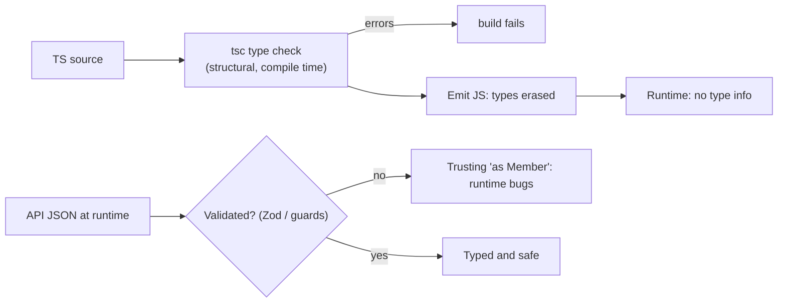
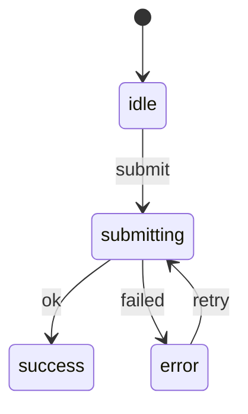

# TypeScript Type System: Interfaces vs Types, Generics, Unions, Narrowing

!!! abstract "TL;DR"
    - TypeScript is **structurally typed**: compatibility depends on shape, not declared names. Types are **erased** at compile time: no runtime checks unless you write them (or use a schema library like Zod).
    - **`interface`** vs **`type`**: both describe object shapes; interfaces can be **merged** (declaration merging) and `extends`; type aliases can name **unions, intersections, tuples, primitives, mapped/conditional types**. Use either for objects consistently; `type` for everything else.
    - **Generics** parameterise types (`function first<T>(xs: T[]): T | undefined`), with **constraints** (`T extends { id: string }`) and defaults; inference usually fills them in.
    - **Unions** (`A | B`) need **narrowing** before use: `typeof`, `instanceof`, `in`, equality, truthiness, **discriminated unions** (a shared literal `kind` field) and **type predicates** (`x is T`); exhaustiveness via `never`.
    - Prefer **`unknown`** over `any` for untrusted data, enable **`strict`** (default since TypeScript 6.0), and validate external data at runtime. **TypeScript 7.0** (July 2026) is the Go-native compiler: same `tsc`, ~10× faster builds.

## Why it matters

TypeScript is the default for serious React and Node codebases. Interviewers check whether you use it to model the domain (impossible states unrepresentable) or just annotate JavaScript with `any`. Discriminated unions, generics and narrowing come up constantly, and the "types are erased" point matters for API data from upstream systems.


*Notice types vanish at runtime. Data crossing a boundary (API, storage, URL) is `unknown` until a runtime check proves its shape.*

## Core concepts

### Structural typing

```ts
interface Member { id: string; name: string }
const p = { id: "1", name: "Ana", plan: "gold" };
const m: Member = p;          // OK: p has at least Member's properties
const m2: Member = { id: "1", name: "Ana", plan: "gold" };   // Error: excess property check on fresh literal
```

- Excess property checks apply only to object literals assigned directly.
- **Branded types** simulate nominal typing: `type MemberId = string & { __brand: "MemberId" }`.

### interface vs type

| | `interface` | `type` |
|---|---|---|
| Object shapes | ✅ | ✅ |
| Unions, tuples, primitives, mapped, conditional | ❌ | ✅ |
| `extends` | ✅ (`interface B extends A`) | Via intersection `A & B` |
| Declaration merging | ✅ (augment libraries, globals) | ❌ |
| Error messages / performance | Named, cached; slightly better for large hierarchies | Can be expanded inline |
| `implements` by classes | ✅ | ✅ (object types) |

Common team rule: `interface` for public object contracts (or `type` everywhere), `type` for unions and computed types. Consistency matters more than the choice.

### Generics

```ts
function byId<T extends { id: string }>(items: readonly T[]): Map<string, T> {
  return new Map(items.map(i => [i.id, i]));
}
type ApiResponse<T, E = ApiError> = { data: T; errors?: E[] };
```

- Constraints (`extends`), defaults (`= ApiError`), multiple parameters, generic classes and React components (`<T,>` in TSX).
- `keyof` + generics for safe property access: `function get<T, K extends keyof T>(o: T, k: K): T[K]`.
- Don't add type parameters that are used once (they add nothing); let inference work.

### Unions, intersections and literal types

- `type Status = "PENDING" | "READY" | "PICKED_UP"` (string literal union) instead of `string`.
- Intersection `A & B` combines members (conflicting properties become `never`).
- `as const` freezes literals: `const roles = ["member", "pharmacist"] as const; type Role = typeof roles[number]`.
- `satisfies` (TS 4.9) checks a value against a type without widening it.

### Narrowing

```ts
function format(v: string | number | Date | null) {
  if (v == null) return "—";                 // null/undefined
  if (typeof v === "string") return v.trim();
  if (typeof v === "number") return v.toFixed(2);
  return v.toISOString();                    // Date (instanceof also works)
}
```

Techniques: `typeof`, `instanceof`, `in` operator, equality/truthiness, `Array.isArray`, control flow analysis (assignments, early returns), discriminated unions, **user-defined type guards** (`function isMember(x: unknown): x is Member`), **assertion functions** (`asserts x is T`).

### Discriminated unions and exhaustiveness

```ts
type RefillState =
  | { kind: "idle" }
  | { kind: "submitting"; rxId: string }
  | { kind: "success"; confirmation: string }
  | { kind: "error"; message: string; retryable: boolean };

function render(s: RefillState) {
  switch (s.kind) {
    case "idle": return "Request refill";
    case "submitting": return "Submitting…";
    case "success": return `Done: ${s.confirmation}`;      // narrowed
    case "error": return s.retryable ? "Try again" : s.message;
    default: { const _exhaustive: never = s; return _exhaustive; }   // compile error if a case is missing
  }
}
```


*Notice each state carries only the data valid in that state. With a discriminated union, "success with an error message" can't even be represented.*

### any, unknown, never, void

| Type | Meaning | Use |
|---|---|---|
| `any` | Turns off checking (contagious) | Migration only; avoid (`noImplicitAny`) |
| `unknown` | Anything, but must narrow before use | Untrusted input (JSON, catch variables) |
| `never` | No value possible | Exhaustiveness, impossible branches, functions that throw |
| `void` | Return value ignored | Callbacks |

- `catch (e)` is `unknown` with `useUnknownInCatchVariables` (part of `strict`).
- Avoid `as` casts and non-null `!` assertions; prefer narrowing or validation.

### Compiler settings and versions

- **TypeScript 6.0 (March 2026)** defaults: `strict: true`, `module: esnext`, floating `target` (es2025), `types: []`, `rootDir: .`; deprecates `target: es5`, `moduleResolution node10/classic`, `baseUrl`, AMD/UMD/System modules, `outFile`.
- **TypeScript 7.0 (July 2026):** native Go port, ~8–12× faster full builds, same `tsc` command and 6.0 type-checking semantics; programmatic API arrives in 7.1, so tools embedding TS (Vue, Svelte, Angular) may stay on 6.0 for now.
- Useful strict extras: `noUncheckedIndexedAccess`, `exactOptionalPropertyTypes`, `noImplicitOverride`.

## In practice: code & configuration

### Runtime validation at the boundary

=== "❌ Common mistake"
    ```ts
    const member = (await res.json()) as Member;     // cast: no runtime check
    if (member.plan.copay > 0) { /* ... */ }         // crashes if upstream omits plan
    function handle(e: any) { console.log(e.message) }   // any spreads unsafety
    ```

=== "✅ Correct approach"
    ```ts
    import { z } from "zod";
    const MemberSchema = z.object({
      id: z.string(),
      name: z.string(),
      plan: z.object({ copay: z.number() }).nullable(),     // upstream may not provide it
    });
    type Member = z.infer<typeof MemberSchema>;              // one source of truth for type + validation

    const parsed = MemberSchema.safeParse(await res.json()); // unknown → Member
    if (!parsed.success) throw new UpstreamDataError("member", { cause: parsed.error });
    const member = parsed.data;
    if (member.plan && member.plan.copay > 0) { /* narrowed */ }

    function handle(e: unknown) {
      const message = e instanceof Error ? e.message : String(e);
    }
    ```

### Generated types from GraphQL

```ts
// codegen produces exact operation types from the schema (graphql-codegen / gql.tada)
const { data } = useQuery<GetPrescriptionsQuery, GetPrescriptionsQueryVariables>(GET_PRESCRIPTIONS, { variables: { memberId } });
data?.member?.prescriptions.edges.map(e => e.node.drug.name);   // nullability from the schema
```

### tsconfig (TypeScript 6/7)

```json
{
  "compilerOptions": {
    "strict": true,
    "noUncheckedIndexedAccess": true,
    "exactOptionalPropertyTypes": true,
    "module": "esnext",
    "moduleResolution": "bundler",
    "jsx": "react-jsx",
    "verbatimModuleSyntax": true,
    "skipLibCheck": true,
    "types": ["vite/client"]
  }
}
```

## Real-world usage

- Large codebases (VS Code, Slack, Airbnb) use TypeScript for refactoring safety; TypeScript 7's native compiler cuts type-check times dramatically for monorepos.
- Schema-first stacks generate types from GraphQL schemas, OpenAPI specs or Zod schemas so frontend and backend contracts stay aligned.
- **Healthcare:** model states with discriminated unions (claim status, prescription lifecycle) so impossible combinations don't compile; validate all upstream data at runtime because API types can't guarantee what arrives.

## Trade-offs & production gotchas

| Choice | Pros | Cons |
|---|---|---|
| `interface` | Merging, named errors | No unions/mapped |
| `type` | Everything incl. unions/conditional | No merging |
| `any` | Fast migration | Disables safety, spreads |
| `unknown` | Forces checks | More code at boundaries |
| `as` casts | Quick | Lies to the compiler |
| Runtime schemas (Zod) | Real safety at boundaries | Bundle size, duplication without inference |
| Codegen types | Contract-accurate | Build step |

!!! warning "Gotcha: types don't exist at runtime"
    `instanceof Member` doesn't work for interfaces/types; `as Member` validates nothing. Validate external data.

!!! warning "Gotcha: TS `private` and `readonly`"
    Compile-time only. Use JS `#private` and `Object.freeze` for runtime guarantees.

!!! question "Interview angle"
    "interface vs type", "what's structural typing", "how does narrowing work", "discriminated union with exhaustive check", "unknown vs any", "generic with constraint", "what's new in TS 6/7".

## How this connects to my experience

Not ★; TypeScript is a listed language, used in the OptumRx React app and micro-frontends. *[confirm: TS strictness, codegen from the GraphQL schema, runtime validation library]*

- **Where I used it:** OptumRx React/TypeScript app consuming the GraphQL Consumer Service.
- **Talking points:**
    - "Types for GraphQL operations were generated from the schema, so frontend and the GraphQL service shared one contract, including nullability." *[confirm graphql-codegen or similar]*
    - "UI states like refill submission were discriminated unions with exhaustive switches." *[confirm]*
    - "Java parallel: TS generics are erased like Java generics; structural typing is the big difference from Java's nominal types." (bridge from Core Java generics)
- **Likely follow-up chain:** "interface or type?" → "How do you type API responses safely?" → "Discriminated union example" → "Generic constraint example" → "TS 7?"

## Interview questions

### Fundamentals

??? question "Q1. interface vs type alias?"
    **Answer:** Both define object shapes; interfaces support declaration merging and `extends`; type aliases also express unions, tuples, primitives, mapped and conditional types.

    **Interviewer listens for:** declaration merging and extends vs unions/tuples/mapped/conditional; a team convention.

    **Common wrong answer:** "Interfaces are for classes and types are for everything else." Both describe any object shape.

??? question "Q2. What is structural typing?"
    **Answer:** Type compatibility is based on structure (members), not on declared names or inheritance.

    **Interviewer listens for:** compatibility by shape, not by name; extra-property checks only on fresh literals.

    **Common wrong answer:** "Two types with different names are never assignable." TypeScript is not nominal like Java.

??? question "Q3. any vs unknown?"
    **Answer:** `any` disables checking; `unknown` accepts anything but requires narrowing before use. Use unknown for untrusted data.

    **Interviewer listens for:** any switches off checking; unknown forces narrowing first.

    **Common wrong answer:** "unknown is just a stricter any you can still call methods on." You cannot use it until you narrow it.

### Intermediate

??? question "Q4. What is narrowing?"
    **Answer:** Refining a union to a more specific type using control flow: typeof, instanceof, in, equality, truthiness, discriminants, type guards and assertion functions.

    **Interviewer listens for:** control-flow analysis and the main narrowing tools, including custom guards.

    **Common wrong answer:** Using `as` casts and calling it narrowing. A cast tells the compiler to trust you; narrowing proves it.

??? question "Q5. What is a discriminated union?"
    **Answer:** A union of object types sharing a literal property (e.g. `kind`); checking it narrows to the matching member, enabling exhaustive switches with `never`.

    **Interviewer listens for:** shared literal discriminant, narrowing per case, exhaustive `never` check.

    **Common wrong answer:** "It is a union of strings." The point is objects tagged by a literal field.

??? question "Q6. What do generic constraints do?"
    **Answer:** `T extends X` limits type arguments to those assignable to X, letting the function use X's members safely.

    **Interviewer listens for:** extends limits type arguments and enables safe member access.

    **Common wrong answer:** "extends in generics means class inheritance."

??? question "Q7. What does `satisfies` do?"
    **Answer:** Checks an expression against a type without changing the expression's inferred (narrower) type.

    **Interviewer listens for:** checks against a type while keeping the narrower inferred type.

    **Common wrong answer:** "satisfies is the same as `as`." `as` can hide errors; satisfies reports them.

### Senior

??? question "Q8. Why validate at runtime if you have TypeScript?"
    **Answer:** Types are erased; external data (APIs, storage, URLs) can be anything. Runtime schemas (Zod) or guards turn unknown into trusted types.

    **Interviewer listens for:** types are erased, external data is untrusted, schemas at the boundary.

    **Common wrong answer:** "TypeScript validates API responses."

??? question "Q9. How do you make impossible states unrepresentable?"
    **Answer:** Model states as discriminated unions where each variant has only its valid fields, instead of one object with many optional fields and booleans.

    **Interviewer listens for:** discriminated unions with only valid fields per state.

    **Common wrong answer:** One object with `isLoading`, `error?` and `data?` that allows invalid combinations.

??? question "Q10. What changed in TypeScript 6 and 7?"
    **Answer:** 6.0: strict on by default, ESM module default, modern target, `types: []`, deprecations (es5 target, node10 resolution, baseUrl, outFile). 7.0: native Go compiler, ~10× faster, same tsc semantics, API in 7.1.

    **Interviewer listens for:** 6.0 defaults and deprecations, 7.0 native Go compiler speed, same semantics.

    **Common wrong answer:** "TypeScript 7 changes the type system." It is a compiler port aiming for the same checking behaviour.

### Scenario-based

??? question "Q11. An API sometimes omits a nested field and the app crashes despite types."
    **Answer:** The type was asserted, not validated. Model the field as optional/nullable, validate responses at the boundary, and handle the missing case in UI.

    **Interviewer listens for:** assertion vs validation, optional modelling, boundary validation, UI handling.

    **Common wrong answer:** "Add `!` to the access." The non-null assertion hides the bug.

??? question "Q12. Adding a new claim status breaks nothing at compile time but shows a blank UI."
    **Answer:** Switches lack exhaustiveness checks. Use a union type for status and a `never` default so new members cause compile errors.

    **Interviewer listens for:** union status, `never` default for exhaustiveness.

    **Common wrong answer:** Adding a `default: return null` case, which silently hides new statuses.

## Cheat sheet

| Concept | Remember |
|---|---|
| Typing | Structural; erased at runtime |
| interface vs type | Merging/extends vs unions/mapped/conditional |
| Generics | Constraints, defaults, keyof, inference |
| Narrowing | typeof, instanceof, in, equality, discriminant, `x is T`, `asserts` |
| Exhaustive | `const _: never = x` in default |
| any/unknown/never/void | Off / must narrow / impossible / ignored |
| Literal types | Unions of strings, `as const`, `satisfies` |
| Boundaries | Zod/guards; no `as` casts |
| TS 6.0 | strict default, esnext module, deprecations |
| TS 7.0 | Go native compiler, ~10× faster, API in 7.1 |

## Sources

1. [TypeScript Handbook: Everyday Types](https://www.typescriptlang.org/docs/handbook/2/everyday-types.html) (interfaces vs type aliases).
2. [TypeScript Handbook: Narrowing](https://www.typescriptlang.org/docs/handbook/2/narrowing.html) (discriminated unions, never).
3. [TypeScript Handbook: Generics](https://www.typescriptlang.org/docs/handbook/2/generics.html).
4. [TypeScript Handbook: Type Compatibility (structural typing)](https://www.typescriptlang.org/docs/handbook/type-compatibility.html).
5. [Announcing TypeScript 6.0 (March 2026)](https://devblogs.microsoft.com/typescript/announcing-typescript-6-0/).
6. [Announcing TypeScript 7.0 (July 2026)](https://devblogs.microsoft.com/typescript/announcing-typescript-7-0/).
7. [Zod documentation](https://zod.dev/).
