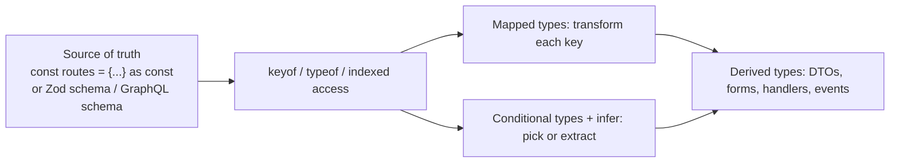
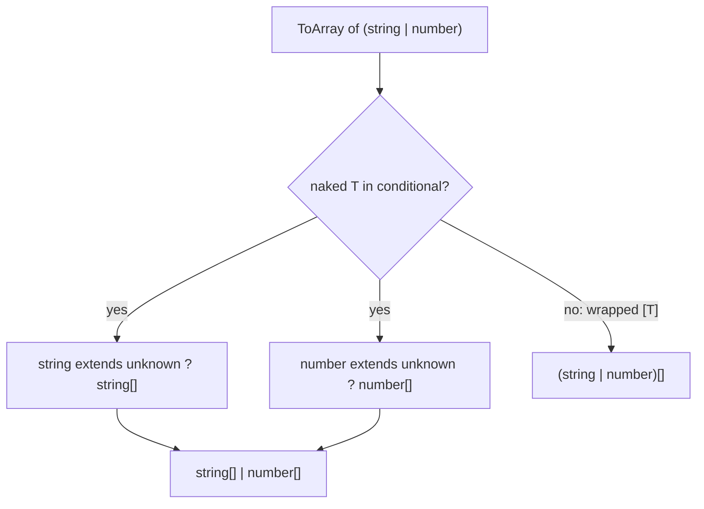

# Advanced TypeScript: Utility, Mapped & Conditional Types

!!! abstract "Key takeaways"
    - **Type operators:** `keyof T` (union of keys), `typeof value` (type of a value), `T[K]` (indexed access), `T[number]` (element type of an array/tuple).
    - **Utility types** are built from those: `Partial`, `Required`, `Readonly`, `Pick`, `Omit`, `Record`, `Exclude`, `Extract`, `NonNullable`, `ReturnType`, `Parameters`, `Awaited`, `InstanceType`, `NoInfer` (5.4).
    - **Mapped types** transform each property: `{ [K in keyof T]: ... }`, with modifiers (`readonly`, `?`, `-readonly`, `-?`) and **key remapping** via `as` (rename/filter keys).
    - **Conditional types** `T extends U ? X : Y` choose types; **`infer`** extracts parts (return types, promise values); they **distribute** over unions when `T` is a naked type parameter (wrap in `[T]` to stop).
    - **Template literal types** build string types (`` `on${Capitalize<E>}` ``). Use advanced types to make **APIs** precise and safe; keep application code readable, and avoid type gymnastics nobody can maintain.

## Why it matters

Senior TypeScript work is about modelling: deriving types from one source of truth (an API schema, a config object, a route table) instead of duplicating them. Interviewers ask you to implement `Partial`, `Pick` or `ReturnType`, explain `infer`, or type a function like `get(obj, "a.b.c")`. They also want to hear when you'd stop and choose simpler types.


*Notice the pattern: write data or a schema once, then derive every related type from it. When the source changes, all derived types update and the compiler finds every affected place.*

## Core concepts

### Type operators

```ts
const ROLES = ["member", "pharmacist", "admin"] as const;
type Role = typeof ROLES[number];                       // "member" | "pharmacist" | "admin"

interface Member { id: string; name: string; plan: { copay: number } | null }
type MemberKey = keyof Member;                          // "id" | "name" | "plan"
type Plan = Member["plan"];                             // { copay: number } | null
type Copay = NonNullable<Member["plan"]>["copay"];      // number
```

### Utility types (and how they're built)

| Utility | Definition (simplified) | Use |
|---|---|---|
| `Partial<T>` | `{ [K in keyof T]?: T[K] }` | Patch/update payloads |
| `Required<T>` | `{ [K in keyof T]-?: T[K] }` | After defaults applied |
| `Readonly<T>` | `{ readonly [K in keyof T]: T[K] }` | Immutable state |
| `Pick<T, K>` | `{ [P in K]: T[P] }` | Subsets (view models) |
| `Omit<T, K>` | `Pick<T, Exclude<keyof T, K>>` | Remove fields (e.g. `id` for create) |
| `Record<K, V>` | `{ [P in K]: V }` | Dictionaries keyed by a union |
| `Exclude<T, U>` | `T extends U ? never : T` | Remove members from a union |
| `Extract<T, U>` | `T extends U ? T : never` | Keep members |
| `NonNullable<T>` | `T & {}` | Drop null/undefined |
| `ReturnType<F>` | `F extends (...a: any) => infer R ? R : any` | Derive from functions |
| `Parameters<F>` | `F extends (...a: infer P) => any ? P : never` | Wrap functions |
| `Awaited<T>` | Recursively unwrap promises | Async results |
| `NoInfer<T>` (5.4) | Blocks inference from a position | Generic defaults |

### Mapped types

```ts
type Nullable<T> = { [K in keyof T]: T[K] | null };
type Mutable<T> = { -readonly [K in keyof T]: T[K] };

// Key remapping with `as` (rename and filter)
type Getters<T> = { [K in keyof T as `get${Capitalize<string & K>}`]: () => T[K] };
type OnlyStrings<T> = { [K in keyof T as T[K] extends string ? K : never]: T[K] };

type MemberGetters = Getters<{ id: string; age: number }>;   // { getId: () => string; getAge: () => number }
```

### Conditional types and infer

```ts
type ElementOf<T> = T extends readonly (infer E)[] ? E : never;
type UnwrapPromise<T> = T extends Promise<infer V> ? V : T;
type ApiData<F> = F extends (...args: any[]) => Promise<{ data: infer D }> ? D : never;

// Distribution over unions
type ToArray<T> = T extends unknown ? T[] : never;
type A = ToArray<string | number>;          // string[] | number[]   (distributed)
type NoDist<T> = [T] extends [unknown] ? T[] : never;
type B = NoDist<string | number>;           // (string | number)[]
```


*Notice distribution happens member by member only when the checked type is a bare type parameter. Wrapping in a tuple turns it off.*

### Template literal types

```ts
type EventName = "refillRequested" | "refillApproved";
type Handler = `on${Capitalize<EventName>}`;            // "onRefillRequested" | "onRefillApproved"
type Route = `/members/${string}/prescriptions`;
type CssSize = `${number}px` | `${number}rem`;
```

Built-in string helpers: `Uppercase`, `Lowercase`, `Capitalize`, `Uncapitalize`.

### Recursive types

```ts
type DeepReadonly<T> = T extends (infer E)[]
  ? ReadonlyArray<DeepReadonly<E>>
  : T extends object ? { readonly [K in keyof T]: DeepReadonly<T[K]> } : T;

type Paths<T> = T extends object
  ? { [K in keyof T & string]: K | `${K}.${Paths<T[K]>}` }[keyof T & string]
  : never;
// Paths<{ a: { b: { c: 1 } } }> = "a" | "a.b" | "a.b.c"
```

Recursion depth is limited (and slows the checker); TypeScript 7's native compiler is faster but limits still apply.

### When to stop

- Use advanced types in **library-like code** (API clients, form libraries, event buses, design-system components) where they prevent misuse for many callers.
- In application code, prefer readable named types, small generics, and explicit interfaces.
- If a type needs a comment longer than the type, or error messages become unreadable, simplify or use a runtime check.

## In practice: code & configuration

### Deriving types from one source

=== "❌ Common mistake"
    ```ts
    interface Member { id: string; name: string; email: string; phone: string }
    interface MemberUpdate { name?: string; email?: string; phone?: string }   // duplicated, drifts
    interface MemberForm { name: string; email: string; phone: string }        // drifts too
    function setField(m: Member, key: string, value: any) { (m as any)[key] = value; }  // no safety
    ```

=== "✅ Correct approach"
    ```ts
    interface Member { id: string; name: string; email: string; phone: string }
    type MemberUpdate = Partial<Omit<Member, "id">>;                   // derived
    type MemberForm = Omit<Member, "id">;
    type MemberErrors = Partial<Record<keyof MemberForm, string>>;      // field → message

    function setField<K extends keyof MemberForm>(m: MemberForm, key: K, value: MemberForm[K]): MemberForm {
      return { ...m, [key]: value };                                    // key and value types linked
    }
    setField(form, "email", "a@b.com");   // ok
    setField(form, "email", 42);          // error: number not assignable to string
    ```

### Typed event emitter

```ts
type Events = {
  refillRequested: { rxId: string };
  sessionExpired: { reason: "idle" | "revoked" };
};

class TypedEmitter<E extends Record<string, unknown>> {
  private handlers: { [K in keyof E]?: Array<(p: E[K]) => void> } = {};
  on<K extends keyof E>(event: K, fn: (p: E[K]) => void) {
    (this.handlers[event] ??= []).push(fn);
    return () => { this.handlers[event] = this.handlers[event]?.filter(h => h !== fn); };
  }
  emit<K extends keyof E>(event: K, payload: E[K]) {
    this.handlers[event]?.forEach(h => h(payload));
  }
}
const bus = new TypedEmitter<Events>();
bus.on("sessionExpired", p => p.reason);          // p typed
bus.emit("refillRequested", { rxId: 1 });         // error: rxId must be string
```

### Implementing utility types (interview task)

```ts
type MyPick<T, K extends keyof T> = { [P in K]: T[P] };
type MyReadonly<T> = { readonly [P in keyof T]: T[P] };
type MyReturnType<F> = F extends (...args: any[]) => infer R ? R : never;
type MyAwaited<T> = T extends PromiseLike<infer V> ? MyAwaited<V> : T;
type MyExclude<T, U> = T extends U ? never : T;
```

## Real-world usage

- Libraries like tRPC, Zod, React Hook Form, TanStack Router/Query and Prisma rely on mapped/conditional/template literal types to infer end-to-end types from one definition.
- GraphQL codegen and OpenAPI generators produce precise types; utility types then derive form and view models.
- **Healthcare:** derive form types from the API schema so a renamed field breaks the build rather than silently dropping data; use `Readonly`/`DeepReadonly` for shared reference data.

## Trade-offs & production gotchas

| Technique | Benefit | Cost |
|---|---|---|
| Utility types | Concise, standard | Can hide shape in tooltips |
| Mapped types | Systematic transformations | Readability |
| Conditional + infer | Derive from functions/promises | Distribution surprises |
| Template literals | Typed strings/routes/events | Combinatorial explosion |
| Recursive types | Deep paths/readonly | Checker performance, depth limits |

!!! warning "Gotcha: distributive conditionals"
    `T extends X ? ... : ...` distributes over unions when T is a naked type parameter. Wrap in `[T]` when you want the union treated as a whole.

!!! warning "Gotcha: `Omit` on unions"
    `Omit<A | B, "x">` uses `keyof (A | B)` (only common keys) and collapses the union. Use a distributive omit: `T extends unknown ? Omit<T, K> : never`.

!!! question "Interview angle"
    "Implement Pick/Readonly/ReturnType", "what does infer do", "explain distributive conditional types", "type a typed event emitter or `get(obj, key)`", "when are advanced types too much?".

## How this connects to my experience

Not ★. Applies to shared libraries in the OptumRx React app and micro-frontends (shared components, API client wrappers, event buses between micro-frontends). *[confirm: any shared TypeScript library you wrote, e.g. a typed event bus or API client]*

- **Talking points:**
    - "For cross-micro-frontend events we used a typed event map so publishers and subscribers couldn't disagree on payloads." *[confirm]*
    - "Form types were derived from GraphQL-generated types with Pick/Omit/Partial, so schema changes broke the build instead of the UI." *[confirm]*
    - "I keep application types simple and reserve advanced types for shared libraries used by many teams."
- **Likely follow-up chain:** "Implement Partial" → "What's infer?" → "Distribution?" → "Where did you use mapped types?" → "When do you stop?"

## Interview questions

### Fundamentals

??? question "Q1. What do keyof and typeof do in types?"
    **Answer:** `keyof T` gives the union of T's keys; `typeof x` (in a type position) gives the type of value x.

    **Interviewer listens for:** keyof gives key union, typeof lifts a value into a type.

    **Common wrong answer:** Confusing the type-level `typeof` with the runtime `typeof` operator that returns a string.

??? question "Q2. Partial vs Required vs Readonly?"
    **Answer:** Make all properties optional / required / readonly, implemented as mapped types with `?`, `-?`, `readonly` modifiers.

    **Interviewer listens for:** mapped types with ?, -?, readonly modifiers, shallow only.

    **Common wrong answer:** "Readonly makes nested objects readonly too." It is shallow.

??? question "Q3. Pick vs Omit?"
    **Answer:** Keep the listed keys vs remove them (`Omit = Pick<T, Exclude<keyof T, K>>`).

    **Interviewer listens for:** keep vs remove keys, Omit built on Pick + Exclude.

    **Common wrong answer:** "Omit errors if the key does not exist." Omit's key parameter is not constrained to keyof T.

### Intermediate

??? question "Q4. What is a mapped type?"
    **Answer:** A type that iterates over keys (`[K in keyof T]`) to produce a new property per key, optionally changing modifiers and remapping keys with `as`.

    **Interviewer listens for:** [K in keyof T], modifiers, key remapping with as.

    **Common wrong answer:** Describing it as a runtime loop.

??? question "Q5. What does infer do?"
    **Answer:** Declares a type variable inside a conditional type's extends clause that TypeScript infers from the matched type, e.g. the return type of a function.

    **Interviewer listens for:** type variable inside a conditional type's extends clause.

    **Common wrong answer:** "infer works anywhere in a type." Only in the extends clause of a conditional type.

??? question "Q6. Implement ReturnType."
    **Answer:** `type RT<F> = F extends (...a: any[]) => infer R ? R : never`.

    **Interviewer listens for:** conditional type + infer R, never fallback.

    **Common wrong answer:** Writing `F extends Function` without `infer`.

??? question "Q7. What are template literal types?"
    **Answer:** String literal types built from other types with template syntax, combinable with unions and Capitalize etc., for typed event names, routes, CSS units.

    **Interviewer listens for:** string literal composition, unions expand, intrinsic string helpers.

    **Common wrong answer:** "They are runtime template strings."

### Senior

??? question "Q8. What are distributive conditional types?"
    **Answer:** Conditional types over a naked type parameter are applied to each union member separately and the results unioned; wrapping in `[T]` prevents it.

    **Interviewer listens for:** naked type parameter distributes over union, [T] wrapper prevents it.

    **Common wrong answer:** Not knowing why `Exclude` works on unions.

??? question "Q9. Why does Omit behave oddly on unions?"
    **Answer:** keyof a union is only the common keys, so Omit flattens the union. Use a distributive version.

    **Interviewer listens for:** keyof union = common keys only, distributive Omit.

    **Common wrong answer:** "Omit is buggy." It behaves as specified; it is just not distributive.

??? question "Q10. When are advanced types counterproductive?"
    **Answer:** When they make code and errors unreadable, slow the checker, or encode logic better handled by a runtime check or simpler explicit types.

    **Interviewer listens for:** readability, compiler performance, simpler alternatives.

    **Common wrong answer:** "More advanced types are always safer." Unreadable types slow teams and the compiler.

### Scenario-based

??? question "Q11. Type a function `setField(obj, key, value)` so value matches the key."
    **Answer:** `function setField<T, K extends keyof T>(o: T, k: K, v: T[K]): T`.

    **Interviewer listens for:** K extends keyof T, indexed access T[K].

    **Common wrong answer:** Typing value as `any` or `T[keyof T]`, which allows the wrong value type for the key.

??? question "Q12. Derive a type of all dotted paths of a nested config object."
    **Answer:** A recursive mapped type producing ``K | `${K}.${Paths<T[K]>}` `` over string keys, with depth limits in mind.

    **Interviewer listens for:** recursive template literal type, depth limits.

    **Common wrong answer:** Building the path list at runtime only and losing type safety.

## Cheat sheet

| Concept | Remember |
|---|---|
| Operators | `keyof`, `typeof`, `T[K]`, `T[number]` |
| Mapped | `{ [K in keyof T]: ... }`, `readonly`/`?` with `+`/`-`, `as` remap/filter |
| Conditional | `T extends U ? X : Y`; distributes on naked T; `[T]` to stop |
| infer | Extract parts inside extends |
| Utilities | Partial, Required, Readonly, Pick, Omit, Record, Exclude, Extract, NonNullable, ReturnType, Parameters, Awaited, NoInfer |
| Template literals | `` `on${Capitalize<E>}` ``, Uppercase/Lowercase/Capitalize/Uncapitalize |
| Recursive | DeepReadonly, Paths; depth/perf limits |
| Omit on unions | Use distributive omit |
| Rule | Advanced types for libraries; simple types for apps |

## Sources

1. [TypeScript Handbook: Utility Types](https://www.typescriptlang.org/docs/handbook/utility-types.html).
2. [TypeScript Handbook: Mapped Types](https://www.typescriptlang.org/docs/handbook/2/mapped-types.html).
3. [TypeScript Handbook: Conditional Types](https://www.typescriptlang.org/docs/handbook/2/conditional-types.html) (infer, distributive).
4. [TypeScript Handbook: Template Literal Types](https://www.typescriptlang.org/docs/handbook/2/template-literal-types.html).
5. [TypeScript Handbook: Keyof, Typeof, Indexed Access](https://www.typescriptlang.org/docs/handbook/2/indexed-access-types.html).
6. [TypeScript 5.4 release notes: NoInfer](https://www.typescriptlang.org/docs/handbook/release-notes/typescript-5-4.html).
7. [type-challenges](https://github.com/type-challenges/type-challenges): practice implementations of utility types.
