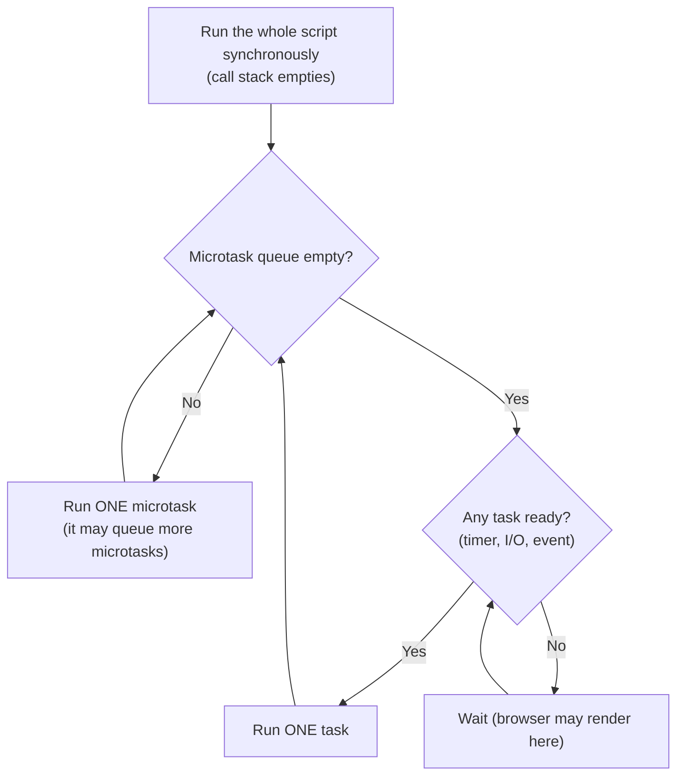
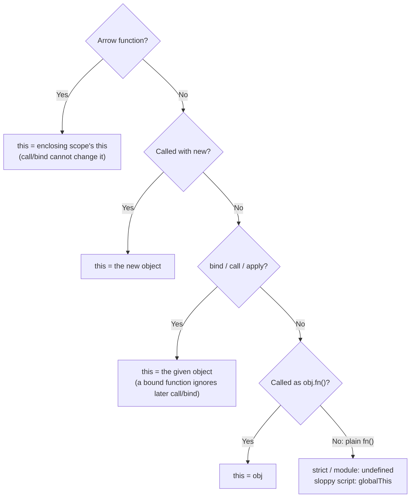

# Output-Prediction & "Gotcha" Questions

!!! abstract "Key takeaways"
    - Answer these with a **method**, not memory: (1) run all synchronous code first, (2) drain **microtasks** (promise callbacks, `await` continuations, `queueMicrotask`), (3) run the next **task** (`setTimeout`, I/O), then repeat.
    - `await x` runs the awaited function **synchronously up to its first `await`**, then puts the rest of the caller in a microtask. Code before the first `await` is synchronous.
    - **Closures capture variables, not values.** `var` gives one shared binding for the whole loop (`3 3 3`); `let` gives a new binding per iteration (`0 1 2`).
    - **Coercion rules:** `+` with a string concatenates, while `-`, `*` and `/` convert to numbers. `==` has special cases (`null == undefined` is true, but `null == 0` is false). `NaN` never equals itself; use `Number.isNaN` or `Object.is`.
    - **Classic traps:**
        - `this` depends on how a function is **called**; arrow functions take it from the enclosing scope.
        - `sort()` with no comparator compares **strings**.
        - `['1','2','3'].map(parseInt)` gives `[1, NaN, NaN]`.
        - `forEach` doesn't wait for `async` callbacks.
        - A `return` in `finally` overrides the `try`'s `return`.

## Why it matters

Senior frontend and full-stack interviews almost always include a few "what does this print?" snippets. They test whether you understand the **runtime model**: the event loop, scope and closures, `this`, coercion and promises. They also reveal the bugs you'll catch in code review.

The trap is guessing. A strong candidate talks through the steps: "Sync first: A, F. Then microtasks in order: C, E, and D because it was queued by C. Then the timer: B." This page gives you that method plus the 20 or so snippets that come up most often. Every output below was checked in **Node 22**. Where browsers or module types differ, it says so.

## Core concepts

### The method: three queues and one rule


*Notice that microtasks drain **completely** after each task, including any microtasks they add. That is why chained `.then`s all run before a `setTimeout(…, 0)`.*

Rules to apply in order:

1. **Synchronous code runs first**, top to bottom. This includes the **executor** of `new Promise(executor)` and the body of an `async` function up to its first `await`.
2. **Microtasks** run next, in the order they were queued: `.then`/`.catch`/`.finally` callbacks, `await` continuations, `queueMicrotask`. A `.then` chained on another `.then` is queued only when the earlier one finishes, so it runs later.
3. **Tasks (macrotasks)** run one at a time: `setTimeout`, `setInterval`, I/O, UI events, `MessageChannel`, `setImmediate` in Node.
4. **Node extras:** `process.nextTick` callbacks run before promise microtasks *when Node drains them*. In an **ES module** the top level already runs inside a microtask, so a promise callback queued there can run **before** `nextTick` (see Q15).

### Scope rules that drive output questions

| Declaration | Hoisted? | Before declaration | Scope | Per-iteration binding in `for` |
|---|---|---|---|---|
| `function f(){}` | Yes, with its body | Callable | Function/block | n/a |
| `var x` | Yes, as `undefined` | `undefined` | Function | No: one shared binding |
| `let` / `const` | Yes, but uninitialised | `ReferenceError` (TDZ) | Block | Yes, a new binding each iteration |
| `class C {}` | Like `let` | `ReferenceError` | Block | n/a |
| `var f = function(){}` | Only `f`, as `undefined` | `typeof f === 'undefined'` | Function | n/a |

### `this` binding, highest priority first


*Notice that `this` depends on the **call site**, not on where the function was defined, except for arrow functions, which use the enclosing scope's `this`.*

{ loading=lazy }
*Notice that the function is identical in every row: only the call site changes, and so does `this`.*

### Coercion rules you actually need

- **`+`**: if either operand is a string (after converting objects to primitives), it concatenates. Otherwise it adds numbers. `[] + []` gives `""` and `[] + {}` gives `"[object Object]"`.
- **`- * / %`, unary `+`** always convert to numbers: `'2' - 1` gives `1`, `+'a'` gives `NaN`, `null + 1` gives `1`, `undefined + 1` gives `NaN`.
- **`==`**:
    - `null` and `undefined` equal each other and nothing else, so `null == 0` is `false`.
    - In every other case, objects become primitives, then booleans and strings become numbers, so `[] == false` is `true` (`'' → 0`).
    - Relational operators (`>=`) *do* convert `null` to `0`, so `null >= 0` is `true` while `null == 0` is `false`.
- **Truthiness**: the only falsy values are `false`, `0`, `-0`, `0n`, `""`, `null`, `undefined` and `NaN`. `'false'`, `[]` and `{}` are truthy.

## In practice: code & configuration

The two places these gotchas cause real bugs: `async` inside `forEach`, and a shared `var` captured by callbacks.

=== "❌ Common mistake"
    ```ts
    // forEach ignores the promises its callback returns, so nothing waits.
    async function saveAll(items: Item[]) {
      items.forEach(async (item) => {
        await api.save(item);          // runs, but forEach doesn't wait for it
      });
      console.log("all saved");        // prints BEFORE any save finishes
    }                                  // and a rejection here becomes an unhandled rejection

    for (var i = 0; i < buttons.length; i++) {
      buttons[i].onclick = () => select(i);  // every handler sees the final i
    }
    ```

=== "✅ Correct approach"
    ```ts
    async function saveAll(items: Item[]) {
      // In parallel: start all saves, then wait for all of them (rejects on the first failure).
      await Promise.all(items.map((item) => api.save(item)));
      // Or sequentially, when order or rate limits matter:
      // for (const item of items) await api.save(item);
      console.log("all saved");
    }

    for (let i = 0; i < buttons.length; i++) {
      buttons[i].onclick = () => select(i);  // let: each iteration has its own i
    }
    ```

{ loading=lazy }
*Watch where each green or red line lands. `forEach` logs before any save is done; `Promise.all` waits for the slowest save; `for…of` waits for all three in turn.*

## Real-world usage

- **Code review:** the patterns above (`forEach(async…)`, a missing `await`, an unhandled rejection, a method passed as a callback that loses `this`) are among the most common review comments in TypeScript code. Lint rules catch many of them: `@typescript-eslint/no-floating-promises`, `no-misused-promises` and `no-loop-func`.
- **React:** stale closures are the same "closures capture variables" idea. A `useEffect` callback captures the props and state of the render that created it.
- **Money and dosages:** `0.1 + 0.2 !== 0.3`. Healthcare and banking code keeps amounts in integer minor units (cents) or uses a decimal library, never floating-point sums.
- **Sorting:** `[10, 1, 2].sort()` gives `[1, 10, 2]`. This shows up in real dashboards. Always pass a comparator for numbers, or use `toSorted((a, b) => a - b)` (ES2023) to avoid mutating.

## Trade-offs & production gotchas

| Pattern | Behaviour | Use when |
|---|---|---|
| `Promise.all` | Fails fast on the first rejection; others keep running | Every result is needed |
| `Promise.allSettled` | Waits for all; never rejects | Partial results are fine (e.g. a dashboard) |
| `Promise.race` | Settles with the first to settle | Timeouts |
| `Promise.any` | First to *fulfil*; `AggregateError` if all reject | Redundant sources (e.g. mirrors) |
| `for…of` + `await` | Sequential | Order or rate limits matter |

!!! warning "Gotcha: environment matters"
    The same snippet can print differently depending on where it runs:
    - **`this` in an arrow function at module top level:** `undefined` in an ES module, `module.exports` (`{}`) in CommonJS, `window` in a classic browser script.
    - **`process.nextTick` vs a promise:** the order differs between ESM and CJS.

    If the interviewer doesn't say, state your assumption: "assuming an ES module in strict mode…".

!!! question "Interview angle"
    Interviewers care more about how you **narrate** than about the final answer. Say which queue each line goes into, out loud. If you get one wrong but your model is correct, that's usually still a pass.

## How this connects to my experience

- **Where I used it:** not a resume claim on its own. It's the runtime model behind the ReactJS application and micro-frontend work on OptumRx Meteor, and behind any Node/TypeScript tooling there.
- **Talking points:**
    - "Bugs I've caught in review: `forEach(async…)`, missing `await` on a save, and a method losing `this` when passed as a callback. We turned on `no-floating-promises` to catch them automatically." *[confirm: lint rules your team enabled]*
    - "In React, stale-closure bugs come from the same 'closures capture bindings' rule. Fix them with correct effect dependencies, functional state updates or `useEffectEvent`."
- **Likely follow-up chain:** "Why does `C` print before `B`?" → "What if the `.then` itself calls `setTimeout`?" → "How would you make `forEach(async)` wait?" → "Parallel or sequential, and what about partial failure?" Answer with the queue model, then `Promise.all` vs `for…of`, then `allSettled` for partial failure.

## Interview questions

Every output was verified in Node 22. Unless stated otherwise, assume an **ES module** (strict mode).

### Fundamentals

??? question "Q1. What does this print?"
    ```js
    console.log('A');
    setTimeout(() => console.log('B'), 0);
    Promise.resolve().then(() => console.log('C')).then(() => console.log('D'));
    queueMicrotask(() => console.log('E'));
    console.log('F');
    ```
    **Answer:** `A F C E D B`.
    - Sync code first: A, F.
    - Microtasks in queue order: C and E were queued during the script. D is queued only when C's callback finishes, so it runs after E.
    - Then the timer task: B.

    **Interviewer listens for:** that microtasks drain before any timer, and that a chained `.then` is queued later.

    **Common wrong answer:** `A F C D E B`, which treats the whole chain as queued at once.

??? question "Q2. `var` vs `let` in a loop with `setTimeout`?"
    ```js
    for (var i = 0; i < 3; i++) setTimeout(() => console.log(i), 0);
    for (let j = 0; j < 3; j++) setTimeout(() => console.log(j), 0);
    ```
    **Answer:** `3 3 3`, then `0 1 2`.
    - `var` creates one function-scoped binding. When the callbacks run, the loop has finished and `i` is 3.
    - `let` creates a new binding per iteration, and each closure captures its own.

    **Interviewer listens for:** "closures capture bindings, not values". Pre-ES6 fixes were an IIFE or `setTimeout(fn, 0, i)`.

    **Common wrong answer:** "`0 1 2` for both", or "`2 2 2`".

??? question "Q3. Hoisting and the TDZ?"
    ```js
    console.log(typeof hoisted, typeof notHoisted);
    function hoisted() {}
    var notHoisted = function () {};
    console.log(tdz); let tdz = 1;
    ```
    **Answer:** `function undefined`, then a **ReferenceError**.
    - Function declarations are hoisted with their bodies.
    - `var` is hoisted as `undefined`.
    - `let` is hoisted but uninitialised (the temporal dead zone).

    **Interviewer listens for:** the term TDZ, and that `typeof` on a TDZ variable *also* throws.

    **Common wrong answer:** "`let` isn't hoisted." It is, but it's uninitialised. The proof is that an outer variable with the same name is still shadowed.

??? question "Q4. Shadowing plus hoisting?"
    ```js
    var x = 1;
    function shadow() { console.log(x); var x = 2; }
    shadow();
    ```
    **Answer:** `undefined`. The inner `var x` is hoisted to the top of `shadow` and shadows the outer `x` before it's assigned.

    **Interviewer listens for:** hoisting is per function scope.

    **Common wrong answer:** `1`.

??? question "Q5. Coercion with `+` and `-`?"
    ```js
    [] + [];  [] + {};  1 + '2';  '2' - 1;  true + 1;  null + 1;  undefined + 1;
    ```
    **Answer:** `""`, `"[object Object]"`, `"12"`, `1`, `2`, `1`, `NaN`. `+` concatenates if either side is a string after conversion to a primitive. Other arithmetic converts to numbers (`null → 0`, `undefined → NaN`).

    **Interviewer listens for:** the ToPrimitive step (arrays → `""`/`"1,2"`, objects → `"[object Object]"`).

    **Common wrong answer:** "`[] + {}` is `0`". That comes from typing `{} + []` in a console, where `{}` is parsed as a block.

??? question "Q6. `typeof` gotchas?"
    ```js
    typeof null; typeof NaN; typeof []; typeof function(){}; typeof class {}; typeof typeof 1;
    ```
    **Answer:** `object`, `number`, `object`, `function`, `function`, `string`.
    - `typeof null === 'object'` is a historical bug.
    - Use `Array.isArray` for arrays and `Number.isNaN` for NaN.

    **Interviewer listens for:** knowing the safe checks to use instead.

    **Common wrong answer:** "`typeof []` is `array`".

### Intermediate

??? question "Q7. async/await ordering (the classic)?"
    ```js
    async function a1() { console.log('a1 start'); await a2(); console.log('a1 end'); }
    async function a2() { console.log('a2'); }
    console.log('script start');
    setTimeout(() => console.log('timeout'), 0);
    a1();
    new Promise(r => { console.log('p1'); r(); }).then(() => console.log('then1'));
    console.log('script end');
    ```
    **Answer:** `script start, a1 start, a2, p1, script end, a1 end, then1, timeout`.
    - `a1` runs synchronously until `await`, and `a2`'s body is synchronous too.
    - The promise executor is synchronous.
    - The `await` continuation is queued before `then1`, so `a1 end` comes first.
    - The timer runs last.

    **Interviewer listens for:** "the code before the first `await` is synchronous; the executor is synchronous."

    **Common wrong answer:** putting `a2` after `script end`, or `timeout` before the microtasks.

??? question "Q8. `this` in methods, arrows and callbacks (ES module)?"
    ```js
    const obj = {
      name: 'obj',
      regular() { return this.name; },
      arrow: () => typeof this,
      nested() { return [1].map(function () { return typeof this; })[0]; },
      nestedArrow() { return [1].map(() => this.name)[0]; },
    };
    console.log(obj.regular(), obj.arrow(), obj.nested(), obj.nestedArrow());
    const f = obj.regular; f();
    ```
    **Answer:** `obj undefined undefined obj`, then `f()` throws a **TypeError**.
    - The arrow function takes `this` from module scope, which is `undefined`.
    - The plain `function` callback is called without a receiver, so in strict mode `this` is `undefined`.
    - The nested arrow takes `this` from `nestedArrow`, which is `obj`.
    - The detached `f()` has `this === undefined`, so reading `.name` throws.

    **Interviewer listens for:** call-site binding, and that arrow functions are lexical. Fixes are `bind`, an arrow wrapper, or class-field arrow functions.

    **Common wrong answer:** "`arrow` returns `obj`".

??? question "Q9. Can `bind` be overridden?"
    ```js
    const bound = obj.regular.bind({ name: 'other' });
    console.log(bound(), bound.call({ name: 'third' }));
    ```
    **Answer:** `other other`. A bound function's `this` is fixed. `call`, `apply` and a second `bind` can't change it, though `new` can.

    **Interviewer listens for:** the order of precedence: new > bind > call/apply > method call > default.

    **Common wrong answer:** `other third`.

??? question "Q10. `['1','2','3'].map(parseInt)`?"
    **Answer:** `[1, NaN, NaN]`.
    - `map` passes `(value, index, array)`, so the calls are `parseInt('1', 0)` (radix 0 means default, giving 1), `parseInt('2', 1)` (invalid radix, NaN) and `parseInt('3', 2)` (3 isn't a binary digit, NaN).
    - The fix is `.map(Number)` or `.map(s => parseInt(s, 10))`.

    **Interviewer listens for:** knowing map's callback signature.

    **Common wrong answer:** `[1, 2, 3]`.

??? question "Q11. Default `sort`?"
    ```js
    [10, 1, 2, 25].sort();  [3, 20, 100].sort();
    ```
    **Answer:** `[1, 10, 2, 25]` and `[100, 20, 3]`. With no comparator, elements are compared as **UTF-16 strings**. It also sorts **in place**. Use `(a, b) => a - b`, and `toSorted` to avoid mutating.

    **Interviewer listens for:** string comparison and in-place mutation.

    **Common wrong answer:** a numerically sorted result.

??? question "Q12. Equality edge cases?"
    ```js
    null == undefined; null == 0; null >= 0; '' == 0; '0' == false; [] == false;
    NaN === NaN; Object.is(NaN, NaN); Object.is(0, -0); 0.1 + 0.2 === 0.3;
    ```
    **Answer:** `true false true true true true false true false false`.
    - `null` only loosely equals `undefined`, but relational operators convert it to 0.
    - `Object.is` treats `NaN` as equal to itself and tells `0` and `-0` apart.
    - Floating-point addition gives `0.30000000000000004`.

    **Interviewer listens for:** using `===`, with `x == null` as the one accepted shortcut for "null or undefined".

    **Common wrong answer:** "`null >= 0` is false".

### Senior

??? question "Q13. `try`/`finally` with `return`?"
    ```js
    function f1() { try { return 'try'; } finally { console.log('finally runs'); } }
    function f2() { try { return 'try'; } finally { return 'finally'; } }
    console.log(f1()); console.log(f2());
    ```
    **Answer:** `finally runs`, `try`, then `finally`.
    - `finally` always runs.
    - A `return` (or `throw`) inside `finally` **replaces** the pending return value, and can also swallow exceptions.

    **Interviewer listens for:** "never return from finally" (ESLint `no-unsafe-finally`).

    **Common wrong answer:** "f2 returns 'try'".

??? question "Q14. `forEach` with an async callback?"
    ```js
    const out = [];
    [3, 1, 2].forEach(async n => { await sleep(n * 5); out.push(n); });
    console.log(out.length);              // ?
    setTimeout(() => console.log(out), 40); // ?
    ```
    **Answer:** `0`, then `[1, 2, 3]`.
    - `forEach` ignores the returned promises, so the log runs immediately.
    - The pushes finish in timer order, which is completion order, not array order.

    **Interviewer listens for:** using `Promise.all(map)` for parallel or `for…of` + `await` for sequential, and handling rejections.

    **Common wrong answer:** `3` and `[3, 1, 2]`.

??? question "Q15. Node: `nextTick` vs promise vs timer vs `setImmediate`?"
    ```js
    setTimeout(() => console.log('T'), 0);
    setImmediate(() => console.log('immediate'));
    process.nextTick(() => console.log('tick'));
    Promise.resolve().then(() => console.log('micro'));
    ```
    **Answer:**
    - In **CommonJS:** `tick micro T immediate`. The nextTick queue drains before promise microtasks.
    - In an **ES module**: `micro tick …`. The module's top-level code already runs inside a microtask, so the promise job runs before Node gets to process the nextTick queue.
    - From the main module, `T` vs `immediate` order isn't guaranteed. Inside an I/O callback, `setImmediate` always comes first.

    **Interviewer listens for:** the nextTick queue being separate, and an honest "it depends on module type and phase".

    **Common wrong answer:** "nextTick always runs first".

??? question "Q16. Shallow copy, `structuredClone` and `Object.freeze`?"
    ```js
    const orig = { a: 1, nested: { b: 2 } };
    const shallow = { ...orig }; shallow.a = 9; shallow.nested.b = 99;
    console.log(orig.a, orig.nested.b);
    const frozen = Object.freeze({ inner: { v: 1 } }); frozen.inner.v = 2;
    console.log(frozen.inner.v);
    ```
    **Answer:** `1 99`, then `2`.
    - Spread copies one level, so `nested` is shared.
    - `freeze` is shallow too. Assigning to a frozen top-level property would throw in strict mode.
    - `structuredClone` deep-copies, but it can't clone functions or DOM nodes.

    **Interviewer listens for:** reference sharing, and why React state updates must copy every level they change.

    **Common wrong answer:** `1 2`.

??? question "Q17. Objects as object keys?"
    ```js
    const k1 = {}, k2 = {}, o = {};
    o[k1] = 'one'; o[k2] = 'two';
    console.log(o[k1], Object.keys(o));
    ```
    **Answer:** `two ['[object Object]']`. Property keys are converted to strings, so both objects become the same key. Use a `Map` (or a `WeakMap` when the key's lifetime should control the entry).

    **Interviewer listens for:** Map vs object and key coercion. Integer-like keys are listed first in ascending order: `Object.keys({b:1, 2:1, a:1, 1:1})` gives `['1','2','b','a']`.

    **Common wrong answer:** `one`.

??? question "Q18. Promise combinators: what settles?"
    ```js
    Promise.all([P(1), Promise.reject('bad'), P(3)]).then(console.log, e => console.log('all:', e));
    Promise.allSettled([P(1), Promise.reject('bad')]).then(r => console.log(r.map(x => x.status)));
    Promise.any([Promise.reject('a'), P('b')]).then(console.log);
    ```
    **Answer:** `all: bad`, `['fulfilled','rejected']`, `b`.
    - `all` rejects on the first rejection.
    - `allSettled` never rejects.
    - `any` takes the first fulfilment, and rejects with `AggregateError` only if every promise rejects.

    **Interviewer listens for:** which one to choose for partial failure, and that `all` doesn't cancel the others (use `AbortController` for that).

    **Common wrong answer:** "`all` waits for everything before rejecting".

### Scenario-based

??? question "Q19. A teammate's button handler logs `undefined`. Diagnose it."
    ```js
    class Cart { items = []; add(x) { this.items.push(x); } }
    const cart = new Cart();
    button.addEventListener('click', cart.add);
    ```
    **Answer:**
    - **Why:** passing `cart.add` detaches it. The DOM calls it with `this = button`, so `this.items` is `undefined` and `push` throws. In a plain call, `this` would be `undefined`.
    - **Fixes:** `() => cart.add(x)`, `cart.add.bind(cart)`, or define `add = (x) => {…}` as a class-field arrow function. Note that the field version creates a copy per instance.

    **Interviewer listens for:** a clear diagnosis based on the call site, and the trade-offs between the fixes.

    **Common wrong answer:** "use `var self = this`" without explaining why.

??? question "Q20. Prices on a checkout page show 0.30000000000000004. What's the production fix?"
    **Answer:**
    - Don't do money arithmetic in IEEE-754 doubles. Store and compute in **integer minor units** (cents), or use a decimal library or BigInt.
    - Format only at the edge, with `Intl.NumberFormat`.
    - `toFixed` for display is a band-aid: it still rounds wrongly in edge cases (`1.005.toFixed(2)` gives `"1.00"`).

    **Interviewer listens for:** integer cents, server-side authority on totals, and rounding rules agreed with the business.

    **Common wrong answer:** "use `toFixed(2)` everywhere".

## Cheat sheet

| Concept | Remember |
|---|---|
| Order | sync → **all** microtasks → one task → microtasks → … |
| Microtasks | `.then/.catch/.finally`, `await` continuation, `queueMicrotask` (Node: `nextTick` queue is separate) |
| Promise executor | Runs **synchronously** |
| `async fn()` | Body runs synchronously until the first `await` |
| `var` in loop | One binding: `3 3 3`. `let`: `0 1 2` |
| TDZ | `let`/`const`/`class` are hoisted but throw `ReferenceError` before declaration |
| `this` | new > bind > call/apply > `obj.fn()` > default (`undefined` strict). Arrows are lexical |
| `+` | Any string → concatenation. `[]+[]` = `""`, `[]+{}` = `"[object Object]"` |
| `==` | `null == undefined` only. `null >= 0` true. `NaN` ≠ anything |
| `typeof null` | `"object"`. `typeof class{}` → `"function"` |
| `sort()` | String compare and in place. Use `(a,b)=>a-b` / `toSorted` |
| `map(parseInt)` | `[1, NaN, NaN]` (index passed as radix) |
| `finally` | Always runs. A `return` there overrides |
| `forEach(async)` | Doesn't wait. Use `Promise.all(map)` / `for…of` |
| Copies | Spread/`Object.assign`/`freeze` are shallow. `structuredClone` is deep (no functions) |
| Object keys | Stringified. Use `Map`. Integer-like keys are listed first |
| Floats | `0.1+0.2 = 0.30000000000000004`. Use integer cents for money |

## Sources
1. [MDN: The event loop / Using microtasks](https://developer.mozilla.org/en-US/docs/Web/API/HTML_DOM_API/Microtask_guide): microtask draining and ordering.
2. [Node.js docs: The Node.js event loop, timers and process.nextTick()](https://nodejs.org/en/learn/asynchronous-work/event-loop-timers-and-nexttick): phases, `setImmediate` vs `setTimeout`, nextTick queue.
3. [MDN: `this`](https://developer.mozilla.org/en-US/docs/Web/JavaScript/Reference/Operators/this): binding rules, arrow functions, strict mode.
4. [MDN: Equality comparisons and sameness](https://developer.mozilla.org/en-US/docs/Web/JavaScript/Equality_comparisons_and_sameness): `==`, `===`, `Object.is`.
5. [MDN: `let` (temporal dead zone)](https://developer.mozilla.org/en-US/docs/Web/JavaScript/Reference/Statements/let): hoisting and TDZ.
6. [MDN: `Array.prototype.sort`](https://developer.mozilla.org/en-US/docs/Web/JavaScript/Reference/Global_Objects/Array/sort): default string comparison, in-place; `toSorted`.
7. [MDN: `parseInt`](https://developer.mozilla.org/en-US/docs/Web/JavaScript/Reference/Global_Objects/parseInt): radix argument.
8. [MDN: `try...catch` (the finally block)](https://developer.mozilla.org/en-US/docs/Web/JavaScript/Reference/Statements/try...catch): control flow in `finally`.
9. [typescript-eslint: no-floating-promises / no-misused-promises](https://typescript-eslint.io/rules/no-floating-promises/): lint rules for promise mistakes.
10. Verified locally: every output on this page was run in Node.js 22 (ESM unless noted).
