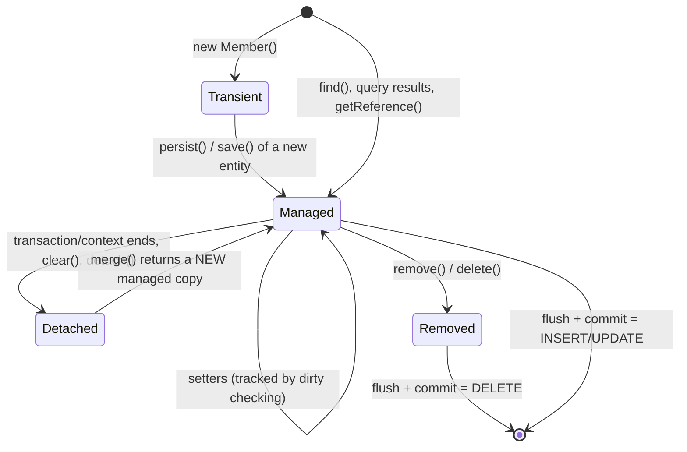
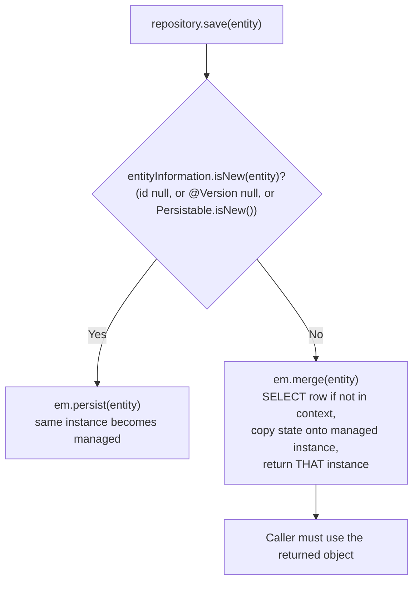
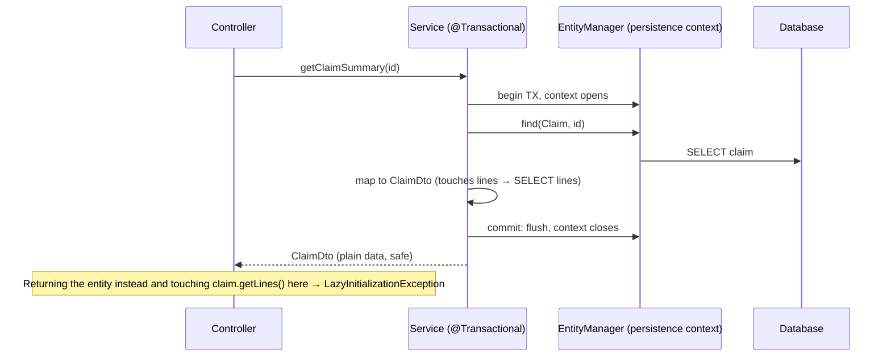

# Entity Lifecycle & Persistence Context

!!! abstract "TL;DR"
    - An entity is in one of four states: **transient** (new, unknown to JPA), **managed** (attached to a persistence context, changes tracked), **detached** (was managed, context closed), **removed** (scheduled for delete).
    - The **persistence context** (Hibernate `Session`, JPA `EntityManager`) is an **identity map** (one Java object per row per context) and a **unit of work**: it records changes and writes them at **flush**, normally just before commit.
    - **Dirty checking:** modify a managed entity and the `UPDATE` happens at flush **without calling `save()`**. Changes to **detached** objects are ignored unless you `merge()` them.
    - `persist()` makes the *same* object managed; `merge()` copies state onto a **different managed instance** and returns it. Spring Data `save()` calls `persist` if the entity looks new, otherwise `merge`, so an entity with a **manually assigned id** triggers a `SELECT` before the `INSERT`.
    - In Spring the context is **transaction-scoped**: it lives for the `@Transactional` method. Touching a lazy association after that → **`LazyInitializationException`**. Don't fix it with `open-in-view` or `EAGER`; fetch what you need in the query.

## Why it matters

Most JPA bugs in production are lifecycle bugs: "my change wasn't saved" (detached entity), "an update happened I didn't ask for" (dirty checking on an entity I only meant to read), `LazyInitializationException` in a controller, stale data overwriting newer data through `merge`, or a batch job that runs out of memory because the persistence context holds 500,000 managed entities.

Interviewers use this topic to separate people who call `repository.save()` from people who understand **what Hibernate does between `begin` and `commit`**. That understanding is the base for the next pages on fetching, N+1, caching and locking.

## Core concepts

### The four states


*Notice that only managed entities are tracked. A detached object is a plain Java object: changing it does nothing until it goes back through `merge()`, which attaches a copy, not the object you passed.*

| State | In a persistence context? | Has a DB row? | Changes written at flush? |
|---|---|---|---|
| Transient | No | No | No |
| Managed | Yes | Yes (or pending INSERT) | **Yes** (dirty checking) |
| Detached | No | Yes | No |
| Removed | Yes, marked for deletion | Yes until flush | DELETE at flush |

### The persistence context: identity map and unit of work

- **Identity map / first-level cache:** within one context, loading the same row twice returns **the same Java instance**, and the second `find()` doesn't hit the database. Verified: two `findById(id)` calls in one transaction returned `a == b` with **one** database load.
- **Unit of work:** inserts, updates and deletes are queued and written at **flush** in a dependency-safe order (write-behind). This lets Hibernate batch statements (`hibernate.jdbc.batch_size`) and avoid writing intermediate states.
- **Snapshot-based dirty checking:** when an entity is loaded, Hibernate keeps a copy of its state. At flush it compares current values with the snapshot and issues `UPDATE` for changed entities. That is why there is no need to call `save()` on a managed entity, and also why loading thousands of entities in a read-write transaction costs memory and flush time.

### Flushing

Flush means "send pending SQL to the database"; it does **not** commit.

| Trigger | Notes |
|---|---|
| Before commit | Always |
| Before a query that might be affected (`FlushModeType.AUTO`, the default) | Hibernate flushes pending changes so JPQL results are consistent with in-memory changes |
| `entityManager.flush()` / `saveAndFlush()` | Explicitly, e.g. to get constraint violations early or to see DB-generated values |
| `FlushModeType.COMMIT` | Only at commit; queries may not see your pending changes |

With `@Transactional(readOnly = true)`, Spring sets Hibernate's flush mode to `MANUAL` and the session read-only, so no dirty checking or flush happens, which saves memory and CPU for read paths.

### persist vs merge vs save


*Notice the trap on the right: with an assigned id (a natural key or a client-generated UUID) Spring Data thinks the entity is not new, so `save()` does a `merge`, which first SELECTs the row to see whether it exists.*

**Verified on Hibernate 6.6.29 / Spring Boot 3.5:**

| Experiment | Result |
|---|---|
| Load a member in a transaction, change `email`, **no `save()`** | 1 `UPDATE` at commit |
| `findById` twice in one transaction | Same instance, 1 database load |
| Change a **detached** member, commit an empty transaction | Change **not** persisted |
| `save(detached)` | Returned a **different** instance; change persisted; `@Version` went from 1 to 2 |
| `save(new Pharmacy("PH1", …))` with an assigned `@Id` | 2 statements: a `SELECT`, then the `INSERT` |
| `save(stale)` where the row's version had moved on | `ObjectOptimisticLockingFailureException` |
| `getReferenceById(id)` returned from a transaction, then `getEmail()` outside it | `LazyInitializationException` |
| Same proxy, but direct field access `ref.email` | Silently `null`: proxies only intercept **method** calls |

**Fixes for the assigned-id trap:** let the database or Hibernate generate ids; or add a `@Version` field (a null version means new); or implement `Persistable<ID>` with an `isNew()` flag; or call `entityManager.persist()` directly.

### Transaction-scoped context in Spring


*Notice that mapping to a DTO inside the transaction is what makes the controller safe. The entity becomes detached the moment the service method returns.*

- Spring's shared `EntityManager` proxy binds a real persistence context to the current transaction (thread-bound). Repositories called inside the same `@Transactional` method share it.
- Outside a transaction, each repository call gets its own short-lived context, so two `findById` calls return different instances and no lazy loading works afterwards.
- **Extended persistence contexts** (`PersistenceContextType.EXTENDED`) span several transactions; they're used in stateful EJB-style designs and rarely in Spring services.

### Open Session in View (OSIV)

Spring Boot enables `spring.jpa.open-in-view=true` by default and logs a warning at startup. It keeps the persistence context open until the HTTP response is rendered, so lazy associations load during JSON serialisation. That hides `LazyInitializationException` but causes **N+1 queries in the view layer**, holds a database connection for the whole request, and runs SQL outside any transaction. Set it to `false` for APIs and fetch what each use case needs (fetch joins, entity graphs or DTO projections, covered in the next pages).

### Entity callbacks and listeners

`@PrePersist`, `@PostPersist`, `@PreUpdate`, `@PostLoad`, `@PreRemove` and entity listeners (`@EntityListeners(AuditingEntityListener.class)` for Spring Data's `@CreatedDate`/`@LastModifiedDate`/`@CreatedBy`) run at lifecycle transitions. `@PreUpdate` only fires when dirty checking actually finds a change, at flush time.

### equals and hashCode for entities

- Don't base `equals`/`hashCode` on a generated id that is `null` until persist: a transient entity put in a `HashSet` changes its hash after saving.
- Options: a **natural/business key** that never changes; or a **UUID assigned at construction**; or the Hibernate-recommended pattern of id-based `equals` with a constant `hashCode` (`getClass().hashCode()`).
- Never use Lombok `@Data` on entities (generated `equals`/`hashCode`/`toString` touch every field, including lazy collections).

## In practice: code & configuration

```yaml
spring:
  jpa:
    open-in-view: false                 # no lazy loading during view rendering / JSON serialisation
    properties:
      hibernate:
        jdbc.batch_size: 50             # batch INSERT/UPDATE statements at flush
        order_inserts: true
        order_updates: true
        generate_statistics: false      # true in tests to assert query counts
```

=== "❌ Common mistake"
    ```java
    @Service
    class MemberService {

        // No transaction: the entity is detached as soon as findById returns.
        public void changeEmail(Long id, String email) {
            Member m = members.findById(id).orElseThrow();
            m.setEmail(email);                       // detached: this change is silently lost
        }

        @Transactional
        public Member rename(Member incoming) {
            members.save(incoming);                  // merge: copies incoming onto a managed instance...
            incoming.setName("x");                   // ...but this object is NOT managed: change lost
            return incoming;                         // returns the detached copy
        }

        // Returns an entity to the controller: lazy collections blow up during JSON rendering
        @Transactional(readOnly = true)
        public Member get(Long id) { return members.findById(id).orElseThrow(); }
    }
    ```

=== "✅ Correct approach"
    ```java
    @Service
    class MemberService {

        private final MemberRepository members;

        MemberService(MemberRepository members) { this.members = members; }

        @Transactional                               // one persistence context for the whole use case
        public void changeEmail(Long id, String email) {
            Member m = members.findById(id).orElseThrow(() -> new NotFoundException("Member"));
            m.changeEmail(email);                    // managed: dirty checking issues the UPDATE at commit
        }                                            // no save() needed

        @Transactional
        public MemberView applyUpdate(Long id, UpdateMemberRequest req, long expectedVersion) {
            Member m = members.findById(id).orElseThrow(() -> new NotFoundException("Member"));
            if (m.getVersion() != expectedVersion) throw new VersionConflictException();   // -> 412
            m.updateContact(req.email(), req.phone());                                      // only allowed fields
            return MemberView.from(m);               // map inside the transaction
        }

        @Transactional(readOnly = true)              // flush mode MANUAL: no dirty checking overhead
        public MemberView get(Long id) {
            return members.findById(id).map(MemberView::from)
                    .orElseThrow(() -> new NotFoundException("Member"));
        }
    }

    @Entity
    class Member {
        @Id @GeneratedValue(strategy = GenerationType.SEQUENCE)
        private Long id;
        @Version private long version;               // optimistic locking + "is new" detection
        private String email;
        private String phone;

        protected Member() {}                        // required by JPA

        void changeEmail(String email) { this.email = email; }
        void updateContact(String email, String phone) { this.email = email; this.phone = phone; }
        Long getId() { return id; }
        long getVersion() { return version; }
        String getEmail() { return email; }

        @Override public boolean equals(Object o) {  // id-based equals, constant hashCode (Hibernate guidance)
            return this == o || (o instanceof Member other && id != null && id.equals(other.id));
        }
        @Override public int hashCode() { return getClass().hashCode(); }
    }
    ```

**Batch processing without exhausting memory:** the persistence context grows with every managed entity. Flush and clear in chunks, or use a `StatelessSession`/JDBC batch for bulk work:

```java
@Transactional
public void importMembers(List<MemberRow> rows) {
    for (int i = 0; i < rows.size(); i++) {
        em.persist(Member.from(rows.get(i)));
        if (i % 50 == 49) {          // match hibernate.jdbc.batch_size
            em.flush();              // send the batched INSERTs
            em.clear();              // detach everything: context memory stays flat
        }
    }
}
```

With `GenerationType.IDENTITY` (auto-increment columns), Hibernate must insert immediately to learn the id, which **disables JDBC insert batching**. Prefer `SEQUENCE` with an allocation size (the Hibernate default pooled optimiser) on PostgreSQL and Oracle.

## Real-world usage

- **Vlad Mihalcea's** articles and *High-Performance Java Persistence* are the standard references for flush ordering, batching, OSIV and the `save()`/merge trap; Hibernate's own user guide documents dirty checking and `equals`/`hashCode` guidance.
- **Spring Boot** warns about `open-in-view` at startup precisely because so many production N+1 issues come from it.
- **Typical incident:** a nightly import loaded 2 million entities in one transaction; dirty checking at flush took minutes and the JVM ran out of heap. Chunked `flush()`/`clear()` with batch inserts fixed it.
- **Healthcare and banking:** the "lost update via stale merge" problem (an old detached copy overwriting a newer edit) is why `@Version` columns are mandatory on editable entities in most regulated systems.

## Trade-offs & production gotchas

| Option | Pros | Cons | Use when |
|---|---|---|---|
| Rely on dirty checking | Less code, consistent | Hidden UPDATEs if you mutate entities you only meant to read | Write use cases in a transaction |
| `readOnly = true` transactions | No snapshots or flush, can route to replicas | Writes silently not flushed | All read use cases |
| `merge()` detached objects | Works across requests | Overwrites with stale data unless versioned; extra SELECT | Rare; prefer load-and-modify |
| Load-modify-commit | Clear, safe with `@Version` | One SELECT per entity | Default for updates |
| OSIV on | Nothing breaks visibly | N+1 in views, long-held connections | Server-rendered legacy apps only |
| `flush()`/`clear()` chunks | Flat memory for bulk work | Entities become detached | Batch imports |

!!! warning "Gotcha: assigned ids make save() SELECT first"
    Client-generated UUIDs or natural keys make Spring Data treat new entities as existing, so every `save()` does a `merge` with a `SELECT`. Add `@Version` (null means new), implement `Persistable`, or use `persist` directly.

!!! warning "Gotcha: field access on proxies"
    Proxies (from `getReferenceById` or lazy `@ManyToOne`) only initialise on **method** calls. Code that reads fields directly, such as `equals` comparing `other.id` on a proxy, sees `null`. Use getters when the other object may be a proxy.

!!! warning "Gotcha: `@Transactional` on private or self-invoked methods"
    The proxy that opens the transaction is bypassed, so there's no persistence context and no dirty checking. See [AOP & proxies](../spring-boot/04-aop-and-proxies.md).

## How this connects to my experience

- **Where I used it:** not ★, but Hibernate and JPA are listed skills, and Spring Boot REST services backed by RDS/relational databases appear at Deloitte (ConvergeHealth) and Coriolis (CCKM). At OptumRx the main store was MongoDB, where Spring Data MongoDB has no persistence context or dirty checking, which is a useful contrast. *[confirm which services used JPA]*
- **Talking points:**
    - "I set `open-in-view: false` on API services and map entities to DTOs inside the service transaction, so lazy-loading problems show up in tests, not in production JSON rendering."
    - "For editable records I use `@Version` with ETags, so a stale edit fails with 412 instead of overwriting newer data."
    - "Bulk jobs flush and clear in chunks with JDBC batching and sequence ids." *[confirm where you applied it]*
- **Likely follow-up chain:** "What is the persistence context?" → identity map + unit of work → "Why didn't my change save?" (detached entity / no transaction) → "persist vs merge?" (same instance vs copy, SELECT on assigned ids) → "How do you avoid LazyInitializationException without OSIV?" (fetch joins, entity graphs, DTO projections).

## Interview questions

### Fundamentals

??? question "Q1. What are the JPA entity states?"
    **Answer:** Transient (new object, not associated with a persistence context, no row), managed (attached, changes tracked and flushed), detached (previously managed, context closed or cleared, changes not tracked), and removed (managed but scheduled for deletion at flush).

    **Interviewer listens for:** four states, what triggers each transition, that only managed entities are tracked.

    **Common wrong answer:** "New, saved and deleted."

??? question "Q2. What is the persistence context?"
    **Answer:** The set of managed entity instances for one `EntityManager`/`Session`. It is an identity map (one instance per row, which acts as a first-level cache) and a unit of work (it queues changes and writes them at flush). In Spring it's normally scoped to the transaction.

    **Interviewer listens for:** identity map, first-level cache, unit of work, transaction scope.

    **Common wrong answer:** "It's the database connection."

??? question "Q3. What is dirty checking?"
    **Answer:** When Hibernate loads an entity it keeps a snapshot of its state. At flush it compares each managed entity with its snapshot and issues `UPDATE`s for the changed ones. So modifying a managed entity inside a transaction is enough; no `save()` call is needed.

    **Interviewer listens for:** snapshot comparison at flush, no save needed, cost with many entities.

    **Common wrong answer:** "Hibernate updates the database immediately when you call a setter."

??? question "Q4. What's the difference between flush and commit?"
    **Answer:** Flush sends the pending SQL statements to the database within the current transaction; the changes are still uncommitted and can be rolled back. Commit ends the transaction and makes changes durable. Hibernate flushes automatically before commit and before queries that might see pending changes (AUTO mode).

    **Interviewer listens for:** flush ≠ commit, rollback still possible, auto-flush before queries.

    **Common wrong answer:** "Flush saves the data permanently."

### Intermediate

??? question "Q5. persist() vs merge()?"
    **Answer:** `persist` makes the given transient instance managed (the same object), and an INSERT is scheduled. `merge` copies the state of a detached (or transient) object onto a managed instance, loading it first if needed, and returns that managed instance; the argument stays unmanaged. Code must use the returned object.

    **Interviewer listens for:** same instance vs copy, SELECT on merge, using the return value.

    **Common wrong answer:** "merge is for updates and persist is for inserts, otherwise they're the same."

??? question "Q6. What does Spring Data's save() do?"
    **Answer:** It checks whether the entity is new (id is null, or the `@Version` attribute is null, or `Persistable.isNew()`). New → `em.persist(entity)` and returns it. Not new → `em.merge(entity)` and returns the merged managed instance. With assigned ids this means a SELECT before every insert.

    **Interviewer listens for:** isNew rules, persist vs merge, the assigned-id SELECT.

    **Common wrong answer:** "save always inserts or updates the row directly."

??? question "Q7. Why do you get LazyInitializationException and how do you fix it properly?"
    **Answer:** A lazy association or proxy is initialised after its persistence context has closed, typically in a controller or during JSON serialisation after the `@Transactional` service returned. Fix by loading what the use case needs inside the transaction: a fetch join, an entity graph, or a DTO projection, and return DTOs. Not by turning on OSIV or switching to `EAGER`.

    **Interviewer listens for:** context closed, use-case-specific fetching, DTOs, why OSIV/EAGER are bad fixes.

    **Common wrong answer:** "Set `spring.jpa.open-in-view=true` or make the association EAGER."

??? question "Q8. What does `@Transactional(readOnly = true)` change for Hibernate?"
    **Answer:** Spring sets the Hibernate session to read-only and the flush mode to `MANUAL`, so Hibernate doesn't keep snapshots for dirty checking and doesn't flush. The JDBC connection is marked read-only, which some drivers and routing data sources use to send queries to replicas. It's a hint, not a security guarantee.

    **Interviewer listens for:** no dirty checking or flush, memory saving, replica routing, not a guarantee.

    **Common wrong answer:** "It prevents any writes to the database."

### Senior

??? question "Q9. What's wrong with Open Session in View?"
    **Answer:** It keeps the persistence context (and a connection) open until the response is rendered, so lazy loading happens in the web layer: N+1 queries hidden in serialisation, SQL running outside a transaction with auto-commit, connections held for slow clients, and an API whose cost depends on what the serializer touches. Disable it for APIs and design explicit fetching per use case.

    **Interviewer listens for:** N+1 in the view, connection holding, non-transactional SQL, explicit fetching.

    **Common wrong answer:** "It's fine; it's the Spring Boot default."

??? question "Q10. How do you process millions of rows with JPA without running out of memory?"
    **Answer:** Don't keep them all managed. Read in pages or a scrollable/stream result, process in chunks, and call `flush()` and `clear()` every N entities (matching `hibernate.jdbc.batch_size`). Use sequence ids so inserts can batch. For pure bulk operations prefer bulk JPQL/SQL updates, a `StatelessSession`, or JDBC batching.

    **Interviewer listens for:** flush/clear, batching, sequence vs identity, bulk statements, stateless session.

    **Common wrong answer:** "Increase the heap."

??? question "Q11. How should you implement equals and hashCode on an entity?"
    **Answer:** Not with a generated id alone in `hashCode` (it changes from null to a value on persist, breaking hash-based collections). Use a stable natural key, or a UUID assigned in the constructor, or id-based `equals` with a constant `hashCode`. Use getters (proxies), avoid lazy associations, and don't use Lombok `@Data`.

    **Interviewer listens for:** changing hash on persist, stable key options, proxy awareness.

    **Common wrong answer:** "Generate them with all fields using the IDE."

??? question "Q12. Why can GenerationType.IDENTITY hurt performance?"
    **Answer:** With identity columns the database generates the id during the INSERT, so Hibernate must execute each INSERT immediately at `persist()` to learn the id. That disables JDBC batch inserts and write-behind ordering. `SEQUENCE` with a pooled optimiser lets Hibernate assign ids in memory and batch inserts at flush.

    **Interviewer listens for:** immediate insert, no batching, sequence + allocation size.

    **Common wrong answer:** "IDENTITY is always the best choice because it's simplest."

### Scenario-based

??? question "Q13. A developer says 'I updated the entity but the change isn't in the database'. How do you debug?"
    **Answer:** Check whether the entity was managed at the time: was the method `@Transactional`, and is it called through the Spring proxy (not self-invoked or private)? Was the object detached (loaded in another transaction, deserialized from a request, cached)? Did they modify the argument of `save()` instead of the returned merged instance? Is the transaction read-only (flush mode MANUAL)? Did it roll back? Enable SQL logging to see whether an UPDATE was issued.

    **Interviewer listens for:** managed vs detached, proxy bypass, merge return value, readOnly, rollback.

    **Common wrong answer:** "Add `saveAndFlush` everywhere."

??? question "Q14. Two users edit the same member. The second user's older form overwrites the first user's change. Why, and how do you prevent it?"
    **Answer:** The second request merges a stale detached copy (or loads, applies all fields from an old form and saves), so last write wins. Add a `@Version` column, send the version to the client (ETag), and on update compare it (`If-Match`) or let Hibernate's optimistic locking throw on a stale merge; return 412 or 409 and let the user reload. Also update only changed fields rather than copying the whole form.

    **Interviewer listens for:** stale merge, @Version, ETag/If-Match, conflict response.

    **Common wrong answer:** "Lock the row with SELECT FOR UPDATE while the user edits."

??? question "Q15. After enabling `open-in-view: false`, several endpoints throw LazyInitializationException. What's your migration plan?"
    **Answer:** That's the hidden lazy loading surfacing. Find each failing endpoint with integration tests, then make fetching explicit per use case: DTO projections for read endpoints, `JOIN FETCH` or `@EntityGraph` where entities are needed, and map to response DTOs inside the service transaction. Add query-count assertions in tests to prevent N+1 regressions. Roll out service by service rather than keeping OSIV forever.

    **Interviewer listens for:** treating failures as discovered N+1, explicit fetching, DTO mapping, query-count tests.

    **Common wrong answer:** "Turn OSIV back on."

## Cheat sheet

| Concept | Remember |
|---|---|
| States | Transient → managed → detached / removed |
| Persistence context | Identity map + first-level cache + unit of work; transaction-scoped in Spring |
| Dirty checking | Snapshot vs current at flush; no `save()` needed for managed entities |
| Flush | Sends SQL, doesn't commit. AUTO: before commit and relevant queries |
| persist / merge | Same instance managed / copy onto managed instance, use the return value |
| `save()` | isNew? persist : merge. Assigned ids → SELECT first (fix: `@Version`, `Persistable`) |
| readOnly TX | Flush MANUAL, no snapshots, replica routing hint |
| LazyInitializationException | Fetch per use case (join fetch, entity graph, DTO); not OSIV/EAGER |
| OSIV | `spring.jpa.open-in-view=false` for APIs |
| Bulk | flush + clear every N, batch_size, SEQUENCE not IDENTITY |
| equals/hashCode | Stable key or id-equals + constant hash; getters for proxies |

## Sources
1. [Jakarta Persistence 3.2 specification: entity instance lifecycle, persistence contexts](https://jakarta.ee/specifications/persistence/3.2/).
2. [Hibernate ORM 6.6 User Guide: persistence contexts, flushing, dirty checking, batching](https://docs.jboss.org/hibernate/orm/6.6/userguide/html_single/Hibernate_User_Guide.html).
3. [Spring Data JPA reference: saving entities and entity state detection](https://docs.spring.io/spring-data/jpa/reference/jpa/entity-persistence.html).
4. [Spring Boot reference: Open EntityManager in View](https://docs.spring.io/spring-boot/reference/data/sql.html#data.sql.jpa-and-spring-data.open-entity-manager-in-view).
5. [Vlad Mihalcea: The best way to implement equals, hashCode and toString with JPA and Hibernate](https://vladmihalcea.com/the-best-way-to-implement-equals-hashcode-and-tostring-with-jpa-and-hibernate/).
6. [Vlad Mihalcea: The Open Session In View anti-pattern](https://vladmihalcea.com/the-open-session-in-view-anti-pattern/).
7. Vlad Mihalcea, *High-Performance Java Persistence*: flushing, batching, identifiers.
8. Experiments on this page: Spring Boot 3.5.6, Hibernate ORM 6.6.29, H2, `@DataJpaTest` with Hibernate statistics, run while writing this page.
