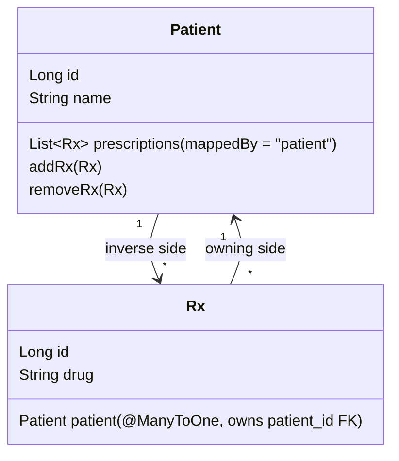
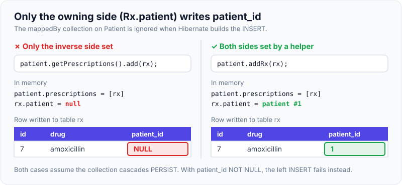
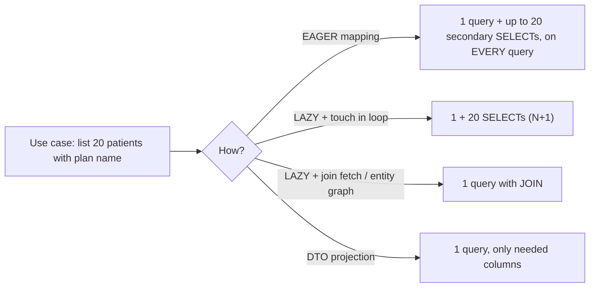

# Relationships & Fetching (Lazy vs Eager)

!!! abstract "Key takeaways"
    - Every bidirectional association has an **owning side** (the one with the foreign key, usually `@ManyToOne`) and an **inverse side** (`mappedBy`). **Only the owning side is written to the database**, so set it, and keep both sides in sync with helper methods (`addRx()`/`removeRx()`).
    - JPA defaults: **`@ManyToOne` and `@OneToOne` are EAGER**, `@OneToMany` and `@ManyToMany` are LAZY. Make **every association `LAZY`** and fetch what each use case needs with a join fetch, entity graph or DTO projection. EAGER can't be turned off per query and causes hidden extra queries.
    - Prefer **bidirectional `@OneToMany(mappedBy)` + `@ManyToOne`** or just the `@ManyToOne`. A **unidirectional `@OneToMany` without `@JoinColumn` creates a join table** and extra SQL.
    - `cascade` propagates operations (persist, merge, remove) from parent to child; **`orphanRemoval = true`** deletes a child removed from the collection. Never cascade `REMOVE` on `@ManyToOne` or `@ManyToMany`.
    - Traps: two `List` (bag) collections join-fetched together → **`MultipleBagFetchException`**; `@ManyToMany` with `List` deletes and re-inserts all links; the inverse side of `@OneToOne` can't be lazy without bytecode enhancement (use `@MapsId`).

## Why it matters

Relationship mappings decide how many queries run, how much data loads and whether writes even reach the database. A single `@ManyToOne` left at its EAGER default can add a query per row to every list endpoint. A unidirectional `@OneToMany` can double the inserts. A missing `mappedBy` creates an extra join table nobody asked for. A `CascadeType.ALL` on the wrong side deletes a shared plan when one patient is removed.

Interviewers ask about owning sides, fetch types and cascades because they are the root cause of most JPA performance and data-integrity incidents, and the setup for the N+1 question on the next page.

## Core concepts

### The four association types

| Annotation | Example | Default fetch | Where the FK lives |
|---|---|---|---|
| `@ManyToOne` | Many `Rx` → one `Patient` | **EAGER** | On the "many" table (`rx.patient_id`): owning side |
| `@OneToMany` | One `Patient` → many `Rx` | LAZY | Same FK; the collection is usually the inverse side (`mappedBy`) |
| `@OneToOne` | `Patient` ↔ `PatientProfile` | **EAGER** | On one of the two tables, or shared primary key (`@MapsId`) |
| `@ManyToMany` | `Pharmacist` ↔ `Pharmacy` | LAZY | A join table with two FKs |

### Owning side and mappedBy


*Notice that `Rx.patient` owns the foreign key. If code only does `patient.getPrescriptions().add(rx)` without setting `rx.patient`, Hibernate writes `patient_id = NULL`, because the inverse collection is ignored when writing.*

- `mappedBy = "patient"` tells Hibernate "this collection is the mirror of `Rx.patient`; don't manage the FK from here".
- Without `mappedBy`, Hibernate treats both sides as separate relationships, which for `@OneToMany` means **an extra join table**.
- **Helper methods** keep the in-memory graph consistent within the same persistence context:

```java
public void addRx(Rx rx)    { prescriptions.add(rx); rx.setPatient(this); }
public void removeRx(Rx rx) { prescriptions.remove(rx); rx.setPatient(null); }
```

{ loading=lazy }
*Notice that the collection looks the same in both cases. Only `rx.patient` decides what goes into the `patient_id` column.*

### Unidirectional one-to-many is the expensive choice

| Mapping | SQL to save 1 parent + 2 children |
|---|---|
| Bidirectional `@OneToMany(mappedBy)` + `@ManyToOne` | 3 INSERTs (FK set in the child row) |
| Unidirectional `@OneToMany` **with** `@JoinColumn` | 3 INSERTs + 2 UPDATEs to set the FK afterwards |
| Unidirectional `@OneToMany` **without** `@JoinColumn` | 3 INSERTs + 2 INSERTs into a join table `pharmacist_shifts` |

Verified on Hibernate 6.6: with `@JoinColumn`, saving a parent and two children logged 3 INSERTs followed by 2 `UPDATE room SET clinic_id = ?` statements; making the join column `nullable = false` put the FK into the INSERTs but Hibernate **still** issued the 2 UPDATEs. Saving a `Pharmacist` with two `Shift`s through a unidirectional `@OneToMany` (no `@JoinColumn`) produced 3 entity inserts plus a recreated join-table collection, 8 statements in total including sequence calls. Often the simplest correct model is **just the `@ManyToOne`** on the child, and a repository query (`findByPatientId`) when you need the list.

### Fetch types: why everything should be LAZY

- **LAZY** loads the association when first accessed (a proxy for `@ManyToOne`, a `PersistentBag`/`PersistentSet` for collections). It needs an open persistence context at access time.
- **EAGER** loads it whenever the owner loads, **in every query**, and JPQL queries can't switch it off. For a JPQL `select p from Patient p` Hibernate loads the patients, then issues **secondary SELECTs** for each distinct eager `@ManyToOne` target. Verified: `findAll()` over patients with the default EAGER `@ManyToOne Plan` ran 2 statements for one patient; with N patients on different plans that's up to N + 1.
- Fetching is a **use-case decision**, not a mapping decision. Map LAZY and choose per query:

| Technique | Example | Notes |
|---|---|---|
| `JOIN FETCH` in JPQL | `select p from Patient p join fetch p.plan where p.id = :id` | Precise; be careful with collections + paging |
| `@EntityGraph` | `@EntityGraph(attributePaths = {"plan", "prescriptions"})` on a repository method | Declarative, reusable |
| DTO projection | `select new com.x.PatientRow(p.id, p.name, pl.name) from Patient p join p.plan pl` | Fastest for reads; no entities, no lazy problems |
| Batch fetching | `@BatchSize(size = 50)` or `hibernate.default_batch_fetch_size=50` | Loads lazy associations for many owners in one `IN (...)` query |
| `@Fetch(FetchMode.SUBSELECT)` | On a collection | Loads the collection for all owners from the original query in one extra query |


*Notice that LAZY by itself doesn't solve anything; it gives you the choice. The fix is choosing the fetch per use case, covered in detail on the [N+1 page](03-n-plus-1-problem-and-solutions.md).*

### Cascades and orphan removal

| Cascade | Effect |
|---|---|
| `PERSIST` | Persisting the parent persists new children |
| `MERGE` | Merging the parent merges children |
| `REMOVE` | Removing the parent removes children |
| `REFRESH`, `DETACH` | Propagate refresh/detach |
| `ALL` | All of the above |

- Cascade from **parent to child in a composition** (an aggregate root and its parts): `Patient` → `Rx`, `Order` → `OrderLine`.
- **`orphanRemoval = true`:** removing a child from the collection deletes its row. Verified: `patient.removeRx(rx)` inside a transaction produced 1 DELETE. Without it, the child stays with a null FK (or fails a NOT NULL constraint).
- **Never cascade `REMOVE` from child to parent or across `@ManyToMany`:** deleting one patient must not delete the shared `Plan`, and deleting a pharmacist must not delete pharmacies other pharmacists work at.
- Bulk JPQL `delete` statements bypass cascades and orphan removal; rely on database `ON DELETE CASCADE` or delete children explicitly in that case.

### One-to-one done right

- The side with the FK owns it. On the **inverse** side (`mappedBy`), Hibernate can't know whether the associated row exists without querying, so it can't create a lazy proxy and the association loads eagerly regardless of `fetch = LAZY` (unless bytecode enhancement is enabled).
- Best mapping: **share the primary key** with `@MapsId` on the child (`PatientProfile.id` = `Patient.id`), map only the child's side, and load the profile by id when needed.

### Many-to-many done right

- Use a **`Set`**, not a `List`, for `@ManyToMany`. With a `List` (a bag), removing one link makes Hibernate delete **all** rows for that owner in the join table and re-insert the remaining ones.
- If the link has its own data (start date, role, who approved it), model the join table as an **entity** (`PharmacistAssignment` with two `@ManyToOne`s). That is almost always where real systems end up.

### Collection types and MultipleBagFetchException

- A `List` without `@OrderColumn` is a **bag** (unordered, duplicates allowed). Join-fetching **two bags** in one query would produce a Cartesian product Hibernate can't de-duplicate, so it throws **`MultipleBagFetchException`**. Verified on Hibernate 6.6 with `join fetch p.prescriptions join fetch p.allergies`.
- Fixes: fetch one collection per query (two queries in the same transaction; the persistence context stitches them together), use `Set` for one of them (still a Cartesian product in SQL, so beware of row explosion), or use batch fetching.

{ loading=lazy }
*Watch the rows pile up: the join multiplies the two collections, which is why Hibernate refuses two bags up front. Switching one to a `Set` avoids the exception but not the extra rows.*

## In practice: code & configuration

```yaml
spring:
  jpa:
    properties:
      hibernate:
        default_batch_fetch_size: 50     # lazy associations load in IN (...) batches instead of one by one
```

=== "❌ Common mistake"
    ```java
    @Entity
    class Patient {
        @Id @GeneratedValue Long id;

        @ManyToOne(cascade = CascadeType.ALL)           // EAGER by default + deleting a patient deletes the Plan
        Plan plan;

        @OneToMany                                      // no mappedBy, no @JoinColumn -> extra join table
        List<Rx> prescriptions = new ArrayList<>();

        @ManyToMany
        List<Pharmacy> pharmacies = new ArrayList<>();  // bag: removing one link rewrites all links

        @OneToMany(mappedBy = "patient")
        List<Allergy> allergies = new ArrayList<>();    // second bag: join fetching both -> MultipleBagFetchException
    }

    // Caller sets only the inverse side: rx.patient stays null, FK written as NULL
    patient.getPrescriptions().add(new Rx("amoxicillin"));
    ```

=== "✅ Correct approach"
    ```java
    @Entity
    class Patient {
        @Id @GeneratedValue(strategy = GenerationType.SEQUENCE) private Long id;
        private String name;

        @ManyToOne(fetch = FetchType.LAZY, optional = false)     // LAZY; no cascade to a shared entity
        @JoinColumn(name = "plan_id")
        private Plan plan;

        @OneToMany(mappedBy = "patient", cascade = CascadeType.ALL, orphanRemoval = true)
        private List<Rx> prescriptions = new ArrayList<>();       // composition: Rx belongs to this patient

        @ManyToMany
        @JoinTable(name = "patient_pharmacy",
                   joinColumns = @JoinColumn(name = "patient_id"),
                   inverseJoinColumns = @JoinColumn(name = "pharmacy_id"))
        private Set<Pharmacy> pharmacies = new HashSet<>();      // Set: link removals touch one row

        protected Patient() {}

        public void addRx(Rx rx)    { prescriptions.add(rx); rx.setPatient(this); }   // keep both sides in sync
        public void removeRx(Rx rx) { prescriptions.remove(rx); rx.setPatient(null); }
    }

    @Entity
    class Rx {
        @Id @GeneratedValue(strategy = GenerationType.SEQUENCE) private Long id;
        private String drug;

        @ManyToOne(fetch = FetchType.LAZY)                        // owning side: writes rx.patient_id
        @JoinColumn(name = "patient_id", nullable = false)
        private Patient patient;

        void setPatient(Patient p) { this.patient = p; }
    }

    @Entity
    class PatientProfile {                                        // one-to-one sharing the patient's PK
        @Id private Long id;
        @MapsId @OneToOne(fetch = FetchType.LAZY) private Patient patient;
        private String preferredLanguage;
    }

    interface PatientRepository extends JpaRepository<Patient, Long> {

        @EntityGraph(attributePaths = {"plan", "prescriptions"})  // fetch plan for THIS use case
        Optional<Patient> findWithPrescriptionsById(Long id);

        @Query("""
               select new com.examplehealth.patients.PatientRow(p.id, p.name, pl.name)
               from Patient p join p.plan pl
               where pl.code = :planCode
               """)
        List<PatientRow> listByPlan(String planCode);              // DTO projection for list screens
    }
    ```

## Real-world usage

- **Vlad Mihalcea** (Hibernate team) documents that unidirectional `@OneToMany` and EAGER `@ManyToOne` are among the most common Hibernate performance problems; his recommended defaults (LAZY everywhere, bidirectional with `mappedBy`, `Set` for many-to-many, `@MapsId` for one-to-one) are widely adopted.
- **Spring Data JPA** `@EntityGraph` on repository methods is the usual Spring-idiomatic way to declare per-use-case fetch plans.
- **Typical incident:** a `Claim` entity had five EAGER `@ManyToOne` associations; the claims list endpoint issued hundreds of queries per page after the dataset grew. Switching to LAZY plus a DTO projection cut it to one query.
- **Data integrity incident:** `CascadeType.ALL` on `@ManyToOne` meant deleting a test member also deleted the shared insurance plan, cascading to every member on it. Cascades belong on compositions only.
- **Healthcare:** clinical aggregates (encounter → observations, prescription → fills) are compositions with cascade and orphan removal; reference data (drug catalogue, plans, pharmacies) is shared and never cascaded.

## Trade-offs & production gotchas

| Option | Pros | Cons | Use when |
|---|---|---|---|
| Bidirectional `@OneToMany(mappedBy)` | Efficient SQL, navigable both ways | Must sync both sides | Parent–child compositions you navigate from the parent |
| `@ManyToOne` only | Simplest, cheapest | Query for children explicitly | Large or unbounded child sets (all claims of a member) |
| Unidirectional `@OneToMany` | Simple model | Extra UPDATEs or a join table | Rarely; add `@JoinColumn` if used |
| EAGER | Data always there | Can't be disabled per query, hidden queries | Practically never |
| LAZY + fetch per use case | Predictable, efficient | Must design fetch plans | Default |
| `List` collections | Ordered access | Bag semantics, MultipleBagFetchException | One collection per fetch, or with `@OrderColumn` |
| `Set` collections | No duplicate-delete problem | Needs good equals/hashCode | `@ManyToMany`, multiple collections |

!!! warning "Gotcha: mapping a huge collection at all"
    `@OneToMany List<Claim> claims` on a member with 50,000 claims loads all of them the first time anyone touches the collection. Don't map unbounded collections; query them with paging from the child's repository.

!!! warning "Gotcha: toString, equals and JSON on associations"
    Generated `toString`/`equals` (Lombok `@Data`) and Jackson serialisation walk associations, triggering lazy loads, `LazyInitializationException` or infinite recursion between bidirectional sides. Exclude associations and return DTOs.

## How this connects to my experience

- **Where I used it:** not ★. Hibernate/JPA are listed skills, used for relational services such as those on RDS at Deloitte and in Spring Boot services at Coriolis and Johnson Controls (user management). At OptumRx the main store was MongoDB, where the equivalent decision is **embed vs reference**, the document-database version of choosing aggregates and associations. *[confirm which services used JPA relationships]*
- **Talking points:**
    - "I default every association to LAZY and design fetch plans per use case with entity graphs or DTO projections."
    - "Cascades only inside an aggregate; shared reference data is never cascaded."
    - "I avoid mapping unbounded collections and use paged repository queries instead." *[confirm examples]*
- **Likely follow-up chain:** "What is the owning side?" → FK, mappedBy, sync helpers → "Default fetch types?" (ToOne EAGER) → "Why not EAGER?" (can't disable, secondary selects) → "How do you load what you need?" (join fetch, entity graph, DTO, batch size) → "Two collections?" (MultipleBagFetchException, separate queries).

## Interview questions

### Fundamentals

??? question "Q1. What is the owning side of a relationship?"
    **Answer:** The side whose mapping controls the foreign key column; for one-to-many/many-to-one it's the `@ManyToOne` (the child with the FK). The other side uses `mappedBy` and is the inverse side. Hibernate only looks at the owning side when writing, so it must be set.

    **Interviewer listens for:** FK location, mappedBy, inverse side ignored for writes.

    **Common wrong answer:** "The parent is always the owning side."

??? question "Q2. What are the default fetch types in JPA?"
    **Answer:** `@ManyToOne` and `@OneToOne` default to EAGER; `@OneToMany` and `@ManyToMany` default to LAZY. Best practice is to set all associations to LAZY explicitly and fetch per use case.

    **Interviewer listens for:** correct defaults, recommendation to make ToOne LAZY.

    **Common wrong answer:** "Everything is lazy by default."

??? question "Q3. What does mappedBy do?"
    **Answer:** It marks the inverse side of a bidirectional association and names the attribute on the other entity that owns it. Hibernate then doesn't create a separate join table or FK for this side and ignores its collection when writing.

    **Interviewer listens for:** inverse side, no extra join table, names the owning attribute.

    **Common wrong answer:** "It names the database column."

??? question "Q4. What's the difference between cascade REMOVE and orphanRemoval?"
    **Answer:** Cascade `REMOVE` deletes children when the parent is removed. `orphanRemoval = true` additionally deletes a child when it's removed from the parent's collection (or replaced), even if the parent stays. Both suit compositions only.

    **Interviewer listens for:** parent deletion vs removal from collection, composition-only use.

    **Common wrong answer:** "They're the same."

### Intermediate

??? question "Q5. Why should @ManyToOne be LAZY?"
    **Answer:** EAGER loads the association in every query of the owner, and JPQL queries load it with additional SELECTs per distinct target, which becomes N+1 on list queries. EAGER can't be turned off per query, while LAZY can always be fetched eagerly when needed with a join fetch or entity graph.

    **Interviewer listens for:** secondary selects, can't disable, LAZY keeps the choice.

    **Common wrong answer:** "EAGER is faster because it loads everything in one query."

??? question "Q6. Why is a unidirectional @OneToMany inefficient?"
    **Answer:** Without `@JoinColumn`, Hibernate uses a join table, so each child needs an extra insert into it and an extra join on reads. With `@JoinColumn`, Hibernate inserts the child first and then updates its FK in a separate statement. A bidirectional mapping with `mappedBy` writes the FK in the child's INSERT directly.

    **Interviewer listens for:** join table or extra UPDATEs, bidirectional alternative.

    **Common wrong answer:** "Unidirectional is simpler, so it's faster."

??? question "Q7. What is MultipleBagFetchException and how do you avoid it?"
    **Answer:** Hibernate throws it when a single query join-fetches two or more bag collections (unordered `List`s), because the Cartesian product can't be reliably de-duplicated. Avoid it by fetching one collection per query within the same transaction, by using `Set` for collections (accepting the row explosion), or by batch fetching.

    **Interviewer listens for:** bags, Cartesian product, separate queries or batch fetching.

    **Common wrong answer:** "Change both to EAGER."

??? question "Q8. Why use Set instead of List for @ManyToMany?"
    **Answer:** A `List` without an order column is a bag, so when one element is removed Hibernate can't identify the exact join row and deletes all rows for the owner, then re-inserts the remaining ones. With a `Set`, it deletes just the one row.

    **Interviewer listens for:** bag semantics, delete-all-and-reinsert behaviour.

    **Common wrong answer:** "Sets are faster in Java."

### Senior

??? question "Q9. Why can't the inverse side of a @OneToOne be lazy, and what's the best mapping?"
    **Answer:** The inverse side has no FK column, so Hibernate can't know whether the related row exists (and should be a proxy or null) without querying; it therefore loads it eagerly regardless of `LAZY`, unless bytecode enhancement is used. The best mapping is a shared primary key: map the child with `@MapsId` and `@OneToOne(fetch = LAZY)`, skip the parent-side mapping, and load the child by id when needed.

    **Interviewer listens for:** null vs proxy decision, bytecode enhancement, @MapsId.

    **Common wrong answer:** "Just set fetch = LAZY on both sides."

??? question "Q10. When would you not map a collection at all?"
    **Answer:** When the collection is large or unbounded (a member's claims, an account's transactions), when the children are their own aggregate with their own lifecycle, or when you only ever need filtered or paged subsets. Map only the `@ManyToOne` on the child and use repository queries with paging.

    **Interviewer listens for:** unbounded growth, aggregate boundaries, paged queries.

    **Common wrong answer:** "Always map both sides for convenience."

??? question "Q11. How do you choose between join fetch, entity graph, DTO projection and batch fetching?"
    **Answer:** DTO projections for read-only screens and APIs (fewest columns, no entity overhead). Join fetch or entity graph when the use case needs entities with specific associations, for example to modify them. Batch fetching as a global safety net so remaining lazy loads happen in `IN` batches. Avoid join-fetching collections when paging.

    **Interviewer listens for:** read vs write use cases, paging caveat, batch size as safety net.

    **Common wrong answer:** "Always use EAGER and let Hibernate optimise."

### Scenario-based

??? question "Q12. Prescriptions saved through `patient.getPrescriptions().add(rx)` end up with a NULL patient_id. Why?"
    **Answer:** The collection is the inverse side (`mappedBy`); Hibernate writes the FK from the owning side `rx.patient`, which was never set. Add helper methods that set both sides, use them everywhere, and make the FK `nullable = false` so the bug fails fast.

    **Interviewer listens for:** owning side, helper methods, NOT NULL constraint.

    **Common wrong answer:** "Add cascade ALL."

??? question "Q13. Deleting a test patient deleted a shared insurance plan and thousands of other patients failed to load. What happened?"
    **Answer:** `CascadeType.ALL` (including REMOVE) was put on the `@ManyToOne Plan`, so removing the patient cascaded to the plan. Remove the cascade (shared reference data must never cascade), restore data from backup, and add a test asserting that deleting a patient leaves the plan intact. Consider FK constraints without `ON DELETE CASCADE` on reference tables.

    **Interviewer listens for:** wrong cascade direction, composition vs reference, recovery and prevention.

    **Common wrong answer:** "Disable foreign keys."

??? question "Q14. A claims list endpoint got slower as data grew; SQL logs show one query per claim for the provider. What do you do?"
    **Answer:** That's an EAGER `@ManyToOne Provider` (or lazy access in a loop) causing N+1. Make the association LAZY, then for the list use a DTO projection joining the provider name, or an entity graph/join fetch if entities are needed. Set `default_batch_fetch_size` as a safety net and add a query-count assertion test for the endpoint.

    **Interviewer listens for:** diagnosing N+1, LAZY + projection, batch size, regression test.

    **Common wrong answer:** "Add a second-level cache for providers." It may hide it but doesn't fix the access pattern.

## Cheat sheet

| Concept | Remember |
|---|---|
| Owning side | Has the FK (usually `@ManyToOne`); only side written |
| `mappedBy` | Inverse side; no extra join table |
| Sync | `addX()`/`removeX()` helpers set both sides |
| Defaults | ToOne EAGER, ToMany LAZY → make all LAZY |
| Fetch per use case | DTO projection, `JOIN FETCH`, `@EntityGraph`, `default_batch_fetch_size` |
| Unidirectional `@OneToMany` | Join table or extra UPDATEs; prefer bidirectional or `@ManyToOne` only |
| Cascade | Parent → child in compositions; never REMOVE to shared entities |
| `orphanRemoval` | Removing from collection deletes the row |
| `@ManyToMany` | `Set`; join entity when the link has data |
| `@OneToOne` | `@MapsId` shared PK; inverse side not lazy without enhancement |
| Two bags | `MultipleBagFetchException` → separate queries or batch fetching |
| Unbounded collections | Don't map; page with repository queries |

## Sources
1. [Hibernate ORM 6.6 User Guide: associations, fetching, cascading](https://docs.jboss.org/hibernate/orm/6.6/userguide/html_single/Hibernate_User_Guide.html#associations).
2. [Jakarta Persistence 3.2: relationship mapping defaults and cascade types](https://jakarta.ee/specifications/persistence/3.2/).
3. [Vlad Mihalcea: The best way to map a @OneToMany relationship](https://vladmihalcea.com/the-best-way-to-map-a-onetomany-association-with-jpa-and-hibernate/).
4. [Vlad Mihalcea: The best way to map a @OneToOne relationship](https://vladmihalcea.com/the-best-way-to-map-a-onetoone-relationship-with-jpa-and-hibernate/).
5. [Vlad Mihalcea: The best way to fix MultipleBagFetchException](https://vladmihalcea.com/hibernate-multiplebagfetchexception/).
6. [Spring Data JPA: Entity graphs on repository methods](https://docs.spring.io/spring-data/jpa/reference/jpa/query-methods.html#jpa.entity-graph).
7. Experiments on this page: Spring Boot 3.5.6, Hibernate ORM 6.6.29, H2, Hibernate statistics, run while writing this page.
