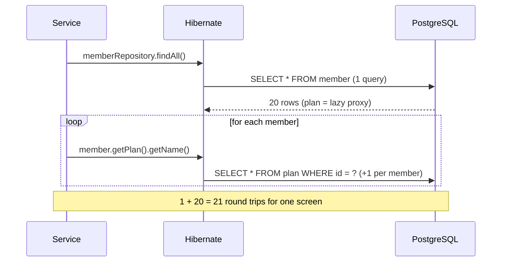
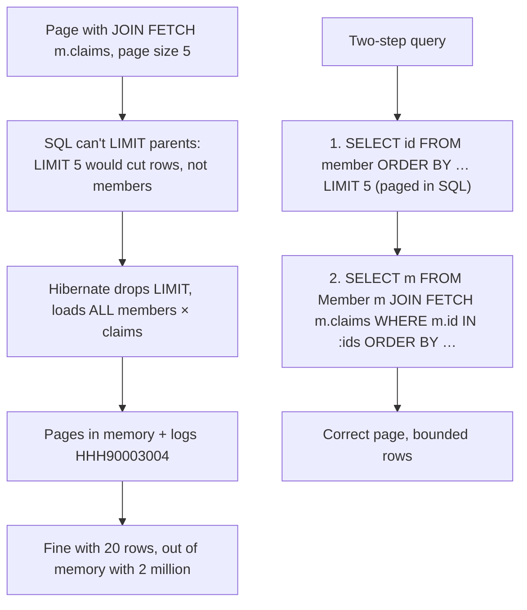
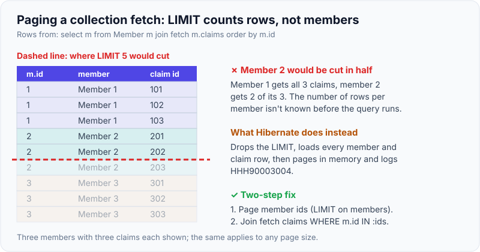

# N+1 Problem & Solutions (Fetch Joins, Entity Graphs, Batch Size)

!!! abstract "Key takeaways"
    - **N+1:** one query loads N parent rows, then accessing a lazy association on each parent fires **one more query per parent**. 20 members → 21 queries; 10,000 members → 10,001. It hides in loops, mappers, JSON serialisation and `toString()`.
    - **Detect it** before production: Hibernate statistics or a datasource proxy in tests with **query-count assertions**, SQL logging in development, APM traces in production.
    - **Fix it by fetching per use case:** `JOIN FETCH` in JPQL, `@EntityGraph` on repository methods, or a **DTO projection** (usually best for read endpoints). Measured on PostgreSQL 16: the N+1 loop ran **21** statements; join fetch, entity graph and DTO projection each ran **1**.
    - **Safety net:** `hibernate.default_batch_fetch_size` (or `@BatchSize`) turns N extra queries into `ceil(N / size)` `IN (...)` queries: **21 → 3** with size 10.
    - **Paging + collection fetch is a trap:** Hibernate can't apply `LIMIT` to joined collection rows, so it loads **everything** and pages in memory (warning `HHH90003004`). Fix with a **two-step query**: page the parent ids, then fetch those parents with their collections.

## Why it matters

N+1 is the most common ORM performance bug. It is invisible in development (10 rows, 11 fast queries), then a list endpoint in production issues thousands of queries per request, each adding a network round trip, and the database connection pool runs dry. Because the code looks innocent (`member.getPlan().getName()`), it slips through review.

Interviewers ask about N+1 because it tests whether you understand lazy loading, the persistence context and SQL at the same time, and whether you have the habit of measuring.

## Core concepts

### How N+1 happens


*Notice that each extra query is fast on its own. The cost is the number of round trips, which grows with the data, so the problem only appears at production scale.*

It happens with **any** association that is loaded separately per owner:

- Lazy `@ManyToOne` proxies touched in a loop (`member.getPlan()`).
- Lazy collections touched in a loop (`member.getClaims().size()`). Measured: **21** statements for 20 members.
- **EAGER** associations loaded by JPQL queries: Hibernate runs the main query, then secondary SELECTs for the eager associations. EAGER doesn't prevent N+1 for queries; it just makes it unavoidable.
- Serialisation, mappers (MapStruct touching every getter), `toString()`, `equals()`.

### Measured: the fixes side by side

Dataset: 20 members, each with a different plan and 3 claims. PostgreSQL 16, Hibernate 6.6.29, Spring Boot 3.5. Counts are JDBC statements per use case (Hibernate statistics).

| Approach | Use case | Statements |
|---|---|---|
| `findAll()` + `getPlan().getName()` in a loop | Members with plan name | **21** |
| `findAll()` + `getClaims().size()` in a loop | Members with claims | **21** |
| JPQL `select m from Member m join fetch m.plan` | Members with plan | **1** |
| `@EntityGraph(attributePaths = "plan")` | Members with plan | **1** |
| DTO projection `select new MemberRow(m.id, m.name, p.name) …` | Member rows for a list | **1** |
| `default_batch_fetch_size = 10`, plan loop | Members with plan | **3** (1 + 2 batches of 10) |
| `default_batch_fetch_size = 10`, claims loop | Members with claims | **3** |
| `Page` query with `join fetch m.claims` | First 5 members with claims | 2, but **all rows loaded and paged in memory** (`HHH90003004`) |
| Two-step: page ids, then fetch those members with claims | First 5 members with claims | **3** (ids page, count, fetch), correct paging in SQL |

{ loading=lazy }
*Watch the first lane keep going long after the other two have finished. Every bar is a round trip, so the gap grows with the number of members.*

### Fix 1: JOIN FETCH

```java
@Query("select m from Member m join fetch m.plan where m.status = :status")
List<Member> findActiveWithPlan(MemberStatus status);
```

- One SQL query with a join; associations are initialised on the returned entities.
- **Hibernate 6 de-duplicates parent entities automatically** when you join-fetch a collection, so `DISTINCT` is no longer needed to avoid duplicates in the result list (in Hibernate 5 it was).
- Join-fetching a collection multiplies rows (each member × each claim). Fetching **two collections** this way multiplies further (Cartesian product), and with `List` collections throws `MultipleBagFetchException`.

### Fix 2: @EntityGraph

```java
interface MemberRepository extends JpaRepository<Member, Long> {

    @EntityGraph(attributePaths = {"plan"})                // fetch plan for this method only
    List<Member> findByStatus(MemberStatus status);

    @EntityGraph(attributePaths = {"plan", "claims"})
    Optional<Member> findWithPlanAndClaimsById(Long id);
}
```

- Declarative fetch plans on derived queries and `@Query` methods, without writing JPQL joins.
- Spring Data uses it as a **fetch graph** by default: listed attributes are fetched eagerly, others follow their mapping. Named entity graphs (`@NamedEntityGraph`) allow reuse.
- Same Cartesian-product rules as join fetch when graphs include collections.

### Fix 3: DTO projections (best for reads)

```java
public record MemberRow(Long id, String name, String planName) {}

@Query("""
       select new com.examplehealth.members.MemberRow(m.id, m.name, p.name)
       from Member m join m.plan p
       where m.status = :status
       order by m.name
       """)
List<MemberRow> listRows(MemberStatus status);
```

- Selects **only the needed columns**, creates no managed entities (no dirty-checking snapshots, no lazy proxies, no `LazyInitializationException`).
- Spring Data also supports **interface projections** (`interface MemberSummary { String getName(); }`) and class/record projections on derived queries.
- For nested data (member with its last 3 claims), run two projection queries and assemble in Java, or use a JSON aggregation in native SQL.

### Fix 4: Batch fetching (the safety net)

```yaml
spring.jpa.properties.hibernate.default_batch_fetch_size: 50
```

- When a lazy association is initialised, Hibernate also initialises the same association for up to N other owners **already in the persistence context**, using `WHERE id IN (?, ?, …)`.
- Turns `1 + N` into `1 + ceil(N / batch size)`. Measured: 21 → 3 with size 10.
- Works for both `@ManyToOne` proxies and collections, needs no query changes, and is a good **global default** (values of 16–100 are common). It doesn't make a bad access pattern good, but it caps the damage.
- `@BatchSize(size = 50)` sets it per entity or collection.

### Fix 5: Subselect fetching

`@Fetch(FetchMode.SUBSELECT)` on a collection: when the collection of one owner is accessed, Hibernate loads the collections of **all owners from the original query** with one query using the original query as a subselect (`WHERE member_id IN (SELECT id FROM member WHERE …)`). Useful for one collection over a moderate result set; less predictable than batch fetching.

### The paging + collection fetch trap


*Notice the warning text in the logs: `HHH90003004: firstResult/maxResults specified with collection fetch; applying in memory` (Hibernate 5 logged it as `HHH000104`). Treat it as a bug, or make it fail fast with `hibernate.query.fail_on_pagination_over_collection_fetch=true`.*

{ loading=lazy }
*Notice why SQL paging can't work here: the limit lands in the middle of member 2's claims. Paging the ids first puts the limit on members instead of rows.*

```java
@Query("select m.id from Member m where m.status = :status order by m.id")
Page<Long> pageIds(MemberStatus status, Pageable pageable);          // paging + count in SQL

@Query("select m from Member m join fetch m.claims where m.id in :ids order by m.id")
List<Member> findWithClaims(List<Long> ids);                         // fetch exactly those parents

@Transactional(readOnly = true)
public Page<MemberWithClaims> page(MemberStatus status, Pageable pageable) {
    Page<Long> ids = repo.pageIds(status, pageable);
    Map<Long, Member> byId = repo.findWithClaims(ids.getContent()).stream()
            .collect(Collectors.toMap(Member::getId, m -> m));
    return ids.map(id -> MemberWithClaims.from(byId.get(id)));       // keep the page's order
}
```

Batch fetching is the other good option here: page the members normally (no collection fetch), and let `default_batch_fetch_size` load their claims in one or two `IN` queries.

### Detecting N+1

| Where | How |
|---|---|
| Tests | Assert query counts: Hibernate `Statistics.getPrepareStatementCount()`, or `datasource-proxy` / Hypersistence Utils `SQLStatementCountValidator` |
| Development | `spring.jpa.show-sql` or, better, `logging.level.org.hibernate.SQL=debug` with bind parameters; look for repeated identical statements |
| Static analysis | Hypersistence Optimizer flags EAGER associations, missing batch size, unidirectional one-to-many |
| Production | APM/OpenTelemetry traces showing many identical DB spans per request; `pg_stat_statements` showing huge call counts for `WHERE id = $1` queries |

## In practice: code & configuration

```yaml
spring:
  jpa:
    open-in-view: false                                        # no hidden lazy loading in controllers
    properties:
      hibernate:
        default_batch_fetch_size: 50                           # global safety net
        query.fail_on_pagination_over_collection_fetch: true   # turn HHH90003004 into an exception
```

=== "❌ Common mistake"
    ```java
    @Transactional(readOnly = true)
    public List<MemberDto> list() {
        return repo.findAll().stream()                         // 1 query
                .map(m -> new MemberDto(m.getId(), m.getName(),
                        m.getPlan().getName(),                 // +1 query per member (lazy proxy)
                        m.getClaims().size()))                 // +1 query per member (lazy collection)
                .toList();                                     // 20 members -> 41 queries
    }
    ```

=== "✅ Correct approach"
    ```java
    public record MemberListRow(Long id, String name, String planName, long claimCount) {}

    @Query("""
           select new com.examplehealth.members.MemberListRow(
                    m.id, m.name, p.name, count(c.id))
           from Member m
           join m.plan p
           left join m.claims c
           group by m.id, m.name, p.name
           order by m.name
           """)
    List<MemberListRow> listRows();                             // 1 query, only needed columns

    // Test that guards the endpoint against regressions
    @Test
    void listIsOneQuery() {
        Statistics stats = emf.unwrap(SessionFactory.class).getStatistics();
        stats.clear();
        service.list();
        assertThat(stats.getPrepareStatementCount()).isEqualTo(1);
    }
    ```

## Real-world usage

- **Shopify, GitHub and Basecamp** (Rails) popularised tools like Bullet that detect N+1 in development; the same discipline applies to Hibernate with statistics-based tests.
- **GraphQL servers** face the same problem at the resolver level, solved with DataLoader batching, the analogue of Hibernate batch fetching. See [GraphQL N+1 and DataLoader](../graphql/04-n-plus-1-problem-and-dataloader-batching.md).
- **Typical incident:** a member dashboard went from 200 ms to 8 s after a data migration doubled claims per member; traces showed 1,200 identical `SELECT … FROM claim WHERE member_id = ?` spans per request. A DTO projection plus batch size fixed it.
- **Vlad Mihalcea** recommends `default_batch_fetch_size` as a default and has documented `HHH000104`/`HHH90003004` as one of the most frequent hidden performance issues.

## Trade-offs & production gotchas

| Fix | Pros | Cons | Use when |
|---|---|---|---|
| `JOIN FETCH` | One query, explicit | Row multiplication with collections; no SQL paging with collections | Entities needed with a `@ManyToOne` or one collection |
| `@EntityGraph` | Declarative, works on derived queries | Same Cartesian caveats | Spring Data repositories |
| DTO projection | Fewest columns, no entity overhead | Read-only; nested data needs assembly | List screens, APIs, reports |
| Batch fetching | No code changes, caps N+1 | Still several queries | Global default safety net |
| Subselect fetching | One extra query for all owners | Re-runs the original query as subselect | One collection over a moderate set |
| Two-step paging | Correct SQL paging with collections | Two queries, order must be restored | Paged lists that need collections |

!!! warning "Gotcha: fixing N+1 with EAGER"
    Switching to EAGER makes the association load in **every** query (and still with secondary SELECTs for JPQL queries). It moves the N+1 from one endpoint to all of them.

!!! warning "Gotcha: join-fetching two collections"
    `join fetch m.claims join fetch m.prescriptions` returns members × claims × prescriptions rows. With `List`s it throws `MultipleBagFetchException`; with `Set`s it works but can return millions of rows. Fetch one collection per query, or use batch fetching for the second.

!!! tip "Read the SQL, count the round trips"
    Before and after any fix, count statements per request. "One query per screen" is a good default target for list endpoints; anything that grows with the number of rows is a bug.

## How this connects to my experience

- **Where I used it:** not ★, but the same problem shows up in two places on the resume: Hibernate/JPA services, and the **GraphQL Consumer Service** at OptumRx, where nested fields resolved per parent cause N+1 calls to upstream systems unless batched (DataLoader). *[confirm which JPA services]*
- **Talking points:**
    - "N+1 is the same problem in GraphQL and Hibernate: per-item loading in a loop. The fixes are the same idea: batch (DataLoader, `default_batch_fetch_size`) or fetch up front (join fetch, projection)."
    - "I add query-count assertions to integration tests for list endpoints, so N+1 regressions fail the build."
    - "When paging with collections, I use the two-step query and enable `fail_on_pagination_over_collection_fetch` so the in-memory paging warning can't slip into production."
- **Likely follow-up chain:** "What is N+1?" → example → "How do you detect it?" (statistics, tests, traces) → "How do you fix it?" (join fetch, entity graph, DTO, batch size) → "What about paging?" (HHH90003004, two-step) → "Same problem in GraphQL?" (DataLoader).

## Interview questions

### Fundamentals

??? question "Q1. What is the N+1 select problem?"
    **Answer:** Loading N parent entities with one query, then triggering one additional query per parent when a lazy association (or an EAGER one in a JPQL query) is accessed, for N+1 queries in total. The cost is the number of database round trips, which grows with the data.

    **Interviewer listens for:** one query per parent, lazy access in loops, grows with data.

    **Common wrong answer:** "It's when a query returns N+1 rows."

??? question "Q2. Does setting associations to EAGER fix N+1?"
    **Answer:** No. EAGER makes the association load whenever the owner loads, in every query. For JPQL/Criteria queries Hibernate still loads eager associations with secondary SELECTs, so N+1 remains and now affects every use case. Keep associations LAZY and fetch per use case.

    **Interviewer listens for:** secondary selects, affects every query, LAZY + explicit fetching.

    **Common wrong answer:** "Yes, EAGER loads everything in one join."

??? question "Q3. How do you detect N+1 queries?"
    **Answer:** In tests, assert the number of statements with Hibernate statistics or a datasource proxy. In development, log SQL and look for repeated identical statements. In production, look at traces with many identical DB spans per request or `pg_stat_statements` call counts.

    **Interviewer listens for:** automated query-count tests, SQL logs, tracing.

    **Common wrong answer:** "When the page feels slow."

??? question "Q4. Name four ways to fix N+1 in Hibernate."
    **Answer:** `JOIN FETCH` in JPQL, `@EntityGraph` on repository methods, DTO projections that select exactly the needed columns, and batch fetching (`default_batch_fetch_size` / `@BatchSize`); also subselect fetching for collections.

    **Interviewer listens for:** at least four with when to use each.

    **Common wrong answer:** "Add a cache."

### Intermediate

??? question "Q5. JOIN FETCH vs @EntityGraph?"
    **Answer:** Both fetch associations in the same query. `JOIN FETCH` is written in JPQL and is explicit per query; `@EntityGraph` declares the attributes to fetch on a repository method and works with derived queries without writing JPQL. Both multiply rows when collections are fetched and share the paging caveat.

    **Interviewer listens for:** same effect, declarative vs JPQL, collection caveats.

    **Common wrong answer:** "Entity graphs use a separate query per attribute."

??? question "Q6. How does batch fetching work?"
    **Answer:** When Hibernate initialises a lazy association for one owner, it also initialises the same association for other owners already in the persistence context, using one `IN (…)` query per batch. With 20 members and batch size 10, 20 extra queries become 2. It needs no query changes, which makes it a good global safety net.

    **Interviewer listens for:** IN-list batches, ceil(N/size), owners in the persistence context, global default.

    **Common wrong answer:** "It batches INSERT statements." That's `jdbc.batch_size`.

??? question "Q7. Why are DTO projections often the best fix for read endpoints?"
    **Answer:** They select only the columns needed in a single query, create no managed entities (no dirty-checking snapshots, no proxies, no lazy loading), and can't trigger `LazyInitializationException`. They also decouple the API from the entity model.

    **Interviewer listens for:** fewer columns, no entity overhead, no lazy loading, decoupling.

    **Common wrong answer:** "Projections are just for performance tuning experts."

??? question "Q8. What does the warning HHH90003004 mean?"
    **Answer:** "firstResult/maxResults specified with collection fetch; applying in memory": the query join-fetches a collection and is paged, and since a SQL `LIMIT` would cut collection rows rather than parents, Hibernate loads all results and pages in memory. It works on small data and runs out of memory on large data. Hibernate 5 logged it as `HHH000104`.

    **Interviewer listens for:** collection fetch + paging, in-memory paging, risk at scale.

    **Common wrong answer:** "It's a harmless info message."

### Senior

??? question "Q9. How do you page a list of members together with their claims correctly?"
    **Answer:** Two steps: page the member ids in SQL (with the count query if needed), then fetch those members with their claims using `join fetch … where m.id in :ids`, and restore the page order in Java. Alternatively page members without fetching claims and let batch fetching load the claims in one or two `IN` queries. Enable `fail_on_pagination_over_collection_fetch` to prevent the in-memory version.

    **Interviewer listens for:** two-step query, order preservation, batch fetching alternative, fail-fast setting.

    **Common wrong answer:** "Join fetch the claims in the Page query."

??? question "Q10. How do you prevent N+1 regressions across a team?"
    **Answer:** LAZY everywhere and `open-in-view: false`, so lazy access outside services fails visibly; a global batch fetch size; query-count assertions in integration tests for critical endpoints; code review checklist items (loops over entities touching associations, mappers on entities); static analysis (Hypersistence Optimizer); and production tracing alerts on spans per request.

    **Interviewer listens for:** defaults, tests, review, tooling, production monitoring.

    **Common wrong answer:** "Tell developers to be careful."

??? question "Q11. What's the risk of join-fetching multiple collections, and what do you do instead?"
    **Answer:** The SQL result is a Cartesian product (members × claims × prescriptions), which can explode row counts; with `List` (bag) collections Hibernate throws `MultipleBagFetchException`. Fetch one collection per query (the persistence context merges results), use batch fetching for the others, or use DTO queries per collection.

    **Interviewer listens for:** Cartesian product, MultipleBagFetchException, split queries or batch fetching.

    **Common wrong answer:** "Change the Lists to Sets and it's solved." It removes the exception, not the row explosion.

### Scenario-based

??? question "Q12. An endpoint that lists 50 orders makes 151 queries. Walk through the fix."
    **Answer:** 1 + 50 + 50 suggests two lazy associations per order (for example customer and lines) touched during mapping. Confirm with SQL logs. For the list view, replace entity loading with a DTO projection that joins the customer and aggregates line counts or totals in one query. If entities are needed, use an entity graph for the `@ManyToOne` and batch fetching for the collection. Add a query-count test asserting ≤ 2 statements.

    **Interviewer listens for:** reading the count, projection, entity graph + batch, regression test.

    **Common wrong answer:** "Increase the connection pool."

??? question "Q13. After a release, a service runs out of memory on a paged search endpoint that worked in staging. Logs show HHH90003004. What happened?"
    **Answer:** A change added a collection join fetch to a paged query, so Hibernate stopped applying `LIMIT` and loaded the entire result set (all matching parents with all children) into memory, which was small in staging and huge in production. Fix with the two-step query or batch fetching, enable `fail_on_pagination_over_collection_fetch=true`, and add a test with enough data to catch it.

    **Interviewer listens for:** link between the warning and OOM, staging vs production data volume, fix + guardrail.

    **Common wrong answer:** "Increase the heap size."

??? question "Q14. Your GraphQL API resolves `members { plan { name } claims { amount } }` and the database shows thousands of queries per request. How do you fix it at both layers?"
    **Answer:** In GraphQL, batch per field with DataLoader (`@BatchMapping`) so plans and claims for all members in the request load in one call each. In the repository layer, implement those batch loaders with `findAllById`-style `IN` queries or projections, and set a Hibernate batch fetch size as a safety net. Measure queries per request before and after.

    **Interviewer listens for:** DataLoader + IN queries, both layers, measurement.

    **Common wrong answer:** "Make the associations EAGER."

## Cheat sheet

| Concept | Remember |
|---|---|
| N+1 | 1 query for parents + 1 per parent for an association |
| Hides in | Loops, mappers, JSON serialisation, `toString`, EAGER + JPQL |
| Detect | Statistics/datasource-proxy query-count tests, SQL logs, traces, `pg_stat_statements` |
| Fixes | `JOIN FETCH`, `@EntityGraph`, DTO projection, `default_batch_fetch_size`, `SUBSELECT` |
| Measured (20 members) | Loop 21 → join fetch/graph/DTO 1 → batch size 10: 3 |
| Hibernate 6 | De-duplicates join-fetched parents; no `DISTINCT` needed |
| Paging + collection | `HHH90003004` in-memory paging → two-step ids query or batch fetching |
| Fail fast | `hibernate.query.fail_on_pagination_over_collection_fetch=true` |
| Two collections | Cartesian product / `MultipleBagFetchException` → split queries |
| Don't | EAGER, OSIV, caching as the "fix" |

## Sources
1. [Hibernate ORM 6.6 User Guide: fetching strategies, batch fetching, entity graphs](https://docs.jboss.org/hibernate/orm/6.6/userguide/html_single/Hibernate_User_Guide.html#fetching).
2. [Hibernate 6.0 migration guide: result de-duplication for fetch joins](https://docs.jboss.org/hibernate/orm/6.0/migration-guide/migration-guide.html).
3. [Spring Data JPA: Entity graphs and projections](https://docs.spring.io/spring-data/jpa/reference/repositories/projections.html).
4. [Vlad Mihalcea: N+1 query problem with JPA and Hibernate](https://vladmihalcea.com/n-plus-1-query-problem/).
5. [Vlad Mihalcea: How to fix the Hibernate HHH000104 / HHH90003004 warning](https://vladmihalcea.com/fix-hibernate-hhh000104-entity-fetch-pagination-warning-message/).
6. [Hypersistence Utils: SQL statement count validator](https://github.com/vladmihalcea/hypersistence-utils).
7. Measurements on this page: PostgreSQL 16, Hibernate ORM 6.6.29, Spring Boot 3.5.6, Hibernate statistics, run while writing this page.
