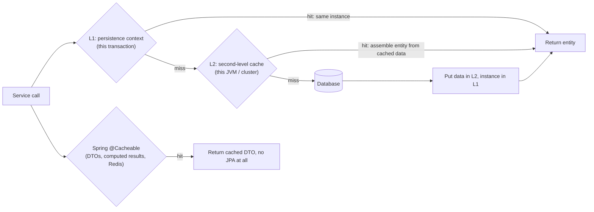

# First- and Second-Level Cache

!!! abstract "Key takeaways"
    - **First-level cache (L1)** = the persistence context. Always on, **per transaction/EntityManager**: the same id returns the same instance with one SQL load. It is about **identity and consistency**, not cross-request performance, and it dies with the transaction.
    - **Second-level cache (L2)** = optional, **per `EntityManagerFactory` (per JVM)**, shared across sessions. Stores entity **data** (not instances) by id. Enable per entity with `@Cacheable` + `@Cache(usage = …)` and a provider (Ehcache 3/JCache, Infinispan, Caffeine via JCache, Redis via Redisson). Measured: second transaction's `findById` → **0 SQL statements**, 1 cache hit.
    - **Concurrency strategies:** `READ_ONLY` (immutable reference data, fastest), `NONSTRICT_READ_WRITE` (rare updates, short staleness OK), `READ_WRITE` (soft locks, consistent within one JVM), `TRANSACTIONAL` (JTA/XA providers).
    - **Query cache** stores query results as **lists of ids**, invalidated whenever *any* table in the query changes. Only useful for queries over rarely changing tables.
    - **Staleness is the big risk:** updates by native SQL, other services, other JVMs (with a local cache) or DBAs bypass Hibernate. Cache **reference data that changes rarely**; for anything else prefer `@Cacheable` service-level caching in Redis with explicit TTLs and eviction, or no cache.

## Why it matters

Caching questions test two things: whether you know what Hibernate's caches actually do, and whether you know **when caching causes more problems than it solves**. Many teams enable the second-level cache "for performance", then find members seeing stale plan data because a batch job updated the table with SQL, or every pod holding a different version of the same row.

For a lead, the important skill is choosing the right layer: database tuning first, then the L2 cache for read-mostly reference entities, then an application cache (Redis) for computed or aggregated data.

## Core concepts

### The caching layers around JPA


*Notice that L1 holds entity instances for one transaction, L2 holds dehydrated entity state for the whole application, and Spring's cache abstraction sits above JPA entirely and usually caches DTOs.*

### First-level cache (persistence context)

- **Scope:** one `EntityManager`, which in Spring means one transaction (or one repository call when there's no transaction).
- **Behaviour:** `find(Drug.class, id)` twice returns the **same instance**, with one SQL statement (verified). Query results are also reconciled with instances already in the context.
- **What it doesn't do:** it doesn't share data across requests, and it doesn't stop a JPQL query from hitting the database (queries always go to the DB; only the resulting entities are matched against the context).
- **Costs:** every managed entity is held plus a snapshot for dirty checking, so large transactions use a lot of memory. `clear()` or `detach()` to release, `readOnly` transactions to skip snapshots.

### Second-level cache

- **Scope:** shared by all sessions of one `EntityManagerFactory`. With a **local** provider (Ehcache heap, Caffeine) that means **per JVM**: three pods have three independent caches. With a **distributed** provider (Infinispan cluster, Hazelcast, Redis via Redisson) it's shared.
- **What is stored:** entity state in a disassembled (dehydrated) form keyed by entity id, plus optionally collection id lists and natural-id mappings. Not Java instances.
- **What uses it:** `find()`/`findById()`, lazy loading of `@ManyToOne` proxies, collection loading (if the collection is cached), and natural-id lookups. **JPQL queries do not read entities from L2 by themselves** unless the query cache is on.
- **Enabling it:**

```properties
spring.jpa.properties.hibernate.cache.use_second_level_cache=true
spring.jpa.properties.hibernate.cache.region.factory_class=jcache
spring.jpa.properties.hibernate.javax.cache.provider=org.ehcache.jsr107.EhcacheCachingProvider
spring.jpa.properties.hibernate.javax.cache.missing_cache_strategy=create   # or configure regions explicitly
# JPA-level switch: ENABLE_SELECTIVE (default) = only @Cacheable entities
spring.jpa.properties.jakarta.persistence.sharedCache.mode=ENABLE_SELECTIVE
```

### Concurrency strategies

| Strategy | Updates allowed? | Consistency | Use for |
|---|---|---|---|
| `READ_ONLY` | No (update throws) | Perfect (data never changes) | Immutable reference data: drug catalogue versions, country codes |
| `NONSTRICT_READ_WRITE` | Yes | Cache invalidated after commit; short window of stale reads | Rarely updated data where brief staleness is fine |
| `READ_WRITE` | Yes | Soft locks during updates; consistent for writes through Hibernate in this cache | Read-mostly entities updated occasionally |
| `TRANSACTIONAL` | Yes | Cache participates in JTA transactions | Transactional providers (Infinispan) with JTA |

### Measured behaviour (Hibernate 6.6.29, Ehcache 3 via JCache, `READ_WRITE` on a `Drug` entity)

| Action | SQL statements | Cache statistics |
|---|---|---|
| Tx 1: `findById(ndc)` | 1 | 1 L2 put |
| Tx 2: `findById(ndc)` | **0** | 1 L2 hit |
| Query with `org.hibernate.cacheable=true`, run twice | 1 | 1 query-cache miss, 1 hit |
| Update entity through Hibernate, then `findById` | 1 (the UPDATE) | Hits; new value served from cache |
| Bulk JPQL `update Drug d set …`, then `findById` | 2 (UPDATE + SELECT) | 1 miss: Hibernate **evicted the Drug region** after the bulk update; fresh value read |
| Same `find` twice in one `EntityManager` | 1 | L1: same instance |

The bulk-update row matters: Hibernate knows which entity table a JPQL bulk statement touches and evicts that whole region. A **native SQL** update, a stored procedure, another service writing the same table or a DBA script gives Hibernate no such signal, so the cache keeps serving the old value until it expires.

### Query cache

```java
@QueryHints(@QueryHint(name = "org.hibernate.cacheable", value = "true"))
@Query("select d from Drug d where d.name like :prefix")
List<Drug> search(String prefix);
```

- Stores **parameters → list of entity ids**; the entities themselves come from L2 (so the entity must also be cached, or each hit triggers N loads: a new N+1).
- Every insert, update or delete on any table the query reads **invalidates all cached results** for queries over that table (via timestamps). On frequently written tables the hit rate is close to zero and the bookkeeping is pure overhead.
- Use it for queries over **static or rarely changing** tables only.

### Hibernate L2 vs Spring @Cacheable vs Redis

| | Hibernate L2 cache | Spring `@Cacheable` (Redis, Caffeine) |
|---|---|---|
| What's cached | Entity state by id, collections, query id-lists | Any method result: DTOs, aggregates, upstream API responses |
| Invalidation | Automatic for writes through Hibernate; region eviction on bulk JPQL | Explicit: `@CacheEvict`, `@CachePut`, TTL |
| Granularity | Per entity row | Per method + key |
| Cross-instance | Only with a distributed provider | Yes with Redis |
| Visibility to code | Transparent (good and bad) | Explicit in the service layer |
| Best for | Read-mostly reference entities loaded by id | Expensive computed views, aggregated DTOs, external API results |

For most microservices, **explicit service-level caching in Redis with TTLs** is easier to reason about than a transparent L2 cache, especially when several instances or services touch the same data. See [Redis caching patterns](../redis-caching/02-caching-patterns-cache-aside-read-write-through-write-behind.md).

## In practice: code & configuration

=== "❌ Common mistake"
    ```java
    @Entity
    @Cacheable
    @Cache(usage = CacheConcurrencyStrategy.READ_WRITE)
    class Claim { ... }          // high-write table cached in each pod's local heap

    @QueryHints(@QueryHint(name = "org.hibernate.cacheable", value = "true"))
    @Query("select c from Claim c where c.memberId = :m and c.status = 'PENDING'")
    List<Claim> pending(Long m); // invalidated on every claim insert: overhead, no hits

    // Nightly job updates plans with native SQL -> every pod keeps serving stale plans
    jdbc.update("UPDATE plan SET copay = copay + 5 WHERE year = 2027");
    ```

=== "✅ Correct approach"
    ```java
    // Immutable reference data: perfect L2 candidate
    @Entity
    @Immutable                                                     // Hibernate never updates it
    @Cacheable
    @Cache(usage = CacheConcurrencyStrategy.READ_ONLY, region = "drug-catalogue")
    class DrugCatalogueEntry {
        @Id private String ndc;
        private String name;
        private String strength;
    }

    // Read-mostly entity updated through Hibernate only, in a single service
    @Entity
    @Cacheable
    @Cache(usage = CacheConcurrencyStrategy.READ_WRITE, region = "plan")
    class Plan {
        @Id private String code;
        private BigDecimal copay;
        @Version private long version;
    }

    // Expensive aggregated view: explicit application cache with a TTL, evicted on change
    @Service
    class FormularyService {

        @Cacheable(cacheNames = "formulary", key = "#planCode")    // Redis, TTL 1h in config
        public FormularyView formularyFor(String planCode) { return buildFromDatabase(planCode); }

        @CacheEvict(cacheNames = "formulary", key = "#planCode")
        public void onFormularyChanged(String planCode) { }        // called by the change event
    }

    // Writes outside Hibernate must evict explicitly
    @Transactional
    public void annualCopayUplift() {
        jdbc.update("UPDATE plan SET copay = copay + 5 WHERE year = 2027");
        entityManagerFactory.getCache().evict(Plan.class);        // JPA Cache API
    }
    ```

```yaml
# Ehcache 3 region sizing and TTL (ehcache.xml referenced via hibernate.javax.cache.uri)
# <cache alias="drug-catalogue"><expiry><ttl unit="hours">24</ttl></expiry><heap unit="entries">50000</heap></cache>
# <cache alias="plan"><expiry><ttl unit="minutes">10</ttl></expiry><heap unit="entries">5000</heap></cache>
```

Always give regions a **size limit and a TTL**, even for read-only data: unbounded regions are memory leaks, and a TTL bounds the damage of any write that bypasses Hibernate.

## Real-world usage

- **Reference data** is the classic L2 win: drug catalogues (NDC codes), ICD-10 diagnosis codes, plan definitions, country and currency tables. They are read on almost every request and change on a schedule.
- **Infinispan** (Red Hat) and **Hazelcast** provide clustered L2 caches for Hibernate in larger enterprise deployments; **Redisson** offers a Redis-backed Hibernate region factory for teams already running Redis.
- **Typical incident:** a pricing table was cached with `READ_WRITE` in each pod's local Ehcache; an admin tool in another service updated prices; customers saw different prices depending on which pod served them until a restart. Moving to an explicit Redis cache with event-driven eviction fixed it.
- **Healthcare:** caching PHI (member records, claims) in a JVM or shared cache widens where sensitive data lives and complicates access audits and right-to-delete; most teams cache only non-PHI reference data at this layer.

## Trade-offs & production gotchas

| Option | Pros | Cons | Use when |
|---|---|---|---|
| No L2, tuned queries | Simple, always fresh | Every read hits the DB | Default; most transactional data |
| L2 `READ_ONLY` | Fast, no consistency risk | Data must be immutable | Reference catalogues |
| L2 `READ_WRITE` local | Transparent, consistent for one JVM's writes | Stale across pods and external writers | Single-instance or Hibernate-only writers |
| L2 distributed | Shared, consistent across pods | Network hop, operational cost | Large clustered deployments |
| Query cache | Skips repeated queries | Invalidation storms, N+1 if entities not cached | Static tables only |
| `@Cacheable` + Redis | Explicit, TTL, cross-service | Manual eviction logic | Aggregates, DTOs, upstream calls |

!!! warning "Gotcha: L2 cache is not a fix for N+1 or slow queries"
    It can hide N+1 behind cache hits until the cache is cold (after a deploy) or evicted, and then the database gets the full load at once. Fix the access pattern first.

!!! warning "Gotcha: other writers"
    Native SQL, stored procedures, other microservices, ETL jobs and manual fixes all bypass Hibernate's invalidation. If anything else writes the table, either evict explicitly, use short TTLs, or don't cache it.

!!! warning "Gotcha: query cache without entity cache"
    The query cache stores ids only. If the entity type isn't in L2, each cached query hit loads every entity by id individually.

## How this connects to my experience

- **Where I used it:** not ★ for Hibernate's cache, but closely related: ★ "Implemented Redis-based caching for frequently accessed queries and UI reference data" at OptumRx. That is the service-level caching option, which is what I'd recommend over a transparent L2 cache for multi-instance microservices.
- **Talking points:**
    - "Reference data the UI needed on every screen was cached in Redis with TTLs and evicted on change, so all pods saw the same values and the upstream systems weren't hit on every request." *[confirm TTLs and eviction mechanism]*
    - "I'd only enable Hibernate's L2 cache for immutable or rarely changing reference entities, with region size limits and TTLs, and never for PHI or high-write tables."
    - "Any write path outside Hibernate must evict, or the cache will serve stale data."
- **Likely follow-up chain:** "Explain L1 vs L2" → scope and contents → "Concurrency strategies?" → "Why might cached data be stale?" (other writers, per-JVM caches) → "What did you cache in Redis and how did you invalidate it?" (resume link).

## Interview questions

### Fundamentals

??? question "Q1. What is Hibernate's first-level cache?"
    **Answer:** The persistence context of one `EntityManager`/`Session`. It's always enabled and scoped to a transaction in Spring. Loading the same id twice returns the same instance with one SQL load. It provides identity and consistency within a unit of work, not caching across requests.

    **Interviewer listens for:** per EntityManager/transaction, always on, identity guarantee.

    **Common wrong answer:** "It's a cache shared by the whole application."

??? question "Q2. What is the second-level cache and how is it different?"
    **Answer:** An optional cache at the `EntityManagerFactory` level, shared across sessions (per JVM for local providers, cluster-wide for distributed ones). It stores dehydrated entity state by id (plus collections and natural ids). It must be enabled with a provider and per entity with `@Cacheable`/`@Cache`.

    **Interviewer listens for:** scope, opt-in per entity, provider, stores state not instances.

    **Common wrong answer:** "It's enabled by default."

??? question "Q3. What does the query cache store?"
    **Answer:** For a cacheable query, the parameters mapped to the list of resulting entity ids (or scalar values). Entities are then loaded from the second-level cache. Any change to a table used by the query invalidates the cached results.

    **Interviewer listens for:** ids not entities, dependency on L2, table-level invalidation.

    **Common wrong answer:** "It stores the full entities returned by the query."

??? question "Q4. Name the second-level cache concurrency strategies."
    **Answer:** `READ_ONLY` for immutable data; `NONSTRICT_READ_WRITE` for rarely updated data where brief staleness is acceptable; `READ_WRITE` using soft locks for consistent updates through Hibernate; `TRANSACTIONAL` for providers that join JTA transactions.

    **Interviewer listens for:** four strategies and a use case each.

    **Common wrong answer:** Listing only "read-only and read-write".

### Intermediate

??? question "Q5. Do JPQL queries use the second-level cache?"
    **Answer:** Not by default. A JPQL query always runs against the database; the second-level cache is used for `find()`, lazy loading of associations and cached collections. Enabling the query cache (with the `org.hibernate.cacheable` hint) lets repeated identical queries return cached ids, whose entities come from L2.

    **Interviewer listens for:** queries hit the DB, find/lazy loading use L2, query cache as an opt-in.

    **Common wrong answer:** "All queries are served from L2 once the cache is enabled."

??? question "Q6. What happens to the L2 cache after a bulk JPQL update?"
    **Answer:** Hibernate evicts the entire region for the affected entity type, because it can't know which rows changed. The next reads go to the database. Verified: after `update Drug d set …`, the next `findById` was a cache miss and returned the new value. Native SQL updates don't trigger this eviction.

    **Interviewer listens for:** region eviction, native SQL difference.

    **Common wrong answer:** "Hibernate updates each cached entity."

??? question "Q7. Why can the second-level cache serve stale data?"
    **Answer:** It only sees writes made through Hibernate in the same cache. Native SQL, stored procedures, other services, ETL jobs and other JVMs with their own local caches change the database without the cache knowing. Mitigate with explicit eviction, TTLs, distributed providers, or by not caching such data.

    **Interviewer listens for:** external writers, per-JVM caches, mitigations.

    **Common wrong answer:** "It can't be stale because Hibernate manages it."

??? question "Q8. Hibernate L2 cache or Spring @Cacheable with Redis?"
    **Answer:** L2 for read-mostly entities loaded by id, written only through Hibernate, with a provider that fits the deployment. `@Cacheable` with Redis for computed DTOs, aggregates and external API responses, shared across instances, with explicit TTLs and eviction. In multi-instance microservices the explicit Redis cache is usually easier to reason about.

    **Interviewer listens for:** what's cached, invalidation model, cross-instance behaviour.

    **Common wrong answer:** "Always use both for maximum performance."

### Senior

??? question "Q9. Which entities would you cache in L2 in a pharmacy benefits system?"
    **Answer:** Immutable or rarely changing reference data: drug catalogue entries (`READ_ONLY`, `@Immutable`), plan definitions and formulary tiers (`READ_WRITE` or `NONSTRICT_READ_WRITE` with TTL, if only this service writes them), pharmacy directory data. Not members, claims or prescriptions: high write rates, PHI, and correctness requirements outweigh the gain.

    **Interviewer listens for:** reference vs transactional data, strategy choice, PHI consideration.

    **Common wrong answer:** "Cache everything to reduce database load."

??? question "Q10. How does the query cache interact with write-heavy tables?"
    **Answer:** Every insert, update or delete on a table updates its timestamp and invalidates all cached query results that read that table. On write-heavy tables the hit rate approaches zero while Hibernate still pays the bookkeeping cost, and caches fill with useless entries. Use the query cache only for queries over static or rarely written tables.

    **Interviewer listens for:** timestamp invalidation, low hit rate, overhead.

    **Common wrong answer:** "The query cache only invalidates the changed rows."

??? question "Q11. How would you run an L2 cache safely in a Kubernetes deployment with 6 pods?"
    **Answer:** With a local provider, each pod has its own cache, so writes on one pod leave others stale until TTL. Options: cache only immutable data (`READ_ONLY`) locally; use a distributed or invalidation-capable provider (Infinispan, Hazelcast, Redisson); keep TTLs short for mutable regions; or move to explicit Redis caching with event-driven eviction. Size limits on all regions to protect memory.

    **Interviewer listens for:** per-pod staleness, provider choice, TTLs, sizing.

    **Common wrong answer:** "Hibernate keeps the pods' caches in sync automatically."

### Scenario-based

??? question "Q12. Users see different plan copays depending on the request. What's going on?"
    **Answer:** Likely per-pod L2 caches (or local application caches) holding different versions after an update made on one pod or by another writer. Confirm by checking cache configuration and which pod served each request. Fix by evicting on change (events to all pods), switching to a shared cache (Redis) or a distributed L2 provider, or removing the cache for that entity, and set TTLs.

    **Interviewer listens for:** per-instance cache diagnosis, eviction strategy, shared cache.

    **Common wrong answer:** "Restart all pods after each change."

??? question "Q13. After a deploy, the database CPU spikes for 10 minutes and then settles. The service uses a large L2 cache. Explain and mitigate."
    **Answer:** Cold caches: new pods start empty, so every read misses and hits the database until the cache warms up, a thundering herd on deploy. Mitigate with rolling deploys (a few pods at a time), cache warming on startup for hot reference data, a shared external cache that survives deploys, and making sure the database can handle cache-miss load (the cache shouldn't be hiding N+1 or missing indexes).

    **Interviewer listens for:** cold cache, rolling deploys, warming, shared cache, underlying query health.

    **Common wrong answer:** "Increase database size."

??? question "Q14. A colleague wants to enable the query cache on the claims search endpoint to improve latency. What do you say?"
    **Answer:** Claims are written constantly, so every insert invalidates the cached searches; the hit rate will be near zero while adding overhead and memory use. Also, without claims in L2, a cached hit would load each claim individually. Better: measure the query, add the right index, use a DTO projection, or cache an aggregated view per member in Redis with a short TTL if the same member repeats searches.

    **Interviewer listens for:** invalidation on writes, N+1 risk, real fixes.

    **Common wrong answer:** "Yes, caching always helps."

## Cheat sheet

| Concept | Remember |
|---|---|
| L1 | Persistence context; per transaction; same instance per id; always on |
| L2 | Per `EntityManagerFactory`; opt-in per entity; stores state; local = per JVM |
| Uses L2 | `find`, lazy `@ManyToOne`, cached collections, natural ids (not plain JPQL) |
| Strategies | READ_ONLY, NONSTRICT_READ_WRITE, READ_WRITE (soft locks), TRANSACTIONAL |
| Query cache | Params → ids; invalidated on any write to involved tables; needs entity L2 |
| Bulk JPQL | Evicts the whole entity region |
| Native SQL / other writers | No eviction → stale; evict explicitly or TTL |
| Providers | Ehcache 3/JCache, Caffeine, Infinispan, Hazelcast, Redisson (Redis) |
| Good candidates | Immutable/rarely changing reference data |
| Bad candidates | High-write tables, PHI, data written by others |
| Alternative | `@Cacheable` + Redis with TTL and explicit eviction |
| Measured | Tx 2 `findById` = 0 SQL; query cache second run = hit; bulk update → miss + fresh read |

## Sources
1. [Hibernate ORM 6.6 User Guide: Caching](https://docs.jboss.org/hibernate/orm/6.6/userguide/html_single/Hibernate_User_Guide.html#caching).
2. [Jakarta Persistence 3.2: shared cache mode and the Cache interface](https://jakarta.ee/specifications/persistence/3.2/).
3. [Ehcache 3: Hibernate integration via JCache](https://www.ehcache.org/documentation/3.10/hibernate.html).
4. [Spring Framework: Cache abstraction (@Cacheable, @CacheEvict)](https://docs.spring.io/spring-framework/reference/integration/cache.html).
5. [Redisson: Hibernate second-level cache](https://redisson.org/docs/cache/hibernate/).
6. [Vlad Mihalcea: How does Hibernate's READ_WRITE CacheConcurrencyStrategy work](https://vladmihalcea.com/how-does-hibernate-read_write-cacheconcurrencystrategy-work/) and [query cache pitfalls](https://vladmihalcea.com/hibernate-query-cache-n-plus-1-issue/).
7. Measurements on this page: Spring Boot 3.5.6, Hibernate ORM 6.6.29 with hibernate-jcache and Ehcache 3, H2, Hibernate statistics, run while writing this page.
