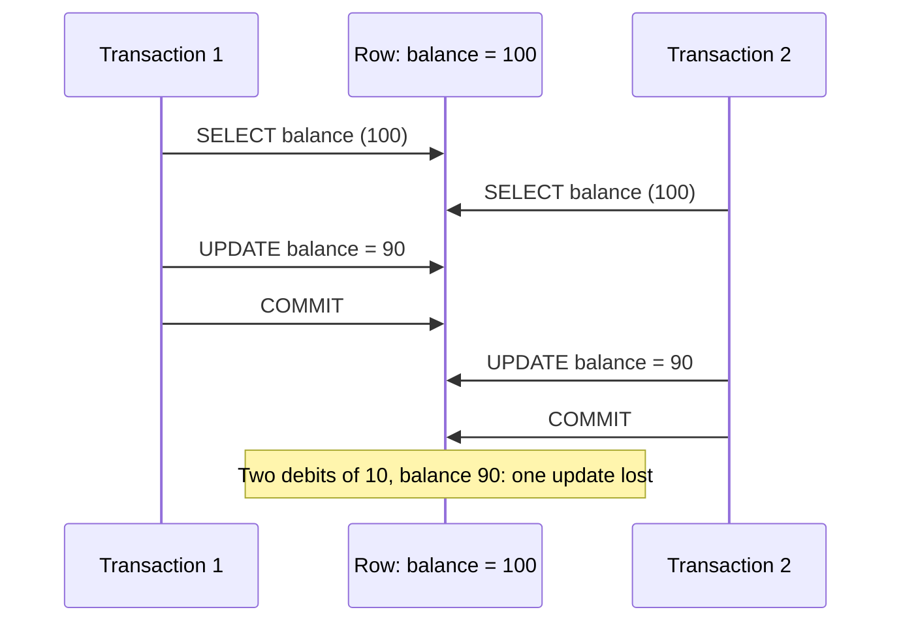
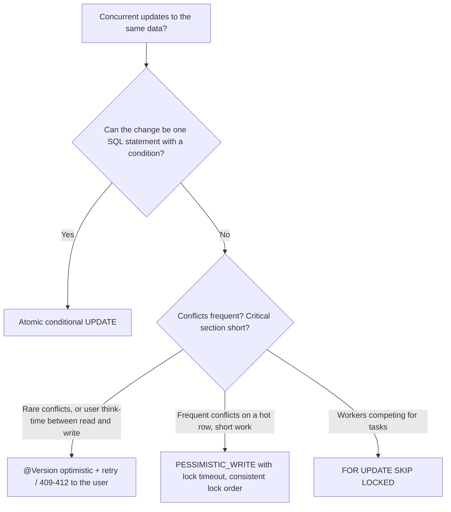

# Optimistic vs Pessimistic Locking

!!! abstract "Key takeaways"
    - The default isolation level (READ COMMITTED) does **not** stop **lost updates**: two transactions read a balance of 100, both write 90, one debit disappears. Measured: 10 concurrent read-modify-write debits of 10 on a row without a version column ended at **90, not 0**.
    - **Optimistic locking** (`@Version`): no locks held; the `UPDATE … WHERE id = ? AND version = ?` fails if someone else committed first → `OptimisticLockException` (Spring: `ObjectOptimisticLockingFailureException`). Best when conflicts are **rare** and for long user think-time (pair it with HTTP `ETag`/`If-Match`). Measured: 9 of 10 concurrent updaters failed fast, no update was lost.
    - **Pessimistic locking** (`@Lock(PESSIMISTIC_WRITE)` → `SELECT … FOR UPDATE`; Hibernate 6 on PostgreSQL emits `FOR NO KEY UPDATE`): blocks other writers until commit. Best for **short, high-contention** critical sections. Always set a **lock timeout**. Measured: 10 concurrent debits serialised, balance 0, no failures.
    - Often the best answer is neither: an **atomic conditional UPDATE** (`SET balance = balance - 10 WHERE id = ? AND balance >= 10`) in one statement. Measured: of 15 concurrent debits on 100, exactly 10 succeeded.
    - For job queues, **`FOR UPDATE SKIP LOCKED`** lets workers claim different rows without blocking each other. Measured: 4 workers claimed 20 jobs, 0 duplicates.

## Why it matters

Concurrency bugs don't show up in unit tests or demos. They appear under production load as "the balance is wrong", "two pharmacists approved the same refill", "the last seat was sold twice" or "a stale edit overwrote a correction". In banking and healthcare these are incidents with real consequences.

Interviewers ask "optimistic or pessimistic?" to see whether you can explain the **failure mode** first (lost update), then choose a mechanism based on contention, latency and user experience, and know the alternatives (atomic SQL, queues, idempotency).

## Core concepts

### The lost update problem


*Notice that each transaction is correct on its own and READ COMMITTED allows the interleaving. The read-modify-write pattern in application code is the bug.*

### Option 1: Optimistic locking with @Version

```java
@Entity
class Wallet {
    @Id private Long id;
    private int balance;
    @Version private long version;     // Hibernate adds "AND version = ?" and increments on every UPDATE
}
```

```sql
-- What Hibernate runs at flush
UPDATE wallet SET balance = 90, version = 8 WHERE id = 1 AND version = 7;
-- 0 rows updated → someone committed first → OptimisticLockException
```

- **No database locks** are held while the user or code is thinking, so it scales and suits web flows.
- The losing transaction **fails** and must **retry** (re-read and re-apply) or report a conflict to the user (`409`/`412`).
- `@Version` types: `int`/`long`/`Integer`/`Long` (preferred) or a timestamp (risky with clock precision).
- Lock modes: `OPTIMISTIC` (verify the version at commit even if you only read the entity) and `OPTIMISTIC_FORCE_INCREMENT` (bump the version of an aggregate root when its children change, so concurrent edits to *different* children of the same order still conflict).
- **Across HTTP requests:** send the version as an `ETag`, require `If-Match`, compare before applying changes (see [REST principles](../api-design/01-rest-principles-resource-modelling-and-http-semantics.md)).

### Option 2: Pessimistic locking

```java
interface WalletRepository extends JpaRepository<Wallet, Long> {

    @Lock(LockModeType.PESSIMISTIC_WRITE)
    @QueryHints(@QueryHint(name = "jakarta.persistence.lock.timeout", value = "3000"))   // ms
    @Query("select w from Wallet w where w.id = :id")
    Wallet lockById(Long id);
}
```

| JPA lock mode | PostgreSQL SQL (Hibernate 6.6) | Blocks | Use for |
|---|---|---|---|
| `PESSIMISTIC_READ` | `FOR SHARE` | Writers (readers can share) | Read a row and ensure it doesn't change until commit |
| `PESSIMISTIC_WRITE` | `FOR NO KEY UPDATE` (verified) | Other writers and lockers | Read-modify-write of a hot row |
| `PESSIMISTIC_FORCE_INCREMENT` | `FOR UPDATE` + version increment | Same + bumps version | Mix with optimistic readers |
| `+ timeout 0` (`NOWAIT`) | `… NOWAIT` | Fails immediately if locked | Interactive requests that shouldn't wait |
| `+ SKIP_LOCKED` | `… SKIP LOCKED` | Skips locked rows | Work queues |

- `FOR NO KEY UPDATE` is PostgreSQL's slightly weaker exclusive row lock: it blocks other updates and locks but **not** inserts of child rows that reference this row via a foreign key, which reduces lock contention compared with `FOR UPDATE`.
- Locks are held **until the transaction ends**. Keep the critical section short: no remote calls, no user interaction inside it.
- **Lock timeout:** without one, a blocked transaction can wait indefinitely (PostgreSQL's `lock_timeout` defaults to 0 = wait forever). Set the JPA hint, a database `lock_timeout`, or both.
- **Deadlocks:** two transactions lock rows in opposite order (T1 locks wallet A then B, T2 locks B then A). PostgreSQL detects it after `deadlock_timeout` (1 s by default) and aborts one with SQLSTATE `40P01`. Prevent by **locking in a consistent order** (sort ids), and retry the victim.

### Option 3: Atomic conditional update (often the best)

```java
@Modifying
@Query("""
       update Wallet w set w.balance = w.balance - :amount, w.version = w.version + 1
       where w.id = :id and w.balance >= :amount
       """)
int debit(Long id, int amount);       // 1 = success, 0 = insufficient funds (or no such wallet)
```

- One statement, one row lock for microseconds, invariant enforced by the database. No read-modify-write in Java at all.
- Measured: 15 concurrent debits of 10 against a balance of 100 → exactly **10 succeeded**, final balance **0**, never negative.
- Bulk JPQL bypasses the persistence context, so entities already loaded in the same transaction are stale afterwards (`@Modifying(clearAutomatically = true)`), and bumping the version manually keeps optimistic readers honest.
- The same idea in other stores: DynamoDB conditional writes, MongoDB `findOneAndUpdate` with a filter on the current value, Redis Lua scripts.

### Option 4: SKIP LOCKED for work queues

```java
@Lock(LockModeType.PESSIMISTIC_WRITE)
@QueryHints(@QueryHint(name = "jakarta.persistence.lock.timeout", value = "-2"))  // Hibernate: -2 = SKIP LOCKED
@Query("select j from Job j where j.status = 'READY' order by j.id")
List<Job> claimBatch(Limit limit);
// SQL: ... where status = 'READY' order by id fetch first ? rows only for no key update skip locked
```

Each worker locks a batch of unclaimed rows; rows locked by other workers are skipped instead of waited on. Measured: 4 concurrent workers claiming batches of 5 from 20 jobs claimed all 20, **no duplicates**, no blocking. This is how many outbox relays and database-backed job queues (for example JobRunr, Quartz clustering patterns, Postgres-based queues) work.

### Choosing


*Notice that optimistic locking is the default for entities, pessimistic locking is a targeted tool for hot rows, and the atomic UPDATE beats both whenever the logic fits in SQL.*

| | Optimistic | Pessimistic | Atomic UPDATE |
|---|---|---|---|
| Locks held | None until the UPDATE | From SELECT until commit | Only during the statement |
| On conflict | Exception, retry or report | Wait (or timeout/NOWAIT) | Condition fails, 0 rows |
| Throughput under contention | Drops (many retries) | Serialised, predictable | Best |
| Deadlock risk | None | Yes (lock ordering) | Low |
| Works across user think-time | Yes (version in ETag) | No (never hold locks across requests) | n/a |
| Measured (10 concurrent debits) | 9 failures, nothing lost | 0 failures, serialised | Exactly the allowed number succeed |

### Retrying optimistic failures

```java
@Retryable(retryFor = ObjectOptimisticLockingFailureException.class,
           maxAttempts = 3, backoff = @Backoff(delay = 50, multiplier = 2, random = true))
@Transactional                       // each retry must start a NEW transaction (fresh read)
public void applyAdjustment(Long walletId, int delta) {
    Wallet w = wallets.findById(walletId).orElseThrow();
    w.adjust(delta);
}
```

- The retry must wrap the **transaction**, not run inside it: re-reading inside the same persistence context returns the same stale instance. Spring Retry's proxy must be outside the `@Transactional` proxy (separate beans or ordering).
- Retry only where re-applying is correct (the operation is recomputed from fresh data). For user edits, return `409`/`412` and let the user merge.

## In practice: code & configuration

=== "❌ Common mistake"
    ```java
    @Transactional
    public void debit(Long walletId, int amount) {
        Wallet w = wallets.findById(walletId).orElseThrow();   // no @Version, no lock
        if (w.getBalance() < amount) throw new InsufficientFunds();
        w.setBalance(w.getBalance() - amount);                 // concurrent debits overwrite each other
    }

    @Transactional
    public void transfer(Long from, Long to, int amount) {
        Wallet a = wallets.lockById(from);                      // T1 locks A then B...
        Wallet b = wallets.lockById(to);                        // ...T2 locks B then A -> deadlock
        paymentGateway.notify(a, b);                            // remote call while holding row locks
        a.debit(amount); b.credit(amount);
    }
    ```

=== "✅ Correct approach"
    ```java
    // Simple invariant: let the database enforce it atomically
    @Transactional
    public void debit(Long walletId, int amount) {
        if (wallets.debit(walletId, amount) == 0) throw new InsufficientFunds();
    }

    // Multi-row invariant: lock in a consistent order, short critical section, timeout set
    @Transactional(timeout = 5)
    public void transfer(Long from, Long to, int amount) {
        Long first = Math.min(from, to), second = Math.max(from, to);   // global lock order
        Wallet w1 = wallets.lockById(first);                             // FOR NO KEY UPDATE, 3 s lock timeout
        Wallet w2 = wallets.lockById(second);
        Wallet source = from.equals(first) ? w1 : w2;
        Wallet target = from.equals(first) ? w2 : w1;
        source.debit(amount);                                            // throws if insufficient
        target.credit(amount);
        outbox.save(TransferEvent.of(from, to, amount));                 // notify after commit via outbox
    }

    // User edits across requests: optimistic, surfaced as 412 via ETag/If-Match
    @Transactional
    public MemberView updateContact(Long id, long expectedVersion, ContactUpdate update) {
        Member m = members.findById(id).orElseThrow();
        if (m.getVersion() != expectedVersion) throw new PreconditionFailedException();   // -> 412
        m.updateContact(update);
        return MemberView.from(m);   // a concurrent commit between read and flush -> OptimisticLockException -> 409
    }
    ```

## Real-world usage

- **Banking ledgers** typically avoid read-modify-write entirely: append-only ledger entries plus atomic balance updates or serialisable transactions for the few invariants that span rows.
- **Ticketing and inventory** (airline seats, concert tickets, pharmacy stock) use conditional updates (`WHERE available > 0`) or short pessimistic locks on the hot row, plus reservations with expiry.
- **Job queues on PostgreSQL** (outbox relays, schedulers) rely on `FOR UPDATE SKIP LOCKED`, added in PostgreSQL 9.5 for exactly this use.
- **Web apps** (including FHIR servers) expose resource versions as ETags and require `If-Match` on updates: optimistic locking at the HTTP level.
- **Incident pattern:** a pessimistic lock taken before an HTTP call to a slow partner held row locks for 30 s; every other request for that customer queued and the connection pool ran out. Locks must never span remote calls.

## Trade-offs & production gotchas

| Option | Pros | Cons | Use when |
|---|---|---|---|
| `@Version` optimistic | No locks, scales, works across requests | Retries or user-visible conflicts under contention | Default for editable entities |
| `PESSIMISTIC_WRITE` | No retries, predictable | Blocking, deadlocks, pool exhaustion if slow | Hot rows, short critical sections |
| `NOWAIT` | Fails fast | Caller must handle immediate failure | Interactive requests |
| Atomic UPDATE | Fastest, simplest, no lost updates | Logic must fit in SQL; bypasses persistence context | Counters, balances, stock, status transitions |
| `SKIP LOCKED` | Parallel workers, no blocking | Ordering is approximate | Job/outbox queues |
| SERIALIZABLE isolation | Database detects all anomalies | Serialisation failures to retry, overhead | Complex multi-row invariants |

!!! warning "Gotcha: retrying inside the same transaction"
    After an `OptimisticLockException` the transaction is marked rollback-only and the persistence context holds stale state. A retry must start a new transaction and re-read.

!!! warning "Gotcha: pessimistic locks without timeouts"
    PostgreSQL waits forever by default. One stuck transaction can block a growing queue of requests until the pool is exhausted. Set `jakarta.persistence.lock.timeout`, `lock_timeout`, and `@Transactional(timeout = …)`.

!!! warning "Gotcha: JVM locks don't protect the database"
    `synchronized` or `ReentrantLock` only serialises threads in one pod. With several pods (or other services writing the same table) you need database-level concurrency control.

## How this connects to my experience

- **Where I used it:** not ★. Concurrency control matters in every system on the resume: key rotation and lifecycle state in CCKM (Coriolis), event-driven workflows with retries at OptumRx, and relational services at Deloitte. At OptumRx's MongoDB layer, the equivalent tools are conditional `findOneAndUpdate` and version fields. *[confirm concrete cases]*
- **Talking points:**
    - "I start with `@Version` on editable entities and expose it as an ETag, so stale edits fail with 412 instead of silently overwriting."
    - "For counters and balances I use one conditional UPDATE rather than read-modify-write."
    - "Pessimistic locks only for short, hot critical sections, always with a lock timeout and a consistent lock order; never across a remote call."
    - "Kafka consumers that update shared rows use version checks or conditional updates, because redeliveries and parallel partitions mean concurrent writers." *[confirm]*
- **Likely follow-up chain:** "What's a lost update?" → example → "Optimistic or pessimistic?" (contention, think-time) → "How do you retry?" (new transaction) → "Deadlocks?" (lock ordering, detection, retry) → "Job queue across pods?" (SKIP LOCKED).

## Interview questions

### Fundamentals

??? question "Q1. What is a lost update and does READ COMMITTED prevent it?"
    **Answer:** Two transactions read the same value, compute new values from it, and both write; the later write silently overwrites the earlier one. READ COMMITTED does not prevent it, because each transaction only reads committed data. Use optimistic locking, pessimistic locking, an atomic conditional update or a stricter isolation level.

    **Interviewer listens for:** read-modify-write interleaving, READ COMMITTED allows it, the remedies.

    **Common wrong answer:** "Transactions prevent that automatically."

??? question "Q2. How does optimistic locking work in JPA?"
    **Answer:** A `@Version` attribute is included in the UPDATE's WHERE clause and incremented on each update. If another transaction committed first, the version no longer matches, zero rows are updated, and Hibernate throws `OptimisticLockException` (wrapped by Spring as `ObjectOptimisticLockingFailureException`). No database locks are held between read and write.

    **Interviewer listens for:** version in WHERE, increment, exception, no locks held.

    **Common wrong answer:** "It locks the row optimistically."

??? question "Q3. What SQL does PESSIMISTIC_WRITE generate?"
    **Answer:** A locking read: `SELECT … FOR UPDATE` in most databases. Hibernate 6 on PostgreSQL emits `FOR NO KEY UPDATE`, an exclusive row lock that doesn't block inserts of rows referencing it via foreign keys. The lock is held until the transaction commits or rolls back.

    **Interviewer listens for:** FOR UPDATE / FOR NO KEY UPDATE, held until commit.

    **Common wrong answer:** "It locks the whole table."

??? question "Q4. When do you choose optimistic vs pessimistic locking?"
    **Answer:** Optimistic when conflicts are rare and when there is think-time between read and write (web forms, long workflows), because nothing is locked and it works across requests. Pessimistic when contention on a specific row is high and the critical section is short, so retries would waste work. Prefer an atomic conditional UPDATE when the logic fits in one statement.

    **Interviewer listens for:** contention level, think-time, short critical section, atomic alternative.

    **Common wrong answer:** "Pessimistic is safer, so always use it."

### Intermediate

??? question "Q5. How do you retry after an OptimisticLockException?"
    **Answer:** Retry the whole unit of work in a new transaction so the entity is re-read with its current version, with a small number of attempts and backoff with jitter (Spring Retry `@Retryable` outside the `@Transactional` boundary). Only retry when re-applying the operation to fresh data is correct; for user edits, return a conflict instead.

    **Interviewer listens for:** new transaction, re-read, limited attempts, when not to retry.

    **Common wrong answer:** "Catch the exception and call save() again."

??? question "Q6. Why is an atomic conditional UPDATE often better than locking?"
    **Answer:** It does the check and the change in one statement, so the database enforces the invariant with a row lock held for microseconds; no read-modify-write in Java, no retries, no deadlocks from lock ordering. Measured: of 15 concurrent debits of 10 on a balance of 100, exactly 10 succeeded and the balance never went negative.

    **Interviewer listens for:** single statement, invariant in WHERE, rows-affected check.

    **Common wrong answer:** "It's not safe without a transaction around it." A single statement is atomic.

??? question "Q7. What is SKIP LOCKED used for?"
    **Answer:** Work queues: multiple workers select available rows `FOR UPDATE SKIP LOCKED`, so each locks a different batch and none waits for rows another worker holds. It's used for outbox relays, job schedulers and task tables in PostgreSQL, MySQL 8 and Oracle.

    **Interviewer listens for:** parallel workers, no blocking, outbox/job queue use.

    **Common wrong answer:** "It skips rows that fail validation."

??? question "Q8. How do deadlocks happen with pessimistic locks and how do you prevent them?"
    **Answer:** Two transactions each hold a lock the other needs, typically by locking the same rows in different orders. PostgreSQL detects the cycle (after `deadlock_timeout`, 1 s by default) and aborts one with SQLSTATE 40P01. Prevent by locking rows in a consistent global order (sort by id), keeping transactions short, and retrying the aborted transaction.

    **Interviewer listens for:** lock order, detection, retry.

    **Common wrong answer:** "Databases prevent deadlocks automatically."

### Senior

??? question "Q9. What's OPTIMISTIC_FORCE_INCREMENT for?"
    **Answer:** Bumping the version of an aggregate root even though the root itself didn't change, typically when a child entity changes. Two users editing different lines of the same order would otherwise not conflict; forcing the root version increment makes the second commit fail, protecting invariants that span the whole aggregate (like an order total limit).

    **Interviewer listens for:** aggregate-level consistency, child changes, conflict on the root.

    **Common wrong answer:** "It's the same as @Version."

??? question "Q10. How do you connect optimistic locking to a REST API?"
    **Answer:** Return the entity version as an `ETag` on reads. Require `If-Match` on `PUT`/`PATCH` (`428` if missing). Compare it with the current version before applying changes (`412` on mismatch); a concurrent commit between the check and flush raises `OptimisticLockException`, mapped to `409`. Clients re-read and merge.

    **Interviewer listens for:** ETag/If-Match, 412/428/409, end-to-end versioning.

    **Common wrong answer:** "Lock the row when the user opens the edit form."

??? question "Q11. What can go wrong with pessimistic locks in a microservice under load?"
    **Answer:** Locks held during slow operations (remote calls, large computations) make other requests wait, holding connections until the pool is exhausted and the service stalls; missing timeouts let waits grow unbounded; inconsistent lock order causes deadlocks; and locks don't help if other services update the same data differently. Keep critical sections tiny, set lock and transaction timeouts, order locks, and move remote calls outside the transaction (outbox).

    **Interviewer listens for:** pool exhaustion, timeouts, deadlocks, remote calls outside the lock.

    **Common wrong answer:** "Pessimistic locks are always safe; they just add some latency."

### Scenario-based

??? question "Q12. Two pharmacists approve the same refill at the same moment and two fills are created. Fix it."
    **Answer:** Make the transition atomic: `UPDATE refill SET status = 'APPROVED', approved_by = ? WHERE id = ? AND status = 'REQUESTED'` and check rows affected (0 → 409 "already approved"), or use `@Version` on the refill so the second approval fails. Create the fill in the same transaction as the transition, and make fill creation idempotent by refill id (unique constraint).

    **Interviewer listens for:** state-machine transition as a conditional update or version check, unique constraint, 409.

    **Common wrong answer:** "Disable the button after the first click."

??? question "Q13. A wallet service sees many OptimisticLockExceptions on popular accounts and latency is rising. What do you change?"
    **Answer:** High contention on a few rows makes optimistic retries waste work. Options: switch the debit to an atomic conditional UPDATE; or use a short pessimistic lock for those operations; or redesign the hot row (append ledger entries and compute or periodically roll up balances; shard counters). Measure retry rates per account before and after.

    **Interviewer listens for:** contention diagnosis, atomic update, pessimistic for hot rows, ledger/sharded design.

    **Common wrong answer:** "Increase the retry count."

??? question "Q14. Several pods process a `pending_notifications` table and some notifications are sent twice. Design a fix."
    **Answer:** Workers must claim rows atomically: `SELECT … WHERE status = 'PENDING' ORDER BY id LIMIT 50 FOR UPDATE SKIP LOCKED`, mark them `SENDING` in the same transaction, commit, send, then mark `SENT`. Use an idempotency key with the SMS/email provider for the crash window between sending and marking, and a reaper for rows stuck in `SENDING`.

    **Interviewer listens for:** SKIP LOCKED claiming, status transitions, provider idempotency, stuck-row recovery.

    **Common wrong answer:** "Run only one pod for the job." It removes scale and still fails on restarts.

## Cheat sheet

| Concept | Remember |
|---|---|
| Lost update | Read-modify-write interleaving; READ COMMITTED allows it (measured: 90 instead of 0) |
| Optimistic | `@Version` in WHERE; `OptimisticLockException`; retry in new TX or 409/412 |
| ETag link | Version → `ETag`; `If-Match` → 412 / missing → 428 |
| Pessimistic | `@Lock(PESSIMISTIC_WRITE)` → `FOR UPDATE` (PG Hibernate 6: `FOR NO KEY UPDATE`) |
| Timeouts | `jakarta.persistence.lock.timeout` (0 = NOWAIT, Hibernate −2 = SKIP LOCKED), `lock_timeout`, TX timeout |
| Deadlocks | Consistent lock order, short TX, retry SQLSTATE 40P01 |
| Atomic UPDATE | `SET x = x - ? WHERE id = ? AND x >= ?`; check rows affected |
| Queues | `FOR UPDATE SKIP LOCKED` (measured: 4 workers, 20 jobs, 0 duplicates) |
| Aggregates | `OPTIMISTIC_FORCE_INCREMENT` on the root |
| Never | Hold locks across remote calls or user think-time; rely on JVM locks across pods |

## Sources
1. [Jakarta Persistence 3.2: locking and concurrency (LockModeType, @Version)](https://jakarta.ee/specifications/persistence/3.2/).
2. [Hibernate ORM 6.6 User Guide: Locking](https://docs.jboss.org/hibernate/orm/6.6/userguide/html_single/Hibernate_User_Guide.html#locking).
3. [PostgreSQL 16: Explicit locking (FOR UPDATE, FOR NO KEY UPDATE, SKIP LOCKED, deadlocks)](https://www.postgresql.org/docs/16/explicit-locking.html) and [SELECT locking clause](https://www.postgresql.org/docs/16/sql-select.html#SQL-FOR-UPDATE-SHARE).
4. [PostgreSQL: lock_timeout and deadlock_timeout settings](https://www.postgresql.org/docs/16/runtime-config-client.html).
5. [Spring Data JPA: Locking](https://docs.spring.io/spring-data/jpa/reference/jpa/locking.html) and [Spring Retry](https://github.com/spring-projects/spring-retry).
6. [Vlad Mihalcea: A beginner's guide to database locking and the lost update phenomena](https://vladmihalcea.com/a-beginners-guide-to-database-locking-and-the-lost-update-phenomena/).
7. Measurements on this page: PostgreSQL 16.14, Hibernate ORM 6.6.29, Spring Boot 3.5.6, 10–15 concurrent threads, run while writing this page.
