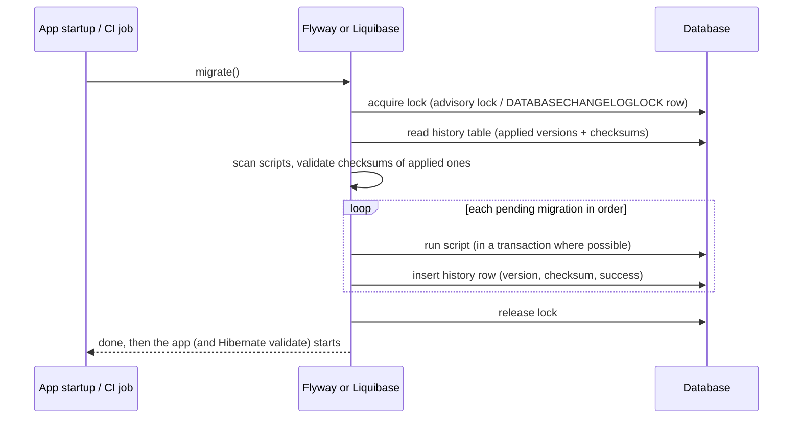
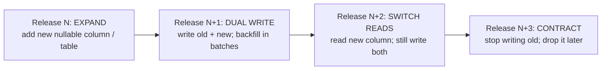

# Schema Migration with Liquibase/Flyway

!!! abstract "TL;DR"
    - Production schemas change through **versioned migration scripts in Git**, applied in order by a tool that records what ran: **Flyway** (`flyway_schema_history`) or **Liquibase** (`DATABASECHANGELOG` + `DATABASECHANGELOGLOCK`). Never `spring.jpa.hibernate.ddl-auto=update` in production; use `validate` or `none`.
    - **Flyway:** plain SQL files named `V2__add_member_phone.sql` (versioned, run once), `R__member_view.sql` (repeatable, re-run when changed). Each applied script's **checksum** is stored; editing an applied script fails validation (verified: "Migration checksum mismatch for migration version 2").
    - **Liquibase:** changelogs (YAML/XML/SQL/JSON) of **changesets** identified by `id` + `author` + file. Database-agnostic change types, **rollback** blocks, **contexts/labels**, **preconditions**.
    - **Zero downtime = backward-compatible steps (expand/contract):** add nullable columns, dual-write, backfill in batches, switch reads, drop the old column in a *later* release. Old and new app versions must both work against the schema during a rolling deploy.
    - PostgreSQL specifics: create indexes with **`CREATE INDEX CONCURRENTLY`** outside a transaction, set **`lock_timeout`** on DDL, and with Flyway set **`postgresql.transactional.lock=false`** (Spring Boot: `spring.flyway.postgresql.transactional-lock=false`), or the concurrent index build waits forever on Flyway's own open transaction (reproduced while writing this page).

## Why it matters

The database outlives every deployment of your code. A schema change that works on a laptop can lock a 200-million-row table in production for minutes, break the previous version of the app that is still serving traffic during a rolling deploy, or leave environments with different schemas because someone ran a script by hand.

Migration tools make schema changes **repeatable, reviewable and auditable**: the same scripts run in dev, CI, staging and production, in the same order, and the database records what was applied. This is a resume topic: Liquibase migration strategies at Deloitte.

## Core concepts

### Why not `ddl-auto`?

| `spring.jpa.hibernate.ddl-auto` | What it does | Production? |
|---|---|---|
| `create` / `create-drop` | Drops and recreates the schema | Never (data loss) |
| `update` | Adds missing tables/columns, never drops or renames, no data migration, no review | **No** |
| `validate` | Checks entities match the schema, fails startup otherwise | Yes, alongside migrations |
| `none` | Does nothing | Yes |

`update` can't rename a column (it adds a new empty one), can't migrate data, can't create indexes safely, and its changes aren't reviewed or versioned. Spring Boot uses `create-drop` only for embedded databases in development; with Flyway or Liquibase on the classpath, set `ddl-auto` to `validate` or `none`.

### How migration tools work


*Notice the lock: when several pods start at once, only one applies migrations while the others wait, then see nothing pending. Notice also the checksum validation: history is append-only, and applied scripts must not change.*

### Flyway

- **Versioned migrations:** `V<version>__<description>.sql`, e.g. `V1__create_member.sql`, `V2__add_member_phone.sql`. Applied once, in version order.
- **Repeatable migrations:** `R__<description>.sql` (views, functions, grants), re-applied whenever their checksum changes, after all versioned ones.
- **Java migrations** (`V5__Backfill.java` extending `BaseJavaMigration`) for logic that's awkward in SQL.
- **Schema history:** `flyway_schema_history` with version, description, type, checksum, execution time and success.
- **Commands:** `migrate`, `info`, `validate`, `repair` (fix the history after a failed migration or deliberate checksum change), `baseline` (adopt an existing database), `clean` (drops everything; **disabled by default** since Flyway 9: keep it off in production).
- **Out-of-order** (`outOfOrder=true`) lets a lower version merged late still run; useful with parallel feature branches, but it can hide ordering mistakes.
- Flyway 10+ moved database support into modules: PostgreSQL needs **`flyway-database-postgresql`** on the classpath in addition to `flyway-core`.
- Undo migrations (`U2__…`) exist only in paid editions; most teams **roll forward** with a new migration instead.

**Verified run** (Flyway 11.7, PostgreSQL 16): four migrations applied (`V1`, `V2`, `V3` with a concurrent index, `R__member_view`), schema history recorded each with `success=true`, and after editing the already-applied `V2` the next `validate()` failed with *"Migration checksum mismatch for migration version 2 … Either revert the changes to the migration, or run repair"*.

### Liquibase

```yaml
databaseChangeLog:
  - changeSet:
      id: 2026-10-01-create-refill
      author: vishal
      changes:
        - createTable:
            tableName: refill
            columns:
              - column: { name: id, type: BIGINT, autoIncrement: true, constraints: { primaryKey: true } }
              - column: { name: rx_id, type: TEXT, constraints: { nullable: false } }
              - column: { name: status, type: TEXT, defaultValue: REQUESTED, constraints: { nullable: false } }
      rollback:
        - dropTable: { tableName: refill }
  - changeSet:
      id: 2026-10-02-add-refill-pharmacy
      author: vishal
      preConditions:
        - onFail: MARK_RAN                       # already there (e.g. hotfixed)? record and move on
        - not:
            - columnExists: { tableName: refill, columnName: pharmacy_id }
      changes:
        - addColumn:
            tableName: refill
            columns:
              - column: { name: pharmacy_id, type: TEXT }
  - changeSet:
      id: 2026-10-03-index-refill-rx
      author: vishal
      runInTransaction: false                    # CREATE INDEX CONCURRENTLY can't run in a transaction
      changes:
        - sql:
            sql: CREATE INDEX CONCURRENTLY IF NOT EXISTS idx_refill_rx ON refill (rx_id)
      rollback:
        - sql: { sql: DROP INDEX CONCURRENTLY IF EXISTS idx_refill_rx }
```

- A **changeset** is identified by `id` + `author` + changelog path, and its MD5 checksum is stored in `DATABASECHANGELOG`. Editing an applied changeset fails validation (unless marked `runOnChange` or given `validCheckSum`).
- **Change types** (`createTable`, `addColumn`, `createIndex`) generate database-specific SQL; raw `sql` changes are allowed when you need database features.
- **Rollback:** automatic for many change types, explicit `rollback` blocks for others; `liquibase rollback-count 1` or rollback to a tag.
- **Contexts and labels** select changesets per environment or feature (`context: test` for seed data). **Preconditions** guard changesets (`tableExists`, `sqlCheck`) with `onFail: HALT | MARK_RAN | CONTINUE`.
- **Locking:** a row in `DATABASECHANGELOGLOCK`. If a process dies while holding it, later runs wait; clear it with `liquibase release-locks` after confirming nothing is running.
- `diff`/`diffChangeLog` can generate changesets by comparing databases or against JPA entities (liquibase-hibernate), useful as a starting point, always reviewed by hand.

**Verified run** (Liquibase via Spring Boot 3.5, PostgreSQL 16): all three changesets recorded as `EXECUTED`, the concurrent index was created with `runInTransaction: false`, and a second run applied nothing new.

### Flyway vs Liquibase

| | Flyway | Liquibase |
|---|---|---|
| Format | Plain SQL (and Java) | YAML/XML/JSON abstractions or formatted SQL |
| Learning curve | Very low | Higher |
| Database portability | You write dialect-specific SQL | Change types generate SQL per database |
| Rollback | Roll forward (undo in paid editions) | Built-in rollback blocks |
| Conditional logic | Placeholders, callbacks | Preconditions, contexts, labels |
| History table | `flyway_schema_history` | `DATABASECHANGELOG` + lock table |
| Typical fit | Teams comfortable with SQL, one database type | Multiple database vendors, regulated rollback requirements |

Both are first-class in Spring Boot. Pick one per service and stick to it.

### Spring Boot integration

- Put `flyway-core` (+ `flyway-database-postgresql`) or `liquibase-core` on the classpath; Boot runs migrations **at startup, before JPA** initialises. Defaults: Flyway scans `classpath:db/migration`; Liquibase reads `classpath:/db/changelog/db.changelog-master.yaml`.
- Useful properties: `spring.flyway.validate-on-migrate` (default `true`), `spring.flyway.baseline-on-migrate`, `spring.flyway.out-of-order`, `spring.flyway.postgresql.transactional-lock`, `spring.liquibase.contexts`, `spring.liquibase.label-filter`, and separate migration credentials (`spring.flyway.user`) so the app's runtime user doesn't need DDL rights.
- **Running at app startup vs a separate job:** startup migration is simple and safe with the tools' locks, but slow migrations delay readiness and every pod needs DDL privileges. Many teams run migrations as a **Kubernetes Job / Helm pre-upgrade hook / CI pipeline step** with a privileged user, and the app runs with `validate`.

### Zero-downtime schema changes

During a rolling deploy, **old and new versions of the app run at the same time against the same schema**. Every migration must therefore be compatible with the previous app version.


*Notice that a rename is never one step. Each release is safe to roll back because the previous version still finds everything it needs in the schema.*

| Change | Safe approach |
|---|---|
| Add column | Nullable or with a default (PostgreSQL 11+ adds a constant default without rewriting the table) |
| Add NOT NULL | Add nullable → backfill → `ADD CONSTRAINT … CHECK (col IS NOT NULL) NOT VALID` → `VALIDATE CONSTRAINT` → `SET NOT NULL` (PostgreSQL 12+ uses the validated check to skip the full scan) |
| Rename column | Expand/contract: new column, dual write, backfill, switch, drop old later |
| Drop column | Stop using it in code first (and in JPA mappings), deploy, then drop in a later migration |
| Add index | `CREATE INDEX CONCURRENTLY` outside a transaction |
| Add foreign key | `ADD CONSTRAINT … NOT VALID`, then `VALIDATE CONSTRAINT` (lighter lock) |
| Change type | New column + backfill, rather than `ALTER TYPE` that rewrites the table under an exclusive lock |
| Large backfill | Batches of a few thousand rows per transaction, outside the deploy, throttled |

Verified on PostgreSQL 16 with `client_min_messages = debug1`: after `VALIDATE CONSTRAINT`, the `SET NOT NULL` logged *"existing constraints on column \"member.mobile_phone\" are sufficient to prove that it does not contain nulls"*, so no table scan ran under the exclusive lock.

**Lock safety:** most `ALTER TABLE` forms take an `ACCESS EXCLUSIVE` lock. Even a quick one queues behind a long-running query, and then *every* query on that table queues behind the `ALTER`. Set `SET lock_timeout = '5s'` at the top of DDL migrations so they fail fast and can be retried, instead of causing an outage.

### The Flyway + CREATE INDEX CONCURRENTLY hang (reproduced)

Since Flyway 9.1.2, Flyway's PostgreSQL support takes a **transaction-level advisory lock** by default, held on a connection that stays *idle in transaction* for the whole run. `CREATE INDEX CONCURRENTLY` must wait for all older transactions to finish, including Flyway's own, so it **waits forever** (`pg_stat_activity` shows the migration `active` with wait event `virtualxid` and Flyway's lock session `idle in transaction`). Reproduced on Flyway 11.7 / PostgreSQL 16: with the default setting the run timed out; with `postgresql.transactional.lock=false` it completed in seconds.

```properties
# Spring Boot
spring.flyway.postgresql.transactional-lock=false
# Flyway config file / env
flyway.postgresql.transactional.lock=false     # FLYWAY_POSTGRESQL_TRANSACTIONAL_LOCK=false
```

## In practice: code & configuration

```yaml
spring:
  jpa:
    hibernate:
      ddl-auto: validate                       # migrations own the schema; Hibernate only checks it
  flyway:
    locations: classpath:db/migration
    validate-on-migrate: true
    postgresql:
      transactional-lock: false                # needed for CREATE INDEX CONCURRENTLY
    user: ${DB_MIGRATION_USER}                 # DDL rights only for migrations
    password: ${DB_MIGRATION_PASSWORD}
```

=== "❌ Common mistake"
    ```sql
    -- V7__rename_and_index.sql : one release, applied while the old version is still serving traffic
    ALTER TABLE member RENAME COLUMN phone TO mobile_phone;        -- old pods query "phone": errors
    ALTER TABLE member ALTER COLUMN mobile_phone SET NOT NULL;     -- full scan under ACCESS EXCLUSIVE
    CREATE INDEX idx_member_mobile ON member (mobile_phone);       -- blocks writes for the whole build
    UPDATE claim SET status = 'CLOSED' WHERE created_at < '2024-01-01';  -- 50M rows in one transaction
    ```

=== "✅ Correct approach"
    ```sql
    -- V7__add_mobile_phone.sql  (release N: expand)
    SET lock_timeout = '5s';                                       -- fail fast instead of queueing everyone
    ALTER TABLE member ADD COLUMN mobile_phone TEXT;               -- nullable: old version unaffected

    -- V8__index_mobile_phone.sql (non-transactional script)
    -- flyway:executeInTransaction=false
    CREATE INDEX CONCURRENTLY IF NOT EXISTS idx_member_mobile ON member (mobile_phone);

    -- Release N+1: app writes both columns; backfill runs as a batched job, not a migration:
    --   UPDATE member SET mobile_phone = phone
    --   WHERE id IN (SELECT id FROM member WHERE mobile_phone IS NULL AND phone IS NOT NULL LIMIT 5000);
    --   (repeat until 0 rows, with a pause between batches)

    -- V9__mobile_phone_not_null.sql (release N+2, after backfill is complete)
    SET lock_timeout = '5s';
    ALTER TABLE member ADD CONSTRAINT member_mobile_nn CHECK (mobile_phone IS NOT NULL) NOT VALID;
    ALTER TABLE member VALIDATE CONSTRAINT member_mobile_nn;       -- scans without blocking writes
    ALTER TABLE member ALTER COLUMN mobile_phone SET NOT NULL;     -- PG 12+: uses the valid CHECK, no rescan

    -- V10__drop_phone.sql (release N+3, after no code reads or writes "phone")
    ALTER TABLE member DROP COLUMN phone;
    ```

**Testing migrations:** run them against a real PostgreSQL in CI (Testcontainers), from an empty database *and* from a copy of production-like data, and keep `ddl-auto=validate` in integration tests so entity/schema drift fails the build.

## Real-world usage

- **GitHub, Stripe, Shopify and GitLab** publish internal rules for online schema changes: expand/contract, no locking DDL on hot tables, batched backfills, and tooling (gh-ost, `pg_repack`, GitLab's migration helpers) to enforce them.
- **GitLab's** migration guidelines (PostgreSQL) require `CREATE INDEX CONCURRENTLY` via helpers, `lock_timeout` retries, and splitting post-deployment migrations (run after the new code is live) from regular ones: the same expand/contract idea.
- **Regulated industries** (healthcare, banking) value Liquibase rollback blocks and the audit trail in `DATABASECHANGELOG`, and often require migrations to run through the CI/CD pipeline with a separate privileged account rather than from application pods.
- **Incident pattern:** an `ALTER TABLE … ADD COLUMN … DEFAULT now()` (a volatile default) rewrote a large table under an exclusive lock and stalled all writes; another team's `ALTER` queued behind a long report query and blocked every request for minutes. `lock_timeout` and compatible steps prevent both.

## Trade-offs & production gotchas

| Option | Pros | Cons | Use when |
|---|---|---|---|
| Flyway | Simple SQL, low ceremony | Roll-forward only (free edition) | SQL-fluent teams, one database type |
| Liquibase | Portable change types, rollback, preconditions | More verbose, more concepts | Multi-vendor, strict rollback/audit needs |
| Migrate at app startup | Simple, always in sync | Slower startup, DDL rights in every pod | Small services, fast migrations |
| Separate migration job | Least privilege, controlled timing | Extra pipeline step, ordering with deploys | Production at scale, regulated environments |
| Roll forward | Matches real incidents (data already changed) | Needs a quick fix migration | Default |
| Rollback scripts | Fast undo for schema-only changes | Can't undo data changes safely | Liquibase users, pre-release |

!!! warning "Gotcha: editing an applied migration"
    It changes the checksum and fails `validate` in every environment where it already ran. Add a new migration instead; use `repair` only for deliberate, reviewed fixes such as comment-only changes.

!!! warning "Gotcha: DDL and the lock queue"
    A "fast" `ALTER TABLE` still needs an `ACCESS EXCLUSIVE` lock and queues behind any long query; while it waits, every new query on the table queues behind it. Always set `lock_timeout` and retry, and avoid DDL on hot tables during peak hours.

!!! warning "Gotcha: CONCURRENTLY inside a transaction"
    `CREATE INDEX CONCURRENTLY` fails inside a transaction block. Use `-- flyway:executeInTransaction=false` (Flyway) or `runInTransaction: false` (Liquibase), and with Flyway also disable the transactional advisory lock. If a concurrent build fails, it leaves an `INVALID` index to drop and recreate.

## How this connects to my experience

- **Where I used it:** ★ "Implemented Elasticsearch-powered search capabilities and **Liquibase migration strategies**" on ConvergeHealth Data Asset Explorer at Deloitte, alongside Terraform-automated infrastructure and RDS.
- **Talking points:**
    - "Schema changes went through Liquibase changelogs reviewed in pull requests, so every environment had the same, auditable history." *[confirm format: YAML/XML/SQL]*
    - "I'd structure changes as expand/contract so a rolling deploy or a rollback of the app never meets an incompatible schema." *[confirm how deploys and migrations were sequenced]*
    - "I'd use contexts for test data and preconditions for environments that had drifted." *[confirm]*
- **Likely follow-up chain:** "How did you manage schema changes?" → Liquibase changelogs, history table → "How do you rename a column with no downtime?" (expand/contract) → "Add an index to a big table?" (CONCURRENTLY, outside a transaction) → "A migration failed halfway in production. What now?" (inspect, fix forward, repair/release locks) → "Startup or separate job?"

## Interview questions

### Fundamentals

??? question "Q1. Why use a migration tool instead of ddl-auto=update?"
    **Answer:** `update` only adds missing tables and columns, can't rename, drop or migrate data, can't control locking, isn't reviewed or versioned, and can differ between environments. Migration tools apply versioned, reviewed scripts in order, record what ran, validate checksums and make every environment identical. In production use `validate` or `none` with migrations.

    **Interviewer listens for:** limits of update, versioning, history and checksums, validate.

    **Common wrong answer:** "update is fine if you're careful."

??? question "Q2. How does Flyway know which migrations to run?"
    **Answer:** It reads its `flyway_schema_history` table (applied versions, checksums, success flags), scans the configured locations for `V…` and `R…` scripts, validates that applied scripts haven't changed, and runs pending versioned migrations in order, then repeatable ones whose checksums changed, recording each.

    **Interviewer listens for:** history table, versions, checksums, repeatable migrations.

    **Common wrong answer:** "It compares the entities with the database."

??? question "Q3. What's a Liquibase changeset and how is it identified?"
    **Answer:** A unit of change in a changelog, identified by `id`, `author` and the changelog file path. Liquibase records each executed changeset with its checksum in `DATABASECHANGELOG`, uses `DATABASECHANGELOGLOCK` to prevent concurrent runs, and can roll back changesets using automatic or explicit rollback blocks.

    **Interviewer listens for:** id + author + path, history and lock tables, rollback.

    **Common wrong answer:** "It's identified by its position in the file."

??? question "Q4. What happens if you edit a migration that was already applied?"
    **Answer:** Its checksum no longer matches the history, so validation fails (Flyway: "Migration checksum mismatch…"; Liquibase: checksum validation error) and migrations stop in every environment where it ran. The fix is to revert the edit and add a new migration; `repair` (Flyway) or `validCheckSum` (Liquibase) are only for deliberate, reviewed corrections.

    **Interviewer listens for:** checksum mismatch, append-only history, new migration instead.

    **Common wrong answer:** "Flyway will apply the new version automatically."

### Intermediate

??? question "Q5. Flyway or Liquibase: how do you choose?"
    **Answer:** Flyway for teams comfortable with plain SQL on one database type: simple, low ceremony, roll forward. Liquibase when you need portability across database vendors, built-in rollback, preconditions or contexts, or a regulated audit trail of changes. Both integrate with Spring Boot; consistency within a service matters more than the choice.

    **Interviewer listens for:** trade-offs, not tool loyalty.

    **Common wrong answer:** "Liquibase is always better because it has rollback."

??? question "Q6. How do you rename a column with zero downtime?"
    **Answer:** Expand/contract across releases: add the new column (nullable); deploy code that writes both columns; backfill in batches; switch reads to the new column; stop writing the old one; drop it in a later migration. Each step is compatible with the previous app version, so rolling deploys and rollbacks are safe.

    **Interviewer listens for:** multiple releases, dual write, batched backfill, delayed drop.

    **Common wrong answer:** "ALTER TABLE RENAME COLUMN during a maintenance window."

??? question "Q7. How do you add an index to a large PostgreSQL table safely?"
    **Answer:** `CREATE INDEX CONCURRENTLY`, which builds without blocking writes, run outside a transaction (Flyway `executeInTransaction=false`, Liquibase `runInTransaction: false`), and with Flyway's `postgresql.transactional.lock=false`. Check for an `INVALID` index if the build fails, and drop/recreate it.

    **Interviewer listens for:** CONCURRENTLY, no transaction, invalid index handling, the Flyway lock setting.

    **Common wrong answer:** "Just CREATE INDEX; it's fast."

??? question "Q8. Should migrations run at application startup or as a separate step?"
    **Answer:** Startup is simple and the tools' locks make it safe with several pods, but slow migrations delay readiness and every pod needs DDL privileges. A separate step (CI pipeline, Kubernetes Job, Helm pre-upgrade hook) with a privileged user gives least privilege and controlled timing; the app then starts with `ddl-auto=validate`. Larger or regulated systems usually choose the separate step.

    **Interviewer listens for:** locks, readiness, privileges, controlled timing.

    **Common wrong answer:** "Startup, always; it's the Spring Boot default."

### Senior

??? question "Q9. Why can a fast ALTER TABLE cause an outage?"
    **Answer:** Most ALTER forms need an `ACCESS EXCLUSIVE` lock. If a long query holds a conflicting lock, the ALTER waits, and every new query on that table queues behind the ALTER, so the table is effectively offline until the long query ends. Set `lock_timeout` (a few seconds) so the migration fails fast and retries, and avoid DDL on hot tables at peak.

    **Interviewer listens for:** lock queueing, ACCESS EXCLUSIVE, lock_timeout.

    **Common wrong answer:** "Only slow ALTERs are dangerous."

??? question "Q10. How do you add a NOT NULL constraint to a big table without a long lock?"
    **Answer:** Backfill first, then `ADD CONSTRAINT … CHECK (col IS NOT NULL) NOT VALID` (instant), `VALIDATE CONSTRAINT` (scans with a weaker lock that allows writes), and finally `ALTER COLUMN … SET NOT NULL`, which in PostgreSQL 12+ uses the validated check to skip the full scan. Optionally drop the check afterwards.

    **Interviewer listens for:** NOT VALID + VALIDATE pattern, PG 12 optimisation.

    **Common wrong answer:** "ALTER COLUMN SET NOT NULL directly."

??? question "Q11. Why did a Flyway migration with CREATE INDEX CONCURRENTLY hang forever?"
    **Answer:** Since Flyway 9.1.2 the PostgreSQL integration holds a transaction-level advisory lock on a connection that stays idle in transaction during the run. `CREATE INDEX CONCURRENTLY` waits for all older transactions to finish, including that one, so it waits on `virtualxid` indefinitely. Set `postgresql.transactional.lock=false` (`spring.flyway.postgresql.transactional-lock=false`) to use a session-level lock instead.

    **Interviewer listens for:** advisory lock in a transaction, CONCURRENTLY waiting on old transactions, the setting.

    **Common wrong answer:** "The table was too big."

### Scenario-based

??? question "Q12. A migration failed halfway in production and the next deploy fails because of a lock or a failed history entry. What do you do?"
    **Answer:** Stop deploys. Inspect what actually ran (PostgreSQL DDL is transactional, so a failed transactional migration rolled back; non-transactional ones may be partial). Fix forward: write a corrective migration or complete the change by hand under change control. Then clean the tool state: Flyway `repair` removes the failed history entry; Liquibase `release-locks` if a dead process left `DATABASECHANGELOGLOCK` held (after confirming nothing is running). Add the scenario to tests.

    **Interviewer listens for:** assess first, fix forward, repair/release-locks, transactional DDL knowledge.

    **Common wrong answer:** "Delete the history table and rerun everything."

??? question "Q13. During a rolling deploy, the old version starts failing with 'column does not exist'. What went wrong?"
    **Answer:** The migration was not backward compatible: it dropped or renamed a column the previous version still uses, and migrations ran before all old pods were replaced. Restore compatibility (re-add the column or a view), and change the process: expand/contract across releases, drop columns only in a release after code stopped using them, and test migrations against the previous app version in CI.

    **Interviewer listens for:** old and new code coexisting, expand/contract, testing compatibility.

    **Common wrong answer:** "Deploy faster so the window is shorter."

??? question "Q14. You must backfill a new column for 80 million rows. How?"
    **Answer:** Not in a single migration transaction. Run a separate, idempotent batch job: update a few thousand rows per transaction by primary key ranges or `WHERE new_col IS NULL … LIMIT`, pause between batches, monitor replication lag and locks, and make it resumable. Keep the app dual-writing so new rows don't need backfilling. Only after it completes, add constraints in a later migration.

    **Interviewer listens for:** batching, idempotent/resumable, replication lag, dual write, constraints afterwards.

    **Common wrong answer:** "One UPDATE statement in the migration."

## Cheat sheet

| Concept | Remember |
|---|---|
| Production DDL | Migrations in Git; `ddl-auto=validate`/`none` |
| Flyway files | `V2__desc.sql` once, `R__desc.sql` on change, Java migrations |
| Flyway table | `flyway_schema_history`; checksum mismatch fails validate; `repair`, `baseline` |
| Flyway + PG | `flyway-database-postgresql` module; `postgresql.transactional.lock=false` for CONCURRENTLY |
| Liquibase | Changesets (id + author + path), `DATABASECHANGELOG` + `LOCK`, rollback, contexts, preconditions |
| Spring Boot | Runs before JPA; `spring.flyway.*` / `spring.liquibase.*`; separate migration user |
| Zero downtime | Expand → dual write → backfill → switch reads → contract |
| Indexes | `CREATE INDEX CONCURRENTLY`, outside a transaction; check INVALID indexes |
| NOT NULL | CHECK NOT VALID → VALIDATE → SET NOT NULL |
| Locks | `SET lock_timeout = '5s'` in DDL migrations |
| Backfills | Batched, resumable jobs, not migrations |
| Failures | Fix forward; `repair` / `release-locks` after assessment |

## Sources
1. [Flyway documentation: concepts, migrations, commands](https://documentation.red-gate.com/fd) and [PostgreSQL transactional lock setting](https://documentation.red-gate.com/fd/flyway-postgresql-transactional-lock-setting-277579114.html).
2. [Flyway issue #3497: transactional locks hanging for non-transactional migrations](https://github.com/flyway/flyway/issues/3497).
3. [Liquibase documentation: changelogs, changesets, rollback, preconditions, contexts](https://docs.liquibase.com/).
4. [Spring Boot: Database initialization with Flyway and Liquibase](https://docs.spring.io/spring-boot/how-to/data-initialization.html).
5. [PostgreSQL 16: CREATE INDEX CONCURRENTLY](https://www.postgresql.org/docs/16/sql-createindex.html#SQL-CREATEINDEX-CONCURRENTLY), [ALTER TABLE (NOT VALID, lock levels)](https://www.postgresql.org/docs/16/sql-altertable.html) and [lock_timeout](https://www.postgresql.org/docs/16/runtime-config-client.html).
6. [GitLab: Database migration guidelines](https://docs.gitlab.com/development/migration_style_guide/).
7. [Martin Fowler & Pramod Sadalage: Evolutionary Database Design](https://martinfowler.com/articles/evodb.html).
8. Runs on this page: Flyway 11.7.2, Liquibase (Spring Boot 3.5.6 managed), PostgreSQL 16.14, including the reproduced CONCURRENTLY hang and its fix.
