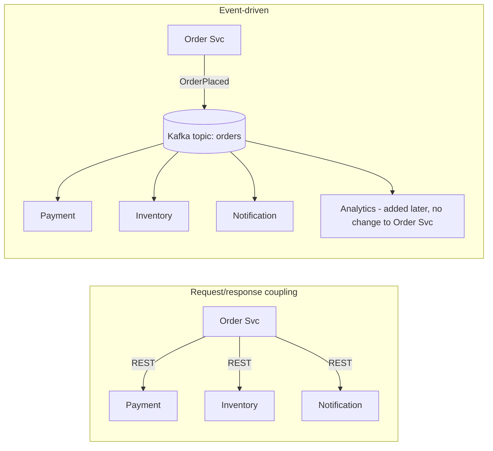
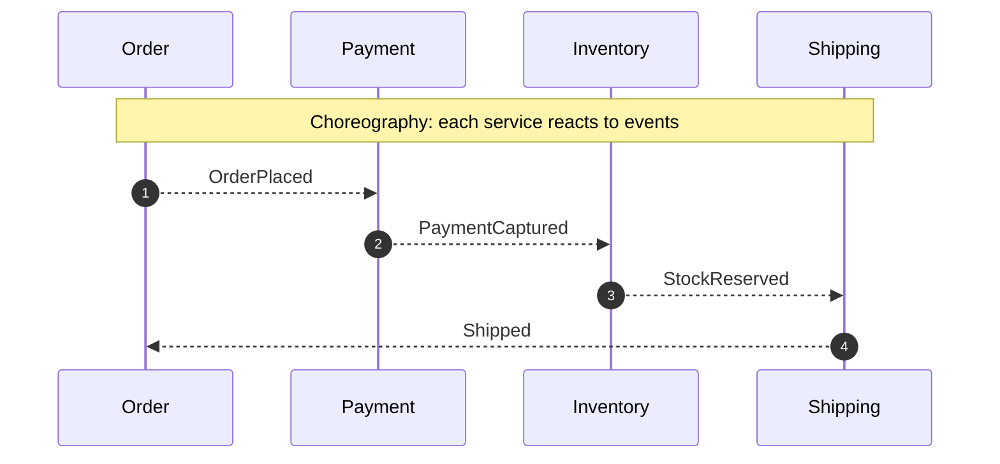
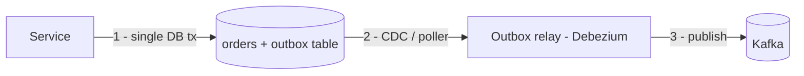

# Event-Driven Architecture Fundamentals

!!! abstract "TL;DR"
    - An **event** is an immutable fact that something *happened* (`OrderPlaced`). A **command** is a request for something to *happen* (`PlaceOrder`) and can be rejected.
    - EDA **decouples producers from consumers in time, space and knowledge**. The producer doesn't know who listens.
    - Two coordination styles: **choreography** (services react to each other's events) and **orchestration** (a coordinator tells services what to do).
    - You get loose coupling, scalability and an audit trail. You pay with **eventual consistency, harder debugging, duplicates and ordering concerns**.
    - Kafka is a **durable, replayable log**, not just a queue. Consumers can rewind, and many independent consumers can read the same events.

## Why it matters

Synchronous REST chains couple availability: if service C is down, A→B→C fails. Each hop adds latency, and every new consumer needs a code change in the caller. Event-driven architecture replaces "call everyone who cares" with "publish what happened, and whoever cares reacts."


*Notice that adding Analytics on the right needs zero changes to the producer. On the left, every new consumer is a code change and a new failure point for Order Svc.*

## Core concepts

### Events, commands and queries

| | Event | Command | Query |
|---|---|---|---|
| Tense | Past: `PaymentCaptured` | Imperative: `CapturePayment` | Question: `GetPayment` |
| Can be rejected? | No, it already happened | Yes | n/a |
| Receivers | 0..N, unknown to the sender | Exactly one handler | One |
| Coupling | Lowest | Sender knows the receiver's intent | Synchronous |

### Event types by payload

- **Event notification:** a thin event (`OrderPlaced{orderId}`). Consumers call back for details, which reintroduces coupling and load on the source.
- **Event-carried state transfer:** a fat event with the data consumers need. Consumers keep local copies, so you get high autonomy at the cost of duplicated data and schema governance.
- **Domain event vs integration event:** domain events stay inside a bounded context. Integration events are a published contract between services and need versioning.

### Pub/sub vs point-to-point (queue)

- **Queue (point-to-point):** each message is processed by one consumer, then removed (RabbitMQ, SQS).
- **Pub/sub log (Kafka):** messages persist for the retention period. Each **consumer group** gets its own copy and its own offset, and within a group partitions are split for parallelism. Kafka gives you **both** semantics: one group equals queue semantics, many groups equals pub/sub.

### Choreography vs orchestration


*Notice that there's no central brain. That's easy to extend, but the end-to-end flow exists only implicitly, spread across services.*

| | Choreography | Orchestration |
|---|---|---|
| Control | Decentralised | Central orchestrator (Temporal, Camunda, a saga service) |
| Coupling | Lowest | Orchestrator knows all steps |
| Visibility of the flow | Hard: needs tracing | Easy: one place |
| Good for | Simple, few steps, many independent reactors | Long-running, multi-step business processes with compensation |

### Consistency model

EDA is **eventually consistent**. The order shows "placed" before payment is captured. You must design the UI and APIs for intermediate states (`PENDING_PAYMENT`) and handle:

- **Duplicates** (at-least-once delivery): idempotent consumers.
- **Out-of-order events:** keys and partitions, plus version numbers.
- **Dual-write problem:** writing to the DB *and* publishing to Kafka isn't atomic → use the **transactional outbox** or CDC (Debezium).


*Notice that the service writes only to its database. Publishing happens from the committed outbox row, so an event is never lost and never sent for a rolled-back transaction.*

## In practice: code & configuration

=== "❌ Dual write"
    ```java
    @Transactional
    public void placeOrder(Order o) {
        orderRepo.save(o);
        kafkaTemplate.send("orders", o.id(), new OrderPlaced(o)); // may succeed even if the tx rolls back,
    }                                                             // or the tx commits and send fails
    ```

=== "✅ Transactional outbox"
    ```java
    @Transactional
    public void placeOrder(Order o) {
        orderRepo.save(o);
        outboxRepo.save(OutboxEvent.of("orders", o.id(), new OrderPlaced(o))); // same DB transaction
    }
    // A relay (Debezium CDC or a scheduled poller) publishes outbox rows to Kafka and marks them sent.
    ```

Event envelope worth standardising across services:

```json
{
  "eventId": "6f1c2b0e-...",          // dedupe key
  "eventType": "PrescriptionApproved",
  "eventVersion": 2,                   // schema version
  "occurredAt": "2026-10-02T09:15:00Z",
  "aggregateId": "rx-88123",           // also the Kafka key → ordering per prescription
  "correlationId": "req-7781",         // tracing across services
  "payload": { "...": "..." }
}
```

## Real-world usage

- **LinkedIn** built Kafka as a central activity-stream and data pipeline. **Netflix, Uber and Goldman Sachs** run Kafka as the backbone for event streaming between hundreds of services.
- **Healthcare:** claims, prescription and eligibility status changes are natural events. Downstream systems (notifications, analytics, audit) subscribe without coupling to the core system.
- **Common failure:** "event soup", where hundreds of fine-grained events have no ownership or schema governance and nobody can explain a business flow. Fix it with an event catalogue (AsyncAPI), schema registry and clear topic ownership.

## Trade-offs & production gotchas

| Benefit | Cost |
|---|---|
| Loose coupling, independent deployability | Eventual consistency; UX must handle pending states |
| Easy to add consumers | Harder to trace a business flow → needs correlation IDs + distributed tracing |
| Absorbs load spikes (buffering) | Duplicates and ordering issues → idempotency, keys |
| Replay / audit trail | Schema evolution and versioning discipline |

!!! warning "When *not* to use EDA"
    - The caller needs an immediate answer (e.g. "is this card valid?"), so use request/response.
    - Simple CRUD with one consumer adds a broker for no benefit.
    - Strong cross-service consistency is mandatory and can't be modelled with sagas.

## How this connects to my experience

- **Where I used it:** OptumRx Meteor ("designed Kafka-based event-driven workflows"); Deloitte ConvergeHealth ("developed event-driven healthcare analytics workflows" with SQS/SNS and Kafka-style patterns).
- **Talking points:**
    - Why events over REST for those flows: decoupling from 5 upstream systems and absorbing bursts. *[confirm]*
    - Choreography vs orchestration choice for the main workflows. *[confirm which you used]*
    - How you avoided dual writes (outbox, CDC, or "publish-then-ack" with idempotency). *[confirm]*
- **Likely follow-up chain:** "Why Kafka, not REST?" → "How did you ensure DB and Kafka stayed consistent?" → "How did you debug a flow across services?" → "How did you handle schema changes?"

## Interview questions

### Fundamentals

??? question "Q1. Event vs command vs message?"
    **Answer:** A *message* is the transport envelope. An *event* is an immutable fact in the past tense, broadcast to any number of unknown consumers, and can't be rejected. A *command* is an intent addressed to one handler that may reject it.

    **Interviewer listens for:** Naming in past tense, ownership (the event belongs to the producer, the command to the receiver).

??? question "Q2. What are the benefits and costs of event-driven architecture?"
    **Answer:** Benefits: temporal decoupling, independent scaling, easy fan-out, resilience to downstream outages, replay and audit. Costs: eventual consistency, duplicates and ordering, harder debugging, schema governance, operational overhead of a broker.

??? question "Q3. How is Kafka different from a traditional message queue?"
    **Answer:** Kafka is a partitioned, replicated, append-only **log**. Messages aren't deleted on consume. They're retained by time or size, and consumers track their own offsets, so many groups can read independently and rewind. Ordering is per partition. Traditional queues (RabbitMQ classic, SQS) delete on acknowledge, do per-message routing and acks, and are usually less suited to replay.

    **Common wrong answer:** "Kafka guarantees global ordering."

### Intermediate

??? question "Q4. Choreography vs orchestration: when would you pick each?"
    **Answer:** Choreography for simple flows with few steps and independent reactors, because it keeps coupling minimal. Orchestration for long-running, multi-step processes needing compensation, timeouts and visibility (a payment saga, onboarding). Many systems mix them: orchestrate within a domain, choreograph between domains.

??? question "Q5. What is the dual-write problem and how do you solve it?"
    **Answer:** Writing to a DB and publishing to a broker are two separate systems with no shared transaction, so one can succeed while the other fails, and you get lost or phantom events. Solutions: the **transactional outbox** (write the event to an outbox table in the same DB transaction, then relay via a poller or CDC like Debezium), or **listen-to-yourself** (publish first, update the DB from your own consumer). Kafka transactions don't span your DB.

??? question "Q6. Thin events vs fat events?"
    **Answer:** Thin (notification) events are small and avoid stale data, but consumers call back, which adds coupling and load. Fat (event-carried state transfer) events let consumers be autonomous, but the schema is bigger, may carry sensitive data (PHI!) and needs versioning. Choose per use case. In healthcare, minimise PHI in events and use references plus authorised lookups.

### Senior

??? question "Q7. How do you handle eventual consistency in the user experience?"
    **Answer:** Model explicit intermediate states (`PENDING`), return `202 Accepted` with a status resource, push updates (WebSocket/SSE) or poll, read-your-own-writes from the write model, and use compensating actions for failures. Set SLAs for convergence and monitor lag.

??? question "Q8. How do you debug a business flow that spans 6 services via events?"
    **Answer:** A correlation ID in every event header, propagated by OpenTelemetry (trace context in Kafka headers). Centralised logging keyed by correlationId and aggregateId. Consumer lag dashboards. An event catalogue with owners. Optionally a "process view" service that builds a timeline per business entity from the events.

??? question "Q9. How would you version events without breaking consumers?"
    **Answer:** Schema registry with compatibility rules (usually BACKWARD). Only additive changes with defaults. Never reuse or rename fields. A breaking change goes to a new event type or topic (`v2`), with dual-publishing during migration. Include `eventVersion` in the envelope.

??? question "Q10. When is event-driven architecture the wrong choice?"
    **Answer:** When you need synchronous answers, strict cross-service consistency, very simple CRUD, or the team lacks the operational maturity for brokers, tracing and schema governance. Also when ordering and exactly-once requirements are so strict that a single database transaction is simpler.

### Scenario-based

??? question "Q11. Design notifications for prescription status changes for 750K users."
    **Answer:** The Rx service publishes `PrescriptionStatusChanged` (key = prescriptionId) via outbox. The notification service consumes, dedupes by eventId, looks up member preferences (cached in Redis), applies rate limits and quiet hours, then sends via channel providers with retry and DLQ. Analytics consumes the same topic independently. Discuss PHI minimisation, ordering per prescription, and backpressure when the SMS provider throttles.

??? question "Q12. A consumer team asks you to add a field. Another team is still on the old schema. How do you proceed?"
    **Answer:** Add an optional field with a default (backward compatible), register the schema, deploy the producer, and consumers adopt at their own pace. Communicate via the event catalogue. If the change is breaking, create a new version and topic, dual-write, and deprecate the old one after consumers migrate.

## Cheat sheet

| Concept | Remember |
|---|---|
| Event | Past tense, immutable, 0..N consumers |
| Command | Imperative, one handler, can be rejected |
| Kafka model | Durable log + consumer groups = queue *and* pub/sub |
| Dual write | Outbox / CDC (Debezium) |
| Choreography | Decoupled, flow is implicit |
| Orchestration | Visible flow, central coordinator |
| Always | Idempotent consumers, keys for ordering, correlation IDs, schema registry |

## Sources

1. [Martin Fowler: What do you mean by "Event-Driven"?](https://martinfowler.com/articles/201701-event-driven.html): event notification, event-carried state transfer, event sourcing.
2. [microservices.io: Transactional outbox](https://microservices.io/patterns/data/transactional-outbox.html): dual-write problem and outbox.
3. [Apache Kafka documentation: Introduction](https://kafka.apache.org/documentation/#introduction): log, consumer groups, retention.
4. [Debezium: Outbox Event Router](https://debezium.io/documentation/reference/stable/transformations/outbox-event-router.html): CDC-based outbox relay.
5. [Confluent: Event-driven architecture patterns](https://developer.confluent.io/patterns/): event types and stream patterns.
