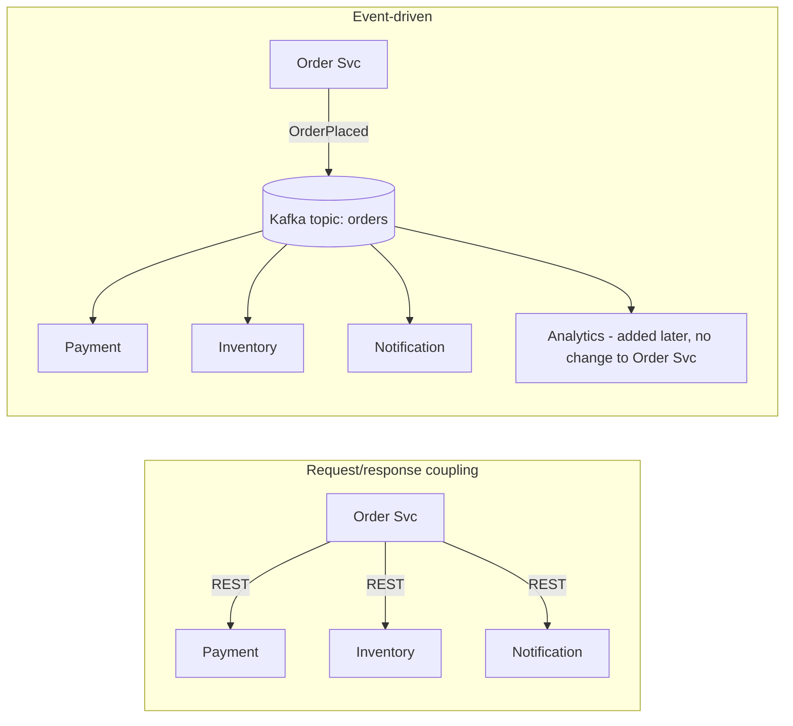
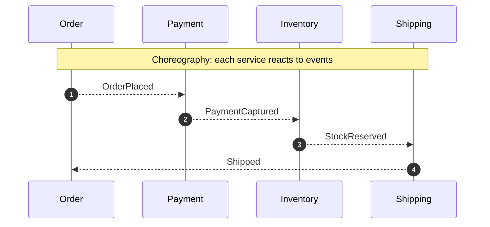
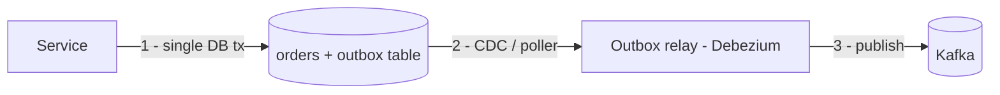

# Event-Driven Architecture Fundamentals

!!! abstract "TL;DR"
    - An **event** is an immutable fact that something *happened* (`OrderPlaced`). A **command** is a request for something to *happen* (`PlaceOrder`) and can be rejected.
    - EDA **decouples producers from consumers in time, space and knowledge**. The producer doesn't know who listens.
    - Two coordination styles: **choreography** (services react to each other's events) and **orchestration** (a coordinator tells services what to do).
    - You get loose coupling, scalability and an audit trail. You pay with **eventual consistency, harder debugging, duplicates and ordering concerns**.
    - Kafka is a **durable, replayable log**, not just a queue. Consumers can rewind, and many independent consumers can read the same events.

## Why it matters

Synchronous REST chains couple availability: if service C is down, A→B→C fails. Each hop adds latency, and every new consumer needs a code change in the caller. Event-driven architecture replaces "call everyone who cares" with "publish what happened, and whoever cares reacts."


*Notice that adding Analytics on the right needs zero changes to the producer. On the left, every new consumer is a code change and a new failure point for Order Svc.*

## Core concepts

### Events, commands and queries

| | Event | Command | Query |
|---|---|---|---|
| Tense | Past: `PaymentCaptured` | Imperative: `CapturePayment` | Question: `GetPayment` |
| Can be rejected? | No, it already happened | Yes | n/a |
| Receivers | 0..N, unknown to the sender | Exactly one handler | One |
| Coupling | Lowest | Sender knows the receiver's intent | Synchronous |

### Event types by payload

- **Event notification:** a thin event (`OrderPlaced{orderId}`). Consumers call back for details, which reintroduces coupling and load on the source.
- **Event-carried state transfer:** a fat event with the data consumers need. Consumers keep local copies, so you get high autonomy at the cost of duplicated data and schema governance.
- **Domain event vs integration event:** domain events stay inside a bounded context. Integration events are a published contract between services and need versioning.

### Pub/sub vs point-to-point (queue)

- **Queue (point-to-point):** each message is processed by one consumer, then removed (RabbitMQ, SQS).
- **Pub/sub log (Kafka):** messages persist for the retention period. Each **consumer group** gets its own copy and its own offset, and within a group partitions are split for parallelism. Kafka gives you **both** semantics: one group behaves like a queue (competing consumers), many groups behave like pub/sub.
- **Caveat on "queue semantics":** in a classic consumer group, parallelism is capped by the partition count (one partition is owned by one consumer in the group), progress is tracked as an offset per partition rather than an ack per message, and one slow or poison record blocks its partition. **Share groups** (KIP-932, "Queues for Kafka": early access in Kafka 4.0, production-ready in 4.2) add true queue behaviour: many consumers on the same partition, per-record acknowledge/release/reject and delivery-attempt limits, at the price of giving up ordering.

### Choreography vs orchestration


*Notice that there's no central brain. That's easy to extend, but the end-to-end flow exists only implicitly, spread across services.*

| | Choreography | Orchestration |
|---|---|---|
| Control | Decentralised | Central orchestrator (Temporal, Camunda, a saga service) |
| Coupling | Lowest | Orchestrator knows all steps |
| Visibility of the flow | Hard: needs tracing | Easy: one place |
| Good for | Simple, few steps, many independent reactors | Long-running, multi-step business processes with compensation |

### Consistency model

EDA is **eventually consistent**. The order shows "placed" before payment is captured. You must design the UI and APIs for intermediate states (`PENDING_PAYMENT`) and handle:

- **Duplicates** (at-least-once delivery): idempotent consumers.
- **Out-of-order events:** keys and partitions, plus version numbers.
- **Dual-write problem:** writing to the DB *and* publishing to Kafka isn't atomic → use the **transactional outbox** or CDC (Debezium).


*Notice that the service writes only to its database. Publishing happens from the committed outbox row, so an event is never lost and never sent for a rolled-back transaction. The relay is **at-least-once** (it can crash after publishing but before recording progress), so consumers must still be idempotent.*

## In practice: code & configuration

=== "❌ Dual write"
    ```java
    @Transactional
    public void placeOrder(Order o) {
        orderRepo.save(o);
        kafkaTemplate.send("orders", o.id(), new OrderPlaced(o)); // may succeed even if the tx rolls back,
    }                                                             // or the tx commits and send fails.
    // send() is also asynchronous: it returns a CompletableFuture (Spring Kafka 3.x+), so a broker
    // failure surfaces later on another thread and never rolls this transaction back.
    ```

=== "✅ Transactional outbox"
    ```java
    @Transactional
    public void placeOrder(Order o) {
        orderRepo.save(o);
        outboxRepo.save(OutboxEvent.of("orders", o.id(), new OrderPlaced(o))); // same DB transaction
    }
    // A relay publishes outbox rows to Kafka:
    //  - polling relay: SELECT unsent rows in order, send, then mark them sent (or delete them)
    //  - Debezium CDC: tails the DB transaction log (no "sent" flag needed, rows can be deleted right away)
    // Either way delivery is at-least-once, so the consumer dedupes on eventId.
    ```

Event envelope worth standardising across services:

```json
{
  "eventId": "6f1c2b0e-...",          // dedupe key
  "eventType": "PrescriptionApproved",
  "eventVersion": 2,                   // schema version
  "occurredAt": "2026-10-02T09:15:00Z",
  "aggregateId": "rx-88123",           // also the Kafka key → ordering per prescription
  "correlationId": "req-7781",         // tracing across services
  "payload": { "...": "..." }
}
```

## Real-world usage

- **LinkedIn** built Kafka for activity-stream data and operational metrics, then open-sourced it. **Netflix** (real-time monitoring and event-processing pipeline), **Uber** (a core part of its infrastructure for online and near-real-time use cases) and **Goldman Sachs** are all listed on Kafka's official "Powered By" page. Quote only what you can back up; don't invent throughput numbers in an interview.
- **Healthcare:** claims, prescription and eligibility status changes are natural events. Downstream systems (notifications, analytics, audit) subscribe without coupling to the core system.
- **Common failure:** "event soup", where hundreds of fine-grained events have no ownership or schema governance and nobody can explain a business flow. Fix it with an event catalogue (AsyncAPI), schema registry and clear topic ownership.

## Trade-offs & production gotchas

| Benefit | Cost |
|---|---|
| Loose coupling, independent deployability | Eventual consistency; UX must handle pending states |
| Easy to add consumers | Harder to trace a business flow → needs correlation IDs + distributed tracing |
| Absorbs load spikes (buffering) | Duplicates and ordering issues → idempotency, keys |
| Replay / audit trail | Schema evolution and versioning discipline |

| Option | Pros | Cons | Use when |
|---|---|---|---|
| Synchronous request/response (REST, gRPC, GraphQL) | Immediate answer, simple to reason about and debug | Availability and latency are coupled across the call chain | The caller needs the result now, or it's a query |
| Queue (SQS, RabbitMQ) | Per-message ack, redelivery and DLQ built in, competing consumers scale freely | No replay once acked, one logical consumer per queue, weaker ordering | Work distribution / task processing where each job is handled once |
| Log (Kafka) | Replay, many independent consumer groups, per-key ordering, high throughput | Partition-bound parallelism, offset management, more to operate | Facts that several teams consume, audit/replay, stream processing |

!!! warning "When *not* to use EDA"
    - The caller needs an immediate answer (e.g. "is this card valid?"), so use request/response.
    - Simple CRUD with one consumer adds a broker for no benefit.
    - Strong cross-service consistency is mandatory and can't be modelled with sagas.

## How this connects to my experience

- **Where I used it:** Publicis Sapient, OptumRx Meteor ("Designed Kafka-based event-driven workflows with retry and DLQ handling"); Deloitte, ConvergeHealth Data Asset Explorer ("Developed event-driven healthcare analytics workflows" on AWS; the resume lists SQS and SNS in that stack, so these were most likely the messaging backbone there rather than Kafka *[confirm]*).
- **Talking points:**
    - Why events over REST for those flows: decoupling and absorbing bursts. The resume's "5 upstream systems" refers to the GraphQL Consumer Service integration layer; whether the Kafka workflows sat on that same path is *[confirm]*.
    - What the retry and DLQ handling looked like (retry topics vs in-place backoff, who owned the DLQ, how replay worked). *[confirm details]*
    - Choreography vs orchestration choice for the main workflows. *[confirm which you used]*
    - How you avoided dual writes (outbox, CDC, or "publish-then-ack" with idempotency). *[confirm]*
- **Likely follow-up chain:** "Why Kafka, not REST?" → "How did you ensure DB and Kafka stayed consistent?" → "How did you debug a flow across services?" → "How did you handle schema changes?"

## Interview questions

### Fundamentals

??? question "Q1. Event vs command vs message?"
    **Answer:** A *message* is the transport envelope. An *event* is an immutable fact in the past tense, broadcast to any number of unknown consumers, and can't be rejected. A *command* is an intent addressed to one handler that may reject it.

    **Interviewer listens for:** Naming in past tense, ownership (the event belongs to the producer, the command to the receiver).

??? question "Q2. What are the benefits and costs of event-driven architecture?"
    **Answer:** Benefits: temporal decoupling, independent scaling, easy fan-out, resilience to downstream outages, replay and audit. Costs: eventual consistency, duplicates and ordering, harder debugging, schema governance, operational overhead of a broker.

    **Interviewer listens for:** That you name the costs unprompted and tie each one to its mitigation (idempotency, partition keys, outbox, tracing, schema registry). A Lead who lists only benefits sounds like they haven't run it in production.

??? question "Q3. How is Kafka different from a traditional message queue?"
    **Answer:** Kafka is a partitioned, replicated, append-only **log**. Messages aren't deleted on consume. They're retained by time or size, and consumers track their own offsets, so many groups can read independently and rewind. Ordering is per partition. Traditional queues (RabbitMQ classic/quorum queues, SQS) delete on acknowledge, do per-message acks and redelivery (and, in RabbitMQ, broker-side routing via exchanges), and can't replay what was already acked. Consequences worth saying out loud: Kafka's parallelism within a group is bounded by partitions, the broker is "dumb" and the consumer is "smart" (it owns its position), and a slow record blocks its partition. The line is blurring from both sides: RabbitMQ Streams are a replayable log, and Kafka share groups (KIP-932, production-ready in Kafka 4.2) give per-record acks and competing consumers on one partition.

    **Interviewer listens for:** Log vs queue, retention independent of consumption, offsets owned by the consumer group, per-partition ordering, replay.

    **Common wrong answer:** "Kafka guarantees global ordering." It's per partition only. Also "Kafka deletes a message once it is consumed."

### Intermediate

??? question "Q4. Choreography vs orchestration: when would you pick each?"
    **Answer:** Choreography for simple flows with few steps and independent reactors, because it keeps coupling minimal. Orchestration for long-running, multi-step processes needing compensation, timeouts and visibility (a payment saga, onboarding). Many systems mix them: orchestrate within a domain, choreograph between domains.

??? question "Q5. What is the dual-write problem and how do you solve it?"
    **Answer:** Writing to a DB and publishing to a broker are two separate systems with no shared transaction, so one can succeed while the other fails, and you get lost or phantom events. Solutions: the **transactional outbox** (write the event to an outbox table in the same DB transaction, then relay via a poller or CDC like Debezium), or **listen-to-yourself** (publish first, update the DB from your own consumer). Kafka transactions don't span your DB, and XA/2PC across a DB and Kafka isn't a real option (Kafka doesn't offer an XA resource, and 2PC hurts availability anyway).

    The outbox gives **at-least-once** publication, not exactly-once: the relay can publish and then crash before recording progress, so consumers dedupe on an event ID. Also mention ordering (the relay must publish rows in commit order per aggregate, with the aggregate ID as the Kafka key) and housekeeping (purge or delete outbox rows so the table doesn't grow forever).

    **Interviewer listens for:** Why `@Transactional` around `kafkaTemplate.send()` doesn't fix it, outbox + CDC, at-least-once + idempotent consumer.

    **Common wrong answer:** "Wrap both in `@Transactional`" or "use Kafka transactions". Spring's Kafka/DB transaction synchronisation is best-effort ordering of two commits, not an atomic commit.

??? question "Q6. Thin events vs fat events?"
    **Answer:** Thin (notification) events are small and avoid stale data, but consumers call back, which adds coupling and load. Fat (event-carried state transfer) events let consumers be autonomous, but the schema is bigger, may carry sensitive data (PHI!) and needs versioning. Choose per use case. In healthcare, minimise PHI in events and use references plus authorised lookups.

??? question "Q6a. Is event-driven architecture the same as event sourcing? Where does CQRS fit?"
    **Answer:** No. **EDA** is about how services *communicate*: they publish facts and others react. **Event sourcing** is about how one service *stores* its state: the append-only event stream is the source of truth and current state is derived by replaying it (plus snapshots). **CQRS** splits the write model from one or more read models, which are often built by consuming events. They combine well but are independent: most event-driven systems store current state in a normal database and publish events via an outbox, with no event sourcing at all. Fowler lists four distinct patterns that all get called "event-driven": event notification, event-carried state transfer, event sourcing and CQRS.

    **Interviewer listens for:** Communication vs persistence. That a Kafka topic with 7-day retention is not an event store, and that event sourcing brings its own costs (schema evolution of stored events forever, snapshots, eventual consistency of read models).

    **Common wrong answer:** "We use Kafka, so we do event sourcing."

### Senior

??? question "Q7. How do you handle eventual consistency in the user experience?"
    **Answer:** Model explicit intermediate states (`PENDING`), return `202 Accepted` with a status resource, push updates (WebSocket/SSE) or poll, read-your-own-writes from the write model, and use compensating actions for failures. Set SLAs for convergence and monitor lag.

??? question "Q8. How do you debug a business flow that spans 6 services via events?"
    **Answer:** A correlation ID in every event header, propagated by OpenTelemetry (trace context in Kafka headers). Centralised logging keyed by correlationId and aggregateId. Consumer lag dashboards. An event catalogue with owners. Optionally a "process view" service that builds a timeline per business entity from the events.

??? question "Q9. How would you version events without breaking consumers?"
    **Answer:** Schema registry with a compatibility mode enforced at registration time. Confluent's default is `BACKWARD`: the new schema can read data written with the previous one, which allows adding optional fields (with defaults) and removing fields, and means you **upgrade consumers first**. `FORWARD` is the mirror image (add fields, remove optional fields, upgrade producers first). `FULL` allows only adding/removing optional fields and lets either side deploy first. The `_TRANSITIVE` variants check against all earlier versions, not just the latest, which matters when you replay old data from the log. In practice: only add optional fields with defaults, never rename a field or change its type, and never reuse a Protobuf field number. A breaking change goes to a new event type or topic (`orders.v2`), with dual-publishing during migration. Include `eventVersion` in the envelope.

    **Interviewer listens for:** Which side deploys first under each mode, and that Kafka's replayability means old events live on, so new consumers must still read old schemas.

??? question "Q10. When is event-driven architecture the wrong choice?"
    **Answer:** When you need synchronous answers, strict cross-service consistency, very simple CRUD, or the team lacks the operational maturity for brokers, tracing and schema governance. Also when ordering and exactly-once requirements are so strict that a single database transaction is simpler.

??? question "Q10a. Events arrive duplicated or out of order. How do you make consumers correct anyway?"
    **Answer:** Assume **at-least-once**: duplicates come from producer retries, outbox relay retries, and consumer rebalances or crashes between processing and offset commit. Make the handler **idempotent**: either naturally (upsert, "set status to X") or with a dedupe table keyed by `eventId`, written in the same DB transaction as the business change. For **ordering**, Kafka only orders within a partition, so key by the aggregate ID so all events for one entity land on one partition. That still isn't enough across topics, after a repartition, or with retry topics, so carry a per-aggregate **version/sequence number** and have the consumer ignore anything older than what it has already applied (or park events that arrive ahead of a gap). On the producer keep `enable.idempotence=true` (the default since Kafka 3.0), which prevents duplicates and reordering caused by producer retries within a partition.

    **Interviewer listens for:** Where duplicates actually come from, dedupe atomically with the side effect, per-key ordering only, version checks for stale events. Bonus: retry topics break ordering, so ordered flows need a different retry strategy.

    **Common wrong answer:** "Kafka's exactly-once handles it." Exactly-once semantics cover Kafka-to-Kafka read-process-write, not side effects in your database or an external API.

### Scenario-based

??? question "Q11. Design notifications for prescription status changes for 750K users."
    **Answer:** The Rx service publishes `PrescriptionStatusChanged` (key = prescriptionId) via outbox. The notification service consumes, dedupes by eventId, looks up member preferences (cached in Redis), applies rate limits and quiet hours, then sends via channel providers with retry and DLQ. Analytics consumes the same topic independently, in its own consumer group.

    Points a Lead should raise: **PHI minimisation** (the event carries IDs and a status code, not drug names; the notification text is generic or built after an authorised lookup). **Ordering** per prescription via the key, plus a version check so a late "Processing" never overwrites "Shipped". **Idempotency** at the send step, because a duplicate SMS is user-visible (dedupe on `eventId` + channel before calling the provider). **Backpressure**: when the SMS provider throttles, pause the consumer or move the record to a delayed retry topic instead of blocking the partition, and don't let one channel's outage hold up the others (a topic or consumer group per channel). **Staleness**: drop or collapse notifications that are obsolete by the time they're retried. **Capacity**: 750K users is a modest event rate, so size partitions for consumer parallelism and future growth rather than raw throughput. **Observability**: consumer lag, DLQ depth and end-to-end delivery latency with alerts.

??? question "Q12. A consumer team asks you to add a field. Another team is still on the old schema. How do you proceed?"
    **Answer:** Add an **optional field with a default**. That change is both backward and forward compatible (`FULL`), so deployment order doesn't matter: old consumers ignore the new field, and new consumers reading old events get the default. Register the schema (CI should run the registry compatibility check before merge), deploy the producer, and let consumers adopt at their own pace. Be precise if pushed: under plain `BACKWARD` the formal rule is consumers first, and it is the optional-with-default shape that makes producer-first safe here. Communicate via the event catalogue. If the change is breaking, create a new version and topic, publish to both for a migration window (ideally both from the same outbox row, so it isn't a dual write), and retire the old topic once consumer-group lag on it shows nobody is reading.

## Cheat sheet

| Concept | Remember |
|---|---|
| Event | Past tense, immutable, 0..N consumers |
| Command | Imperative, one handler, can be rejected |
| Kafka model | Durable log + consumer groups = queue *and* pub/sub |
| Dual write | Outbox / CDC (Debezium); at-least-once, so dedupe on `eventId` |
| EDA vs event sourcing | Communication style vs persistence model |
| Compatibility | `BACKWARD` (Confluent default) → consumers first; `FORWARD` → producers first; `FULL` → either |
| Share groups | KIP-932 queue semantics, production-ready in Kafka 4.2 |
| Choreography | Decoupled, flow is implicit |
| Orchestration | Visible flow, central coordinator |
| Always | Idempotent consumers, keys for ordering, correlation IDs, schema registry |

## Sources

1. [Martin Fowler: What do you mean by "Event-Driven"?](https://martinfowler.com/articles/201701-event-driven.html): event notification, event-carried state transfer, event sourcing.
2. [microservices.io: Transactional outbox](https://microservices.io/patterns/data/transactional-outbox.html): dual-write problem and outbox.
3. [Apache Kafka: Introduction](https://kafka.apache.org/intro): log, consumer groups, retention.
4. [Debezium: Outbox Event Router](https://debezium.io/documentation/reference/stable/transformations/outbox-event-router.html): CDC-based outbox relay.
5. [Confluent: Event-driven architecture patterns](https://developer.confluent.io/patterns/): event types and stream patterns.
6. [Confluent Schema Registry: Schema evolution and compatibility](https://docs.confluent.io/platform/current/schema-registry/fundamentals/schema-evolution.html): default `BACKWARD`, allowed changes and upgrade order per mode.
7. [Apache Kafka 4.2.0 release announcement](https://kafka.apache.org/blog/2026/02/17/apache-kafka-4.2.0-release-announcement/): share groups (KIP-932, Queues for Kafka) production-ready.
8. [Apache Kafka: Powered By](https://kafka.apache.org/powered-by): LinkedIn, Netflix, Uber, Goldman Sachs usage.
