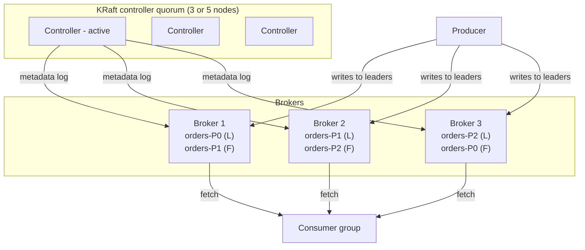
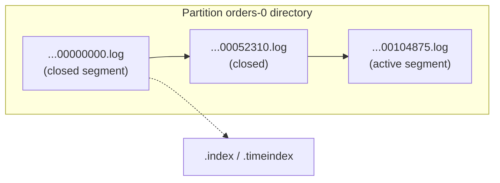
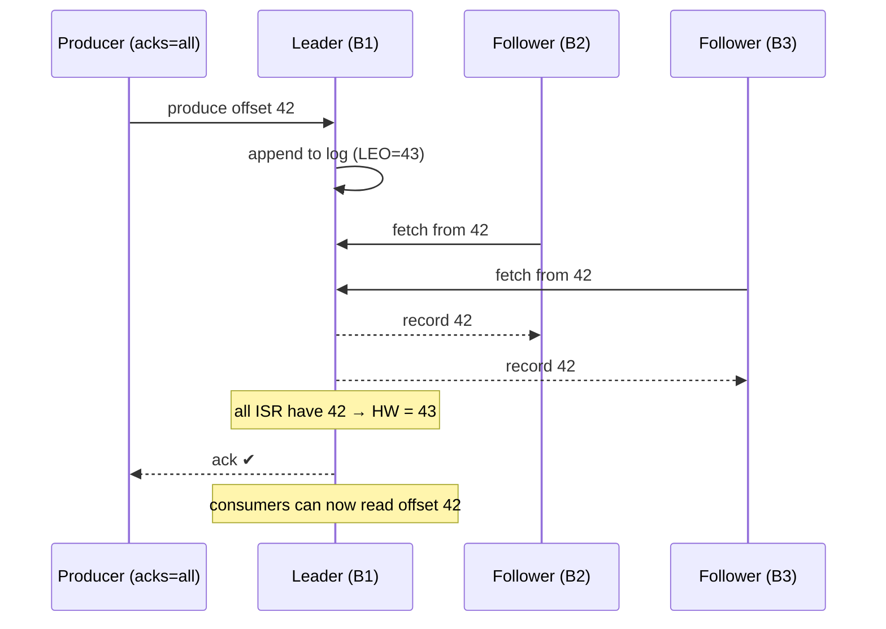

# Kafka Architecture: Brokers, Topics, Partitions, Replication & KRaft

!!! abstract "Key takeaways"
    - A **topic** is split into **partitions**. Each partition is an ordered, append-only log stored as **segment files** on a broker's disk.
    - Each partition has one **leader** and N−1 **followers**. Producers and consumers talk to the leader (consumers *can* read from followers with rack-aware fetching).
    - **ISR** (in-sync replicas) = replicas caught up with the leader. With `acks=all`, a write is committed when all ISR members have it, and `min.insync.replicas` sets the minimum ISR size required to accept writes.
    - Consumers only see records up to the **high watermark** (the last offset replicated to all ISR).
    - **Kafka 4.0 is KRaft-only**: ZooKeeper is gone, and cluster metadata lives in an internal Raft-replicated log managed by **controller** nodes.

## Why it matters

Almost every Kafka interview question (ordering, durability, throughput, data loss, rebalancing) comes back to this model. If you can draw it, you can reason about any scenario.

## Core concepts

### Cluster anatomy


*Notice that leadership is spread across brokers, so load is balanced. Controllers manage metadata (who leads which partition) but don't serve data.*

{ loading=lazy }
*Watch who picks the new leader: the controller, and only from the ISR. Each partition is left with two in-sync replicas, so `min.insync.replicas=2` still accepts `acks=all` writes.*

| Term | Meaning |
|---|---|
| **Broker** | A server storing partitions and serving reads and writes |
| **Topic** | A logical stream name, e.g. `orders` |
| **Partition** | The unit of parallelism and ordering. Records get monotonically increasing **offsets** |
| **Replica** | A copy of a partition on another broker (`replication.factor`, typically 3) |
| **Leader / follower** | The leader handles requests. Followers fetch from it to stay in sync |
| **Controller** | Manages cluster metadata, leader election and partition assignment (KRaft) |

### Partitions: the unit of scale *and* ordering

- Ordering is guaranteed **only within a partition**.
- Max consumer parallelism in a (classic) consumer group = **number of partitions**. Extra consumers sit idle. (Share groups, KIP-932 "Queues for Kafka" in the 4.x line, relax this by letting several consumers share a partition, at the cost of ordering.)
- Records with the same **key** hash to the same partition (default: murmur2 hash of the serialized key, mod partition count). That's how you get per-entity ordering. Records with a **null key** are spread across partitions by the sticky partitioner (one partition per batch), so they have no per-entity ordering.
- **Adding partitions later changes key→partition mapping** and breaks ordering for existing keys. Plan partition counts up front.

### Storage: log segments


*Notice that writes only append to the active segment. Each file is named after the base offset of its first record (zero-padded to 20 digits, shortened here). Retention deletes whole closed segments and compaction rewrites closed segments only; the active segment is never touched, which keeps disk I/O sequential and fast.*

{ loading=lazy }
*Notice the unit of deletion: a whole closed segment, never single records and never the active segment.*

- Sequential appends + OS page cache + **zero-copy** (`sendfile`) to consumers explain Kafka's throughput.
- A segment rolls when it reaches `segment.bytes` (default 1 GB) or `segment.ms` (default 7 days). Because only closed segments are eligible for deletion, a low-traffic topic can keep data well past `retention.ms`.
- **Retention:** `cleanup.policy=delete` by time (`retention.ms`, default 7 days) or size (`retention.bytes`, default -1 = unlimited, **per partition**); `cleanup.policy=compact` keeps the **latest value per key** (changelog topics, `__consumer_offsets`).
- A record with a key and a null value is a **tombstone**. In compacted topics it deletes the key; the tombstone itself is kept for `delete.retention.ms` (default 24h) so consumers can observe the delete, then it is removed too.

### Replication, ISR and the high watermark


*Notice that the producer is acknowledged only after every ISR member has the record. Consumers can't see it until the high watermark moves past it.*

{ loading=lazy }
*Watch the high watermark: it follows the slowest in-sync follower, not the leader. Offsets to its right exist on the leader but aren't committed yet.*

- **LEO (log end offset):** the next offset to write on that replica.
- **HW (high watermark):** the minimum LEO across the ISR. Records below the HW are **committed** and visible to consumers.
- **Leader epoch:** a counter bumped on every leader change and stored with each batch. A restarting follower asks the leader for the end offset of its last epoch and truncates to that (KIP-101), rather than blindly truncating to its own HW, which could lose or diverge data.
- A follower falls out of the ISR if it hasn't fetched, or hasn't caught up to the leader's log end, within `replica.lag.time.max.ms` (default 30s). The criterion is time-based, not a message-count lag.
- **`min.insync.replicas`** (topic or broker, default 1): with `acks=all`, if ISR size drops below it, producers get `NotEnoughReplicasException` (or `NotEnoughReplicasAfterAppendException` if the ISR shrank after the leader appended). Both are retriable. It has no effect with `acks=1` or `acks=0`. That's a deliberate *availability-for-durability* trade.
- **Common production setting:** `replication.factor=3`, `min.insync.replicas=2`, `acks=all`. This tolerates one broker down with no data loss and no write outage. (Since Kafka 3.0 the producer defaults are already `acks=all` and `enable.idempotence=true`; the broker default `min.insync.replicas=1` is the one you must change.)
- **Unclean leader election** (`unclean.leader.election.enable`, default false): if every ISR member is lost, you either wait for one to return (consistency) or elect an out-of-sync replica (availability, **data loss**).

### KRaft (Kafka without ZooKeeper)

- Metadata (topics, partitions, ISR, configs, ACLs) is stored in the `__cluster_metadata` topic, replicated by **Raft** among controller nodes. Brokers replicate the metadata log and cache it.
- Benefits over ZooKeeper: one system to operate, much faster controller failover (a standby controller already has the metadata log in memory instead of reloading everything from ZooKeeper), and a design target of **millions of partitions** per cluster.
- The controller quorum needs a **majority** alive: 3 controllers tolerate 1 failure, 5 tolerate 2. Brokers send heartbeats to the active controller and are fenced if none arrives within `broker.session.timeout.ms` (default 9s).
- **Kafka 4.0 removed ZooKeeper mode entirely.** ZooKeeper-based clusters must first migrate to KRaft on a 3.x bridge release (3.9 is the last one) before upgrading to 4.x.
- Deployment modes: dedicated controllers (recommended for production) or combined broker+controller nodes (dev/small).

### Internal topics

| Topic | Purpose |
|---|---|
| `__consumer_offsets` | Committed offsets per group/partition (compacted) |
| `__transaction_state` | Transaction coordinator state |
| `__cluster_metadata` | KRaft metadata log (single partition, not a regular client-readable topic) |
| `__share_group_state` | Share-group state (KIP-932, 4.x) |

## In practice: code & configuration

```bash
# Create a production-grade topic
kafka-topics.sh --bootstrap-server broker:9092 --create \
  --topic prescriptions.status.v1 \
  --partitions 12 --replication-factor 3 \
  --config min.insync.replicas=2 \
  --config retention.ms=604800000

# Inspect leaders, replicas and ISR
kafka-topics.sh --bootstrap-server broker:9092 --describe --topic prescriptions.status.v1
# Topic: prescriptions.status.v1 Partition: 0 Leader: 2 Replicas: 2,3,1 Isr: 2,3,1

# Find under-replicated partitions (an early warning sign)
kafka-topics.sh --bootstrap-server broker:9092 --describe --under-replicated-partitions
```

A durability mistake that shows up in interviews and in production:

=== "❌ Common mistake"
    ```bash
    # RF=3 looks safe, but min.insync.replicas is left at the broker default (1).
    # With acks=all the leader may be the only ISR member when it acks, so
    # losing that one broker loses acknowledged records.
    kafka-topics.sh --bootstrap-server broker:9092 --create \
      --topic prescriptions.status.v1 \
      --partitions 12 --replication-factor 3
    ```

=== "✅ Correct approach"
    ```bash
    # Topic: every acknowledged write is on at least 2 brokers
    kafka-topics.sh --bootstrap-server broker:9092 --create \
      --topic prescriptions.status.v1 \
      --partitions 12 --replication-factor 3 \
      --config min.insync.replicas=2

    # Producer (defaults since Kafka 3.0, set explicitly so intent is visible):
    #   acks=all
    #   enable.idempotence=true
    # Broker / topic: unclean.leader.election.enable=false (default)
    ```

Topics as code with Spring (dev/test). In production, prefer IaC (Terraform provider, Strimzi `KafkaTopic` CRDs):

```java
// Spring Boot's auto-configured KafkaAdmin creates NewTopic beans at startup.
// It can add partitions to an existing topic but never reduces them or changes RF.
@Bean
NewTopic prescriptionStatus() {
    return TopicBuilder.name("prescriptions.status.v1")
            .partitions(12)
            .replicas(3)
            .config(TopicConfig.MIN_IN_SYNC_REPLICAS_CONFIG, "2")
            .build();
}
```

### Choosing a partition count

Rough method: `partitions ≥ max(target throughput / per-partition producer throughput, target throughput / per-partition consumer throughput)`, then add headroom for growth, since you can't easily repartition keyed topics. Too many partitions means more open files, more replication fetch overhead, slower recovery after a broker failure and more memory per client. You can increase a topic's partition count but **never decrease it**. Typical services land somewhere between 6 and 50 per topic.

## Real-world usage

- **LinkedIn** (where Kafka originated) has publicly reported trillions of messages per day across many clusters. Metadata scalability at very high partition counts was one of the stated motivations for KIP-500 (KRaft).
- **Rack awareness** (`broker.rack`) spreads replicas across availability zones. On AWS (MSK) with a 3-AZ cluster and RF=3, each partition has a replica in every AZ, so losing an AZ loses no committed data.
- **Follower fetching** (KIP-392; consumer `client.rack` plus broker `replica.selector.class=org.apache.kafka.common.replica.RackAwareReplicaSelector`) lets consumers read from a replica in their own AZ, cutting cross-AZ data transfer costs.

## Trade-offs & production gotchas

| Setting | Safer | Faster / more available |
|---|---|---|
| `acks` | `all` | `1` / `0` |
| `min.insync.replicas` | 2 (with RF=3) | 1 |
| Unclean leader election | false | true (risk of data loss) |
| Partitions | Fewer, planned | Many (more parallelism, more overhead) |

!!! warning "Gotchas"
    - **RF=3 with `min.insync.replicas=3`** means any single broker outage blocks writes.
    - **`acks=all` with `min.insync.replicas=1`** can still lose data: if the ISR shrinks to just the leader and it dies, nothing else had the record.
    - **Adding partitions** to a keyed topic reshuffles keys and breaks per-key ordering during the transition.
    - **Under-replicated partitions** (`UnderReplicatedPartitions`) are the #1 health metric to alert on, together with `UnderMinIsrPartitionCount`, `OfflinePartitionsCount` and `ActiveControllerCount` (must be exactly 1).
    - **`min.insync.replicas` does nothing unless the producer uses `acks=all`.** It is checked only for `acks=all` produce requests.
    - **Retention is per partition and per segment.** `retention.bytes` applies to each partition, and the active segment is never deleted.

## How this connects to my experience

- **Where I used it:** Kafka at Publicis Sapient on OptumRx Meteor: "Designed Kafka-based event-driven workflows with retry and DLQ handling" and microservices built with Java, Spring Boot, Kafka, MongoDB, Redis and GraphQL. At Deloitte (ConvergeHealth Data Asset Explorer) the event-driven workflows ran on AWS SQS/SNS, not Kafka, which is a useful contrast (queue/pub-sub with no replayable partitioned log) rather than Kafka experience.
- **Talking points:**
    - Topic design: partition count, replication factor, retention per topic. *[confirm actual values / whether self-managed, MSK or Confluent Cloud]*
    - Keyed by business ID (member/prescription) for per-entity ordering. *[confirm]*
    - Retry and DLQ topics for the event-driven workflows (resume-stated); how partition counts and retention of retry/DLQ topics relate to the main topic. *[confirm topic layout]*
    - Durability settings chosen for healthcare data (no loss): `acks=all`, RF 3, min ISR 2. *[confirm]*
- **Likely follow-up chain:** "How many partitions and why?" → "What happens if a broker dies?" → "Could you lose data with your settings?" → "ZooKeeper vs KRaft?" Answer each from the model: partition count from throughput and consumer parallelism; leader failover from the ISR; data loss only if `acks`/min ISR/unclean election are misconfigured; KRaft as the only mode in 4.0. If the cluster was run by a platform team, say so and describe what you owned (topic design, producer/consumer configuration). *[confirm]*

## Interview questions

### Fundamentals

??? question "Q1. What is a partition and why does Kafka use them?"
    **Answer:** A partition is an ordered, append-only log that is a shard of a topic. Partitions let a topic scale beyond one broker (storage and throughput) and let consumers parallelise (one partition per consumer in a group). Ordering is guaranteed within a partition only.

    **Interviewer listens for:** unit of ordering, unit of parallelism and unit of replication, all three.

    **Common wrong answer:** "Kafka guarantees ordering per topic." It doesn't, unless the topic has one partition.

??? question "Q2. Explain leader, follower and ISR."
    **Answer:** Each partition has one leader replica handling reads and writes. Followers fetch from the leader. The ISR is the set of replicas fully caught up (within `replica.lag.time.max.ms`). Only ISR members are eligible to become leader under clean election, which guarantees no committed data is lost.

    **Interviewer listens for:** ISR is dynamic and time-based (not "N messages behind"), the leader itself is in the ISR, and ISR membership is what makes clean election safe.

    **Common wrong answer:** "ISR means all replicas" or "a majority quorum". Kafka's data replication is not majority-based; a write is committed when *all current ISR members* have it.

??? question "Q3. What is the high watermark?"
    **Answer:** The offset up to which all ISR replicas have replicated. Records below it are committed, and consumers (with default isolation) can only read up to it. It prevents consumers from seeing data that could disappear if the leader fails. With `isolation.level=read_committed`, consumers are further limited to the **last stable offset (LSO)**, the offset of the first still-open transaction, which is ≤ HW.

    **Interviewer listens for:** HW vs LEO, HW = min LEO across ISR, and that followers learn the HW from the leader in fetch responses (so theirs lags slightly).

    **Common wrong answer:** confusing the high watermark with the consumer's committed offset.

??? question "Q4. What is a compacted topic?"
    **Answer:** `cleanup.policy=compact` keeps at least the latest record per key, and older values are removed in the background. Use it for changelogs, current state (e.g. member preferences) and `__consumer_offsets`. A null value (tombstone) marks the key as deleted; the tombstone is itself removed `delete.retention.ms` (default 24h) after it has been compacted. Compaction never touches the active segment and only runs once the dirty ratio passes `min.cleanable.dirty.ratio` (default 0.5), so a consumer can still see several values for a key. Offsets are preserved (gaps appear), and order within the partition is unchanged.

    **Interviewer listens for:** "at least the latest value", not "exactly one value"; tombstones; the active segment is not compacted; `compact,delete` can be combined.

    **Common wrong answer:** "Compaction guarantees one record per key" or "compaction happens immediately".

### Intermediate

??? question "Q5. With RF=3, how do you avoid data loss and keep availability?"
    **Answer:** `acks=all` + `min.insync.replicas=2` + `unclean.leader.election.enable=false`, with replicas spread across racks/AZs. One broker can fail and writes continue (ISR=2). Two failures block writes rather than lose data. Add `enable.idempotence=true` so retries don't duplicate or reorder. Residual risk: all in-sync replicas failing at once before data is flushed (Kafka relies on replication, not fsync per write), which is why replicas go in different AZs.

    **Interviewer listens for:** all three settings together and the reasoning for min ISR = RF − 1.

    **Common wrong answer:** "`acks=all` alone means no data loss" (with min ISR 1 it does not), or setting min ISR = RF (any broker restart blocks writes).

??? question "Q6. Why can't you just add partitions to fix lag on a keyed topic?"
    **Answer:** Partition = hash(key) % numPartitions, so changing the count remaps keys. New events for a key may land on a different partition than older unprocessed ones, which breaks ordering. Also, more partitions only help if consumers scale too. Alternatives: optimise consumers, add consumers up to the partition count, or create a new topic with more partitions and migrate. Note that partitions can be increased but never decreased, and that existing data is not moved when partitions are added.

    **Interviewer listens for:** key remapping, ordering impact, and diagnosing *why* there is lag (slow processing, downstream calls, poison messages) before scaling.

    **Common wrong answer:** "Just add partitions and consumers", without mentioning key→partition remapping.

??? question "Q7. What changed with KRaft and Kafka 4.0?"
    **Answer:** Metadata moved from ZooKeeper to a Raft-replicated internal log managed by Kafka controllers. That's one system to run, faster failover and recovery, and much higher partition limits. Kafka 4.0 removed ZooKeeper support entirely (ZooKeeper clusters migrate on 3.9 first), and the new broker-driven consumer rebalance protocol (KIP-848, `group.protocol=consumer`) went GA in 4.0. 4.0 also requires Java 17 for brokers and Java 11 for clients, and ships early-access share groups (KIP-932).

    **Interviewer listens for:** the single active controller is the Raft leader of `__cluster_metadata`; standby controllers are hot, so failover doesn't need a full metadata reload; brokers pull metadata as a log instead of receiving RPC pushes.

    **Common wrong answer:** "KRaft replaces ISR replication with Raft." Raft is used only for the metadata log; partition data still uses leader/follower ISR replication.

??? question "Q8. Why is Kafka so fast?"
    **Answer:** Sequential disk appends, the OS page cache instead of a JVM heap cache, zero-copy transfer to consumers, batching and compression end-to-end, partitioned parallelism, and a simple broker (consumers track their own position and pull at their own pace).

    **Interviewer listens for:** sequential I/O + page cache + zero-copy + batching, and the caveat that zero-copy is lost with TLS (data must pass through user space to be encrypted).

    **Common wrong answer:** "Because it keeps everything in memory."

??? question "Q8a. How do `replication.factor`, the ISR, `min.insync.replicas` and `acks` relate?"
    **Answer:** `replication.factor` is how many copies exist. The **ISR** is the subset currently caught up (it shrinks and grows at runtime). `acks` is a *producer* setting: `0` = don't wait, `1` = leader has appended, `all` = every current ISR member has it. `min.insync.replicas` is a *topic/broker* setting that says how small the ISR may get before `acks=all` writes are rejected. So `acks=all` means "all in-sync replicas", not "all replicas": with RF=3 and the ISR shrunk to just the leader, `acks=all` is satisfied by one copy unless min ISR ≥ 2 forbids it.

    **Interviewer listens for:** which setting lives where (producer vs topic), that `acks=all` is relative to the *current* ISR, and that min ISR is ignored for `acks=0/1`.

    **Common wrong answer:** "`acks=all` waits for all 3 replicas" or "`min.insync.replicas=2` means the producer waits for 2 acks".

### Senior

??? question "Q10. A broker holding a partition leader crashes. Walk through what happens."
    **Answer:** The active controller detects the failure (in KRaft, missed broker heartbeats beyond `broker.session.timeout.ms`, default 9s; a clean shutdown is faster because the broker asks for controlled shutdown). It fences the broker, picks a new leader from the ISR for each affected partition, bumps the **leader epoch**, and writes the change to the metadata log, which brokers replicate. Clients get `NOT_LEADER_OR_FOLLOWER` errors, refresh metadata and retry against the new leader. With `acks=all` and `min.insync.replicas` satisfied, no committed data is lost; records the old leader had appended but not yet replicated were never acknowledged, so the producer retries them (idempotence prevents duplicates). When the old broker returns, it uses the leader epoch to truncate any divergent tail (KIP-101, not a blind truncate-to-HW), catches up as a follower, rejoins the ISR, and preferred-leader election (`auto.leader.rebalance.enable=true` by default) moves leadership back.

    **Interviewer listens for:** detection → election from ISR → metadata propagation → client retry → rejoin with epoch-based truncation, plus what happens to unacknowledged writes.

    **Common wrong answer:** "Consumers rebalance." A broker failure changes partition leadership, not group membership (unless the failed broker was the group coordinator, in which case clients just find the new coordinator).

??? question "Q11. How would you size a cluster and partitions for 50K msgs/s of 2KB?"
    **Answer:** That's ~100 MB/s ingress, and RF=3 means ~300 MB/s written across the cluster, plus consumer egress × number of groups. Measure per-partition throughput (often ~10 MB/s producer-side, consumer-dependent) to get ~12–24 partitions with headroom. Size brokers by disk throughput, network and retention (100 MB/s × 7 days × 3 ≈ 180 TB). Spread across 3 AZs. Validate with load tests (`kafka-producer-perf-test.sh`). Compression typically cuts the disk and network numbers substantially, and tiered storage (KIP-405) can move older segments to object storage. Keep disk and network utilisation low enough that the cluster still copes with one broker (or one AZ) down.

    **Interviewer listens for:** a method (throughput → bytes → replication → retention → headroom), not a magic number; N+1 capacity planning.

    **Common wrong answer:** quoting a partition count without stating assumptions about message size, retention or consumer speed.

??? question "Q12. When would you consider follower fetching?"
    **Answer:** Multi-AZ clusters where consumers in each AZ read from a local replica (set `client.rack` and a rack-aware replica selector on brokers). It cuts cross-AZ cost and latency. The broker setting is `replica.selector.class=org.apache.kafka.common.replica.RackAwareReplicaSelector`, with `broker.rack` set on every broker. The trade-off is slightly higher end-to-end latency: a follower only serves up to its own high watermark, which trails the leader's. Producers still always write to the leader.

    **Interviewer listens for:** both the client and the broker side of the configuration, and that consistency is preserved because followers serve only committed data.

    **Common wrong answer:** "Followers can serve stale or uncommitted data" or "producers can write to followers".

??? question "Q11a. What is the leader epoch and why isn't the high watermark enough for follower truncation?"
    **Answer:** The HW is propagated to followers asynchronously (in the *next* fetch response), so a follower's HW can lag the true HW. If a follower restarted and truncated to its own stale HW, then became leader before re-fetching, it would have thrown away a committed record: data loss, or logs that diverge between replicas. KIP-101 fixed this with the **leader epoch**: a monotonically increasing number bumped on each leader change and stored in every record batch, plus a per-replica epoch → start-offset checkpoint. On becoming a follower, a replica asks the leader for the end offset of its last known epoch (`OffsetsForLeaderEpoch`) and truncates only what actually diverges. Epochs also let brokers and clients fence stale leaders (`FENCED_LEADER_EPOCH`).

    **Interviewer listens for:** HW propagation is asynchronous, the specific failure it caused, and epoch-based truncation and fencing.

    **Common wrong answer:** "A returning replica truncates to its high watermark" (pre-0.11 behaviour).

??? question "Q14. How do you secure a Kafka cluster that carries PHI?"
    **Answer:** In layers:

    1. **Encryption in transit:** TLS on every listener (client-broker and broker-broker); no `PLAINTEXT` listeners.
    2. **Authentication:** mTLS client certificates, `SASL/SCRAM`, or `SASL/OAUTHBEARER` with your IdP. On AWS MSK, IAM authentication.
    3. **Authorisation:** ACLs (or Confluent RBAC) per service principal, least privilege: a producer gets `WRITE` on its own topics, a consumer gets `READ` on its topics and its consumer group. Deny by default (`allow.everyone.if.no.acl.found=false`).
    4. **Encryption at rest:** encrypted broker volumes (KMS on MSK or EBS). For the most sensitive fields, **field-level encryption** in the producer, so PHI stays encrypted in the log, in DLQs and in replays, and only authorised consumers hold the key.
    5. **Data minimisation:** put ids and references in events, not full clinical records. Remember that retention and compaction decide how long PHI lives in the log.
    6. **Audit and operations:** broker audit logs, Schema Registry and Connect secured too, secrets in a manager, and no payload logging in consumers or DLQ tooling.

    **Interviewer listens for:** TLS everywhere, an authentication mechanism, per-principal ACLs with deny-by-default, at-rest and field-level encryption, minimisation and retention, the surrounding components.

    **Common wrong answer:** "The cluster is in a private VPC, so it is secure." Network isolation does not stop a compromised service from reading every topic.

### Scenario-based

??? question "Q15. Producers see NotEnoughReplicasException. What's going on and what do you do?"
    **Answer:** The ISR for a partition is below `min.insync.replicas`, because brokers are down or followers are lagging (disk, network, GC). Check under-replicated partitions, broker health and replica fetcher lag. Restore brokers or capacity. Don't lower `min.insync.replicas` as a quick fix on critical data. That trades away the durability guarantee. Producers should retry with backoff (the error is retriable, bounded by `delivery.timeout.ms`, default 2 minutes), and idempotence avoids duplicates. Note that consumers are unaffected: already-committed data stays readable while writes are rejected.

    **Interviewer listens for:** correct diagnosis (ISR < min ISR with `acks=all`), the metrics to check (`UnderMinIsrPartitionCount`, ISR shrink rate), and refusing the "lower min ISR" shortcut.

    **Common wrong answer:** "Increase producer retries" or "set `acks=1`" as the fix.

??? question "Q16. The KRaft controller quorum loses its majority (2 of 3 controllers down). What still works?"
    **Answer:** The data plane mostly keeps running: existing partition leaders keep serving produce and fetch requests, because brokers work from their cached metadata. The control plane stops: no metadata changes can be committed, so no leader elections, no ISR changes, no topic or partition creation, no config or ACL changes, and no new broker registrations. That means a broker failure during this window leaves its partitions leaderless until the quorum is back, and ISR shrinks cannot be recorded, which can stall `acks=all` writes waiting on a dead follower. Fix by restoring controllers to regain a majority. Prevention: 3 or 5 dedicated controllers spread across AZs, never an even number, and monitor `ActiveControllerCount`.

    **Interviewer listens for:** control plane vs data plane separation, Raft majority maths, and the knock-on effect on ISR changes.

    **Common wrong answer:** "The whole cluster goes down immediately."

## Cheat sheet

| Concept | Remember |
|---|---|
| Ordering | Per partition only |
| Parallelism | ≤ partitions per consumer group |
| Durable setup | RF=3, `acks=all`, min ISR=2, no unclean election |
| HW | Consumers read only committed (replicated) data |
| Default retention | 7 days (`retention.ms=604800000`); segment roll at 1 GB or 7 days |
| Compaction | At least the latest value per key; tombstone = null value, kept `delete.retention.ms` (24h) |
| `acks=all` | All *current ISR* members, not all replicas; `min.insync.replicas` (default 1) sets the floor |
| ISR eviction | `replica.lag.time.max.ms` = 30s, time-based |
| Follower truncation | By leader epoch (KIP-101), not HW |
| KRaft quorum | Majority needed: 3 tolerates 1, 5 tolerates 2; metadata in `__cluster_metadata` |
| Kafka 4.0 | KRaft only (migrate from ZooKeeper on 3.9 first); KIP-848 consumer protocol GA; Java 17 brokers / Java 11 clients |
| Health metric #1 | Under-replicated partitions (then under-min-ISR, offline partitions, active controller count = 1) |

## Sources

1. [Apache Kafka documentation: Design](https://kafka.apache.org/documentation/#design): persistence, replication, ISR, log compaction.
2. [Apache Kafka 4.0 upgrade notes](https://kafka.apache.org/40/getting-started/upgrade/): ZooKeeper removal, KIP-848 GA, Java requirements.
3. [KIP-500: Replace ZooKeeper with a Self-Managed Metadata Quorum](https://cwiki.apache.org/confluence/display/KAFKA/KIP-500%3A+Replace+ZooKeeper+with+a+Self-Managed+Metadata+Quorum): KRaft design.
4. [KIP-392: Allow consumers to fetch from closest replica](https://cwiki.apache.org/confluence/display/KAFKA/KIP-392%3A+Allow+consumers+to+fetch+from+closest+replica): follower fetching.
5. [Confluent: Kafka Replication](https://docs.confluent.io/kafka/design/replication.html): ISR, high watermark, min.insync.replicas.
6. [KIP-101: Alter Replication Protocol to use Leader Epoch rather than High Watermark for Truncation](https://cwiki.apache.org/confluence/display/KAFKA/KIP-101+-+Alter+Replication+Protocol+to+use+Leader+Epoch+rather+than+High+Watermark+for+Truncation): leader epoch and follower truncation.
7. [Apache Kafka documentation: Configuration](https://kafka.apache.org/documentation/#configuration): defaults for `min.insync.replicas`, `replica.lag.time.max.ms`, `retention.ms`, `segment.bytes`, `delete.retention.ms`, `broker.session.timeout.ms`.
