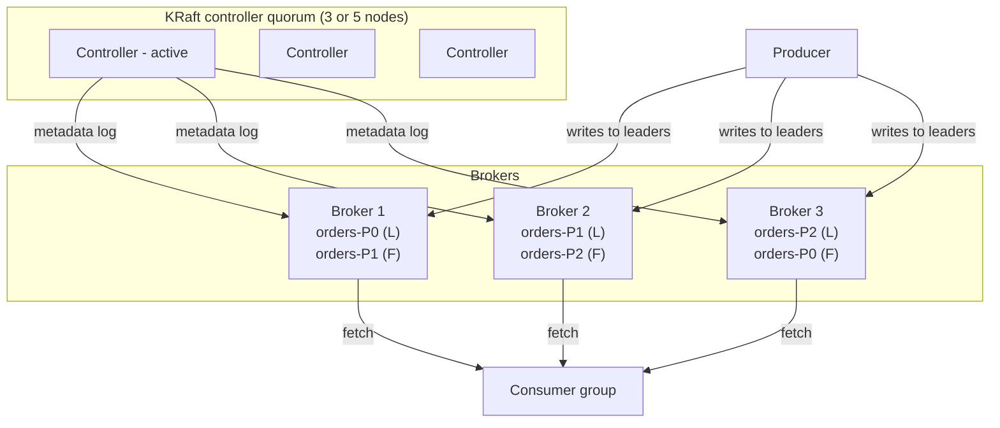
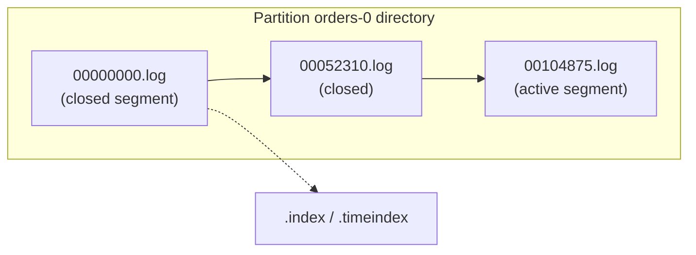
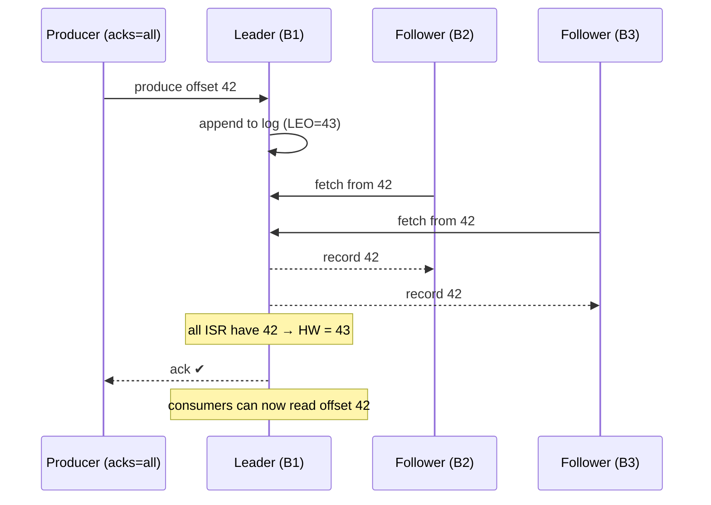

# Kafka Architecture: Brokers, Topics, Partitions, Replication & KRaft

!!! abstract "TL;DR"
    - A **topic** is split into **partitions**. Each partition is an ordered, append-only log stored as **segment files** on a broker's disk.
    - Each partition has one **leader** and N−1 **followers**. Producers and consumers talk to the leader (consumers *can* read from followers with rack-aware fetching).
    - **ISR** (in-sync replicas) = replicas caught up with the leader. With `acks=all`, a write is committed when all ISR members have it, and `min.insync.replicas` sets the minimum ISR size required to accept writes.
    - Consumers only see records up to the **high watermark** (the last offset replicated to all ISR).
    - **Kafka 4.0 is KRaft-only**: ZooKeeper is gone, and cluster metadata lives in an internal Raft-replicated log managed by **controller** nodes.

## Why it matters

Almost every Kafka interview question (ordering, durability, throughput, data loss, rebalancing) comes back to this model. If you can draw it, you can reason about any scenario.

## Core concepts

### Cluster anatomy


*Notice that leadership is spread across brokers, so load is balanced. Controllers manage metadata (who leads which partition) but don't serve data.*

| Term | Meaning |
|---|---|
| **Broker** | A server storing partitions and serving reads and writes |
| **Topic** | A logical stream name, e.g. `orders` |
| **Partition** | The unit of parallelism and ordering. Records get monotonically increasing **offsets** |
| **Replica** | A copy of a partition on another broker (`replication.factor`, typically 3) |
| **Leader / follower** | The leader handles requests. Followers fetch from it to stay in sync |
| **Controller** | Manages cluster metadata, leader election and partition assignment (KRaft) |

### Partitions: the unit of scale *and* ordering

- Ordering is guaranteed **only within a partition**.
- Max consumer parallelism in a group = **number of partitions**. Extra consumers sit idle.
- Records with the same **key** hash to the same partition (default murmur2 hash mod partition count). That's how you get per-entity ordering.
- **Adding partitions later changes key→partition mapping** and breaks ordering for existing keys. Plan partition counts up front.

### Storage: log segments


*Notice that writes only append to the active segment. Retention deletes or compacts whole closed segments, which keeps disk I/O sequential and fast.*

- Sequential appends + OS page cache + **zero-copy** (`sendfile`) to consumers explain Kafka's throughput.
- **Retention:** `cleanup.policy=delete` by time (`retention.ms`, default 7 days) or size; `cleanup.policy=compact` keeps the **latest value per key** (changelog topics, `__consumer_offsets`).
- A record with a key and a null value is a **tombstone**. In compacted topics it deletes the key.

### Replication, ISR and the high watermark


*Notice that the producer is acknowledged only after every ISR member has the record. Consumers can't see it until the high watermark moves past it.*

- **LEO (log end offset):** the next offset to write on that replica.
- **HW (high watermark):** the minimum LEO across the ISR. Records below the HW are **committed** and visible to consumers.
- A follower falls out of the ISR if it doesn't catch up within `replica.lag.time.max.ms` (default 30s).
- **`min.insync.replicas`** (topic or broker, default 1): with `acks=all`, if ISR size drops below it, producers get `NotEnoughReplicasException`. That's a deliberate *availability-for-durability* trade.
- **Common production setting:** `replication.factor=3`, `min.insync.replicas=2`, `acks=all`. This tolerates one broker down with no data loss and no write outage.
- **Unclean leader election** (`unclean.leader.election.enable`, default false): if every ISR member is lost, you either wait for one to return (consistency) or elect an out-of-sync replica (availability, **data loss**).

### KRaft (Kafka without ZooKeeper)

- Metadata (topics, partitions, ISR, configs, ACLs) is stored in the `__cluster_metadata` topic, replicated by **Raft** among controller nodes. Brokers replicate the metadata log and cache it.
- Benefits over ZooKeeper: one system to operate, much faster controller failover, and support for **millions of partitions**.
- **Kafka 4.0 removed ZooKeeper mode entirely.** Older clusters must migrate (via 3.x bridge releases) before upgrading.
- Deployment modes: dedicated controllers (recommended for production) or combined broker+controller nodes (dev/small).

### Internal topics

| Topic | Purpose |
|---|---|
| `__consumer_offsets` | Committed offsets per group/partition (compacted) |
| `__transaction_state` | Transaction coordinator state |
| `__cluster_metadata` | KRaft metadata log |

## In practice: code & configuration

```bash
# Create a production-grade topic
kafka-topics.sh --bootstrap-server broker:9092 --create \
  --topic prescriptions.status.v1 \
  --partitions 12 --replication-factor 3 \
  --config min.insync.replicas=2 \
  --config retention.ms=604800000

# Inspect leaders, replicas and ISR
kafka-topics.sh --bootstrap-server broker:9092 --describe --topic prescriptions.status.v1
# Topic: prescriptions.status.v1 Partition: 0 Leader: 2 Replicas: 2,3,1 Isr: 2,3,1

# Find under-replicated partitions (an early warning sign)
kafka-topics.sh --bootstrap-server broker:9092 --describe --under-replicated-partitions
```

Topics as code with Spring (dev/test). In production, prefer IaC (Terraform provider, Strimzi `KafkaTopic` CRDs):

```java
@Bean
NewTopic prescriptionStatus() {
    return TopicBuilder.name("prescriptions.status.v1")
            .partitions(12)
            .replicas(3)
            .config(TopicConfig.MIN_IN_SYNC_REPLICAS_CONFIG, "2")
            .build();
}
```

### Choosing a partition count

Rough method: `partitions ≥ max(target throughput / per-partition producer throughput, target throughput / per-partition consumer throughput)`, then add headroom for growth, since you can't easily repartition keyed topics. Too many partitions means more open files, longer leader elections and more memory per client. Typical services land somewhere between 6 and 50 per topic.

## Real-world usage

- **LinkedIn** (Kafka's origin) runs trillions of messages per day across many clusters. That motivated KRaft's scale improvements.
- **Rack awareness** (`broker.rack`) spreads replicas across availability zones. On AWS (MSK), replicas span 3 AZs so losing an AZ loses no data.
- **Follower fetching** (KIP-392, `client.rack`) lets consumers read from a replica in their own AZ, cutting cross-AZ data transfer costs.

## Trade-offs & production gotchas

| Setting | Safer | Faster / more available |
|---|---|---|
| `acks` | `all` | `1` / `0` |
| `min.insync.replicas` | 2 (with RF=3) | 1 |
| Unclean leader election | false | true (risk of data loss) |
| Partitions | Fewer, planned | Many (more parallelism, more overhead) |

!!! warning "Gotchas"
    - **RF=3 with `min.insync.replicas=3`** means any single broker outage blocks writes.
    - **`acks=all` with `min.insync.replicas=1`** can still lose data: if the ISR shrinks to just the leader and it dies, nothing else had the record.
    - **Adding partitions** to a keyed topic reshuffles keys and breaks per-key ordering during the transition.
    - **Under-replicated partitions** are the #1 health metric to alert on.

## How this connects to my experience

- **Where I used it:** Kafka at OptumRx Meteor; managed messaging on AWS at Deloitte.
- **Talking points:**
    - Topic design: partition count, replication factor, retention per topic. *[confirm actual values / whether self-managed, MSK or Confluent Cloud]*
    - Keyed by business ID (member/prescription) for per-entity ordering. *[confirm]*
    - Durability settings chosen for healthcare data (no loss): `acks=all`, RF 3, min ISR 2. *[confirm]*
- **Likely follow-up chain:** "How many partitions and why?" → "What happens if a broker dies?" → "Could you lose data with your settings?" → "ZooKeeper vs KRaft?"

## Interview questions

### Fundamentals

??? question "Q1. What is a partition and why does Kafka use them?"
    **Answer:** A partition is an ordered, append-only log that is a shard of a topic. Partitions let a topic scale beyond one broker (storage and throughput) and let consumers parallelise (one partition per consumer in a group). Ordering is guaranteed within a partition only.

??? question "Q2. Explain leader, follower and ISR."
    **Answer:** Each partition has one leader replica handling reads and writes. Followers fetch from the leader. The ISR is the set of replicas fully caught up (within `replica.lag.time.max.ms`). Only ISR members are eligible to become leader under clean election, which guarantees no committed data is lost.

??? question "Q3. What is the high watermark?"
    **Answer:** The offset up to which all ISR replicas have replicated. Records below it are committed, and consumers (with default isolation) can only read up to it. It prevents consumers from seeing data that could disappear if the leader fails.

??? question "Q4. What is a compacted topic?"
    **Answer:** `cleanup.policy=compact` keeps at least the latest record per key, and older values are removed in the background. Use it for changelogs, current state (e.g. member preferences) and `__consumer_offsets`. A null value (tombstone) deletes the key after `delete.retention.ms`.

### Intermediate

??? question "Q5. With RF=3, how do you avoid data loss and keep availability?"
    **Answer:** `acks=all` + `min.insync.replicas=2` + `unclean.leader.election.enable=false`, with replicas spread across racks/AZs. One broker can fail and writes continue (ISR=2). Two failures block writes rather than lose data.

??? question "Q6. Why can't you just add partitions to fix lag on a keyed topic?"
    **Answer:** Partition = hash(key) % numPartitions, so changing the count remaps keys. New events for a key may land on a different partition than older unprocessed ones, which breaks ordering. Also, more partitions only help if consumers scale too. Alternatives: optimise consumers, add consumers up to the partition count, or create a new topic with more partitions and migrate.

??? question "Q7. What changed with KRaft and Kafka 4.0?"
    **Answer:** Metadata moved from ZooKeeper to a Raft-replicated internal log managed by Kafka controllers. That's one system to run, faster failover and recovery, and much higher partition limits. Kafka 4.0 removed ZooKeeper support, and the new consumer rebalance protocol (KIP-848) went GA in 4.0.

??? question "Q8. Why is Kafka so fast?"
    **Answer:** Sequential disk appends, the OS page cache instead of a JVM heap cache, zero-copy transfer to consumers, batching and compression end-to-end, partitioned parallelism, and a simple broker (consumers track their own offsets).

### Senior

??? question "Q9. A broker holding a partition leader crashes. Walk through what happens."
    **Answer:** The controller detects the failure (broker heartbeat/session to the controller in KRaft), elects a new leader from the ISR for each affected partition, and updates metadata. Clients get `NOT_LEADER` errors, refresh metadata and retry against the new leader. With `acks=all` and `min.insync.replicas` satisfied, no committed data is lost. When the old broker returns, it truncates to the HW and catches up as a follower, and preferred-leader election can rebalance leadership.

??? question "Q10. How would you size a cluster and partitions for 50K msgs/s of 2KB?"
    **Answer:** That's ~100 MB/s ingress, and RF=3 means ~300 MB/s written across the cluster, plus consumer egress × number of groups. Measure per-partition throughput (often ~10 MB/s producer-side, consumer-dependent) to get ~12–24 partitions with headroom. Size brokers by disk throughput, network and retention (100 MB/s × 7 days × 3 ≈ 180 TB). Spread across 3 AZs. Validate with load tests (`kafka-producer-perf-test`).

??? question "Q11. When would you consider follower fetching?"
    **Answer:** Multi-AZ clusters where consumers in each AZ read from a local replica (set `client.rack` and a rack-aware replica selector on brokers). It cuts cross-AZ cost and latency. The trade-off is slightly higher end-to-end latency, since followers lag the leader slightly.

### Scenario-based

??? question "Q12. Producers see NotEnoughReplicasException. What's going on and what do you do?"
    **Answer:** The ISR for a partition is below `min.insync.replicas`, because brokers are down or followers are lagging (disk, network, GC). Check under-replicated partitions, broker health and replica fetcher lag. Restore brokers or capacity. Don't lower `min.insync.replicas` as a quick fix on critical data. That trades away the durability guarantee. Producers should retry with backoff, and idempotence avoids duplicates.

## Cheat sheet

| Concept | Remember |
|---|---|
| Ordering | Per partition only |
| Parallelism | ≤ partitions per consumer group |
| Durable setup | RF=3, `acks=all`, min ISR=2, no unclean election |
| HW | Consumers read only committed (replicated) data |
| Default retention | 7 days (`retention.ms=604800000`) |
| Compaction | Latest value per key; tombstone = null value |
| Kafka 4.0 | KRaft only; KIP-848 consumer protocol GA; Java 17 brokers / Java 11 clients |
| Health metric #1 | Under-replicated partitions |

## Sources

1. [Apache Kafka documentation: Design](https://kafka.apache.org/documentation/#design): persistence, replication, ISR, log compaction.
2. [Apache Kafka 4.0 upgrade notes](https://kafka.apache.org/40/getting-started/upgrade/): ZooKeeper removal, KIP-848 GA, Java requirements.
3. [KIP-500: Replace ZooKeeper with a Self-Managed Metadata Quorum](https://cwiki.apache.org/confluence/display/KAFKA/KIP-500%3A+Replace+ZooKeeper+with+a+Self-Managed+Metadata+Quorum): KRaft design.
4. [KIP-392: Allow consumers to fetch from closest replica](https://cwiki.apache.org/confluence/display/KAFKA/KIP-392%3A+Allow+consumers+to+fetch+from+closest+replica): follower fetching.
5. [Confluent: Kafka Replication](https://docs.confluent.io/kafka/design/replication.html): ISR, high watermark, min.insync.replicas.
