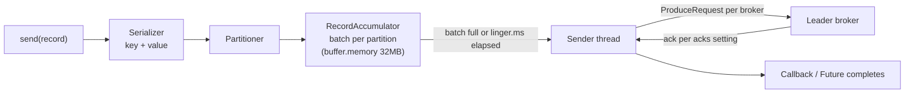
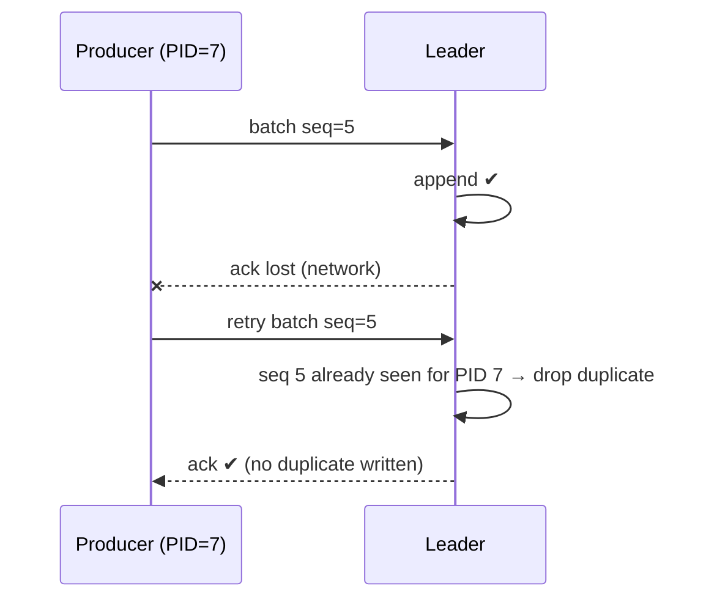

# Producers: acks, Batching, Idempotence, Keys & Partitioning

!!! abstract "TL;DR"
    - `send()` is **asynchronous**: the record goes into an in-memory **accumulator**, gets batched per partition, and a background **sender thread** ships batches to partition leaders.
    - **Partitioning:** keyed records use `murmur2(key) % partitions` (same key → same partition → ordered). Null-key records use the **sticky partitioner** (fill a batch for one partition, then switch).
    - **`acks`**: `0` (fire-and-forget), `1` (leader wrote it), `all` (all ISR have it). Since Kafka 3.0 the defaults are **`acks=all` and `enable.idempotence=true`**.
    - The **idempotent producer** (producer ID + per-partition sequence numbers) means retries don't create duplicates or reorder within a partition.
    - Throughput knobs: `linger.ms` (default **5 ms since Kafka 4.0**, was 0), `batch.size` (16 KB), `compression.type` (`lz4`/`zstd`).

## Why it matters

The producer decides **durability** (acks, retries), **ordering** (keys, idempotence, in-flight requests) and a large part of **throughput** (batching, compression). Misconfigured producers are a top cause of both "we lost messages" and "Kafka is slow" incidents.

## Core concepts

### The send path


*Notice that serialization and partitioning happen on the caller's thread, while network I/O happens on one background thread. A slow callback blocks the sender for everyone.*

- `send()` returns a `Future<RecordMetadata>`. Calling `.get()` makes it synchronous, which is simple but kills throughput.
- If the accumulator is full (`buffer.memory`) or metadata isn't available, `send()` blocks the calling thread up to `max.block.ms` (60s) and then fails with a `TimeoutException`. In the Java client that error is normally delivered through the returned future and the callback rather than thrown from `send()`, so handle both paths.

### Partitioning

| Key | Strategy | Effect |
|---|---|---|
| Present | `murmur2(keyBytes) % numPartitions` | Same key → same partition → ordered per key |
| Null | Sticky (KIP-480, 2.4+; uniform sticky built into the producer since 3.3, KIP-794) | Sticks to one partition until about `batch.size` bytes are produced, then switches. Better batching than round-robin |
| Custom | Implement `Partitioner` or pass an explicit partition | e.g. isolate VIP tenants. Use rarely |

!!! warning "Hot partitions"
    A skewed key (one huge tenant, `null` mistaken for a constant like `"UNKNOWN"`) sends a disproportionate share of traffic to one partition, which caps throughput at one consumer. Choose high-cardinality keys, or salt the hot key if ordering for it isn't required.

### Acknowledgements and durability

| `acks` | Producer waits for | Durability | Latency |
|---|---|---|---|
| `0` | Nothing | Data may be lost silently | Lowest |
| `1` | Leader's local write | Lost if the leader dies before followers copy it | Low |
| `all` / `-1` | All ISR members | Safe while ISR ≥ `min.insync.replicas` | Higher |

### Retries, ordering and idempotence

Without idempotence, a retry after a lost ack writes the record **twice**. With `max.in.flight.requests.per.connection > 1`, a retried batch could also land **after** a later batch, reordering it.


*Notice that the broker tracks the last sequence per (producer ID, partition). Duplicates are discarded, and a gap in sequence numbers is rejected, which preserves order.*

The idempotent producer requires `acks=all`, `retries > 0` and `max.in.flight.requests.per.connection ≤ 5`. These are all defaults since Kafka 3.0 (`retries` defaults to `Integer.MAX_VALUE`; the real bound is `delivery.timeout.ms`).

- If you **explicitly** set a conflicting value (e.g. `acks=1`) without explicitly setting `enable.idempotence`, the client silently **disables** idempotence. If you explicitly set `enable.idempotence=true` with a conflicting value, it throws a `ConfigException` at startup. Kafka 4.0 removed the remaining silent fallback for `max.in.flight.requests.per.connection > 5`.

- Idempotence is **per producer session and per partition**. A restarted producer gets a new PID. For cross-session or multi-partition atomicity you need **transactions** (`transactional.id`). See *Delivery semantics*.
- **`delivery.timeout.ms`** (default 120s) is the upper bound for the whole send, including retries. After it, the callback receives an exception. **You must handle that**, e.g. log + alert, outbox retry, or fail the request.

### Batching and compression

- `batch.size` (16 KB default): max bytes per partition batch.
- `linger.ms`: how long to wait for more records before sending. **Kafka 4.0 changed the default from 0 to 5 ms** because larger batches usually give similar or *lower* latency overall.
- `compression.type`: `none` (default), `gzip`, `snappy`, `lz4`, `zstd`. Batches are compressed as a unit, so bigger batches compress better. `lz4`/`zstd` are the common production choices.

## In practice: code & configuration

```yaml
spring:
  kafka:
    bootstrap-servers: broker1:9092,broker2:9092,broker3:9092
    producer:
      key-serializer: org.apache.kafka.common.serialization.StringSerializer
      # Spring Kafka 3.x (Jackson 2). The Spring Kafka 4.x docs use JacksonJsonSerializer (Jackson 3) instead.
      value-serializer: org.springframework.kafka.support.serializer.JsonSerializer
      acks: all                       # explicit, even though it's the default
      compression-type: lz4
      batch-size: 65536               # 64KB for higher throughput
      properties:
        linger.ms: 10
        enable.idempotence: true
        delivery.timeout.ms: 120000
        max.in.flight.requests.per.connection: 5
```

=== "❌ Common mistake"
    ```java
    // Blocking per message + ignoring failures
    public void publish(PrescriptionEvent e) throws Exception {
        kafkaTemplate.send("rx-status", e).get();          // synchronous: ~1 RTT per message
    }

    // or: fire-and-forget with no failure handling
    kafkaTemplate.send("rx-status", e);                     // failure after 120s is only logged by the template, nobody reacts
    ```

=== "✅ Correct approach"
    ```java
    public CompletableFuture<SendResult<String, PrescriptionEvent>> publish(PrescriptionEvent e) {
        return kafkaTemplate.send("rx-status", e.prescriptionId(), e)   // key → per-prescription ordering
            .whenComplete((result, ex) -> {
                if (ex != null) {
                    log.error("Publish failed eventId={}", e.eventId(), ex);
                    metrics.counter("kafka.publish.failed").increment();
                    // compensate: mark outbox row for retry / surface error to caller
                } else {
                    log.debug("Published p={} o={}",
                        result.getRecordMetadata().partition(), result.getRecordMetadata().offset());
                }
            });
    }
    ```

Plain Java client equivalent:

```java
var props = new Properties();
props.put(ProducerConfig.BOOTSTRAP_SERVERS_CONFIG, "broker:9092");
props.put(ProducerConfig.ACKS_CONFIG, "all");
props.put(ProducerConfig.ENABLE_IDEMPOTENCE_CONFIG, true);
props.put(ProducerConfig.COMPRESSION_TYPE_CONFIG, "zstd");
props.put(ProducerConfig.LINGER_MS_CONFIG, 10);
try (var producer = new KafkaProducer<String, String>(props, new StringSerializer(), new StringSerializer())) {
    producer.send(new ProducerRecord<>("orders", orderId, json), (md, ex) -> {
        if (ex != null) handleFailure(ex);           // runs on the sender thread: keep it fast
    });
}   // close() flushes outstanding batches
```

## Real-world usage

- **Log and metrics pipelines** use `acks=1` or even `0` with heavy batching. A lost metric is acceptable.
- **Payments and healthcare events** use `acks=all`, idempotence and often transactions plus the outbox pattern. Losing an event is not acceptable.
- **Classic incident:** a producer blocks for 60s on `max.block.ms` because the cluster is unreachable, starving the HTTP thread pool. Fix it by making sends async, adding circuit breakers, and bounding `max.block.ms` for request-path producers.

## Trade-offs & production gotchas

| Goal | Settings |
|---|---|
| Max durability | `acks=all`, idempotence, RF 3 / min ISR 2, handle callback errors |
| Max throughput | Larger `batch.size`, `linger.ms` 10–50, `lz4`/`zstd`, async sends |
| Lowest latency | `linger.ms=0`, small batches, `acks=1` (if loss acceptable) |
| Strict per-key order | Key by entity ID + idempotence (≤5 in-flight) |

| Option | Pros | Cons | Use when |
|---|---|---|---|
| `acks=0` | Highest throughput, no waiting | Silent loss, no retries, no offset returned | Lossy telemetry only |
| `acks=1` | Low latency | Loses acknowledged records on leader failover; disables idempotence | Logs and metrics where rare loss is fine |
| `acks=all` + idempotence | No acknowledged loss (with RF 3 / min ISR 2), no retry duplicates, ordered | Latency bound by the slowest in-sync follower; writes rejected when ISR < min ISR | Business events (default) |
| Transactions | Atomic multi-partition writes, exactly-once consume-transform-produce | Extra coordinator round trips, `read_committed` consumers lag to the last stable offset | Kafka-to-Kafka stream processing |

!!! warning "Gotchas"
    - Upgrading old clients: before 3.0, `acks` defaulted to `1` and idempotence was off, so legacy configs may silently be less safe. Clients 3.0.0 and 3.1.0 also had a bug (KAFKA-13598) where idempotence was not actually enabled by default; it was fixed in 3.0.1, 3.1.1 and 3.2.0.
    - An explicit `acks=1` or `acks=0` in an old config file **silently turns idempotence off** on a modern client.
    - Changing the **key serializer or format** changes the hash and the partition, which breaks ordering continuity.
    - **Heavy work in callbacks** blocks the sender thread for all partitions.
    - **Large messages** (> `max.request.size`, 1 MB default) fail. Use the claim-check pattern (store in S3, send a reference).

## How this connects to my experience

- **Where I used it:** Publicis Sapient, OptumRx Meteor: "Designed Kafka-based event-driven workflows with retry and DLQ handling" and microservices on Java, Spring Boot and Kafka. The Deloitte ConvergeHealth event-driven analytics workflows are on the resume with SQS/SNS, not Kafka, so only cite them as a Kafka example if that's accurate. *[confirm]*
- **Talking points:**
    - Producer settings actually used on Meteor (acks, idempotence, `linger.ms`, compression). *[confirm]*
    - Keys chosen per business entity (member/prescription ID) to guarantee per-entity ordering. *[confirm]*
    - `acks=all` + idempotence for healthcare data, with callback failure handling and metrics. *[confirm]*
    - How DB-to-Kafka consistency was handled (outbox?). *[confirm]*
- **Likely follow-up chain:** "What acks did you use?" → "Can idempotence alone give exactly-once?" → "What if the send fails after the DB commit?" → "How did you choose keys? Any hot partitions?"

## Interview questions

### Fundamentals

??? question "Q1. Explain acks=0, 1 and all."
    **Answer:** `0` means the producer doesn't wait for any acknowledgement, so loss is silent and retries are meaningless. `1` means the leader appended the record to its log (it is lost if the leader fails before followers replicate it). `all` (or `-1`) means every replica currently in the ISR has it, so the record survives a leader failure as long as the ISR has at least `min.insync.replicas` members. Since Kafka 3.0 the default is `all`. `acks=all` is only as strong as the topic settings behind it: with RF 3 and `min.insync.replicas=1`, "all ISR" can shrink to the leader alone.

    **Interviewer listens for:** "all" means all *in-sync* replicas, not all replicas; the link to `min.insync.replicas`; the 3.0 default change.

    **Common wrong answer:** "`acks=all` waits for every replica" or "`acks=1` means the record is flushed to disk" (the ack is for the append to the leader's log, which normally sits in the page cache; durability comes from replication, not fsync).

??? question "Q2. How does Kafka decide which partition a record goes to?"
    **Answer:** In order: an explicit partition on the `ProducerRecord` wins. Otherwise, if a key exists, the default logic is `murmur2(serializedKeyBytes) % numPartitions`, so the same key bytes always map to the same partition while the partition count is unchanged. If the key is null, the sticky partitioner sticks to one partition until about `batch.size` bytes have been produced, then switches (since 3.3 it is also adaptive and favours less loaded brokers). A custom `Partitioner` set via `partitioner.class` overrides this.

    **Interviewer listens for:** the hash is over the *serialized* key bytes; the mapping depends on partition count; sticky rather than round-robin for null keys.

    **Common wrong answer:** "Null keys are sent round-robin per record" (true only before Kafka 2.4) or "Kafka uses `key.hashCode()`".

??? question "Q3. Is producer.send() synchronous?"
    **Answer:** No. It serializes, picks the partition, appends to an in-memory batch in the `RecordAccumulator` and returns a `Future<RecordMetadata>`. A background sender thread transmits batches. You get the result via the Future or a callback. Calling `.get()` per record makes it synchronous and slow. One caveat: `send()` can still **block** the calling thread for up to `max.block.ms` while it waits for metadata or for buffer space.

    **Interviewer listens for:** accumulator + sender thread; callback runs on the sender thread; the `max.block.ms` blocking caveat.

    **Common wrong answer:** "`send()` never blocks because it is async."

### Intermediate

??? question "Q4. What is the idempotent producer and what does it guarantee?"
    **Answer:** On startup the producer gets a producer ID (PID) and epoch from the broker, and each batch per partition carries a monotonically increasing sequence number. The partition leader remembers the last few batches per (PID, partition): a batch it has already appended is acknowledged again without being written, and a batch that would leave a gap is rejected with `OutOfOrderSequenceException`. That guarantees no duplicates from retries and no reordering within a partition, **within one producer session**. It doesn't cover producer restarts (new PID), application-level resends, or multi-partition atomicity. Those need transactions and/or consumer-side dedupe.

    **Interviewer listens for:** PID + sequence number per partition; scope limited to a single session and a single partition; it costs almost nothing, which is why it is the default.

    **Common wrong answer:** "Idempotence gives exactly-once end to end" or "it dedupes on the message key/payload".

??? question "Q5. Does enable.idempotence=true give you exactly-once delivery?"
    **Answer:** No. It only removes duplicates caused by the producer client's *internal* retries within one session. You still get duplicates if the application calls `send()` again after a timeout, if the producer restarts and replays work, or if the consumer reprocesses after a rebalance before committing offsets. Exactly-once *processing* needs either Kafka transactions for consume-transform-produce inside Kafka (`transactional.id` on the producer, `isolation.level=read_committed` on consumers), or, when an external database is involved, at-least-once delivery plus an idempotent consumer (dedupe on a business/event ID) and an outbox on the producing side.

    **Interviewer listens for:** a clear separation of idempotent producer vs transactions vs end-to-end semantics; awareness that external side effects are outside Kafka's guarantee.

    **Common wrong answer:** "Yes, idempotence is exactly-once" or "transactions make my DB write and the Kafka write atomic".

??? question "Q6. How do linger.ms and batch.size affect throughput and latency?"
    **Answer:** A batch becomes sendable when it reaches `batch.size` bytes or when `linger.ms` expires, whichever comes first. `batch.size` is an upper bound, not a target the producer waits for. Larger values mean fewer, bigger requests, better compression and higher throughput, at the cost of up to `linger.ms` of added latency under light load. Under heavy load batches fill before the linger expires, so the added latency disappears. Kafka 4.0 moved the `linger.ms` default from 0 to 5 ms because the efficiency gain usually gives similar or lower end-to-end latency.

    **Interviewer listens for:** "whichever comes first"; batches are per partition; compression is per batch; the 4.0 default change.

    **Common wrong answer:** "The producer always waits `linger.ms`" or "it waits until `batch.size` is full".

??? question "Q7. Why can max.in.flight.requests > 1 cause reordering, and how is it solved?"
    **Answer:** If batch 1 fails with a retriable error and is retried while batch 2 succeeds, batch 2 lands first. With idempotence enabled, the broker rejects a batch whose sequence number is not the next expected one, and the producer re-sends in order, so ordering is preserved for up to 5 in-flight requests. The limit is 5 because the broker keeps sequence metadata for the last 5 batches per producer and partition. Without idempotence you need `max.in.flight.requests.per.connection=1`, which costs throughput.

    **Interviewer listens for:** the concrete failure sequence; why the limit is 5; that `max.in.flight=1` is the legacy workaround.

    **Common wrong answer:** "Kafka always guarantees order within a partition" (only true for what the broker appended, not for what the producer intended to send).

??? question "Q8. What happens when you produce with acks=all and the ISR drops below min.insync.replicas?"
    **Answer:** The leader rejects the write with `NotEnoughReplicasException` (or `NotEnoughReplicasAfterAppendException` if the ISR shrank after the append). Both are retriable, so the producer keeps retrying until `delivery.timeout.ms`, then fails the callback. The partition is effectively read-only for `acks=all` producers: consumers can still read, and `acks=0/1` producers are *not* blocked by `min.insync.replicas`. This is the intended trade: with RF 3 and `min.insync.replicas=2` you tolerate one broker down with no loss, and you choose unavailability over data loss when two are down.

    **Interviewer listens for:** `min.insync.replicas` is enforced only for `acks=all`; consistency chosen over availability; the standard RF 3 / min ISR 2 pairing and why min ISR = RF is a bad idea (one broker restart stops writes).

    **Common wrong answer:** "`min.insync.replicas` is the number of replicas that must ack every write" (it is a minimum ISR size, not an ack count) or "set it equal to the replication factor for safety".

??? question "Q9. What happens when the broker is unavailable for 5 minutes?"
    **Answer:** Batches already in the accumulator are retried (default `retries` is effectively infinite) until `delivery.timeout.ms` (2 min) and then fail their callbacks with a `TimeoutException`. New records keep filling `buffer.memory`. When it is full, `send()` blocks the calling thread up to `max.block.ms` (60s) and then fails with a `TimeoutException`. So in a 5-minute outage you lose everything the application doesn't re-drive itself. The application must handle it: async sends with failure callbacks, a short `max.block.ms` on request threads, alerting, and an outbox or other durable buffer so events can be replayed once the cluster is back.

    **Interviewer listens for:** the two different timeouts and which thread each affects; that the producer's buffer is memory, not durable; a concrete recovery mechanism.

    **Common wrong answer:** "The producer retries forever, so nothing is lost."

### Senior

??? question "Q10. How do you choose a partition key for a healthcare workflow?"
    **Answer:** Key by the entity whose events must stay ordered (prescriptionId or memberId), with high cardinality and even distribution. Avoid keys that change (the same entity would split across partitions). Avoid low-cardinality keys like status or region. Check for skew with per-partition metrics. If one member generates massive traffic and ordering only matters per prescription, key by prescription instead. Also plan the partition count up front: adding partitions later changes `hash % partitions` and breaks per-key ordering across the change.

    **Interviewer listens for:** ordering scope drives the key; skew detection; the repartitioning consequence; not putting PHI in a key that ends up in logs/metrics.

    **Common wrong answer:** "Use a random UUID for even distribution" (it destroys ordering) or "use one partition to keep everything ordered".

??? question "Q11. How would you publish 10 MB documents through Kafka?"
    **Answer:** Don't put them in Kafka directly. Use the claim-check pattern: upload to S3/blob storage (encrypted) and send an event with the reference, checksum and metadata. Raising limits is possible but needs to be done end to end: producer `max.request.size`, broker `message.max.bytes` (or topic `max.message.bytes`), `replica.fetch.max.bytes`, and consumer `max.partition.fetch.bytes`/`fetch.max.bytes`. It hurts memory, replication and tail latency for every other tenant of the cluster.

    **Interviewer listens for:** claim-check first; knows that several limits must move together; lifecycle of the blob (retention, access control) vs the topic retention.

    **Common wrong answer:** "Just increase `max.request.size`."

??? question "Q12. Your service writes to Postgres and then publishes. How do you guarantee the event is published if and only if the DB commit succeeds?"
    **Answer:** A dual write can't be made atomic: publish-then-commit can emit an event for a rolled-back change, and commit-then-publish can lose the event if the process dies or the send fails. Use the transactional outbox: insert the event row in the same DB transaction as the business change, then relay it to Kafka with CDC (Debezium) or a poller. The relay is at-least-once, so events carry a stable event ID and consumers dedupe on it. Key the relayed record by aggregate ID so ordering matches commit order. Kafka transactions don't help here because they can't enlist the database.

    **Interviewer listens for:** naming the dual-write problem; outbox + CDC/poller; at-least-once + idempotent consumer; ordering of the relay.

    **Common wrong answer:** "Wrap both in `@Transactional`" or "use Kafka transactions / 2PC with the database".

### Scenario-based

??? question "Q13. Producer throughput is far below expectations. What do you check?"
    **Answer:** Synchronous `.get()` per send. `linger.ms=0` with tiny batches. No compression. A hot partition from a skewed key. A slow callback blocking the sender thread. Too few partitions. `acks=all` with a slow or overloaded follower (check ISR, replica lag). Network/TLS overhead. Measure with producer metrics: `record-send-rate`, `batch-size-avg`, `records-per-request-avg`, `request-latency-avg`, `record-queue-time-avg`, `bufferpool-wait-time-total`, `record-retry-rate`.

    **Interviewer listens for:** a measure-first approach with named metrics, separating client-side causes (batching, blocking) from broker-side causes (replication, disk, network).

    **Common wrong answer:** "Add more partitions / more brokers" as the first move.

??? question "Q14. After a deploy, consumers see events for a prescription out of order. What happened?"
    **Answer:** Likely causes: the key changed (a different serializer or field, so a new hash), the partition count was increased, someone produced without a key, a second producer instance/service started writing the same entity with a different key, or a producer with idempotence disabled and multiple in-flight requests hit retries. Also check the consumer side: concurrent processing within a partition or a retry topic re-injecting an older event looks identical from the outside. Verify by sampling partition and offset per key before and after the deploy.

    **Interviewer listens for:** distinguishes producer-side reordering from consumer-side reordering; knows retry topics break ordering; a concrete way to verify.

    **Common wrong answer:** "Kafka doesn't guarantee ordering" (it does, per partition).

## Cheat sheet

| Setting | Default (Kafka 3.0+/4.0) | Notes |
|---|---|---|
| `acks` | `all` | Was `1` before 3.0 |
| `enable.idempotence` | `true` | Needs acks=all, in-flight ≤ 5, retries > 0 |
| `retries` | 2147483647 | Bounded in practice by `delivery.timeout.ms` |
| `max.in.flight.requests.per.connection` | 5 | Max allowed with idempotence |
| `compression.type` | `none` | Set `lz4` or `zstd` explicitly |
| `linger.ms` | `5` (4.0) | Was 0 |
| `batch.size` | 16384 | Per partition |
| `buffer.memory` | 32 MB | Then `send()` blocks |
| `max.block.ms` | 60000 | Blocking bound for `send()`/metadata |
| `delivery.timeout.ms` | 120000 | Total retry window |
| `max.request.size` | 1 MB | Use claim-check for big payloads |

## Sources

1. [Apache Kafka: Producer configs](https://kafka.apache.org/41/configuration/producer-configs/): defaults and semantics.
2. [Apache Kafka 4.0 upgrade notes](https://kafka.apache.org/40/getting-started/upgrade/): `linger.ms` default change.
3. [KIP-679: Producer will enable the strongest delivery guarantee by default](https://cwiki.apache.org/confluence/display/KAFKA/KIP-679%3A+Producer+will+enable+the+strongest+delivery+guarantee+by+default): `acks=all` + idempotence default (3.0).
4. [KIP-480: Sticky Partitioner](https://cwiki.apache.org/confluence/display/KAFKA/KIP-480%3A+Sticky+Partitioner) and [KIP-794: Strictly Uniform Sticky Partitioner](https://cwiki.apache.org/confluence/display/KAFKA/KIP-794%3A+Strictly+Uniform+Sticky+Partitioner).
5. [Spring for Apache Kafka: Sending Messages](https://docs.spring.io/spring-kafka/reference/kafka/sending-messages.html): `KafkaTemplate`, `CompletableFuture` results.
6. [Spring for Apache Kafka: Serialization, Deserialization, and Message Conversion](https://docs.spring.io/spring-kafka/reference/kafka/serdes.html): JSON serializer class names per version.
