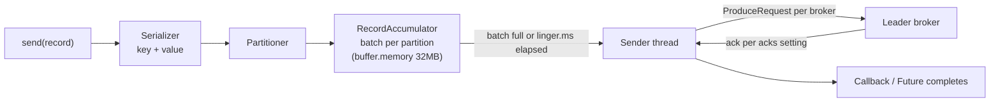
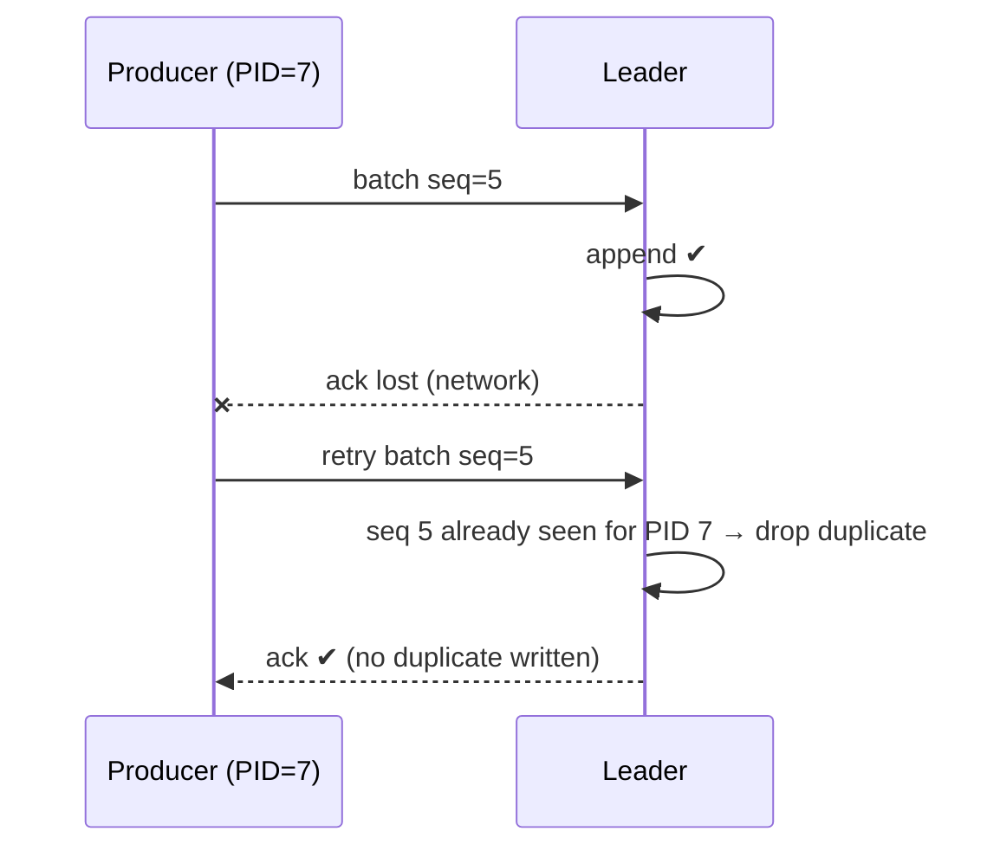

# Producers: acks, Batching, Idempotence, Keys & Partitioning

!!! abstract "TL;DR"
    - `send()` is **asynchronous**: the record goes into an in-memory **accumulator**, gets batched per partition, and a background **sender thread** ships batches to partition leaders.
    - **Partitioning:** keyed records use `murmur2(key) % partitions` (same key → same partition → ordered). Null-key records use the **sticky partitioner** (fill a batch for one partition, then switch).
    - **`acks`**: `0` (fire-and-forget), `1` (leader wrote it), `all` (all ISR have it). Since Kafka 3.0 the defaults are **`acks=all` and `enable.idempotence=true`**.
    - The **idempotent producer** (producer ID + per-partition sequence numbers) means retries don't create duplicates or reorder within a partition.
    - Throughput knobs: `linger.ms` (default **5 ms since Kafka 4.0**, was 0), `batch.size` (16 KB), `compression.type` (`lz4`/`zstd`).

## Why it matters

The producer decides **durability** (acks, retries), **ordering** (keys, idempotence, in-flight requests) and a large part of **throughput** (batching, compression). Misconfigured producers are a top cause of both "we lost messages" and "Kafka is slow" incidents.

## Core concepts

### The send path


*Notice that serialization and partitioning happen on the caller's thread, while network I/O happens on one background thread. A slow callback blocks the sender for everyone.*

- `send()` returns a `Future<RecordMetadata>`. Calling `.get()` makes it synchronous, which is simple but kills throughput.
- If the accumulator is full (`buffer.memory`), `send()` blocks up to `max.block.ms` (60s), then throws.

### Partitioning

| Key | Strategy | Effect |
|---|---|---|
| Present | `murmur2(keyBytes) % numPartitions` | Same key → same partition → ordered per key |
| Null | Sticky (uniform sticky since 3.3) | Fills one partition's batch, then rotates. Better batching than round-robin |
| Custom | Implement `Partitioner` or pass an explicit partition | e.g. isolate VIP tenants. Use rarely |

!!! warning "Hot partitions"
    A skewed key (one huge tenant, `null` mistaken for a constant like `"UNKNOWN"`) sends a disproportionate share of traffic to one partition, which caps throughput at one consumer. Choose high-cardinality keys, or salt the hot key if ordering for it isn't required.

### Acknowledgements and durability

| `acks` | Producer waits for | Durability | Latency |
|---|---|---|---|
| `0` | Nothing | Data may be lost silently | Lowest |
| `1` | Leader's local write | Lost if the leader dies before followers copy it | Low |
| `all` / `-1` | All ISR members | Safe while ISR ≥ `min.insync.replicas` | Higher |

### Retries, ordering and idempotence

Without idempotence, a retry after a lost ack writes the record **twice**. With `max.in.flight.requests.per.connection > 1`, a retried batch could also land **after** a later batch, reordering it.


*Notice that the broker tracks the last sequence per (producer ID, partition). Duplicates are discarded, and a gap in sequence numbers is rejected, which preserves order.*

The idempotent producer requires `acks=all`, `retries > 0` and `max.in.flight.requests.per.connection ≤ 5`. These are all defaults since Kafka 3.0.

- Idempotence is **per producer session and per partition**. A restarted producer gets a new PID. For cross-session or multi-partition atomicity you need **transactions** (`transactional.id`). See *Delivery semantics*.
- **`delivery.timeout.ms`** (default 120s) is the upper bound for the whole send, including retries. After it, the callback receives an exception. **You must handle that**, e.g. log + alert, outbox retry, or fail the request.

### Batching and compression

- `batch.size` (16 KB default): max bytes per partition batch.
- `linger.ms`: how long to wait for more records before sending. **Kafka 4.0 changed the default from 0 to 5 ms** because larger batches usually give similar or *lower* latency overall.
- `compression.type`: `none` (default), `gzip`, `snappy`, `lz4`, `zstd`. Batches are compressed as a unit, so bigger batches compress better. `lz4`/`zstd` are the common production choices.

## In practice: code & configuration

```yaml
spring:
  kafka:
    bootstrap-servers: broker1:9092,broker2:9092,broker3:9092
    producer:
      key-serializer: org.apache.kafka.common.serialization.StringSerializer
      value-serializer: org.springframework.kafka.support.serializer.JsonSerializer
      acks: all                       # explicit, even though it's the default
      compression-type: lz4
      batch-size: 65536               # 64KB for higher throughput
      properties:
        linger.ms: 10
        enable.idempotence: true
        delivery.timeout.ms: 120000
        max.in.flight.requests.per.connection: 5
```

=== "❌ Common mistake"
    ```java
    // Blocking per message + ignoring failures
    public void publish(PrescriptionEvent e) throws Exception {
        kafkaTemplate.send("rx-status", e).get();          // synchronous: ~1 RTT per message
    }

    // or: fire-and-forget with no failure handling
    kafkaTemplate.send("rx-status", e);                     // failure after 120s is silently ignored
    ```

=== "✅ Correct approach"
    ```java
    public CompletableFuture<SendResult<String, PrescriptionEvent>> publish(PrescriptionEvent e) {
        return kafkaTemplate.send("rx-status", e.prescriptionId(), e)   // key → per-prescription ordering
            .whenComplete((result, ex) -> {
                if (ex != null) {
                    log.error("Publish failed eventId={}", e.eventId(), ex);
                    metrics.counter("kafka.publish.failed").increment();
                    // compensate: mark outbox row for retry / surface error to caller
                } else {
                    log.debug("Published p={} o={}",
                        result.getRecordMetadata().partition(), result.getRecordMetadata().offset());
                }
            });
    }
    ```

Plain Java client equivalent:

```java
var props = new Properties();
props.put(ProducerConfig.BOOTSTRAP_SERVERS_CONFIG, "broker:9092");
props.put(ProducerConfig.ACKS_CONFIG, "all");
props.put(ProducerConfig.ENABLE_IDEMPOTENCE_CONFIG, true);
props.put(ProducerConfig.COMPRESSION_TYPE_CONFIG, "zstd");
props.put(ProducerConfig.LINGER_MS_CONFIG, 10);
try (var producer = new KafkaProducer<String, String>(props, new StringSerializer(), new StringSerializer())) {
    producer.send(new ProducerRecord<>("orders", orderId, json), (md, ex) -> {
        if (ex != null) handleFailure(ex);           // runs on the sender thread: keep it fast
    });
}   // close() flushes outstanding batches
```

## Real-world usage

- **Log and metrics pipelines** use `acks=1` or even `0` with heavy batching. A lost metric is acceptable.
- **Payments and healthcare events** use `acks=all`, idempotence and often transactions plus the outbox pattern. Losing an event is not acceptable.
- **Classic incident:** a producer blocks for 60s on `max.block.ms` because the cluster is unreachable, starving the HTTP thread pool. Fix it by making sends async, adding circuit breakers, and bounding `max.block.ms` for request-path producers.

## Trade-offs & production gotchas

| Goal | Settings |
|---|---|
| Max durability | `acks=all`, idempotence, RF 3 / min ISR 2, handle callback errors |
| Max throughput | Larger `batch.size`, `linger.ms` 10–50, `lz4`/`zstd`, async sends |
| Lowest latency | `linger.ms=0`, small batches, `acks=1` (if loss acceptable) |
| Strict per-key order | Key by entity ID + idempotence (≤5 in-flight) |

!!! warning "Gotchas"
    - Upgrading old clients: before 3.0, `acks` defaulted to `1` and idempotence was off, so legacy configs may silently be less safe.
    - Changing the **key serializer or format** changes the hash and the partition, which breaks ordering continuity.
    - **Heavy work in callbacks** blocks the sender thread for all partitions.
    - **Large messages** (> `max.request.size`, 1 MB default) fail. Use the claim-check pattern (store in S3, send a reference).

## How this connects to my experience

- **Where I used it:** publishing workflow events at OptumRx Meteor; event-driven analytics at Deloitte.
- **Talking points:**
    - Keys chosen per business entity (member/prescription ID) to guarantee per-entity ordering. *[confirm]*
    - `acks=all` + idempotence for healthcare data, with callback failure handling and metrics. *[confirm]*
    - How DB-to-Kafka consistency was handled (outbox?). *[confirm]*
- **Likely follow-up chain:** "What acks did you use?" → "Can idempotence alone give exactly-once?" → "What if the send fails after the DB commit?" → "How did you choose keys? Any hot partitions?"

## Interview questions

### Fundamentals

??? question "Q1. Explain acks=0, 1 and all."
    **Answer:** 0 means no acknowledgement (possible silent loss). 1 means the leader persisted it (lost if the leader fails before replication). all means every ISR member has it (durable as long as ISR ≥ `min.insync.replicas`). Since Kafka 3.0 the default is `all`.

??? question "Q2. How does Kafka decide which partition a record goes to?"
    **Answer:** An explicit partition if given. Otherwise, if a key exists, murmur2 hash of the key modulo the partition count. If the key is null, the sticky partitioner fills a batch for one partition before moving on. A custom `Partitioner` can override.

??? question "Q3. Is producer.send() synchronous?"
    **Answer:** No. It appends to an in-memory batch and returns a Future. A background sender thread transmits batches. You get results via the Future or a callback. Calling `.get()` per record makes it synchronous and slow.

### Intermediate

??? question "Q4. What is the idempotent producer and what does it guarantee?"
    **Answer:** The broker assigns a producer ID, and each batch per partition carries a sequence number. The broker rejects duplicates (same seq) and out-of-order gaps. That guarantees no duplicates from retries and ordering per partition, **within one producer session**. It doesn't cover producer restarts or multi-partition atomicity. That needs transactions.

??? question "Q5. How do linger.ms and batch.size affect throughput and latency?"
    **Answer:** A batch is sent when it reaches `batch.size` or `linger.ms` expires. Larger values mean better batching and compression and higher throughput, at the cost of slightly higher per-record latency. Kafka 4.0 moved the `linger.ms` default to 5 ms because the efficiency gain usually offsets the delay.

??? question "Q6. Why can max.in.flight.requests > 1 cause reordering, and how is it solved?"
    **Answer:** If batch 1 fails and is retried while batch 2 succeeds, batch 2 lands first. With idempotence enabled, sequence numbers make the broker reject out-of-order batches, so ordering is preserved for up to 5 in-flight requests. Without idempotence you'd need `max.in.flight=1`.

??? question "Q7. What happens when the broker is unavailable for 5 minutes?"
    **Answer:** Records accumulate in `buffer.memory`. When it's full, `send()` blocks up to `max.block.ms` and then throws. Records already in batches retry until `delivery.timeout.ms` (2 min), then fail their callbacks. The application must handle both: async sends, alerting, and the outbox or a local buffer to recover.

### Senior

??? question "Q8. How do you choose a partition key for a healthcare workflow?"
    **Answer:** Key by the entity whose events must stay ordered (prescriptionId or memberId), with high cardinality and even distribution. Avoid keys that change (the same entity would split across partitions). Avoid low-cardinality keys like status or region. Check for skew with per-partition metrics. If one member generates massive traffic and ordering only matters per prescription, key by prescription instead.

??? question "Q9. How would you publish 10 MB documents through Kafka?"
    **Answer:** Don't put them in Kafka directly. Use the claim-check pattern: upload to S3/blob storage (encrypted) and send an event with the reference, checksum and metadata. Raising `max.request.size` and broker `message.max.bytes` is possible but hurts memory, replication and latency.

??? question "Q10. Your service writes to Postgres and then publishes. How do you guarantee the event is published exactly when the DB commit succeeds?"
    **Answer:** Use the transactional outbox (insert the event row in the same DB transaction, then relay via CDC/Debezium or a poller with idempotent publish). Consumers dedupe by eventId. Kafka transactions alone can't include the database.

### Scenario-based

??? question "Q11. Producer throughput is far below expectations. What do you check?"
    **Answer:** Synchronous `.get()` per send. `linger.ms=0` with tiny batches. No compression. A hot partition from a skewed key. A slow callback blocking the sender thread. Too few partitions. `acks=all` with a slow or overloaded follower (check ISR, replica lag). Network/TLS overhead. Measure with producer metrics: `record-send-rate`, `batch-size-avg`, `request-latency-avg`, `record-queue-time-avg`.

??? question "Q12. After a deploy, consumers see events for a prescription out of order. What happened?"
    **Answer:** Likely causes: the key changed (a different serializer or field, so a new hash), the partition count was increased, someone produced without a key, or a producer with idempotence disabled and multiple in-flight requests hit retries. Verify by sampling partition assignments per key before and after.

## Cheat sheet

| Setting | Default (Kafka 3.0+/4.0) | Notes |
|---|---|---|
| `acks` | `all` | Was `1` before 3.0 |
| `enable.idempotence` | `true` | Needs acks=all, in-flight ≤ 5 |
| `linger.ms` | `5` (4.0) | Was 0 |
| `batch.size` | 16384 | Per partition |
| `buffer.memory` | 32 MB | Then `send()` blocks |
| `max.block.ms` | 60000 | Blocking bound for `send()`/metadata |
| `delivery.timeout.ms` | 120000 | Total retry window |
| `max.request.size` | 1 MB | Use claim-check for big payloads |

## Sources

1. [Apache Kafka: Producer configs](https://kafka.apache.org/documentation/#producerconfigs): defaults and semantics.
2. [Apache Kafka 4.0 upgrade notes](https://kafka.apache.org/40/getting-started/upgrade/): `linger.ms` default change.
3. [KIP-679: Producer will enable the strongest delivery guarantee by default](https://cwiki.apache.org/confluence/display/KAFKA/KIP-679%3A+Producer+will+enable+the+strongest+delivery+guarantee+by+default): `acks=all` + idempotence default (3.0).
4. [KIP-480: Sticky Partitioner](https://cwiki.apache.org/confluence/display/KAFKA/KIP-480%3A+Sticky+Partitioner) and [KIP-794: Strictly Uniform Sticky Partitioner](https://cwiki.apache.org/confluence/display/KAFKA/KIP-794%3A+Strictly+Uniform+Sticky+Partitioner).
5. [Spring for Apache Kafka: Sending Messages](https://docs.spring.io/spring-kafka/reference/kafka/sending-messages.html): `KafkaTemplate`, `CompletableFuture` results.
