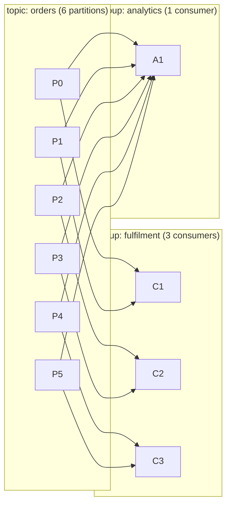
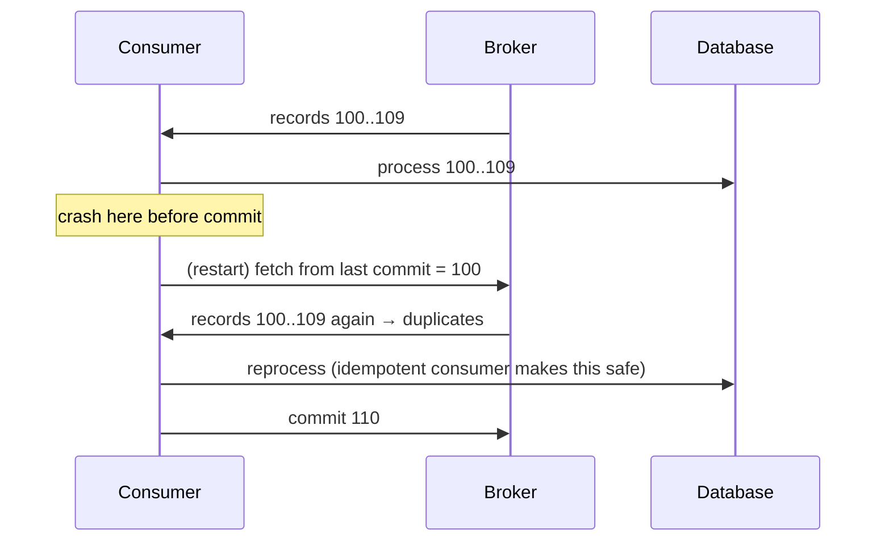
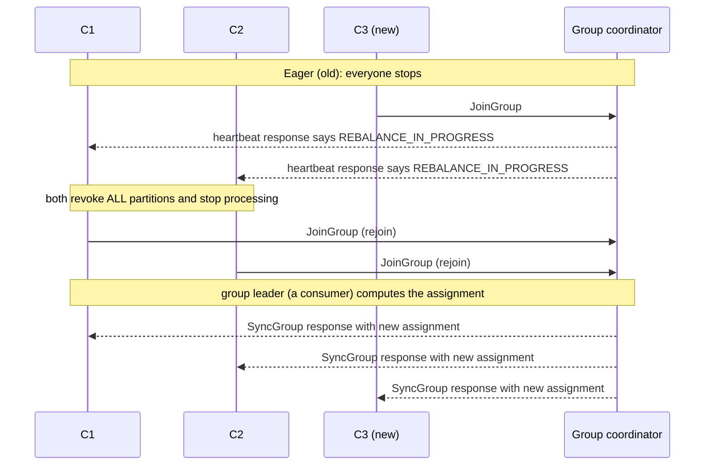

# Consumers: Groups, Rebalancing & Offset Management

!!! abstract "TL;DR"
    - A **consumer group** shares a topic's partitions: **each partition goes to exactly one consumer in the group**. More consumers than partitions means idle consumers.
    - Consumers **pull** with `poll()`. Progress is the **committed offset** per partition, stored in `__consumer_offsets`.
    - **Commit after processing = at-least-once** (duplicates possible). Commit before processing = at-most-once (loss possible).
    - **Rebalancing** reassigns partitions when members join or leave or time out. Eager rebalances stop the world. **Cooperative sticky** and the **new KIP-848 protocol (GA in Kafka 4.0)** make them incremental.
    - Two liveness timers: `session.timeout.ms` (heartbeats, 45s) and `max.poll.interval.ms` (time between polls, 5 min). Slow processing → rebalance. (With `group.protocol=consumer` the session and heartbeat timers are **broker** configs, not client ones.)

## Why it matters

Duplicates, lag, "stuck" consumers, rebalance storms and lost messages are almost always consumer-side issues. Interviewers probe this heavily for anyone claiming Kafka production experience.

## Core concepts

### Consumer groups


*Notice that each group gets every record, while within a group each partition has exactly one owner. Groups are independent: analytics being slow doesn't affect fulfilment.*

### The poll loop

```java
try (var consumer = new KafkaConsumer<String, String>(props)) {
    consumer.subscribe(List.of("orders"));
    while (running) {
        var records = consumer.poll(Duration.ofMillis(500));   // fetch + heartbeat-related bookkeeping
        for (var r : records) {
            process(r);                                        // must finish well within max.poll.interval.ms
        }
        consumer.commitSync();                                 // commit AFTER processing → at-least-once
    }
}
```

- `KafkaConsumer` is **not thread-safe**: one consumer per thread.
- `max.poll.records` (default 500) bounds records per poll, which is the main lever to keep processing under `max.poll.interval.ms`.
- `auto.offset.reset` decides where a **new group** starts: `latest` (default), `earliest`, or `none` (throw `NoOffsetForPartitionException`). Kafka 4.0 adds `by_duration:<ISO-8601 duration>` (e.g. `by_duration:PT6H`). It applies only when no committed offset exists or it's out of range.
- The committed offset is the **next offset to read** (last processed + 1), not the last one processed. Committing `109` after processing `109` replays it.

### Offset commits and delivery semantics


*Notice that committing after processing never loses data but can replay a batch. That's why idempotent consumers matter.*

| Strategy | Mechanism | Semantics |
|---|---|---|
| Auto-commit (`enable.auto.commit=true`, `auto.commit.interval.ms` = 5s) | Committed inside `poll()` (and on `close()`) for records returned by *previous* polls | At-least-once if you finish processing before the next poll; risky with async hand-off |
| Manual sync after processing | `commitSync()` | At-least-once, simple |
| Manual async | `commitAsync()` + `commitSync()` on shutdown/revoke | At-least-once, faster |
| Commit before processing | Commit, then process | At-most-once |
| Store offsets with results atomically | Offsets in the same DB transaction, `seek()` on assignment | Effectively exactly-once to the DB |

!!! warning "The async hand-off trap"
    If `process()` hands records to another thread pool and returns immediately, auto-commit (or a commit after the loop) can commit offsets for work that hasn't finished. If the pod dies, those records are **lost**.

### Liveness: two different timeouts

| Config | Default | Detects | On breach |
|---|---|---|---|
| `heartbeat.interval.ms` | 3s | — (how often the background heartbeat thread pings the coordinator; keep ≤ 1/3 of the session timeout) | — |
| `session.timeout.ms` | 45s | Process dead / network partition | Member removed → rebalance |
| `max.poll.interval.ms` | 300s | Process alive but **stuck or slow** | Member leaves group → rebalance; its commits fail with `CommitFailedException` |

These client-side values are for the **classic** protocol. With `group.protocol=consumer` (KIP-848), `session.timeout.ms` and `heartbeat.interval.ms` are not supported on the client: the broker dictates them via `group.consumer.session.timeout.ms` (45s) and `group.consumer.heartbeat.interval.ms` (5s). `max.poll.interval.ms` stays a client config.

### Rebalancing protocols


*Notice that with eager rebalancing every consumer gives up everything and stops, even those whose partitions don't move, and that in the classic protocol the assignment is computed by a consumer (the group leader), not the broker. In large groups with frequent deploys this means repeated stalls.*

| Protocol | How it works | Impact |
|---|---|---|
| **Eager** (`RangeAssignor`, `RoundRobinAssignor`, `StickyAssignor`) | Revoke everything, rejoin, reassign | Full stop on every change |
| **Cooperative sticky** (`CooperativeStickyAssignor`, incremental, KIP-429) | Only the moving partitions are revoked, over 2 rebalance rounds | Others keep processing |
| **KIP-848 "consumer" protocol** (GA in Kafka 4.0, opt-in with `group.protocol=consumer`; the client default is still `classic`) | **Broker-side** assignment (`group.remote.assignor`: `uniform` or `range`), incremental, no global sync barrier | Faster, simpler clients, far fewer stalls |
| **Static membership** (`group.instance.id`, KIP-345) | A restarted member with the same ID gets its partitions back without a rebalance (within the session timeout). Works with any of the above | Great for rolling deploys on Kubernetes (StatefulSet pod names). Its partitions are **unconsumed** until it returns or the session times out |

### Lag

**Consumer lag** = log end offset − committed offset, per partition (this is what `kafka-consumer-groups.sh --describe` reports; the client's own `records-lag-max` metric is measured against its fetch position instead). It's *the* key consumer health metric. Rising lag means consumers can't keep up, are stuck on a record, or are rebalancing repeatedly.

## In practice: code & configuration

```yaml
spring:
  kafka:
    consumer:
      group-id: fulfilment
      auto-offset-reset: earliest        # a new group starts at the beginning (choose deliberately)
      enable-auto-commit: false          # Spring manages commits (its default when unset)
      max-poll-records: 200
      properties:
        max.poll.interval.ms: 300000
        session.timeout.ms: 45000
        partition.assignment.strategy: org.apache.kafka.clients.consumer.CooperativeStickyAssignor
        group.instance.id: ${HOSTNAME}   # static membership (stable pod names, e.g. StatefulSet);
                                         # with concurrency > 1 Spring appends -1, -2, ... per consumer
        # Kafka 4.x brokers + clients: opt in to the new protocol instead.
        # group.protocol: consumer
        # group.remote.assignor: uniform  # optional (broker default is the first of group.consumer.assignors)
        # With group.protocol=consumer you must REMOVE partition.assignment.strategy,
        # session.timeout.ms and heartbeat.interval.ms: the client rejects them with a ConfigException.
    listener:
      ack-mode: record                   # or batch (default); manual for explicit control
      concurrency: 3                     # 3 consumer threads; useful up to the partition count
```

=== "❌ Common mistake"
    ```java
    @KafkaListener(topics = "orders")
    void onOrder(Order o) {
        executor.submit(() -> service.process(o));  // returns immediately → offset committed
    }                                                // → crash = lost orders
    ```

=== "✅ Correct approach"
    ```java
    @KafkaListener(topics = "orders", concurrency = "6")   // parallelism via partitions, not a thread pool
    void onOrder(Order o) {
        service.process(o);                                // finishes before the offset is committed
    }
    ```

Manual acknowledgement when you need control (the container factory must use `AckMode.MANUAL` or `MANUAL_IMMEDIATE`, otherwise no `Acknowledgment` is available to inject):

```java
@Bean
ConcurrentKafkaListenerContainerFactory<String, Order> manualAckFactory(ConsumerFactory<String, Order> cf) {
    var factory = new ConcurrentKafkaListenerContainerFactory<String, Order>();
    factory.setConsumerFactory(cf);
    factory.getContainerProperties().setAckMode(ContainerProperties.AckMode.MANUAL);
    return factory;
}
```

```java
@KafkaListener(topics = "orders", containerFactory = "manualAckFactory")
void onOrder(ConsumerRecord<String, Order> rec, Acknowledgment ack) {
    service.process(rec.value());
    ack.acknowledge();     // commit only after success
}
```

Plain-client pattern: async commits in the loop, a sync commit when partitions are revoked or the consumer shuts down:

```java
consumer.subscribe(List.of("orders"), new ConsumerRebalanceListener() {
    @Override public void onPartitionsRevoked(Collection<TopicPartition> parts) {
        consumer.commitSync(currentOffsets);   // last chance before another member takes over
    }
    @Override public void onPartitionsAssigned(Collection<TopicPartition> parts) { }
    @Override public void onPartitionsLost(Collection<TopicPartition> parts) {
        // already owned by someone else: do NOT commit, just clean up local state
    }
});
// in the loop, after processing record r:
currentOffsets.put(new TopicPartition(r.topic(), r.partition()),
                   new OffsetAndMetadata(r.offset() + 1));   // next offset to read
consumer.commitAsync(currentOffsets, null);
```

Rewind a group (ops), e.g. after fixing a bug:

```bash
kafka-consumer-groups.sh --bootstrap-server broker:9092 --group fulfilment \
  --topic orders --reset-offsets --to-datetime 2026-10-01T00:00:00.000 --execute   # group must be inactive; use --dry-run first
kafka-consumer-groups.sh --bootstrap-server broker:9092 --describe --group fulfilment   # shows lag
```

## Real-world usage

- **Kubernetes deployments** trigger rebalances on every rolling update. Teams use static membership and cooperative assignors (or KIP-848) to avoid stalls during deploys.
- **Parallel processing beyond partition count:** Confluent's Parallel Consumer processes per-key in parallel while tracking offsets safely, for when you can't add partitions.
- **Classic incident:** a downstream API slows to 2s per call. With `max.poll.records=500`, a batch takes ~16 minutes, beyond `max.poll.interval.ms`. The consumer is kicked out, its batch is re-delivered to another member, which also times out: a **rebalance storm** with zero progress. Fix: smaller `max.poll.records`, timeouts on downstream calls, pause/resume, or async processing with proper offset tracking.

## Trade-offs & production gotchas

| Choice | Pro | Con | Use when |
|---|---|---|---|
| Auto-commit | Simple | Possible loss with async processing; possible duplicates | Plain-client, synchronous, loss-tolerant pipelines (metrics, logs) |
| Manual per record | Precise | More commit overhead | Expensive or non-idempotent side effects where replaying a batch hurts |
| Manual per batch | Efficient | Larger replay window on failure | Default for high throughput with idempotent processing |
| Big `max.poll.records` | Throughput | Risk exceeding `max.poll.interval.ms` | Per-record work is fast and bounded |
| More consumers | Throughput | Useless beyond the partition count | You have spare partitions |
| Static membership | No rebalance on quick restarts | Partitions of a dead member stay unowned until the session timeout | Stable pod identities and restarts shorter than the session timeout |

!!! warning "Gotchas"
    - `auto.offset.reset=latest` on a new group **skips existing data**. For a new service reading history, use `earliest`.
    - Committed offsets expire after `offsets.retention.minutes` (7 days) once a group is empty, so a long-stopped group may restart from `auto.offset.reset`.
    - `CommitFailedException` usually means you exceeded `max.poll.interval.ms` and were already rebalanced out.
    - Never share a `KafkaConsumer` across threads.
    - A static member does **not** send LeaveGroup on shutdown, so a pod that never comes back blocks its partitions for the whole `session.timeout.ms`. Size that timeout to cover a normal restart, not more.
    - `CooperativeStickyAssignor` and the eager assignors can't be mixed in one group. Moving a live group from eager to cooperative takes **two rolling bounces** (first list both assignors, then remove the eager one).
    - Reprocessed records after a rebalance are normal with at-least-once. Design the handler to be idempotent instead of trying to eliminate rebalances.

## How this connects to my experience

- **Where I used it:** Publicis Sapient, OptumRx Meteor: "Designed Kafka-based event-driven workflows with retry and DLQ handling" in Java/Spring Boot microservices. The resume doesn't spell out the consumer-side details below, so confirm each before using it.
- **Talking points:**
    - Consumer concurrency matched to partitions; scaling consumers on Kubernetes. *[confirm partition counts/replicas]*
    - Commit strategy (Spring AckMode) and why it gave at-least-once plus idempotency. *[confirm]*
    - Retry and DLQ handling on the consumer side (this one is on the resume); which mechanism (Spring `DefaultErrorHandler` + `DeadLetterPublishingRecoverer`, or retry topics). *[confirm mechanism]*
    - Any rebalance or lag issues I diagnosed and fixed. *[confirm — great STAR material]*
- **Likely follow-up chain:** "How did you scale consumers?" → "What happens during a deploy?" → "How do you avoid duplicates on rebalance?" → "How did you monitor lag?"

## Interview questions

### Fundamentals

??? question "Q1. What is a consumer group?"
    **Answer:** A set of consumers sharing a `group.id` that divide a topic's partitions, with each partition consumed by exactly one member. Different groups consume independently with their own offsets. That gives queue semantics within a group and pub/sub across groups.

    **Interviewer listens for:** each partition has exactly one owner *within* a group; groups are independent with their own offsets; queue vs pub/sub framing.

    **Common wrong answer:** "Each message goes to one consumer" without saying that's per group, or thinking two consumers in a group can share a partition.

??? question "Q2. What happens if you have 10 consumers and 6 partitions?"
    **Answer:** 6 consumers get one partition each, and 4 sit idle as hot standbys. To scale beyond that you need more partitions (or per-key parallelism inside a consumer).

    **Interviewer listens for:** parallelism is capped by partition count; the extras are standby, not load-sharing; you know the options to go further.

    **Common wrong answer:** "Kafka load-balances the messages across all 10."

??? question "Q3. Where are offsets stored?"
    **Answer:** In the compacted internal topic `__consumer_offsets` (50 partitions by default), keyed by group, topic and partition. The **group coordinator** for a group is the broker leading the `__consumer_offsets` partition that `hash(group.id)` maps to. The value committed is the next offset to read. You can also store offsets externally (e.g. in your DB with the results) and `seek()` on assignment.

    **Interviewer listens for:** `__consumer_offsets`, compacted, keyed by group/topic/partition; group coordinator; ZooKeeper is long gone for offsets (and gone entirely in Kafka 4.0).

    **Common wrong answer:** "In ZooKeeper" or "the broker tracks what each consumer has read".

??? question "Q4. What does auto.offset.reset do?"
    **Answer:** It decides where to start when there's no valid committed offset (new group, expired offsets, or an offset that's out of range because retention deleted it): `earliest`, `latest` (default) or `none` (throw). Kafka 4.0 adds `by_duration:<duration>` to start a fixed time back. Once the group has committed offsets it's ignored, so changing it doesn't rewind an existing group.

    **Interviewer listens for:** it only applies when there is **no valid committed offset**; the default is `latest`; the data-skipping consequence for new groups.

    **Common wrong answer:** "It controls where the consumer starts after every restart."

### Intermediate

??? question "Q5. At-most-once vs at-least-once on the consumer: how?"
    **Answer:** Commit before processing gives at-most-once (crash after commit = lost). Commit after processing gives at-least-once (crash before commit = reprocessed). At-least-once plus idempotent processing is the standard production choice.

    **Interviewer listens for:** the order of commit vs process is the whole story; idempotency as the practical answer; auto-commit is not automatically safe.

    **Common wrong answer:** "`enable.auto.commit=false` gives exactly-once."

??? question "Q6. Explain session.timeout.ms vs max.poll.interval.ms."
    **Answer:** Session timeout (45s) detects dead processes: a background thread heartbeats every `heartbeat.interval.ms` (3s), and if the coordinator hears nothing for the session timeout it removes the member. Max poll interval (5 min) detects live-but-stuck processing: the heartbeat thread keeps running while your handler is blocked, so if `poll()` isn't called in time the consumer itself proactively leaves the group, and its next commit fails with `CommitFailedException`. A slow handler triggers the latter, not the former. Under KIP-848 the session and heartbeat values come from the broker (`group.consumer.session.timeout.ms`, `group.consumer.heartbeat.interval.ms`), while `max.poll.interval.ms` stays on the client.

    **Interviewer listens for:** two different failure modes and two different threads; which one a slow handler trips; `CommitFailedException` as the symptom.

    **Common wrong answer:** "Increase `session.timeout.ms` to fix slow processing" (it's the wrong timer).

??? question "Q7. What triggers a rebalance and why is it costly?"
    **Answer:** A member joining or leaving (deploys, scaling, crashes), a session or poll timeout, or subscription or partition count changes. With eager protocols all consumers stop and revoke, so processing pauses, in-flight batches may be redelivered (duplicates), and caches tied to partitions are lost.

    **Interviewer listens for:** the full trigger list including poll timeout; the cost in terms of pause, duplicates and lost local state; eager vs incremental.

    **Common wrong answer:** "Only when a consumer crashes", or treating rebalances as harmless.

??? question "Q8. How do cooperative rebalancing, static membership and KIP-848 help?"
    **Answer:** Cooperative sticky (KIP-429) moves only the affected partitions across two short rebalance rounds, so others keep processing. Static membership (KIP-345, `group.instance.id`) lets a restarted pod reclaim its partitions with no rebalance if it returns within the session timeout; the price is that those partitions sit unconsumed while it's away. KIP-848 (GA in Kafka 4.0, opt-in via `group.protocol=consumer`) moves assignment to the broker: each member heartbeats, the coordinator computes a target assignment and reconciles members one by one, so there's no group-wide JoinGroup/SyncGroup barrier and one slow member doesn't hold up the rest. They combine: static membership works with either protocol.

    **Interviewer listens for:** you can separate three different mechanisms and say which problem each solves; correct version facts; awareness that static membership trades availability of those partitions for stability.

    **Common wrong answer:** Treating them as the same feature, or claiming KIP-848 is the default for consumers in 4.0 (it's GA but opt-in).

??? question "Q14. commitSync vs commitAsync: when do you use each, and what exactly do you commit?"
    **Answer:** `commitSync()` blocks and retries until it succeeds or hits an unrecoverable error, so it's safe but adds latency per commit. `commitAsync()` doesn't block and does **not** retry, because a retry could land after a later commit and move the offset backwards. The usual pattern is `commitAsync()` in the loop and a final `commitSync()` in `onPartitionsRevoked` and on shutdown. In both cases the offset you commit is **last processed + 1** (the next record to read). In Spring Kafka you rarely call these yourself: the container commits according to `AckMode` (default `BATCH`), and `syncCommits` (default true) picks sync vs async.

    **Interviewer listens for:** why async isn't retried (ordering of commits); the sync commit on revoke/close; the off-by-one on the committed offset; knowing Spring's container does this for you.

    **Common wrong answer:** "Async is at-most-once and sync is at-least-once." The semantics come from commit-before vs commit-after processing, not from sync vs async.

### Senior

??? question "Q9. Your consumer calls a slow external API. How do you avoid rebalance storms and still scale?"
    **Answer:** Bound processing time: lower `max.poll.records`, set strict timeouts and circuit breakers on the API, and use pause/resume of partitions while waiting. Increase partitions and concurrency if the API can take more load. Or move to per-key parallel processing (Parallel Consumer) or async with careful offset tracking. Push slow retries to retry topics rather than blocking.

    **Interviewer listens for:** bounding the time between polls first; back-pressure with pause/resume; not committing ahead of unfinished async work; retry topics instead of blocking retries.

    **Common wrong answer:** "Just raise `max.poll.interval.ms` to an hour" as the only fix, or "hand it to a thread pool" with no offset story.

??? question "Q10. How do you achieve effectively-exactly-once when consuming into Postgres?"
    **Answer:** Either dedupe (processed-event table with a unique eventId, written in the same transaction as the business update), or store the consumed offsets in the same DB transaction and on partition assignment `seek()` to the stored offset instead of using Kafka commits. Kafka transactions alone don't cover external DBs.

    **Interviewer listens for:** atomicity between the business write and the dedupe/offset record; Kafka EOS scope is Kafka-to-Kafka only; `seek()` on assignment.

    **Common wrong answer:** "Turn on `isolation.level=read_committed` and idempotent producer" as if that covered the database.

??? question "Q11. Lag spikes every time you deploy. Why, and how do you fix it?"
    **Answer:** Rolling restarts cause repeated eager rebalances: the default assignor list is `[RangeAssignor, CooperativeStickyAssignor]`, so Range (eager) is used unless you change it, and each pod leaving and joining stops the whole group, twice per pod. Fixes: `CooperativeStickyAssignor` (a live group needs two rolling bounces to migrate) or `group.protocol=consumer` (KIP-848), static membership with stable instance IDs and a session timeout that covers a pod restart, graceful shutdown so in-flight records finish and offsets are committed on revoke, and proper readiness probes plus a sane `maxSurge`/`maxUnavailable` so pods don't flap. Some lag during a deploy is expected; the goal is a short dip, not a stall.

    **Interviewer listens for:** root cause is the protocol plus pod churn, not throughput; several concrete mitigations and their limits; graceful shutdown.

    **Common wrong answer:** "Add more consumers" or "increase partitions".

??? question "Q15. What actually changes for you when you move a group to the KIP-848 consumer protocol?"
    **Answer:** You set `group.protocol=consumer` on the clients (brokers on 4.0+; the client default is still `classic`). Assignment moves from the client-side group leader to the group coordinator, so `partition.assignment.strategy` goes away and you optionally pick a server-side assignor with `group.remote.assignor` (`uniform` or `range`). `session.timeout.ms` and `heartbeat.interval.ms` are no longer client settings: the broker's `group.consumer.session.timeout.ms` (45s) and `group.consumer.heartbeat.interval.ms` (5s) apply, and leaving the old client properties in place fails at startup with a `ConfigException`. Rebalances become per-member reconciliations with no stop-the-world phase. `max.poll.interval.ms`, offset commits, static membership and `ConsumerRebalanceListener` still work the same way. An existing classic group can be migrated online with a rolling restart. Kafka Streams is not covered by this protocol (it has its own, KIP-1071).

    **Interviewer listens for:** which configs disappear and where they moved; broker-side assignment; that it's opt-in and can be rolled out without downtime; you'd test it in a lower environment and watch rebalance metrics first.

    **Common wrong answer:** "Upgrading to Kafka 4.0 switches everyone to the new protocol automatically", or confusing it with KRaft.

### Scenario-based

??? question "Q12. Lag is growing on all partitions. Walk through diagnosis."
    **Answer:** Start with `kafka-consumer-groups.sh --describe`: check whether it's throughput or a stall (is the committed offset moving?) and whether the group state is Stable or stuck rebalancing. Check for rebalance loops (logs, `--describe --members`). Look at processing time per record and downstream latency, GC pauses and CPU. Are consumers fewer than partitions? Did input traffic spike? Then fix: scale consumers up to the partition count, optimise processing (batching DB writes), add partitions for future traffic, or temporarily shed non-critical work.

    **Interviewer listens for:** a structured approach: stall vs slow, then rebalance loop, then per-record latency, then capacity; evidence before action; knowing a poison pill shows as lag on one partition, not all.

    **Common wrong answer:** Jumping straight to "scale up consumers" without checking whether they're already at the partition count or stuck.

??? question "Q13. A bug corrupted data processed over the last 6 hours. How do you reprocess?"
    **Answer:** Deploy the fix. Stop the group, then reset offsets to a timestamp 6 hours back (`--reset-offsets --to-datetime`), or run a separate replay group writing to a corrected sink. This requires topic retention ≥ 6h and idempotent and version-aware consumers so reprocessing doesn't double-apply. Communicate the downstream impact.

    **Interviewer listens for:** the group must be stopped for a reset; retention must still hold the data; idempotent/versioned writes; a replay group as the safer option; stakeholder communication.

    **Common wrong answer:** "Set `auto.offset.reset=earliest` and restart" (it's ignored once committed offsets exist).

??? question "Q16. One partition's lag keeps growing while the others are fine. What's going on?"
    **Answer:** That pattern points at something partition-specific, not capacity. The usual suspects: a **poison pill** record that fails every time and is retried forever, so the offset never advances; a **hot key** sending a disproportionate share of traffic to that partition; or one slow or stuck consumer instance that happens to own it. Check the committed offset for that partition (frozen = stuck on a record, moving slowly = skew), the logs of the owning member from `--describe`, and the key distribution. Fixes: bounded retries then publish to a DLQ and move on (Spring's `DefaultErrorHandler` with a `DeadLetterPublishingRecoverer`), handle deserialization failures with `ErrorHandlingDeserializer` so they reach the error handler instead of looping, and for skew fix the key choice or split the hot key's work.

    **Interviewer listens for:** you distinguish per-partition from group-wide lag; poison pill and hot key both named; DLQ after bounded retries; deserialization errors as a special case.

    **Common wrong answer:** "Add more consumers" (the partition already has its one owner).

## Cheat sheet

| Config | Default | Note |
|---|---|---|
| `enable.auto.commit` | true (Kafka) / false (Spring sets it) | Spring commits via AckMode (default BATCH) |
| `auto.offset.reset` | latest | New group starts at the end |
| `max.poll.records` | 500 | Main lever for poll-interval safety |
| `max.poll.interval.ms` | 300000 | Stuck/slow detection |
| `session.timeout.ms` | 45000 | Dead-process detection |
| `heartbeat.interval.ms` | 3000 | Keep ≤ 1/3 of session timeout |
| `auto.commit.interval.ms` | 5000 | Only when auto-commit is on |
| `group.protocol` | classic | `consumer` = KIP-848 (GA in 4.0, opt-in) |
| `offsets.retention.minutes` (broker) | 10080 (7 days) | Clock starts when the group becomes empty |
| `partition.assignment.strategy` | `[RangeAssignor, CooperativeStickyAssignor]` | Range (eager) wins by default; prefer cooperative or KIP-848 |
| Parallelism | ≤ partitions | Extra consumers idle |

## Sources

1. [Apache Kafka: Consumer configs](https://kafka.apache.org/documentation/#consumerconfigs): defaults and semantics.
2. [KIP-848: The Next Generation of the Consumer Rebalance Protocol](https://cwiki.apache.org/confluence/display/KAFKA/KIP-848%3A+The+Next+Generation+of+the+Consumer+Rebalance+Protocol): broker-side incremental assignment.
3. [KIP-429: Kafka Consumer Incremental Rebalance Protocol](https://cwiki.apache.org/confluence/display/KAFKA/KIP-429%3A+Kafka+Consumer+Incremental+Rebalance+Protocol): cooperative sticky.
4. [KIP-345: Static membership](https://cwiki.apache.org/confluence/display/KAFKA/KIP-345%3A+Introduce+static+membership+protocol+to+reduce+consumer+rebalances).
5. [Spring for Apache Kafka: Message Listener Containers](https://docs.spring.io/spring-kafka/reference/kafka/receiving-messages/message-listener-container.html): AckMode values and default, `enable.auto.commit=false` default, concurrency, `group.instance.id` suffixing.
6. [Confluent Parallel Consumer](https://github.com/confluentinc/parallel-consumer): per-key parallelism beyond partition count.
7. [Apache Kafka: Broker configs](https://kafka.apache.org/documentation/#brokerconfigs): `group.consumer.*` settings for the KIP-848 protocol, `offsets.retention.minutes`.
