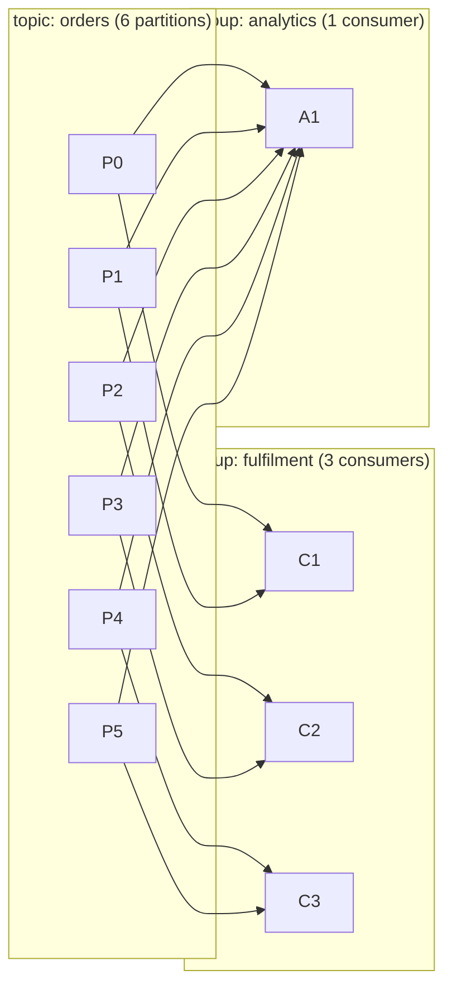
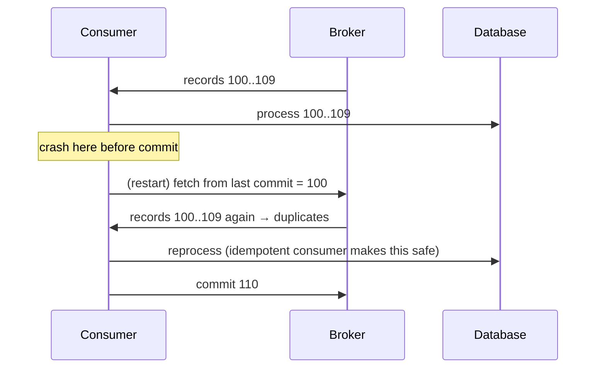
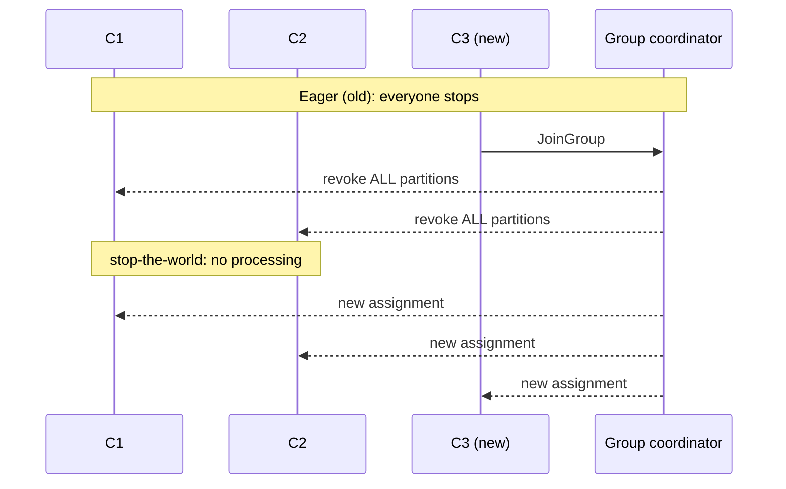

# Consumers: Groups, Rebalancing & Offset Management

!!! abstract "TL;DR"
    - A **consumer group** shares a topic's partitions: **each partition goes to exactly one consumer in the group**. More consumers than partitions means idle consumers.
    - Consumers **pull** with `poll()`. Progress is the **committed offset** per partition, stored in `__consumer_offsets`.
    - **Commit after processing = at-least-once** (duplicates possible). Commit before processing = at-most-once (loss possible).
    - **Rebalancing** reassigns partitions when members join or leave or time out. Eager rebalances stop the world. **Cooperative sticky** and the **new KIP-848 protocol (GA in Kafka 4.0)** make them incremental.
    - Two liveness timers: `session.timeout.ms` (heartbeats, 45s) and `max.poll.interval.ms` (time between polls, 5 min). Slow processing → rebalance.

## Why it matters

Duplicates, lag, "stuck" consumers, rebalance storms and lost messages are almost always consumer-side issues. Interviewers probe this heavily for anyone claiming Kafka production experience.

## Core concepts

### Consumer groups


*Notice that each group gets every record, while within a group each partition has exactly one owner. Groups are independent: analytics being slow doesn't affect fulfilment.*

### The poll loop

```java
try (var consumer = new KafkaConsumer<String, String>(props)) {
    consumer.subscribe(List.of("orders"));
    while (running) {
        var records = consumer.poll(Duration.ofMillis(500));   // fetch + heartbeat-related bookkeeping
        for (var r : records) {
            process(r);                                        // must finish well within max.poll.interval.ms
        }
        consumer.commitSync();                                 // commit AFTER processing → at-least-once
    }
}
```

- `KafkaConsumer` is **not thread-safe**: one consumer per thread.
- `max.poll.records` (default 500) bounds records per poll, which is the main lever to keep processing under `max.poll.interval.ms`.
- `auto.offset.reset` decides where a **new group** starts: `latest` (default) or `earliest`. It applies only when no committed offset exists or it's out of range.

### Offset commits and delivery semantics


*Notice that committing after processing never loses data but can replay a batch. That's why idempotent consumers matter.*

| Strategy | Mechanism | Semantics |
|---|---|---|
| Auto-commit (`enable.auto.commit=true`, every 5s) | Committed on `poll()` for records returned *previously* | At-least-once if you finish processing before the next poll; risky with async hand-off |
| Manual sync after processing | `commitSync()` | At-least-once, simple |
| Manual async | `commitAsync()` + `commitSync()` on shutdown/revoke | At-least-once, faster |
| Commit before processing | Commit, then process | At-most-once |
| Store offsets with results atomically | Offsets in the same DB transaction, `seek()` on assignment | Effectively exactly-once to the DB |

!!! warning "The async hand-off trap"
    If `process()` hands records to another thread pool and returns immediately, auto-commit (or a commit after the loop) can commit offsets for work that hasn't finished. If the pod dies, those records are **lost**.

### Liveness: two different timeouts

| Config | Default | Detects | On breach |
|---|---|---|---|
| `heartbeat.interval.ms` | 3s | — | Background heartbeat thread |
| `session.timeout.ms` | 45s | Process dead / network partition | Member removed → rebalance |
| `max.poll.interval.ms` | 300s | Process alive but **stuck or slow** | Member leaves group → rebalance; its commits fail with `CommitFailedException` |

### Rebalancing protocols


*Notice that with eager rebalancing every consumer stops, even those whose partitions don't move. In large groups with frequent deploys this means repeated stalls.*

| Protocol | How it works | Impact |
|---|---|---|
| **Eager** (Range/RoundRobin) | Revoke everything, reassign | Full stop on every change |
| **Cooperative sticky** (incremental) | Only the moving partitions are revoked, over 2 rounds | Others keep processing |
| **KIP-848 "consumer" protocol** (GA in Kafka 4.0, `group.protocol=consumer`) | **Broker-side** assignment, incremental, no global sync barrier | Faster, simpler clients, far fewer stalls |
| **Static membership** (`group.instance.id`) | A restarted member with the same ID gets its partitions back without a rebalance (within the session timeout) | Great for rolling deploys on Kubernetes (StatefulSet pod names) |

### Lag

**Consumer lag** = log end offset − committed offset, per partition. It's *the* key consumer health metric. Rising lag means consumers can't keep up, are stuck on a record, or are rebalancing repeatedly.

## In practice: code & configuration

```yaml
spring:
  kafka:
    consumer:
      group-id: fulfilment
      auto-offset-reset: earliest        # a new group starts at the beginning (choose deliberately)
      enable-auto-commit: false          # Spring manages commits (its default when unset)
      max-poll-records: 200
      properties:
        max.poll.interval.ms: 300000
        session.timeout.ms: 45000
        partition.assignment.strategy: org.apache.kafka.clients.consumer.CooperativeStickyAssignor
        group.instance.id: ${HOSTNAME}   # static membership (stable pod names, e.g. StatefulSet)
        # Kafka 4.x brokers + clients: opt in to the new protocol instead
        # group.protocol: consumer
    listener:
      ack-mode: record                   # or batch (default); manual for explicit control
      concurrency: 3                     # 3 consumer threads; useful up to the partition count
```

=== "❌ Common mistake"
    ```java
    @KafkaListener(topics = "orders")
    void onOrder(Order o) {
        executor.submit(() -> service.process(o));  // returns immediately → offset committed
    }                                                // → crash = lost orders
    ```

=== "✅ Correct approach"
    ```java
    @KafkaListener(topics = "orders", concurrency = "6")   // parallelism via partitions, not a thread pool
    void onOrder(Order o) {
        service.process(o);                                // finishes before the offset is committed
    }
    ```

Manual acknowledgement when you need control:

```java
@KafkaListener(topics = "orders", containerFactory = "manualAckFactory")
void onOrder(ConsumerRecord<String, Order> rec, Acknowledgment ack) {
    service.process(rec.value());
    ack.acknowledge();     // commit only after success
}
```

Rewind a group (ops), e.g. after fixing a bug:

```bash
kafka-consumer-groups.sh --bootstrap-server broker:9092 --group fulfilment \
  --topic orders --reset-offsets --to-datetime 2026-10-01T00:00:00.000 --execute   # group must be inactive
kafka-consumer-groups.sh --bootstrap-server broker:9092 --describe --group fulfilment   # shows lag
```

## Real-world usage

- **Kubernetes deployments** trigger rebalances on every rolling update. Teams use static membership and cooperative assignors (or KIP-848) to avoid stalls during deploys.
- **Parallel processing beyond partition count:** Confluent's Parallel Consumer processes per-key in parallel while tracking offsets safely, for when you can't add partitions.
- **Classic incident:** a downstream API slows to 2s per call. With `max.poll.records=500`, a batch takes ~16 minutes, beyond `max.poll.interval.ms`. The consumer is kicked out, its batch is re-delivered to another member, which also times out: a **rebalance storm** with zero progress. Fix: smaller `max.poll.records`, timeouts on downstream calls, pause/resume, or async processing with proper offset tracking.

## Trade-offs & production gotchas

| Choice | Pro | Con |
|---|---|---|
| Auto-commit | Simple | Possible loss with async processing; possible duplicates |
| Manual per record | Precise | More commit overhead |
| Manual per batch | Efficient | Larger replay window on failure |
| Big `max.poll.records` | Throughput | Risk exceeding `max.poll.interval.ms` |
| More consumers | Throughput | Useless beyond the partition count |

!!! warning "Gotchas"
    - `auto.offset.reset=latest` on a new group **skips existing data**. For a new service reading history, use `earliest`.
    - Committed offsets expire after `offsets.retention.minutes` (7 days) once a group is empty, so a long-stopped group may restart from `auto.offset.reset`.
    - `CommitFailedException` usually means you exceeded `max.poll.interval.ms` and were already rebalanced out.
    - Never share a `KafkaConsumer` across threads.

## How this connects to my experience

- **Where I used it:** Kafka consumers in the OptumRx Meteor microservices (Spring Boot).
- **Talking points:**
    - Consumer concurrency matched to partitions; scaling consumers on Kubernetes. *[confirm partition counts/replicas]*
    - Commit strategy (Spring AckMode) and why it gave at-least-once plus idempotency. *[confirm]*
    - Any rebalance or lag issues you diagnosed and fixed. *[confirm — great STAR material]*
- **Likely follow-up chain:** "How did you scale consumers?" → "What happens during a deploy?" → "How do you avoid duplicates on rebalance?" → "How did you monitor lag?"

## Interview questions

### Fundamentals

??? question "Q1. What is a consumer group?"
    **Answer:** A set of consumers sharing a `group.id` that divide a topic's partitions, with each partition consumed by exactly one member. Different groups consume independently with their own offsets. That gives queue semantics within a group and pub/sub across groups.

??? question "Q2. What happens if you have 10 consumers and 6 partitions?"
    **Answer:** 6 consumers get one partition each, and 4 sit idle as hot standbys. To scale beyond that you need more partitions (or per-key parallelism inside a consumer).

??? question "Q3. Where are offsets stored?"
    **Answer:** In the compacted internal topic `__consumer_offsets`, managed by the group coordinator broker. You can also store offsets externally (e.g. in your DB with the results) and `seek()` on assignment.

??? question "Q4. What does auto.offset.reset do?"
    **Answer:** It decides where to start when there's no valid committed offset (new group or expired offset): `earliest`, `latest` (default) or `none` (throw).

### Intermediate

??? question "Q5. At-most-once vs at-least-once on the consumer: how?"
    **Answer:** Commit before processing gives at-most-once (crash after commit = lost). Commit after processing gives at-least-once (crash before commit = reprocessed). At-least-once plus idempotent processing is the standard production choice.

??? question "Q6. Explain session.timeout.ms vs max.poll.interval.ms."
    **Answer:** Session timeout detects dead processes via background heartbeats. Max poll interval detects live-but-stuck processing: if `poll()` isn't called in time, the consumer proactively leaves the group. A slow handler triggers the latter, not the former.

??? question "Q7. What triggers a rebalance and why is it costly?"
    **Answer:** A member joining or leaving (deploys, scaling, crashes), a session or poll timeout, or subscription or partition count changes. With eager protocols all consumers stop and revoke, so processing pauses, in-flight batches may be redelivered (duplicates), and caches tied to partitions are lost.

??? question "Q8. How do cooperative rebalancing, static membership and KIP-848 help?"
    **Answer:** Cooperative sticky moves only the affected partitions, so others keep processing. Static membership lets a restarted pod reclaim its partitions with no rebalance if it returns within the session timeout. KIP-848 (GA in Kafka 4.0) moves assignment to the broker with incremental, non-blocking reconciliation, giving faster and more stable groups.

### Senior

??? question "Q9. Your consumer calls a slow external API. How do you avoid rebalance storms and still scale?"
    **Answer:** Bound processing time: lower `max.poll.records`, set strict timeouts and circuit breakers on the API, and use pause/resume of partitions while waiting. Increase partitions and concurrency if the API can take more load. Or move to per-key parallel processing (Parallel Consumer) or async with careful offset tracking. Push slow retries to retry topics rather than blocking.

??? question "Q10. How do you achieve effectively-exactly-once when consuming into Postgres?"
    **Answer:** Either dedupe (processed-event table with a unique eventId, written in the same transaction as the business update), or store the consumed offsets in the same DB transaction and on partition assignment `seek()` to the stored offset instead of using Kafka commits. Kafka transactions alone don't cover external DBs.

??? question "Q11. Lag spikes every time you deploy. Why, and how do you fix it?"
    **Answer:** Rolling restarts cause repeated eager rebalances: each pod leaving and joining stops the whole group. Fixes: `CooperativeStickyAssignor` or `group.protocol=consumer` (KIP-848), static membership with stable instance IDs, graceful shutdown (commit on revoke), and proper readiness probes so pods don't flap.

### Scenario-based

??? question "Q12. Lag is growing on all partitions. Walk through diagnosis."
    **Answer:** Check whether it's throughput or a stall (is the committed offset moving?). Check for rebalance loops (logs, `--describe --members`). Look at processing time per record and downstream latency, GC pauses and CPU. Are consumers fewer than partitions? Did input traffic spike? Then fix: scale consumers up to the partition count, optimise processing (batching DB writes), add partitions for future traffic, or temporarily shed non-critical work.

??? question "Q13. A bug corrupted data processed over the last 6 hours. How do you reprocess?"
    **Answer:** Deploy the fix. Stop the group, then reset offsets to a timestamp 6 hours back (`--reset-offsets --to-datetime`), or run a separate replay group writing to a corrected sink. This requires topic retention ≥ 6h and idempotent and version-aware consumers so reprocessing doesn't double-apply. Communicate the downstream impact.

## Cheat sheet

| Config | Default | Note |
|---|---|---|
| `enable.auto.commit` | true (Kafka) / false (Spring sets it) | Spring commits via AckMode (default BATCH) |
| `auto.offset.reset` | latest | New group starts at the end |
| `max.poll.records` | 500 | Main lever for poll-interval safety |
| `max.poll.interval.ms` | 300000 | Stuck/slow detection |
| `session.timeout.ms` | 45000 | Dead-process detection |
| `heartbeat.interval.ms` | 3000 | ~1/3 of session timeout |
| Assignor | Range + CooperativeSticky | Prefer cooperative or KIP-848 |
| Parallelism | ≤ partitions | Extra consumers idle |

## Sources

1. [Apache Kafka: Consumer configs](https://kafka.apache.org/documentation/#consumerconfigs): defaults and semantics.
2. [KIP-848: The Next Generation of the Consumer Rebalance Protocol](https://cwiki.apache.org/confluence/display/KAFKA/KIP-848%3A+The+Next+Generation+of+the+Consumer+Rebalance+Protocol): broker-side incremental assignment.
3. [KIP-429: Kafka Consumer Incremental Rebalance Protocol](https://cwiki.apache.org/confluence/display/KAFKA/KIP-429%3A+Kafka+Consumer+Incremental+Rebalance+Protocol): cooperative sticky.
4. [KIP-345: Static membership](https://cwiki.apache.org/confluence/display/KAFKA/KIP-345%3A+Introduce+static+membership+protocol+to+reduce+consumer+rebalances).
5. [Spring for Apache Kafka: Receiving Messages](https://docs.spring.io/spring-kafka/reference/kafka/receiving-messages.html): listener containers, AckMode, concurrency.
6. [Confluent Parallel Consumer](https://github.com/confluentinc/parallel-consumer): per-key parallelism beyond partition count.
