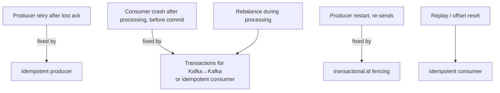
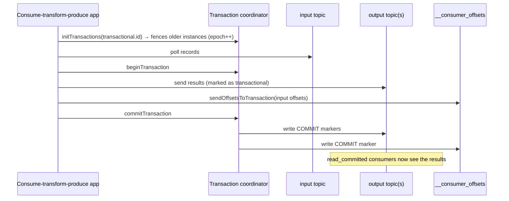
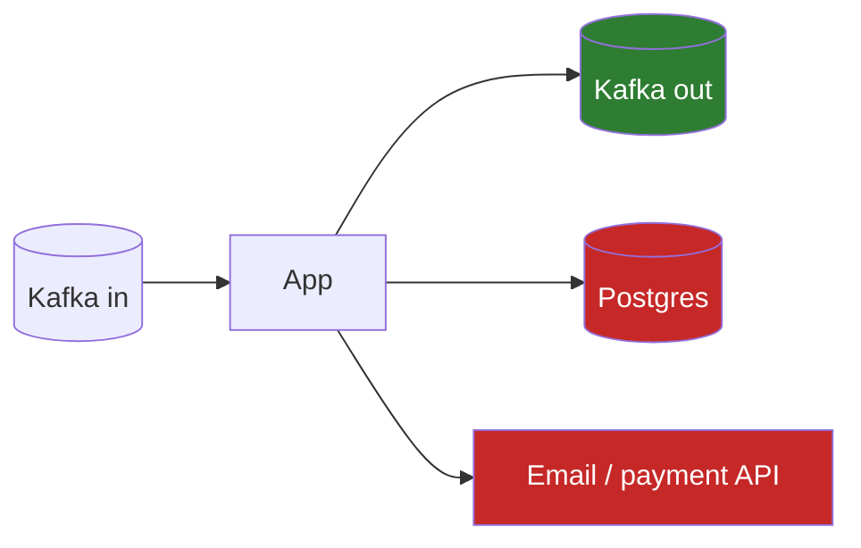

# Delivery Semantics & Kafka Transactions (Exactly-Once)

!!! abstract "TL;DR"
    - **At-most-once:** never duplicated, may be lost. **At-least-once:** never lost, may be duplicated (the default practical choice). **Exactly-once:** each record's *effect* happens once.
    - Kafka's **exactly-once semantics (EOS)** = idempotent producer + **transactions** + consumers using `isolation.level=read_committed`.
    - EOS covers **read-from-Kafka → process → write-to-Kafka** (including the consumer offset commit) **atomically**. It does **not** cover side effects outside Kafka (DB writes, HTTP calls, emails).
    - Outside Kafka, "exactly-once" = **at-least-once + idempotent processing** (or offsets stored atomically with the result).
    - Kafka Streams enables EOS with one setting: `processing.guarantee=exactly_once_v2`.

## Why it matters

"Do you guarantee exactly-once?" is a classic senior trap. The right answer is precise: *exactly-once processing within Kafka via transactions; effectively-once end-to-end via idempotency*. Claiming more signals a lack of production experience.

## Core concepts

### The three semantics

| Semantics | Producer side | Consumer side | Typical use |
|---|---|---|---|
| At-most-once | `acks=0`, no retries | Commit before processing | Metrics, telemetry where loss is fine |
| At-least-once | `acks=all`, retries, idempotence (all three are the producer defaults since Kafka 3.0) | Commit after processing | Most business systems + idempotent consumers |
| Exactly-once | Transactions | `read_committed` + offsets in the transaction | Kafka-to-Kafka pipelines, stream processing |

### Where duplicates come from


*Notice that each duplicate source has a different fix. The idempotent producer alone handles only the first one.*

### How Kafka transactions work


*Notice that the output records and the input offset commit live in the same transaction. Either both become visible or neither does, so a crash can't produce output without the matching offset commit.*

Key mechanics:

- **`transactional.id`**: a stable ID per producer instance (e.g. per input partition or per pod). On `initTransactions()`, the coordinator bumps the **epoch** and **fences** zombie instances with the same ID, so a stuck old instance can't commit.
- **Transaction markers**: commit/abort markers written to every partition involved.
- **`isolation.level=read_committed`** consumers read only committed transactional data and skip aborted records. They read up to the **LSO** (last stable offset). The default `read_uncommitted` sees everything, including aborted records.
- **EOS v2** (KIP-447, clients and brokers 2.5+): one producer per application instance (per stream thread in Kafka Streams) instead of one per input partition, which makes EOS scale. Fencing moves from "one `transactional.id` per input partition" to the **consumer group metadata** (generation / member ID) passed in `sendOffsetsToTransaction(offsets, consumer.groupMetadata())`. In Kafka Streams it shipped as `exactly_once_beta` (2.6), was renamed `exactly_once_v2` in 3.0, and the old `exactly_once` / `exactly_once_beta` values were removed in 4.0.
- **Transaction timeout**: `transaction.timeout.ms` (producer, default 60 s) is how long the coordinator waits before it aborts an open transaction on its own. The broker caps it with `transaction.max.timeout.ms` (default 15 min).
- **Kafka 4.0 (KIP-890, "transactions server-side defense")**: with 4.0+ clients and brokers (`transaction.version=2`) the producer epoch is bumped on **every** transaction, which closes a hole where a late message from a previous transaction could leak into the next one or leave a hanging transaction.

### Where the guarantee ends


*Notice that only the Kafka output is covered by Kafka transactions. The DB write and the API call can still happen twice on retry, so they need idempotency keys, a dedupe table, or the outbox pattern.*

## In practice: code & configuration

### Plain client: consume-transform-produce

```java
producer.initTransactions();
while (running) {
    var records = consumer.poll(Duration.ofMillis(200));
    if (records.isEmpty()) continue;
    producer.beginTransaction();
    try {
        for (var r : records) {
            producer.send(new ProducerRecord<>("rx-enriched", r.key(), enrich(r.value())));
        }
        producer.sendOffsetsToTransaction(nextOffsets(records), consumer.groupMetadata());
        producer.commitTransaction();
    } catch (ProducerFencedException | OutOfOrderSequenceException | AuthorizationException e) {
        producer.close();          // fatal: e.g. another instance took over. Do NOT call abortTransaction()
        throw e;
    } catch (KafkaException e) {
        producer.abortTransaction();
        rewindToLastCommitted(consumer);   // seek back to the last committed offsets, then reprocess the batch
    }
}
```

`nextOffsets(...)` and `rewindToLastCommitted(...)` are your own helpers: the first builds a `Map<TopicPartition, OffsetAndMetadata>` with **last processed offset + 1** per partition, the second calls `consumer.seek(...)` to the last committed position (without it, the next `poll()` continues *after* the aborted batch and those records are lost). The consumer must run with `enable.auto.commit=false` and `isolation.level=read_committed`, and the producer needs a `transactional.id`. Always pass `consumer.groupMetadata()`: the old `sendOffsetsToTransaction(offsets, groupIdString)` overload was removed in Kafka 4.0.

### Spring Kafka

```yaml
spring:
  kafka:
    producer:
      transaction-id-prefix: rx-enricher-${HOSTNAME}-   # enables transactions; must be UNIQUE per app instance (EOS v2)
    consumer:
      isolation-level: read_committed
      enable-auto-commit: false
```

```java
@KafkaListener(topics = "rx-raw")
public void enrich(RxEvent e) {
    // The listener container starts a Kafka transaction; sends + the offset commit are atomic.
    kafkaTemplate.send("rx-enriched", e.id(), enricher.enrich(e));
}
```

With Spring Boot, setting `transaction-id-prefix` is enough: Boot auto-configures a `KafkaTransactionManager` and wires it into the listener container factory, so the container begins the transaction before calling the listener and sends the offsets to it afterwards. If you build the container factory by hand, you must set the transaction manager on its `ContainerProperties` yourself, otherwise the listener is **not** transactional. Once the prefix is set, `KafkaTemplate` sends *outside* a transaction (e.g. from a REST controller) fail unless you wrap them in `@Transactional` or `kafkaTemplate.executeInTransaction(...)`.

=== "❌ Common mistake"
    ```java
    @Transactional                                 // assumes a DB tx + Kafka tx = exactly-once
    @KafkaListener(topics = "payments")
    void onPayment(PaymentEvent e) {
        ledgerRepo.save(debit(e));                 // DB commit and Kafka commit are separate:
        kafkaTemplate.send("ledger", e.id(), ...); // a crash between them → duplicate debit on replay
    }
    ```

=== "✅ Correct approach"
    ```java
    @Transactional                                         // DB transaction
    @KafkaListener(topics = "payments")
    void onPayment(PaymentEvent e) {
        if (!processed.tryInsert(e.eventId())) return;     // dedupe (unique constraint) in the same DB tx
        ledgerRepo.save(debit(e));
        outbox.save(LedgerEvent.of(e));                    // publish via outbox, not directly
    }
    ```

### Kafka Streams

```java
props.put(StreamsConfig.PROCESSING_GUARANTEE_CONFIG, StreamsConfig.EXACTLY_ONCE_V2);
```

## Real-world usage

- **Stream processing** (Kafka Streams, Flink with Kafka sinks) uses transactions for exactly-once aggregations, e.g. "claims per provider per hour" without double counting.
- **Payments and ledgers** don't rely on Kafka EOS across the DB boundary. They use **idempotency keys** (the Stripe pattern), dedupe tables and reconciliation jobs.
- **Cost:** transactions add latency (commit markers, coordinator round-trips) and complexity. Many teams choose at-least-once + idempotent consumers as the simpler, more robust default.

## Trade-offs & production gotchas

| Approach | Guarantees (pros) | Cost (cons) | Use when |
|---|---|---|---|
| At-most-once | No duplicates, lowest latency | Data loss on any failure | Metrics / telemetry where a gap is acceptable |
| At-least-once + idempotent consumer | Effectively-once for your side effects, works with any sink | Dedupe store, careful design | Side effects live outside Kafka (DB, APIs). The usual default |
| Kafka transactions (EOS) | Exactly-once Kafka→Kafka, atomic multi-partition writes | Latency, complexity, `read_committed` consumers required | Pure Kafka→Kafka pipelines, Kafka Streams aggregations |
| Offsets stored in the DB with results | Exactly-once into that DB | Custom rebalance and seek handling | One transactional sink and you control the consumer |

!!! warning "Gotchas"
    - Downstream consumers on `read_uncommitted` (the default) **will see aborted records**. Set `read_committed`.
    - A long-open transaction blocks `read_committed` consumers at the LSO, so lag appears even though data is there.
    - Transactions **don't make HTTP calls or DB writes exactly-once**.
    - Reusing a `transactional.id` across *different* logical producers causes fencing errors. In Spring Kafka the `transaction-id-prefix` must differ per application instance.
    - Transaction markers occupy offsets, so offsets in a transactional topic are **not consecutive**. Don't compute "message count" as `endOffset - startOffset`, and expect lag metrics to never look perfectly "clean".
    - If processing a batch takes longer than `transaction.timeout.ms` (default 60 s), the coordinator aborts the transaction and the commit fails. Keep batches small (`max.poll.records`) or raise the timeout (up to the broker's `transaction.max.timeout.ms`).
    - `@Transactional` on a listener with both a DB and a Kafka transaction is **not** atomic. It is two commits in sequence (best-effort 1PC), so the DB side must still be idempotent.

## How this connects to my experience

- **Where I used it:** Publicis Sapient, OptumRx Meteor project: "Designed Kafka-based event-driven workflows with retry and DLQ handling" (microservices on Java, Spring Boot, Kafka, MongoDB, Redis, GraphQL). Retries and DLQ replays re-deliver events, which is exactly where duplicates come from, so delivery semantics is the natural follow-up to that bullet.
- **Talking points:**
    - Chose at-least-once + idempotent consumers (vs Kafka transactions) because side effects were in MongoDB and downstream APIs. *[confirm]*
    - How duplicates were made harmless: eventId dedupe, upserts, version checks. *[confirm]*
    - Whether any producer in the project used `transactional.id` / Kafka transactions, or whether everything was at-least-once. *[confirm]*
    - How the DLQ replay path avoided double-applying events that had partly succeeded before failing. *[confirm]*
- **Likely follow-up chain:** "Did you use exactly-once?" → "Why not?" / "How?" → "What about the MongoDB write?" → "How did you test it?"

## Interview questions

### Fundamentals

??? question "Q1. Define at-most-once, at-least-once and exactly-once."
    **Answer:** At-most-once: a record is processed zero or one times (loss possible). You get it by committing the offset before processing, or producing with `acks=0` and no retries. At-least-once: one or more times (duplicates possible). You get it by committing after processing and retrying sends. Exactly-once: the record's *effect* is applied once even with retries and failures. Nothing is literally delivered once over an unreliable network. In practice it is achieved inside a system boundary, via transactions (Kafka→Kafka) or idempotent processing (everything else).

    **Interviewer listens for:** The commit-before vs commit-after-processing distinction, and "effect once" rather than "delivered once".

    **Common wrong answer:** "Exactly-once means the broker sends the message only one time."

??? question "Q2. Does the idempotent producer give exactly-once?"
    **Answer:** Only against duplicate writes from producer retries, within one producer session, per partition. The broker dedupes on producer ID + epoch + per-partition sequence number. It doesn't cover consumer reprocessing after a crash, producer restarts (a new producer ID is assigned unless a `transactional.id` is used), or atomic writes across partitions. That needs transactions. It has been on by default since Kafka 3.0 (`enable.idempotence=true`, which requires `acks=all`).

    **Interviewer listens for:** PID + sequence number, "per partition, per session", and the clear line between idempotence and transactions.

    **Common wrong answer:** "Yes, `enable.idempotence=true` is exactly-once." It only removes retry duplicates on the produce side.

??? question "Q3. What does isolation.level=read_committed do?"
    **Answer:** The consumer returns only records from committed transactions (and non-transactional ones), skips aborted records, and reads up to the last stable offset (LSO), the offset of the first still-open transaction. The default `read_uncommitted` returns everything, including records from aborted or still-open transactions. It is a consumer setting, so every downstream consumer has to opt in.

    **Interviewer listens for:** LSO, "default is read_uncommitted", and that an open transaction stalls read_committed readers on that partition.

    **Common wrong answer:** "Aborted records are deleted from the log." They stay in the log. Consumers filter them using the abort markers.

### Intermediate

??? question "Q4. How do Kafka transactions achieve exactly-once for consume-process-produce?"
    **Answer:** The producer writes output records and the consumer's offsets (`sendOffsetsToTransaction`) in one transaction managed by the transaction coordinator, whose state is persisted in the `__transaction_state` topic. On commit the coordinator first durably logs the decision (prepare-commit), then writes commit markers to every partition involved, including `__consumer_offsets`. So the outcome is all-or-nothing even though the markers themselves are written partition by partition. A crash before commit means the transaction is aborted (by the new instance's `initTransactions()` or by the timeout), the offsets were never committed, and the input is re-consumed. `transactional.id` plus epochs fence zombie producers. Downstream consumers must use `read_committed`.

    **Interviewer listens for:** Offsets being part of the transaction, the coordinator + `__transaction_state`, markers, fencing, and `read_committed` downstream.

    **Common wrong answer:** "The consumer commits offsets with `commitSync()` after `commitTransaction()`." That reintroduces the gap between output and offset commit.

??? question "Q5. What is zombie fencing?"
    **Answer:** If an instance hangs (GC pause, network partition) and a replacement takes over with the same `transactional.id`, `initTransactions()` bumps the epoch and aborts any transaction the old instance left open. The old instance's later writes or commits are rejected with `ProducerFencedException` (fatal: close the producer), preventing duplicate output. With EOS v2 (KIP-447) one producer serves many input partitions, so fencing for consume-transform-produce also relies on the consumer group metadata passed to `sendOffsetsToTransaction`: a member from an old group generation can't commit offsets.

    **Interviewer listens for:** Epoch bump on `initTransactions()`, the exception being fatal, and awareness that EOS v2 fences via group metadata.

    **Common wrong answer:** "The consumer group rebalance already prevents this." A rebalance stops the zombie from *polling*, not from *producing* what it already holds in memory.

??? question "Q6. Why can't Kafka transactions include my Postgres write?"
    **Answer:** The transaction coordinator only controls Kafka partitions. Kafka does not act as an XA resource, so there is no built-in two-phase commit spanning Kafka and an external database (KIP-939 is adding the ability for Kafka to participate in an externally coordinated 2PC, but don't rely on it as generally available *[confirm current status]*). Use the outbox pattern, dedupe tables, or store offsets in the DB together with the result.

    **Interviewer listens for:** "No XA / no shared coordinator", then a concrete alternative (outbox, idempotent consumer, offsets in the DB).

    **Common wrong answer:** "Put `@Transactional` on the listener and Spring makes both atomic."

??? question "Q7. In Spring Kafka, a listener writes to a database and sends to Kafka. What happens with `@Transactional`, and is it atomic?"
    **Answer:** No. With `spring.kafka.producer.transaction-id-prefix` set, the listener container starts the Kafka transaction (via `KafkaTransactionManager`), and `@Transactional` on the method starts the DB transaction inside it. The DB transaction commits first when the method returns, then the container sends the offsets and commits the Kafka transaction. If the app dies between the two commits, the DB change is there but the Kafka transaction aborts, so the record is redelivered and the DB write runs again. So the DB write must be idempotent (dedupe on event ID, upsert). `ChainedKafkaTransactionManager` did the same best-effort sequencing and has been deprecated since Spring Kafka 2.7. For a real guarantee use the outbox pattern: one DB transaction, and a relay (or CDC) publishes to Kafka.

    **Interviewer listens for:** Commit order (DB first, then Kafka), "best-effort 1PC, not XA", idempotent DB writes, outbox.

    **Common wrong answer:** "Spring synchronises the two transactions, so it's exactly-once."

### Senior

??? question "Q8. Design exactly-once crediting of reward points from a Kafka stream into Postgres."
    **Answer:** Consume at-least-once. In one DB transaction: insert the eventId into a `processed_events` table (unique constraint) and update points with a version check, then commit. A duplicate fails the unique insert and is skipped (and its offset is still committed). Commit the Kafka offset after the DB commit. Alternatively store offsets in the same DB transaction and seek to them in `ConsumerRebalanceListener.onPartitionsAssigned`. The event ID must come from the producer (a business ID), not topic-partition-offset, or a re-published event is treated as new. Bound the dedupe table with a retention window longer than the maximum replay window. Add reconciliation against the source for audit.

    **Interviewer listens for:** Dedupe and business write in the *same* DB transaction, a stable producer-assigned ID, dedupe-table retention, reconciliation.

    **Common wrong answer:** "Enable Kafka transactions on the consumer." Kafka transactions don't cover Postgres.

??? question "Q9. What are the performance costs of EOS and how do you limit them?"
    **Answer:** Extra round-trips to the coordinator (register partitions, add offsets, end transaction), commit markers on every partition touched, and the LSO holding back `read_committed` consumers, so end-to-end latency is at least the transaction duration. The cost is per transaction, not per record, so mitigate with larger transactions (commit per batch, not per record, balanced against latency; Kafka Streams uses `commit.interval.ms`, which defaults to 100 ms under EOS), EOS v2 (far fewer producers), and a sensible `transaction.timeout.ms`.

    **Interviewer listens for:** "Overhead is per transaction", the latency-vs-batch-size trade-off, and that consumers only see data after commit.

    **Common wrong answer:** "EOS halves throughput." With reasonable batch sizes the throughput overhead is small. The visible cost is latency.

??? question "Q10. A consumer on read_committed shows lag but no new data arrives. Why?"
    **Answer:** An open (hung or slow) transaction is holding the last stable offset back, so committed data behind it can't be read. Find it with the `kafka-transactions.sh` tool (KIP-664: `describe-producers` on the partition, `find-hanging` on the broker), then fix the producer, let it time out (`transaction.timeout.ms`, default 60 s), or `abort` the hanging transaction with the same tool. Genuine hanging transactions (ones the coordinator no longer knows about) were a known bug class that KIP-890 in Kafka 4.0 addresses.

    **Interviewer listens for:** LSO, a way to find the offending producer, and the timeout as the normal safety net.

    **Common wrong answer:** "The consumer is slow, add partitions or consumers."

??? question "Q11. How do you choose `transactional.id`, and what changed with EOS v2?"
    **Answer:** It must be stable across restarts of the *same logical producer* (so the restart fences its predecessor and aborts its open transaction) and unique across concurrently running producers (or they fence each other). Before KIP-447 the only safe scheme for consume-transform-produce was one producer per input partition, with the ID derived from group + topic + partition, so that after a rebalance the new owner fenced the old one. That meant one producer (and its connections and buffers) per partition. With EOS v2 the offsets commit carries the consumer group metadata, the group coordinator rejects commits from stale generations, and one producer per instance is enough. The ID just needs to be unique per instance, e.g. a prefix plus the pod's stable identity (a StatefulSet ordinal works well). Spring Kafka builds it as `transaction-id-prefix + n`, and the prefix must differ per instance.

    **Interviewer listens for:** "Stable per logical producer, unique across live producers", and why v2 removed the per-partition producer.

    **Common wrong answer:** "Use a random UUID each start." Then a restart never fences the old instance, and its open transaction blocks readers until it times out.

### Scenario-based

??? question "Q12. The product owner demands 'exactly-once notifications'. What do you say and build?"
    **Answer:** Explain that delivery to external systems (SMS/email) can't be exactly-once: you can't atomically know the provider sent it and record that. Build effectively-once: an idempotency key per notification (eventId + channel), a dedupe store checked before sending, the provider's idempotency API if available, and record the send result. Accept a tiny duplicate risk window and document it. Also ask which failure is worse for the business, a duplicate or a missed notification, because that decides whether you record "sent" before or after calling the provider.

    **Interviewer listens for:** Honest limits, idempotency keys, and turning the requirement into a business trade-off.

    **Common wrong answer:** "We'll turn on Kafka exactly-once."

??? question "Q13. You enabled transactions but downstream services still see 'phantom' records from failed batches."
    **Answer:** The downstream consumers use the default `read_uncommitted`. Set `isolation.level=read_committed` on them (in Spring: `spring.kafka.consumer.isolation-level=read_committed`). This is a setting on each consumer, not on the topic, so check every consuming team, plus connectors and stream jobs.

    **Interviewer listens for:** Knowing the default, and that isolation is per consumer.

    **Common wrong answer:** "The producer's abort didn't work." The abort worked. The readers just aren't filtering.

??? question "Q14. Your transactional consumer-producer does a slow enrichment call per record. In production you see `ProducerFencedException` or `InvalidProducerEpochException` and duplicate work, but only one instance is running. What's going on?"
    **Answer:** The batch takes longer than `transaction.timeout.ms` (default 60 s). The coordinator aborts the transaction and bumps the epoch, so the producer's commit is rejected and the batch is reprocessed, often timing out again. A second cause is exceeding `max.poll.interval.ms` (default 5 min): the group rebalances and the offsets commit is rejected for a stale generation. Fixes: lower `max.poll.records` so a batch fits comfortably inside the timeout, raise `transaction.timeout.ms` (bounded by the broker's `transaction.max.timeout.ms`, default 15 min, and it lengthens how long a crashed producer blocks `read_committed` readers), make the enrichment faster (cache, bulk call, timeouts), and move slow or failing records to a retry topic or DLQ instead of holding the transaction open.

    **Interviewer listens for:** The two timeouts and how they interact, batch sizing, and the cost of simply raising the timeout.

    **Common wrong answer:** "Another instance has the same `transactional.id`." Possible, but with one instance the timeout is the cause.

## Cheat sheet

| Concept | Remember |
|---|---|
| Practical default | At-least-once + idempotent consumers |
| EOS = | Idempotent producer + transactions + read_committed |
| EOS covers | Kafka → Kafka (incl. offsets) |
| EOS doesn't cover | DBs, APIs, emails |
| Fencing | `transactional.id` + epoch |
| Streams | `processing.guarantee=exactly_once_v2` |
| Consumer default | `read_uncommitted` (sees aborted data) |
| `transaction.timeout.ms` | Default 60 s, capped by broker `transaction.max.timeout.ms` (15 min) |
| Spring Boot switch | `spring.kafka.producer.transaction-id-prefix` (unique per instance) |
| DB + Kafka in Spring | Two commits in sequence (DB first), not atomic → idempotent DB write or outbox |
| Kafka 4.0 | KIP-890: epoch bump per transaction. Streams keeps only `exactly_once_v2` |
| Hung transaction tooling | `kafka-transactions.sh` (`describe-producers`, `find-hanging`, `abort`) |

## Sources

1. [Apache Kafka documentation: Design, Message Delivery Semantics](https://kafka.apache.org/documentation/#semantics): the three semantics, idempotent producer, transactions and `read_committed`.
2. [KIP-98: Exactly Once Delivery and Transactional Messaging](https://cwiki.apache.org/confluence/display/KAFKA/KIP-98+-+Exactly+Once+Delivery+and+Transactional+Messaging): transaction coordinator, markers, epochs, LSO.
3. [KIP-447: Producer scalability for exactly once semantics](https://cwiki.apache.org/confluence/display/KAFKA/KIP-447%3A+Producer+scalability+for+exactly+once+semantics): EOS v2, fencing via consumer group metadata.
4. [Confluent: Exactly-once Semantics Are Possible: Here's How Kafka Does It](https://www.confluent.io/blog/exactly-once-semantics-are-possible-heres-how-apache-kafka-does-it/): overview and scope of the guarantee.
5. [Spring for Apache Kafka: Transactions](https://docs.spring.io/spring-kafka/reference/kafka/transactions.html): `transaction-id-prefix`, Boot auto-configuration, DB + Kafka commit order, `ChainedKafkaTransactionManager` deprecation.
6. [Apache Kafka 4.0: Transaction Protocol](https://kafka.apache.org/40/operations/transaction-protocol/): KIP-890 and `transaction.version`.
7. [KIP-664: Provide tooling to detect and abort hanging transactions](https://cwiki.apache.org/confluence/display/KAFKA/KIP-664:+Provide+tooling+to+detect+and+abort+hanging+transactions): `kafka-transactions.sh`.
