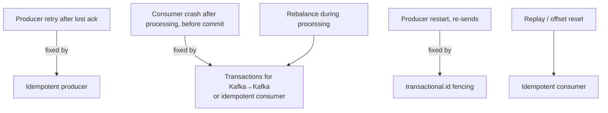
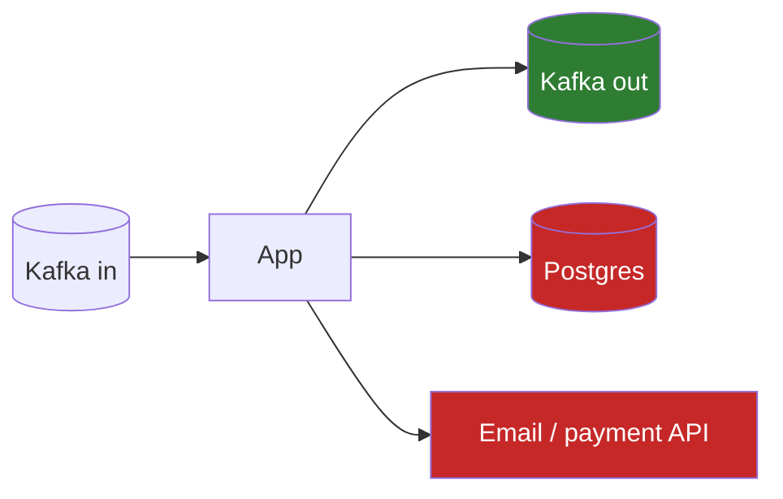

# Delivery Semantics & Kafka Transactions (Exactly-Once)

!!! abstract "TL;DR"
    - **At-most-once:** never duplicated, may be lost. **At-least-once:** never lost, may be duplicated (the default practical choice). **Exactly-once:** each record's *effect* happens once.
    - Kafka's **exactly-once semantics (EOS)** = idempotent producer + **transactions** + consumers using `isolation.level=read_committed`.
    - EOS covers **read-from-Kafka → process → write-to-Kafka** (including the consumer offset commit) **atomically**. It does **not** cover side effects outside Kafka (DB writes, HTTP calls, emails).
    - Outside Kafka, "exactly-once" = **at-least-once + idempotent processing** (or offsets stored atomically with the result).
    - Kafka Streams enables EOS with one setting: `processing.guarantee=exactly_once_v2`.

## Why it matters

"Do you guarantee exactly-once?" is a classic senior trap. The right answer is precise: *exactly-once processing within Kafka via transactions; effectively-once end-to-end via idempotency*. Claiming more signals a lack of production experience.

## Core concepts

### The three semantics

| Semantics | Producer side | Consumer side | Typical use |
|---|---|---|---|
| At-most-once | `acks=0`, no retries | Commit before processing | Metrics, telemetry where loss is fine |
| At-least-once | `acks=all`, retries, idempotence | Commit after processing | Most business systems + idempotent consumers |
| Exactly-once | Transactions | `read_committed` + offsets in the transaction | Kafka-to-Kafka pipelines, stream processing |

### Where duplicates come from


*Notice that each duplicate source has a different fix. The idempotent producer alone handles only the first one.*

### How Kafka transactions work

```mermaid
sequenceDiagram
    participant App as Consume-transform-produce app
    participant TC as Transaction coordinator
    participant In as input topic
    participant Out as output topic(s)
    participant Off as __consumer_offsets
    App->>TC: initTransactions(transactional.id) → fences older instances (epoch++)
    App->>In: poll records
    App->>TC: beginTransaction
    App->>Out: send results (marked as transactional)
    App->>Off: sendOffsetsToTransaction(input offsets)
    App->>TC: commitTransaction
    TC->>Out: write COMMIT markers
    TC->>Off: write COMMIT marker
    Note over Out: read_committed consumers now see the results
```
*Notice that the output records and the input offset commit live in the same transaction. Either both become visible or neither does, so a crash can't produce output without the matching offset commit.*

Key mechanics:

- **`transactional.id`**: a stable ID per producer instance (e.g. per input partition or per pod). On `initTransactions()`, the coordinator bumps the **epoch** and **fences** zombie instances with the same ID, so a stuck old instance can't commit.
- **Transaction markers**: commit/abort markers written to every partition involved.
- **`isolation.level=read_committed`** consumers read only committed transactional data and skip aborted records. They read up to the **LSO** (last stable offset). The default `read_uncommitted` sees everything, including aborted records.
- **EOS v2** (KIP-447, Kafka 2.6+): one producer per application instance instead of per input partition, which makes EOS scale.

### Where the guarantee ends


*Notice that only the Kafka output is covered by Kafka transactions. The DB write and the API call can still happen twice on retry, so they need idempotency keys, a dedupe table, or the outbox pattern.*

## In practice: code & configuration

### Plain client: consume-transform-produce

```java
producer.initTransactions();
while (running) {
    var records = consumer.poll(Duration.ofMillis(200));
    if (records.isEmpty()) continue;
    producer.beginTransaction();
    try {
        for (var r : records) {
            producer.send(new ProducerRecord<>("rx-enriched", r.key(), enrich(r.value())));
        }
        producer.sendOffsetsToTransaction(nextOffsets(records), consumer.groupMetadata());
        producer.commitTransaction();
    } catch (ProducerFencedException | OutOfOrderSequenceException e) {
        producer.close();          // fatal: another instance took over
        throw e;
    } catch (KafkaException e) {
        producer.abortTransaction();
        rewindToLastCommitted(consumer);   // reprocess the batch
    }
}
```

### Spring Kafka

```yaml
spring:
  kafka:
    producer:
      transaction-id-prefix: rx-enricher-     # enables transactions on KafkaTemplate
    consumer:
      isolation-level: read_committed
      enable-auto-commit: false
```

```java
@KafkaListener(topics = "rx-raw")
public void enrich(RxEvent e) {
    // The listener container starts a Kafka transaction; sends + the offset commit are atomic.
    kafkaTemplate.send("rx-enriched", e.id(), enricher.enrich(e));
}
```

=== "❌ Common mistake"
    ```java
    @Transactional                                 // assumes a DB tx + Kafka tx = exactly-once
    @KafkaListener(topics = "payments")
    void onPayment(PaymentEvent e) {
        ledgerRepo.save(debit(e));                 // DB commit and Kafka commit are separate:
        kafkaTemplate.send("ledger", e.id(), ...); // a crash between them → duplicate debit on replay
    }
    ```

=== "✅ Correct approach"
    ```java
    @Transactional                                         // DB transaction
    @KafkaListener(topics = "payments")
    void onPayment(PaymentEvent e) {
        if (!processed.tryInsert(e.eventId())) return;     // dedupe (unique constraint) in the same DB tx
        ledgerRepo.save(debit(e));
        outbox.save(LedgerEvent.of(e));                    // publish via outbox, not directly
    }
    ```

### Kafka Streams

```java
props.put(StreamsConfig.PROCESSING_GUARANTEE_CONFIG, StreamsConfig.EXACTLY_ONCE_V2);
```

## Real-world usage

- **Stream processing** (Kafka Streams, Flink with Kafka sinks) uses transactions for exactly-once aggregations, e.g. "claims per provider per hour" without double counting.
- **Payments and ledgers** don't rely on Kafka EOS across the DB boundary. They use **idempotency keys** (the Stripe pattern), dedupe tables and reconciliation jobs.
- **Cost:** transactions add latency (commit markers, coordinator round-trips) and complexity. Many teams choose at-least-once + idempotent consumers as the simpler, more robust default.

## Trade-offs & production gotchas

| Approach | Guarantees | Cost |
|---|---|---|
| At-least-once + idempotent consumer | Effectively-once for your side effects | Dedupe store, careful design |
| Kafka transactions (EOS) | Exactly-once Kafka→Kafka | Latency, complexity, `read_committed` consumers required |
| Offsets stored in the DB with results | Exactly-once into that DB | Custom rebalance and seek handling |

!!! warning "Gotchas"
    - Downstream consumers on `read_uncommitted` (the default) **will see aborted records**. Set `read_committed`.
    - A long-open transaction blocks `read_committed` consumers at the LSO, so lag appears even though data is there.
    - Transactions **don't make HTTP calls or DB writes exactly-once**.
    - Reusing a `transactional.id` across *different* logical producers causes fencing errors.

## How this connects to my experience

- **Where I used it:** Kafka workflows at OptumRx with retry/DLQ. Duplicates matter there because retries replay events.
- **Talking points:**
    - Chose at-least-once + idempotent consumers (vs Kafka transactions) because side effects were in MongoDB and downstream APIs. *[confirm]*
    - How duplicates were made harmless: eventId dedupe, upserts, version checks. *[confirm]*
- **Likely follow-up chain:** "Did you use exactly-once?" → "Why not?" / "How?" → "What about the MongoDB write?" → "How did you test it?"

## Interview questions

### Fundamentals

??? question "Q1. Define at-most-once, at-least-once and exactly-once."
    **Answer:** At-most-once: a record is processed zero or one times (loss possible). At-least-once: one or more times (duplicates possible). Exactly-once: its effect is applied once even with retries and failures. In practice that's achieved within a system boundary via transactions or idempotency.

??? question "Q2. Does the idempotent producer give exactly-once?"
    **Answer:** Only against duplicate writes from producer retries, within one producer session, per partition. It doesn't cover consumer reprocessing after a crash, producer restarts, or atomic writes across partitions. That needs transactions.

??? question "Q3. What does isolation.level=read_committed do?"
    **Answer:** The consumer returns only records from committed transactions (and non-transactional ones), skips aborted records, and reads up to the last stable offset. The default `read_uncommitted` returns everything.

### Intermediate

??? question "Q4. How do Kafka transactions achieve exactly-once for consume-process-produce?"
    **Answer:** The producer writes output records and the consumer's offsets (`sendOffsetsToTransaction`) in one transaction managed by the transaction coordinator. Commit writes markers to all involved partitions atomically. A crash before commit aborts everything, and the input is re-consumed. `transactional.id` plus epochs fence zombie producers.

??? question "Q5. What is zombie fencing?"
    **Answer:** If an instance hangs (GC pause) and a replacement takes over with the same `transactional.id`, `initTransactions()` bumps the epoch. The old instance's later writes or commits are rejected with `ProducerFencedException`, preventing duplicate output.

??? question "Q6. Why can't Kafka transactions include my Postgres write?"
    **Answer:** The transaction coordinator only controls Kafka partitions. There's no distributed two-phase commit with external systems. Use the outbox pattern, dedupe tables, or store offsets in the DB.

### Senior

??? question "Q7. Design exactly-once crediting of reward points from a Kafka stream into Postgres."
    **Answer:** Consume at-least-once. In one DB transaction: insert the eventId into a `processed_events` table (unique) and update points with a version check, then commit. A duplicate fails the unique insert and is skipped. Commit the Kafka offset after the DB commit. Alternatively store offsets in the same transaction and seek on assignment. Add reconciliation against the source for audit.

??? question "Q8. What are the performance costs of EOS and how do you limit them?"
    **Answer:** Extra round-trips to the coordinator, commit markers, and the LSO holding back read_committed consumers. Mitigate with larger transactions (commit per batch, not per record, balanced against latency), EOS v2 (fewer producers) and a sensible `transaction.timeout.ms`.

??? question "Q9. A consumer on read_committed shows lag but no new data arrives. Why?"
    **Answer:** An open (hung or slow) transaction is holding the last stable offset back, so committed data behind it can't be read. Find the producer (`kafka-transactions.sh --describe`), fix it or let it time out (`transaction.timeout.ms`), or abort the hanging transaction with admin tooling.

### Scenario-based

??? question "Q10. The product owner demands 'exactly-once notifications'. What do you say and build?"
    **Answer:** Explain that delivery to external systems (SMS/email) can't be exactly-once in theory: you can't atomically know the provider sent it and record that. Build effectively-once: an idempotency key per notification (eventId + channel), a dedupe store checked before sending, the provider's idempotency API if available, and record the send result. Accept a tiny duplicate risk window and document it.

??? question "Q11. You enabled transactions but downstream services still see 'phantom' records from failed batches."
    **Answer:** The downstream consumers use the default `read_uncommitted`. Set `isolation.level=read_committed` on them (in Spring: `spring.kafka.consumer.isolation-level`).

## Cheat sheet

| Concept | Remember |
|---|---|
| Practical default | At-least-once + idempotent consumers |
| EOS = | Idempotent producer + transactions + read_committed |
| EOS covers | Kafka → Kafka (incl. offsets) |
| EOS doesn't cover | DBs, APIs, emails |
| Fencing | `transactional.id` + epoch |
| Streams | `processing.guarantee=exactly_once_v2` |
| Consumer default | `read_uncommitted` (sees aborted data) |

## Sources

1. [Apache Kafka documentation: Message Delivery Semantics](https://kafka.apache.org/documentation/#semantics).
2. [KIP-98: Exactly Once Delivery and Transactional Messaging](https://cwiki.apache.org/confluence/display/KAFKA/KIP-98+-+Exactly+Once+Delivery+and+Transactional+Messaging).
3. [KIP-447: Producer scalability for exactly once semantics](https://cwiki.apache.org/confluence/display/KAFKA/KIP-447%3A+Producer+scalability+for+exactly+once+semantics).
4. [Confluent: Exactly-once Semantics Are Possible: Here's How Kafka Does It](https://www.confluent.io/blog/exactly-once-semantics-are-possible-heres-how-apache-kafka-does-it/).
5. [Spring for Apache Kafka: Transactions](https://docs.spring.io/spring-kafka/reference/kafka/transactions.html).
