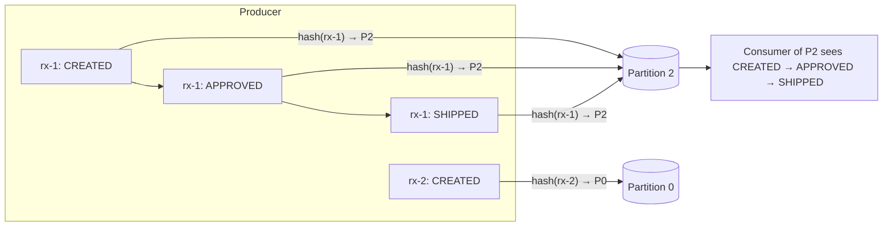
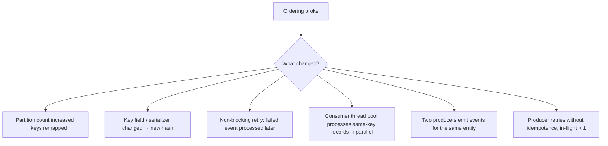

# Ordering Guarantees & Partition Key Design

!!! abstract "TL;DR"
    - Kafka guarantees order **only within a single partition**. There is no global topic order (unless the topic has one partition).
    - **Same key → same partition → ordered.** Pick the key = *the entity whose events must be applied in order* (e.g. `prescriptionId`).
    - Good keys: **high cardinality, stable, evenly distributed**. Bad keys: status, country, a constant, a frequently changing field.
    - Ordering breaks when you **add partitions**, **change the key or serializer**, use **non-blocking retries**, process **in parallel inside a consumer**, or produce from **multiple producers** for the same entity without coordination.
    - Defend with **version or sequence numbers** in events, so consumers can detect and reject stale or out-of-order updates.

## Why it matters

Ordering bugs are subtle: a "cancelled" order gets re-activated because `OrderUpdated` arrived after `OrderCancelled`. Interviewers love asking how you guaranteed ordering and what would break it.

## Core concepts

### What Kafka guarantees


*Notice that all events for rx-1 share a partition, so their order is preserved. rx-1 and rx-2 have no ordering relationship, and that's fine.*

Guarantee chain (all must hold):

1. **Producer:** one producer per key at a time, with the idempotent producer (or `max.in.flight=1`) so retries don't reorder.
2. **Partitioning:** a stable key → partition mapping (fixed partition count, same serializer and partitioner).
3. **Broker:** append order within the partition (always true).
4. **Consumer:** process records of a partition sequentially, or at least sequentially per key.

### Choosing a key

| Candidate | Verdict | Why |
|---|---|---|
| `prescriptionId` | ✅ | Events must apply in order per prescription; high cardinality |
| `memberId` | ✅ / ⚠️ | Good if cross-prescription order matters per member; watch for very active members |
| `status` | ❌ | ~5 values → 5 hot partitions; wrong ordering scope |
| `null` | ❌ for ordered flows | Sticky partitioner spreads records, so there's no order |
| `timestamp` / random UUID per event | ❌ | Each event lands anywhere |
| Tenant ID (B2B) | ⚠️ | Big tenants create hot partitions; consider `tenantId + entityId` |

!!! tip "Rule of thumb"
    Choose the **smallest scope that still needs ordering**. Smaller scope means more distinct keys, better distribution and more parallelism.

### How ordering breaks


*Notice that most causes are design or config changes, not Kafka bugs. Each needs a guardrail: a review checklist, versioning, or per-key processing.*

### Defensive design: versions and sequence numbers

Even with perfect partitioning, replays and retries can deliver stale events. Make consumers **version-aware**:

```sql
UPDATE prescription
SET status = :status, version = :version
WHERE id = :id AND version < :version;   -- 0 rows updated → stale event, ignore
```

### Parallelism without losing per-key order

- **Scale by partitions:** concurrency = partitions (simple, standard).
- **Key-based parallelism inside a consumer:** route records to N single-threaded workers by `hash(key) % N` and track offsets carefully (Confluent Parallel Consumer does this for you).
- **Global ordering** (rare): a single partition means a throughput ceiling of one consumer. Question the requirement first; usually only per-entity ordering is needed.

## In practice: code & configuration

=== "❌ Common mistake"
    ```java
    // No key → no ordering per prescription
    kafkaTemplate.send("rx-status", event);

    // Parallel processing destroys order within a partition
    @KafkaListener(topics = "rx-status")
    void on(RxEvent e) { pool.submit(() -> apply(e)); }
    ```

=== "✅ Correct approach"
    ```java
    // Key = the ordering scope
    kafkaTemplate.send("rx-status", e.prescriptionId(), e);

    // Sequential per partition; parallelism comes from partitions × concurrency
    @KafkaListener(topics = "rx-status", concurrency = "6")
    void on(RxEvent e) {
        repo.applyIfNewer(e.prescriptionId(), e.status(), e.version());  // version check guards replays
    }
    ```

Producer config that preserves order under retries (defaults since Kafka 3.0):

```properties
enable.idempotence=true
acks=all
max.in.flight.requests.per.connection=5
```

## Real-world usage

- **Banking:** account transactions are keyed by account number, so debits and credits apply in order per account.
- **E-commerce / healthcare workflows:** keyed by order or prescription ID, state machines in consumers reject illegal transitions (e.g. `SHIPPED → APPROVED`).
- **CDC (Debezium):** keys are the table's primary key, so row changes for the same row stay ordered.
- **Common incident:** a team doubles partitions to fix lag. For hours, old events for a key sit unprocessed on the old partition while new events land on the new one, and states flip backwards. Version checks would have contained it.

## Trade-offs & production gotchas

| Approach | Ordering | Throughput |
|---|---|---|
| Single partition | Global | One consumer max |
| Key by entity | Per entity | Scales with partitions |
| Null key | None | Best distribution |
| Key + version checks | Per entity + stale protection | Same, small write overhead |

!!! warning "Gotchas"
    - Plan partition counts with growth headroom. Increasing later remaps keys.
    - Non-blocking retry topics (`@RetryableTopic`) **break per-key ordering** for retried records.
    - Ordering is per partition **per topic**. Events for the same entity on two different topics have no relative order.
    - Hot keys cap throughput: monitor per-partition bytes-in and lag.

## How this connects to my experience

- **Where I used it:** OptumRx Meteor Kafka workflows (healthcare entities: members, prescriptions, orders).
- **Talking points:**
    - Key choice and why (entity-level ordering). *[confirm key]*
    - How retries and DLQ interacted with ordering, and how you protected state (versions, state machine). *[confirm]*
- **Likely follow-up chain:** "What was your key?" → "Any hot partitions?" → "What if you need more partitions?" → "How do retries affect ordering?"

## Interview questions

### Fundamentals

??? question "Q1. Does Kafka guarantee message ordering?"
    **Answer:** Within a partition, yes: records are appended and read in offset order. Across partitions of a topic, no. To order related events, give them the same key so they land on the same partition.

??? question "Q2. How do you get global ordering on a topic?"
    **Answer:** One partition, which limits throughput and parallelism to a single consumer. Usually the real requirement is per-entity ordering, which keys provide while scaling.

??? question "Q3. What makes a good partition key?"
    **Answer:** It matches the ordering scope, has high cardinality, is evenly distributed, and is stable over the entity's life. Avoid low-cardinality or skewed keys.

### Intermediate

??? question "Q4. What happens to ordering if you increase the partition count?"
    **Answer:** `hash(key) % n` changes, so a key's new events can go to a different partition than its older unconsumed events, and consumers may process them out of order. Mitigate by planning capacity, draining before changing, migrating to a new topic, or using version checks in consumers.

??? question "Q5. Can producer retries reorder messages?"
    **Answer:** Without idempotence and with more than 1 in-flight request, yes: a failed batch retried after a later one succeeds. The idempotent producer (default since 3.0) prevents it for up to 5 in-flight requests via sequence numbers.

??? question "Q6. How do you parallelise processing within a partition without breaking order?"
    **Answer:** Parallelise by key: hash keys to single-threaded lanes, so different keys run concurrently and the same key runs sequentially. Commit offsets only up to the lowest fully processed offset. Libraries like Confluent Parallel Consumer implement this.

### Senior

??? question "Q7. Events for the same order come from two services. How do you ensure correct ordering?"
    **Answer:** Kafka can't order across producers or topics. Options: a single owner service emits all state changes for the aggregate; sequence numbers or versions from the owning aggregate; consumers act as state machines rejecting invalid transitions; or one topic keyed by orderId that both write to, accepting that the relative order between producers is by arrival time only.

??? question "Q8. One customer produces 40% of traffic and their partition lags. What do you do?"
    **Answer:** If ordering is needed only per sub-entity, refine the key (customerId + accountId). If strict per-customer ordering is required, scale that partition's consumer vertically or optimise its processing, or isolate the big customer to a dedicated topic. Salting the key only works if ordering for that customer can be relaxed.

??? question "Q9. How do non-blocking retries and DLQs interact with ordering?"
    **Answer:** A retried record is processed after later records for the same key, and dead-lettered records leave gaps. Protect with blocking retries for ordering-critical topics, "park the key" logic, version-aware updates, and replay procedures that respect versions.

### Scenario-based

??? question "Q10. A cancelled order got reactivated in production. How do you investigate and prevent it?"
    **Answer:** Check the partitions and offsets of both events (same key? same partition?), retry and DLQ history, recent partition count or key changes, and consumer parallelism. Prevent it with entity versioning and conditional updates, a state-machine transition guard, consistent keys, and alerting on rejected stale events.

## Cheat sheet

| Concept | Remember |
|---|---|
| Ordering scope | Per partition only |
| Key | = ordering scope; high cardinality |
| Breakers | More partitions, key changes, retry topics, parallel handlers, multi-producers |
| Safety net | Versions/sequence numbers + conditional updates |
| Producer | Idempotence on (default) keeps order with ≤5 in-flight |

## Sources

1. [Apache Kafka documentation: Introduction / Topics and Logs](https://kafka.apache.org/documentation/#intro_concepts_and_terms).
2. [Apache Kafka: Producer configs](https://kafka.apache.org/documentation/#producerconfigs): `enable.idempotence`, `max.in.flight.requests.per.connection`.
3. [Spring for Apache Kafka: Non-blocking retries and ordering caveat](https://docs.spring.io/spring-kafka/reference/retrytopic/how-the-pattern-works.html).
4. [Confluent Parallel Consumer](https://github.com/confluentinc/parallel-consumer): key-level parallelism.
5. [Confluent: How to choose the number of topics/partitions](https://www.confluent.io/blog/how-choose-number-topics-partitions-kafka-cluster/).
