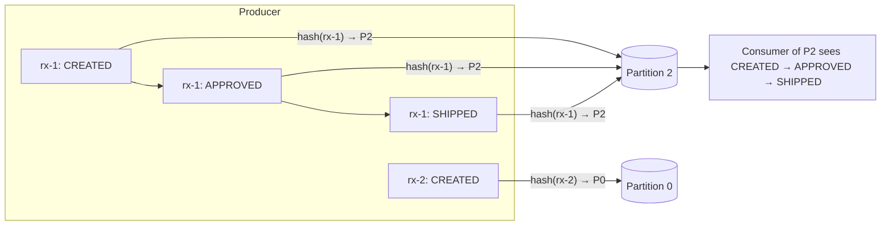
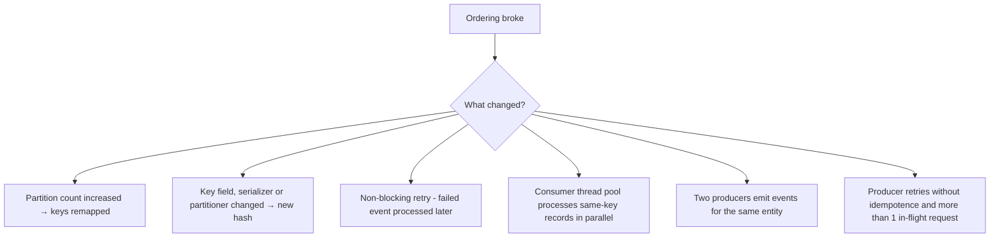

# Ordering Guarantees & Partition Key Design

!!! abstract "TL;DR"
    - Kafka guarantees order **only within a single partition**. There is no global topic order (unless the topic has one partition).
    - **Same key → same partition → ordered.** Pick the key = *the entity whose events must be applied in order* (e.g. `prescriptionId`).
    - Good keys: **high cardinality, stable, evenly distributed**. Bad keys: status, country, a constant, a frequently changing field.
    - Ordering breaks when you **add partitions**, **change the key or serializer**, use **non-blocking retries**, process **in parallel inside a consumer**, or produce from **multiple producers** for the same entity without coordination.
    - Defend with **version or sequence numbers** in events, so consumers can detect and reject stale or out-of-order updates.

## Why it matters

Ordering bugs are subtle: a "cancelled" order gets re-activated because `OrderUpdated` arrived after `OrderCancelled`. Interviewers love asking how you guaranteed ordering and what would break it.

## Core concepts

### What Kafka guarantees


*Notice that all events for rx-1 share a partition, so their order is preserved. rx-1 and rx-2 have no ordering relationship, and that's fine.*

Guarantee chain (all must hold):

1. **Producer:** one producer per key at a time, with the idempotent producer (or, if idempotence is off, `max.in.flight.requests.per.connection=1`) so retries don't reorder.
2. **Partitioning:** a stable key → partition mapping (fixed partition count, same serializer and partitioner). The Java client's built-in partitioner computes `murmur2(serializedKeyBytes) % numPartitions`, so the mapping depends on the **bytes** of the key, the **hash function**, and the **partition count**.
3. **Broker:** append order within the partition (always true).
4. **Consumer:** process records of a partition sequentially, or at least sequentially per key. A partition is owned by exactly one consumer per group at a time, so this is per consumer group.

### Choosing a key

| Candidate | Verdict | Why |
|---|---|---|
| `prescriptionId` | ✅ | Events must apply in order per prescription; high cardinality |
| `memberId` | ✅ / ⚠️ | Good if cross-prescription order matters per member; watch for very active members |
| `status` | ❌ | ~5 values → 5 hot partitions; wrong ordering scope |
| `null` | ❌ for ordered flows | The built-in partitioner sticks to one partition per batch and then moves on, so related records scatter across partitions |
| `timestamp` / random UUID per event | ❌ | Each event lands anywhere |
| Tenant ID (B2B) | ⚠️ | Big tenants create hot partitions; consider `tenantId + entityId` |

!!! tip "Rule of thumb"
    Choose the **smallest scope that still needs ordering**. Smaller scope means more distinct keys, better distribution and more parallelism.

### How ordering breaks


*Notice that most causes are design or config changes, not Kafka bugs. Each needs a guardrail: a review checklist, versioning, or per-key processing.*

### Defensive design: versions and sequence numbers

Even with perfect partitioning, replays and retries can deliver stale events. Make consumers **version-aware**:

```sql
UPDATE prescription
SET status = :status, version = :version
WHERE id = :id AND version < :version;   -- 0 rows updated → stale event, ignore
```

The version must come from the **source of truth** (the owning service's aggregate version or a DB sequence), not from the Kafka offset or the record timestamp. Offsets are only comparable within one partition of one topic, and timestamps are producer clocks by default (`CreateTime`), so neither survives a topic migration or a second producer.

Note also what a rebalance or restart does: the new owner of the partition resumes from the **last committed offset**, so records are re-delivered in the same order (duplicates, not reordering). The entity can still appear to "go back in time" as old records are re-applied, which is exactly what the version check absorbs.

### Parallelism without losing per-key order

- **Scale by partitions:** effective parallelism = min(partition count, total consumer threads in the group). This is the simple, standard option.
- **Key-based parallelism inside a consumer:** route records to N single-threaded workers by `hash(key) % N` and track offsets carefully (Confluent Parallel Consumer does this for you).
- **Global ordering** (rare): a single partition means a throughput ceiling of one consumer thread per consumer group. Question the requirement first; usually only per-entity ordering is needed.

## In practice: code & configuration

=== "❌ Common mistake"
    ```java
    // No key → no ordering per prescription
    kafkaTemplate.send("rx-status", event);

    // Parallel processing destroys order within a partition
    @KafkaListener(topics = "rx-status")
    void on(RxEvent e) { pool.submit(() -> apply(e)); }
    ```

=== "✅ Correct approach"
    ```java
    // Key = the ordering scope
    kafkaTemplate.send("rx-status", e.prescriptionId(), e);

    // Sequential per partition. concurrency = consumer threads in this instance;
    // useful parallelism is capped by the partition count (threads beyond it sit idle)
    @KafkaListener(topics = "rx-status", concurrency = "6")
    void on(RxEvent e) {
        repo.applyIfNewer(e.prescriptionId(), e.status(), e.version());  // version check guards replays
    }
    ```

Producer config that preserves order under retries. `enable.idempotence=true` and `acks=all` are the client defaults since Kafka 3.0; `max.in.flight.requests.per.connection=5` has always been the default:

```properties
enable.idempotence=true
acks=all
max.in.flight.requests.per.connection=5   # must be <= 5 with idempotence; order is preserved for any allowed value
```

!!! note "Two details interviewers probe"
    - In Kafka clients 3.0.0 and 3.1.0 a bug (KAFKA-13598) meant idempotence was not actually applied by default; it was fixed in 3.0.1, 3.1.1 and 3.2.0. On those versions, or whenever ordering matters, set `enable.idempotence=true` **explicitly**.
    - If you leave idempotence implicit and also set a conflicting value (`acks=1`, `retries=0`, or more than 5 in-flight requests), the client **silently disables idempotence**. If you set it explicitly, the same conflict throws a `ConfigException` at startup, which is what you want.

For ordering-critical listeners in Spring Kafka, prefer **blocking** retries: `DefaultErrorHandler` with a `BackOff` re-seeks the failed record and retries it in place, so nothing behind it in the partition is processed first. Keep the total back-off below `max.poll.interval.ms`, otherwise the consumer is evicted from the group and the partition is reassigned.

## Real-world usage

- **Banking:** account transactions are keyed by account number, so debits and credits apply in order per account.
- **E-commerce / healthcare workflows:** keyed by order or prescription ID, state machines in consumers reject illegal transitions (e.g. `SHIPPED → APPROVED`).
- **CDC (Debezium):** keys are the table's primary key, so row changes for the same row stay ordered.
- **Common incident:** a team doubles partitions to fix lag. For hours, old events for a key sit unprocessed on the old partition while new events land on the new one, and states flip backwards. Version checks would have contained it.

## Trade-offs & production gotchas

| Approach | Ordering | Throughput | Use when |
|---|---|---|---|
| Single partition | Global | One consumer thread per group | Rare cases that truly need total order and have low volume |
| Key by entity | Per entity | Scales with partitions | Default for stateful entity events |
| Null key | None | Best distribution | Independent events such as logs or metrics |
| Key + version checks | Per entity + stale protection | Same, small write overhead | State changes where a stale write is a business bug |

!!! warning "Gotchas"
    - Plan partition counts with growth headroom. Increasing later remaps keys, and existing records are **not** moved. Partition counts can never be decreased.
    - Non-blocking retry topics (`@RetryableTopic`) **break per-key ordering** for retried records. The Spring Kafka docs say it directly: "By using this strategy you lose Kafka's ordering guarantees for that topic."
    - **Mixed-language producers:** the Java client hashes keys with murmur2, but librdkafka-based clients (Python, Go, .NET, C/C++) default to `partitioner=consistent_random` (CRC32). The same key then lands on different partitions depending on which client produced it. Set `partitioner=murmur2_random` on the librdkafka side.
    - The same applies to a custom `partitioner.class`, a changed key serializer (String vs Avro vs JSON bytes) or a changed key format (`"123"` vs `"RX-123"`): any of them silently remaps keys.
    - Ordering is per partition **per topic**. Events for the same entity on two different topics have no relative order.
    - Hot keys cap throughput: monitor per-partition bytes-in and lag.

## How this connects to my experience

- **Where I used it:** OptumRx Meteor at Publicis Sapient. Resume bullet: "Designed Kafka-based event-driven workflows with retry and DLQ handling." The entities involved (members, prescriptions, orders) are illustrative here. *[confirm]*
- **Talking points:**
    - Key choice and why (entity-level ordering). *[confirm key]*
    - How retries and DLQ interacted with ordering: whether the retries were blocking or used retry topics, and how I protected state (versions, state machine). *[confirm]*
    - Partition count and how it was sized, and whether any hot keys showed up. *[confirm]*
- **Likely follow-up chain:** "What was your key?" → "Any hot partitions?" → "What if you need more partitions?" → "How do retries affect ordering?"

## Interview questions

### Fundamentals

??? question "Q1. Does Kafka guarantee message ordering?"
    **Answer:** Within a partition, yes: records are appended and read in offset order. Across partitions of a topic, no. To order related events, give them the same key so they land on the same partition. The full guarantee also needs an idempotent producer (so retries don't reorder) and a consumer that processes each partition sequentially.

    **Interviewer listens for:** "per partition, not per topic"; the key → partition link; awareness that producer and consumer behaviour are part of the guarantee.

    **Common wrong answer:** "Yes, Kafka is an ordered log" with no mention of partitions, or "Kafka orders by timestamp".

??? question "Q2. How do you get global ordering on a topic?"
    **Answer:** One partition, which limits throughput and parallelism to a single consumer. Usually the real requirement is per-entity ordering, which keys provide while scaling. If total order really is required, the alternative is ordering at the consumer with a sequence number, which costs buffering and latency.

    **Interviewer listens for:** single partition and its throughput cost; challenging the requirement before accepting it.

    **Common wrong answer:** "Use one consumer" (a single consumer reading several partitions still interleaves them with no defined order).

??? question "Q3. What makes a good partition key?"
    **Answer:** It matches the ordering scope, has high cardinality, is evenly distributed, and is stable over the entity's life. Avoid low-cardinality or skewed keys. Choose the smallest scope that still needs ordering, for example `prescriptionId` rather than `memberId` if only per-prescription order matters.

    **Interviewer listens for:** ordering scope first, then cardinality, distribution and stability; a mention of hot partitions.

    **Common wrong answer:** "Use a UUID or timestamp so load is even" (even load, but no per-entity ordering).

### Intermediate

??? question "Q4. What happens to ordering if you increase the partition count?"
    **Answer:** `hash(key) % n` changes, so a key's new events can go to a different partition than its older unconsumed events, and consumers may process them out of order. Existing records are not moved, and partitions can't be reduced afterwards. Mitigate by over-partitioning up front, or do a controlled change: pause producers, let consumers drain to zero lag, add partitions, resume. The cleaner route is a new topic with the target partition count and a cut-over. Version checks in consumers are the safety net either way. Compacted topics and Kafka Streams state stores are hit hardest, because the key's history is now split across partitions.

    **Interviewer listens for:** remapping of keys, no data movement, a concrete migration procedure, the impact on compaction or stateful consumers.

    **Common wrong answer:** "Kafka rebalances the data across the new partitions" (it does not; that is a consumer-group rebalance, a different thing).

??? question "Q5. Can producer retries reorder messages?"
    **Answer:** Without idempotence and with more than 1 in-flight request, yes: a failed batch retried after a later one succeeds. The idempotent producer (default since 3.0) prevents it for up to 5 in-flight requests: each batch carries a producer ID, epoch and per-partition sequence number, and the broker rejects an out-of-sequence batch (`OutOfOrderSequenceException`) so the client re-sends in the right order. Without idempotence you need `max.in.flight.requests.per.connection=1`. Idempotence covers a single producer session only; it does not order records across two producer instances or across an application-level resend.

    **Interviewer listens for:** the retry-reordering mechanism, sequence numbers, the limit of 5, the scope (per producer, per partition).

    **Common wrong answer:** "Set `retries=0`" (trades reordering for message loss), or "idempotence gives exactly-once end to end".

??? question "Q6. How do you parallelise processing within a partition without breaking order?"
    **Answer:** Parallelise by key: hash keys to single-threaded lanes, so different keys run concurrently and the same key runs sequentially. Commit offsets only up to the lowest fully processed offset. Libraries like Confluent Parallel Consumer implement this (its `KEY` ordering mode). The hard part is offsets: if offset 12 finishes before offset 10, you may only commit up to 10, and after a crash 11 and 12 are re-delivered, so handlers must be idempotent.

    **Interviewer listens for:** per-key lanes, the offset-commit problem, at-least-once consequences, back-pressure (pause the consumer when lanes are full).

    **Common wrong answer:** "Hand records to a thread pool and commit after the poll" (breaks order and can lose records on a crash).

??? question "Q7. How does the producer pick a partition for a record, with and without a key?"
    **Answer:** If the record specifies a partition, that is used. Otherwise, with a key, the Java client's built-in partitioner computes `murmur2(serialized key bytes) % numPartitions`. With a null key it uses sticky partitioning: it fills a batch for one partition, then switches, and since Kafka 3.3 (KIP-794) it also favours less loaded brokers. `partitioner.ignore.keys=true` makes it ignore keys altogether, and a custom `partitioner.class` replaces the logic. Non-Java clients built on librdkafka default to a CRC32-based partitioner, so mixed-language producers need `partitioner=murmur2_random` to agree with Java.

    **Interviewer listens for:** hash of the serialized bytes (so serializer matters), modulo partition count, sticky behaviour for null keys, the cross-client hash mismatch.

    **Common wrong answer:** "Round-robin for null keys" (true only for old clients before 2.4), or "it hashes the key object's `hashCode()`".

### Senior

??? question "Q8. Events for the same order come from two services. How do you ensure correct ordering?"
    **Answer:** Kafka can't order across producers or topics. Options: a single owner service emits all state changes for the aggregate; sequence numbers or versions from the owning aggregate; consumers act as state machines rejecting invalid transitions; or one topic keyed by orderId that both write to, accepting that the relative order between producers is by arrival time only. As a Lead I'd push for the first option (single writer per aggregate, typically with a transactional outbox so the DB commit order becomes the event order) and add versions so consumers can verify it.

    **Interviewer listens for:** single-writer principle, source-of-truth versioning, consumer-side validation, awareness that timestamps are not a safe tiebreaker because of clock skew.

    **Common wrong answer:** "Use the same key in both services" (same partition does not make two independent producers ordered relative to each other), or "sort by timestamp".

??? question "Q9. One customer produces 40% of traffic and their partition lags. What do you do?"
    **Answer:** If ordering is needed only per sub-entity, refine the key (customerId + accountId). If strict per-customer ordering is required, scale that partition's consumer vertically or optimise its processing, or isolate the big customer to a dedicated topic. Salting the key only works if ordering for that customer can be relaxed. Adding partitions does not help: one key still maps to one partition. Adding consumers does not help either, since a partition has one consumer per group. Key-level parallelism inside the consumer helps only if the sub-keys are independent.

    **Interviewer listens for:** recognising it as key skew, not a capacity problem; first asking what the real ordering scope is; why more partitions or consumers do nothing.

    **Common wrong answer:** "Add more partitions and consumers."

??? question "Q10. How do non-blocking retries and DLQs interact with ordering?"
    **Answer:** A retried record is processed after later records for the same key, and dead-lettered records leave gaps. Protect with blocking retries for ordering-critical topics, "park the key" logic (once one record for a key fails, later records for that key are held or diverted too), version-aware updates, and replay procedures that respect versions. The cost of blocking retries is head-of-line blocking: one poison record stalls the whole partition, so bound the attempts and keep the back-off within `max.poll.interval.ms`. In Spring Kafka that is `DefaultErrorHandler` plus `DeadLetterPublishingRecoverer` (blocking) versus `@RetryableTopic` (non-blocking, ordering lost).

    **Interviewer listens for:** the trade-off between ordering and partition throughput, the DLQ gap problem, a replay strategy, concrete Spring Kafka components.

    **Common wrong answer:** "Retry topics keep order because the key is the same."

??? question "Q11. Does a consumer rebalance or restart break ordering?"
    **Answer:** Not within the partition: the new owner resumes from the last committed offset and reads forward in offset order. What you get is **re-delivery** of records processed but not yet committed, so an entity can briefly be taken back to an older state and then forward again, and side effects can repeat. Real reordering appears only if the old owner is still processing after it lost the partition (a "zombie" that exceeded `max.poll.interval.ms`), so two instances apply the same key concurrently. Defences: idempotent, version-checked writes; finishing or abandoning in-flight work in `onPartitionsRevoked`; cooperative rebalancing, or the KIP-848 consumer protocol (GA in Kafka 4.0), to reduce how many partitions move.

    **Interviewer listens for:** duplicates vs reordering, the zombie-consumer case, commit timing, idempotent consumers.

    **Common wrong answer:** "Rebalancing shuffles messages", or "exactly-once is on, so it can't happen" (transactions cover Kafka-to-Kafka, not an external database write).

### Scenario-based

??? question "Q12. A cancelled order got reactivated in production. How do you investigate and prevent it?"
    **Answer:** Check the partitions and offsets of both events (same key? same partition?), retry and DLQ history, recent partition count or key changes, and consumer parallelism. Prevent it with entity versioning and conditional updates, a state-machine transition guard, consistent keys, and alerting on rejected stale events. I'd also compare the event times with the processing times in the consumer logs to see whether the events were produced in the wrong order (a producer-side problem) or consumed in the wrong order (partitioning, retry or parallelism).

    **Interviewer listens for:** a structured investigation (produced-order vs consumed-order), checking partition and offset of both records, a fix that survives the next cause too (versioning, state machine), not only patching this cause.

    **Common wrong answer:** Jumping straight to "Kafka delivered out of order" without checking keys, partitions and retry paths.

## Cheat sheet

| Concept | Remember |
|---|---|
| Ordering scope | Per partition only |
| Key | = ordering scope; high cardinality |
| Breakers | More partitions, key changes, retry topics, parallel handlers, multi-producers |
| Safety net | Versions/sequence numbers + conditional updates |
| Producer | Idempotence on (default) keeps order with ≤5 in-flight; without it use `max.in.flight.requests.per.connection=1` |
| Partitioner | `murmur2(keyBytes) % numPartitions` in Java; librdkafka defaults to CRC32 |
| Rebalance | Re-delivery in order (duplicates), not reordering |
| Retries | Blocking (`DefaultErrorHandler`) keeps order; `@RetryableTopic` does not |

## Sources

1. [Apache Kafka documentation: Introduction / Topics and Logs](https://kafka.apache.org/documentation/#intro_concepts_and_terms): ordering is per partition; same key → same partition.
2. [Apache Kafka: Producer configs](https://kafka.apache.org/documentation/#producerconfigs): `enable.idempotence`, `max.in.flight.requests.per.connection`, `partitioner.class`, `partitioner.ignore.keys`.
3. [Spring for Apache Kafka: Non-blocking retries and ordering caveat](https://docs.spring.io/spring-kafka/reference/retrytopic/how-the-pattern-works.html): "you lose Kafka's ordering guarantees for that topic".
4. [Confluent Parallel Consumer](https://github.com/confluentinc/parallel-consumer): key-level parallelism.
5. [Confluent: How to choose the number of topics/partitions](https://www.confluent.io/blog/how-choose-number-topics-partitions-kafka-cluster/): adding partitions breaks the key → partition guarantee; over-partition up front.
6. [librdkafka CONFIGURATION.md](https://github.com/confluentinc/librdkafka/blob/master/CONFIGURATION.md): `partitioner` default `consistent_random` (CRC32) vs `murmur2_random` (Java compatible).
7. [KAFKA-13598](https://issues.apache.org/jira/browse/KAFKA-13598): idempotence not applied by default in clients 3.0.0 and 3.1.0.
8. [KIP-794: Strictly Uniform Sticky Partitioner](https://cwiki.apache.org/confluence/display/KAFKA/KIP-794%3A+Strictly+Uniform+Sticky+Partitioner): null-key partitioning since Kafka 3.3.
9. [Spring for Apache Kafka: Handling exceptions](https://docs.spring.io/spring-kafka/reference/kafka/annotation-error-handling.html): `DefaultErrorHandler` blocking retries.
