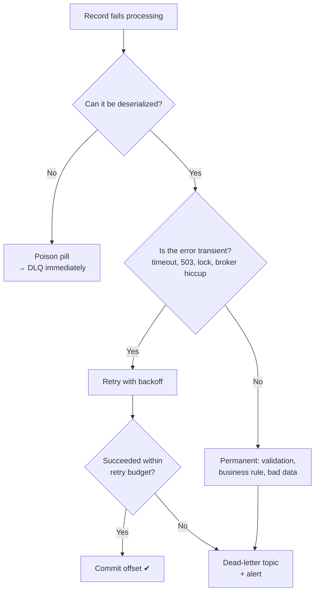
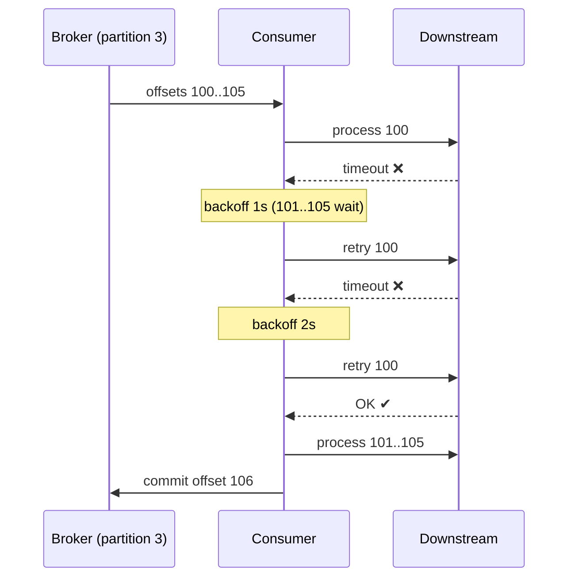
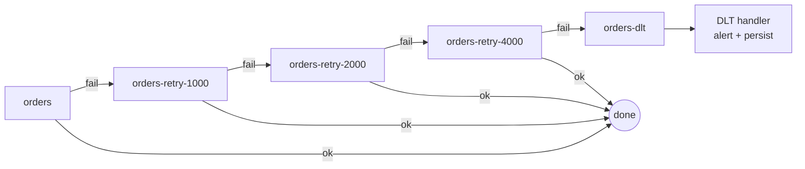
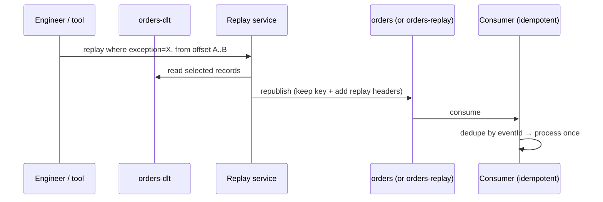

# Error Handling: Retry Topics, DLQ, Poison Messages & Replay

!!! abstract "TL;DR"
    - Kafka has **no built-in DLQ for plain consumers**. Retries and dead-lettering are patterns you build (Spring Kafka gives you most of the machinery). Only Kafka Connect sinks and, since Kafka 4.2, Kafka Streams ship a DLQ setting.
    - First **classify the failure**: *transient* (retry it), *permanent* (don't retry, dead-letter it), *poison pill* (can't even deserialize it, dead-letter it immediately).
    - **Blocking retries** (`DefaultErrorHandler`) keep ordering but stall the partition. **Non-blocking retries** (retry topics, `@RetryableTopic`) keep the partition flowing but **lose ordering**.
    - A DLQ is only useful with **alerting, root-cause triage and a safe replay path**. Otherwise it's a black hole.
    - Retries mean **duplicates**, so every consumer must be **idempotent**.

## Why it matters

A consumer reads records from a partition **in order** and tracks progress with a single committed **offset**. That design gives Kafka its throughput, but it makes failure handling awkward:

- **Skip** the failing record → it's lost (unless you saved it somewhere).
- **Retry forever** → every record behind it on that partition waits. This is *head-of-line blocking*, and consumer lag grows without bound.
- **Crash** → the consumer restarts, re-reads the same record and crashes again (a *poison pill* loop).

Every real event-driven system needs a deliberate answer to "what happens when processing fails?" That's why interviewers use this topic to separate people who've *run* Kafka in production from people who've only *used* it.

## Core concepts

### 1. Classify the failure first


*Notice that only transient errors earn retries. Retrying a validation error 10 times wastes time and blocks the partition.*

| Category | Examples | Correct action |
|---|---|---|
| **Transient** | DB connection timeout, downstream HTTP 503/429, optimistic-lock conflict, network blip | Retry with exponential backoff and a cap |
| **Permanent** | Schema-valid but business-invalid payload, missing mandatory field, unknown reference ID | No retry → DLQ with the reason |
| **Poison pill** | Corrupt bytes, wrong serializer, incompatible schema version | Can't build an object at all → DLQ immediately |
| **Systemic** | Downstream fully down for 30 minutes | Don't dead-letter thousands of records; **pause the consumer** / circuit-break and resume later |

!!! warning "The systemic-failure trap"
    If a downstream dependency is completely down, *every* record fails. Short retries followed by DLQ will dump your whole stream into the DLQ. Detect this case (a circuit breaker, error-rate threshold) and **pause consumption** instead.

### 2. Blocking retries (in-place)

The consumer retries the same record before moving on. In Spring Kafka this is the `DefaultErrorHandler`: after an exception, it re-seeks to the failed offset (or retains the records in memory) and redelivers after a backoff.


*Notice that offsets 101–105 sit idle while 100 retries. Ordering is preserved, but throughput on this partition drops to zero.*

Key facts (Spring Kafka):

- Default backoff is `FixedBackOff(0L, 9)`: **no delay, 9 retries, 10 delivery attempts**. You almost always want to override this.
- Some exceptions are **not retried by default** because retrying can't help: `DeserializationException`, `MessageConversionException`, `ConversionException`, `MethodArgumentResolutionException`, `NoSuchMethodException`, `ClassCastException`. Add your own with `addNotRetryableExceptions(...)`.
- Long blocking backoffs are dangerous. If the gap between two `poll()` calls exceeds `max.poll.interval.ms` (default 5 minutes), the consumer is considered failed: the client proactively leaves the group and its partitions are **rebalanced** to other members. So each individual back-off must stay well below that limit. Spring's `ContainerPausingBackOffHandler` (passed as the third constructor argument of `DefaultErrorHandler`) pauses the listener container instead of sleeping, so the consumer keeps polling during long delays.
- When the listener container runs in a **Kafka transaction**, no error handler is used by default: the exception rolls the transaction back and the `AfterRollbackProcessor` (`DefaultAfterRollbackProcessor`) does the retry/recover job instead.

**Use blocking retries when** per-key ordering is a hard requirement (e.g. account balance events, status transitions) and failures are short-lived.

### 3. Non-blocking retries (retry topics)

The failed record is **republished to a retry topic** with a due timestamp, and the main consumer moves on immediately. A separate consumer reads the retry topic, waits until the record is due (by pausing that partition), then reprocesses it. After the last attempt, the record goes to the dead-letter topic.


*Notice that the main topic never waits. The cost is that a retried record is processed **after** records that arrived later, so ordering is lost.*

This is the same pattern Uber described for its reprocessing pipeline: a chain of retry queues with increasing delays, ending in a DLQ that engineers inspect and replay.

Two details interviewers probe: the delay is a **minimum**, not exact (the retry consumer pauses the partition until the record's due timestamp, so a backlog on a retry topic delays later records further), and `@RetryableTopic` works with **record listeners only**, not batch listeners.

With Spring's `@RetryableTopic`, exponential backoff of 1000 ms × 2 with 4 attempts creates `main-topic-retry-1000`, `-retry-2000`, `-retry-4000` and `main-topic-dlt`. The docs state it plainly: *"By using this strategy you lose Kafka's ordering guarantees for that topic."*

### 4. Blocking vs non-blocking: choosing

| | Blocking (`DefaultErrorHandler`) | Non-blocking (`@RetryableTopic`) |
|---|---|---|
| Ordering per key | ✅ Preserved | ❌ Lost for retried records |
| Partition throughput during failure | ❌ Stalls | ✅ Unaffected |
| Long delays (minutes) | ⚠️ Rebalance risk unless pausing | ✅ Natural fit |
| Extra topics/infra | None | Retry topics + DLT per main topic |
| Best for | Short transient errors, strict ordering | Slow/flaky downstreams, independent events |

!!! tip "Hybrid (common in production)"
    Do a few **fast blocking retries** for blips (e.g. 3 × 200 ms), then hand off to **non-blocking retry topics** for longer waits, then the DLT. In Spring Kafka you enable this by extending `RetryTopicConfigurationSupport` and overriding `configureBlockingRetries(...)` to name the exceptions and back-off that should be retried in place first.

### 5. Preserving ordering when you must use retry topics

If events for the same key must stay in order (e.g. `PRESCRIPTION_CREATED → APPROVED → SHIPPED`):

- **Park the key:** when a record for key *K* enters retry, store *K* in a "blocked keys" store (Redis/DB). Later records for *K* go straight to the retry path until *K* clears. Other keys keep flowing.
- **Version-aware consumers:** include a version or sequence number in each event and reject or buffer out-of-order updates (`UPDATE ... WHERE version < :new`).
- **Make state transitions tolerant:** design the consumer so applying events in a different order converges to the same state where possible.

### 6. Poison pills and deserialization

If deserialization fails *inside the Kafka client*, your listener never runs, so your error handling never fires. The consumer re-polls the same bytes forever. The fix is `ErrorHandlingDeserializer`. It wraps the real deserializer, catches the failure and hands Spring a `DeserializationException`, which the error handler routes straight to the DLT without retries.

### 7. The dead-letter topic (DLT/DLQ)

Spring's `DeadLetterPublishingRecoverer` publishes the failed record to `<originalTopic>-dlt`, **on the same partition** by default. That means the DLT needs **at least as many partitions** as the source topic. It adds diagnostic headers (original topic, partition, offset, timestamp, consumer group, exception class, message and stack trace) so you can triage without hunting through logs. With a plain `DeadLetterPublishingRecoverer` these are the `KafkaHeaders.DLT_*` constants (`kafka_dlt-original-topic`, `kafka_dlt-exception-message`, …). The retry-topic machinery (`@RetryableTopic`) uses the un-prefixed variants instead (`KafkaHeaders.ORIGINAL_TOPIC`, `KafkaHeaders.EXCEPTION_MESSAGE`, …).

A DLT is an **operational process**, not just a topic:

1. **Alert** on DLT arrival rate (any message on a critical flow should page someone or open a ticket).
2. **Persist/inspect**: a `@DltHandler` writes to a DB table or dashboard with headers and payload.
3. **Fix the root cause**: a code bug, bad reference data, or a downstream contract change.
4. **Replay** safely (below).
5. **Retention**: keep DLT retention longer than the main topic (e.g. 14–30 days) so you don't lose evidence.

### 8. Replay


*Notice that replay depends on the consumer being idempotent and on the key being preserved, so the record lands on the right partition.*

Replay rules:

- Replay **only after** the root cause is fixed. Otherwise records bounce straight back.
- Preserve the **original key** (partitioning and ordering) and add headers such as `x-replay-count`, so loops are detectable.
- Prefer a **dedicated replay topic** or a controlled tool over hand-editing offsets.
- Be careful with **stale events**: a record that's 3 days old may now conflict with newer state. Version checks protect you.

### 9. Idempotency: the other half of retries

Retries, rebalances and replays all produce **duplicates**. Kafka's default delivery is at-least-once, so consumers must tolerate seeing a record twice:

- Natural idempotency: upserts, "set status = X" (vs "increment balance").
- A dedupe table keyed by `eventId` with a unique constraint, written **in the same DB transaction** as the business change.
- For Kafka-to-Kafka flows: Kafka transactions / exactly-once semantics (see the *Delivery semantics* page).

## In practice: code & configuration

### Blocking retries + DLT with `DefaultErrorHandler`

```java
@Configuration
class KafkaErrorHandlingConfig {

    @Bean
    DefaultErrorHandler errorHandler(KafkaTemplate<Object, Object> template) {
        // Publishes to <topic>-dlt, same partition, with diagnostic headers
        var recoverer = new DeadLetterPublishingRecoverer(template);

        // 1s, 2s, 4s, 8s then give up (instead of the default 10 instant attempts)
        var backOff = new ExponentialBackOffWithMaxRetries(4);
        backOff.setInitialInterval(1_000);
        backOff.setMultiplier(2.0);
        backOff.setMaxInterval(10_000);

        var handler = new DefaultErrorHandler(recoverer, backOff);
        // Permanent errors: skip retries, go straight to the DLT
        handler.addNotRetryableExceptions(
                ValidationException.class,
                UnknownProductException.class);
        return handler;
    }
}
```

Spring Boot wires a single `CommonErrorHandler` bean into the auto-configured listener container factory.

!!! note "If the DLT publish itself fails"
    The recoverer throws, the record is **not** skipped, and it's redelivered on the next poll. That's the safe default (no silent loss), but it means a missing DLT topic or a DLT with too few partitions turns into a stuck partition. Alert on it.

### Guarding against poison pills

```yaml
spring:
  kafka:
    consumer:
      key-deserializer: org.springframework.kafka.support.serializer.ErrorHandlingDeserializer
      value-deserializer: org.springframework.kafka.support.serializer.ErrorHandlingDeserializer
      properties:
        spring.deserializer.key.delegate.class: org.apache.kafka.common.serialization.StringDeserializer
        spring.deserializer.value.delegate.class: org.springframework.kafka.support.serializer.JsonDeserializer
        spring.json.trusted.packages: "com.example.events"
```

!!! note "Spring Kafka 4.x"
    Spring for Apache Kafka 4.0 added Jackson 3 support and deprecated the Jackson 2 classes. On 4.x, use `JacksonJsonDeserializer` (same package) as the delegate instead of `JsonDeserializer`. `ErrorHandlingDeserializer` itself is unchanged.

### Non-blocking retries with `@RetryableTopic`

The example uses Spring Kafka 3.x syntax (Spring Boot 3.x). Spring Kafka 4.0 dropped the Spring Retry dependency, so the attribute and annotation were renamed: `backoff = @Backoff(...)` becomes `backOff = @BackOff(...)` (`org.springframework.kafka.annotation.BackOff`). The numeric attributes `delay`, `multiplier` and `maxDelay` keep their names.

```java
@Component
class OrderEventsListener {

    @RetryableTopic(
        attempts = "4",                                   // 1 original + 3 retries
        backoff = @Backoff(delay = 1_000, multiplier = 2.0, maxDelay = 10_000), // 4.x: backOff = @BackOff(...)
        exclude = { ValidationException.class },          // permanent → straight to DLT
        traversingCauses = "true",                        // also match when it's a wrapped cause
        dltStrategy = DltStrategy.FAIL_ON_ERROR,          // if the DLT handler fails, stop (don't loop)
        autoCreateTopics = "false")                       // create topics via IaC in production
    @KafkaListener(topics = "orders", groupId = "fulfilment")
    void onOrder(OrderEvent event) {
        fulfilmentService.process(event);                 // throw to trigger retry
    }

    @DltHandler
    void onDeadLetter(OrderEvent event,
                      @Header(KafkaHeaders.ORIGINAL_TOPIC) String topic,
                      @Header(KafkaHeaders.EXCEPTION_MESSAGE) String error) {
        // Retry-topic DLTs carry ORIGINAL_* / EXCEPTION_* headers (not the DLT_* ones)
        deadLetterRepository.save(DeadLetter.of(event, topic, error)); // for triage + replay
        alerts.raise("orders-dlt", event.orderId(), error);
    }
}
```

### Wrong vs right: swallowing exceptions

=== "❌ Common mistake"
    ```java
    @KafkaListener(topics = "orders")
    void onOrder(OrderEvent e) {
        try {
            service.process(e);
        } catch (Exception ex) {
            log.error("Failed", ex);   // offset is committed → event silently lost
        }
    }
    ```

=== "✅ Correct approach"
    ```java
    @KafkaListener(topics = "orders")
    void onOrder(OrderEvent e) {
        try {
            service.process(e);
        } catch (DownstreamTimeoutException ex) {
            throw ex;                                          // transient → let the error handler retry
        } catch (InvalidOrderException ex) {
            throw new ValidationException(e.orderId(), ex);   // permanent → not retryable → DLT
        }
    }
    ```

### Idempotent consumer

```java
@Transactional
public void process(OrderEvent e) {
    // Unique constraint on processed_events.event_id makes the second insert fail fast
    if (!processedEvents.tryInsert(e.eventId())) {
        return;                       // duplicate from retry/rebalance/replay → ignore
    }
    orders.applyStatus(e.orderId(), e.status(), e.version()); // version check rejects stale events
}
```

## Real-world usage

- **Uber** built reprocessing with **multiple retry queues of increasing delay plus a DLQ**, so a failing message doesn't block the queue while it's retried later. That's the pattern Spring's `@RetryableTopic` automates.
- **Kafka Connect** has long shipped a DLQ option: sink connectors can route bad records to `errors.deadletterqueue.topic.name` with `errors.tolerance=all`. **Kafka Streams** gained one in Kafka 4.2 (KIP-1034, `errors.dead.letter.queue.topic.name`). Plain consumers still have none.
- **Healthcare and banking** systems often require **no silent data loss** and an **audit trail**. A DLT with persisted headers, alerting and a controlled replay tool usually satisfies both engineering and compliance reviewers.
- **Common incident:** a schema change on the producer side makes every consumer fail deserialization. Without `ErrorHandlingDeserializer`, consumers loop forever and lag explodes. With it, records flow to the DLT and an alert fires.

## Trade-offs & production gotchas

| Decision | Option A | Option B | Guidance |
|---|---|---|---|
| Retry style | Blocking | Non-blocking topics | Ordering-critical → blocking; slow downstream → non-blocking; often hybrid |
| DLT granularity | One DLT per topic | One shared DLT | Per topic (Spring default) keeps schemas and ownership clear |
| Topic creation | `autoCreateTopics` | IaC (Terraform/Strimzi) | IaC in production for partitions, retention and ACLs |
| Retry budget | Many attempts | Few attempts + DLT | Bound total delay to your SLA; don't retry permanent errors |

!!! warning "Gotchas"
    - **DLT partitions < source partitions** → publishing to the DLT fails when using the default same-partition resolver.
    - **Retrying permanent errors** wastes the whole retry budget and delays everything behind it.
    - **Blocking backoff longer than `max.poll.interval.ms`** → rebalance storms.
    - **`@RetryableTopic` on a batch listener** isn't supported. Batch listeners use `DefaultErrorHandler` and should throw `BatchListenerFailedException` to say which record failed.
    - **Retry topics multiply consumers.** Each retry topic and the DLT gets its own listener container, so thread count and connections grow with the number of retry levels.
    - **Retry topics need monitoring too.** Lag on `-retry-*` topics is an early warning signal.
    - **DLT handler throwing** → with `ALWAYS_RETRY_ON_ERROR` it can loop. `FAIL_ON_ERROR` stops and logs instead.
    - **Duplicates are guaranteed** under retries. Non-idempotent side effects (emails, payments) must be deduplicated.

## How this connects to my experience

- **Where I used it:** OptumRx Meteor (Publicis Sapient). *"Designed Kafka-based event-driven workflows with retry and DLQ handling."* Related: event-driven healthcare analytics workflows at Deloitte (ConvergeHealth Data Asset Explorer), where the resume lists SQS/SNS rather than Kafka. *[confirm: whether Kafka or SQS dead-letter queues were used there before mentioning it]*
- **Talking points:**
    - Classified failures: transient errors retried with exponential backoff, validation and business errors sent straight to the DLQ. *[confirm: which approach — DefaultErrorHandler, @RetryableTopic or custom]*
    - DLQ records persisted with original topic, partition, offset and error, then alerted on for triage. *[confirm: tooling — dashboard, Splunk, DB table]*
    - Consumers made idempotent (eventId dedupe / upserts) so replays and retries were safe. *[confirm]*
    - Healthcare context: no silent loss of member or prescription events, plus auditability. *[confirm: which event types and whether audit was an explicit requirement]*
- **Likely follow-up chain:**
    1. *"Blocking or non-blocking retries, and why?"* → Tie the answer to ordering needs per flow.
    2. *"Didn't non-blocking retries break ordering?"* → Explain where ordering mattered and how you protected it (park the key / versioning), or why those events were independent.
    3. *"What happened to DLQ messages? Who looked at them?"* → Alerting, triage ownership, replay process.
    4. *"How did you replay without duplicates?"* → Idempotent consumer + key preservation.
    5. *"What if the downstream was down for an hour?"* → Pause / circuit-break rather than flooding the DLQ.

## Interview questions

### Fundamentals

??? question "Q1. Does Kafka have a dead-letter queue?"
    **Answer:** Not for regular consumers. The broker has no concept of a failed message. A DLQ is a pattern: a separate topic you publish failed records to. Frameworks implement it (Spring Kafka's `DeadLetterPublishingRecoverer`). The exceptions are Kafka Connect, which has a built-in DLQ setting for sink connectors (`errors.deadletterqueue.topic.name`), and Kafka Streams, which added one in Kafka 4.2 (KIP-1034).

    **Interviewer listens for:** Knowing it's application-level, and naming how you implemented it.

    **Common wrong answer:** "Yes, you enable it in broker config."

??? question "Q2. What happens by default in Spring Kafka when a listener throws?"
    **Answer:** The `DefaultErrorHandler` retries with `FixedBackOff(0, 9)`: 10 attempts with no delay. Then it logs and skips the record (offset is committed), unless you configure a recoverer such as `DeadLetterPublishingRecoverer`. Certain exceptions (e.g. `DeserializationException`, `ClassCastException`) aren't retried at all.

    **Interviewer listens for:** Awareness that the default silently drops after retries, and that you override it.

    **Common wrong answer:** "It retries forever" or "the consumer crashes."

??? question "Q3. What is a poison pill and how do you handle it?"
    **Answer:** A record the consumer can never process, typically because it can't be deserialized. Without protection, the consumer re-polls it forever and the partition stalls. Use `ErrorHandlingDeserializer` so the failure surfaces as a `DeserializationException`, which isn't retried and goes straight to the DLT. Producer-side schema governance (Schema Registry compatibility rules) prevents most of them.

    **Interviewer listens for:** That the failure happens *before* your listener runs.

    **Common wrong answer:** "Wrap the listener in try/catch."

??? question "Q4. Why must DLT topics have at least as many partitions as the source topic in Spring's default setup?"
    **Answer:** The default destination resolver sends the record to the **same partition number** on `<topic>-dlt`. If that partition doesn't exist, publishing fails. Either match the partition counts or supply a custom resolver (e.g. partition `-1` to let Kafka choose).

    **Interviewer listens for:** Understanding of the partition-mapping default.

    **Common wrong answer:** "DLT partitions do not matter." The default resolver uses the same partition number.

### Intermediate

??? question "Q5. Blocking vs non-blocking retries: trade-offs?"
    **Answer:** Blocking retries keep per-partition ordering but stall every record behind the failing one, and long delays risk exceeding `max.poll.interval.ms` (rebalance). Non-blocking retries move the record to delay topics so the main flow continues. The cost is lost ordering, extra topics and more moving parts. Choose based on whether ordering per key matters and how long failures last. A hybrid of a few fast in-place retries followed by retry topics is common.

    **Interviewer listens for:** Ordering vs throughput framed as the core trade-off.

    **Common wrong answer:** "Non-blocking retries are always better." They break per-key ordering.

??? question "Q6. How do you avoid a rebalance when retry delays are long?"
    **Answer:** Don't sleep in the poll thread. Use pausing back-off (Spring's `ContainerPausingBackOffHandler`), which pauses the listener container but keeps calling `poll()`, so the consumer stays in the group. Or move long waits to non-blocking retry topics. Tuning `max.poll.interval.ms` and `max.poll.records` helps but doesn't fix the root problem.

    **Interviewer listens for:** Knowing that liveness is tied to `poll()` (`max.poll.interval.ms`), separately from heartbeats (`session.timeout.ms`), and that a paused consumer still polls.

    **Common wrong answer:** "Increase max.poll.interval.ms to an hour." That delays detection of dead consumers.

??? question "Q7. Which errors should not be retried?"
    **Answer:** Errors that will fail identically every time: deserialization and conversion failures, validation errors, business-rule violations, missing mandatory references (unless it's an eventual-consistency race). Map them to non-retryable exceptions so they go straight to the DLT.

    **Common wrong answer:** "Retry everything 3 times to be safe."

    **Interviewer listens for:** permanent vs transient failures, classify and send permanent ones to DLT.

??? question "Q8. What metadata do you keep with a dead-lettered record?"
    **Answer:** The original topic, partition, offset, timestamp and key; the exception class, message and stack trace; the retry count; the consumer group; and a correlation/event ID. Spring's `DeadLetterPublishingRecoverer` adds most of these as `kafka_dlt-*` headers automatically (retry topics use `kafka_original-*` / `kafka_exception-*` names and add an attempts header). Header values are raw bytes, so the offset and timestamp need decoding. Persisting them enables triage, auditing and targeted replay.

    **Interviewer listens for:** Enough metadata to find the original record and to replay selectively, without relying on logs.

    **Common wrong answer:** Storing only the payload, which makes the DLQ impossible to diagnose or replay safely.

??? question "Q9. Why is idempotency mandatory once you add retries?"
    **Answer:** Retries, rebalances (before an offset commit) and replays all redeliver records, so at-least-once delivery means duplicates. Without idempotency, you double-charge, double-ship or double-notify. Use natural idempotency (upserts), a dedupe table keyed by eventId in the same transaction, or Kafka transactions for Kafka-to-Kafka pipelines.

    **Interviewer listens for:** That the dedupe marker and the business write commit atomically. A separate "check then write" has a race.

    **Common wrong answer:** "We enabled `enable.idempotence` on the producer." That only removes duplicates caused by producer retries to the broker. It does nothing for consumer redelivery.

??? question "Q10. How does `@RetryableTopic` delay a record without blocking the main consumer?"
    **Answer:** When the listener throws, a `DeadLetterPublishingRecoverer` publishes the record to the next retry topic with a header holding the timestamp at which it's due, and the main topic's offset moves on. Each retry topic has its own listener container. When that container receives a record that isn't due yet, it **pauses that partition**, seeks back to the record and keeps polling (so no rebalance), then resumes when the time is reached. After the last attempt the record goes to the DLT. Consequences: the delay is a minimum, ordering is lost, and each retry level adds a topic and a consumer.

    **Interviewer listens for:** Pause/resume of the partition instead of `Thread.sleep`, and the due-timestamp header.

    **Common wrong answer:** "Kafka delivers the message after a delay." Kafka has no delayed delivery.

### Senior

??? question "Q11. You use retry topics, but events for the same patient must be processed in order. What do you do?"
    **Answer:** Options:

    1. Use blocking retries for this topic, accepting lower throughput during failures.
    2. "Park the key": when a key enters retry, record it in a fast store. Later records for that key are diverted to the retry path until it clears, so other keys stay unaffected.
    3. Version or sequence numbers in events, with conditional updates that reject stale ones.
    4. Design state transitions to be commutative where possible.

    Pick based on volume and how often failures happen. Mention that you'd measure DLT/retry rates to justify the choice.

    **Interviewer listens for:** Not pretending retry topics preserve order; per-key thinking.

    **Common wrong answer:** "Use retry topics and accept reordering." For patient events that can be dangerous.

??? question "Q12. A downstream service is down for an hour. What happens to your DLQ?"
    **Answer:** With naive retries, every record exhausts its retries and floods the DLQ: thousands of records, and an expensive bulk replay. Better: detect systemic failure (circuit breaker open, error-rate threshold) and **pause the consumer** (`KafkaListenerEndpointRegistry` → `pause()`), then resume when healthy. Lag grows, but nothing is lost and order is preserved. Alert on lag instead. Check that topic retention comfortably exceeds the longest outage you plan to ride out, otherwise unread records can age out. Resume gradually (or rate-limit) so the backlog doesn't knock the recovering service over again.

    **Interviewer listens for:** Distinguishing a per-record failure from a systemic one, and using back-pressure (pause) instead of dead-lettering.

    **Common wrong answer:** "They all go to the DLQ and we replay them later."

??? question "Q13. Design a safe DLQ replay process."
    **Answer:** Fix the root cause first. Select records by filter (exception type, time window). Republish with the **original key** to the main topic or a dedicated replay topic, adding `replay-count`/`replayed-by` headers. Rate-limit the replay. Consumers are idempotent and version-aware so stale or duplicate events are harmless. Track the outcome and leave an audit log. Make it a tool or runbook, not ad-hoc scripts. If only one consumer group failed, replaying to the shared main topic makes every other group see the record again, so prefer a replay topic that only the failed group reads (or rely on all consumers being idempotent).

    **Interviewer listens for:** Root cause first, key preservation, idempotency, rate limiting, auditability, and awareness of other consumer groups.

    **Common wrong answer:** "Replay the whole DLT to the main topic." Without a fix and filtering, it fails again or duplicates.

??? question "Q14. How do retries interact with exactly-once semantics?"
    **Answer:** Kafka EOS (transactions + `read_committed`) covers *consume-transform-produce within Kafka*. A failed transaction aborts and the input is re-consumed, so retries are safe inside that boundary. Side effects outside Kafka (DB writes, HTTP calls) aren't covered, so you still need idempotency or the outbox pattern there. Publishing to a DLT can be part of the transaction so the "move to DLT + commit offset" step is atomic. In Spring Kafka, a transactional container doesn't use the `DefaultErrorHandler` by default. The exception rolls back the transaction and the `DefaultAfterRollbackProcessor` re-seeks, applies the back-off and calls the recoverer.

    **Interviewer listens for:** The boundary of EOS (Kafka-only), and that external side effects still need idempotency or an outbox.

    **Common wrong answer:** "EOS makes retries exactly-once for database writes too."

### Scenario-based

??? question "Q15. Consumer lag on one partition is climbing and the others are fine. How do you debug it?"
    **Answer:** Suspect a stuck record. Check the logs for repeated failures at the same offset (blocking retries or a poison pill). Check the consumer is alive (no rebalance loop). Check for a hot key (skew) versus a failure. Fixes: route permanent errors to the DLT, add `ErrorHandlingDeserializer`, add a retry cap, and split hot keys if it's skew. Add alerting on per-partition lag and on the DLT rate. Useful tools: `kafka-consumer-groups.sh --describe --group <group>` shows the committed offset, log-end offset and lag per partition. If the committed offset isn't moving, it's a stuck record. If it's moving but slower than the others, it's skew or a slow path.

    **Interviewer listens for:** A structured approach: stuck offset vs slow progress, then failure vs skew.

    **Common wrong answer:** "Add more consumers." One stuck partition is processed by one consumer only.

??? question "Q16. Your listener consumes in batches of 500 and record 137 fails. What happens, and how should it be handled?"
    **Answer:** With a batch listener the framework doesn't know which record failed. If you throw a plain exception, the `DefaultErrorHandler` falls back to retrying the **whole batch**, so records 0–136 are processed again (duplicates) and one bad record can block the batch indefinitely. Throw `BatchListenerFailedException` with the failed record or its index instead. The handler then commits the offsets of the records before it, retries from the failed record with the back-off, and after retries are exhausted sends just that record to the recoverer/DLT and carries on with the rest. Non-blocking retry topics aren't available for batch listeners, and the batch's DB work must be idempotent because partial reprocessing is normal.

    **Interviewer listens for:** `BatchListenerFailedException`, partial commit, and idempotency of batch writes.

    **Common wrong answer:** "Catch the exception per record inside the loop and continue." That silently drops the record unless you dead-letter it yourself.

??? question "Q17. Walk me through the retry and DLQ design you built."
    **Answer structure (use STAR):** context (flow, volume, ordering needs) → failure classification → retry strategy and why → DLQ handling, alerting and replay → idempotency → an outcome or metric (e.g. no lost events, triage time). Be ready for Q11–Q13 as follow-ups. *[Fill in from your OptumRx implementation.]*

    **Interviewer listens for:** clear STAR structure, classification, ordering trade-off, idempotency, measured outcome.

    **Common wrong answer:** Describing configuration flags with no reasoning or results.

## Cheat sheet

| Concept | Remember |
|---|---|
| Spring default | `FixedBackOff(0, 9)` = 10 attempts, then log & skip unless a recoverer is set |
| Default DLT | `<topic>-dlt`, same partition → DLT partitions ≥ source |
| Not retried by default | Deserialization / conversion / ClassCast / NoSuchMethod |
| Poison pill fix | `ErrorHandlingDeserializer` + DLT |
| Blocking | Order ✅, throughput ❌, rebalance risk on long backoff |
| Non-blocking | Throughput ✅, order ❌, extra topics |
| Rebalance limit | `max.poll.interval.ms` default 5 min |
| Spring Kafka 4.x | `backOff = @BackOff(...)` (3.x: `backoff = @Backoff(...)`); `JacksonJsonDeserializer` replaces `JsonDeserializer` |
| Built-in DLQ | Connect sinks (`errors.deadletterqueue.topic.name`), Streams since 4.2 (KIP-1034); plain consumers: none |
| Batch listener | Throw `BatchListenerFailedException`; no `@RetryableTopic` |
| Transactions | `DefaultAfterRollbackProcessor` replaces the error handler |
| Downstream fully down | Pause the consumer / circuit-break; don't flood the DLQ |
| Always | Idempotent consumers, DLT alerting, replay with the original key |

## Sources

1. [Spring for Apache Kafka: Handling Exceptions](https://docs.spring.io/spring-kafka/reference/kafka/annotation-error-handling.html): `DefaultErrorHandler` defaults, non-retryable exceptions, `DeadLetterPublishingRecoverer` naming and partitions, `ContainerPausingBackOffHandler`.
2. [Spring for Apache Kafka: How the Non-Blocking Retry Pattern Works](https://docs.spring.io/spring-kafka/reference/retrytopic/how-the-pattern-works.html): retry topic naming, ordering caveat, recommended AckMode.
3. [Spring for Apache Kafka: Retry Topic Configuration](https://docs.spring.io/spring-kafka/reference/retrytopic/retry-config.html): `@RetryableTopic`, `@DltHandler`, `DltStrategy`.
4. [Uber Engineering: Building Reliable Reprocessing and Dead Letter Queues with Apache Kafka](https://www.uber.com/us/en/blog/reliable-reprocessing/): retry-queue chain + DLQ pattern in production.
5. [Kai Waehner: Error Handling via Dead Letter Queue in Apache Kafka](https://www.kai-waehner.de/blog/2022/05/30/error-handling-via-dead-letter-queue-in-apache-kafka/): DLQ patterns, Kafka Connect DLQ, when not to use a DLQ.
6. [Apache Kafka consumer configs](https://kafka.apache.org/documentation/#consumerconfigs): `max.poll.interval.ms`, `max.poll.records`.
7. [Spring for Apache Kafka: Non-Blocking Retries, Features](https://docs.spring.io/spring-kafka/reference/retrytopic/features.html): back-off configuration, exception classification, combining blocking and non-blocking retries.
8. [Spring for Apache Kafka: Change History](https://docs.spring.io/spring-kafka/reference/appendix/change-history.html): 4.0 removal of Spring Retry (`@BackOff`), Jackson 3 classes.
9. [KIP-1034: Dead letter queue in Kafka Streams](https://cwiki.apache.org/confluence/display/KAFKA/KIP-1034:+Dead+letter+queue+in+Kafka+Streams): Streams DLQ config.
