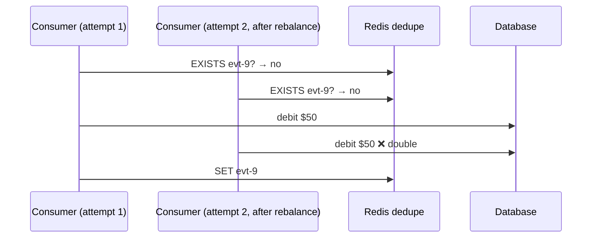

# Idempotent Consumers & Deduplication

!!! abstract "TL;DR"
    - Under at-least-once delivery, **every consumer will eventually see duplicates**: from retries, rebalances, replays and producer resends.
    - An **idempotent consumer** produces the same final state no matter how many times it processes a record.
    - Techniques, best first: **natural idempotency** (upsert / set-state), **version checks** (conditional updates), a **dedupe store** keyed by `eventId` (unique constraint in the **same transaction**), and **idempotency keys** for external APIs.
    - The dedupe check and the side effect must be **atomic**. Check-then-act across two systems has a race.
    - Every event needs a **stable unique ID** generated once by the producer, never per send attempt.

## Why it matters

"How did you handle duplicates?" follows every Kafka, retry or DLQ claim. Idempotency is also what makes replay (a key operational capability) safe.

## Core concepts

### Where duplicates come from

| Source | Example |
|---|---|
| Consumer crash before commit | Processed 10 records, crashed, reprocesses them on restart |
| Rebalance | Partition moved mid-batch, so the new owner starts from the last commit |
| Retries / DLQ replay | Failed record retried after partial side effects |
| Producer resend | App-level retry after a timeout. The idempotent producer (`enable.idempotence=true`, the default since Kafka 3.0) only dedupes the client's *internal* retries within one producer session; a second `send()` call or a restarted producer writes a new record |
| Upstream duplicates | Source system sends the same business event twice |

### Techniques


*Notice that you prefer designs needing no extra state. A dedupe store is the general fallback, and external side effects need the receiver's cooperation (idempotency keys).*

**1. Natural idempotency.** "Set status = SHIPPED" is idempotent; "increment count" isn't. Prefer state-based events (`balance=120`) over delta events (`+20`) when consumers only need current state.

**2. Version / sequence checks.** Reject stale or duplicate updates with a conditional write. This also protects against reordering.

**3. Dedupe store.**

```sql
CREATE TABLE processed_events (
  consumer_group VARCHAR(100) NOT NULL,
  event_id       UUID         NOT NULL,
  processed_at   TIMESTAMPTZ  NOT NULL DEFAULT now(),
  PRIMARY KEY (consumer_group, event_id)
);
```

Insert in the **same transaction** as the business change. A duplicate violates the PK, so you skip it. If the business change fails, the transaction rolls back and the dedupe row disappears with it, so the retry is processed normally. Under concurrency the database serialises the two attempts: the second insert of the same key blocks on the unique index until the first transaction commits (→ conflict, skip) or rolls back (→ insert succeeds, process). Purge rows older than the maximum replay window (e.g. 30 days).

**4. External side effects.** Pass `Idempotency-Key: <eventId>` to APIs that support it (payment providers usually do), or keep an outbox or state machine per side effect (`PENDING → SENT`) so a retry checks the recorded state first.

### The race you must avoid


*Notice that check-then-act across a separate store isn't atomic. Use a DB unique constraint in the same transaction, or an atomic `SET key value NX EX <ttl>` that claims the event before acting, plus a recovery path if processing then fails (otherwise a crash after the claim turns a duplicate into a **lost** event). The two attempts overlap in practice when a consumer stalls past `max.poll.interval.ms`, its partition is reassigned, and the "zombie" finishes its in-flight record anyway.*

## In practice: code & configuration

=== "❌ Common mistake"
    ```java
    @KafkaListener(topics = "payments")
    void on(PaymentEvent e) {
        if (dedupeCache.contains(e.eventId())) return;  // separate store, not atomic
        ledger.debit(e.accountId(), e.amount());        // non-idempotent delta
        dedupeCache.add(e.eventId());                   // crash before this → double debit on retry
    }
    ```

=== "✅ Correct approach"
    ```java
    @KafkaListener(topics = "payments")
    @Transactional
    public void on(PaymentEvent e) {
        int inserted = jdbc.update("""
            INSERT INTO processed_events(consumer_group, event_id)
            VALUES ('ledger', ?) ON CONFLICT DO NOTHING""", e.eventId());
        if (inserted == 0) return;                       // duplicate → skip
        ledger.debit(e.accountId(), e.amount());         // same DB transaction as the dedupe insert
    }
    ```

Notes on the correct version:

- `ON CONFLICT DO NOTHING` is PostgreSQL syntax. MySQL uses `INSERT IGNORE`; on other databases (or with JPA) do a plain insert and treat `DuplicateKeyException` as "already processed". On PostgreSQL prefer `ON CONFLICT`, because a constraint violation aborts the whole transaction there.
- `@Transactional` here is a **database** transaction (`DataSourceTransactionManager` / `JpaTransactionManager`), not a Kafka transaction. It only works through the Spring proxy: the listener must be a method on a Spring bean, invoked by the container, and `ledger.debit` must use the same `DataSource`.
- The DB transaction commits **before** the offset is committed. A crash in between redelivers the record, the insert conflicts, and the handler skips it. That ordering is exactly what makes at-least-once + dedupe safe.
- `eventId` comes from the payload or a record header set by the producer. `topic-partition-offset` is a weaker key: it catches consumer redelivery but not a producer that published the same business event twice, and it changes when events are replayed into another topic.

MongoDB variant (atomic conditional update with a version guard; a single-document update is atomic in MongoDB without a multi-document transaction):

```java
var query = Query.query(Criteria.where("_id").is(e.prescriptionId()).and("version").lt(e.version()));
var update = new Update().set("status", e.status()).set("version", e.version());
var result = mongoTemplate.updateFirst(query, update, Prescription.class);
// result.getMatchedCount() == 0 → stale, duplicate, or the document doesn't exist yet.
// Don't simply add upsert(true): when the doc exists with a newer version the filter doesn't match,
// MongoDB tries to insert the same _id and throws DuplicateKeyException. Either create the doc with a
// separate insert-if-absent, or use upsert and treat DuplicateKeyException as "stale → skip".
```

## Real-world usage

- **Stripe** popularised **idempotency keys** on API requests: the same key returns the same result without repeating the charge. Keys aren't kept forever (Stripe may prune them once they're at least 24 hours old), so a provider's key retention also bounds how late a retry or replay can safely be.
- **Debezium/CDC consumers** can use the source position carried in each change event (e.g. the PostgreSQL LSN or MySQL binlog file and position in the `source` block) as a natural dedupe and version key, because Debezium itself is at-least-once and re-emits events after a connector restart.
- **Healthcare:** duplicate notifications ("your prescription shipped" twice) hurt trust, and duplicate claims or adjudications have financial and compliance impact. Dedupe is a correctness requirement.

## Trade-offs & production gotchas

| Technique | Pros | Cons | Use when |
|---|---|---|---|
| Natural idempotency | No extra state | Not always possible (deltas, side effects) | The event carries full state and the write is an upsert, set or delete |
| Version check | Also handles reordering | Needs a version from the producer | Entities have a monotonically increasing version or sequence per key |
| DB dedupe table | General, atomic with DB changes | Extra writes; needs purging | Non-idempotent changes (deltas) land in a transactional database |
| Redis dedupe with TTL | Fast | Not atomic with the DB; TTL bounds protection; a claim can be lost on failover or eviction | A rare duplicate is tolerable (notifications, cache warm-up) or as a cheap first filter in front of a real guard |
| Idempotency key to API | Covers external effects | Depends on API support and the provider's key retention | The side effect is a call to an external system |

!!! warning "Gotchas"
    - An eventId generated **per send attempt** defeats deduplication. Generate it when the event is created (e.g. in the outbox row).
    - Dedupe retention must exceed your **max replay window**.
    - Dedupe per **consumer group** (different consumers legitimately process the same event).
    - Partial failure: if a handler does two external calls, make each one idempotent or use a saga.
    - Don't confuse this with the **idempotent producer** (`enable.idempotence`). That prevents duplicate *writes to the log* from producer retries; it does nothing about a consumer processing the same record twice.
    - "Claim first" stores (Redis `SET NX`, or a dedupe insert committed *before* the work) flip the failure mode: a crash after the claim means the event is skipped on retry. Store a status (`IN_PROGRESS` / `DONE`) with a timeout, or keep the claim in the same transaction as the work.

## How this connects to my experience

- **Where I used it:** Publicis Sapient, project OptumRx Meteor: "Designed Kafka-based event-driven workflows with retry and DLQ handling", in microservices built with Java, Spring Boot, Kafka, MongoDB, Redis and GraphQL. Retry and DLQ replay are exactly where duplicates come from, so this is the natural place to talk about idempotency. *[confirm that the consumers were explicitly made idempotent and how]*
- **Talking points:**
    - Which idempotency technique you used (upserts in MongoDB, eventId checks, Redis). *[confirm]* The resume states Redis was used for caching; using it for dedupe is *[confirm]*.
    - Why it was needed: retries and DLQ replay. *[confirm a concrete example]*
- **Likely follow-up chain:** "How did you dedupe?" → "Is that atomic?" → "What about external API calls?" → "How long do you keep dedupe records?"

## Interview questions

### Fundamentals

??? question "Q1. What is an idempotent consumer?"
    **Answer:** A consumer whose processing gives the same final state and the same external effects whether a record is handled once or many times. It's required because Kafka's practical delivery is at-least-once: the consumer processes and then commits the offset, so a crash, rebalance or retry between the two redelivers the record. Committing first would avoid duplicates but lose records (at-most-once), which is usually worse.

    **Interviewer listens for:** at-least-once as the cause (process-then-commit), "same final state" rather than "never receives duplicates", and that it's the consumer's responsibility.

    **Common wrong answer:** "Set `enable.idempotence=true`." That's the idempotent *producer*, which dedupes producer retries on the broker and doesn't make consumer processing idempotent.

??? question "Q2. Name ways to make processing idempotent."
    **Answer:** Upserts and set-state operations, conditional updates on versions, a dedupe table keyed by eventId written atomically with the change, and idempotency keys for external APIs. I'd pick in that order: the first two need no extra state, the dedupe table is the general fallback for deltas, and external calls need the receiver's cooperation.

    **Interviewer listens for:** more than one technique, a preference order with a reason, and the word "atomic" next to the dedupe store.

    **Common wrong answer:** Naming only "check Redis for the event ID" with no mention of atomicity or of what happens when processing fails after the check.

??? question "Q3. Why does a normal Kafka consumer need to be idempotent at all?"
    **Answer:** Kafka consumers are **at-least-once** by default. You process a record, then commit its offset. If the consumer crashes, times out (`max.poll.interval.ms`) or loses its partitions in a rebalance *after* processing but *before* the commit, the next owner of the partition reads the same records again. Producer retries without idempotence, DLQ replays and manual offset resets also redeliver. So duplicates are normal operation, not a rare bug.

    **Interviewer listens for:** commit-after-process ordering, rebalance and crash windows, replays and offset resets as other sources.

    **Common wrong answer:** "Kafka guarantees exactly-once, so duplicates cannot happen." EOS covers Kafka-to-Kafka writes inside a transaction, not your database or an SMS call.

### Intermediate

??? question "Q4. Why is a Redis 'seen' check not enough?"
    **Answer:** Check-then-act across Redis and the DB isn't atomic. Concurrent or retried processing can both pass the check, and a crash between the side effect and the `SET` reprocesses. Use a DB unique constraint in the same transaction, or `SET NX` to claim before acting with a status and recovery. Redis also adds its own gaps: the TTL bounds how long you're protected, and a claim can be lost on eviction or on failover with asynchronous replication. Redis is fine as a cheap first filter or where an occasional duplicate is acceptable; it shouldn't be the only guard on money or clinical data.

    **Interviewer listens for:** both failure orders (mark-after-work → duplicate, mark-before-work → lost event), atomicity with the business write, and the TTL / durability limits.

    **Common wrong answer:** "Redis is single-threaded, so it's atomic." A single Redis command is atomic; the check, the database write and the mark together are not.

??? question "Q5. How long should dedupe records live?"
    **Answer:** Longer than the maximum window in which a duplicate could arrive: topic retention, the replay policy and retry topic delays (e.g. 7–30 days). Purge with a TTL (a MongoDB TTL index, Redis `EX`) or a batch delete. Partition the table by date for cheap purging. Remember the downstream side too: an external provider's idempotency keys expire on their schedule, not yours.

    **Interviewer listens for:** retention derived from the replay window rather than a guessed number, a purge mechanism, and awareness of table growth.

    **Common wrong answer:** "Keep them forever" (unbounded growth) or "a few minutes is enough" (a DLQ replay days later slips straight through).

??? question "Q6. Delta events vs state events for idempotency?"
    **Answer:** State events (`status=SHIPPED`, `balance=120`) are naturally idempotent and tolerate duplicates. Delta events (`+20`) aren't and need dedupe. Delta events carry intent and are needed for audit or event sourcing, so they often need the dedupe store. State events have their own trap: a late, older state can overwrite a newer one, so pair them with a version check and rely on per-key ordering within a partition.

    **Interviewer listens for:** the trade-off in both directions, and that state events still need a version guard against stale overwrites.

    **Common wrong answer:** "Always use state events." That drops intent and history, and without a version an out-of-order event silently regresses the data.

??? question "Q7. What's the difference between Kafka's idempotent producer and an idempotent consumer?"
    **Answer:** They solve different duplicates. The idempotent producer (`enable.idempotence=true`, default since Kafka 3.0, requires `acks=all`) gives each producer a producer ID and a sequence number per partition, so the broker discards a batch that the client resends after a lost acknowledgement. It only covers the client's internal retries within one producer session; it doesn't cover the application calling `send()` twice, or a restart (unless a `transactional.id` is used). An idempotent consumer is application logic that makes *processing* safe to repeat, which is what handles redelivery after a crash, rebalance, retry topic or DLQ replay. You need both: one keeps duplicates out of the log, the other makes the ones that still arrive harmless.

    **Interviewer listens for:** PID + sequence number, "broker-side dedupe of producer retries", the session scope, and that consumer redelivery is a separate problem.

    **Common wrong answer:** "`enable.idempotence=true` gives exactly-once end to end."

??? question "Q8. Why not use topic-partition-offset as the dedupe key instead of an eventId?"
    **Answer:** It works for one class of duplicate: the same record redelivered to the same consumer group. It's unique and free. It fails when the *business event* is duplicated: an app-level producer retry or an upstream system sending twice creates two records with different offsets, and a replay through a retry topic, DLQ or mirrored cluster gives the event a new coordinate. A producer-generated eventId (payload field or header, created once, e.g. in the outbox row) survives all of those. Offsets are still useful a different way: storing the last processed offset per partition in the same database transaction as the data, and seeking to it on assignment, gives exactly-once processing for that sink without a per-event table.

    **Interviewer listens for:** distinguishing record identity from event identity, and the "store offsets with the data" alternative.

    **Common wrong answer:** "Offsets are unique, so they're always enough."

### Senior

??? question "Q9. The consumer updates MongoDB and calls an SMS provider. Make it idempotent."
    **Answer:** In MongoDB, store a notification document keyed by `eventId+channel` with status `PENDING` (unique index → duplicate inserts fail). Call the provider with an idempotency key if supported. Update to `SENT` with the provider message ID. On retry, read the status: `SENT` → skip; `PENDING` → query the provider or resend with the same key. The MongoDB business update itself should be an upsert or version-guarded update so it's safe to repeat. If the provider has no idempotency key and no lookup API, exactly-once is impossible: a crash after the provider accepted the SMS but before `SENT` is recorded leaves you choosing between resending (possible duplicate) and not resending (possible loss). State that choice explicitly; for a reminder I'd usually accept a rare duplicate, for an OTP or payment I'd insist on a provider with idempotency support. Accept and document the residual tiny window.

    **Interviewer listens for:** a per-side-effect state record with a unique key, the provider idempotency key, and honesty that the dual write can't be made atomic.

    **Common wrong answer:** "Wrap the MongoDB write and the SMS call in a transaction." An HTTP call can't join a database transaction, and it can't be rolled back.

??? question "Q10. How do idempotency and exactly-once semantics relate?"
    **Answer:** Kafka EOS gives atomic Kafka-to-Kafka processing. End-to-end exactly-once *effects* with external systems are achieved by at-least-once delivery plus idempotent processing. Concretely, EOS (`processing.guarantee=exactly_once_v2` in Kafka Streams, or a transactional producer with `sendOffsetsToTransaction` plus `isolation.level=read_committed` downstream) commits the output records and the consumed offsets in one Kafka transaction, so it covers consume-transform-produce only. The moment the handler writes to a database or calls an API, that write is outside the transaction. In practice, idempotency is the more general and robust tool, and the two combine well: EOS inside Kafka, idempotent sinks at the edges.

    **Interviewer listens for:** the Kafka-only scope of EOS, offsets committed inside the transaction, `read_committed`, and "exactly-once effects = at-least-once + idempotency".

    **Common wrong answer:** "We enabled exactly-once, so we don't need idempotent consumers." EOS doesn't cover the database or any external call.

??? question "Q11. Two instances process the same event at the same moment. What does your dedupe table do, and what breaks if you get the transaction boundary wrong?"
    **Answer:** With the insert and the business change in one transaction, the database arbitrates. The second insert of the same `(consumer_group, event_id)` blocks on the unique index until the first transaction finishes: if it commits, the second sees a conflict and skips; if it rolls back, the second proceeds and does the work. Either way the effect is applied once. Get the boundary wrong and you pick a failure mode. Committing the dedupe row *before* the work means a crash in between marks the event as done when it wasn't (lost update). Writing it *after* the work in a separate transaction means a crash in between repeats the work (duplicate). The same applies if the dedupe row and the data live in different databases: there's no shared transaction, so you need a status column and a recovery job, or an outbox. In MongoDB the equivalent is a multi-document transaction on a replica set, or folding the processed event ID or version into the business document itself so a single atomic update covers both.

    **Interviewer listens for:** unique-constraint blocking semantics, both failure orders, and what to do when a shared transaction isn't available.

    **Common wrong answer:** "Use `SELECT` to check, then `INSERT`." Under read-committed isolation both transactions see no row and both proceed; only the unique constraint is the guard.

### Scenario-based

??? question "Q12. After a DLQ replay, members got duplicate refill reminders. What went wrong and how do you fix it?"
    **Answer:** The notification consumer wasn't idempotent, or the replay assigned new event IDs. Fix it by keeping the original eventId on replay, adding a dedupe store per (eventId, channel), and making the replay tool preserve keys and headers. Add a pre-replay checklist. I'd also check why the record was in the DLQ: if the handler sends the notification and *then* fails on a later step, every retry and replay resends it, so the send needs its own recorded state (`PENDING → SENT`) rather than relying on the handler succeeding as a whole. Finally, check the dedupe retention: if the replay happened after the records were purged, the guard had already expired.

    **Interviewer listens for:** root cause before fix, stable event IDs across replay, per-side-effect idempotency for partial failures, and a process change (replay runbook, dry run).

    **Common wrong answer:** "Don't replay the DLQ" or "replay more carefully". Replay is a normal operation; the consumer has to be safe under it.

## Cheat sheet

| Concept | Remember |
|---|---|
| Why | At-least-once ⇒ duplicates are guaranteed |
| Best | Natural idempotency / version checks |
| General | Dedupe table + same transaction |
| External | Idempotency keys + recorded state |
| eventId | Generated once at the source |
| Retention | > max replay window, per consumer group |
| Idempotent producer | Dedupes producer retries on the broker; not a substitute for an idempotent consumer |
| Claim order | Mark-before-work → loss; mark-after-work → duplicate; same transaction → neither |
| EOS | Kafka-to-Kafka only; external effects still need idempotency |

## Sources

1. [microservices.io: Idempotent Consumer pattern](https://microservices.io/patterns/communication-style/idempotent-consumer.html): the pattern definition and the processed-messages table recorded in the same transaction.
2. [Stripe API: Idempotent requests](https://docs.stripe.com/api/idempotent_requests): idempotency keys on API requests and their retention (prunable after at least 24 hours).
3. [Apache Kafka: Message Delivery Semantics](https://kafka.apache.org/documentation/#semantics): at-most-once, at-least-once and exactly-once, the idempotent producer and transactions.
4. [Confluent: Idempotent Reader pattern](https://developer.confluent.io/patterns/event-processing/idempotent-reader/): consumer-side handling of duplicate events and tracking of processed IDs.
5. [Spring for Apache Kafka: Transactions](https://docs.spring.io/spring-kafka/reference/kafka/transactions.html): how listener-container Kafka transactions and `@Transactional` database transactions relate and in which order they commit.
6. [Debezium PostgreSQL connector](https://debezium.io/documentation/reference/stable/connectors/postgresql.html): at-least-once delivery after restarts and the `source` block (LSN) in change events.
