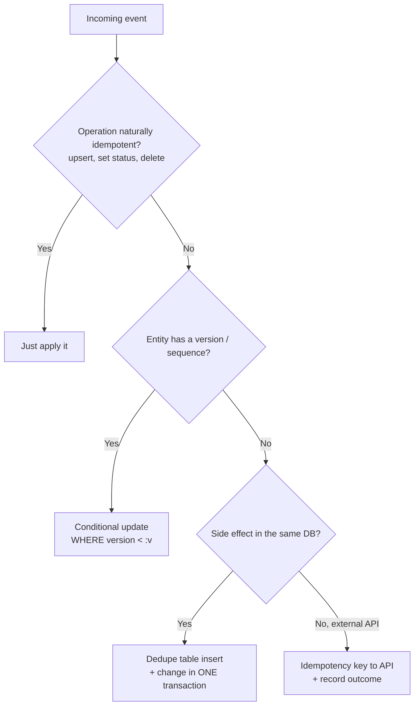
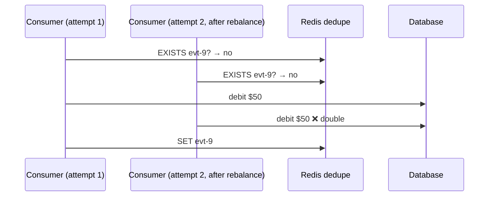

# Idempotent Consumers & Deduplication

!!! abstract "TL;DR"
    - Under at-least-once delivery, **every consumer will eventually see duplicates**: from retries, rebalances, replays and producer resends.
    - An **idempotent consumer** produces the same final state no matter how many times it processes a record.
    - Techniques, best first: **natural idempotency** (upsert / set-state), **version checks** (conditional updates), a **dedupe store** keyed by `eventId` (unique constraint in the **same transaction**), and **idempotency keys** for external APIs.
    - The dedupe check and the side effect must be **atomic**. Check-then-act across two systems has a race.
    - Every event needs a **stable unique ID** generated once by the producer, never per send attempt.

## Why it matters

"How did you handle duplicates?" follows every Kafka, retry or DLQ claim. Idempotency is also what makes replay (a key operational capability) safe.

## Core concepts

### Where duplicates come from

| Source | Example |
|---|---|
| Consumer crash before commit | Processed 10 records, crashed, reprocesses them on restart |
| Rebalance | Partition moved mid-batch, so the new owner starts from the last commit |
| Retries / DLQ replay | Failed record retried after partial side effects |
| Producer resend | App-level retry after a timeout (idempotent producer doesn't cover app retries or restarts) |
| Upstream duplicates | Source system sends the same business event twice |

### Techniques


*Notice that you prefer designs needing no extra state. A dedupe store is the general fallback, and external side effects need the receiver's cooperation (idempotency keys).*

**1. Natural idempotency.** "Set status = SHIPPED" is idempotent; "increment count" isn't. Prefer state-based events (`balance=120`) over delta events (`+20`) when consumers only need current state.

**2. Version / sequence checks.** Reject stale or duplicate updates with a conditional write. This also protects against reordering.

**3. Dedupe store.**

```sql
CREATE TABLE processed_events (
  consumer_group VARCHAR(100) NOT NULL,
  event_id       UUID         NOT NULL,
  processed_at   TIMESTAMPTZ  NOT NULL DEFAULT now(),
  PRIMARY KEY (consumer_group, event_id)
);
```

Insert in the **same transaction** as the business change. A duplicate violates the PK, so you skip it. Purge rows older than the maximum replay window (e.g. 30 days).

**4. External side effects.** Pass `Idempotency-Key: <eventId>` to APIs that support it (payment providers usually do), or keep an outbox or state machine per side effect (`PENDING → SENT`) so a retry checks the recorded state first.

### The race you must avoid


*Notice that check-then-act across a separate store isn't atomic. Use a DB unique constraint in the same transaction, or an atomic `SET NX` that claims the event before acting, plus a recovery path if processing then fails.*

## In practice: code & configuration

=== "❌ Common mistake"
    ```java
    @KafkaListener(topics = "payments")
    void on(PaymentEvent e) {
        if (dedupeCache.contains(e.eventId())) return;  // separate store, not atomic
        ledger.debit(e.accountId(), e.amount());        // non-idempotent delta
        dedupeCache.add(e.eventId());                   // crash before this → double debit on retry
    }
    ```

=== "✅ Correct approach"
    ```java
    @KafkaListener(topics = "payments")
    @Transactional
    public void on(PaymentEvent e) {
        int inserted = jdbc.update("""
            INSERT INTO processed_events(consumer_group, event_id)
            VALUES ('ledger', ?) ON CONFLICT DO NOTHING""", e.eventId());
        if (inserted == 0) return;                       // duplicate → skip
        ledger.debit(e.accountId(), e.amount());         // same DB transaction as the dedupe insert
    }
    ```

MongoDB variant (atomic upsert with a version guard):

```java
var query = Query.query(Criteria.where("_id").is(e.prescriptionId()).and("version").lt(e.version()));
var update = new Update().set("status", e.status()).set("version", e.version());
var result = mongoTemplate.updateFirst(query, update, Prescription.class);
// matchedCount == 0 → stale or duplicate; the first event creates the doc via a separate insert-if-absent
```

## Real-world usage

- **Stripe** popularised **idempotency keys** on API requests: the same key returns the same result without repeating the charge.
- **Debezium/CDC consumers** use the source LSN or position as a natural dedupe and version key.
- **Healthcare:** duplicate notifications ("your prescription shipped" twice) hurt trust, and duplicate claims or adjudications have financial and compliance impact. Dedupe is a correctness requirement.

## Trade-offs & production gotchas

| Technique | Pros | Cons |
|---|---|---|
| Natural idempotency | No extra state | Not always possible (deltas, side effects) |
| Version check | Also handles reordering | Needs a version from the producer |
| DB dedupe table | General, atomic with DB changes | Extra writes; needs purging |
| Redis dedupe with TTL | Fast | Not atomic with the DB; TTL bounds protection |
| Idempotency key to API | Covers external effects | Depends on API support |

!!! warning "Gotchas"
    - An eventId generated **per send attempt** defeats deduplication. Generate it when the event is created (e.g. in the outbox row).
    - Dedupe retention must exceed your **max replay window**.
    - Dedupe per **consumer group** (different consumers legitimately process the same event).
    - Partial failure: if a handler does two external calls, make each one idempotent or use a saga.

## How this connects to my experience

- **Where I used it:** Kafka consumers with retry/DLQ at OptumRx (MongoDB + Redis in the stack).
- **Talking points:**
    - Which idempotency technique you used (upserts in MongoDB, eventId checks, Redis). *[confirm]*
    - Why it was needed: retries and DLQ replay. *[confirm a concrete example]*
- **Likely follow-up chain:** "How did you dedupe?" → "Is that atomic?" → "What about external API calls?" → "How long do you keep dedupe records?"

## Interview questions

### Fundamentals

??? question "Q1. What is an idempotent consumer?"
    **Answer:** A consumer whose processing gives the same result whether a record is handled once or many times. It's required because Kafka's practical delivery is at-least-once.

??? question "Q2. Name ways to make processing idempotent."
    **Answer:** Upserts and set-state operations, conditional updates on versions, a dedupe table keyed by eventId written atomically with the change, and idempotency keys for external APIs.

### Intermediate

??? question "Q3. Why is a Redis 'seen' check not enough?"
    **Answer:** Check-then-act across Redis and the DB isn't atomic. Concurrent or retried processing can both pass the check, and a crash between the side effect and the `SET` reprocesses. Use a DB unique constraint in the same transaction, or `SET NX` to claim before acting with a status and recovery.

??? question "Q4. How long should dedupe records live?"
    **Answer:** Longer than the maximum window in which a duplicate could arrive: topic retention, the replay policy and retry topic delays (e.g. 7–30 days). Purge with a TTL or batch delete. Partition the table by date for cheap purging.

??? question "Q5. Delta events vs state events for idempotency?"
    **Answer:** State events (`status=SHIPPED`, `balance=120`) are naturally idempotent and tolerate duplicates. Delta events (`+20`) aren't and need dedupe. Delta events carry intent and are needed for audit or event sourcing, so they often need the dedupe store.

### Senior

??? question "Q6. The consumer updates MongoDB and calls an SMS provider. Make it idempotent."
    **Answer:** In MongoDB, store a notification document keyed by `eventId+channel` with status `PENDING` (unique index → duplicate inserts fail). Call the provider with an idempotency key if supported. Update to `SENT` with the provider message ID. On retry, read the status: `SENT` → skip; `PENDING` → query the provider or resend with the same key. Accept and document the residual tiny window.

??? question "Q7. How do idempotency and exactly-once semantics relate?"
    **Answer:** Kafka EOS gives atomic Kafka-to-Kafka processing. End-to-end exactly-once *effects* with external systems are achieved by at-least-once delivery plus idempotent processing. In practice, idempotency is the more general and robust tool.

### Scenario-based

??? question "Q8. After a DLQ replay, members got duplicate refill reminders. What went wrong and how do you fix it?"
    **Answer:** The notification consumer wasn't idempotent, or the replay assigned new event IDs. Fix it by keeping the original eventId on replay, adding a dedupe store per (eventId, channel), and making the replay tool preserve keys and headers. Add a pre-replay checklist.

## Cheat sheet

| Concept | Remember |
|---|---|
| Why | At-least-once ⇒ duplicates are guaranteed |
| Best | Natural idempotency / version checks |
| General | Dedupe table + same transaction |
| External | Idempotency keys + recorded state |
| eventId | Generated once at the source |
| Retention | > max replay window, per consumer group |

## Sources

1. [microservices.io: Idempotent Consumer pattern](https://microservices.io/patterns/communication-style/idempotent-consumer.html).
2. [Stripe API: Idempotent requests](https://docs.stripe.com/api/idempotent_requests).
3. [Apache Kafka: Message Delivery Semantics](https://kafka.apache.org/documentation/#semantics).
4. [Confluent: Idempotent Reader pattern](https://developer.confluent.io/patterns/event-processing/idempotent-reader/).
