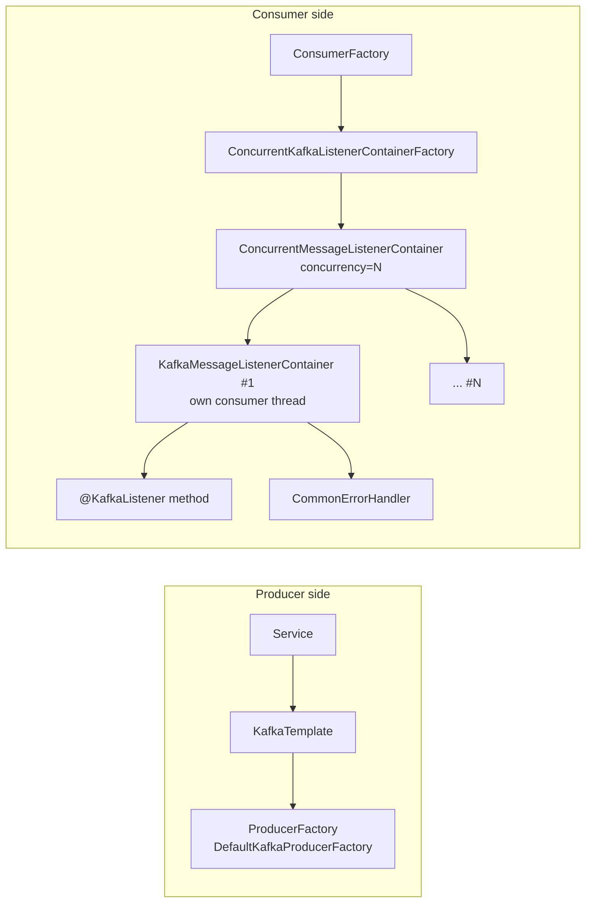
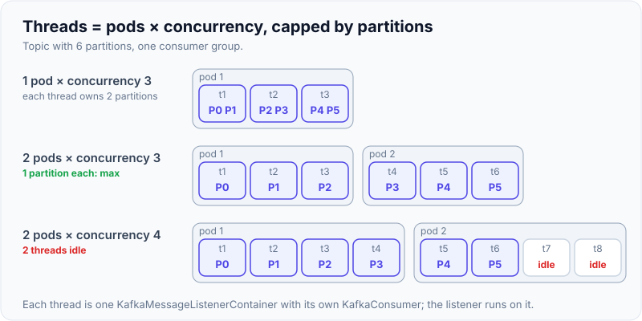

# Spring Kafka in Practice

!!! abstract "Key takeaways"
    - **`KafkaTemplate`** sends (returns `CompletableFuture<SendResult>` since 3.0). **`@KafkaListener`** consumes via a **listener container** (`ConcurrentMessageListenerContainer`).
    - Spring Boot auto-configures producer and consumer factories from `spring.kafka.*`. Spring sets `enable.auto.commit=false` and commits via **AckMode** (default `BATCH`).
    - `concurrency = N` creates N consumer threads, which is useful only up to the partition count.
    - Errors go to a **`CommonErrorHandler`** (`DefaultErrorHandler`: retry with back-off, then a recoverer like `DeadLetterPublishingRecoverer`) or to **`@RetryableTopic`** for non-blocking retries.
    - Test with **`@EmbeddedKafka`** or (better) **Testcontainers Kafka**.

## Why it matters

Most Java shops use Kafka through Spring. Interviewers expect you to know how the abstractions map to the underlying client (threads, commits, rebalances), because that's where production issues hide.

## Core concepts

### Architecture


*Notice that each child container owns one `KafkaConsumer` on one thread. Your listener runs on that thread, so slow listener code directly delays polling.*

{ loading=lazy }
*Notice the last row: `concurrency` is per pod, so scaling pods and raising concurrency multiply. Past the partition count the extra threads just sit idle.*

### AckMode (when offsets are committed)

| AckMode | Commits | Use |
|---|---|---|
| `BATCH` (default) | After all records from a `poll()` are processed | Good default |
| `RECORD` | After each record | Smaller replay window, more commits |
| `TIME` / `COUNT` / `COUNT_TIME` | Periodically | Tuning throughput |
| `MANUAL` | When you call `ack.acknowledge()` (queued, committed at batch end) | Explicit control |
| `MANUAL_IMMEDIATE` | Immediately on `acknowledge()` | Explicit + immediate |

{ loading=lazy }
*Watch the teal ticks: each one is a commit request to the broker. Fewer ticks mean higher throughput and a bigger replay window after a crash.*

### Listener signatures

```java
@KafkaListener(topics = "rx-status", groupId = "notifier")
void onEvent(RxEvent event) { }                                   // payload only

@KafkaListener(topics = "rx-status")
void onRecord(ConsumerRecord<String, RxEvent> rec) { }            // full record: key, headers, partition, offset

@KafkaListener(topics = "rx-status")
void onWithMeta(@Payload RxEvent e,
                @Header(KafkaHeaders.RECEIVED_KEY) String key,
                @Header(KafkaHeaders.RECEIVED_PARTITION) int partition,
                @Header(KafkaHeaders.OFFSET) long offset) { }

@KafkaListener(topics = "rx-status", batch = "true")
void onBatch(List<ConsumerRecord<String, RxEvent>> records) { }   // batch listener: bulk DB writes
```

### Error handling options

| Need | Use |
|---|---|
| Retry in place, then DLT | `DefaultErrorHandler(new DeadLetterPublishingRecoverer(template), backOff)` |
| Retry without blocking the partition | `@RetryableTopic` + `@DltHandler` |
| Bad bytes (poison pill) | `ErrorHandlingDeserializer` wrapping the real deserializer |
| Long back-off without rebalances | `ContainerPausingBackOffHandler` / non-blocking retries |
| Batch listener partial failure | Throw `new BatchListenerFailedException("msg", index)` (or pass the failed `ConsumerRecord`) so the handler knows which record failed |

Full details: [Error handling: retry topics, DLQ, poison messages, replay](07-error-handling-retry-topics-dlq-poison-messages-replay.md).

## In practice: code & configuration

### application.yml

```yaml
spring:
  kafka:
    bootstrap-servers: ${KAFKA_BOOTSTRAP}
    properties:
      security.protocol: SASL_SSL
      sasl.mechanism: OAUTHBEARER          # or SCRAM-SHA-512 / AWS_MSK_IAM, depending on the platform
    producer:
      key-serializer: org.apache.kafka.common.serialization.StringSerializer
      value-serializer: org.springframework.kafka.support.serializer.JsonSerializer   # Spring Kafka 4.x (Jackson 3): JacksonJsonSerializer
      acks: all
      compression-type: lz4
    consumer:
      group-id: rx-notifier
      auto-offset-reset: earliest
      key-deserializer: org.springframework.kafka.support.serializer.ErrorHandlingDeserializer
      value-deserializer: org.springframework.kafka.support.serializer.ErrorHandlingDeserializer
      properties:
        spring.deserializer.key.delegate.class: org.apache.kafka.common.serialization.StringDeserializer
        spring.deserializer.value.delegate.class: org.springframework.kafka.support.serializer.JsonDeserializer   # 4.x: JacksonJsonDeserializer
        spring.json.trusted.packages: com.example.rx.events
    listener:
      ack-mode: record
      concurrency: 3
      observation-enabled: true            # Micrometer tracing across produce/consume
    template:
      observation-enabled: true
```

!!! note "Version note"
    In Spring for Apache Kafka 4.0 the Jackson 2 classes (`JsonSerializer`, `JsonDeserializer`, `JsonSerde`) are deprecated in favour of Jackson 3 counterparts (`JacksonJsonSerializer`, `JacksonJsonDeserializer`, `JacksonJsonSerde`). The old classes still work. The `spring.json.*` property names are unchanged.

### Producer service

```java
@Slf4j
@Service
@RequiredArgsConstructor
class RxEventPublisher {
    private final KafkaTemplate<String, RxEvent> template;

    CompletableFuture<Void> publish(RxEvent e) {
        var record = new ProducerRecord<>("rx-status", e.prescriptionId(), e);
        record.headers().add("eventType", e.type().getBytes(StandardCharsets.UTF_8));
        return template.send(record).thenAccept(r ->
            log.debug("sent p={} o={}", r.getRecordMetadata().partition(), r.getRecordMetadata().offset()));
    }   // the caller must handle failure: .exceptionally(...) / .whenComplete(...), or .get(timeout) to block
}
```

`send()` is asynchronous. It only appends to the producer's buffer, so a broker-side failure shows up later on the future. If nobody looks at the future, a failed send is lost silently (Spring logs it through the default `LoggingProducerListener`, nothing more).

### Consumer with error handler and DLT

```java
@Configuration
class KafkaConfig {
    @Bean
    DefaultErrorHandler errorHandler(KafkaTemplate<Object, Object> template) {
        var backOff = new ExponentialBackOffWithMaxRetries(3);
        backOff.setInitialInterval(500);
        backOff.setMultiplier(2);
        var h = new DefaultErrorHandler(new DeadLetterPublishingRecoverer(template), backOff);
        h.addNotRetryableExceptions(ValidationException.class);
        return h;                       // Boot wires a single CommonErrorHandler bean into the default container factory
    }
}

@Component
@RequiredArgsConstructor
class RxNotifier {
    private final NotificationService notificationService;

    @KafkaListener(topics = "rx-status", groupId = "rx-notifier")
    void on(RxEvent e) {
        notificationService.notifyMember(e);   // throw on failure; don't swallow
    }
}
```

With this config a failing record gets 1 delivery + 3 retries (500 ms, 1 s, 2 s) and is then published to `rx-status-dlt`, on the **same partition number** as the original. So the DLT needs at least as many partitions as the source topic, or you supply a custom destination resolver. The default suffix is `-dlt` in current versions (standardised in 3.3). Older versions used `.DLT`, so check which one your cluster actually has.

### Pausing and resuming a listener (e.g. downstream outage)

```java
@Autowired KafkaListenerEndpointRegistry registry;

void onCircuitOpen()   { registry.getListenerContainer("rx-notifier-id").pause(); }
void onCircuitClosed() { registry.getListenerContainer("rx-notifier-id").resume(); }
// give the listener an id: @KafkaListener(id = "rx-notifier-id", ...)
```

### Testing with Testcontainers

```java
@SpringBootTest
@Testcontainers
class RxNotifierIT {
    @Container
    @ServiceConnection                               // Boot 3.1+: auto-wires bootstrap servers
    static KafkaContainer kafka =                    // org.testcontainers.kafka.KafkaContainer (apache/kafka image, KRaft)
        new KafkaContainer(DockerImageName.parse("apache/kafka:4.0.0"));

    @Autowired KafkaTemplate<String, RxEvent> template;
    @MockitoBean NotificationService notificationService;   // Spring Framework 6.2 / Boot 3.4+. Older: @MockBean

    @Test
    void notifiesMemberOnStatusChange() {
        template.send("rx-status", "rx-1", RxEvent.shipped("rx-1"));
        await().atMost(Duration.ofSeconds(10)).untilAsserted(() ->
            verify(notificationService).notifyMember(argThat(e -> e.prescriptionId().equals("rx-1"))));
    }
}
```

There are two `KafkaContainer` classes. `org.testcontainers.kafka.KafkaContainer` runs the `apache/kafka` image. The older `org.testcontainers.containers.KafkaContainer` (deprecated) runs `confluentinc/cp-kafka`; its replacement for Confluent images is `org.testcontainers.kafka.ConfluentKafkaContainer`. `@ServiceConnection` arrived in Boot 3.1. Use a recent Boot 3.x (3.4+) for the `org.testcontainers.kafka` classes. The consumer needs `auto-offset-reset: earliest` (set above), otherwise a record sent before the listener gets its partitions is skipped.

=== "❌ Common mistake"
    ```java
    @KafkaListener(topics = "rx-status", concurrency = "20")  // topic has 6 partitions
    void on(RxEvent e) { ... }                               // 14 idle threads, false sense of scale
    ```

=== "✅ Correct approach"
    ```java
    @KafkaListener(topics = "rx-status", concurrency = "${rx.listener.concurrency:6}") // pods × concurrency ≤ partitions (6 here = 1 pod; use 2 with 3 pods)
    void on(RxEvent e) { ... }
    ```

## Real-world usage

- **Typical microservice:** Boot auto-config + one `DefaultErrorHandler` bean + `ErrorHandlingDeserializer` + DLT + Micrometer observation for tracing.
- **Kubernetes:** total consumers = pods × concurrency. Keep it ≤ partitions, or threads sit idle.
- **Versions:** Spring Boot 3.x pairs with Spring for Apache Kafka 3.x (Kafka 3.x clients). Spring Boot 4.x pairs with Spring Kafka 4.x: Kafka 4 clients, support for the KIP-848 consumer rebalance protocol (`group.protocol=consumer`), Jackson 3 serializers, Spring Retry replaced by Spring Framework 7 core retry, and `@EmbeddedKafka` running KRaft only (ZooKeeper support removed).

## Trade-offs & production gotchas

| Option | Pros | Cons | Use when |
|---|---|---|---|
| AckMode `BATCH` (default) | Fewest commits, best throughput | A crash mid-batch replays the whole batch | Default; consumers are idempotent |
| AckMode `RECORD` | Replay window of about one record | One commit per record, lower throughput | Per-record work is expensive or duplicates are costly |
| AckMode `MANUAL` / `MANUAL_IMMEDIATE` | You decide when a record counts as done | Forget to `acknowledge()` and nothing is committed, so everything replays after a restart or rebalance | Async hand-off, or acking only after an external call succeeds |
| Blocking retry (`DefaultErrorHandler`) | Keeps per-partition order, no extra topics | Stalls the partition; long back-off risks exceeding `max.poll.interval.ms` | Ordering matters, failures are short |
| Non-blocking retry (`@RetryableTopic`) | Main topic keeps flowing | Loses ordering, adds retry topics; not supported for batch listeners | Ordering per key doesn't matter, failures can be long |
| Record listener | Simple, precise error handling | One listener call per record | Default |
| Batch listener | Bulk DB writes, higher throughput | Partial failures need `BatchListenerFailedException` | High-volume sinks |
| `@EmbeddedKafka` | Fast, no Docker | In-JVM broker, not what runs in production | Quick slice tests |
| Testcontainers | Real broker, real version | Needs Docker, slower start | Integration tests in CI |

!!! warning "Gotchas"
    - **Swallowing exceptions** in listeners commits the offset, so the data is lost silently.
    - **`JsonDeserializer` trusted packages**: deserializing untrusted types is a security risk. Restrict `spring.json.trusted.packages`, or use type mapping or schemas.
    - **Type headers:** `JsonSerializer` adds `__TypeId__` headers, so producer class names leak into the contract. Disable them (`spring.json.add.type.headers=false`) between services and configure the consumer's default type.
    - **`@Transactional` on listeners** creates a DB transaction, not a Kafka one, unless the container is configured with a `KafkaTransactionManager`.
    - **Batch listeners** need `BatchListenerFailedException` to avoid retrying the entire batch.
    - **Default error handling drops records.** With no recoverer, `DefaultErrorHandler` retries 9 times with no delay (`FixedBackOff(0, 9)`, 10 attempts), then logs the record and moves on.
    - **DLT publishing can fail too.** The DLT is written to the same partition number by default, so it needs enough partitions. For deserialization failures the recoverer publishes the raw `byte[]`, which a `KafkaTemplate` built with `JsonSerializer` handles badly. Give the recoverer a template with `ByteArraySerializer` (it accepts a map of value type → template).
    - **Once the producer factory is transactional** (`transaction-id-prefix` set), `KafkaTemplate` sends outside a transaction throw `IllegalStateException`, unless you set `allowNonTransactional` or use a second template.

## How this connects to my experience

- **Where I used it:** OptumRx Meteor (Publicis Sapient). *"Designed and developed microservices using Java, Spring Boot, Kafka, MongoDB, Redis, and GraphQL"* and *"Designed Kafka-based event-driven workflows with retry and DLQ handling."* *[confirm: that the Kafka code used Spring for Apache Kafka (`@KafkaListener` / `KafkaTemplate`) and not the plain client or Spring Cloud Stream]* Spring Boot itself also at Coriolis (CCKM REST APIs) and Johnson Controls (Metasys, Spring Security); the resume doesn't mention Kafka on those projects.
- **Talking points:**
    - Retry and DLQ handling for the event-driven workflows (resume bullet). *[confirm: DefaultErrorHandler + DeadLetterPublishingRecoverer, @RetryableTopic or custom]*
    - Listener setup: AckMode, concurrency, error handler + DLT, deserialization safety. *[confirm actual config]*
    - Testing approach for Kafka flows (embedded vs Testcontainers). *[confirm]*
    - Observability: tracing and metrics for consumer lag. *[confirm]*
- **Likely follow-up chain:** "How did you configure listeners?" → "What AckMode and why?" → "How did you test Kafka code?" → "How do you trace a message end to end?" Answer each with the mechanism first (container thread, commit point, error handler), then the choice I made and why.

## Interview questions

### Fundamentals

??? question "Q1. How does @KafkaListener work under the hood?"
    **Answer:** A bean post-processor (`KafkaListenerAnnotationBeanPostProcessor`) finds the annotated methods and registers an endpoint for each with the `KafkaListenerEndpointRegistry`. The container factory creates a `ConcurrentMessageListenerContainer` with N child `KafkaMessageListenerContainer`s, each owning a `KafkaConsumer` on its own thread running the poll loop. It invokes your method through a message-converting adapter, handles commits per AckMode, and routes exceptions to the `CommonErrorHandler`.

    **Interviewer listens for:** One consumer per thread, the listener running on the poll thread, and commits being done by the container.

    **Common wrong answer:** "Spring uses a thread pool to process each message", which would break ordering and offset management.

??? question "Q2. What's the default commit behaviour in Spring Kafka?"
    **Answer:** Spring disables Kafka auto-commit (`enable.auto.commit=false` unless you set it explicitly) and uses AckMode `BATCH`: the container commits offsets after all records from a poll are processed by the listener. Commits are synchronous by default (`syncCommits=true`). If the listener throws, the error handler decides what happens. When it recovers a record (skip or DLT), that record's offset is committed too.

    **Interviewer listens for:** The container commits, not the Kafka client's timer. At-least-once follows from committing after processing.

    **Common wrong answer:** "Kafka auto-commits every 5 seconds." That's the plain client default, not Spring's.

??? question "Q3. What does the concurrency attribute do?"
    **Answer:** It creates that many consumers (threads) in the group for this listener in this instance. Partitions are distributed among them. More than the partition count leaves threads idle. Across a deployment the number that matters is pods × concurrency versus partitions. Ordering per partition is kept, because a partition is only ever owned by one consumer thread.

    **Interviewer listens for:** Partition count as the ceiling on parallelism, and the pods × concurrency arithmetic.

    **Common wrong answer:** "It's the number of threads processing each message in parallel."

### Intermediate

??? question "Q4. How do you send failed messages to a DLT in Spring Kafka?"
    **Answer:** Configure `DefaultErrorHandler` with a `DeadLetterPublishingRecoverer` (blocking retries, then DLT `<topic>-dlt`, same partition number; older versions used `<topic>.DLT`), or use `@RetryableTopic` with an optional `@DltHandler` for non-blocking retries. Add `ErrorHandlingDeserializer` for poison pills. The recoverer adds headers with the original topic, partition, offset and the exception, which is what you use for triage and replay. Mark permanent failures with `addNotRetryableExceptions` so they skip the retries.

    **Interviewer listens for:** Blocking vs non-blocking, the same-partition default, and the diagnostic headers.

    **Common wrong answer:** "Catch the exception in the listener and send to a DLQ topic by hand." It works, but you lose retries and back-off, and a failed DLQ send inside the catch block is easy to swallow.

??? question "Q5. How do you handle a failure in the middle of a batch listener?"
    **Answer:** Throw `BatchListenerFailedException` with the failed record's index. `DefaultErrorHandler` commits offsets for the records before it, redelivers the failed record and the ones after it, and after retries are exhausted recovers the failed one (DLT). With any other exception the handler can't tell which record failed, so it falls back to retrying the whole batch, and when retries run out the recoverer is called for every record in the batch.

    **Interviewer listens for:** That the framework needs the index, and that records before the failure may be processed again unless the listener is idempotent.

    **Common wrong answer:** "Spring retries only the failed record automatically."

??? question "Q6. How would you test a Kafka consumer?"
    **Answer:** Unit-test the business logic without Kafka. Integration-test with Testcontainers (a real broker, `@ServiceConnection`) or `@EmbeddedKafka`. Send records via `KafkaTemplate`, assert side effects with Awaitility, and test error paths: DLT routing, deserialization failures, duplicates. I prefer Testcontainers for integration tests because it's the real broker at the production version. `@EmbeddedKafka` is faster and needs no Docker.

    **Interviewer listens for:** A test pyramid (logic without Kafka, a few real-broker tests), async assertions, and error-path coverage.

    **Common wrong answer:** "`Thread.sleep(5000)` then assert", or only mocking `KafkaTemplate`.

??? question "Q7. When would you use manual acknowledgment, and what's the difference between MANUAL and MANUAL_IMMEDIATE?"
    **Answer:** Use it when "the listener method returned" isn't the same as "the work is done", for example when the commit should happen only after an external call confirms. Add an `Acknowledgment` parameter and call `acknowledge()`. With `MANUAL` the ack is queued and the container commits once the records from the poll have been processed. With `MANUAL_IMMEDIATE` the commit happens right away when `acknowledge()` is called on the consumer thread. Kafka offsets are a position, not per-message acks, so committing offset N implies everything before it. For most cases the default `BATCH` or `RECORD` plus throwing on failure is simpler and safer.

    **Interviewer listens for:** Offsets are cumulative. A forgotten `acknowledge()` means replay after a restart or rebalance.

    **Common wrong answer:** "Manual ack lets me skip a bad message and ack the others", treating Kafka like a queue with per-message acks.

??? question "Q8. KafkaTemplate.send() returned without an exception. Is the message delivered?"
    **Answer:** Not necessarily. `send()` is asynchronous. It returns a `CompletableFuture<SendResult>` after the record is put in the producer's buffer. Delivery failures (timeout after `delivery.timeout.ms`, not enough replicas with `acks=all`, record too large) complete the future exceptionally later. Handle it with `whenComplete` / `exceptionally`, or block with `get(timeout)` when the caller needs certainty. Some errors do throw synchronously, such as serialization failures or metadata timeouts (`max.block.ms`). If the send must be consistent with a DB write, use the outbox pattern.

    **Interviewer listens for:** Async semantics, the future, and what you do when it fails.

    **Common wrong answer:** "Wrap `send()` in try/catch."

### Senior

??? question "Q9. How do you enable Kafka transactions in Spring and what do they cover?"
    **Answer:** Set `spring.kafka.producer.transaction-id-prefix`. Boot then makes the producer factory transactional and creates a `KafkaTransactionManager`, which the listener container uses. The container starts a Kafka transaction before calling the listener, `KafkaTemplate` sends join it, and the consumed offsets are sent to the same transaction (`sendOffsetsToTransaction`), so the outputs and the offset commit succeed or abort together. Consumers downstream need `isolation.level=read_committed` (the default is `read_uncommitted`). DB writes aren't included. Use the outbox pattern or idempotent consumers for those. Outside a listener, use `@Transactional` with the Kafka transaction manager or `template.executeInTransaction(...)`.

    **Interviewer listens for:** Scope: consume-process-produce within Kafka only. `read_committed` on the readers. No distributed transaction with the database.

    **Common wrong answer:** "`@Transactional` makes the DB write and the Kafka send atomic."

??? question "Q10. How do you propagate tracing context through Kafka with Spring?"
    **Answer:** Enable `spring.kafka.template.observation-enabled` and `spring.kafka.listener.observation-enabled` with Micrometer Tracing (OpenTelemetry bridge). Trace context goes into record headers on send (W3C `traceparent` by default) and is restored on consume, so traces span producer → topic → consumer. Observation is off by default for both the template and the listener. If you build your own `KafkaTemplate` or container factory, set `observationEnabled` on those. Batch listeners don't get a per-record trace, because one call carries many records.

    **Interviewer listens for:** Headers as the carrier, and that it must be enabled on both sides.

    **Common wrong answer:** "Tracing works automatically once Micrometer is on the classpath."

### Scenario-based

??? question "Q11. Your listener needs to stop consuming when a downstream dependency is down. How?"
    **Answer:** Give the listener an `id`. When a circuit breaker opens, call `registry.getListenerContainer(id).pause()`, and `resume()` when it closes. A paused consumer keeps calling `poll()` but gets no records back, so it stays inside `max.poll.interval.ms`, keeps its partitions, and there's no rebalance and no DLQ flood. The pause takes effect before the next poll, so records already fetched are still delivered. Those need the error handler's back-off. Pause state is per instance: every pod has to react to its own circuit breaker.

    **Interviewer listens for:** Pause instead of stop (stopping triggers a rebalance), and why polling must continue.

    **Common wrong answer:** "Sleep in the listener until the dependency is back", which exceeds `max.poll.interval.ms` and causes a rebalance loop.

??? question "Q12. After a deployment, a consumer group keeps rebalancing and lag grows. The listener calls a slow downstream API. What do you check and change?"
    **Answer:** The listener runs on the consumer's poll thread. If processing one batch takes longer than `max.poll.interval.ms` (default 5 minutes), the consumer is removed from the group, its partitions move, the commit fails, and the next owner reprocesses the same records. That repeats. Check the logs for "poll interval exceeded" / `CommitFailedException` and the time taken per batch (`max.poll.records` default 500 × per-record time). Fixes, in order: lower `max.poll.records`, add timeouts to the downstream call, raise `max.poll.interval.ms` if the work is legitimately long, pause the container while the dependency is down, and move long waits to non-blocking retries. Scale out with more partitions and consumers if it's a throughput problem. Make the listener idempotent, because the replays will produce duplicates.

    **Interviewer listens for:** Linking listener duration to `max.poll.interval.ms`, separate from heartbeats and `session.timeout.ms`.

    **Common wrong answer:** "Increase `session.timeout.ms`" or "add more threads with `@Async`" (which loses offset safety).

## Cheat sheet

| Item | Remember |
|---|---|
| Send result | `CompletableFuture<SendResult>` (3.0+) |
| Default AckMode | BATCH; Kafka auto-commit disabled by Spring |
| Error handler | `DefaultErrorHandler`, default `FixedBackOff(0, 9)` |
| Non-blocking | `@RetryableTopic` + `@DltHandler` |
| Poison pill | `ErrorHandlingDeserializer` |
| DLT name | `<topic>-dlt`, same partition number (older versions: `.DLT`) |
| Transactions | `spring.kafka.producer.transaction-id-prefix`; readers need `read_committed` |
| Tracing | `observation-enabled` on template **and** listener (off by default) |
| Pause | `KafkaListenerEndpointRegistry` → `pause()/resume()` |
| Tests | Testcontainers (`org.testcontainers.kafka.KafkaContainer`) + `@ServiceConnection` |
| 4.x changes | Kafka 4 clients, KIP-848, `JacksonJson*` serializers, KRaft-only `@EmbeddedKafka` |

## Sources

1. [Spring for Apache Kafka reference](https://docs.spring.io/spring-kafka/reference/): containers, AckMode, error handling, transactions.
2. [Spring Boot: Apache Kafka support](https://docs.spring.io/spring-boot/reference/messaging/kafka.html): `spring.kafka.*` auto-configuration.
3. [Spring for Apache Kafka: Handling Exceptions](https://docs.spring.io/spring-kafka/reference/kafka/annotation-error-handling.html).
4. [Testcontainers: Kafka module](https://java.testcontainers.org/modules/kafka/): `KafkaContainer` vs `ConfluentKafkaContainer`.
5. [Spring for Apache Kafka: What's new / change history](https://docs.spring.io/spring-kafka/reference/appendix/change-history.html): 4.0 changes (Kafka 4 client, KIP-848, Jackson 3, KRaft-only embedded broker), `-dlt` suffix.
6. [Spring Boot: Testcontainers service connections](https://docs.spring.io/spring-boot/reference/testing/testcontainers.html): which Kafka containers `@ServiceConnection` supports.
