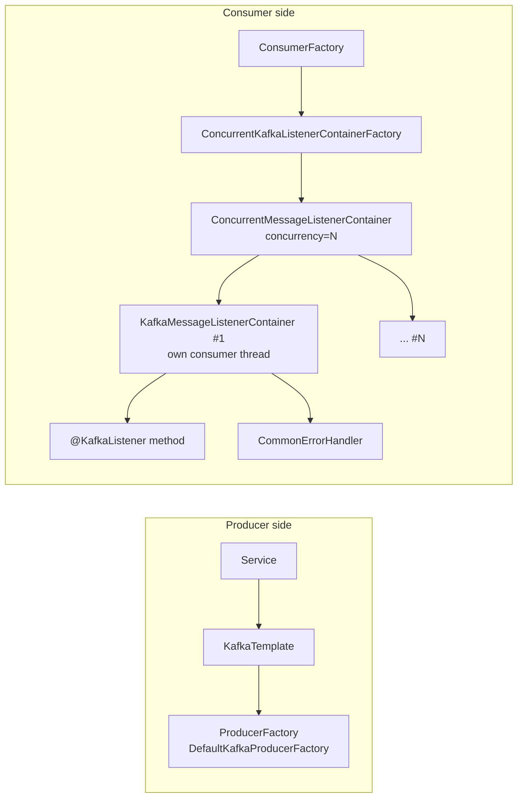

# Spring Kafka in Practice

!!! abstract "TL;DR"
    - **`KafkaTemplate`** sends (returns `CompletableFuture<SendResult>` since 3.0). **`@KafkaListener`** consumes via a **listener container** (`ConcurrentMessageListenerContainer`).
    - Spring Boot auto-configures producer and consumer factories from `spring.kafka.*`. Spring sets `enable.auto.commit=false` and commits via **AckMode** (default `BATCH`).
    - `concurrency = N` creates N consumer threads, which is useful only up to the partition count.
    - Errors go to a **`CommonErrorHandler`** (`DefaultErrorHandler`: retry with back-off, then a recoverer like `DeadLetterPublishingRecoverer`) or to **`@RetryableTopic`** for non-blocking retries.
    - Test with **`@EmbeddedKafka`** or (better) **Testcontainers Kafka**.

## Why it matters

Most Java shops use Kafka through Spring. Interviewers expect you to know how the abstractions map to the underlying client (threads, commits, rebalances), because that's where production issues hide.

## Core concepts

### Architecture


*Notice that each child container owns one `KafkaConsumer` on one thread. Your listener runs on that thread, so slow listener code directly delays polling.*

### AckMode (when offsets are committed)

| AckMode | Commits | Use |
|---|---|---|
| `BATCH` (default) | After all records from a `poll()` are processed | Good default |
| `RECORD` | After each record | Smaller replay window, more commits |
| `TIME` / `COUNT` / `COUNT_TIME` | Periodically | Tuning throughput |
| `MANUAL` | When you call `ack.acknowledge()` (queued, committed at batch end) | Explicit control |
| `MANUAL_IMMEDIATE` | Immediately on `acknowledge()` | Explicit + immediate |

### Listener signatures

```java
@KafkaListener(topics = "rx-status", groupId = "notifier")
void onEvent(RxEvent event) { }                                   // payload only

@KafkaListener(topics = "rx-status")
void onRecord(ConsumerRecord<String, RxEvent> rec) { }            // full record: key, headers, partition, offset

@KafkaListener(topics = "rx-status")
void onWithMeta(@Payload RxEvent e,
                @Header(KafkaHeaders.RECEIVED_KEY) String key,
                @Header(KafkaHeaders.RECEIVED_PARTITION) int partition,
                @Header(KafkaHeaders.OFFSET) long offset) { }

@KafkaListener(topics = "rx-status", batch = "true")
void onBatch(List<ConsumerRecord<String, RxEvent>> records) { }   // batch listener: bulk DB writes
```

### Error handling options

| Need | Use |
|---|---|
| Retry in place, then DLT | `DefaultErrorHandler(new DeadLetterPublishingRecoverer(template), backOff)` |
| Retry without blocking the partition | `@RetryableTopic` + `@DltHandler` |
| Bad bytes (poison pill) | `ErrorHandlingDeserializer` wrapping the real deserializer |
| Long back-off without rebalances | `ContainerPausingBackOffHandler` / non-blocking retries |
| Batch listener partial failure | Throw `BatchListenerFailedException(index)` so the handler knows which record failed |

Full details: *Error handling: retry topics, DLQ, poison messages, replay*.

## In practice: code & configuration

### application.yml

```yaml
spring:
  kafka:
    bootstrap-servers: ${KAFKA_BOOTSTRAP}
    properties:
      security.protocol: SASL_SSL
      sasl.mechanism: OAUTHBEARER          # or SCRAM-SHA-512 / AWS_MSK_IAM, depending on the platform
    producer:
      key-serializer: org.apache.kafka.common.serialization.StringSerializer
      value-serializer: org.springframework.kafka.support.serializer.JsonSerializer
      acks: all
      compression-type: lz4
    consumer:
      group-id: rx-notifier
      auto-offset-reset: earliest
      key-deserializer: org.springframework.kafka.support.serializer.ErrorHandlingDeserializer
      value-deserializer: org.springframework.kafka.support.serializer.ErrorHandlingDeserializer
      properties:
        spring.deserializer.key.delegate.class: org.apache.kafka.common.serialization.StringDeserializer
        spring.deserializer.value.delegate.class: org.springframework.kafka.support.serializer.JsonDeserializer
        spring.json.trusted.packages: com.example.rx.events
    listener:
      ack-mode: record
      concurrency: 3
      observation-enabled: true            # Micrometer tracing across produce/consume
    template:
      observation-enabled: true
```

### Producer service

```java
@Service
@RequiredArgsConstructor
class RxEventPublisher {
    private final KafkaTemplate<String, RxEvent> template;

    CompletableFuture<Void> publish(RxEvent e) {
        var record = new ProducerRecord<>("rx-status", e.prescriptionId(), e);
        record.headers().add("eventType", e.type().getBytes(StandardCharsets.UTF_8));
        return template.send(record).thenAccept(r ->
            log.debug("sent p={} o={}", r.getRecordMetadata().partition(), r.getRecordMetadata().offset()));
    }
}
```

### Consumer with error handler and DLT

```java
@Configuration
class KafkaConfig {
    @Bean
    DefaultErrorHandler errorHandler(KafkaTemplate<Object, Object> template) {
        var backOff = new ExponentialBackOffWithMaxRetries(3);
        backOff.setInitialInterval(500);
        backOff.setMultiplier(2);
        var h = new DefaultErrorHandler(new DeadLetterPublishingRecoverer(template), backOff);
        h.addNotRetryableExceptions(ValidationException.class);
        return h;                       // Boot wires this into the default container factory
    }
}

@Component
class RxNotifier {
    @KafkaListener(topics = "rx-status", groupId = "rx-notifier")
    void on(RxEvent e) {
        notificationService.notifyMember(e);   // throw on failure; don't swallow
    }
}
```

### Pausing and resuming a listener (e.g. downstream outage)

```java
@Autowired KafkaListenerEndpointRegistry registry;

void onCircuitOpen()   { registry.getListenerContainer("rx-notifier-id").pause(); }
void onCircuitClosed() { registry.getListenerContainer("rx-notifier-id").resume(); }
// give the listener an id: @KafkaListener(id = "rx-notifier-id", ...)
```

### Testing with Testcontainers

```java
@SpringBootTest
@Testcontainers
class RxNotifierIT {
    @Container
    @ServiceConnection                               // Boot 3.1+: auto-wires bootstrap servers
    static KafkaContainer kafka = new KafkaContainer(DockerImageName.parse("apache/kafka:4.0.0"));

    @Autowired KafkaTemplate<String, RxEvent> template;
    @MockitoBean NotificationService notificationService;

    @Test
    void notifiesMemberOnStatusChange() {
        template.send("rx-status", "rx-1", RxEvent.shipped("rx-1"));
        await().atMost(Duration.ofSeconds(10)).untilAsserted(() ->
            verify(notificationService).notifyMember(argThat(e -> e.prescriptionId().equals("rx-1"))));
    }
}
```

=== "❌ Common mistake"
    ```java
    @KafkaListener(topics = "rx-status", concurrency = "20")  // topic has 6 partitions
    void on(RxEvent e) { ... }                               // 14 idle threads, false sense of scale
    ```

=== "✅ Correct approach"
    ```java
    @KafkaListener(topics = "rx-status", concurrency = "${rx.listener.concurrency:6}") // = partitions / pods
    void on(RxEvent e) { ... }
    ```

## Real-world usage

- **Typical microservice:** Boot auto-config + one `DefaultErrorHandler` bean + `ErrorHandlingDeserializer` + DLT + Micrometer observation for tracing.
- **Kubernetes:** total consumers = pods × concurrency. Keep it ≤ partitions, or threads sit idle.
- **Versions:** Spring Boot 3.x pairs with Spring for Apache Kafka 3.x. Spring Boot 4.x pairs with Spring Kafka 4.x (Kafka 4 clients, KIP-848 support).

## Trade-offs & production gotchas

!!! warning "Gotchas"
    - **Swallowing exceptions** in listeners commits the offset, so the data is lost silently.
    - **`JsonDeserializer` trusted packages**: deserializing untrusted types is a security risk. Restrict `spring.json.trusted.packages`, or use type mapping or schemas.
    - **Type headers:** `JsonSerializer` adds `__TypeId__` headers, so producer class names leak into the contract. Disable them (`spring.json.add.type.headers=false`) between services and configure the consumer's default type.
    - **`@Transactional` on listeners** creates a DB transaction, not a Kafka one, unless the container is configured with a `KafkaTransactionManager`.
    - **Batch listeners** need `BatchListenerFailedException` to avoid retrying the entire batch.

## How this connects to my experience

- **Where I used it:** Spring Boot microservices with Kafka at OptumRx; Spring Boot services throughout my career.
- **Talking points:**
    - Listener setup: AckMode, concurrency, error handler + DLT, deserialization safety. *[confirm actual config]*
    - Testing approach for Kafka flows (embedded vs Testcontainers). *[confirm]*
    - Observability: tracing and metrics for consumer lag. *[confirm]*
- **Likely follow-up chain:** "How did you configure listeners?" → "What AckMode and why?" → "How did you test Kafka code?" → "How do you trace a message end to end?"

## Interview questions

### Fundamentals

??? question "Q1. How does @KafkaListener work under the hood?"
    **Answer:** A bean post-processor registers an endpoint. The container factory creates a `ConcurrentMessageListenerContainer` with N child containers, each owning a `KafkaConsumer` on its own thread running the poll loop. It invokes your method through a message-converting adapter, handles commits per AckMode, and routes exceptions to the `CommonErrorHandler`.

??? question "Q2. What's the default commit behaviour in Spring Kafka?"
    **Answer:** Spring disables Kafka auto-commit and uses AckMode `BATCH`: offsets are committed after all records from a poll are processed by the listener.

??? question "Q3. What does the concurrency attribute do?"
    **Answer:** It creates that many consumers (threads) in the group for this listener in this instance. Partitions are distributed among them. More than the partition count leaves threads idle.

### Intermediate

??? question "Q4. How do you send failed messages to a DLT in Spring Kafka?"
    **Answer:** Configure `DefaultErrorHandler` with a `DeadLetterPublishingRecoverer` (blocking retries, then DLT `<topic>-dlt`), or use `@RetryableTopic` with an optional `@DltHandler` for non-blocking retries. Add `ErrorHandlingDeserializer` for poison pills.

??? question "Q5. How do you handle a failure in the middle of a batch listener?"
    **Answer:** Throw `BatchListenerFailedException` with the failed record's index. `DefaultErrorHandler` commits offsets for the records before it, retries from the failed one, and eventually recovers it (DLT). Otherwise the whole batch is retried.

??? question "Q6. How would you test a Kafka consumer?"
    **Answer:** Unit-test the business logic without Kafka. Integration-test with Testcontainers (a real broker, `@ServiceConnection`) or `@EmbeddedKafka`. Send records via `KafkaTemplate`, assert side effects with Awaitility, and test error paths: DLT routing, deserialization failures, duplicates.

### Senior

??? question "Q7. How do you enable Kafka transactions in Spring and what do they cover?"
    **Answer:** Set `spring.kafka.producer.transaction-id-prefix`. The listener container then runs listener work inside a Kafka transaction, so `KafkaTemplate` sends and the consumed offsets commit atomically. Consumers downstream need `read_committed`. DB writes aren't included. Use the outbox pattern or idempotency for those.

??? question "Q8. How do you propagate tracing context through Kafka with Spring?"
    **Answer:** Enable `spring.kafka.template.observation-enabled` and `spring.kafka.listener.observation-enabled` with Micrometer Tracing (OpenTelemetry bridge). Trace context goes into record headers on send and is restored on consume, so traces span producer → topic → consumer.

### Scenario-based

??? question "Q9. Your listener needs to stop consuming when a downstream dependency is down. How?"
    **Answer:** Give the listener an `id`. When a circuit breaker opens, call `registry.getListenerContainer(id).pause()`, and `resume()` when it closes. Paused consumers keep polling (heartbeats) but receive no records, so there's no rebalance and no DLQ flood.

## Cheat sheet

| Item | Remember |
|---|---|
| Send result | `CompletableFuture<SendResult>` (3.0+) |
| Default AckMode | BATCH; Kafka auto-commit disabled by Spring |
| Error handler | `DefaultErrorHandler`, default `FixedBackOff(0, 9)` |
| Non-blocking | `@RetryableTopic` + `@DltHandler` |
| Poison pill | `ErrorHandlingDeserializer` |
| Pause | `KafkaListenerEndpointRegistry` → `pause()/resume()` |
| Tests | Testcontainers + `@ServiceConnection` |

## Sources

1. [Spring for Apache Kafka reference](https://docs.spring.io/spring-kafka/reference/): containers, AckMode, error handling, transactions.
2. [Spring Boot: Apache Kafka support](https://docs.spring.io/spring-boot/reference/messaging/kafka.html): `spring.kafka.*` auto-configuration.
3. [Spring for Apache Kafka: Handling Exceptions](https://docs.spring.io/spring-kafka/reference/kafka/annotation-error-handling.html).
4. [Testcontainers: Kafka module](https://java.testcontainers.org/modules/kafka/).
