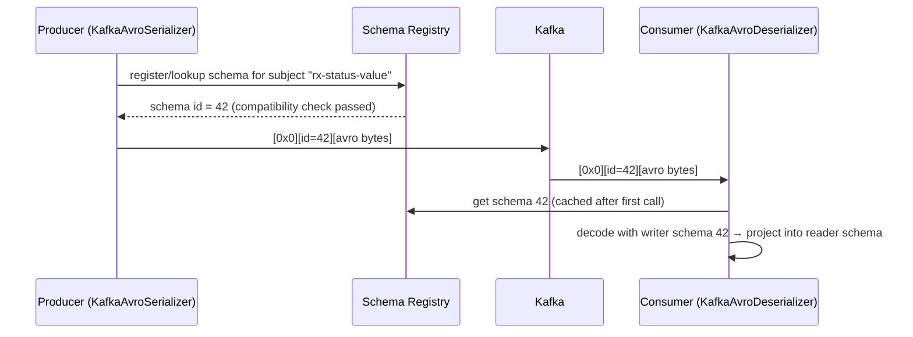

# Schema Management: Avro, Protobuf, JSON Schema & Schema Registry

!!! abstract "Key takeaways"
    - Kafka stores **bytes**. Schemas are an application-level contract, and without governance one producer change can break every consumer.
    - **Schema Registry** stores versioned schemas per **subject**. Serializers register or look up the schema and prefix each message with a small **schema ID** (magic byte `0x0` + 4-byte big-endian ID; Protobuf adds message-index bytes after the ID).
    - **Compatibility modes:** `BACKWARD` (default: new readers can read old data → **upgrade consumers first**), `FORWARD` (old readers can read new data → upgrade producers first), `FULL` (both), plus `_TRANSITIVE` variants against all versions, and `NONE`.
    - Safe evolution: **add optional fields with defaults**. Never rename, change type or reuse fields. Breaking changes go to a new topic or version.
    - **Avro** (compact, strong evolution rules), **Protobuf** (field numbers, great for gRPC shops), **JSON Schema** (readable, larger, weaker evolution).

## Why it matters

"How did you handle schema changes across teams?" is a standard senior question. A producer and its consumers are deployed independently, often by different teams, and the topic retains old messages for days or forever. So at any moment there are **several schema versions in flight**: old data on the log, old consumers still running, new producers rolling out. An unreviewed schema change is one of the most common ways a **poison pill** (a record no consumer can deserialize) ends up on a topic.

Before registries, teams either shipped the full schema with every message (large), shared a JAR of DTOs (tight coupling, lockstep deploys) or used schemaless JSON and found out about breaks in production. A registry plus a compatibility mode turns "did I break anyone?" into a check that runs in CI and again at registration time.

## Core concepts

### How the registry fits in


*Notice that messages carry only a 5-byte prefix inside the record value (not a Kafka record header), not the full schema. The registry rejects incompatible schemas at registration time, before bad data reaches the topic.*

Details worth knowing:

- The **broker never validates** the payload in open-source Kafka. The contract is enforced entirely by the serializer talking to the registry. (Broker-side schema ID validation is a Confluent Server / Confluent Cloud feature, not Apache Kafka.) A producer that bypasses the serializer can still write garbage.
- Schema **IDs are unique per registry** and independent of subject and version. The same schema registered under two subjects gets the same ID. **Versions** are per subject (1, 2, 3...).
- Schema Registry stores its data in a compacted Kafka topic (`_schemas` by default) and runs **single-primary**: one node handles writes, all nodes serve reads.
- Clients **cache** schemas by ID (and IDs by schema), so the registry is not on the hot path for every message. It is only called for a schema or ID the client has not seen.
- Newer Confluent clients (Confluent Platform 8.1+) can optionally carry a 16-byte schema GUID in a **record header** instead of the payload prefix (`value.schema.id.serializer=io.confluent.kafka.serializers.schema.id.HeaderSchemaIdSerializer`). The payload prefix is still the default and what interviewers mean by "the wire format".
- **Writer vs reader schema (Avro):** Avro binary has no field names or tags, so the consumer must decode with the exact schema the producer wrote with (fetched by ID), then *resolve* it into its own reader schema: fields matched by name, missing fields filled from reader defaults, unknown writer fields skipped.

**Subject naming strategies:** `TopicNameStrategy` (default: `<topic>-value`, one schema per topic), `RecordNameStrategy` (per record type; multiple event types per topic), `TopicRecordNameStrategy`.

### Compatibility modes

| Mode | Guarantee | Allowed changes (Avro) | Deploy order |
|---|---|---|---|
| `BACKWARD` (default) | New schema reads data written with the previous one | Delete fields; add fields **with defaults** | Consumers first |
| `FORWARD` | Previous schema reads data written with the new one | Add fields; delete fields **with defaults** | Producers first |
| `FULL` | Both | Add/delete only fields with defaults | Any order |
| `*_TRANSITIVE` | Against **all** previous versions, not just the last | Same | Same |
| `NONE` | No checks | Anything | Coordinated big bang |

The non-transitive modes check the new schema against the **latest registered version only**. Compatibility can be set globally and overridden per subject (`PUT /config/{subject}`).

!!! tip "Practical default"
    `BACKWARD_TRANSITIVE` or `FULL_TRANSITIVE` for long-retention topics, so a new consumer can read *any* historical message during replay. Confluent recommends `BACKWARD_TRANSITIVE` for **Protobuf**, because adding a new message type is not forward compatible. **Kafka Streams** apps need a backward-compatible mode (`BACKWARD`, `BACKWARD_TRANSITIVE`, `FULL`, `FULL_TRANSITIVE`) because they re-read their own changelog/state topics.

### Format comparison

| | Avro | Protobuf | JSON Schema |
|---|---|---|---|
| Encoding | Binary, compact; needs the writer schema to decode | Binary, field-numbered | Text JSON |
| Evolution | Defaults + resolution rules (fields matched by **name**) | Fields matched by **number**; never reuse or renumber, `reserved` removed numbers/names; renaming a field is wire-safe | Weaker; depends on open vs closed content model (`additionalProperties`) |
| Confluent serde | `KafkaAvroSerializer` / `KafkaAvroDeserializer` | `KafkaProtobufSerializer` / `KafkaProtobufDeserializer` | `KafkaJsonSchemaSerializer` / `KafkaJsonSchemaDeserializer` |
| Codegen | Yes (Java SpecificRecord) or GenericRecord | Yes (`protoc`) | Optional |
| Best for | Data pipelines, Kafka-native shops | gRPC + Kafka polyglot orgs | Low-friction, human-readable, web teams |

## In practice: code & configuration

Avro schema (`PrescriptionStatusChanged.avsc`):

```json
{
  "type": "record",
  "name": "PrescriptionStatusChanged",
  "namespace": "com.example.rx.events",
  "fields": [
    {"name": "eventId",        "type": "string"},
    {"name": "prescriptionId", "type": "string"},
    {"name": "status",         "type": {"type": "enum", "name": "RxStatus",
                                         "symbols": ["CREATED","APPROVED","SHIPPED","CANCELLED","UNKNOWN"],
                                         "default": "UNKNOWN"}},
    {"name": "version",        "type": "long"},
    {"name": "pharmacyId",     "type": ["null", "string"], "default": null}
  ]
}
```

*`pharmacyId` was added in v2 as optional with a default, which is backward compatible. The enum `default` (Avro 1.9+) lets old readers map a symbol they don't know to `UNKNOWN` instead of failing. Note that in a `["null", "string"]` union with `"default": null`, put `"null"` **first**: older Avro versions (up to 1.11) require a union default to match the first branch, and Avro 1.12 relaxed this to "the first schema that matches", so null-first is the form that works everywhere.*

```yaml
spring:
  kafka:
    producer:
      value-serializer: io.confluent.kafka.serializers.KafkaAvroSerializer
      properties:
        schema.registry.url: https://schema-registry:8081
        auto.register.schemas: false      # register via CI, not at runtime in prod
        use.latest.version: true
    consumer:
      value-deserializer: org.springframework.kafka.support.serializer.ErrorHandlingDeserializer
      properties:
        spring.deserializer.value.delegate.class: io.confluent.kafka.serializers.KafkaAvroDeserializer
        schema.registry.url: https://schema-registry:8081
        specific.avro.reader: true        # default false = GenericRecord
```

*`auto.register.schemas` defaults to `true`. `use.latest.version` (default `false`) only takes effect when auto-registration is off: the serializer then looks up the latest registered version for the subject instead of the schema derived from the object, and (with `latest.compatibility.strict=true`, the default) checks that the object's schema is backward compatible with it. Without `specific.avro.reader=true` the listener receives a `GenericRecord` and a `ClassCastException` if it expects the generated class. The same `properties` also need registry credentials in a secured setup (`basic.auth.credentials.source`, `basic.auth.user.info`).*

`ErrorHandlingDeserializer` catches the failure inside `poll()` and hands it to the container's error handler, which is what makes a dead-letter topic possible for undeserializable records:

```java
@Bean
DefaultErrorHandler errorHandler(KafkaTemplate<Object, Object> dltTemplate) {
    // dltTemplate must be able to write the raw bytes of the failed record
    // (e.g. a template configured with ByteArraySerializer for the value).
    var recoverer = new DeadLetterPublishingRecoverer(dltTemplate);   // -> <topic>.DLT, same partition, by default
    // DeserializationException is not retried by default, so it goes straight to the recoverer.
    return new DefaultErrorHandler(recoverer, new FixedBackOff(1000L, 2));
}
```

=== "❌ Breaking change"
    ```json
    {"name": "status", "type": "string"}               // was an enum → type change
    {"name": "rxId",   "type": "string"}               // renamed from prescriptionId
    {"name": "copay",  "type": "double"}               // new required field, no default
    ```

=== "✅ Compatible evolution"
    ```json
    {"name": "copay", "type": ["null","double"], "default": null}   // optional + default
    // rename = add the new optional field, populate both, deprecate the old one later (or use Avro aliases)
    // type change = new field or a new event version/topic
    ```

CI gate: run a compatibility check before merge (Confluent's `kafka-schema-registry-maven-plugin` goal `schema-registry:test-compatibility`, a community Gradle plugin, or the registry REST API `POST /compatibility/subjects/{subject}/versions/latest`, which returns `{"is_compatible": true|false}`). Register from the pipeline with the `schema-registry:register` goal or `POST /subjects/{subject}/versions`.

## Real-world usage

- **Data contracts:** companies put schemas in a shared repo with code owners, CI compatibility checks and auto-registration from the pipeline. Producers own their schemas, and consumers review changes.
- **Registries:** Confluent Schema Registry, AWS Glue Schema Registry, Apicurio (Red Hat). Same concepts, different APIs.
- **Healthcare:** schemas document which fields hold PHI, which supports access control, masking and audits.

## Trade-offs & production gotchas

| Option | Pros | Cons | Use when |
|---|---|---|---|
| `TopicNameStrategy` (default) | Simple; one contract per topic; works with ksqlDB/Connect out of the box | One record type per topic | One event type per topic (most cases) |
| `RecordNameStrategy` | Many event types in one topic, ordered by key | Compatibility is checked per record type across **all** topics using it; no per-topic contract | Shared event types reused across topics |
| `TopicRecordNameStrategy` | Many types per topic, each evolving per topic | More subjects to govern | Ordered multi-type streams (e.g. an entity lifecycle) |
| `BACKWARD` | Consumers can always replay old data; default | Consumers must deploy before producers | Most event topics; Kafka Streams |
| `FORWARD` | Producers move first; old consumers keep working | New consumers may not read old data | Producer-driven contracts with slow consumers |
| `FULL_TRANSITIVE` | Any deploy order, any replay | Most restrictive: only optional fields can be added or removed | Long-retention, many independent teams |
| Schemaless JSON (no registry) | Zero setup, readable | No enforcement; large payloads; breaks found in production | Prototypes, single-team internal topics |

!!! warning "Gotchas"
    - `auto.register.schemas=true` in production lets any service register schemas, bypassing review. Disable it and register from CI.
    - Avro **enums without a default** break old consumers when a new symbol is added.
    - Changing the **compatibility mode** later doesn't revalidate existing versions.
    - JSON without a registry ("we just use Jackson") works until a field rename silently becomes `null` downstream.
    - The registry is critical infrastructure: clients cache schemas, but new schema IDs need the registry. Run it highly available.
    - With `auto.register.schemas=false` and no schema registered for the subject, the producer fails at `send()` with a `SerializationException` (subject/schema not found). Register in the pipeline **before** deploying the producer.
    - Compatibility checks are **structural, not semantic**. Changing a field's meaning or unit (cents → dollars) passes every check and still breaks consumers.
    - `BACKWARD` allows **deleting a field without a default**. Old consumers that still read that field then fail on new data, which is why consumers must move first.
    - In Protobuf, reusing a removed field **number** silently misreads old data. Mark removed numbers and names `reserved`.

## How this connects to my experience

- **Where I used it:** Publicis Sapient, project OptumRx Meteor: "Designed Kafka-based event-driven workflows with retry and DLQ handling" and microservices on Java, Spring Boot and Kafka. The resume does not say which serialization format or whether a Schema Registry was used. *[confirm]* At Deloitte (ConvergeHealth Data Asset Explorer) the "event-driven healthcare analytics workflows" were built on AWS (the resume lists SQS and SNS, not Kafka), so use it only as an example of event contracts in general. *[confirm]*
- **Talking points:**
    - Format used (JSON vs Avro) and how schema changes were coordinated across teams. The GraphQL Consumer Service integrated 5 upstream systems, so there is a contract-evolution story on that side too; whether those integrations were Kafka events is not stated. *[confirm]*
    - The DLQ handling from the resume is the natural link: a schema break is exactly what fills a DLQ. Explain how undeserializable records were kept from blocking the partition. *[confirm]*
    - If JSON without a registry: explain what you'd add today (registry, CI checks) and why. That's a strong senior answer.
    - GraphQL parallel: additive, nullable-field evolution and deprecation before removal is the same discipline as `BACKWARD`/`FULL` schema evolution.
- **Likely follow-up chain:** "How did you version events?" → "A producer adds a field. What breaks?" → "Rename a field safely?" → "Who owns the schema?"

## Interview questions

### Fundamentals

??? question "Q1. What problem does Schema Registry solve?"
    **Answer:** A central, versioned contract for message formats. It enforces compatibility rules at registration so producers can't publish breaking changes, and it reduces payload size by sending a schema ID instead of the schema. Kafka itself only sees bytes, so without it the "contract" lives in a wiki or a shared DTO JAR. With it, the serializer registers or looks up the schema under a subject (default `<topic>-value`), writes magic byte + 4-byte ID + payload, and the deserializer fetches the writer schema by ID and caches it.

    **Interviewer listens for:** contract + compatibility enforcement + schema ID on the wire; that enforcement happens in the client serializer and registry, not the broker; caching.

    **Common wrong answer:** "The broker validates messages against the schema." In Apache Kafka it does not. Another one: "the schema is sent with every message."

??? question "Q2. Explain BACKWARD vs FORWARD compatibility."
    **Answer:** BACKWARD: consumers on the new schema can read data from the old schema, so upgrade consumers first. FORWARD: consumers on the old schema can read data from the new schema, so upgrade producers first. FULL: both, so deploy order doesn't matter. Each has a `_TRANSITIVE` variant: the plain mode checks only against the latest registered version, the transitive one against every version, which matters when the topic retains data written with many versions. BACKWARD is the registry default because it guarantees a consumer can always rewind and reprocess what's already on the log.

    **Interviewer listens for:** the direction (which side is "new"), the deploy order that follows from it, and transitive vs non-transitive.

    **Common wrong answer:** Swapping the two, or saying "BACKWARD means old consumers keep working". That is FORWARD.

### Intermediate

??? question "Q3. Which changes are backward compatible in Avro?"
    **Answer:** Adding a field with a default, and deleting a field. Not compatible: adding a required field without a default, changing a type (except allowed promotions like int→long), renaming without aliases. The reasoning comes from Avro schema resolution: the new reader matches writer fields by name, ignores writer fields it doesn't have (so deletes are fine) and needs a default for any field the old writer never wrote (so adds need defaults). Allowed promotions are int→long/float/double, long→float/double, float→double, and string↔bytes. For enums, adding a symbol is backward compatible, and removing one is only safe if the reader enum declares a default.

    **Interviewer listens for:** defaults as the mechanism, the "why" from reader/writer resolution, and awareness that deleting a field is backward but not forward compatible unless it had a default.

    **Common wrong answer:** "Adding any field is safe" or "making the field nullable is enough". A `["null","string"]` union without `"default": null` is still a required field for resolution purposes.

??? question "Q4. Avro vs Protobuf vs JSON Schema?"
    **Answer:** Avro: compact, schema-resolution rules, great Kafka ecosystem support. Protobuf: compact, field numbers, strong tooling and gRPC alignment. JSON Schema: human-readable and easy to adopt, but larger payloads and looser evolution. Choose by ecosystem and governance needs. The key mechanical difference: Avro matches fields by **name** and needs the exact writer schema to decode, so a registry is practically mandatory. Protobuf matches by **field number**, is self-delimiting enough to decode without the writer schema, tolerates unknown fields, and makes renames free but number reuse fatal. JSON Schema validates rather than encodes, and its compatibility depends on whether the model is open or closed (`additionalProperties`).

    **Interviewer listens for:** a decision rule, not a feature list. For example: Avro for Kafka/data-lake pipelines (Connect, Spark, Flink support), Protobuf where the org already has `.proto` contracts for gRPC, JSON Schema when the producers are web/Node teams or payloads must stay human-readable.

    **Common wrong answer:** "Avro is always smaller/faster than Protobuf" stated as fact, or "JSON Schema gives the same guarantees".

??? question "Q5. How do you rename a field safely?"
    **Answer:** Add the new optional field, have producers write both, migrate consumers to the new one, then remove the old field once no consumer reads it (with compatibility checks at each step). Avro aliases can map old names on the reader side. This is the expand/contract (parallel change) pattern, the same one used for database column renames. Wait for the old field's removal until the retention window has passed or consumers no longer replay data that only has the old field. Aliases help only readers that use the new schema, and not every non-Java client honours them, so I don't rely on them as the migration plan. In Protobuf a rename is wire-compatible because only the field number is encoded (but it breaks JSON mappings and generated code).

    **Interviewer listens for:** expand → migrate → contract, in separately deployable steps; awareness of retained old data.

    **Common wrong answer:** "Just rename it and bump the version" or "set compatibility to NONE for the release".

### Senior

??? question "Q6. How do you handle a truly breaking change?"
    **Answer:** Introduce a new event version: a new topic (`rx-status.v2`) or a new record type with RecordNameStrategy. Dual-publish v1 and v2 during migration, migrate consumers, then retire v1. Communicate through the event catalogue and deprecation timeline. Details I'd call out: dual publishing must be atomic with the state change (transactional outbox, or one Kafka transaction covering both topics), otherwise v1 and v2 diverge. Alternatively keep the producer on v2 only and run a small translator service that down-converts v2 → v1 for laggards. Decide whether to backfill v2 from history so new consumers can replay. Track consumer-group lag on v1 and retire it when the last group has moved. I would not flip the subject to `NONE`, register and flip back: that leaves a version in the subject that old data and old readers can't cross.

    **Interviewer listens for:** new topic/subject rather than disabling checks; a migration window with dual publish or translation; atomicity; an explicit retirement criterion.

    **Common wrong answer:** "Temporarily set compatibility to NONE" or "coordinate a big-bang deploy of all consumers".

??? question "Q7. Multiple event types on one topic: what are the schema implications?"
    **Answer:** Use `RecordNameStrategy` / `TopicRecordNameStrategy`, or a union schema, so each type evolves independently. Keeping related events on one topic preserves ordering for the same key across types (e.g. all prescription lifecycle events). Trade-offs: with `TopicNameStrategy` the topic's single subject would force every type through one compatibility lineage, which fails as soon as a second unrelated record is registered. `RecordNameStrategy` uses the fully qualified record name as the subject, so the same type is checked identically across every topic. `TopicRecordNameStrategy` (`<topic>-<record name>`) scopes it per topic. The alternative that keeps `TopicNameStrategy` is a top-level union using **schema references**, which also gives the registry an explicit list of the types allowed in the topic. Consumers must then dispatch on type (e.g. `@KafkaListener` at class level with `@KafkaHandler` methods) and handle unknown types gracefully. Set `value.subject.name.strategy` on producer and consumer alike.

    **Interviewer listens for:** ordering as the reason to co-locate; the three strategies and what the subject name becomes; unions with schema references; consumer-side dispatch.

    **Common wrong answer:** "One topic per event type, always." That loses cross-type ordering for an entity.

??? question "Q8. Should producers auto-register schemas in production?"
    **Answer:** Usually no. With `auto.register.schemas=true` any producer build can register a new version, so an accidental change goes live on the first send. In production, set `auto.register.schemas=false` and `use.latest.version=true` (or pin a version). Register schemas from CI after a compatibility check (`mvn schema-registry:test-compatibility` or the REST `/compatibility` endpoint). Then a breaking change fails the pipeline, not the consumers.

    **Interviewer listens for:** CI-driven registration, compatibility check before deploy, auto-register off, ownership of the subject.

    **Common wrong answer:** "Compatibility mode protects us, so auto-registration is fine." Compatibility only checks against the chosen rule; `NONE` or a wrong subject strategy still lets bad schemas in.

### Scenario-based

??? question "Q9. A producer deployed a change and all consumers started failing deserialization. Response?"
    **Answer:** Immediate: roll back the producer. Consumers with `ErrorHandlingDeserializer` + DLT keep flowing (bad records parked). Replay the parked records after a fix. Prevent it with a registry, compatibility mode, CI compatibility checks, disabling runtime auto-registration, and contract tests between teams. In order:

    1. Triage: read the exception. `SerializationException` / "Could not find class" / "Error deserializing Avro message for id N" tells me whether it's an incompatible schema, a missing schema, or a non-registry payload. Check the subject's latest versions and who registered them.
    2. Stop the bleeding: roll back or pause the producer.
    3. Unblock consumers: without `ErrorHandlingDeserializer` the exception is thrown from `poll()` before the listener and the consumer loops on the same offset forever, so lag grows on that partition. If that's the state, either deploy the error-handling deserializer + DLT, or as a last resort move the group's offsets past the bad range with `kafka-consumer-groups --reset-offsets` (group must be stopped) after copying the bad records aside.
    4. Recover: the bad records stay on the log, so decide whether a patched consumer can read them or whether they must be re-published in the correct format from the source, and replay the DLT.
    5. If a bad schema version was registered, soft-delete that version so `use.latest.version` clients stop picking it up.
    6. Post-incident: CI gate, `auto.register.schemas=false`, restrict registry write access, alert on DLT rate.

    **Interviewer listens for:** contain first, then recover data, then prevent; knowing that a deserialization failure blocks the partition without `ErrorHandlingDeserializer`; that rolling back the producer does not remove bad records already written.

    **Common wrong answer:** "Roll back the producer and it's fixed", or "restart the consumers".

??? question "Q10. Schema Registry is down. What still works and what breaks?"
    **Answer:** Producers and consumers keep working for every schema already in their local cache, because the registry is only called for an unseen schema (producer side) or unseen ID (consumer side). What breaks: a freshly started or restarted client (cold cache), the first message with a new schema version, and any registration or CI compatibility check. Those calls fail and surface as a `SerializationException` from `send()` or from `poll()`. So an outage is often invisible until a deploy or a rebalance-triggered restart, and then it looks like an application failure. Mitigation: run several registry instances behind a load balancer and list them all in `schema.registry.url` (comma-separated). The registry is single-primary: any node serves reads, writes go to the primary, and its state lives in the compacted `_schemas` topic, so that topic needs replication factor 3 and must never be deleted or have its cleanup policy changed. For DR, replicate schemas to the second cluster (Schema Linking or replicating `_schemas`), because consumers there can't decode by ID otherwise.

    **Interviewer listens for:** client-side caching; cold start as the failure point; reads vs writes; `_schemas` as the source of truth; HA setup.

    **Common wrong answer:** "Everything stops" or the opposite, "nothing is affected because Kafka doesn't depend on it".

??? question "Q11. How does a consumer on schema v1 read a message written with v3? Walk through it."
    **Answer:** The consumer reads the first 5 bytes: magic byte `0x0` and the 4-byte schema ID. It looks the ID up in its cache or fetches it from the registry (`GET /schemas/ids/{id}`). That is the **writer schema**. Avro binary carries no field names or tags, only values in schema order, so decoding is impossible without the exact writer schema. The decoder then applies **schema resolution** against the consumer's **reader schema** (the generated `SpecificRecord` class when `specific.avro.reader=true`, otherwise the writer schema itself as a `GenericRecord`): fields are matched by name (or reader alias), writer-only fields are skipped, reader-only fields take the reader's default, and types may be promoted (int→long). If a reader-only field has no default, or a type can't be promoted, resolution fails with an `AvroTypeException`. A compatibility mode is simply the registry running this same resolution check ahead of time: BACKWARD = "can the new schema, as reader, resolve the old as writer", FORWARD = the reverse.

    **Interviewer listens for:** writer vs reader schema; why Avro needs the writer schema; resolution rules; connecting compatibility modes to resolution.

    **Common wrong answer:** "The consumer downloads the latest schema and uses that." The ID in the message, not "latest", decides the writer schema.

??? question "Q12. Who owns the schema, and how do you govern changes across teams?"
    **Answer:** The **producing team owns** the event schema, because the event describes facts in their domain, but consumers are stakeholders. In practice: schemas live in version control (in the producer repo or a shared contracts repo) with CODEOWNERS so consuming teams are reviewers. The pipeline runs the compatibility check against the registry on every PR, and registers the schema on merge, before the producer deploys. Runtime clients run with `auto.register.schemas=false` and read-only registry credentials, so the only write path is the pipeline. Compatibility mode is set per subject (stricter, transitive modes for long-retention or widely consumed topics). Add documentation in the schema (`doc` fields, PII/PHI tags) and a deprecation policy: fields are deprecated with notice, removed only after consumers confirm. Because registry checks are structural only, semantic changes (units, meaning, nullability in practice) still need review and consumer-driven contract tests.

    **Interviewer listens for:** clear ownership; schema-as-code with review; CI gate + pipeline registration; locked-down runtime; semantic vs structural compatibility.

    **Common wrong answer:** "A central platform team approves every schema" (a bottleneck) or "consumers own it".

## Cheat sheet

| Concept | Remember |
|---|---|
| Wire format | Magic byte `0x0` + 4-byte schema ID + payload (5-byte prefix in the value) |
| Subject (default) | `TopicNameStrategy` → `<topic>-key` / `<topic>-value` |
| FORWARD | Old readers read new data → upgrade producers first |
| Registry storage | Compacted `_schemas` topic, single-primary writes |
| Registry down | Cached schemas keep working; cold starts and new schemas fail |
| Protobuf | Never reuse field numbers; `reserved`; prefer `BACKWARD_TRANSITIVE` |
| Avro nullable | `["null","T"]` with `"default": null`, null first (portable across Avro versions) |
| Default mode | BACKWARD → upgrade consumers first |
| Long retention | Use `_TRANSITIVE` modes |
| Safe change | Add optional field with default |
| Prod setting | `auto.register.schemas=false`, register via CI |
| Breaking change | New version/topic + dual publish |

## Sources

1. [Confluent: Schema Evolution and Compatibility](https://docs.confluent.io/platform/current/schema-registry/fundamentals/schema-evolution.html): compatibility modes, allowed changes, upgrade order, `BACKWARD` default, Protobuf and Kafka Streams recommendations.
2. [Apache Avro specification: Schema Resolution](https://avro.apache.org/docs/1.12.0/specification/#schema-resolution): reader/writer resolution, defaults, type promotions, enum defaults, aliases.
3. [Protocol Buffers: Updating a message type](https://protobuf.dev/programming-guides/proto3/#updating): field-number rules and `reserved`.
4. [Confluent: Formats, serializers and deserializers (wire format)](https://docs.confluent.io/platform/current/schema-registry/fundamentals/serdes-develop/index.html#wire-format): magic byte + schema ID, Protobuf message indexes, header-based schema ID, subject name strategies, `auto.register.schemas` / `use.latest.version` defaults.
5. [AWS Glue Schema Registry](https://docs.aws.amazon.com/glue/latest/dg/schema-registry.html): the AWS-native alternative.
6. [Confluent: Schema Registry API reference](https://docs.confluent.io/platform/current/schema-registry/develop/api.html): `/compatibility`, `/subjects`, `/config` and `/schemas/ids` endpoints.
7. [Spring for Apache Kafka: Handling deserialization exceptions](https://docs.spring.io/spring-kafka/reference/kafka/serdes.html#error-handling-deserializer): `ErrorHandlingDeserializer` and delegate properties.
